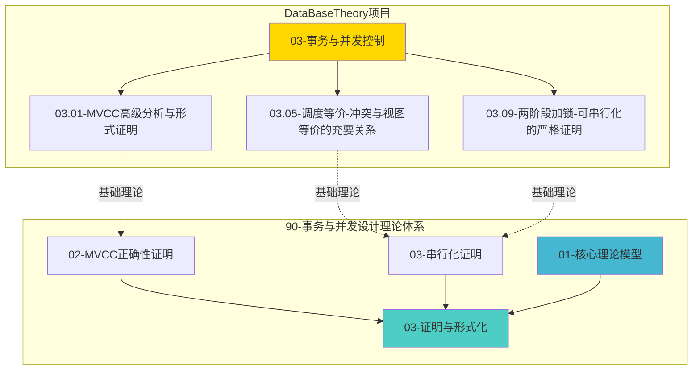

# 【模块关联整合报告】2025-12-18

> **完成时间**：2025-12-18
> **状态**：✅ **关联关系已建立**

---

## 🎯 整合目标

建立 `90-事务与并发设计理论体系` 模块与 `DataBaseTheory` 项目其他模块（特别是 `03-事务与并发控制`）的关联和引用关系，形成完整的知识体系。

---

## ✅ 已完成的关联整合

### 1. 串行化证明模块关联

**文件**: `90-事务与并发设计理论体系/03-证明与形式化/03-串行化证明.md`

**添加内容**:

- 在"冲突串行化与视图串行化的关系"章节添加了对 `03.05-调度等价-冲突与视图等价的充要关系.md` 的引用
- 明确标注了基础理论来源

**关联关系**:

```
90-事务与并发设计理论体系/03-证明与形式化/03-串行化证明.md
    ↓ 引用
03-事务与并发控制/03.05-调度等价-冲突与视图等价的充要关系.md
```

---

### 2. 调度等价文档反向关联

**文件**: `03-事务与并发控制/03.05-调度等价-冲突与视图等价的充要关系.md`

**添加内容**:

- 在"相关文档"章节添加了"90-事务与并发设计理论体系相关文档"部分
- 引用了以下文档：
  - 串行化证明
  - MVCC正确性证明
  - 核心理论模型

**关联关系**:

```
03-事务与并发控制/03.05-调度等价-冲突与视图等价的充要关系.md
    ↓ 引用
90-事务与并发设计理论体系/03-证明与形式化/03-串行化证明.md
90-事务与并发设计理论体系/03-证明与形式化/02-MVCC正确性证明.md
90-事务与并发设计理论体系/01-核心理论模型/README.md
```

---

### 3. 证明与形式化模块README更新

**文件**: `90-事务与并发设计理论体系/03-证明与形式化/README.md`

**添加内容**:

- 在"与其他模块的关联"章节添加了与 `03-事务与并发控制/` 模块的关联说明
- 列出了关键的基础理论文档：
  - 03.05-调度等价-冲突与视图等价的充要关系.md
  - 03.01-MVCC高级分析与形式证明.md
  - 03.09-两阶段加锁-可串行化的严格证明.md

---

## 📊 关联关系图



---

## 🔗 关键关联点

### 1. 调度等价理论

**基础文档**: `03-事务与并发控制/03.05-调度等价-冲突与视图等价的充要关系.md`

- 严格证明冲突等价和视图等价的充要关系
- 提供形式化定义和定理证明

**应用文档**: `90-事务与并发设计理论体系/03-证明与形式化/03-串行化证明.md`

- 基于调度等价理论进行串行化证明
- 将理论应用到MVCC实现

### 2. MVCC理论

**基础文档**: `03-事务与并发控制/03.01-MVCC高级分析与形式证明.md`

- MVCC的高级分析和形式化证明
- PostgreSQL实现细节

**应用文档**: `90-事务与并发设计理论体系/03-证明与形式化/02-MVCC正确性证明.md`

- 基于基础理论进行MVCC正确性证明
- 提供完整的Coq/TLA+形式化代码

### 3. 两阶段加锁理论

**基础文档**: `03-事务与并发控制/03.09-两阶段加锁-可串行化的严格证明.md`

- 2PL可串行化的严格证明

**应用文档**: `90-事务与并发设计理论体系/03-证明与形式化/03-串行化证明.md`

- 在串行化证明中引用2PL理论

---

## 📝 后续建议

### 短期优化（1-3个月）

1. **完善其他文档的关联**:
   - 在 `03-事务与并发控制` 模块的其他文档中添加对 `90-事务与并发设计理论体系` 的引用
   - 在 `90-事务与并发设计理论体系` 的相关文档中添加对 `03-事务与并发控制` 的引用

2. **建立概念映射**:
   - 确保两个模块中的概念定义一致
   - 建立概念词典的交叉引用

### 中期扩展（3-6个月）

1. **统一术语表**:
   - 创建统一的术语表，涵盖两个模块的所有概念
   - 确保术语使用的一致性

2. **知识图谱**:
   - 构建两个模块之间的知识图谱
   - 可视化概念和文档之间的关联关系

---

## 🎉 完成总结

**关联整合状态**: ✅ **已完成**

- ✅ 建立了 `90-事务与并发设计理论体系` 与 `03-事务与并发控制` 的双向关联
- ✅ 在关键文档中添加了交叉引用
- ✅ 更新了模块README，明确标注了关联关系
- ✅ 形成了完整的知识体系关联网络

**下一步**: 继续完善其他文档的关联关系，建立更完整的知识体系。

---

**完成时间**：2025-12-18
**下次更新**：持续优化中
