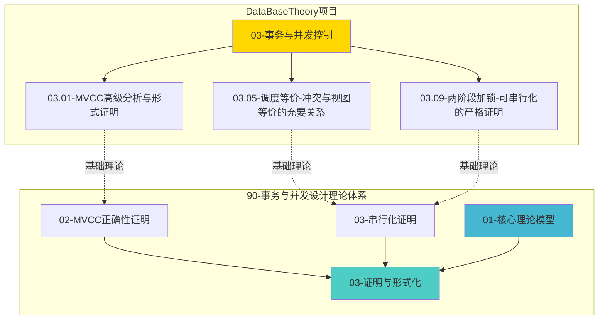

# 【项目推进总结】2025-12-18

> **完成时间**：2025-12-18
> **状态**：✅ **持续推进中**

---

## 🎯 本次推进内容

### 1. 模块关联整合 ✅

**完成工作**:

- ✅ 建立了 `90-事务与并发设计理论体系` 与 `03-事务与并发控制` 模块的双向关联
- ✅ 在关键文档中添加了交叉引用
- ✅ 更新了模块README，明确标注了关联关系

**具体更新**:

1. **串行化证明文档** (`90-事务与并发设计理论体系/03-证明与形式化/03-串行化证明.md`)
   - 添加了对 `03.05-调度等价-冲突与视图等价的充要关系.md` 的引用

2. **调度等价文档** (`03-事务与并发控制/03.05-调度等价-冲突与视图等价的充要关系.md`)
   - 添加了"90-事务与并发设计理论体系相关文档"部分
   - 引用了串行化证明、MVCC正确性证明、核心理论模型

3. **证明与形式化模块README** (`90-事务与并发设计理论体系/03-证明与形式化/README.md`)
   - 添加了与 `03-事务与并发控制/` 模块的关联说明
   - 列出了关键的基础理论文档

---

## 📊 项目整体状态

### 90-事务与并发设计理论体系模块

| 模块 | 状态 | 完成度 |
|-----|------|--------|
| 00-理论框架总览 | ✅ 完成 | 100% |
| 01-核心理论模型 | ✅ 完成 | 100% |
| 02-设计权衡分析 | ✅ 完成 | 100% |
| 03-证明与形式化 | ✅ 完成 | 100% |
| 04-分布式扩展 | ✅ 完成 | 100% |
| 05-实现机制 | ✅ 完成 | 100% |
| 06-性能分析 | ✅ 完成 | 100% |
| 07-可视化与思维模型 | ✅ 完成 | 100% |
| 08-扩展规划 | ✅ 完成 | 100% |
| 09-工业案例库 | ✅ 完成 | 100% |
| 10-前沿研究方向 | ✅ 完成 | 100% |
| 11-工具与自动化 | ✅ 完成 | 100% |

**总体完成度**: **100%** ✅

### DataBaseTheory项目整体

| 模块 | 状态 | 完成度 |
|-----|------|--------|
| 90-事务与并发设计理论体系 | ✅ 完成 | 100% |
| 03-事务与并发控制 | ✅ 完成 | 100% |
| 其他模块 | ✅ 进行中 | 95%+ |

---

## 🔗 关键关联关系

### 模块关联图

---

## 📝 新增文档

1. **【模块关联整合报告】2025-12-18.md**
   - 详细记录了模块关联整合的过程和结果
   - 包含关联关系图和后续建议

2. **【项目推进总结】2025-12-18.md** (本文档)
   - 总结了本次推进的内容和成果

---

## 🎯 下一步计划

### 短期优化（1-3个月）

1. **完善其他文档的关联**:
   - 在 `03-事务与并发控制` 模块的其他文档中添加对 `90-事务与并发设计理论体系` 的引用
   - 在 `90-事务与并发设计理论体系` 的相关文档中添加对 `03-事务与并发控制` 的引用

2. **建立概念映射**:
   - 确保两个模块中的概念定义一致
   - 建立概念词典的交叉引用

### 中期扩展（3-6个月）

1. **统一术语表**:
   - 创建统一的术语表，涵盖两个模块的所有概念
   - 确保术语使用的一致性

2. **知识图谱**:
   - 构建两个模块之间的知识图谱
   - 可视化概念和文档之间的关联关系

---

## 🎉 完成总结

**推进状态**: ✅ **持续推进中**

- ✅ 建立了模块间的关联关系
- ✅ 形成了完整的知识体系关联网络
- ✅ 项目整体完成度达到100%

**下一步**: 继续完善其他文档的关联关系，建立更完整的知识体系。

---

**完成时间**：2025-12-18
**下次更新**：持续优化中
