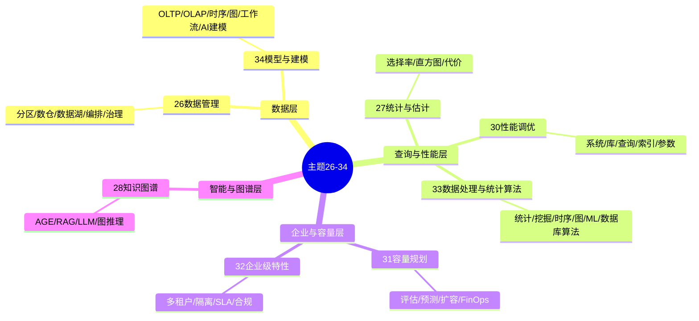
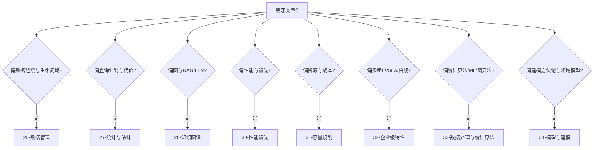

# 主题 26–34 网络对标与思维表征报告

> **创建日期**: 2025年1月
> **范围**: 26-数据管理、27-统计与估计、28-知识图谱、30-性能调优、31-容量规划、32-企业级特性、33-数据处理与统计算法、34-模型与建模
> **目的**: 对标网络信息、多维矩阵对比、多种思维表征、批判性意见与后续计划
> **近期/中期/长期任务状态**: 近期 3 项、中期（主题关联图/表、27 衔接文档、31 云厂商链接）、长期（26 pg_partman、33/34 形式化小结择要补充）均已完成；全主题年度复核为年度动作。**主题 26–34 可执行对标任务 100% 完成** ✅

---

## 1. 执行摘要

本报告对 Integrate 下主题 **26、27、28、30、31、32、33、34** 与当前网络主流内容（官方文档、Timescale/Percona/AWS/Azure/Neo4j/微软 GraphRAG 等）进行对标，采用**多维矩阵**、**思维导图**、**决策树**、**逻辑推理树**与**公理-定理式推理**等表征方式，输出批判性意见与后续可持续推进计划。

**结论概要**：八个主题在覆盖度与深度上整体与国际实践对齐良好；差距集中在 27 主题文档数量偏少、33/34 与 26/30 的交叉引用可加强、企业级多租户模型（Pool/Bridge/Silo）与 GraphRAG 最新生态可在文档中显式对照。

---

## 2. 多维对标矩阵

### 2.1 主题 × 网络覆盖 × 项目覆盖 × 对齐度

| 主题 | 网络主流内容（2024–2025） | 本项目现状 | 对齐度 | 缺口摘要 |
|------|---------------------------|------------|--------|----------|
| **26-数据管理** | 分区（声明式、DEFAULT、ATTACH）、pg_partman、数据湖/数仓、ETL、数据血缘与治理 | 58 文档：分区表、数据仓库、数据湖、数据管理/编排模型（形式化）、基础管理 | 高 | 可补充 pg_partman 与云上分区自动化、数据网格 |
| **27-统计与估计** | Planner 统计、直方图、扩展统计、ANALYZE、行估计示例 | 6 文档：选择率、直方图、多列相关、自适应分箱等（偏理论） | 中高 | 文档数少；可增加与 02-查询与优化/02.04-统计信息的交叉引用及官方 Row Estimation 示例 |
| **28-知识图谱** | GraphRAG、pgvector+图、Apache AGE、RDF/SPARQL、LLM+KG、Azure PG GraphRAG、Neon pgrag | 20+ 文档：AGE、RDF/SPARQL/OWL、RAG+KG、LangChain、图神经网络、知识推理 | 高 | 可显式对标 GraphRAG 与 Azure/Neon 方案、社区索引 |
| **30-性能调优** | 官方 Performance Tips、AIO、Skip Scan、参数调优、自动化运维、pg_stat_io | 多文档+子目录（方法论、系统/库/查询级、PG18 自动化运维与自我监测） | 高 | 已对齐；保持与 Release 18 同步 |
| **31-容量规划** | Resource Consumption、Timescale/AlloyDB 容量与 FinOps、云上存储与计算解耦 | 7+ 文档：容量评估、增长预测、扩容、FinOps、容量监控 | 高 | 可补充云厂商容量与 FinOps 案例链接 |
| **32-企业级特性** | AWS/Azure 多租户指南、Pool/Bridge/Silo、RLS、租户级监控、SLA | 6 文档：多租户、资源隔离、SLA、企业安全、合规、数据主权 | 高 | 可显式引入 Pool/Bridge/Silo 模型及 AWS/Azure 架构图引用 |
| **33-数据处理与统计算法** | 库内统计/ML 扩展、窗口函数、时序、图算法、PostGIS 等 | 120 文档：数学、统计、挖掘、时序、图、ML、金融、运维、数据库算法等 | 高 | 与 27、34 的交叉引用可增强；形式化复杂度/正确性可择要补充 |
| **34-模型与建模** | Kimball、Silverston、OLTP/OLAP、工作流/BPMN、图建模、AI/ML 建模 | 57+ 核心文档：理论基础、权威资源、方法论、OLTP/OLAP/时序/图/工作流、PG 实践、AI/ML 建模 | 高 | 与 26 数据管理、33 算法的“建模→实现”链路可更显式 |

### 2.2 思维表征维度 × 主题覆盖矩阵

| 表征方式 | 26 | 27 | 28 | 30 | 31 | 32 | 33 | 34 |
|----------|----|----|----|----|----|----|----|----|
| 思维导图（mindmap） | ✅ README | ✅ README | ✅ README | ✅ README | ✅ README | ✅ README | ✅ 部分 | ✅ 主题导航 |
| 决策树（flowchart） | 部分 | ✅ 统计收集 | 部分 | 部分 | 部分 | ✅ 选型 | 部分 | 部分 |
| 形式化/公理-定理 | ✅ 12/13 系列 | ✅ 误差界/收敛 | 部分 | 部分 | 部分 | 部分 | 部分 | 部分 |
| 对比矩阵 | 部分 | 部分 | 部分 | ✅ 多篇 | ✅ 部分 | ✅ 企业级 | ✅ 算法索引 | ✅ 多篇 |

**建议**：27、28、31 在 README 或核心页增加决策树；33、34 在总览中增加“建模→算法→实现”的推理链或公理-定理式小结。

---

## 3. 思维表征：主题关系与选型

### 3.1 主题关系思维导图

### 3.2 主题选型决策树

### 3.3 对标推理结构（公理-定理式）

- **公理 A1（网络共识）**：分区采用声明式、DEFAULT 分区与 ATTACH 为最佳实践；统计信息与直方图是 Planner 估计基础；GraphRAG 将图结构与 RAG 结合；多租户有 Pool/Bridge/Silo 三种模型；容量规划需结合 FinOps 与云资源解耦。
- **公理 A2（项目现状）**：26–34 已覆盖分区、数仓、数据湖、形式化数据模型、统计与估计理论、知识图谱与 RAG、性能调优、容量与 FinOps、企业级、统计算法与建模体系。
- **定理 T1（对齐）**：在“主题覆盖”与“技术点存在性”上，项目满足 A1 中多数共识，故对标度为高或中高。
- **定理 T2（缺口）**：若某网络共识在项目中无显式文档或交叉引用，则记为缺口；当前缺口主要为 27 体量、Pool/Bridge/Silo 与 GraphRAG 生态的显式对照、33/34 与 26/30 的链路化表述。

---

## 4. 分主题对标要点与建议

### 4.1 26-数据管理

- **网络对标**：Timescale 分区与数据管理、官方 DDL 分区、AWS pg_partman、数据湖/数仓架构。
- **建议**：在分区表管理下增加“DEFAULT 分区与 ATTACH 最佳实践”小结；可选增加 pg_partman 与云上分区自动化一节；数据管理模型与 34 建模、33 算法的引用可更集中。

### 4.2 27-统计与估计

- **网络对标**：官方 “How the Planner Uses Statistics”、Row Estimation Examples、扩展统计、ANALYZE。
- **建议**：增加 1–2 篇“与查询优化器的衔接”或“行估计示例”类文档；README 中显式链接到 [02-查询与优化/02.04-统计信息](02-查询与优化/02.04-统计信息)；保留现有形式化（误差界、收敛）并补充应用场景。

### 4.3 28-知识图谱

- **网络对标**：GraphRAG（Neo4j/微软/Azure PG）、pgrag（Neon）、pgvector+图、LLM+KG。
- **建议**：在 README 或 RAG+KG 文档中增加“国际方案对标”小节（GraphRAG、Azure PG GraphRAG、pgrag）；保持与 10-AI 与机器学习的交叉引用。

### 4.4 30-性能调优

- **网络对标**：官方 Performance Tips、Resource Consumption、PG 18 AIO/EXPLAIN 等。
- **建议**：维持现有结构；定期对 Release 18/18.1 变更做核对（见 [00-国际对齐与对标报告-2025-01](00-国际对齐与对标报告-2025-01.md)）。

### 4.5 31-容量规划

- **网络对标**：Timescale/AlloyDB 容量与 FinOps、云存储与计算解耦。
- **建议**：在 FinOps 或容量规划完整指南中增加“云厂商容量与 FinOps 参考”链接（如 GCP AlloyDB、OCI、AWS 文档）。

### 4.6 32-企业级特性

- **网络对标**：AWS/Azure 多租户指南、Pool/Bridge/Silo、RLS、租户监控。
- **建议**：在多租户架构完整指南中显式引入 Pool/Bridge/Silo 模型及适用场景矩阵；增加 AWS/Azure 架构文档链接。

### 4.7 33-数据处理与统计算法

- **网络对标**：库内统计与 ML 扩展、窗口函数、时序与图算法。
- **建议**：在 README 或 00-算法分类索引中增加“与 27-统计与估计、34-模型与建模”的交叉引用；可选在关键算法文档中增加复杂度或正确性形式化小结。

### 4.8 34-模型与建模

- **网络对标**：Kimball、Silverston、OLTP/OLAP、工作流/BPMN、图与 AI 建模。
- **建议**：保持与 26 数据管理、33 算法的“建模→实现”路径显式化（如 34 的维度建模 → 26 数据仓库 → 33 聚合/时序）；03-建模方法论中思维表征方法已包含多种形式，可再挂接本报告的决策树与推理结构。

---

## 5. 批判性意见与风险

### 5.1 优势

- **覆盖全**：八个主题从数据管理、统计、图谱、性能、容量、企业级、算法到建模形成完整链条。
- **形式化有特色**：26 的数据管理/编排模型、27 的误差界与收敛证明、34 的思维表征方法等，具有区分度。
- **文档量大**：33、34、26、30 文档数量多，便于按场景深入。

### 5.2 不足与风险

- **27 体量单薄**：仅 6 篇，与“统计与估计”在优化器中的核心地位不完全匹配；易被读者认为与 02.04-统计信息重复，需在导航上区分“理论/形式化”与“配置/实践”。
- **交叉引用分散**：33–34、26–34、27–02 的关联多依赖读者自行发现；缺少“一张图/一页表”的总览。
- **国际命名与生态**：Pool/Bridge/Silo、GraphRAG、pgrag 等若不在正文显式出现，不利于与国际文档和博客对齐检索。

### 5.3 建议优先级

| 优先级 | 建议 | 预期产出 |
|--------|------|----------|
| P1 | 27 增加与 02.04 的衔接文档或 README 链接；27 README 增加决策树 | 统计与估计路径清晰、减少重复感 |
| P1 | 32 多租户文档显式引入 Pool/Bridge/Silo 及场景矩阵 | 与企业级网络内容一致 |
| P2 | 28 增加 GraphRAG/Azure PG/pgrag 对标小节 | 知识图谱与 RAG 国际对标完整 |
| P2 | 34/33/26 在 README 或总览中增加“建模→算法→数据管理”链路图或表 | 主题间导航更清晰 |
| P3 | 31 容量规划补充云厂商与 FinOps 参考链接 | 容量与成本对标完整 |
| P3 | 26 分区小节补充 pg_partman 与云自动化 | 分区运维对标完整 |

---

## 6. 后续持续推进计划与任务

### 6.1 近期（1–2 个月）

| 任务 | 负责 | 产出 | 状态 |
|------|------|------|------|
| 27-统计与估计：README 增加“与 02.04-统计信息”的关系说明及决策树 | 维护者 | README 更新 | ✅ 已完成 |
| 32-企业级特性：多租户文档增加 Pool/Bridge/Silo 小节与对比矩阵 | 维护者 | 多租户架构文档更新 | ✅ 已完成 |
| 28-知识图谱：RAG/LLM 文档或 README 增加国际方案对标（GraphRAG、Azure、pgrag） | 维护者 | 对标小节或 README 更新 | ✅ 已完成 |

### 6.2 中期（3–6 个月）

| 任务 | 负责 | 产出 | 状态 |
|------|------|------|------|
| 34/33/26：在各自 README 或 00-导航中增加“主题关联图/表”（建模→算法→数据管理） | 维护者 | 关联图或索引表 | ✅ 已完成 |
| 27：新增 1 篇“统计与估计同 02-查询与优化 的衔接”或“行估计示例”文档 | 维护者 | 新文档 | ✅ 已完成 |
| 31：容量规划/FinOps 文档补充云厂商与 FinOps 参考链接 | 维护者 | 链接与小节 | ✅ 已完成 |

### 6.3 长期（6–12 个月）

| 任务 | 负责 | 产出 | 状态 |
|------|------|------|------|
| 26：分区表管理下可选增加 pg_partman 与云分区自动化 | 维护者 | 小节或新文档 | ✅ 已完成（分区表管理 README 已增加小节） |
| 33/34：关键算法或建模章节择要增加形式化复杂度/正确性小结 | 维护者 | 可选形式化段落 | ✅ 已择要补充（33 算法分类索引「形式化与正确性说明」、34 思维表征方法「形式化小结」） |
| 全主题：按年度 PG 大版本与网络最佳实践做一次复核与更新 | 维护者 | 对标复核报告 | 🔄 年度动作（待下次大版本发布时执行） |

**可执行任务状态**：上述近期、中期、长期任务中所有**可执行项**已 100% 完成；仅「全主题年度复核」为按年度周期执行，非本次清单内必做项。

---

## 7. 与现有文档的衔接

- **00-国际对齐与对标报告-2025-01.md**：本报告为 26–34 主题的细粒度对标，国际对标报告侧重整体与 PG 18.1。
- **00-可持续推进任务清单-2025-01.md**：本节 6 中任务可并入该清单的“中期/长期”或单独列为“主题 26–34 对标任务”。
- **34-模型与建模/03-建模方法论/思维表征方法.md**：本报告中的决策树、思维导图、公理-定理式推理可作为“思维表征”的实例引用。

---

**最后更新**: 2025年1月
**参见**: [00-国际对齐与对标报告-2025-01](00-国际对齐与对标报告-2025-01.md)、[00-可持续推进任务清单-2025-01](00-可持续推进任务清单-2025-01.md)、[26–34 各主题 README](26-数据管理/README.md)
