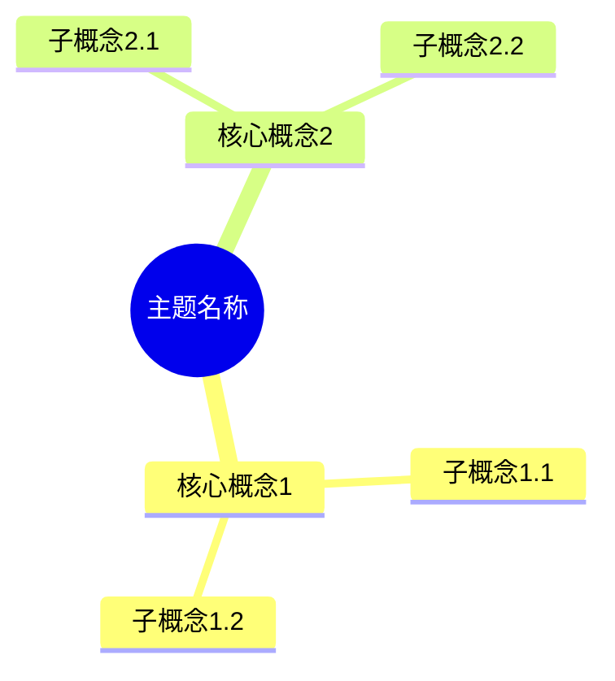
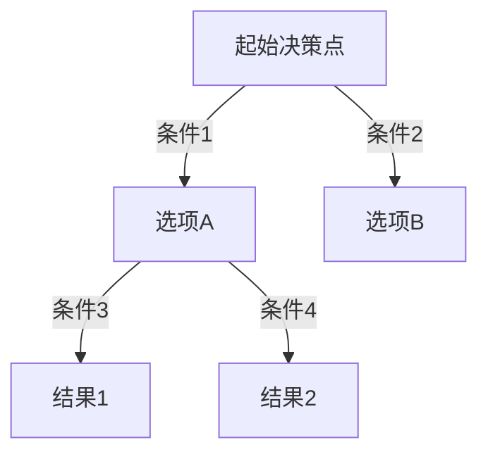
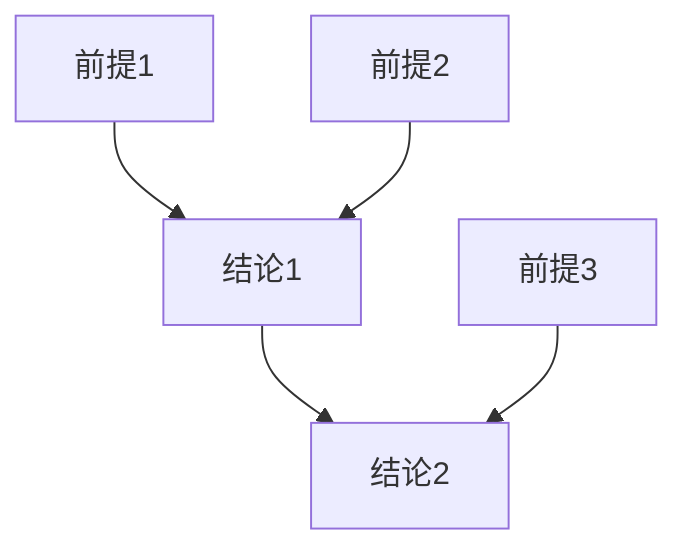

# Integrate目录全面梳理计划

> **创建日期**: 2025年1月
> **目标**: 全面递归梳理所有内容,补充完善,对齐网络信息,集成多种思维表达方式

---

## 📊 现状分析

### 目录结构统计

- **主题目录总数**: 33个
- **总文档数**: 977个（包含README）
- **内容文档数**: 963+个
- **已包含思维导图的文档**: 约150个文件（约15%）
- **已包含对比矩阵的文档**: 约50个文件（约5%）

### 思维表达方式覆盖率

| 思维表达方式 | 当前覆盖率 | 目标覆盖率 | 优先级 |
|------------|----------|----------|--------|
| 思维导图 (Mindmap) | ~15% | 80%+ | P0 |
| 多维矩阵对比 | ~5% | 60%+ | P0 |
| 决策图网 (Decision Tree) | ~10% | 50%+ | P1 |
| 证明图网 (Proof Network) | ~3% | 30%+ | P2 |
| 架构UML图 | ~8% | 40%+ | P1 |
| 流程图 | ~12% | 45%+ | P1 |

---

## 🎯 梳理目标

### 1. 内容完整性

- ✅ 每个主题目录必须有完整的README
- ✅ 关键概念必须有形式化定义
- ✅ 每个技术点必须有理论基础和实际应用
- ✅ 重要文档必须有参考文献和对标资源

### 2. 思维表达方式

#### 2.1 思维导图 (Mindmap)

**应用场景**:

- 知识体系结构
- 主题关联关系
- 技术栈组成
- 学习路径

**目标文档**:

- 所有主题的README
- 所有核心概念文档
- 所有架构设计文档

#### 2.2 多维矩阵对比

**应用场景**:

- 技术方案对比
- 工具选型对比
- 性能特征对比
- 适用场景对比

**目标文档**:

- 对比分析主题
- 部署方案文档
- 技术选型文档
- 性能优化文档

#### 2.3 决策图网 (Decision Tree)

**应用场景**:

- 技术选型决策
- 场景适用性判断
- 实施路径选择
- 故障诊断路径

**目标文档**:

- 技术选型指南
- 场景分析文档
- 故障诊断文档
- 部署方案文档

#### 2.4 证明图网 (Proof Network)

**应用场景**:

- 形式化论证
- 理论证明
- 逻辑推理
- 正确性验证

**目标文档**:

- 理论体系文档
- 形式化方法文档
- MVCC/ACID证明文档
- 查询语义文档

#### 2.5 架构UML图

**应用场景**:

- 系统架构设计
- 组件关系
- 数据流
- 部署架构

**目标文档**:

- 架构设计文档
- 系统设计文档
- 部署架构文档

---

## 📋 梳理计划

### 阶段1: 核心基础类 (P0)

#### 1.1 01-核心基础

- [ ] 为README添加知识体系思维导图
- [ ] 为系统架构文档补充架构UML图
- [ ] 为数据模型文档添加对比矩阵
- [ ] 为SQL语言文档添加学习路径思维导图

#### 1.2 02-查询与优化

- [ ] 为查询优化器文档补充决策图网
- [ ] 为索引文档添加多维对比矩阵
- [ ] 为执行计划文档添加流程图
- [ ] 为性能调优文档添加决策树

#### 1.3 03-事务与并发

- [ ] 为MVCC文档补充证明图网
- [ ] 为ACID文档添加形式化证明图
- [ ] 为隔离级别文档添加对比矩阵
- [ ] 为并发控制文档添加决策树

### 阶段2: 存储与安全类 (P0)

#### 2.1 04-存储与恢复

- [ ] 为存储管理文档添加架构图
- [ ] 为备份恢复文档添加决策树
- [ ] 为WAL文档添加流程图
- [ ] 补充存储方案对比矩阵

#### 2.2 05-安全与合规

- [ ] 为安全架构文档添加思维导图
- [ ] 为访问控制文档添加决策图
- [ ] 为加密文档添加对比矩阵
- [ ] 为合规文档添加评估矩阵

### 阶段3: 高级特性类 (P1)

#### 3.1 06-扩展系统

- [ ] 为扩展开发文档添加架构图
- [ ] 为插件系统文档添加对比矩阵
- [ ] 添加扩展选型决策树

#### 3.2 07-多模型数据库

- [ ] 为多模型文档添加知识体系思维导图
- [ ] 为向量数据库文档添加技术对比矩阵
- [ ] 为图数据库文档添加选型决策树
- [ ] 为时序数据库文档添加架构图

#### 3.3 08-流处理与时序

- [ ] 添加时序数据库对比矩阵
- [ ] 添加流处理架构图
- [ ] 添加选型决策树

#### 3.4 09-逻辑复制

- [ ] 添加复制方案对比矩阵
- [ ] 添加复制架构图
- [ ] 添加故障诊断决策树

### 阶段4: AI与机器学习类 (P0)

#### 4.1 10-AI与机器学习

- [ ] 完善向量处理思维导图
- [ ] 补充RAG架构图
- [ ] 添加AI工具对比矩阵
- [ ] 添加AI场景决策树
- [ ] 补充性能优化证明图

### 阶段5: 部署运维类 (P1)

#### 5.1 11-部署架构

- [ ] 添加部署方案对比矩阵
- [ ] 添加部署架构UML图
- [ ] 添加部署选型决策树

#### 5.2 12-监控与诊断

- [ ] 添加监控方案对比矩阵
- [ ] 添加诊断决策树
- [ ] 添加监控架构图

#### 5.3 13-高可用架构

- [ ] 添加高可用方案对比矩阵
- [ ] 添加高可用架构图
- [ ] 添加故障切换决策树
- [ ] 添加灾难恢复流程图

#### 5.4 14-云原生与容器化

- [ ] 添加云原生架构图
- [ ] 添加容器化方案对比矩阵
- [ ] 添加云平台选型决策树

### 阶段6: 分布式系统类 (P1)

#### 6.1 15-分布式系统

- [ ] 添加分布式架构图
- [ ] 补充CAP理论证明图
- [ ] 添加一致性模型对比矩阵
- [ ] 添加分布式选型决策树

### 阶段7: 应用开发类 (P1)

#### 7.1 16-应用设计与开发

- [ ] 添加应用架构图
- [ ] 添加开发模式对比矩阵
- [ ] 添加技术选型决策树

#### 7.2 17-数据模型设计

- [ ] 添加数据模型对比矩阵
- [ ] 添加建模方法决策树
- [ ] 添加范式证明图

#### 7.3 18-版本特性

- [ ] 添加版本特性对比矩阵
- [ ] 添加迁移决策树
- [ ] 添加新特性应用场景图

### 阶段8: 实战案例类 (P2)

#### 8.1 19-实战案例

- [ ] 为典型案例添加架构图
- [ ] 添加场景选型决策树
- [ ] 添加案例对比矩阵

#### 8.2 20-故障诊断案例

- [ ] 添加诊断流程决策树
- [ ] 添加故障分类矩阵
- [ ] 添加诊断路径图

#### 8.3 21-最佳实践

- [ ] 添加实践对比矩阵
- [ ] 添加实践选择决策树

### 阶段9: 工具资源类 (P2)

#### 9.1 22-工具与资源

- [ ] 添加工具对比矩阵
- [ ] 添加工具选型决策树

#### 9.2 23-对比分析

- [ ] 完善对比分析矩阵
- [ ] 添加选型决策树
- [ ] 添加分析流程图

### 阶段10: 迁移与理论类 (P1)

#### 10.1 24-迁移指南

- [ ] 添加迁移路径决策树
- [ ] 添加迁移方案对比矩阵

#### 10.2 25-理论体系

- [ ] 完善形式化证明图
- [ ] 添加理论体系思维导图
- [ ] 添加理论关系图网

### 阶段11: 数据管理类 (P1)

#### 11.1 26-数据管理

- [ ] 添加数据管理模型图
- [ ] 添加管理方案对比矩阵
- [ ] 添加管理流程决策树

#### 11.2 27-统计与估计

- [ ] 添加统计方法对比矩阵
- [ ] 添加估计方法决策树

#### 11.3 28-知识图谱

- [ ] 添加知识图谱架构图
- [ ] 添加图谱构建决策树
- [ ] 添加本体建模矩阵

### 阶段12: 企业级特性类 (P1)

#### 12.1 32-企业级特性

- [ ] 添加企业级特性架构图
- [ ] 添加多租户方案对比矩阵
- [ ] 添加SLA管理决策树
- [ ] 添加合规评估矩阵

---

## 🌐 网络内容对齐

### 对齐目标

1. **官方文档对齐**
   - PostgreSQL官方文档最新版本
   - pgvector、pgai等扩展官方文档
   - PostgreSQL 18新特性官方说明

2. **学术资源对齐**
   - SIGMOD、VLDB等顶级会议论文
   - 数据库理论权威教材
   - 形式化方法研究论文

3. **行业实践对齐**
   - AWS、Google Cloud、Azure最佳实践
   - 企业案例研究
   - 开源项目文档

4. **社区资源对齐**
   - PostgreSQL社区wiki
   - Stack Overflow热门问题
   - GitHub优秀项目

### 对齐方法

1. **版本更新**: 确保所有文档标注PostgreSQL版本
2. **功能对齐**: 补充新版本特性说明
3. **实践对齐**: 补充最新最佳实践
4. **案例对齐**: 补充最新企业案例

---

## 📊 思维表达方式模板

### 思维导图模板

### 多维矩阵模板

| 维度1 | 维度2 | 维度3 | 维度4 | 维度5 |
|------|------|------|------|------|
| 选项A | 值A1 | 值A2 | 值A3 | 值A4 |
| 选项B | 值B1 | 值B2 | 值B3 | 值B4 |

### 决策树模板

### 证明图模板

---

## 📅 实施计划

### 第1周: 核心基础类 (01-03)

- 完成思维导图添加
- 完成对比矩阵补充
- 完成架构图绘制

### 第2周: 存储安全类 (04-05) + AI类 (10)

- 完成存储安全文档梳理
- 完成AI类文档完善
- 完成决策树添加

### 第3周: 高级特性类 (06-09)

- 完成扩展系统文档
- 完成多模型数据库文档
- 完成流处理时序文档

### 第4周: 部署运维类 (11-14)

- 完成部署架构文档
- 完成监控诊断文档
- 完成高可用文档
- 完成云原生文档

### 第5周: 其他主题类

- 完成分布式系统文档
- 完成应用开发文档
- 完成实战案例文档

### 第6周: 理论体系与总结

- 完成理论体系文档
- 完成网络内容对齐
- 完成最终验证和总结

---

## ✅ 质量标准

### 内容质量标准

1. **完整性**: 每个主题必须有完整的知识体系
2. **准确性**: 所有技术信息必须准确
3. **时效性**: 所有版本信息必须更新到最新
4. **可读性**: 文档结构清晰,易于理解

### 思维表达质量标准

1. **准确性**: 图表必须准确反映内容
2. **清晰性**: 图表必须清晰易懂
3. **完整性**: 图表必须覆盖关键概念
4. **美观性**: 图表格式统一,美观大方

---

## 📈 进度跟踪

- [ ] 阶段1: 核心基础类
- [ ] 阶段2: 存储与安全类
- [ ] 阶段3: 高级特性类
- [ ] 阶段4: AI与机器学习类
- [ ] 阶段5: 部署运维类
- [ ] 阶段6: 分布式系统类
- [ ] 阶段7: 应用开发类
- [ ] 阶段8: 实战案例类
- [ ] 阶段9: 工具资源类
- [ ] 阶段10: 迁移与理论类
- [ ] 阶段11: 数据管理类
- [ ] 阶段12: 企业级特性类

---

**最后更新**: 2025年1月
**状态**: 🔄 进行中
**预计完成时间**: 6周
