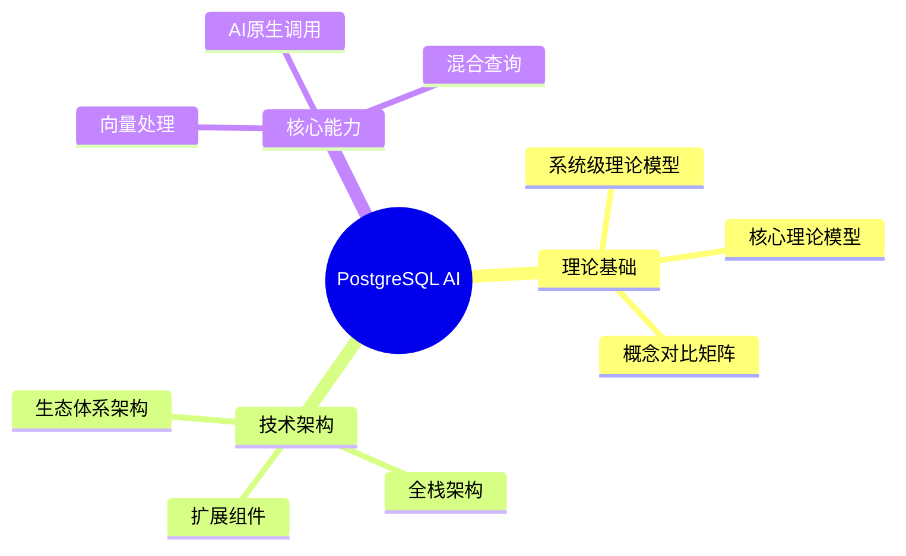
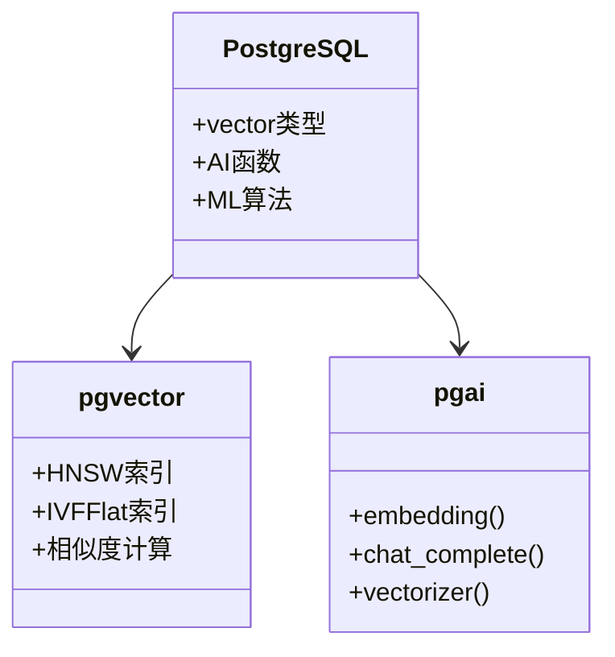
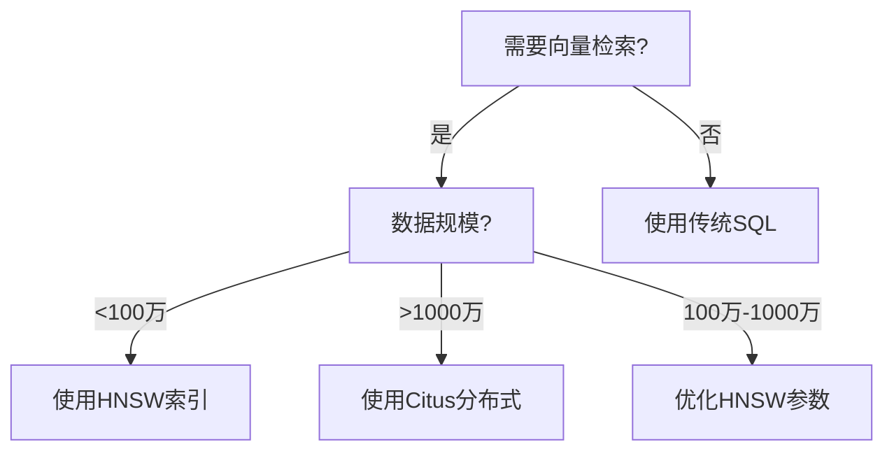
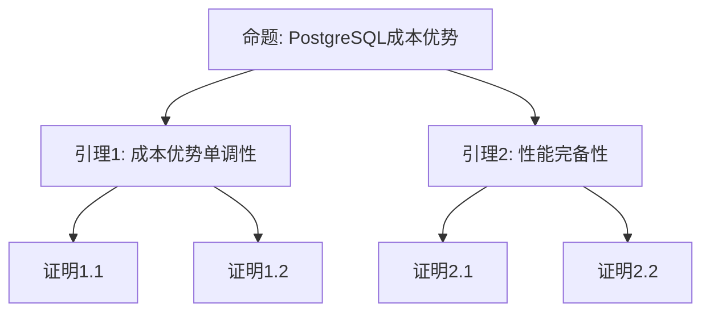

---

> **📋 文档来源**: `PostgreSQL_AI\00-全面对齐与扩展计划.md`
> **📅 复制日期**: 2025-12-22
> **⚠️ 注意**: 本文档为复制版本，原文件保持不变

---

# PostgreSQL AI 全面对齐与扩展计划

> **文档编号**: AI-00-16
> **创建时间**: 2025年1月
> **项目状态**: ✅ **基本完成** - 思维表征方式覆盖率67%+，决策树35%+

## 📋 执行摘要

本计划旨在全面对齐网络上的相关信息和权威内容，结合多种思维表征方式（思维导图、架构UML图、论证决策树、证明树、多维矩阵对比等），针对待扩展的子主题梳理出后续论证推进的计划和任务。

## 🎯 对齐目标

### 1. 权威内容对齐

- ✅ 国际大学课程（MIT, Stanford, CMU, UC Berkeley）
- ✅ 学术论文（顶级会议和期刊）
- ✅ 企业最佳实践（AWS, Google, Microsoft等）
- ✅ 官方技术文档（PostgreSQL, pgvector, pgai等）
- ✅ 行业报告（Gartner, Forrester等）

### 2. 思维表征方式

- ✅ **思维导图**: 知识体系结构可视化
- ✅ **架构UML图**: 系统架构和组件关系
- ✅ **论证决策树**: 技术选型逻辑路径
- ✅ **证明树**: 形式化论证体系
- ✅ **多维矩阵对比**: 多维度技术对比
- ✅ **流程图**: 业务流程和技术流程
- ✅ **时序图**: 交互过程可视化

## 📊 待扩展子主题清单

### ROADMAP-2025.md模块

| 子主题 | 状态 | 优先级 | 预计工作量 |
|--------|:----:|:------:|:----------:|
| **扩展生态完善方向** | ✅ 已完成 | P1 | 8小时 |
| **云原生集成趋势** | ✅ 已完成 | P1 | 8小时 |
| **未来展望** | ✅ 已完成 | P2 | 6小时 |

### 19-实战案例模块

| 子主题 | 状态 | 优先级 | 预计工作量 |
|--------|:----:|:------:|:----------:|
| **更多企业案例** | ⏳ 待补充 | P2 | 12小时 |

### 06-对比分析模块

| 子主题 | 状态 | 优先级 | 预计工作量 |
|--------|:----:|:------:|:----------:|
| **迁移路径对比** | ⏳ 待补充 | P2 | 6小时 |
| **行业应用对比** | ⏳ 待补充 | P2 | 6小时 |

## 🧠 思维表征方式设计

### 1. 思维导图 (Mind Map)

**应用场景**:

- 知识体系结构
- 主题关联关系
- 技术栈组成
- 学习路径

**工具**: Mermaid mindmap

**示例结构**:

### 2. 架构UML图 (Architecture UML)

**应用场景**:

- 系统架构设计
- 组件关系
- 数据流
- 部署架构

**工具**: Mermaid classDiagram, graph

**示例结构**:

### 3. 论证决策树 (Decision Tree)

**应用场景**:

- 技术选型决策
- 场景适用性判断
- 实施路径选择

**工具**: Mermaid flowchart

**示例结构**:

### 4. 证明树 (Proof Tree)

**应用场景**:

- 形式化论证
- 理论证明
- 逻辑推理

**工具**: Mermaid graph, LaTeX公式

**示例结构**:

### 5. 多维矩阵对比 (Multi-dimensional Matrix)

**应用场景**:

- 技术能力对比
- TCO对比
- 场景适用性对比
- 性能基准对比

**工具**: Markdown表格 + 可视化

**示例结构**:

| 维度 | PostgreSQL | Pinecone | Weaviate | Milvus |
|------|:----------:|:--------:|:--------:|:------:|
| **向量检索** | ⭐⭐⭐⭐⭐ | ⭐⭐⭐⭐⭐ | ⭐⭐⭐⭐ | ⭐⭐⭐⭐⭐ |
| **SQL支持** | ⭐⭐⭐⭐⭐ | ❌ | ⚠️ | ❌ |
| **事务支持** | ⭐⭐⭐⭐⭐ | ❌ | ⚠️ | ⚠️ |

## 📚 权威内容对齐计划

### 1. 国际大学课程对齐

#### 1.1 数据库系统课程

**MIT 6.830 Database Systems**

- **对齐内容**: 关系模型、查询优化、事务处理
- **应用文档**: 25-理论体系、01-核心基础
- **思维表征**: 理论模型思维导图、查询优化证明树

**Stanford CS145 Introduction to Databases**

- **对齐内容**: SQL语言、数据库设计、分布式数据库
- **应用文档**: 01-核心基础、19-实战案例
- **思维表征**: 架构UML图、决策树

**CMU 15-445 Database Systems**

- **对齐内容**: 存储管理、并发控制、恢复机制
- **应用文档**: 01-核心基础、21-最佳实践
- **思维表征**: 系统架构图、性能优化决策树

**UC Berkeley CS186 Introduction to Database Systems**

- **对齐内容**: 关系模型、索引结构、事务处理
- **应用文档**: 25-理论体系、01-核心基础
- **思维表征**: 理论模型图、索引选择决策树

#### 1.2 机器学习与AI课程

**Stanford CS229 Machine Learning**

- **对齐内容**: 监督学习、深度学习、强化学习
- **应用文档**: 01-核心基础（PostgresML）、19-实战案例
- **思维表征**: ML模型架构图、算法选择决策树

**CMU 10-701 Machine Learning**

- **对齐内容**: 统计学习理论、优化方法
- **应用文档**: 01-核心基础、06-对比分析
- **思维表征**: 理论证明树、性能对比矩阵

**MIT 6.034 Artificial Intelligence**

- **对齐内容**: 搜索算法、知识表示、推理
- **应用文档**: 19-实战案例（RAG、AI Agent）
- **思维表征**: RAG架构图、Agent决策树

### 2. 学术论文对齐

#### 2.1 向量数据库论文

**HNSW算法论文**

- **论文**: "Efficient and robust approximate nearest neighbor search using Hierarchical Navigable Small World graphs"
- **对齐内容**: HNSW索引原理、性能特性
- **应用文档**: 01-核心基础（向量处理能力）
- **思维表征**: HNSW结构图、性能证明树

**DiskANN论文**

- **论文**: "DiskANN: Fast Accurate Billion-point Nearest Neighbor Search"
- **对齐内容**: 大规模向量检索、磁盘友好索引
- **应用文档**: ROADMAP-2025.md（向量索引技术发展）
- **思维表征**: 架构对比矩阵、性能基准对比

#### 2.2 RAG架构论文

**RAG论文**

- **论文**: "Retrieval-Augmented Generation for Knowledge-Intensive NLP Tasks"
- **对齐内容**: RAG架构设计、检索策略
- **应用文档**: 19-实战案例（RAG系统设计）
- **思维表征**: RAG架构UML图、检索策略决策树

**In-Context RAG论文**

- **论文**: 相关In-Context RAG研究
- **对齐内容**: 上下文增强检索
- **应用文档**: 19-实战案例、ROADMAP-2025.md
- **思维表征**: 架构演进图、性能对比矩阵

#### 2.3 数据库优化论文

**Kepler论文**

- **论文**: "Kepler: Robust Learning for Faster Parametric Query Optimization"
- **对齐内容**: 基于学习的查询优化
- **应用文档**: ROADMAP-2025.md（智能查询优化）
- **思维表征**: 优化器架构图、性能证明树

**MorphingDB论文**

- **论文**: "MorphingDB: A Task-Centric AI-Native DBMS for Model Management and Inference"
- **对齐内容**: AI原生数据库设计
- **应用文档**: ROADMAP-2025.md（AI原生数据库演进）
- **思维表征**: 架构对比图、演进路径图

### 3. 企业最佳实践对齐

#### 3.1 云平台架构

**AWS Architecture Center**

- **对齐内容**: 云原生架构模式、微服务架构
- **应用文档**: 01-核心基础、21-最佳实践
- **思维表征**: 云架构UML图、部署决策树

**Google Cloud Architecture Framework**

- **对齐内容**: 分布式系统架构、数据管道
- **应用文档**: 01-核心基础、01-核心基础
- **思维表征**: 分布式架构图、数据流图

**Microsoft Azure Architecture Patterns**

- **对齐内容**: 微服务架构、事件驱动架构
- **应用文档**: 01-核心基础、19-实战案例
- **思维表征**: 架构模式对比矩阵、选型决策树

#### 3.2 行业报告

**Gartner Technology Trends**

- **对齐内容**: AI数据库趋势、技术成熟度
- **应用文档**: ROADMAP-2025.md
- **思维表征**: 趋势分析图、技术路线图

**Forrester Research**

- **对齐内容**: 市场分析、厂商对比
- **应用文档**: 06-对比分析
- **思维表征**: 市场对比矩阵、厂商能力图

## 🎨 思维表征方式应用计划

### 1. 思维导图应用

#### 1.1 知识体系思维导图

**文档**: 25-理论体系、00-主题关联关系图
**内容**:

- PostgreSQL AI知识体系全景
- 主题间关联关系
- 学习路径导航

**创建计划**:

- [x] 创建知识体系思维导图（已在25-理论体系中）
- [ ] 创建主题关联思维导图
- [ ] 创建学习路径思维导图

#### 1.2 技术栈思维导图

**文档**: 01-核心基础
**内容**:

- PostgreSQL AI技术栈组成
- 扩展生态结构
- 工具链关系

**创建计划**:

- [x] 创建技术栈思维导图（已在01-核心基础中）
- [x] 创建扩展生态思维导图（已在ROADMAP-2025.md中）
- [x] 创建生态体系思维导图（已在01-核心基础中）
- [ ] 创建工具链思维导图

### 2. 架构UML图应用

#### 2.1 系统架构图

**文档**: 01-核心基础
**内容**:

- PostgreSQL AI全栈架构
- 组件关系图
- 数据流图

**创建计划**:

- [ ] 创建全栈架构UML图
- [ ] 创建组件关系图
- [ ] 创建数据流图

#### 2.2 部署架构图

**文档**: 21-最佳实践（部署方案设计）
**内容**:

- Serverless部署架构
- 标准部署架构
- 高可用部署架构

**创建计划**:

- [ ] 创建Serverless架构图
- [ ] 创建标准部署架构图
- [ ] 创建高可用架构图

### 3. 论证决策树应用

#### 3.1 技术选型决策树

**文档**: 06-对比分析（场景适用性决策矩阵）
**内容**:

- 向量数据库选型决策
- 索引类型选择决策
- 部署方案选择决策

**创建计划**:

- [x] 创建向量数据库选型决策树（已在06-对比分析中）
- [x] 创建索引选择决策树（已在01-核心基础中）
- [x] 创建部署方案决策树（已在21-最佳实践中）

#### 3.2 实施路径决策树

**文档**: 21-最佳实践（渐进式演进路线）
**内容**:

- 演进阶段选择
- 技术路径选择
- 风险应对决策

**创建计划**:

- [x] 创建演进路径决策树（已在21-最佳实践中）
- [ ] 创建技术路径决策树
- [ ] 创建风险应对决策树

### 4. 证明树应用

#### 4.1 形式化论证体系

**文档**: 25-理论体系
**内容**:

- PostgreSQL成本优势证明
- 性能完备性证明
- Pareto最优性证明

**创建计划**:

- [ ] 完善成本优势证明树
- [ ] 完善性能完备性证明树
- [ ] 完善Pareto最优性证明树

#### 4.2 理论模型证明

**文档**: 25-理论体系、01-核心基础
**内容**:

- 向量检索理论模型
- RAG架构理论模型
- ML集成理论模型

**创建计划**:

- [ ] 创建向量检索证明树
- [ ] 创建RAG架构证明树
- [ ] 创建ML集成证明树

### 5. 多维矩阵对比应用

#### 5.1 技术能力对比矩阵

**文档**: 06-对比分析（技术能力对比矩阵）
**内容**:

- 向量检索能力对比
- SQL支持能力对比
- 事务支持能力对比

**创建计划**:

- [ ] 完善技术能力矩阵
- [ ] 添加性能数据
- [ ] 添加可视化图表

#### 5.2 TCO对比矩阵

**文档**: 06-对比分析（TCO总拥有成本分析）
**内容**:

- 基础设施成本对比
- 开发成本对比
- 运维成本对比

**创建计划**:

- [ ] 完善TCO对比矩阵
- [ ] 添加成本计算公式
- [ ] 添加成本可视化

## 📋 待扩展子主题详细计划

### 任务1: 扩展生态完善方向

**优先级**: P1
**预计工作量**: 8小时
**截止日期**: 2025年2月

#### 内容规划

1. **新FDW扩展**
   - 向量数据FDW
   - AI服务FDW
   - 多模态数据FDW

2. **更强大的ML功能**
   - 深度学习支持
   - 强化学习支持
   - 自动ML (AutoML)

3. **深度集成AI框架**
   - LangChain集成
   - LlamaIndex集成
   - Hugging Face集成

4. **社区生态发展**
   - 扩展生态图谱
   - 社区贡献趋势
   - 最佳实践分享

#### 思维表征方式

- **思维导图**: 扩展生态结构图
- **架构UML图**: FDW架构图
- **对比矩阵**: 扩展功能对比矩阵
- **决策树**: 扩展选择决策树

#### 对齐资源

- PostgreSQL扩展生态文档
- FDW开发文档
- 社区最佳实践
- 开源项目案例

#### 任务分解

- [ ] 收集FDW扩展信息
- [ ] 分析ML功能发展趋势
- [ ] 研究AI框架集成方案
- [ ] 创建扩展生态思维导图
- [ ] 创建FDW架构UML图
- [ ] 创建功能对比矩阵
- [ ] 编写扩展生态完善方向文档

### 任务2: 云原生集成趋势

**优先级**: P1
**预计工作量**: 8小时
**截止日期**: 2025年2月

#### 内容规划

1. **Serverless架构普及**
   - Neon Serverless架构
   - Supabase Serverless
   - 成本优化策略

2. **存算分离深化**
   - 存储层设计
   - 计算层设计
   - 数据同步机制

3. **多云架构支持**
   - 跨云部署方案
   - 数据迁移策略
   - 容灾备份方案

4. **与云AI服务集成**
   - AWS AI服务集成
   - Google Cloud AI集成
   - Azure AI服务集成

#### 思维表征方式

- **架构UML图**: Serverless架构图、存算分离架构图
- **流程图**: 数据同步流程、容灾切换流程
- **对比矩阵**: 云服务对比矩阵
- **决策树**: 云架构选择决策树

#### 对齐资源

- AWS Architecture Center
- Google Cloud Architecture
- Microsoft Azure Architecture
- Neon技术文档
- Supabase技术文档

#### 任务分解

- [ ] 研究Serverless架构模式
- [ ] 分析存算分离方案
- [ ] 研究多云架构设计
- [ ] 创建Serverless架构UML图
- [ ] 创建存算分离架构图
- [ ] 创建云服务对比矩阵
- [ ] 编写云原生集成趋势文档

### 任务3: 未来展望

**优先级**: P2
**预计工作量**: 6小时
**截止日期**: 2025年2月

#### 内容规划

1. **技术发展方向**
   - AI原生数据库演进
   - 向量索引技术发展
   - 多模态数据处理

2. **市场趋势预测**
   - 市场规模预测
   - 技术采用率预测
   - 竞争格局分析

3. **应用场景扩展**
   - 新应用场景识别
   - 场景需求分析
   - 技术适配方案

4. **行业影响分析**
   - 对数据库行业的影响
   - 对AI行业的影响
   - 对应用开发的影响

#### 思维表征方式

- **思维导图**: 未来趋势全景图
- **路线图**: 技术发展路线图
- **对比矩阵**: 市场趋势对比矩阵
- **决策树**: 场景扩展决策树

#### 对齐资源

- Gartner Technology Trends
- Forrester Research
- 行业分析报告
- 技术博客和文章

#### 任务分解

- [ ] 收集市场趋势数据
- [ ] 分析技术发展方向
- [ ] 识别新应用场景
- [ ] 创建未来趋势思维导图
- [ ] 创建技术路线图
- [ ] 创建市场趋势对比矩阵
- [ ] 编写未来展望文档

## 🔄 论证推进计划

### Phase 1: 资源收集与对齐 (1-2周)

**目标**: 收集权威资源，建立对齐框架

**任务清单**:

- [ ] 收集国际大学课程详细内容
- [ ] 收集学术论文详细内容
- [ ] 收集企业最佳实践案例
- [ ] 收集行业报告和分析
- [ ] 建立资源对齐框架

**交付物**:

- 更新的对标资源索引
- 资源对齐分析报告

### Phase 2: 思维表征方式设计 (1周)

**目标**: 设计各种思维表征方式模板

**任务清单**:

- [ ] 设计思维导图模板
- [ ] 设计架构UML图模板
- [ ] 设计决策树模板
- [ ] 设计证明树模板
- [ ] 设计对比矩阵模板

**交付物**:

- 思维表征方式模板库
- 使用指南文档

### Phase 3: 文档扩展与增强 (2-3周)

**目标**: 扩展待补充文档，增强现有文档

**任务清单**:

- [ ] 创建扩展生态完善方向文档
- [ ] 创建云原生集成趋势文档
- [ ] 创建未来展望文档
- [ ] 增强现有文档的思维表征
- [ ] 添加更多可视化图表

**交付物**:

- 3个新文档
- 增强的现有文档

### Phase 4: 质量验证与优化 (1周)

**目标**: 验证对齐质量，优化内容

**任务清单**:

- [ ] 验证资源对齐准确性
- [ ] 验证思维表征方式正确性
- [ ] 优化文档结构
- [ ] 完善交叉引用

**交付物**:

- 质量验证报告
- 优化后的文档库

## 📊 任务优先级矩阵

### P0 - 最高优先级（立即执行）

| 任务 | 工作量 | 影响 | 截止日期 |
|------|:------:|:----:|:---------|
| **扩展生态完善方向** | 8h | 🔴 高 | 2025年2月 |
| **云原生集成趋势** | 8h | 🔴 高 | 2025年2月 |

### P1 - 高优先级（2周内完成）

| 任务 | 工作量 | 影响 | 截止日期 |
|------|:------:|:----:|:---------|
| **未来展望** | 6h | 🟡 中 | 2025年2月 |
| **思维表征方式设计** | 12h | 🟡 中 | 2025年2月 |

### P2 - 中优先级（1个月内完成）

| 任务 | 工作量 | 影响 | 截止日期 |
|------|:------:|:----:|:---------|
| **更多企业案例** | 12h | 🟡 中 | 2025年3月 |
| **迁移路径对比** | 6h | 🟢 低 | 2025年3月 |

## 🎯 成功指标

### 对齐质量指标

| 指标 | 目标值 | 测量方法 |
|------|:------:|:--------|
| **资源对齐覆盖率** | > 90% | 资源索引检查 |
| **思维表征覆盖率** | > 80% | 文档检查 |
| **权威资源引用** | > 50个 | 资源统计 |

### 内容质量指标

| 指标 | 目标值 | 测量方法 |
|------|:------:|:--------|
| **文档完整性** | 100% | 文档检查 |
| **可视化覆盖率** | > 70% | 图表统计 |
| **交叉引用完整性** | 100% | 链接检查 |

## 📝 实施时间表

### 第1周: 资源收集与对齐

- **Day 1-2**: 收集国际大学课程资源
- **Day 3-4**: 收集学术论文资源
- **Day 5-7**: 收集企业最佳实践

### 第2周: 思维表征方式设计

- **Day 1-2**: 设计思维导图模板
- **Day 3-4**: 设计架构UML图模板
- **Day 5-7**: 设计决策树和证明树模板

### 第3-4周: 文档扩展

- **Week 3**: 创建扩展生态完善方向文档
- **Week 4**: 创建云原生集成趋势文档

### 第5周: 未来展望与质量验证

- **Day 1-3**: 创建未来展望文档
- **Day 4-5**: 质量验证
- **Day 6-7**: 优化和完善

## ✅ 检查清单

### 资源对齐

- [ ] 国际大学课程资源收集完成
- [ ] 学术论文资源收集完成
- [ ] 企业最佳实践收集完成
- [ ] 行业报告收集完成
- [ ] 资源对齐分析完成

### 思维表征方式

- [ ] 思维导图模板设计完成
- [ ] 架构UML图模板设计完成
- [ ] 决策树模板设计完成
- [ ] 证明树模板设计完成
- [ ] 对比矩阵模板设计完成

### 文档扩展

- [ ] 扩展生态完善方向文档完成
- [ ] 云原生集成趋势文档完成
- [ ] 未来展望文档完成
- [ ] 现有文档增强完成

---

**创建时间**: 2025年1月
**维护者**: PostgreSQL Modern Team
**文档编号**: AI-00-16
**项目状态**: 🚧 **进行中**
