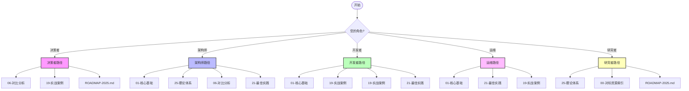

---

> **📋 文档来源**: `PostgreSQL_AI\00-快速导航.md`
> **📅 复制日期**: 2025-12-22
> **⚠️ 注意**: 本文档为复制版本，原文件保持不变

---

# PostgreSQL AI 快速导航

> **文档编号**: AI-00-06
> **最后更新**: 2025年1月

## 📊 导航路径可视化



## 🚀 快速开始

### 按角色导航

#### 👨‍💼 决策者/管理者

1. [06-对比分析](../../23-对比分析/) - 技术选型与成本分析
2. [19-实战案例](../../19-实战案例/) - 企业级应用案例
3. [ROADMAP-2025.md](../../../ROADMAP-2025.md)) - 技术趋势与战略建议

#### 🏗️ 架构师

1. [01-核心基础](../../01-核心基础/) - 系统架构设计
2. [25-理论体系](../../25-理论体系/) - 理论基础框架
3. [06-对比分析](../../23-对比分析/) - 技术方案对比
4. [21-最佳实践](../../21-最佳实践/) - 架构演进路径

#### 💻 开发者

1. [01-核心基础](../../01-核心基础/) - 技术实现细节
2. [19-实战案例](../../19-实战案例/) - 应用开发指南
3. [19-实战案例](../../19-实战案例/) - 代码示例与最佳实践
4. [21-最佳实践](../../21-最佳实践/) - 部署与优化指南

#### 🔧 DBA/运维

1. [01-核心基础](../../01-核心基础/) - 性能优化技术
2. [21-最佳实践](../../21-最佳实践/) - 运维最佳实践
3. [19-实战案例](../../19-实战案例/) - 故障排查案例

#### 🎓 研究者/学生

1. [25-理论体系](../../25-理论体系/) - 理论模型与形式化证明
2. [00-对标资源索引](./00-对标资源索引.md) - 学术资源索引
3. [ROADMAP-2025.md](../../../ROADMAP-2025.md)) - 研究方向与趋势

---

## 📚 按主题导航

### 25-理论体系

**核心内容**: PostgreSQL与AI技术生态的理论模型、概念框架和形式化论证

- [PostgreSQL与AI技术生态关联](../../10-AI与机器学习/01-理论基础/PostgreSQL与AI技术生态关联.md)
  - 系统级理论模型
  - 核心理论模型
  - 概念对比矩阵
  - 属性关系梳理
  - 决策树逻辑路径
  - 形式化证明体系

**关联主题**:

- → [01-核心基础](../../01-核心基础/) (理论基础指导架构设计)
- → [01-核心基础](../../01-核心基础/) (理论模型支撑能力实现)
- → [06-对比分析](../../23-对比分析/) (理论框架用于对比评估)

---

### 01-核心基础

**核心内容**: PostgreSQL AI生态体系架构、扩展组件和技术栈集成

- [PostgreSQL生态体系架构](../../10-AI与机器学习/02-技术架构/PostgreSQL生态体系架构.md)
- [PostgreSQL-AI全栈架构](../../10-AI与机器学习/02-技术架构/PostgreSQL-AI全栈架构.md)
  - 生态体系架构
  - 核心扩展组件
  - 技术栈集成
  - 基础架构设计
  - 典型AI架构模式

**关联主题**:

- ← [25-理论体系](../../25-理论体系/) (架构设计基于理论模型)
- → [01-核心基础](../../01-核心基础/) (架构支撑能力实现)
- → [19-实战案例](../../19-实战案例/) (架构服务于应用)

---

### 01-核心基础

**核心内容**: PostgreSQL在AI场景下的核心能力实现和技术细节

**文档**:

- [向量处理能力-pgvector](../../10-AI与机器学习/03-核心能力/向量处理能力-pgvector.md)
- [AI原生调用-pgai](../../10-AI与机器学习/03-核心能力/AI原生调用-pgai.md)
- [内置机器学习-PostgresML](../../10-AI与机器学习/03-核心能力/内置机器学习-PostgresML.md)
- [数据注入与治理](../../10-AI与机器学习/03-核心能力/数据注入与治理.md)
- [混合查询能力](../../10-AI与机器学习/03-核心能力/混合查询能力.md)
- [性能优化技术](../../10-AI与机器学习/03-核心能力/性能优化技术.md)

**关联主题**:

- ← [25-理论体系](../../25-理论体系/) (能力基于理论模型)
- ← [01-核心基础](../../01-核心基础/) (能力在架构中实现)
- → [19-实战案例](../../19-实战案例/) (能力支撑应用实现)

---

### 19-实战案例

**核心内容**: PostgreSQL AI技术在具体业务场景中的应用模式和最佳实践

**待补充文档**:

- RAG (检索增强生成) 系统
- 智能推荐系统
- 智能客服系统
- 金融风控系统
- AI Agent数据支撑
- 多模态检索应用

**关联主题**:

- ← [01-核心基础](../../01-核心基础/) (场景基于架构设计)
- ← [01-核心基础](../../01-核心基础/) (场景使用核心能力)
- → [19-实战案例](../../19-实战案例/) (场景在案例中实现)

---

### 19-实战案例

**核心内容**: 企业级应用案例、开源项目案例和性能基准测试

**待补充文档**:

- 企业级应用案例
- 开源项目案例
- 性能基准测试
- 成本效益分析
- 技术债务对比
- 市场验证数据

**关联主题**:

- ← [01-核心基础](../../01-核心基础/) (案例验证架构)
- ← [01-核心基础](../../01-核心基础/) (案例展示能力)
- ← [19-实战案例](../../19-实战案例/) (案例实现场景)

---

### 06-对比分析

**核心内容**: PostgreSQL AI方案与传统方案、替代方案的对比分析

**待补充文档**:

- 技术能力对比矩阵
- TCO总拥有成本分析
- 场景适用性决策矩阵
- 生态对比分析
- 性能基准对比
- 风险与约束条件

**关联主题**:

- ← [25-理论体系](../../25-理论体系/) (对比基于理论框架)
- ← [19-实战案例](../../19-实战案例/) (对比使用案例数据)
- → [21-最佳实践](../../21-最佳实践/) (对比指导选型)

---

### 21-最佳实践

**核心内容**: 从传统PostgreSQL到AI增强的渐进式演进路径和最佳实践

**待补充文档**:

- 渐进式演进路线
- 性能调优黄金法则
- 部署方案设计
- 风险应对措施
- 升级路径保障
- ROI与成本模型

**关联主题**:

- ← [19-实战案例](../../19-实战案例/) (路径服务于场景)
- ← [19-实战案例](../../19-实战案例/) (路径基于案例经验)
- ← [06-对比分析](../../23-对比分析/) (路径考虑对比结果)

---

### ROADMAP-2025.md

**核心内容**: PostgreSQL AI技术的发展趋势、演进方向和战略建议

**待补充文档**:

- 技术发展趋势
- AI原生数据库演进
- 扩展生态完善方向
- 云原生集成趋势
- 战略实施建议
- 未来展望

**关联主题**:

- ← [25-理论体系](../../25-理论体系/) (趋势基于理论发展)
- ← [01-核心基础](../02-技术架构/) (趋势影响架构演进)
- ← [01-核心基础](../03-核心能力/) (趋势推动能力增强)

---

## 🔍 按需求导航

### 我想了解理论基础

→ [25-理论体系](../../25-理论体系/) → [00-对标资源索引](./00-对标资源索引.md)

### 我想设计系统架构

→ [01-核心基础](../02-技术架构/) → [25-理论体系](../../25-理论体系/) → [06-对比分析](../../23-对比分析/)

### 我想实现AI功能

→ [01-核心基础](../03-核心能力/) → [19-实战案例](../04-应用场景/) → [19-实战案例](../../19-实战案例/)

### 我想做技术选型

→ [06-对比分析](../../23-对比分析/) → [19-实战案例](../../19-实战案例/) → [21-最佳实践](../07-实施路径/)

### 我想规划实施路径

→ [21-最佳实践](../07-实施路径/) → [19-实战案例](../04-应用场景/) → [19-实战案例](../../19-实战案例/)

### 我想了解未来趋势

→ [ROADMAP-2025.md](../../../ROADMAP-2025.md)) → [25-理论体系](../../25-理论体系/) → [00-对标资源索引](./00-对标资源索引.md)

---

## 📖 学习路径推荐

### 路径1: 理论到实践 (适合研究者)

```text
25-理论体系 → 01-核心基础 → 01-核心基础 → 19-实战案例 → 19-实战案例
```

### 路径2: 架构到实施 (适合架构师)

```text
01-核心基础 → 01-核心基础 → 06-对比分析 → 21-最佳实践
```

### 路径3: 场景到案例 (适合开发者)

```text
19-实战案例 → 01-核心基础 → 19-实战案例 → 21-最佳实践
```

### 路径4: 对比到决策 (适合决策者)

```text
06-对比分析 → 19-实战案例 → 21-最佳实践 → ROADMAP-2025.md
```

---

## 🗺️ 项目文件导航

- [README.md](../README.md) - 项目总览和主题导航
- [00-主题关联关系图.md](./00-主题关联关系图.md) - 主题关联关系分析
- [00-对标资源索引.md](./00-对标资源索引.md) - 对标资源索引
- [00-后续推进计划.md](./00-后续推进计划.md) - 详细推进计划
- [00-批判性分析报告.md](./00-批判性分析报告.md) - 批判性分析
- [00-主题梳理完成总结.md](./00-主题梳理完成总结.md) - 完成总结
- [00-快速导航.md](./00-快速导航.md) - 本文档

---

**最后更新**: 2025年1月
**维护者**: PostgreSQL Modern Team
**文档编号**: AI-00-06
