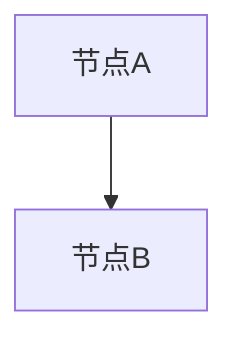

---

> **📋 文档来源**: `PostgreSQL_AI\00-文档格式规范.md`
> **📅 复制日期**: 2025-12-22
> **⚠️ 注意**: 本文档为复制版本，原文件保持不变

---

# PostgreSQL AI 文档格式规范

> **文档编号**: AI-00-08
> **最后更新**: 2025年1月

## 📋 文档编号体系

### 编号格式

```
AI-XX-YY
```

- **AI**: 项目标识
- **XX**: 主题编号 (01-08)
- **YY**: 子主题编号 (00-99)

### 主题编号

- **00**: 项目文件
- **01**: 理论基础
- **02**: 技术架构
- **03**: 核心能力
- **04**: 应用场景
- **05**: 实践案例
- **06**: 对比分析
- **07**: 实施路径
- **08**: 未来趋势

### 子主题编号规则

- **00**: 主题README
- **01-99**: 具体子主题文档

## 📄 文档标准结构

### 1. 文档头部元数据

```markdown
# 文档标题

> **文档编号**: AI-XX-YY
> **最后更新**: YYYY年MM月
> **主题**: XX-主题名称
> **子主题**: YY-子主题名称
```

### 2. 目录 (TOC)

所有文档必须包含目录，使用Markdown格式：

```markdown
## 📑 目录

- [一、概述](#一概述)
- [二、核心内容](#二核心内容)
  - [2.1 子章节1](#21-子章节1)
  - [2.2 子章节2](#22-子章节2)
- [三、实践应用](#三实践应用)
- [四、关联主题](#四关联主题)
- [五、对标资源](#五对标资源)
```

### 3. 章节编号体系

#### 一级章节（中文编号）

- 一、概述
- 二、核心内容
- 三、实践应用
- 四、关联主题
- 五、对标资源
- 六、总结

#### 二级章节（数字编号）

- 2.1 子章节1
- 2.2 子章节2
- 2.3 子章节3

#### 三级章节（数字编号）

- 2.1.1 详细内容1
- 2.1.2 详细内容2

### 4. 标准章节模板

#### 一、概述

- 主题描述
- 核心价值
- 适用场景

#### 二、核心内容

- 技术原理
- 实现方式
- 关键特性

#### 三、实践应用

- 代码示例
- 配置说明
- 最佳实践

#### 四、关联主题

- 依赖主题
- 被依赖主题
- 相关主题

#### 五、对标资源

- 学术论文
- 技术文档
- 企业案例

#### 六、总结

- 关键要点
- 下一步行动

## 📝 文档命名规范

### 文件命名格式

```
主题编号-子主题名称.md
```

示例：

- `25-理论体系.md` (主题README)
- `01-01-系统级理论模型.md` (子主题文档)
- `03-01-向量处理能力-pgvector.md` (子主题文档)

### 标题命名规范

- 使用中文标题
- 简洁明确
- 避免过长

## 🎨 格式要求

### 代码块

```markdown
```sql
-- SQL示例
SELECT * FROM table;
```

```python
# Python示例
def function():
    pass
```

```

### 表格

```markdown
| 列1 | 列2 | 列3 |
|-----|-----|-----|
| 数据1 | 数据2 | 数据3 |
```

### 图表

使用Mermaid格式：

```markdown


```

## 📊 元数据要求

所有文档必须包含：

1. **文档编号**: AI-XX-YY
2. **最后更新**: YYYY年MM月
3. **主题**: XX-主题名称
4. **子主题**: YY-子主题名称（如果是子主题文档）
5. **维护者**: PostgreSQL Modern Team

## ✅ 检查清单

- [ ] 文档编号格式正确
- [ ] 包含完整目录
- [ ] 章节编号统一
- [ ] 元数据完整
- [ ] 代码示例格式正确
- [ ] 链接有效
- [ ] 关联主题标注
- [ ] 对标资源链接

---

**最后更新**: 2025年1月
**维护者**: PostgreSQL Modern Team
**文档编号**: AI-00-08
