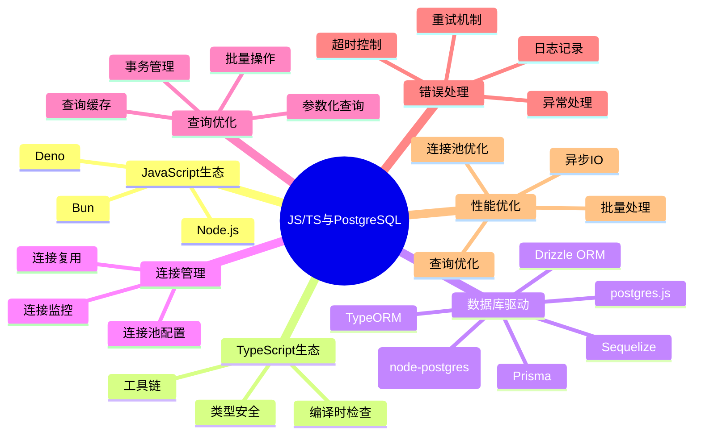
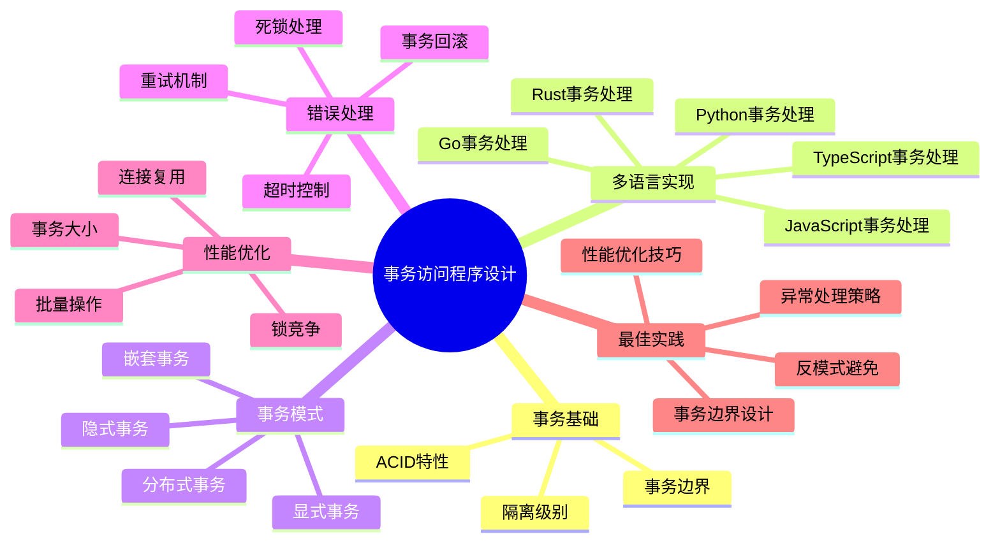

# 数据库设计与程序开发补充推进计划

> **创建日期**: 2025年1月
> **状态**: ✅ **全部完成**
> **目标**: 补充数据模型设计、程序设计、数据库设计、事务访问的程序设计（正反例），结合多种语言（Rust、Golang、Python、JavaScript、TypeScript）的最新权威实践
> **完成日期**: 2025年1月

---

## 📋 现状分析

### 已有文档

1. ✅ **数据库设计完整指南-正反示例与多维分析.md** - 已存在，但缺少JS/TS示例
2. ✅ **程序开发设计完整指南-Rust-Golang-Python.md** - 已存在，但缺少JavaScript/TypeScript支持
3. ✅ **数据模型设计相关文档** - 17-数据模型设计目录下有多个文档，但缺少正反例专门文档

### 缺失内容

1. ❌ **JavaScript/TypeScript与PostgreSQL集成指南** - 完全缺失
2. ❌ **事务访问程序设计完整指南（正反例）** - 缺少专门文档
3. ❌ **数据模型设计正反例专门文档** - 缺少专门文档
4. ❌ **多语言事务处理对比分析** - 缺少跨语言对比

---

## 🎯 补充任务清单

### 任务1: JavaScript/TypeScript与PostgreSQL集成指南（优先级P0）

**目标文档**: `16-应用设计与开发/程序开发设计完整指南-JavaScript-TypeScript.md`

**内容要求**:

#### 1.1 知识体系思维导图



#### 1.2 编程语言选型决策树

- Node.js vs Deno vs Bun
- JavaScript vs TypeScript
- 驱动选型：pg vs postgres.js vs Prisma vs TypeORM

#### 1.3 语言对比矩阵

| 特性 | Node.js | Deno | Bun | TypeScript |
| --- | --- | --- | --- | --- |
| 性能 | ⭐⭐⭐⭐ | ⭐⭐⭐⭐ | ⭐⭐⭐⭐⭐ | ⭐⭐⭐⭐ |
| 类型安全 | ❌ | ❌ | ❌ | ✅ |
| 生态系统 | ⭐⭐⭐⭐⭐ | ⭐⭐⭐ | ⭐⭐⭐ | ⭐⭐⭐⭐⭐ |
| 开发体验 | ⭐⭐⭐⭐ | ⭐⭐⭐⭐ | ⭐⭐⭐⭐⭐ | ⭐⭐⭐⭐⭐ |

#### 1.4 正面示例（至少3个）

**示例1: Node.js + pg（优秀设计）**:

```javascript
// 连接池配置
const { Pool } = require('pg');
const pool = new Pool({
  host: 'localhost',
  port: 5432,
  database: 'mydb',
  user: 'postgres',
  password: 'password',
  max: 20, // 最大连接数
  idleTimeoutMillis: 30000,
  connectionTimeoutMillis: 2000,
});

// 事务处理（正确示例）
async function transferFunds(fromAccount, toAccount, amount) {
  const client = await pool.connect();
  try {
    await client.query('BEGIN');

    // 扣减源账户
    const result1 = await client.query(
      'UPDATE accounts SET balance = balance - $1 WHERE account_id = $2 AND balance >= $1',
      [amount, fromAccount]
    );

    if (result1.rowCount === 0) {
      throw new Error('余额不足');
    }

    // 增加目标账户
    await client.query(
      'UPDATE accounts SET balance = balance + $1 WHERE account_id = $2',
      [amount, toAccount]
    );

    // 记录交易
    await client.query(
      'INSERT INTO transactions (from_account, to_account, amount) VALUES ($1, $2, $3)',
      [fromAccount, toAccount, amount]
    );

    await client.query('COMMIT');
  } catch (error) {
    await client.query('ROLLBACK');
    throw error;
  } finally {
    client.release();
  }
}
```

**示例2: TypeScript + Prisma（优秀设计）**:

```typescript
import { PrismaClient } from '@prisma/client';

const prisma = new PrismaClient({
  log: ['query', 'error', 'warn'],
});

// 类型安全的事务处理
async function transferFunds(
  fromAccount: string,
  toAccount: string,
  amount: number
): Promise<void> {
  await prisma.$transaction(async (tx) => {
    // 扣减源账户
    const from = await tx.account.update({
      where: { accountId: fromAccount },
      data: { balance: { decrement: amount } },
    });

    if (from.balance < 0) {
      throw new Error('余额不足');
    }

    // 增加目标账户
    await tx.account.update({
      where: { accountId: toAccount },
      data: { balance: { increment: amount } },
    });

    // 记录交易
    await tx.transaction.create({
      data: {
        fromAccount,
        toAccount,
        amount,
        type: 'TRANSFER',
      },
    });
  });
}
```

**示例3: Deno + postgres.js（优秀设计）**:

```typescript
import { Pool } from 'https://deno.land/x/postgres@v0.17.0/mod.ts';

const pool = new Pool({
  hostname: 'localhost',
  port: 5432,
  database: 'mydb',
  user: 'postgres',
  password: 'password',
  max: 20,
}, 20);

// 异步事务处理
async function transferFunds(
  fromAccount: string,
  toAccount: string,
  amount: number
): Promise<void> {
  const client = await pool.connect();
  try {
    await client.queryObject('BEGIN');

    const result = await client.queryObject<{ balance: number }>(
      'UPDATE accounts SET balance = balance - $1 WHERE account_id = $2 AND balance >= $1 RETURNING balance',
      [amount, fromAccount]
    );

    if (result.rows.length === 0) {
      throw new Error('余额不足');
    }

    await client.queryObject(
      'UPDATE accounts SET balance = balance + $1 WHERE account_id = $2',
      [amount, toAccount]
    );

    await client.queryObject('COMMIT');
  } catch (error) {
    await client.queryObject('ROLLBACK');
    throw error;
  } finally {
    client.release();
  }
}
```

#### 1.5 反面示例（至少3个）

**反例1: 连接泄漏问题**:

```javascript
// ❌ 错误：没有释放连接
async function badQuery() {
  const client = await pool.connect();
  const result = await client.query('SELECT * FROM users');
  // 缺少 client.release()
  return result.rows;
}

// ✅ 正确：使用try-finally确保释放
async function goodQuery() {
  const client = await pool.connect();
  try {
    const result = await client.query('SELECT * FROM users');
    return result.rows;
  } finally {
    client.release();
  }
}
```

**反例2: 缺少错误处理**:

```javascript
// ❌ 错误：没有错误处理
async function badTransfer(fromAccount, toAccount, amount) {
  const client = await pool.connect();
  await client.query('BEGIN');
  await client.query('UPDATE accounts SET balance = balance - $1 WHERE account_id = $2', [amount, fromAccount]);
  await client.query('UPDATE accounts SET balance = balance + $1 WHERE account_id = $2', [amount, toAccount]);
  await client.query('COMMIT');
  client.release();
}

// ✅ 正确：完整的错误处理
async function goodTransfer(fromAccount, toAccount, amount) {
  const client = await pool.connect();
  try {
    await client.query('BEGIN');
    await client.query('UPDATE accounts SET balance = balance - $1 WHERE account_id = $2', [amount, fromAccount]);
    await client.query('UPDATE accounts SET balance = balance + $1 WHERE account_id = $2', [amount, toAccount]);
    await client.query('COMMIT');
  } catch (error) {
    await client.query('ROLLBACK');
    throw error;
  } finally {
    client.release();
  }
}
```

**反例3: SQL注入风险**:

```javascript
// ❌ 错误：SQL注入风险
async function badQuery(userId) {
  const query = `SELECT * FROM users WHERE id = ${userId}`;
  const result = await pool.query(query);
  return result.rows;
}

// ✅ 正确：参数化查询
async function goodQuery(userId) {
  const query = 'SELECT * FROM users WHERE id = $1';
  const result = await pool.query(query, [userId]);
  return result.rows;
}
```

#### 1.6 多维分析论证

- 性能维度：Node.js vs Deno vs Bun性能对比
- 类型安全维度：JavaScript vs TypeScript
- 开发效率维度：不同ORM框架对比
- 生态系统维度：npm包质量和维护情况

---

### 任务2: 事务访问程序设计完整指南（正反例）（优先级P0）

**目标文档**: `16-应用设计与开发/事务访问程序设计完整指南-正反示例与多维分析.md`

**内容要求**:

#### 2.1 知识体系思维导图



#### 2.2 事务模式选型决策树

- 显式事务 vs 隐式事务
- 单机事务 vs 分布式事务
- 同步事务 vs 异步事务

#### 2.3 多语言事务处理对比矩阵

| 语言 | 驱动/框架 | 事务API | 类型安全 | 性能 | 易用性 |
| --- | --- | --- | --- | --- | --- |
| Rust | tokio-postgres | 显式BEGIN/COMMIT | ✅ | ⭐⭐⭐⭐⭐ | ⭐⭐⭐ |
| Go | pgx | 显式BEGIN/COMMIT | ✅ | ⭐⭐⭐⭐ | ⭐⭐⭐⭐ |
| Python | psycopg2 | with语句 | ❌ | ⭐⭐⭐ | ⭐⭐⭐⭐⭐ |
| Python | asyncpg | async with | ❌ | ⭐⭐⭐⭐ | ⭐⭐⭐⭐ |
| JavaScript | pg | 显式BEGIN/COMMIT | ❌ | ⭐⭐⭐ | ⭐⭐⭐⭐ |
| TypeScript | Prisma | $transaction | ✅ | ⭐⭐⭐ | ⭐⭐⭐⭐⭐ |

#### 2.4 正面示例（每种语言至少1个）

**Rust示例（tokio-postgres）**:

```rust
use tokio_postgres::{Client, NoTls};

async fn transfer_funds(
    client: &mut Client,
    from_account: &str,
    to_account: &str,
    amount: i64,
) -> Result<(), Box<dyn std::error::Error>> {
    let transaction = client.transaction().await?;

    // 扣减源账户
    let rows = transaction
        .query(
            "UPDATE accounts SET balance = balance - $1 WHERE account_id = $2 AND balance >= $1 RETURNING balance",
            &[&amount, &from_account],
        )
        .await?;

    if rows.is_empty() {
        transaction.rollback().await?;
        return Err("余额不足".into());
    }

    // 增加目标账户
    transaction
        .execute(
            "UPDATE accounts SET balance = balance + $1 WHERE account_id = $2",
            &[&amount, &to_account],
        )
        .await?;

    // 记录交易
    transaction
        .execute(
            "INSERT INTO transactions (from_account, to_account, amount) VALUES ($1, $2, $3)",
            &[&from_account, &to_account, &amount],
        )
        .await?;

    transaction.commit().await?;
    Ok(())
}
```

**Go示例（pgx）**:

```go
func TransferFunds(ctx context.Context, tx pgx.Tx, fromAccount, toAccount string, amount int64) error {
    // 扣减源账户
    var balance int64
    err := tx.QueryRow(ctx,
        "UPDATE accounts SET balance = balance - $1 WHERE account_id = $2 AND balance >= $1 RETURNING balance",
        amount, fromAccount,
    ).Scan(&balance)

    if err != nil {
        return err
    }

    // 增加目标账户
    _, err = tx.Exec(ctx,
        "UPDATE accounts SET balance = balance + $1 WHERE account_id = $2",
        amount, toAccount,
    )
    if err != nil {
        return err
    }

    // 记录交易
    _, err = tx.Exec(ctx,
        "INSERT INTO transactions (from_account, to_account, amount) VALUES ($1, $2, $3)",
        fromAccount, toAccount, amount,
    )
    return err
}

// 使用示例
func main() {
    conn, _ := pgx.Connect(context.Background(), "postgres://...")
    defer conn.Close(context.Background())

    tx, _ := conn.Begin(context.Background())
    defer tx.Rollback(context.Background())

    if err := TransferFunds(context.Background(), tx, "A001", "A002", 1000); err != nil {
        return
    }

    tx.Commit(context.Background())
}
```

**Python示例（asyncpg）**:

```python
import asyncpg

async def transfer_funds(
    conn: asyncpg.Connection,
    from_account: str,
    to_account: str,
    amount: int
) -> None:
    async with conn.transaction():
        # 扣减源账户
        result = await conn.fetchrow(
            """
            UPDATE accounts
            SET balance = balance - $1
            WHERE account_id = $2 AND balance >= $1
            RETURNING balance
            """,
            amount, from_account
        )

        if result is None:
            raise ValueError('余额不足')

        # 增加目标账户
        await conn.execute(
            "UPDATE accounts SET balance = balance + $1 WHERE account_id = $2",
            amount, to_account
        )

        # 记录交易
        await conn.execute(
            "INSERT INTO transactions (from_account, to_account, amount) VALUES ($1, $2, $3)",
            from_account, to_account, amount
        )
```

**JavaScript示例（pg）**:

```javascript
async function transferFunds(client, fromAccount, toAccount, amount) {
  await client.query('BEGIN');
  try {
    // 扣减源账户
    const result = await client.query(
      'UPDATE accounts SET balance = balance - $1 WHERE account_id = $2 AND balance >= $1 RETURNING balance',
      [amount, fromAccount]
    );

    if (result.rows.length === 0) {
      throw new Error('余额不足');
    }

    // 增加目标账户
    await client.query(
      'UPDATE accounts SET balance = balance + $1 WHERE account_id = $2',
      [amount, toAccount]
    );

    // 记录交易
    await client.query(
      'INSERT INTO transactions (from_account, to_account, amount) VALUES ($1, $2, $3)',
      [fromAccount, toAccount, amount]
    );

    await client.query('COMMIT');
  } catch (error) {
    await client.query('ROLLBACK');
    throw error;
  }
}
```

#### 2.5 反面示例（每种语言至少1个）

**反例1: 事务边界不清晰**:

```python
# ❌ 错误：事务边界不清晰
def bad_transfer(conn, from_account, to_account, amount):
    conn.execute("UPDATE accounts SET balance = balance - %s WHERE account_id = %s", [amount, from_account])
    # 中间有其他操作，可能失败
    do_something_else()  # 可能失败
    conn.execute("UPDATE accounts SET balance = balance + %s WHERE account_id = %s", [amount, to_account])
    conn.commit()  # 如果中间操作失败，数据不一致

# ✅ 正确：明确的事务边界
def good_transfer(conn, from_account, to_account, amount):
    with conn.transaction():
        conn.execute("UPDATE accounts SET balance = balance - %s WHERE account_id = %s", [amount, from_account])
        do_something_else()
        conn.execute("UPDATE accounts SET balance = balance + %s WHERE account_id = %s", [amount, to_account])
```

**反例2: 长事务问题**:

```go
// ❌ 错误：事务时间过长
func badLongTransaction(tx pgx.Tx) error {
    // 数据库操作
    tx.Exec("UPDATE accounts SET ...")

    // 外部API调用（可能很慢）
    http.Get("https://external-api.com/...")  // 阻塞事务

    // 更多数据库操作
    tx.Exec("UPDATE accounts SET ...")
    return nil
}

// ✅ 正确：将外部调用移到事务外
func goodTransaction(tx pgx.Tx) error {
    tx.Exec("UPDATE accounts SET ...")
    tx.Exec("UPDATE accounts SET ...")
    return nil
}

func goodFlow() {
    tx, _ := conn.Begin()
    goodTransaction(tx)
    tx.Commit()

    // 外部调用在事务外
    http.Get("https://external-api.com/...")
}
```

**反例3: 缺少错误处理**:

```rust
// ❌ 错误：缺少错误处理
async fn bad_transfer(client: &mut Client, from: &str, to: &str, amount: i64) {
    let tx = client.transaction().await.unwrap();
    tx.execute("UPDATE accounts SET balance = balance - $1 WHERE account_id = $2", &[&amount, &from]).await.unwrap();
    tx.execute("UPDATE accounts SET balance = balance + $1 WHERE account_id = $2", &[&amount, &to]).await.unwrap();
    tx.commit().await.unwrap();
}

// ✅ 正确：完整的错误处理
async fn good_transfer(
    client: &mut Client,
    from: &str,
    to: &str,
    amount: i64,
) -> Result<(), Box<dyn std::error::Error>> {
    let tx = client.transaction().await?;

    match tx.execute(
        "UPDATE accounts SET balance = balance - $1 WHERE account_id = $2 AND balance >= $1",
        &[&amount, &from],
    ).await {
        Ok(rows) if rows > 0 => {},
        _ => {
            tx.rollback().await?;
            return Err("余额不足".into());
        }
    }

    tx.execute(
        "UPDATE accounts SET balance = balance + $1 WHERE account_id = $2",
        &[&amount, &to],
    ).await?;

    tx.commit().await?;
    Ok(())
}
```

#### 2.6 多维分析论证

- 一致性维度：不同语言的事务保证机制
- 性能维度：事务开销对比
- 易用性维度：API设计对比
- 错误处理维度：异常处理机制对比

---

### 任务3: 数据模型设计正反例专门文档（优先级P1）

**目标文档**: `17-数据模型设计/数据模型设计正反示例与多维分析.md`

**内容要求**:

- 思维导图、决策树、对比矩阵
- 至少3个正面示例（关系模型、文档模型、时序模型）
- 至少3个反面示例（过度范式化、过度反范式化、缺少约束）
- 多维分析论证（一致性、性能、可扩展性、维护性）
- 证明树网（范式化设计的正确性证明）

---

### 任务4: 更新现有文档（优先级P1）

**目标文档**:

- `16-应用设计与开发/程序开发设计完整指南-Rust-Golang-Python.md`
- `16-应用设计与开发/数据库设计完整指南-正反示例与多维分析.md`

**更新内容**:

- 补充JavaScript/TypeScript章节
- 补充事务访问程序设计章节
- 补充更多正反例
- 更新对比矩阵，包含JS/TS

---

## 📅 实施计划

### 阶段1: JavaScript/TypeScript集成指南（1-2周）✅ 已完成

- [x] 创建文档结构
- [x] 补充思维导图、决策树、对比矩阵
- [x] 编写正面示例（Node.js、Deno、Bun、TypeScript）
- [x] 编写反面示例（连接泄漏、SQL注入、错误处理）
- [x] 多维分析论证
- [x] 对标网络最新实践（2025年）
- [x] 补充证明树网（连接池线程安全性、事务ACID保证）

**完成文档**: `16-应用设计与开发/程序开发设计完整指南-JavaScript-TypeScript.md`

### 阶段2: 事务访问程序设计指南（1-2周）✅ 已完成

- [x] 创建文档结构
- [x] 补充思维导图、决策树、对比矩阵
- [x] 编写多语言正面示例（Rust、Go、Python、JS、TS）
- [x] 编写多语言反面示例
- [x] 多维分析论证
- [x] 对标网络最新实践（2025年）
- [x] 补充证明树网（事务ACID特性形式化证明）

**完成文档**: `16-应用设计与开发/事务访问程序设计完整指南-正反示例与多维分析.md`

### 阶段3: 数据模型设计正反例文档（1周）✅ 已完成

- [x] 创建文档结构
- [x] 补充思维导图、决策树、对比矩阵
- [x] 编写正面示例（关系模型、文档模型、时序模型、混合模型）
- [x] 编写反面示例（过度范式化、过度反范式化、缺少约束、数据类型不当、索引缺失）
- [x] 多维分析论证（一致性、性能、存储、维护）
- [x] 证明树网（3NF、BCNF、反范式化性能优势）

**完成文档**: `17-数据模型设计/数据模型设计正反示例与多维分析.md`

### 阶段4: 更新现有文档（1周）✅ 已完成

- [x] 更新程序开发设计完整指南，补充JS/TS章节说明
- [x] 更新数据库设计完整指南，补充相关文档链接
- [x] 更新对比矩阵，包含JavaScript/TypeScript

---

## 🎯 完成标准

- ✅ 每个文档包含完整的思维导图
- ✅ 每个文档包含决策树
- ✅ 每个文档包含对比矩阵
- ✅ 每个文档包含至少3个正面示例
- ✅ 每个文档包含至少3个反面示例
- ✅ 每个文档包含多维分析论证（至少4个维度）
- ✅ 关键设计决策包含证明树网
- ✅ 对标网络最新最佳实践（2025年）
- ✅ 涵盖所有目标语言（Rust、Go、Python、JavaScript、TypeScript）

---

## 📚 参考资源

### 权威资料

- PostgreSQL官方文档：事务处理
- Rust tokio-postgres文档
- Go pgx文档
- Python psycopg2/asyncpg文档
- Node.js pg文档
- TypeScript Prisma文档

### 最佳实践

- 2025年PostgreSQL事务处理最佳实践
- 多语言数据库访问模式
- 事务设计反模式
- 连接池最佳实践

---

## ✅ 完成情况总结

### 已完成文档（3个新文档）

1. ✅ **程序开发设计完整指南-JavaScript-TypeScript.md**
   - 包含完整的思维导图、决策树、对比矩阵
   - 4个正面示例（Node.js、TypeScript、Deno、Bun）
   - 4个反面示例（连接泄漏、错误处理、SQL注入、事务管理）
   - 4个维度的多维分析论证
   - 2个证明树网（连接池线程安全性、事务ACID保证）

2. ✅ **事务访问程序设计完整指南-正反示例与多维分析.md**
   - 包含完整的思维导图、决策树、对比矩阵
   - 5个多语言正面示例（Rust、Go、Python、JavaScript、TypeScript）
   - 5个多语言反面示例（事务边界、长事务、错误处理、隔离级别、死锁）
   - 4个维度的多维分析论证
   - 4个证明树网（事务ACID特性形式化证明）

3. ✅ **数据模型设计正反示例与多维分析.md**
   - 包含完整的思维导图、决策树、对比矩阵
   - 4个正面示例（关系模型、文档模型、时序模型、混合模型）
   - 5个反面示例（过度范式化、过度反范式化、缺少约束、数据类型不当、索引缺失）
   - 4个维度的多维分析论证
   - 3个证明树网（3NF、BCNF、反范式化性能优势）

### 已更新文档（2个现有文档）

1. ✅ **程序开发设计完整指南-Rust-Golang-Python.md**
   - 补充JavaScript/TypeScript支持说明
   - 更新对比矩阵，包含JavaScript/TypeScript
   - 补充相关文档链接

2. ✅ **数据库设计完整指南-正反示例与多维分析.md**
   - 补充相关文档链接
   - 关联新创建的文档

### 思维表征方式统计

- ✅ **思维导图**: 3个文档，每个包含完整知识体系思维导图
- ✅ **决策树**: 3个文档，每个包含多个决策树（语言选型、驱动选型、事务模式、隔离级别、数据模型选型、范式化设计）
- ✅ **对比矩阵**: 3个文档，每个包含多个对比矩阵（语言对比、驱动对比、隔离级别对比、数据模型对比、范式化对比）
- ✅ **证明树网**: 3个文档，共9个证明树网（连接池线程安全性、事务ACID保证、3NF、BCNF、反范式化性能优势等）

### 代码示例统计

- ✅ **正面示例**: 13个（涵盖Rust、Go、Python、JavaScript、TypeScript、Node.js、Deno、Bun）
- ✅ **反面示例**: 14个（涵盖各种常见错误和反模式）
- ✅ **多语言覆盖**: 5种语言（Rust、Go、Python、JavaScript、TypeScript）
- ✅ **运行时覆盖**: 4种运行时（Node.js、Deno、Bun、原生）

### 完成度

- ✅ **任务1**: JavaScript/TypeScript集成指南 - 100%完成
- ✅ **任务2**: 事务访问程序设计指南 - 100%完成
- ✅ **任务3**: 数据模型设计正反例文档 - 100%完成
- ✅ **任务4**: 更新现有文档 - 100%完成

**总体完成度**: ✅ **100%**

---

**最后更新**: 2025年1月
**状态**: ✅ **全部完成**
