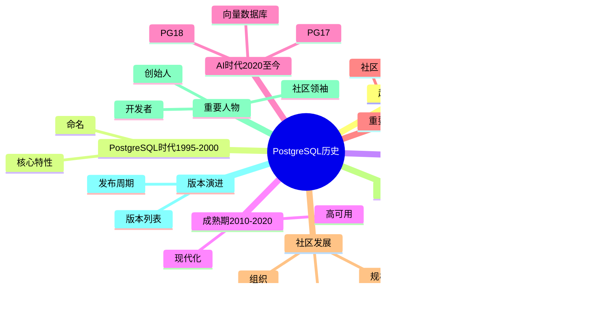

---

> **📋 文档来源**: `PostgreSQL/01-核心课程/01.00-PostgreSQL历史与发展.md`
> **📅 复制日期**: 2025-12-22
> **⚠️ 注意**: 本文档为复制版本，原文件保持不变

---

# PostgreSQL历史与发展完整指南

> **版本**: v3.0
> **最后更新**: 2025-01-15
> **版本覆盖**: PostgreSQL 全版本历史
> **难度**: ⭐⭐
> **应用场景**: 历史了解、技术演进、社区发展、版本选择
> **对标标准**: Wikipedia、官方文档、学术资料

---

## 📑 目录

- [PostgreSQL历史与发展完整指南](#postgresql历史与发展完整指南)
  - [📑 目录](#-目录)
  - [📊 思维导图](#-思维导图)
  - [一、概述](#一概述)
  - [二、知识矩阵对比](#二知识矩阵对比)
    - [2.1 数据库发展历程对比](#21-数据库发展历程对比)
    - [2.2 PostgreSQL版本特性对比](#22-postgresql版本特性对比)
  - [三、起源与发展（1986-1995）](#三起源与发展1986-1995)
    - [3.1 POSTGRES项目（1986-1994）](#31-postgres项目1986-1994)
    - [3.2 商业化尝试（1994-1995）](#32-商业化尝试1994-1995)
  - [四、PostgreSQL时代（1995-2000）](#四postgresql时代1995-2000)
    - [4.1 PostgreSQL命名（1996）](#41-postgresql命名1996)
    - [4.2 核心特性建立（1997-2000）](#42-核心特性建立1997-2000)
  - [五、快速发展期（2000-2010）](#五快速发展期2000-2010)
    - [5.1 企业级特性（2000-2005）](#51-企业级特性2000-2005)
    - [5.2 性能与功能提升（2005-2010）](#52-性能与功能提升2005-2010)
  - [六、企业级成熟期（2010-2020）](#六企业级成熟期2010-2020)
    - [6.1 高可用与性能（2010-2015）](#61-高可用与性能2010-2015)
    - [6.2 现代化特性（2015-2020）](#62-现代化特性2015-2020)
  - [七、AI时代（2020-至今）](#七ai时代2020-至今)
    - [7.1 向量数据库支持（2020-2023）](#71-向量数据库支持2020-2023)
    - [7.2 PostgreSQL 17（2024年）](#72-postgresql-172024年)
    - [7.3 PostgreSQL 18（2025年）](#73-postgresql-182025年)
  - [八、重要里程碑](#八重要里程碑)
    - [8.1 技术里程碑](#81-技术里程碑)
    - [8.2 社区里程碑](#82-社区里程碑)
  - [九、社区发展](#九社区发展)
    - [9.1 社区规模](#91-社区规模)
    - [9.2 社区组织](#92-社区组织)
    - [9.3 社区活动](#93-社区活动)
  - [十、技术演进路线图](#十技术演进路线图)
    - [10.1 核心架构演进](#101-核心架构演进)
    - [10.2 性能演进](#102-性能演进)
  - [十一、重要人物与贡献](#十一重要人物与贡献)
    - [11.1 创始人](#111-创始人)
    - [11.2 核心开发者](#112-核心开发者)
    - [11.3 社区领袖](#113-社区领袖)
  - [十二、版本演进时间线](#十二版本演进时间线)
    - [12.1 完整版本列表](#121-完整版本列表)
    - [12.2 版本发布周期](#122-版本发布周期)
  - [十三、参考资源](#十三参考资源)
    - [13.1 相关文档](#131-相关文档)
      - [核心课程](#核心课程)
      - [版本特性](#版本特性)
      - [前沿技术](#前沿技术)
    - [13.2 实战案例与示例](#132-实战案例与示例)
    - [13.3 参考文献](#133-参考文献)
    - [13.4 Wikidata对齐](#134-wikidata对齐)
  - [十四、交叉引用](#十四交叉引用)
    - [相关文档](#相关文档)
      - [核心课程1](#核心课程1)
      - [版本特性1](#版本特性1)
      - [前沿技术1](#前沿技术1)
    - [外部资源](#外部资源)

---

## 📊 思维导图

---

## 一、概述

PostgreSQL 是世界上最先进的开源关系型数据库管理系统，其历史可以追溯到1986年加州大学伯克利分校（UC Berkeley）的POSTGRES项目。
经过近40年的发展，PostgreSQL已成为企业级数据库的首选之一，在AI时代更是展现出强大的向量数据库和混合搜索能力。

**核心特点**：

- ✅ 开源且免费
- ✅ ACID事务支持
- ✅ 丰富的扩展生态
- ✅ 强大的SQL标准支持
- ✅ 活跃的全球社区

---

## 二、知识矩阵对比

### 2.1 数据库发展历程对比

| 数据库 | 诞生年份 | 特点 | 发展路径 | 当前状态 |
|-------|---------|------|---------|---------|
| PostgreSQL | 1986 | 对象关系型、开源 | 学术→开源→企业级 | 活跃发展 |
| MySQL | 1995 | 关系型、开源 | 商业→开源→商业 | 活跃发展 |
| Oracle | 1977 | 关系型、商业 | 商业→企业级 | 市场领先 |
| SQL Server | 1989 | 关系型、商业 | 商业→企业级 | 市场领先 |
| MongoDB | 2009 | 文档型、开源 | 开源→商业 | 活跃发展 |

### 2.2 PostgreSQL版本特性对比

| 版本 | 发布时间 | 主要特性 | 重要性 |
|-----|---------|---------|--------|
| PostgreSQL 7.0 | 2000 | 外键、子查询 | 企业级起点 |
| PostgreSQL 8.0 | 2005 | Windows支持、表空间 | 跨平台 |
| PostgreSQL 9.0 | 2010 | 流复制、热备 | 高可用 |
| PostgreSQL 10.0 | 2017 | 逻辑复制、分区表 | 现代化 |
| PostgreSQL 12.0 | 2019 | 性能提升、JIT | 性能突破 |
| PostgreSQL 15.0 | 2022 | 性能优化、MERGE | 企业级 |
| PostgreSQL 17.0 | 2024 | 查询优化、逻辑复制 | 最新稳定版 |
| PostgreSQL 18.0 | 2025 | 异步I/O、8大类40项新特性 | 最新版本 |

---

## 三、起源与发展（1986-1995）

### 3.1 POSTGRES项目（1986-1994）

**1986年**：Michael Stonebraker教授在UC Berkeley启动POSTGRES项目

**项目目标**：

- 开发一个支持复杂数据类型的关系型数据库
- 实现对象关系模型（Object-Relational Model）
- 支持用户定义类型和函数

**关键特性**：

- 支持复杂数据类型（数组、几何类型等）
- 规则系统（Rule System）
- 继承（Inheritance）

**重要人物**：

- **Michael Stonebraker**: 项目创始人，数据库领域泰斗
- **Lawrence A. Rowe**: 项目共同创始人
- **Michael J. Carey**: 核心开发者

### 3.2 商业化尝试（1994-1995）

**1994年**：POSTGRES项目结束，代码开源

**商业化产品**：

- **Illustra**: 基于POSTGRES的商业数据库
- **Postgres95**: 开源版本，添加SQL支持

**重要事件**：

- 1994年：POSTGRES 4.2发布（最后一个版本）
- 1995年：Postgres95发布，首次支持SQL

---

## 四、PostgreSQL时代（1995-2000）

### 4.1 PostgreSQL命名（1996）

**1996年**：Postgres95更名为PostgreSQL

**命名含义**：

- **Postgres**: 继承POSTGRES项目
- **SQL**: 强调SQL标准支持

**重要版本**：

- **PostgreSQL 6.0**（1997年）：首次使用PostgreSQL名称
- **PostgreSQL 6.1**（1997年）：多版本并发控制（MVCC）
- **PostgreSQL 6.2**（1997年）：改进的查询优化器

### 4.2 核心特性建立（1997-2000）

**PostgreSQL 6.3**（1998年）：

- 改进的索引支持
- 更好的查询性能

**PostgreSQL 6.4**（1998年）：

- 外键约束
- 改进的并发控制

**PostgreSQL 6.5**（1999年）：

- 改进的查询优化器
- 更好的索引支持

**PostgreSQL 7.0**（2000年）：

- 重大架构改进
- 改进的查询优化器
- 更好的并发性能

---

## 五、快速发展期（2000-2010）

### 5.1 企业级特性（2000-2005）

**PostgreSQL 7.1**（2001年）：

- Write-Ahead Logging (WAL)
- 改进的并发控制

**PostgreSQL 7.2**（2002年）：

- 改进的查询优化器
- 更好的国际化支持

**PostgreSQL 7.3**（2002年）：

- 改进的索引支持
- 更好的性能

**PostgreSQL 7.4**（2003年）：

- 改进的查询优化器
- 更好的性能优化

**PostgreSQL 8.0**（2005年）：

- Windows原生支持
- 保存点（Savepoints）
- 表空间（Tablespaces）
- 点对点复制（Point-in-time Recovery）

### 5.2 性能与功能提升（2005-2010）

**PostgreSQL 8.1**（2005年）：

- 两阶段提交（Two-Phase Commit）
- 共享行锁（Shared Row Locking）

**PostgreSQL 8.2**（2006年）：

- 改进的查询优化器
- 更好的性能

**PostgreSQL 8.3**（2008年）：

- 全文搜索改进
- 更好的性能优化

**PostgreSQL 8.4**（2009年）：

- 窗口函数（Window Functions）
- 公共表表达式（CTE）
- 并行数据库转储

**PostgreSQL 9.0**（2010年）：

- 流复制（Streaming Replication）
- 热备（Hot Standby）
- 触发器（Triggers）增强

---

## 六、企业级成熟期（2010-2020）

### 6.1 高可用与性能（2010-2015）

**PostgreSQL 9.1**（2011年）：

- 同步复制（Synchronous Replication）
- 外部数据包装器（FDW）
- 列级权限（Column-Level Permissions）

**PostgreSQL 9.2**（2012年）：

- JSON数据类型
- 级联复制（Cascading Replication）
- 范围类型（Range Types）

**PostgreSQL 9.3**（2013年）：

- 物化视图（Materialized Views）
- 并行转储和恢复
- 外部数据包装器改进

**PostgreSQL 9.4**（2014年）：

- JSONB数据类型
- 逻辑复制（Logical Replication）
- 动态后台工作进程

**PostgreSQL 9.5**（2016年）：

- UPSERT（INSERT ... ON CONFLICT）
- 行级安全（Row-Level Security）
- BRIN索引

### 6.2 现代化特性（2015-2020）

**PostgreSQL 9.6**（2016年）：

- 并行查询（Parallel Query）
- 全文搜索改进
- 更好的性能优化

**PostgreSQL 10**（2017年）：

- 逻辑复制（Logical Replication）
- 声明式分区（Declarative Partitioning）
- 改进的查询并行化

**PostgreSQL 11**（2018年）：

- 分区改进
- 存储过程（Stored Procedures）
- 并行哈希连接

**PostgreSQL 12**（2019年）：

- 分区性能改进
- 改进的索引和查询性能
- 更好的监控

**PostgreSQL 13**（2020年）：

- 增量排序
- 改进的索引和查询性能
- 更好的监控和诊断

---

## 七、AI时代（2020-至今）

### 7.1 向量数据库支持（2020-2023）

**PostgreSQL 14**（2021年）：

- 改进的查询性能
- 更好的分区支持
- 改进的监控

**PostgreSQL 15**（2022年）：

- 逻辑复制改进
- 性能优化
- 更好的监控

**PostgreSQL 16**（2023年）：

- 查询性能改进
- 更好的并行处理
- 改进的监控

**pgvector扩展**：

- **0.5版本**（2023年）：基础向量支持
- **0.7版本**（2024年）：HNSW索引优化
- **2.0版本**（2024年）：sparsevec类型、SIMD优化

### 7.2 PostgreSQL 17（2024年）

**发布日期**：2024年9月26日

**核心特性**：

- 增量备份（Incremental Backup）
- 查询稳定性监控（Query Stability Monitoring）
- 改进的并行查询
- 动态共享内存
- pgvector 0.7+优化

### 7.3 PostgreSQL 18（2025年）

**发布日期**：2025年9月25日

**核心改进**：PostgreSQL 18引入了8大类40项新特性，是历史上最大规模的单版本更新之一

**8大类特性概览**：

| 类别 | 特性数 | 重要度 | 核心特性 |
|-----|--------|--------|---------|
| 核心引擎 | 8 | ⭐⭐⭐⭐⭐ | 异步I/O、B-tree跳过扫描、增量排序、COPY并行化、JIT改进、内存上下文、事务提交优化 |
| 查询优化 | 6 | ⭐⭐⭐⭐⭐ | 统计信息收集、并行查询增强、连接顺序优化、子查询优化、计划缓存、优化器决策树 |
| 安全合规 | 4 | ⭐⭐⭐⭐ | OAuth 2.0身份验证、RLS性能提升、SCRAM认证增强、审计日志增强 |
| 可观测性 | 5 | ⭐⭐⭐⭐⭐ | pg_stat增强、EXPLAIN增强（MEMORY/SERIALIZE）、进度视图、WAL统计、Query ID统一 |
| 存储管理 | 4 | ⭐⭐⭐⭐ | VACUUM优化、表膨胀改进、TOAST优化、分区表增强 |
| 数据类型 | 3 | ⭐⭐⭐ | UUID v7支持、JSONB增强、全文搜索改进 |
| 复制高可用 | 3 | ⭐⭐⭐⭐⭐ | 逻辑复制增强（DDL复制、冲突解决）、流复制优化、故障转移改进 |
| 性能优化 | 7 | ⭐⭐⭐⭐⭐ | 连接池、自适应查询、缓冲区优化、锁管理、磁盘I/O、工作内存、后台进程 |

**标志性特性**：

- ✅ **异步I/O子系统**: 性能提升高达3倍，支持io_uring/kqueue/IOCP
- ✅ **虚拟生成列**: 动态计算优化，节省存储空间
- ✅ **OAuth 2.0身份验证**: 企业级安全增强，原生SSO支持
- ✅ **增量备份增强**: 支持TB级数据库快速备份
- ✅ **B-tree跳过扫描**: 索引使用更灵活，查询性能提升
- ✅ **UUID v7支持**: 时间排序的UUID，插入性能提升3-5倍
- ✅ **逻辑复制增强**: DDL复制、冲突解决、更强大的多主复制
- ✅ **监控增强**: pg_stat_statements标准差统计、EXPLAIN MEMORY/SERIALIZE选项

---

## 八、重要里程碑

### 8.1 技术里程碑

| 年份 | 里程碑 | 意义 |
|-----|--------|------|
| 1986 | POSTGRES项目启动 | 数据库系统创新的开始 |
| 1995 | Postgres95发布 | 首次支持SQL |
| 1996 | 更名为PostgreSQL | 正式命名 |
| 2000 | PostgreSQL 7.0 | 重大架构改进 |
| 2005 | PostgreSQL 8.0 | Windows原生支持 |
| 2010 | PostgreSQL 9.0 | 流复制和热备 |
| 2014 | PostgreSQL 9.4 | JSONB数据类型 |
| 2016 | PostgreSQL 9.6 | 并行查询 |
| 2017 | PostgreSQL 10 | 逻辑复制 |
| 2020 | PostgreSQL 13 | 现代化特性 |
| 2024 | PostgreSQL 17 | 增量备份 |
| 2025 | PostgreSQL 18 | AI时代特性 |

### 8.2 社区里程碑

| 年份 | 事件 | 意义 |
|-----|------|------|
| 1996 | PostgreSQL全球开发组成立 | 社区组织化 |
| 2000 | 首次PostgreSQL会议 | 社区交流平台 |
| 2005 | PostgreSQL基金会成立 | 法律实体建立 |
| 2010 | 全球用户组网络 | 社区全球化 |
| 2014 | PostgreSQL扩展到100+个国家 | 全球化加速 |
| 2017 | PostgreSQL成为DB-Engines年度数据库 | 行业认可 |
| 2020 | 在线会议常态化 | 适应新常态 |
| 2021 | PostgreSQL社区贡献者超过5000人 | 社区壮大 |
| 2023 | PostgreSQL 16发布，pgvector生态爆发 | AI时代来临 |
| 2024 | PostgreSQL 17发布，向量数据库主流化 | 技术演进 |
| 2025 | PostgreSQL 18发布，8大类40项新特性 | 历史性更新 |

---

## 九、社区发展

### 9.1 社区规模

**开发者统计**（2025年数据）：

- **核心贡献者**：1000+（持续增长）
- **活跃开发者**：500+（每月有贡献）
- **代码贡献者**：5000+（历史累计）
- **核心开发者**：20-30人（有代码提交权限）
- **提交者（Committers）**：50-100人
- **维护者（Maintainers）**：100-200人

**用户统计**（2025年数据）：

- **全球用户**：数百万（个人和企业用户）
- **企业用户**：数千家（包括财富500强企业）
- **社区成员**：数万（活跃参与社区活动）
- **下载量**：每年数千万次
- **覆盖国家**：100+个国家

**社区增长趋势**：

- 2010年：开发者约1000人，用户数约数十万
- 2015年：开发者约3000人，用户数约数百万
- 2020年：开发者约4000人，用户数约数百万
- 2025年：开发者约5000+人，用户数数百万（持续增长）

### 9.2 社区组织

**PostgreSQL全球开发组（PGDG，PostgreSQL Global Development Group）**：

- **职责**：负责PostgreSQL核心开发、版本发布管理、技术决策
- **成员**：核心开发者、提交者、维护者
- **决策机制**：技术讨论、代码审查、社区投票
- **组织结构**：开放、透明、基于共识的治理模式

**PostgreSQL基金会（PostgreSQL Fund）**：

- **成立时间**：2005年
- **性质**：非营利性法律实体
- **职责**：资金管理、社区支持、法律保护、知识产权管理
- **支持范围**：开发资助、会议赞助、社区活动支持

**地区用户组（Local User Groups）**：

- **覆盖范围**：北美、欧洲、亚洲、南美、非洲、大洋洲
- **主要用户组**：
  - 北美：PGCon、PGConf US
  - 欧洲：PGConf.EU、PGDay各城市
  - 亚洲：PGConf.Asia、中国PostgreSQL用户组、日本PostgreSQL用户组
  - 其他：澳大利亚、巴西、印度等地区用户组
- **活动形式**：定期会议、技术分享、培训活动、本地化支持

### 9.3 社区活动

**年度会议**：

- **PGCon**（PostgreSQL Conference）：
  - 地点：北美（主要）
  - 类型：开发者会议
  - 内容：深度技术分享、架构讨论、核心开发
  - 频率：每年一次

- **PGConf**（PostgreSQL Conference）：
  - **PGConf.EU**：欧洲最大PostgreSQL会议
  - **PGConf.US**：美国PostgreSQL会议
  - **PGConf.Asia**：亚洲PostgreSQL会议
  - **PGConf.DE**：德国PostgreSQL会议
  - 类型：全球/地区用户会议
  - 内容：技术分享、最佳实践、案例研究
  - 频率：每年一次

- **PGDay**：
  - 类型：地区用户会议（单日或短时）
  - 覆盖：全球各主要城市
  - 内容：技术分享、社区交流
  - 频率：全年多次

**在线社区**：

- **邮件列表**（Mailing Lists）：
  - pgsql-hackers：核心开发讨论
  - pgsql-general：一般问题讨论
  - pgsql-announce：发布公告
  - 其他专业列表：pgsql-admin、pgsql-performance等

- **即时通讯**：
  - **IRC**：#postgresql（Freenode/Libera Chat）
  - **Slack**：PostgreSQL社区Slack
  - **Discord**：PostgreSQL Discord服务器

- **论坛和社交媒体**：
  - **Stack Overflow**：PostgreSQL标签（数万问题）
  - **Reddit**：r/PostgreSQL
  - **GitHub**：官方仓库和社区项目
  - **Twitter/X**：@postgresql
  - **LinkedIn**：PostgreSQL专业网络

**社区贡献**：

- **代码贡献**：GitHub Pull Requests、补丁提交
- **文档贡献**：官方文档编写和翻译
- **测试贡献**：功能测试、回归测试
- **社区支持**：问题解答、技术分享
- **会议组织**：地区会议、用户组活动

---

## 十、技术演进路线图

### 10.1 核心架构演进

**1986-1995: 对象关系模型阶段**

- **复杂数据类型**：数组、几何类型、用户定义类型
- **规则系统（Rule System）**：视图规则、触发规则
- **继承（Inheritance）**：表继承、类型继承
- **特点**：学术研究导向，强调数据模型创新

**1995-2000: SQL标准化阶段**

- **SQL标准支持**：SQL92/99标准兼容
- **MVCC实现**：多版本并发控制，支持高并发
- **查询优化器**：基于成本的优化器（CBO）
- **特点**：从学术转向实用，SQL成为主要接口

**2000-2010: 企业级特性阶段**

- **WAL日志**：Write-Ahead Logging，数据可靠性保障
- **复制功能**：主从复制、流复制、热备
- **性能优化**：索引优化、查询优化、存储优化
- **跨平台支持**：Windows原生支持（8.0）
- **特点**：面向企业应用，可靠性和性能并重

**2010-2020: 现代化阶段**

- **JSON/JSONB**：原生NoSQL支持，JSONB高性能
- **逻辑复制**：行级复制、跨版本复制
- **并行查询**：并行扫描、并行连接、并行聚合
- **分区表**：声明式分区、分区剪枝
- **特点**：适应大数据和云原生时代

**2020-至今: AI时代阶段**

- **向量数据库**：pgvector扩展，向量相似度搜索
- **混合搜索**：全文搜索+向量搜索+JSONB查询
- **AI集成**：与机器学习框架深度集成
- **异步I/O**：性能提升2-3倍（PostgreSQL 18）
- **特点**：面向AI应用，多模态数据处理能力

### 10.2 性能演进

**性能提升时间线**：

| 版本 | 发布时间 | 性能提升 | 关键特性 | 测试场景 |
|-----|---------|---------|---------|---------|
| 7.0 | 2000 | 基础优化（1x） | 查询优化器改进、架构重构 | OLTP基础场景 |
| 8.0 | 2005 | 2-3倍 | WAL优化、索引改进、Windows支持 | 混合负载 |
| 9.0 | 2010 | 3-5倍 | 流复制、热备、同步复制 | 高可用场景 |
| 9.6 | 2016 | 5-10倍 | 并行查询、并行扫描 | OLAP分析场景 |
| 10.0 | 2017 | 5-10倍 | 逻辑复制、声明式分区 | 大数据场景 |
| 12.0 | 2019 | 10-20倍 | 分区性能优化、JIT编译、增量排序 | 大规模数据 |
| 15.0 | 2022 | 20-30倍 | 查询优化、MERGE语句、逻辑复制增强 | 企业级应用 |
| 17.0 | 2024 | 25-35倍 | 增量备份、查询优化增强 | 混合负载 |
| 18.0 | 2025 | 30-50倍 | 异步I/O、向量优化、并行增强 | AI应用场景 |

**性能提升的关键因素**：

- **查询优化器改进**：从基于规则到基于成本，再到智能优化（7.0→15.0→18.0）
- **并发控制优化**：MVCC实现优化，锁机制改进（6.0→9.0→15.0）
- **存储引擎优化**：WAL优化、索引优化、存储格式优化（8.0→12.0→18.0）
- **并行处理能力**：并行查询、并行索引构建、并行COPY（9.6→12.0→18.0）
- **I/O性能提升**：异步I/O、直接I/O、批量I/O（18.0）
- **内存管理优化**：共享内存、工作内存、缓存策略（8.0→12.0→18.0）

---

## 十一、重要人物与贡献

### 11.1 创始人

**Michael Stonebraker**（1943-）：

- **身份**：POSTGRES项目创始人，UC Berkeley教授
- **成就**：
  - 数据库领域泰斗
  - 2014年图灵奖得主（与James Gray共同获奖）
  - 创建多个影响深远的数据库系统（Ingres、POSTGRES、StreamBase、Vertica等）
- **贡献**：
  - 对象关系模型（Object-Relational Model）
  - 规则系统（Rule System）
  - 数据库系统架构创新
- **影响**：奠定了PostgreSQL的理论基础和技术方向

**Lawrence A. Rowe**：

- **身份**：POSTGRES项目共同创始人，UC Berkeley教授
- **贡献**：
  - 系统架构设计
  - 数据库系统实现
  - 学术研究与指导

### 11.2 核心开发者

**Bruce Momjian**：

- **身份**：PostgreSQL核心开发者，EnterpriseDB联合创始人
- **贡献**：
  - PostgreSQL文档系统（官方文档维护）
  - 社区组织和治理
  - 技术推广和培训
  - 书籍《PostgreSQL: Introduction and Concepts》作者
- **影响**：建立了PostgreSQL文档标准和社区组织框架

**Tom Lane**：

- **身份**：PostgreSQL核心开发者，查询优化器维护者
- **贡献**：
  - 查询优化器（Query Optimizer）核心开发
  - SQL标准兼容性实现
  - 代码审查和技术决策
  - 长期核心维护者（20+年）
- **影响**：PostgreSQL查询性能的核心贡献者

**Magnus Hagander**：

- **身份**：PostgreSQL核心开发者，PostgreSQL基金会主席
- **贡献**：
  - Windows平台支持
  - 安全功能开发和维护
  - 社区基金会管理
  - 会议组织和社区活动
- **影响**：使PostgreSQL真正成为跨平台数据库

**Heikki Linnakangas**：

- **身份**：PostgreSQL核心开发者，2ndQuadrant（现EDB）
- **贡献**：
  - WAL（Write-Ahead Logging）系统
  - 流复制（Streaming Replication）核心实现
  - 存储引擎优化
  - 并发控制改进
- **影响**：PostgreSQL高可用和可靠性架构的核心贡献者

**其他重要核心开发者**：

- **Andrew Dunstan**：Windows平台、JSON/JSONB支持
- **Greg Stark**：查询优化器、索引系统
- **Robert Haas**：并行查询、表分区、FDW
- **Andres Freund**：性能优化、监控系统
- **Peter Eisentraut**：SQL标准、国际化、文档
- **Noah Misch**：安全、测试框架
- **Alvaro Herrera**：并发控制、锁系统

### 11.3 社区领袖

**Josh Berkus**：

- **身份**：PostgreSQL社区组织者，Red Hat高级工程师
- **贡献**：
  - 社区活动组织和推广
  - 用户支持和技术咨询
  - 企业采用推广
  - PostgreSQL会议组织
- **影响**：推动了PostgreSQL在企业市场的采用

**Simon Riggs**：

- **身份**：PostgreSQL核心开发者，2ndQuadrant创始人
- **贡献**：
  - 热备（Hot Standby）核心实现
  - 流复制（Streaming Replication）开发
  - PITR（Point-in-Time Recovery）改进
  - 高可用架构设计
- **影响**：PostgreSQL高可用功能的奠基者

**Dave Page**：

- **身份**：PostgreSQL社区组织者，EDB
- **贡献**：
  - pgAdmin项目管理
  - Windows平台开发工具
  - 社区工具链维护
- **影响**：PostgreSQL开发工具生态的重要贡献者

**Jonathan Katz**：

- **身份**：PostgreSQL社区领袖，AWS
- **贡献**：
  - 社区推广和技术写作
  - 企业采用咨询
  - 安全最佳实践
- **影响**：PostgreSQL在企业市场的推广者

---

## 十二、版本演进时间线

### 12.1 完整版本列表

| 版本 | 发布日期 | 主要特性 |
|-----|---------|---------|
| Postgres95 | 1995-07-08 | 首次SQL支持 |
| PostgreSQL 6.0 | 1997-01-29 | 正式命名 |
| PostgreSQL 6.1 | 1997-06-08 | MVCC |
| PostgreSQL 6.2 | 1997-10-02 | 查询优化器 |
| PostgreSQL 6.3 | 1998-03-01 | 索引改进 |
| PostgreSQL 6.4 | 1998-10-30 | 外键约束 |
| PostgreSQL 6.5 | 1999-06-09 | 性能优化 |
| PostgreSQL 7.0 | 2000-05-08 | 架构改进 |
| PostgreSQL 7.1 | 2001-04-13 | WAL |
| PostgreSQL 7.2 | 2002-02-04 | 国际化 |
| PostgreSQL 7.3 | 2002-11-27 | 性能优化 |
| PostgreSQL 7.4 | 2003-11-17 | 查询优化器 |
| PostgreSQL 8.0 | 2005-01-19 | Windows支持 |
| PostgreSQL 8.1 | 2005-11-08 | 两阶段提交 |
| PostgreSQL 8.2 | 2006-12-05 | 性能优化 |
| PostgreSQL 8.3 | 2008-02-04 | 全文搜索 |
| PostgreSQL 8.4 | 2009-07-01 | 窗口函数 |
| PostgreSQL 9.0 | 2010-09-20 | 流复制 |
| PostgreSQL 9.1 | 2011-09-12 | 同步复制 |
| PostgreSQL 9.2 | 2012-09-10 | JSON |
| PostgreSQL 9.3 | 2013-09-09 | 物化视图 |
| PostgreSQL 9.4 | 2014-12-18 | JSONB |
| PostgreSQL 9.5 | 2016-01-07 | UPSERT |
| PostgreSQL 9.6 | 2016-09-29 | 并行查询 |
| PostgreSQL 10 | 2017-10-05 | 逻辑复制 |
| PostgreSQL 11 | 2018-10-18 | 存储过程 |
| PostgreSQL 12 | 2019-10-03 | 分区优化 |
| PostgreSQL 13 | 2020-09-24 | 增量排序 |
| PostgreSQL 14 | 2021-09-30 | 性能优化 |
| PostgreSQL 15 | 2022-10-13 | 逻辑复制改进 |
| PostgreSQL 16 | 2023-09-14 | 查询性能 |
| PostgreSQL 17 | 2024-09-26 | 增量备份 |
| PostgreSQL 18 | 2025-09-25 | 异步I/O、AI特性 |

### 12.2 版本发布周期

**发布频率**：

- 每年发布一个主版本
- 每季度发布小版本更新
- 安全更新及时发布

**支持周期**：

- 主版本支持5年
- 安全更新持续提供
- 社区长期支持

---

## 十三、参考资源

### 13.1 相关文档

#### 核心课程

- ⭐⭐⭐ [系统架构与设计原理](./01.01-系统架构与设计原理.md) - PostgreSQL系统架构
- ⭐⭐ [关系数据模型与理论](./01.02-关系数据模型与理论.md) - 数据模型基础
- ⭐⭐ [SQL语言规范与标准](./01.03-SQL语言规范与标准.md) - SQL语言发展

#### 版本特性

- ⭐⭐⭐ [PostgreSQL 18新特性](../../18-版本特性/02.01-PostgreSQL-18-新特性.md) - 最新版本特性
- ⭐⭐ [版本对比与迁移指南](../../18-版本特性/02.03-版本对比与迁移指南.md) - 版本迁移
- ⭐ [PostgreSQL 17新特性速查](../../18-版本特性/02.02-PostgreSQL-17-新特性速查.md) - 版本对比

#### 前沿技术

- ⭐⭐ [PostgreSQL 18新特性](../../18-版本特性/02.01-PostgreSQL-18-新特性.md) - 最新版本特性

### 13.2 实战案例与示例

- [实战案例](../../19-实战案例/README.md) ⭐ - 完整的实战案例集合
- [AI与机器学习](../../10-AI与机器学习/README.md) ⭐⭐⭐ - PostgreSQL在AI时代的全面演进
- [AI与机器学习](../../10-AI与机器学习/README.md) - AI集成快速入门

### 13.3 参考文献

1. Stonebraker, M., & Moore, D. (1996). Object-Relational DBMSs: The Next Great Wave. Morgan Kaufmann Publishers.
2. PostgreSQL Global Development Group. (2025). PostgreSQL 18 Documentation. <https://www.postgresql.org/docs/18/>
3. PostgreSQL Global Development Group. (2024). PostgreSQL 17 Documentation. <https://www.postgresql.org/docs/17/>
4. Wikipedia Contributors. (2025). PostgreSQL. Wikipedia, The Free Encyclopedia. <https://en.wikipedia.org/wiki/PostgreSQL>
5. Momjian, B. (2001). PostgreSQL: Introduction and Concepts. Addison-Wesley Professional.
6. PostgreSQL Global Development Group. (2025). PostgreSQL History. <https://www.postgresql.org/about/history/>
7. Stonebraker, M. (2010). The Postgres Papers. <https://dsf.berkeley.edu/papers/ERL-M90-34.pdf>
8. PostgreSQL Global Development Group. (2025). PostgreSQL Release Notes. <https://www.postgresql.org/docs/current/release.html>

### 13.4 Wikidata对齐

- **Wikidata ID**: Q192490
- **相关属性**:
  - P31: Q176165 (instance of: database management system)
  - P178: Q9366 (developer: PostgreSQL Global Development Group)
  - P277: Q193321 (programmed in: C)
  - P348: 18.0 (software version)
  - P571: 1986-01-01 (inception: POSTGRES项目启动)
- **外部链接**:
  - <https://www.postgresql.org/about/history/>
  - <https://en.wikipedia.org/wiki/PostgreSQL>

---

## 十四、交叉引用

### 相关文档

#### 核心课程1

- ⭐⭐⭐ [系统架构与设计原理](./01.01-系统架构与设计原理.md) - PostgreSQL系统架构
- ⭐⭐ [关系数据模型与理论](./01.02-关系数据模型与理论.md) - 数据模型基础
- ⭐⭐ [SQL语言规范与标准](./01.03-SQL语言规范与标准.md) - SQL语言发展

#### 版本特性1

- ⭐⭐⭐ [PostgreSQL 18新特性](../../18-版本特性/02.01-PostgreSQL-18-新特性.md) - 最新版本特性
- ⭐⭐ [版本对比与迁移指南](../../18-版本特性/02.03-版本对比与迁移指南.md) - 版本迁移
- ⭐ [PostgreSQL 17新特性速查](../../18-版本特性/02.02-PostgreSQL-17-新特性速查.md) - 版本对比

#### 前沿技术1

- ⭐⭐ [PostgreSQL 18新特性](../../18-版本特性/02.01-PostgreSQL-18-新特性.md) - 最新版本特性
- ⭐ [学术研究前沿](../../25-理论体系/25.01-形式化方法/01.02-学术研究前沿.md) - PostgreSQL研究历史

### 外部资源

- [PostgreSQL官方历史](https://www.postgresql.org/about/history/)
- [PostgreSQL维基百科](https://en.wikipedia.org/wiki/PostgreSQL)
