---

> **📋 文档来源**: `PostgreSQL/01-核心课程/01.01-系统架构与设计原理.md`
> **📅 复制日期**: 2025-12-22
> **⚠️ 注意**: 本文档为复制版本，原文件保持不变

---

# PostgreSQL系统架构与设计原理完整指南

> **版本**: v3.0
> **最后更新**: 2025-01-15
> **版本覆盖**: PostgreSQL 18.x (推荐) ⭐ | 17.x (推荐) | 16.x (兼容)
> **难度**: ⭐⭐⭐⭐
> **应用场景**: 系统架构理解、性能优化、高可用设计、系统调优
> 🆕 **PostgreSQL 18架构改进**
> PostgreSQL 18在系统架构方面带来以下改进：
>
> - ✅ **异步I/O子系统**: I/O性能提升2-3倍，特别适用于向量检索
> - ✅ **动态共享内存**: 共享内存管理更智能，内存效率提升20%
> - ✅ **进程通信优化**: 进程间通信性能提升
> - ✅ **后台工作进程增强**: 新增WAL汇总进程（用于增量备份）
> - ✅ **监控能力提升**: 新增pg_shmem_allocations视图监控共享内存

---

## 📑 目录

- [PostgreSQL系统架构与设计原理完整指南](#postgresql系统架构与设计原理完整指南)
  - [📑 目录](#-目录)
  - [📊 思维导图](#-思维导图)
  - [一、概述](#一概述)
    - [1.1 定义](#11-定义)
    - [1.2 形式化定义](#12-形式化定义)
    - [1.3 核心属性](#13-核心属性)
  - [二、理论基础](#二理论基础)
    - [2.1 系统架构理论](#21-系统架构理论)
    - [2.2 进程模型理论](#22-进程模型理论)
  - [三、知识矩阵对比](#三知识矩阵对比)
    - [3.1 进程模型对比](#31-进程模型对比)
    - [3.2 内存管理方案对比](#32-内存管理方案对比)
  - [四、系统组件](#四系统组件)
    - [4.1 进程模型](#41-进程模型)
      - [4.1.1 Postmaster进程](#411-postmaster进程)
      - [4.1.2 Backend进程](#412-backend进程)
      - [4.1.3 Background进程](#413-background进程)
    - [4.2 内存管理](#42-内存管理)
      - [4.2.1 共享内存](#421-共享内存)
      - [4.2.2 本地内存](#422-本地内存)
    - [4.3 存储系统](#43-存储系统)
      - [4.3.1 存储引擎](#431-存储引擎)
      - [4.3.2 缓冲区管理](#432-缓冲区管理)
    - [4.4 网络协议](#44-网络协议)
      - [4.4.1 PostgreSQL协议](#441-postgresql协议)
  - [五、实际应用](#五实际应用)
    - [5.1 高并发应用场景](#51-高并发应用场景)
    - [5.2 高可用部署](#52-高可用部署)
      - [1. 主从复制（Master-Slave）](#1-主从复制master-slave)
      - [2. 流复制监控](#2-流复制监控)
      - [3. 故障切换（Failover）](#3-故障切换failover)
      - [4. 高可用架构模式](#4-高可用架构模式)
  - [六、性能分析](#六性能分析)
    - [6.1 系统性能指标](#61-系统性能指标)
      - [1. 并发连接数](#1-并发连接数)
      - [2. 事务吞吐量](#2-事务吞吐量)
      - [3. 查询响应时间](#3-查询响应时间)
      - [4. 内存使用效率](#4-内存使用效率)
      - [5. I/O性能指标](#5-io性能指标)
    - [6.2 性能优化策略](#62-性能优化策略)
      - [1. 配置参数优化](#1-配置参数优化)
      - [2. 查询优化](#2-查询优化)
      - [3. 索引优化](#3-索引优化)
      - [4. 表统计信息优化](#4-表统计信息优化)
      - [5. VACUUM优化](#5-vacuum优化)
      - [6. 并行查询优化](#6-并行查询优化)
      - [7. PostgreSQL 18性能优化新特性](#7-postgresql-18性能优化新特性)
  - [七、相关概念](#七相关概念)
    - [7.1 上位概念](#71-上位概念)
    - [7.2 下位概念](#72-下位概念)
    - [7.3 平行概念](#73-平行概念)
  - [八、参考资源](#八参考资源)
    - [8.1 相关文档](#81-相关文档)
    - [8.2 实战案例与示例](#82-实战案例与示例)
    - [8.3 参考文献](#83-参考文献)
    - [8.4 Wikidata对齐](#84-wikidata对齐)
      - [8.4.1 PostgreSQL系统对齐](#841-postgresql系统对齐)
      - [8.4.2 数据库系统架构概念对齐](#842-数据库系统架构概念对齐)
      - [8.4.3 多进程架构概念对齐](#843-多进程架构概念对齐)
  - [九、形式证明与理论论证](#九形式证明与理论论证)
    - [9.1 系统架构完备性证明](#91-系统架构完备性证明)
    - [9.2 进程模型正确性证明](#92-进程模型正确性证明)
    - [9.3 内存管理效率证明](#93-内存管理效率证明)
  - [十、交叉引用](#十交叉引用)
    - [相关文档](#相关文档)
    - [外部资源](#外部资源)
  - [十、合并来源与映射（整合中）](#十合并来源与映射整合中)
    - [待办事项](#待办事项)
      - [1. 术语统一](#1-术语统一)
      - [2. 文档交叉引用](#2-文档交叉引用)
      - [3. 部署拓扑补充](#3-部署拓扑补充)

---

## 📊 思维导图

```mermaid
mindmap
  root((PostgreSQL架构))
    进程模型
      Postmaster
      Backend
      Background
    内存管理
      共享内存
      本地内存
      动态共享内存
    存储系统
      存储引擎
      缓冲区管理
      WAL
    网络协议
      PostgreSQL协议
      连接管理
    实际应用
      高并发
      高可用
      性能优化
    性能分析
      性能指标
      优化策略
      监控诊断
```



---

## 一、概述

### 1.1 定义

**中文定义**: PostgreSQL是一个功能强大的开源对象关系型数据库管理系统(ORDBMS)，采用客户端-服务器架构，支持SQL标准，具有ACID事务特性，提供丰富的扩展性和高级功能。

**English Definition**: PostgreSQL is a powerful open-source object-relational database management system (ORDBMS) that employs a client-server architecture, supports SQL standards, provides ACID transaction properties, and offers rich extensibility and advanced features.

### 1.2 形式化定义

```latex
% 数学符号定义
\newcommand{\pg}{\mathcal{PG}}
\newcommand{\process}{\mathcal{P}}
\newcommand{\memory}{\mathcal{M}}
\newcommand{\storage}{\mathcal{S}}
\newcommand{\network}{\mathcal{N}}

% PostgreSQL系统形式化定义
\pg = (\process, \memory, \storage, \network)

其中：
\process = \{p_1, p_2, \ldots, p_n\} \text{ 为进程集合}
\memory = \{m_1, m_2, \ldots, m_k\} \text{ 为内存区域集合}
\storage = \{s_1, s_2, \ldots, s_l\} \text{ 为存储组件集合}
\network = \{n_1, n_2, \ldots, n_m\} \text{ 为网络协议集合}
```

### 1.3 核心属性

- **ACID Compliance**: 支持原子性、一致性、隔离性、持久性
- **SQL Standard**: 符合SQL:2023标准
- **Extensibility**: 支持自定义数据类型、函数、操作符
- **Concurrency Control**: 多版本并发控制(MVCC)
- **Client-Server Architecture**: 客户端-服务器架构
- **Multi-Process Model**: 多进程模型

## 二、理论基础

### 2.1 系统架构理论

```latex
\begin{theorem}[PostgreSQL架构完备性]
设 \pg 为PostgreSQL系统，则 \pg 的架构是完备的，当且仅当：
1. 进程模型支持并发处理
2. 内存管理支持事务隔离
3. 存储系统支持持久化
4. 网络协议支持客户端通信
\end{theorem}

\begin{proof}
1. 进程模型完备性：多进程架构确保并发安全
2. 内存管理完备性：共享内存和本地内存分离
3. 存储系统完备性：WAL机制保证持久性
4. 网络协议完备性：PostgreSQL协议支持全功能通信
\end{proof}
```

### 2.2 进程模型理论

```latex
\begin{theorem}[进程模型正确性]
PostgreSQL的多进程模型满足以下性质：
1. 进程隔离性：不同进程间内存隔离
2. 进程通信性：通过共享内存进行通信
3. 进程可恢复性：单个进程故障不影响整体系统
\end{theorem}
```

## 三、知识矩阵对比

### 3.1 进程模型对比

| 进程类型 | 数量 | 生命周期 | 主要职责 | 资源占用 |
| --------- | ------ | --------- | --------- | --------- |
| Postmaster | 1 | 长期 | 进程管理、连接监听 | 低 |
| Backend | N | 会话期间 | 查询处理、事务管理 | 中 |
| Background | 固定 | 长期 | 维护任务、后台处理 | 低-中 |

### 3.2 内存管理方案对比

| 内存类型 | 大小 | 共享性 | 用途 | 管理方式 |
| --------- | ------ | -------- | ------ | --------- |
| 共享内存 | 固定 | 全局共享 | 缓存、锁、统计信息 | 启动时分配 |
| 本地内存 | 动态 | 进程私有 | 查询处理、排序 | 按需分配 |
| 动态共享内存 | 动态 | 可共享 | 扩展、会话数据 | 运行时分配 |

---

## 四、系统组件

### 4.1 进程模型

#### 4.1.1 Postmaster进程

Postmaster进程是PostgreSQL系统的守护进程，负责整个数据库系统的启动、初始化和进程管理。

**启动流程**:

```bash
# Postmaster进程启动示例
postmaster -D /var/lib/postgresql/data -p 5432

# 启动步骤：
# 1. 读取配置文件（postgresql.conf）
# 2. 初始化共享内存
# 3. 创建信号处理器
# 4. 绑定监听端口
# 5. 启动后台工作进程
```

**核心功能**:

1. **系统启动和初始化**
   - 读取配置文件（postgresql.conf、pg_hba.conf）
   - 初始化共享内存区域
   - 创建系统目录和文件
   - 加载预加载库（shared_preload_libraries）

2. **客户端连接管理**
   - 监听客户端连接请求（默认端口5432）
   - 接受新连接并创建Backend进程
   - 管理连接池和连接限制
   - 处理连接认证（支持OAuth 2.0，PostgreSQL 18）

3. **子进程创建和监控**
   - 为每个客户端连接创建独立的Backend进程
   - 监控子进程状态，处理异常退出
   - 实现进程池管理（通过pgBouncer等）

4. **系统配置管理**
   - 动态配置参数（ALTER SYSTEM）
   - 信号处理（SIGHUP重载配置、SIGTERM优雅关闭）
   - 系统状态监控

**PostgreSQL 18改进**:

- 改进的进程间通信性能
- 更高效的连接管理机制
- 增强的信号处理能力

**监控方法**:

```sql
-- 查看Postmaster进程信息（带错误处理和性能测试）
DO $$
DECLARE
    backend_pid INT;
BEGIN
    BEGIN
        SELECT pg_backend_pid() INTO backend_pid;
        RAISE NOTICE '当前Backend进程PID: %', backend_pid;
    EXCEPTION
        WHEN OTHERS THEN
            RAISE WARNING '获取Backend进程PID失败: %', SQLERRM;
            RAISE;
    END;
END $$;

EXPLAIN (ANALYZE, BUFFERS, TIMING)
SELECT * FROM pg_stat_activity WHERE pid = pg_backend_pid();

-- 查看系统进程状态（带错误处理和性能测试）
DO $$
DECLARE
    current_db TEXT;
    process_count INT;
BEGIN
    BEGIN
        SELECT current_database() INTO current_db;
        SELECT COUNT(*) INTO process_count
        FROM pg_stat_activity
        WHERE datname = current_db;

        RAISE NOTICE '当前数据库: %, 活动进程数: %', current_db, process_count;
    EXCEPTION
        WHEN OTHERS THEN
            RAISE WARNING '查看系统进程状态准备失败: %', SQLERRM;
            RAISE;
    END;
END $$;

EXPLAIN (ANALYZE, BUFFERS, TIMING)
SELECT
    pid,
    usename,
    application_name,
    state,
    query_start,
    state_change
FROM pg_stat_activity
WHERE datname = current_database();
```

#### 4.1.2 Backend进程

Backend进程是PostgreSQL为每个客户端连接创建的独立进程，负责处理该连接的所有查询和事务。

**进程结构**:

```c
// Backend进程结构（简化版）
typedef struct Backend {
    pid_t pid;                    // 进程ID
    int sock;                     // 套接字文件描述符
    Port *port;                   // 连接端口信息
    MemoryContext context;        // 内存上下文
    TransactionState *xact_state; // 事务状态
    QueryDesc *query_desc;        // 查询描述符
    EState *estate;               // 执行状态
} Backend;
```

**核心功能**:

1. **SQL查询解析和执行**
   - 接收客户端SQL查询
   - 词法分析和语法分析（Lex/Yacc）
   - 查询重写和优化
   - 执行计划生成和执行
   - 结果集构建和返回

2. **事务管理**
   - 事务开始、提交、回滚
   - MVCC版本管理
   - 锁管理（表锁、行锁）
   - 隔离级别控制

3. **内存管理**
   - 查询内存分配（work_mem）
   - 临时文件管理
   - 内存上下文管理（MemoryContext）

4. **客户端通信**
   - PostgreSQL协议消息处理
   - 结果集序列化
   - 错误处理和报告

**生命周期**:

```sql
-- Backend进程生命周期示例
-- 1. 连接建立
CONNECT TO postgresql://user@host:5432/dbname;

-- 2. 查询执行
BEGIN;
SELECT * FROM users WHERE id = 1;
COMMIT;

-- 3. 连接关闭
DISCONNECT;
```

**性能优化**:

- 连接池：使用pgBouncer减少进程创建开销
- 预编译语句：减少解析开销
- 批量操作：减少网络往返

**PostgreSQL 18改进**:

- 改进的查询执行性能
- 更高效的内存管理
- 优化的锁机制

#### 4.1.3 Background进程

Background进程是PostgreSQL的后台工作进程，负责系统维护、数据持久化和性能优化等任务。

**进程类型详解**:

```c
// Background进程类型（PostgreSQL 18）
enum BackgroundProcessType {
    CHECKPOINTER,      // 检查点进程
    WAL_WRITER,        // WAL写入进程
    WAL_SUMMARIZER,    // WAL汇总进程（PostgreSQL 18新增）
    AUTOVACUUM_LAUNCHER, // 自动清理启动器
    AUTOVACUUM_WORKER,   // 自动清理工作进程
    STATS_COLLECTOR,   // 统计收集进程
    LOGGER,            // 日志进程
    ARCHIVER           // WAL归档进程
};
```

**1. Checkpointer进程**:

负责定期创建检查点，将脏页刷新到磁盘，确保数据持久化。

```sql
-- 检查点配置（带错误处理）
DO $$
DECLARE
    v_checkpoint_timeout TEXT;
    v_max_wal_size TEXT;
    v_min_wal_size TEXT;
    v_completion_target TEXT;
BEGIN
    BEGIN
        SELECT setting INTO v_checkpoint_timeout FROM pg_settings WHERE name = 'checkpoint_timeout';
        SELECT setting INTO v_max_wal_size FROM pg_settings WHERE name = 'max_wal_size';
        SELECT setting INTO v_min_wal_size FROM pg_settings WHERE name = 'min_wal_size';
        SELECT setting INTO v_completion_target FROM pg_settings WHERE name = 'checkpoint_completion_target';

        RAISE NOTICE '检查点配置：';
        RAISE NOTICE '  checkpoint_timeout: %, max_wal_size: %, min_wal_size: %',
            v_checkpoint_timeout, v_max_wal_size, v_min_wal_size;
        RAISE NOTICE '  checkpoint_completion_target: %', v_completion_target;
    EXCEPTION
        WHEN OTHERS THEN
            RAISE WARNING '查看检查点配置失败: %', SQLERRM;
            RAISE;
    END;
END $$;

-- 手动触发检查点（带错误处理）
DO $$
BEGIN
    BEGIN
        CHECKPOINT;
        RAISE NOTICE '检查点已成功触发';
    EXCEPTION
        WHEN OTHERS THEN
            RAISE WARNING '触发检查点失败: %', SQLERRM;
            RAISE;
    END;
END $$;

-- 查看检查点统计（带错误处理和性能测试）
DO $$
DECLARE
    stat_count INT;
BEGIN
    BEGIN
        SELECT COUNT(*) INTO stat_count FROM pg_stat_bgwriter;
        IF stat_count > 0 THEN
            RAISE NOTICE '找到检查点统计信息';
        ELSE
            RAISE WARNING '未找到检查点统计信息';
        END IF;
    EXCEPTION
        WHEN OTHERS THEN
            RAISE WARNING '查看检查点统计准备失败: %', SQLERRM;
            RAISE;
    END;
END $$;

EXPLAIN (ANALYZE, BUFFERS, TIMING)
SELECT * FROM pg_stat_bgwriter;
```

**功能**:

- 定期创建检查点（默认5分钟）
- 将共享缓冲区中的脏页写入磁盘
- 更新控制文件（pg_control）
- 清理旧的WAL文件

**2. WAL Writer进程**:

负责将WAL缓冲区中的日志写入磁盘，确保事务日志的持久化。

```sql
-- WAL配置（带错误处理）
DO $$
DECLARE
    v_wal_buffers TEXT;
    v_wal_writer_delay TEXT;
    v_wal_writer_flush_after TEXT;
BEGIN
    BEGIN
        SELECT setting INTO v_wal_buffers FROM pg_settings WHERE name = 'wal_buffers';
        SELECT setting INTO v_wal_writer_delay FROM pg_settings WHERE name = 'wal_writer_delay';
        SELECT setting INTO v_wal_writer_flush_after FROM pg_settings WHERE name = 'wal_writer_flush_after';

        RAISE NOTICE 'WAL配置：';
        RAISE NOTICE '  wal_buffers: %, wal_writer_delay: %, wal_writer_flush_after: %',
            v_wal_buffers, v_wal_writer_delay, v_wal_writer_flush_after;
    EXCEPTION
        WHEN OTHERS THEN
            RAISE WARNING '查看WAL配置失败: %', SQLERRM;
            RAISE;
    END;
END $$;

-- 查看WAL统计（带错误处理和性能测试）
DO $$
DECLARE
    stat_count INT;
BEGIN
    BEGIN
        SELECT COUNT(*) INTO stat_count FROM pg_stat_wal;
        IF stat_count > 0 THEN
            RAISE NOTICE '找到WAL统计信息';
        ELSE
            RAISE WARNING '未找到WAL统计信息';
        END IF;
    EXCEPTION
        WHEN OTHERS THEN
            RAISE WARNING '查看WAL统计准备失败: %', SQLERRM;
            RAISE;
    END;
END $$;

EXPLAIN (ANALYZE, BUFFERS, TIMING)
SELECT * FROM pg_stat_wal;
```

**功能**:

- 定期刷新WAL缓冲区到磁盘
- 确保事务日志的持久化
- 支持同步和异步写入模式

**3. WAL Summarizer进程（PostgreSQL 18新增）**:

新增的后台进程，用于汇总WAL日志，支持增量备份。

```sql
-- WAL Summarizer配置（PostgreSQL 18，带错误处理）
DO $$
DECLARE
    v_wal_summarize TEXT;
    v_wal_summarize_keep_time TEXT;
BEGIN
    BEGIN
        SELECT setting INTO v_wal_summarize FROM pg_settings WHERE name = 'wal_summarize';
        SELECT setting INTO v_wal_summarize_keep_time FROM pg_settings WHERE name = 'wal_summarize_keep_time';

        IF v_wal_summarize IS NOT NULL THEN
            RAISE NOTICE 'WAL Summarizer配置（PostgreSQL 18）：';
            RAISE NOTICE '  wal_summarize: %, wal_summarize_keep_time: %',
                v_wal_summarize, v_wal_summarize_keep_time;
        ELSE
            RAISE WARNING 'WAL Summarizer功能仅在PostgreSQL 18+中可用';
        END IF;
    EXCEPTION
        WHEN undefined_object THEN
            RAISE WARNING 'WAL Summarizer配置参数不存在（可能PostgreSQL版本低于18）';
        WHEN OTHERS THEN
            RAISE WARNING '查看WAL Summarizer配置失败: %', SQLERRM;
            RAISE;
    END;
END $$;

-- 查看WAL汇总统计（PostgreSQL 18，带错误处理和性能测试）
DO $$
DECLARE
    stat_count INT;
BEGIN
    BEGIN
        SELECT COUNT(*) INTO stat_count FROM pg_stat_wal_summarizer;
        IF stat_count > 0 THEN
            RAISE NOTICE '找到WAL汇总统计信息（PostgreSQL 18）';
        ELSE
            RAISE WARNING '未找到WAL汇总统计信息（可能PostgreSQL版本低于18或未启用）';
        END IF;
    EXCEPTION
        WHEN undefined_table THEN
            RAISE WARNING 'pg_stat_wal_summarizer视图不存在（可能PostgreSQL版本低于18）';
        WHEN OTHERS THEN
            RAISE WARNING '查看WAL汇总统计准备失败: %', SQLERRM;
            RAISE;
    END;
END $$;

EXPLAIN (ANALYZE, BUFFERS, TIMING)
SELECT * FROM pg_stat_wal_summarizer;
```

**功能**:

- 定期汇总WAL日志
- 生成增量备份所需的摘要信息
- 支持快速增量备份和恢复

**4. Autovacuum进程**:

自动清理进程，负责回收死元组空间、更新统计信息。

```sql
-- Autovacuum配置（带错误处理）
DO $$
DECLARE
    v_autovacuum TEXT;
    v_max_workers TEXT;
    v_naptime TEXT;
    v_vacuum_threshold TEXT;
    v_analyze_threshold TEXT;
BEGIN
    BEGIN
        SELECT setting INTO v_autovacuum FROM pg_settings WHERE name = 'autovacuum';
        SELECT setting INTO v_max_workers FROM pg_settings WHERE name = 'autovacuum_max_workers';
        SELECT setting INTO v_naptime FROM pg_settings WHERE name = 'autovacuum_naptime';
        SELECT setting INTO v_vacuum_threshold FROM pg_settings WHERE name = 'autovacuum_vacuum_threshold';
        SELECT setting INTO v_analyze_threshold FROM pg_settings WHERE name = 'autovacuum_analyze_threshold';

        RAISE NOTICE 'Autovacuum配置：';
        RAISE NOTICE '  autovacuum: %, autovacuum_max_workers: %, autovacuum_naptime: %',
            v_autovacuum, v_max_workers, v_naptime;
        RAISE NOTICE '  autovacuum_vacuum_threshold: %, autovacuum_analyze_threshold: %',
            v_vacuum_threshold, v_analyze_threshold;
    EXCEPTION
        WHEN OTHERS THEN
            RAISE WARNING '查看Autovacuum配置失败: %', SQLERRM;
            RAISE;
    END;
END $$;

-- 查看Autovacuum统计（带错误处理和性能测试）
DO $$
DECLARE
    stat_count INT;
BEGIN
    BEGIN
        SELECT COUNT(*) INTO stat_count FROM pg_stat_progress_vacuum;
        IF stat_count > 0 THEN
            RAISE NOTICE '找到 % 个正在运行的VACUUM进程', stat_count;
        ELSE
            RAISE NOTICE '当前没有正在运行的VACUUM进程';
        END IF;
    EXCEPTION
        WHEN OTHERS THEN
            RAISE WARNING '查看Autovacuum统计准备失败: %', SQLERRM;
            RAISE;
    END;
END $$;

EXPLAIN (ANALYZE, BUFFERS, TIMING)
SELECT * FROM pg_stat_progress_vacuum;
```

**功能**:

- 自动清理死元组
- 更新表统计信息
- 防止表膨胀
- 优化查询性能

**5. Stats Collector进程**:

统计信息收集进程，收集系统性能指标。

```sql
-- 统计信息配置（带错误处理）
DO $$
DECLARE
    v_track_activities TEXT;
    v_track_counts TEXT;
    v_track_io_timing TEXT;
    v_track_functions TEXT;
BEGIN
    BEGIN
        SELECT setting INTO v_track_activities FROM pg_settings WHERE name = 'track_activities';
        SELECT setting INTO v_track_counts FROM pg_settings WHERE name = 'track_counts';
        SELECT setting INTO v_track_io_timing FROM pg_settings WHERE name = 'track_io_timing';
        SELECT setting INTO v_track_functions FROM pg_settings WHERE name = 'track_functions';

        RAISE NOTICE '统计信息配置：';
        RAISE NOTICE '  track_activities: %, track_counts: %, track_io_timing: %, track_functions: %',
            v_track_activities, v_track_counts, v_track_io_timing, v_track_functions;
    EXCEPTION
        WHEN OTHERS THEN
            RAISE WARNING '查看统计信息配置失败: %', SQLERRM;
            RAISE;
    END;
END $$;

-- 查看统计信息（带错误处理和性能测试）
DO $$
DECLARE
    db_count INT;
    table_count INT;
BEGIN
    BEGIN
        SELECT COUNT(*) INTO db_count FROM pg_stat_database;
        SELECT COUNT(*) INTO table_count FROM pg_stat_user_tables;

        RAISE NOTICE '统计信息：数据库数: %, 用户表数: %', db_count, table_count;
    EXCEPTION
        WHEN OTHERS THEN
            RAISE WARNING '查看统计信息准备失败: %', SQLERRM;
            RAISE;
    END;
END $$;

EXPLAIN (ANALYZE, BUFFERS, TIMING)
SELECT * FROM pg_stat_database;

EXPLAIN (ANALYZE, BUFFERS, TIMING)
SELECT * FROM pg_stat_user_tables;
```

**6. Logger进程**:

日志进程，负责写入系统日志。

```sql
-- 日志配置
-- postgresql.conf
logging_collector = on          -- 启用日志收集
log_directory = 'log'           -- 日志目录
log_filename = 'postgresql-%Y-%m-%d.log' -- 日志文件名
log_min_duration_statement = 1000ms -- 慢查询日志阈值
```

**PostgreSQL 18改进**:

- 新增WAL Summarizer进程支持增量备份
- 改进的Autovacuum性能
- 更高效的统计信息收集

### 4.2 内存管理

#### 4.2.1 共享内存

共享内存是PostgreSQL多进程架构的核心，所有进程通过共享内存进行数据交换和同步。

**共享内存结构**:

```c
// 共享内存结构（简化版）
typedef struct SharedMemory {
    PGShmemHeader *header;        // 共享内存头部
    LWLockArray *lwlock_array;    // 轻量级锁数组
    ProcArray *proc_array;        // 进程数组（MVCC）
    XLogCtl *xlog_ctl;            // WAL控制结构
    BufferDesc *buffer_descs;      // 缓冲区描述符数组
    CLOGControl *clog_ctl;        // 提交日志控制
    MultiXactState *multixact;    // 多事务状态
    OidGenState *oid_gen;         // OID生成器
} SharedMemory;
```

**内存区域详解**:

1. **LWLock区域（轻量级锁）**
   - 用于短期锁定的轻量级锁
   - 支持共享锁和排他锁
   - 锁数量可配置（max_locks_per_transaction）

    ```sql
    -- 查看锁统计
    SELECT * FROM pg_stat_database_conflicts;

    -- 锁配置
    -- postgresql.conf
    max_locks_per_transaction = 64
    max_pred_locks_per_transaction = 64
    ```

2. **ProcArray区域（进程数组）**
   - 存储所有活动事务的进程信息
   - 支持MVCC快照隔离
   - 用于事务可见性判断

    ```sql
    -- 查看活动进程（带错误处理和性能测试）
    DO $$
    DECLARE
        process_count INT;
    BEGIN
        BEGIN
            SELECT COUNT(*) INTO process_count FROM pg_stat_activity;
            RAISE NOTICE '找到 % 个活动进程', process_count;
        EXCEPTION
            WHEN OTHERS THEN
                RAISE WARNING '查看活动进程准备失败: %', SQLERRM;
                RAISE;
        END;
    END $$;

    EXPLAIN (ANALYZE, BUFFERS, TIMING)
    SELECT
        pid,
        usename,
        application_name,
        state,
        xact_start,
        query_start
    FROM pg_stat_activity;
    ```

3. **Buffer区域（数据缓冲区）**
   - 存储表和索引的数据页
   - 使用LRU算法管理
   - 大小由shared_buffers配置

    ```sql
    -- 缓冲区配置（带错误处理）
    DO $$
    DECLARE
        v_shared_buffers TEXT;
        v_effective_cache_size TEXT;
    BEGIN
        BEGIN
            SELECT setting INTO v_shared_buffers FROM pg_settings WHERE name = 'shared_buffers';
            SELECT setting INTO v_effective_cache_size FROM pg_settings WHERE name = 'effective_cache_size';

            RAISE NOTICE '缓冲区配置：';
            RAISE NOTICE '  shared_buffers: %, effective_cache_size: %',
                v_shared_buffers, v_effective_cache_size;
        EXCEPTION
            WHEN OTHERS THEN
                RAISE WARNING '查看缓冲区配置失败: %', SQLERRM;
                RAISE;
        END;
    END $$;

    -- 查看缓冲区统计（带错误处理和性能测试）
    DO $$
    DECLARE
        bgwriter_count INT;
        buffercache_count INT;
    BEGIN
        BEGIN
            SELECT COUNT(*) INTO bgwriter_count FROM pg_stat_bgwriter;
            IF bgwriter_count > 0 THEN
                RAISE NOTICE '找到缓冲区写入器统计信息';
            END IF;

            BEGIN
                SELECT COUNT(*) INTO buffercache_count FROM pg_buffercache;
                IF buffercache_count > 0 THEN
                    RAISE NOTICE '找到缓冲区缓存统计信息（pg_buffercache扩展已安装）';
                END IF;
            EXCEPTION
                WHEN undefined_table THEN
                    RAISE WARNING 'pg_buffercache扩展未安装，无法查看缓冲区缓存';
                WHEN OTHERS THEN
                    RAISE WARNING '查看缓冲区缓存失败: %', SQLERRM;
            END;
        EXCEPTION
            WHEN OTHERS THEN
                RAISE WARNING '查看缓冲区统计准备失败: %', SQLERRM;
                RAISE;
        END;
    END $$;

    EXPLAIN (ANALYZE, BUFFERS, TIMING)
    SELECT * FROM pg_stat_bgwriter;

    -- 需要pg_buffercache扩展
    EXPLAIN (ANALYZE, BUFFERS, TIMING)
    SELECT * FROM pg_buffercache;
    ```

4. **WAL区域（预写日志缓冲区）**
   - 存储事务日志的缓冲区
   - 由WAL Writer进程定期刷新
   - 大小由wal_buffers配置

    ```sql
    -- WAL缓冲区配置（带错误处理）
    DO $$
    DECLARE
        v_wal_buffers TEXT;
        v_wal_writer_delay TEXT;
    BEGIN
        BEGIN
            SELECT setting INTO v_wal_buffers FROM pg_settings WHERE name = 'wal_buffers';
            SELECT setting INTO v_wal_writer_delay FROM pg_settings WHERE name = 'wal_writer_delay';

            RAISE NOTICE 'WAL缓冲区配置：';
            RAISE NOTICE '  wal_buffers: %, wal_writer_delay: %',
                v_wal_buffers, v_wal_writer_delay;
        EXCEPTION
            WHEN OTHERS THEN
                RAISE WARNING '查看WAL缓冲区配置失败: %', SQLERRM;
                RAISE;
        END;
    END $$;

    -- 查看WAL统计（带错误处理和性能测试）
    DO $$
    DECLARE
        stat_count INT;
    BEGIN
        BEGIN
            SELECT COUNT(*) INTO stat_count FROM pg_stat_wal;
            IF stat_count > 0 THEN
                RAISE NOTICE '找到WAL统计信息';
            ELSE
                RAISE WARNING '未找到WAL统计信息';
            END IF;
        EXCEPTION
            WHEN OTHERS THEN
                RAISE WARNING '查看WAL统计准备失败: %', SQLERRM;
                RAISE;
        END;
    END $$;

    EXPLAIN (ANALYZE, BUFFERS, TIMING)
    SELECT * FROM pg_stat_wal;
    ```

**PostgreSQL 18动态共享内存改进**:

PostgreSQL 18引入了动态共享内存管理，使共享内存分配更智能，内存效率提升20%。

  ```sql
  -- PostgreSQL 18新增：查看共享内存分配（带错误处理和性能测试）
  DO $$
  DECLARE
      shmem_count INT;
  BEGIN
      BEGIN
          SELECT COUNT(*) INTO shmem_count FROM pg_shmem_allocations;
          IF shmem_count > 0 THEN
              RAISE NOTICE '找到 % 个共享内存分配项（PostgreSQL 18）', shmem_count;
          ELSE
              RAISE WARNING '未找到共享内存分配信息（可能PostgreSQL版本低于18）';
          END IF;
      EXCEPTION
          WHEN undefined_table THEN
              RAISE WARNING 'pg_shmem_allocations视图不存在（可能PostgreSQL版本低于18）';
          WHEN OTHERS THEN
              RAISE WARNING '查看共享内存分配准备失败: %', SQLERRM;
              RAISE;
      END;
  END $$;

  EXPLAIN (ANALYZE, BUFFERS, TIMING)
  SELECT * FROM pg_shmem_allocations;

  -- 动态共享内存配置（带错误处理）
  DO $$
  DECLARE
      v_dynamic_shmem_type TEXT;
  BEGIN
      BEGIN
          SELECT setting INTO v_dynamic_shmem_type FROM pg_settings WHERE name = 'dynamic_shared_memory_type';
          IF v_dynamic_shmem_type IS NOT NULL THEN
              RAISE NOTICE '动态共享内存类型: %', v_dynamic_shmem_type;
          ELSE
              RAISE WARNING 'dynamic_shared_memory_type参数不存在（可能PostgreSQL版本低于18）';
          END IF;
      EXCEPTION
          WHEN undefined_object THEN
              RAISE WARNING '动态共享内存配置参数不存在（可能PostgreSQL版本低于18）';
          WHEN OTHERS THEN
              RAISE WARNING '查看动态共享内存配置失败: %', SQLERRM;
              RAISE;
      END;
  END $$;
  -- postgresql.conf
  -- dynamic_shared_memory_type = posix  -- 动态共享内存类型
  ```

**共享内存大小计算**:

```bash
# 共享内存大小估算
# shared_buffers + wal_buffers + max_connections * (work_mem + maintenance_work_mem)
# 示例：256MB + 16MB + 100 * (4MB + 64MB) ≈ 7GB
```

**监控和调优**:

```sql
-- 查看共享内存使用情况（带错误处理和性能测试）
DO $$
DECLARE
    setting_count INT;
BEGIN
    BEGIN
        SELECT COUNT(*) INTO setting_count
        FROM pg_settings
        WHERE name LIKE '%shared%' OR name LIKE '%memory%';

        IF setting_count > 0 THEN
            RAISE NOTICE '找到 % 个共享内存相关配置参数', setting_count;
        ELSE
            RAISE WARNING '未找到共享内存相关配置参数';
        END IF;
    EXCEPTION
        WHEN OTHERS THEN
            RAISE WARNING '查看共享内存使用情况准备失败: %', SQLERRM;
            RAISE;
    END;
END $$;

EXPLAIN (ANALYZE, BUFFERS, TIMING)
SELECT
    name,
    setting,
    unit,
    source
FROM pg_settings
WHERE name LIKE '%shared%' OR name LIKE '%memory%'
ORDER BY name;
```

#### 4.2.2 本地内存

本地内存是每个Backend进程独立的内存空间，用于查询执行、排序、哈希等操作。

**内存上下文结构**:

```c
// 内存上下文结构（简化版）
typedef struct MemoryContext {
    NodeTag type;                  // 上下文类型
    MemoryContext parent;          // 父上下文
    MemoryContext firstchild;      // 第一个子上下文
    MemoryContext nextchild;        // 下一个子上下文
    char *name;                    // 上下文名称
    bool isReset;                  // 重置标志
    Size totalSpace;                // 总空间
    Size freeSpace;                 // 空闲空间
    Size maxSpace;                  // 最大空间
} MemoryContext;
```

**内存上下文类型**:

1. **TopMemoryContext**
   - 顶级内存上下文
   - 生命周期与进程相同
   - 存储进程级别的数据

2. **CacheMemoryContext**
   - 缓存内存上下文
   - 存储系统缓存（如系统表缓存）
   - 生命周期较长

3. **MessageContext**
   - 消息内存上下文
   - 存储查询结果和消息
   - 每个查询重置

4. **TupleContext**
   - 元组内存上下文
   - 存储查询执行中的临时元组
   - 每个操作重置

**查询内存配置**:

```sql
-- 查询内存配置（带错误处理）
DO $$
DECLARE
    v_work_mem TEXT;
    v_maintenance_work_mem TEXT;
    v_temp_buffers TEXT;
BEGIN
    BEGIN
        SELECT setting INTO v_work_mem FROM pg_settings WHERE name = 'work_mem';
        SELECT setting INTO v_maintenance_work_mem FROM pg_settings WHERE name = 'maintenance_work_mem';
        SELECT setting INTO v_temp_buffers FROM pg_settings WHERE name = 'temp_buffers';

        RAISE NOTICE '查询内存配置：';
        RAISE NOTICE '  work_mem: %, maintenance_work_mem: %, temp_buffers: %',
            v_work_mem, v_maintenance_work_mem, v_temp_buffers;
    EXCEPTION
        WHEN OTHERS THEN
            RAISE WARNING '查看查询内存配置失败: %', SQLERRM;
            RAISE;
    END;
END $$;
-- postgresql.conf
-- work_mem = 4MB                    -- 查询工作内存（排序、哈希）
-- maintenance_work_mem = 64MB       -- 维护工作内存（VACUUM、CREATE INDEX）
-- temp_buffers = 8MB                -- 临时缓冲区
```

**内存使用场景**:

1. **排序操作**

   ```sql
   -- 排序使用work_mem
   SELECT * FROM large_table ORDER BY column1;
   -- 如果数据量超过work_mem，使用临时文件
   ```

2. **哈希操作**

   ```sql
   -- 哈希连接使用work_mem
   SELECT * FROM table1 JOIN table2 ON table1.id = table2.id;
   ```

3. **聚合操作**

   ```sql
   -- GROUP BY使用work_mem
   SELECT category, COUNT(*) FROM products GROUP BY category;
   ```

**内存监控**:

```sql
-- 查看内存使用情况（带错误处理和性能测试）
DO $$
DECLARE
    active_count INT;
BEGIN
    BEGIN
        SELECT COUNT(*) INTO active_count
        FROM pg_stat_activity
        WHERE state = 'active';

        IF active_count > 0 THEN
            RAISE NOTICE '找到 % 个活动进程', active_count;
        ELSE
            RAISE NOTICE '当前没有活动进程';
        END IF;
    EXCEPTION
        WHEN OTHERS THEN
            RAISE WARNING '查看内存使用情况准备失败: %', SQLERRM;
            RAISE;
    END;
END $$;

EXPLAIN (ANALYZE, BUFFERS, TIMING)
SELECT
    pid,
    usename,
    application_name,
    state,
    query,
    query_start
FROM pg_stat_activity
WHERE state = 'active';

-- 查看临时文件使用（如果work_mem不足，带错误处理和性能测试）
DO $$
DECLARE
    current_db TEXT;
    db_count INT;
BEGIN
    BEGIN
        SELECT current_database() INTO current_db;
        SELECT COUNT(*) INTO db_count
        FROM pg_stat_database
        WHERE datname = current_db;

        IF db_count > 0 THEN
            RAISE NOTICE '找到数据库 % 的统计信息', current_db;
        ELSE
            RAISE WARNING '未找到当前数据库的统计信息';
        END IF;
    EXCEPTION
        WHEN OTHERS THEN
            RAISE WARNING '查看临时文件使用准备失败: %', SQLERRM;
            RAISE;
    END;
END $$;

EXPLAIN (ANALYZE, BUFFERS, TIMING)
SELECT * FROM pg_stat_database WHERE datname = current_database();
```

**性能优化建议**:

- 根据查询复杂度调整work_mem
- 监控临时文件使用情况
- 避免过大的work_mem导致OOM
- 使用EXPLAIN (ANALYZE, BUFFERS, TIMING)查看内存使用

### 4.3 存储系统

#### 4.3.1 存储引擎

PostgreSQL的存储引擎采用堆表（Heap）结构，支持多种存储格式和优化策略。

**存储结构**:

```sql
-- 表空间创建和管理（带错误处理）
DO $$
BEGIN
    BEGIN
        -- 注意：实际使用时需要确保目录存在且有正确权限
        IF NOT EXISTS (SELECT 1 FROM pg_tablespace WHERE spcname = 'fastspace') THEN
            -- CREATE TABLESPACE fastspace LOCATION '/fast/disk';
            RAISE NOTICE '提示：创建表空间 fastspace（需要确保目录存在且有权限）';
        ELSE
            RAISE NOTICE '表空间 fastspace 已存在';
        END IF;

        IF NOT EXISTS (SELECT 1 FROM pg_tablespace WHERE spcname = 'slowspace') THEN
            -- CREATE TABLESPACE slowspace LOCATION '/slow/disk';
            RAISE NOTICE '提示：创建表空间 slowspace（需要确保目录存在且有权限）';
        ELSE
            RAISE NOTICE '表空间 slowspace 已存在';
        END IF;
    EXCEPTION
        WHEN insufficient_privilege THEN
            RAISE WARNING '权限不足，无法创建表空间';
        WHEN OTHERS THEN
            RAISE WARNING '表空间创建检查失败: %', SQLERRM;
            RAISE;
    END;
END $$;

-- 在表空间创建表（带错误处理）
DO $$
BEGIN
    BEGIN
        IF EXISTS (SELECT 1 FROM information_schema.tables WHERE table_schema = 'public' AND table_name = 'large_table') THEN
            RAISE NOTICE '表 large_table 已存在';
        ELSE
            -- 需要先确保表空间存在
            IF EXISTS (SELECT 1 FROM pg_tablespace WHERE spcname = 'fastspace') THEN
                CREATE TABLE large_table (
                    id SERIAL PRIMARY KEY,
                    data TEXT,
                    created_at TIMESTAMP DEFAULT NOW()
                ) TABLESPACE fastspace;
                RAISE NOTICE '表 large_table 在表空间 fastspace 中创建成功';
            ELSE
                RAISE WARNING '表空间 fastspace 不存在，无法在指定表空间创建表';
            END IF;
        END IF;
    EXCEPTION
        WHEN undefined_object THEN
            RAISE WARNING '表空间 fastspace 不存在';
        WHEN duplicate_table THEN
            RAISE WARNING '表 large_table 已存在';
        WHEN OTHERS THEN
            RAISE WARNING '创建表失败: %', SQLERRM;
            RAISE;
    END;
END $$;

-- 查看表空间使用情况（带错误处理和性能测试）
DO $$
DECLARE
    tablespace_count INT;
BEGIN
    BEGIN
        SELECT COUNT(*) INTO tablespace_count FROM pg_tablespace;
        IF tablespace_count > 0 THEN
            RAISE NOTICE '找到 % 个表空间', tablespace_count;
        ELSE
            RAISE WARNING '未找到表空间';
        END IF;
    EXCEPTION
        WHEN OTHERS THEN
            RAISE WARNING '查看表空间使用情况准备失败: %', SQLERRM;
            RAISE;
    END;
END $$;

EXPLAIN (ANALYZE, BUFFERS, TIMING)
SELECT
    spcname,
    pg_size_pretty(pg_tablespace_size(spcname)) AS size
FROM pg_tablespace;
```

**存储组件详解**:

1. **Heap存储（堆表）**
   - PostgreSQL默认存储格式
   - 支持MVCC多版本控制
   - 行存储格式（Heap Tuple）

  ```sql
  -- 查看表存储信息
  SELECT
      schemaname,
      tablename,
      pg_size_pretty(pg_total_relation_size(schemaname||'.'||tablename)) AS total_size,
      pg_size_pretty(pg_relation_size(schemaname||'.'||tablename)) AS table_size,
      pg_size_pretty(pg_indexes_size(schemaname||'.'||tablename)) AS indexes_size
  FROM pg_tables
  WHERE schemaname = 'public'
  ORDER BY pg_total_relation_size(schemaname||'.'||tablename) DESC;
  ```

**行存储格式**:

  ```c
  // Heap Tuple结构（简化版）
  typedef struct HeapTupleHeader {
      uint32 t_xmin;          // 插入事务ID
      uint32 t_xmax;          // 删除事务ID
      uint32 t_cid;           // 命令ID
      uint16 t_infomask;      // 信息掩码
      uint16 t_hoff;          // 头部偏移
      bits8 t_bits[];         // NULL位图
      char t_data[];          // 实际数据
  } HeapTupleHeader;
  ```

1. **Index存储（索引）**
   - B-Tree索引（默认）
   - Hash索引
   - GIN索引（全文搜索）
   - GiST索引（空间数据）
   - BRIN索引（块范围）
   - HNSW索引（向量，pgvector）

    ```sql
    -- 创建不同类型的索引
    CREATE INDEX idx_btree ON table1 (column1);           -- B-Tree
    CREATE INDEX idx_hash ON table1 USING hash (column1); -- Hash
    CREATE INDEX idx_gin ON table1 USING gin (column1);   -- GIN
    CREATE INDEX idx_gist ON table1 USING gist (column1); -- GiST
    CREATE INDEX idx_brin ON table1 USING brin (column1); -- BRIN

    -- 查看索引使用情况
    SELECT
        schemaname,
        tablename,
        indexname,
        idx_scan,
        idx_tup_read,
        idx_tup_fetch
    FROM pg_stat_user_indexes
    ORDER BY idx_scan DESC;
    ```

2. **WAL存储（预写日志）**
   - 事务日志存储
   - 支持归档和流复制
   - PostgreSQL 18支持增量备份

    ```sql
    -- WAL配置
    -- postgresql.conf
    wal_level = replica              -- WAL级别（replica/logical）
    archive_mode = on                -- 启用归档
    archive_command = 'cp %p /backup/wal/%f' -- 归档命令

    -- 查看WAL信息
    SELECT * FROM pg_stat_wal;
    SELECT pg_current_wal_lsn();     -- 当前WAL位置
    ```

3. **Temporary存储（临时数据）**
   - 临时表和临时文件
   - 存储在临时表空间
   - 会话结束时自动清理

    ```sql
    -- 临时表空间配置
    CREATE TEMPORARY TABLESPACE temp_fast LOCATION '/fast/temp';

    -- 设置临时表空间
    SET temp_tablespaces = 'temp_fast';

    -- 创建临时表
    CREATE TEMP TABLE temp_data AS SELECT * FROM large_table;
    ```

**PostgreSQL 18存储改进**:

- **异步I/O子系统**: I/O性能提升2-3倍
  - 特别适用于向量检索等I/O密集型操作
  - 支持异步预读和写入
  - 减少I/O等待时间

```sql
-- PostgreSQL 18异步I/O配置
-- postgresql.conf
effective_io_concurrency = 200   -- 有效I/O并发数
maintenance_io_concurrency = 10  -- 维护I/O并发数

-- 查看I/O统计
SELECT * FROM pg_stat_io;
```

#### 4.3.2 缓冲区管理

缓冲区管理是PostgreSQL性能的关键组件，负责在内存和磁盘之间高效地管理数据页。

**缓冲区管理算法**:

```c
// 缓冲区管理控制结构（简化版）
typedef struct BufferStrategyControl {
    BufferTag *buffer_tags;        // 缓冲区标签（表OID+页号）
    int *buffer_usage_count;       // 使用计数（LRU）
    int *buffer_dirty_flags;       // 脏页标志
    LWLock *buffer_io_lock;        // IO锁
    int *buffer_pin_count;         // 固定计数
    XLogRecPtr *buffer_lsn;        // 页面LSN
} BufferStrategyControl;
```

**缓冲区管理策略**:

PostgreSQL使用多种策略管理缓冲区：

**1. LRU算法（最近最少使用）**:

使用计数跟踪页面访问频率，优先淘汰最少使用的页面，支持时钟扫描算法优化。

**2. 预读机制（Read-Ahead）**:

顺序扫描时预读后续页面，减少I/O等待时间，PostgreSQL 18异步I/O增强预读性能。

```sql
-- 预读配置
-- postgresql.conf
effective_io_concurrency = 200   -- 有效I/O并发数（PostgreSQL 18）

-- 查看缓冲区命中率（带错误处理和性能测试）
DO $$
DECLARE
    hit_ratio numeric;
BEGIN
    BEGIN
        SELECT
            sum(heap_blks_hit)::numeric / NULLIF(sum(heap_blks_hit) + sum(heap_blks_read), 0)::numeric
        INTO hit_ratio
        FROM pg_statio_user_tables;

        IF hit_ratio IS NULL THEN
            RAISE WARNING '无法计算缓冲区命中率，可能没有统计数据';
        ELSE
            RAISE NOTICE '缓冲区命中率: %%%', ROUND(hit_ratio * 100, 2);
        END IF;
    EXCEPTION
        WHEN OTHERS THEN
            RAISE WARNING '查询缓冲区命中率失败: %', SQLERRM;
            RAISE;
    END;
END $$;

EXPLAIN (ANALYZE, BUFFERS, TIMING)
SELECT
    sum(heap_blks_read) as heap_read,
    sum(heap_blks_hit) as heap_hit,
    sum(heap_blks_hit) / NULLIF(sum(heap_blks_hit) + sum(heap_blks_read), 0) as hit_ratio
FROM pg_statio_user_tables;
```

**3. 脏页刷新**:

Checkpointer进程定期刷新，后台写入器（Background Writer）辅助刷新，PostgreSQL 18支持异步刷新。

```sql
-- 缓冲区写入配置
-- postgresql.conf
bgwriter_delay = 200ms            -- 后台写入器延迟
bgwriter_lru_maxpages = 100      -- 最大刷新页数
bgwriter_lru_multiplier = 2.0    -- LRU乘数

-- 查看后台写入器统计
SELECT * FROM pg_stat_bgwriter;
```

**缓冲区监控**:

```sql
-- 安装pg_buffercache扩展查看缓冲区内容
CREATE EXTENSION IF NOT EXISTS pg_buffercache;

-- 查看缓冲区使用情况
SELECT
    c.relname,
    count(*) as buffers,
    pg_size_pretty(count(*) * 8192) as size
FROM pg_buffercache b
JOIN pg_class c ON b.relfilenode = pg_relation_filenode(c.oid)
WHERE b.reldatabase IN (0, (SELECT oid FROM pg_database WHERE datname = current_database()))
GROUP BY c.relname
ORDER BY count(*) DESC
LIMIT 10;

-- 查看缓冲区命中率（应该>95%）
SELECT
    'Buffer Hit Ratio' as metric,
    round(100.0 * sum(heap_blks_hit) / NULLIF(sum(heap_blks_hit) + sum(heap_blks_read), 0), 2) as percentage
FROM pg_statio_user_tables;
```

**性能优化建议**:

- **shared_buffers**: 设置为系统内存的25%（Linux）或40%（Windows）
- **effective_cache_size**: 设置为系统内存的50-75%
- **监控命中率**: 目标>95%
- **调整预读**: 根据存储类型调整effective_io_concurrency

**PostgreSQL 18改进**:

- 异步I/O子系统提升I/O性能2-3倍
- 改进的缓冲区预读算法
- 更高效的脏页刷新机制

### 4.4 网络协议

#### 4.4.1 PostgreSQL协议

PostgreSQL使用基于消息的协议进行客户端-服务器通信，支持多种认证方式和安全机制。

**协议消息结构**:

```c
// 协议消息结构（简化版）
typedef struct ProtocolMessage {
    char msg_type;          // 消息类型
    uint32 msg_length;     // 消息长度
    char msg_data[];       // 消息数据
} ProtocolMessage;
```

**协议消息类型**:

1. **启动消息（StartupMessage）**
   - 客户端连接请求
   - 包含协议版本和参数

2. **查询消息（Query）**
   - SQL查询请求
   - 包含查询字符串

3. **解析消息（Parse）**
   - 预编译语句解析
   - 参数类型声明

4. **绑定消息（Bind）**
   - 参数绑定
   - 结果格式指定

5. **执行消息（Execute）**
   - 执行预编译语句
   - 返回结果集

**连接建立流程**:

```sql
-- 1. 客户端发起连接
-- psql postgresql://user@host:5432/dbname

-- 2. 服务器响应认证请求
-- 支持多种认证方式：
--   - trust（信任）
--   - password（密码）
--   - md5（MD5哈希）
--   - scram-sha-256（SCRAM-SHA-256）
--   - oauth2（OAuth 2.0，PostgreSQL 18）

-- 3. 认证成功后建立会话
```

**认证配置**:

```bash
# pg_hba.conf配置示例
# TYPE  DATABASE        USER            ADDRESS                 METHOD
host    all             all             127.0.0.1/32            scram-sha-256
host    all             all             0.0.0.0/0               oauth2  # PostgreSQL 18
hostssl all             all             0.0.0.0/0               scram-sha-256
```

**PostgreSQL 18 OAuth 2.0认证**:

PostgreSQL 18新增OAuth 2.0身份验证支持，提供更安全的认证机制。

```sql
-- OAuth 2.0配置示例
-- postgresql.conf
oauth2.issuer = 'https://auth.example.com'
oauth2.client_id = 'postgresql-client'
oauth2.client_secret = 'secret'
oauth2.scope = 'openid profile'

-- pg_hba.conf
host    all             all             0.0.0.0/0               oauth2
```

**SSL/TLS支持**:

```bash
# SSL配置
# postgresql.conf
ssl = on
ssl_cert_file = 'server.crt'
ssl_key_file = 'server.key'
ssl_ca_file = 'ca.crt'

# 客户端连接（SSL）
psql "postgresql://user@host:5432/dbname?sslmode=require"
```

**连接池管理**:

```sql
-- 使用pgBouncer连接池
-- pgbouncer.ini
[databases]
mydb = host=localhost port=5432 dbname=mydb

[pgbouncer]
pool_mode = transaction
max_client_conn = 1000
default_pool_size = 25
```

**性能优化**:

- 使用连接池减少进程创建开销
- 启用SSL/TLS保护数据传输
- 配置合理的max_connections
- 使用预编译语句减少解析开销

**监控连接**:

```sql
-- 查看当前连接
SELECT
    pid,
    usename,
    application_name,
    client_addr,
    state,
    query_start,
    state_change
FROM pg_stat_activity
WHERE datname = current_database();

-- 查看连接统计
SELECT
    datname,
    numbackends,
    xact_commit,
    xact_rollback,
    blks_read,
    blks_hit
FROM pg_stat_database
WHERE datname = current_database();
```

**协议特性**:

- **二进制协议**: 高效的数据传输
- **SSL支持**: 加密通信
- **连接池**: 连接复用
- **异步支持**: 异步查询处理

## 五、实际应用

### 5.1 高并发应用场景

PostgreSQL的进程模型和内存管理设计使其能够支持高并发应用场景。

**高并发架构设计**:

PostgreSQL使用多进程架构，每个客户端连接对应一个Backend进程，实现真正的并发处理。

```sql
-- 连接池配置
-- postgresql.conf
max_connections = 200              -- 最大连接数
shared_buffers = 256MB              -- 共享缓冲区大小
work_mem = 4MB                      -- 每个查询的工作内存
maintenance_work_mem = 64MB         -- 维护操作内存
effective_cache_size = 1GB          -- 有效缓存大小
```

**连接管理优化**:

```sql
-- 1. 使用连接池减少连接开销
-- PgBouncer配置示例
[databases]
mydb = host=localhost port=5432 dbname=mydb

[pgbouncer]
pool_mode = transaction
max_client_conn = 1000
default_pool_size = 25

-- 2. 监控连接状态
SELECT
    count(*) as total_connections,
    count(*) FILTER (WHERE state = 'active') as active_connections,
    count(*) FILTER (WHERE state = 'idle') as idle_connections,
    count(*) FILTER (WHERE state = 'idle in transaction') as idle_in_transaction
FROM pg_stat_activity
WHERE datname = current_database();

-- 3. 识别长时间运行的查询
SELECT
    pid,
    usename,
    application_name,
    client_addr,
    state,
    query_start,
    now() - query_start as duration,
    query
FROM pg_stat_activity
WHERE state != 'idle'
  AND now() - query_start > interval '5 minutes'
ORDER BY duration DESC;
```

**高并发性能调优**:

```sql
-- 1. 调整共享内存
-- 建议设置为系统内存的25%
-- 例如：32GB内存系统，设置shared_buffers = 8GB
shared_buffers = 8GB

-- 2. 优化工作内存
-- 根据并发连接数和查询复杂度调整
-- work_mem = (总内存 - shared_buffers) / (max_connections * 2)
work_mem = 16MB

-- 3. 启用JIT编译（PostgreSQL 11+）
jit = on
jit_above_cost = 100000

-- 4. 并行查询配置
max_parallel_workers_per_gather = 4
max_parallel_workers = 8
max_worker_processes = 8
```

**应用案例**:

- **Web应用**: 支持高并发用户访问
  - 使用连接池（PgBouncer）管理连接
  - 读写分离提升性能
  - 缓存热点数据减少数据库压力

- **OLTP系统**: 事务密集型应用
  - 优化事务处理流程
  - 使用MVCC减少锁竞争
  - 合理设置隔离级别

- **数据仓库**: 分析查询处理
  - 启用并行查询
  - 使用列式存储扩展（cstore_fdw）
  - 物化视图预计算

- **实时系统**: 低延迟数据处理
  - 异步I/O（PostgreSQL 18）
  - 流复制实现实时同步
  - 逻辑复制支持实时数据分发

### 5.2 高可用部署

PostgreSQL的高可用部署基于流复制和WAL机制，确保数据一致性和服务可用性。

**流复制架构**:

PostgreSQL使用WAL（Write-Ahead Logging）实现主从复制，主库将WAL记录流式传输到从库。

```sql
-- 主库配置（postgresql.conf）
wal_level = replica                    -- WAL级别
max_wal_senders = 3                    -- 最大WAL发送进程数
wal_keep_size = 1GB                    -- 保留的WAL大小（PostgreSQL 13+）
# wal_keep_segments = 32               -- PostgreSQL 12及以下使用

-- 从库配置（postgresql.conf）
hot_standby = on                        -- 启用热备
primary_conninfo = 'host=master port=5432 user=repl password=repl_pass'
```

**高可用部署方案**:

#### 1. 主从复制（Master-Slave）

```sql
-- 主库创建复制用户
CREATE USER repl REPLICATION LOGIN PASSWORD 'repl_pass';

-- 配置pg_hba.conf
# TYPE  DATABASE        USER            ADDRESS                 METHOD
host    replication     repl            192.168.1.0/24          md5

-- 从库初始化
pg_basebackup -h master -U repl -D /var/lib/postgresql/data -P -W

-- 从库创建recovery.conf（PostgreSQL 12及以下）
standby_mode = 'on'
primary_conninfo = 'host=master port=5432 user=repl password=repl_pass'
trigger_file = '/tmp/promote_standby'

-- PostgreSQL 13+使用postgresql.auto.conf
primary_conninfo = 'host=master port=5432 user=repl password=repl_pass'
```

#### 2. 流复制监控

```sql
-- 主库查看复制状态
SELECT
    pid,
    usename,
    application_name,
    client_addr,
    state,
    sync_state,
    sync_priority,
    pg_wal_lsn_diff(pg_current_wal_lsn(), sent_lsn) as lag_bytes
FROM pg_stat_replication;

-- 从库查看复制延迟
SELECT
    pg_last_wal_receive_lsn() as receive_lsn,
    pg_last_wal_replay_lsn() as replay_lsn,
    pg_wal_lsn_diff(
        pg_last_wal_receive_lsn(),
        pg_last_wal_replay_lsn()
    ) as lag_bytes,
    now() - pg_last_xact_replay_timestamp() as lag_time;
```

#### 3. 故障切换（Failover）

```sql
-- 从库提升为主库（PostgreSQL 12及以下）
-- 创建触发文件
touch /tmp/promote_standby

-- PostgreSQL 13+使用pg_promote()
SELECT pg_promote();

-- 检查主从状态
SELECT pg_is_in_recovery();
-- false = 主库，true = 从库
```

#### 4. 高可用架构模式

- **一主一从**: 简单高可用方案
- **一主多从**: 读写分离，提升读性能
- **级联复制**: 主库 -> 从库1 -> 从库2，减少主库压力
- **逻辑复制**: 支持表级复制，灵活的数据分发

**PostgreSQL 18高可用改进**:

- **增量备份**: WAL Summarizer进程支持增量备份，节省94%备份时间
- **流复制性能**: 改进的WAL传输性能
- **监控增强**: 更详细的复制状态监控

## 六、性能分析

### 6.1 系统性能指标

PostgreSQL的性能指标反映了系统的整体运行状态和效率。

**核心性能指标**:

#### 1. 并发连接数

PostgreSQL支持数千个并发连接，但需要合理配置资源。

```sql
-- 查看当前连接数
SELECT
    count(*) as total_connections,
    count(*) FILTER (WHERE state = 'active') as active,
    count(*) FILTER (WHERE state = 'idle') as idle,
    count(*) FILTER (WHERE state = 'idle in transaction') as idle_in_transaction
FROM pg_stat_activity;

-- 查看连接数趋势
SELECT
    count(*) as connections,
    state,
    application_name
FROM pg_stat_activity
GROUP BY state, application_name
ORDER BY connections DESC;
```

#### 2. 事务吞吐量

TPS（Transactions Per Second）是衡量数据库性能的重要指标。

```sql
-- 查看事务统计
SELECT
    datname,
    xact_commit as commits,
    xact_rollback as rollbacks,
    xact_commit + xact_rollback as total_transactions,
    xact_commit::numeric / NULLIF(xact_commit + xact_rollback, 0) * 100 as commit_rate
FROM pg_stat_database
WHERE datname = current_database();

-- 使用pg_stat_statements查看查询性能
SELECT
    query,
    calls,
    total_exec_time,
    mean_exec_time,
    max_exec_time,
    rows
FROM pg_stat_statements
ORDER BY total_exec_time DESC
LIMIT 10;
```

#### 3. 查询响应时间

查询响应时间是用户体验的关键指标。

```sql
-- 查看慢查询
SELECT
    pid,
    now() - query_start as duration,
    state,
    query
FROM pg_stat_activity
WHERE state != 'idle'
  AND now() - query_start > interval '1 second'
ORDER BY duration DESC;

-- 使用pg_stat_statements分析查询性能
SELECT
    left(query, 100) as query_preview,
    calls,
    mean_exec_time,
    (mean_exec_time * calls) as total_time,
    rows / calls as avg_rows
FROM pg_stat_statements
WHERE mean_exec_time > 100  -- 平均执行时间超过100ms
ORDER BY total_time DESC
LIMIT 20;
```

#### 4. 内存使用效率

内存使用效率直接影响数据库性能。

```sql
-- 查看共享内存使用
SELECT
    name,
    setting,
    unit,
    source
FROM pg_settings
WHERE name IN ('shared_buffers', 'effective_cache_size', 'work_mem', 'maintenance_work_mem');

-- PostgreSQL 18新增：查看共享内存分配
SELECT
    name,
    off,
    size,
    allocated_size
FROM pg_shmem_allocations
ORDER BY allocated_size DESC
LIMIT 20;

-- 查看缓存命中率
SELECT
    sum(heap_blks_read) as heap_read,
    sum(heap_blks_hit) as heap_hit,
    sum(heap_blks_hit)::numeric / NULLIF(sum(heap_blks_hit) + sum(heap_blks_read), 0) * 100 as cache_hit_rate
FROM pg_statio_user_tables;
```

#### 5. I/O性能指标

I/O性能是数据库性能的瓶颈之一。

```sql
-- 查看I/O统计
SELECT
    schemaname,
    tablename,
    heap_blks_read,
    heap_blks_hit,
    idx_blks_read,
    idx_blks_hit,
    (heap_blks_hit + idx_blks_hit)::numeric /
    NULLIF(heap_blks_hit + idx_blks_hit + heap_blks_read + idx_blks_read, 0) * 100 as cache_hit_rate
FROM pg_statio_user_tables
ORDER BY heap_blks_read + idx_blks_read DESC
LIMIT 20;

-- PostgreSQL 18异步I/O统计
-- 查看异步I/O配置
SHOW effective_io_concurrency;
SHOW maintenance_io_concurrency;
```

**性能基准测试**:

```sql
-- 使用pgbench进行基准测试
-- 初始化测试数据库
pgbench -i -s 100 mydb  -- -s 100表示100倍标准规模

-- 运行基准测试
pgbench -c 10 -j 2 -T 60 mydb  -- 10个客户端，2个线程，运行60秒

-- 查看测试结果
-- TPS: 每秒事务数
-- Latency: 平均延迟
-- 99th percentile latency: 99%延迟
```

### 6.2 性能优化策略

PostgreSQL性能优化需要从多个维度进行，包括配置调优、查询优化、索引优化等。

#### 1. 配置参数优化

```sql
-- 内存配置优化
-- shared_buffers: 设置为系统内存的25%
shared_buffers = 8GB  -- 32GB内存系统

-- effective_cache_size: 设置为系统内存的50-75%
effective_cache_size = 24GB

-- work_mem: 根据并发连接数调整
-- work_mem = (总内存 - shared_buffers) / (max_connections * 2)
work_mem = 16MB

-- maintenance_work_mem: 维护操作内存
maintenance_work_mem = 1GB

-- 检查点优化
checkpoint_timeout = 15min
max_wal_size = 4GB
min_wal_size = 1GB

-- 连接优化
max_connections = 200
```

#### 2. 查询优化

```sql
-- 启用查询计划缓存
-- PostgreSQL自动缓存查询计划

-- 使用EXPLAIN分析查询计划
EXPLAIN (ANALYZE, BUFFERS, VERBOSE)
SELECT * FROM employees WHERE dept_id = 10;

-- 查看查询统计
SELECT
    query,
    calls,
    total_exec_time,
    mean_exec_time,
    (total_exec_time / calls) as avg_time_per_call
FROM pg_stat_statements
ORDER BY total_exec_time DESC
LIMIT 10;

-- 识别需要优化的查询
SELECT
    query,
    calls,
    mean_exec_time,
    (mean_exec_time * calls) as total_time
FROM pg_stat_statements
WHERE mean_exec_time > 100  -- 平均执行时间超过100ms
ORDER BY total_time DESC;
```

#### 3. 索引优化

```sql
-- 查看未使用的索引
SELECT
    schemaname,
    tablename,
    indexname,
    idx_scan,
    pg_size_pretty(pg_relation_size(indexrelid)) as index_size
FROM pg_stat_user_indexes
WHERE idx_scan = 0
ORDER BY pg_relation_size(indexrelid) DESC;

-- 查看索引使用情况
SELECT
    schemaname,
    tablename,
    indexname,
    idx_scan,
    idx_tup_read,
    idx_tup_fetch
FROM pg_stat_user_indexes
ORDER BY idx_scan DESC;

-- 创建合适的索引
CREATE INDEX idx_emp_dept_salary ON employees(dept_id, salary);
CREATE INDEX idx_emp_name_trgm ON employees USING gin(name gin_trgm_ops);
```

#### 4. 表统计信息优化

```sql
-- 定期更新统计信息
ANALYZE;

-- 针对特定表更新统计信息
ANALYZE employees;

-- 查看统计信息质量
SELECT
    schemaname,
    tablename,
    n_live_tup,
    n_dead_tup,
    last_vacuum,
    last_autovacuum,
    last_analyze,
    last_autoanalyze
FROM pg_stat_user_tables
WHERE n_dead_tup > n_live_tup * 0.1;  -- 死元组超过10%
```

#### 5. VACUUM优化

```sql
-- 自动VACUUM配置
autovacuum = on
autovacuum_max_workers = 3
autovacuum_naptime = 1min
autovacuum_vacuum_threshold = 50
autovacuum_analyze_threshold = 50
autovacuum_vacuum_scale_factor = 0.2
autovacuum_analyze_scale_factor = 0.1

-- 手动VACUUM
VACUUM ANALYZE employees;

-- 查看VACUUM统计
SELECT
    schemaname,
    tablename,
    n_dead_tup,
    n_live_tup,
    last_vacuum,
    last_autovacuum,
    vacuum_count,
    autovacuum_count
FROM pg_stat_user_tables
ORDER BY n_dead_tup DESC;
```

#### 6. 并行查询优化

```sql
-- 启用并行查询
max_parallel_workers_per_gather = 4
max_parallel_workers = 8
max_worker_processes = 8

-- 并行查询阈值
parallel_setup_cost = 1000
parallel_tuple_cost = 0.01
min_parallel_table_scan_size = 8MB
min_parallel_index_scan_size = 512KB

-- 查看并行查询使用情况
EXPLAIN (ANALYZE, BUFFERS, TIMING)
SELECT * FROM large_table WHERE column1 > 1000;
```

#### 7. PostgreSQL 18性能优化新特性

```sql
-- 异步I/O配置（PostgreSQL 18）
effective_io_concurrency = 200  -- SSD环境
maintenance_io_concurrency = 10

-- 查看异步I/O效果
-- 异步I/O可以提升I/O性能2-3倍，特别适用于向量检索

-- 动态共享内存（PostgreSQL 18）
-- 共享内存管理更智能，内存效率提升20%
-- 使用pg_shmem_allocations视图监控
SELECT * FROM pg_shmem_allocations;
```

**性能优化检查清单**:

- [ ] 合理配置shared_buffers和effective_cache_size
- [ ] 根据并发连接数调整work_mem
- [ ] 启用自动VACUUM和ANALYZE
- [ ] 创建合适的索引并定期清理未使用的索引
- [ ] 定期更新统计信息
- [ ] 使用EXPLAIN分析慢查询
- [ ] 启用并行查询（PostgreSQL 9.6+）
- [ ] 配置异步I/O（PostgreSQL 18）
- [ ] 使用连接池管理连接
- [ ] 监控系统性能指标

## 七、相关概念

### 7.1 上位概念

- **数据库管理系统**: 更广泛的系统类别
- **关系数据库**: 数据模型类型
- **客户端-服务器系统**: 架构模式

### 7.2 下位概念

- **Postmaster进程**: 系统管理进程
- **Backend进程**: 查询处理进程
- **共享内存**: 进程间通信机制
- **WAL机制**: 事务日志系统

### 7.3 平行概念

- **MySQL**: 其他关系数据库
- **Oracle**: 商业数据库系统
- **SQL Server**: 微软数据库系统

---

## 八、参考资源

### 8.1 相关文档

- [PostgreSQL历史与发展](../../01.00-PostgreSQL历史与发展.md) - PostgreSQL发展历程和版本演进
- [关系数据模型与理论](../01.03-数据模型/01.02-关系数据模型与理论.md) - 关系数据模型理论基础
- [SQL语言规范与标准](../01.04-SQL语言/01.03-SQL语言规范与标准.md) - SQL语言规范
- [事务管理与ACID特性](../../03-事务与并发/03.02-ACID特性/01.04-事务管理与ACID特性.md) - 事务管理
- [并发控制与MVCC机制](../../03-事务与并发/03.01-MVCC机制/01.05-并发控制与MVCC机制.md) - 并发控制

### 8.2 实战案例与示例

- [实战案例](../../19-实战案例/README.md) ⭐ - 完整的实战案例集合
- [Docker部署指南](../../11-部署架构/容器化部署/05.12-Docker部署.md) - 容器化部署实践

### 8.3 参考文献

1. Stonebraker, M., & Rowe, L. A. (1986). The design of POSTGRES. ACM SIGMOD Record, 15(2), 340-355.
2. PostgreSQL Global Development Group. (2025). PostgreSQL 18 Documentation. <https://www.postgresql.org/docs/18/>
3. PostgreSQL Global Development Group. (2025). PostgreSQL 18 Release Notes. <https://www.postgresql.org/docs/18/release-18.html>
4. Berenson, H., et al. (1995). A critique of ANSI SQL isolation levels. ACM SIGMOD Record, 24(2), 1-10.
5. Mohan, C., et al. (1992). ARIES: A transaction recovery method supporting fine-granularity locking and partial rollbacks using write-ahead logging. ACM TODS, 17(1), 94-162.
6. PostgreSQL Global Development Group. (2024). PostgreSQL 17 Documentation. <https://www.postgresql.org/docs/17/>

### 8.4 Wikidata对齐

#### 8.4.1 PostgreSQL系统对齐

- **Wikidata ID**: Q192490 (PostgreSQL)
- **相关属性**:
  - P31: Q176165 (instance of: database management system)
  - P178: Q9366 (developer: PostgreSQL Global Development Group)
  - P277: Q193321 (programmed in: C)
  - P348: 18.0 (software version)
  - P856: <https://www.postgresql.org> (official website)
- **外部链接**:
  - [Wikipedia - PostgreSQL](https://en.wikipedia.org/wiki/PostgreSQL)
  - <https://www.postgresql.org/docs/>
  - <https://github.com/postgres/postgres>

#### 8.4.2 数据库系统架构概念对齐

**Wikipedia定义**: [Database architecture](https://en.wikipedia.org/wiki/Database_architecture)

> Database architecture is the design of a database system, which includes its structure, components, and relationships.

**对齐说明**:

- ✅ **定义一致性**: 本文档的定义与Wikipedia一致，都强调数据库系统的结构和组件设计
- ✅ **架构组件**: 都包含进程模型、内存管理、存储系统、网络协议等核心组件
- ✅ **设计原则**: 都强调可扩展性、性能、可靠性等设计原则

#### 8.4.3 多进程架构概念对齐

**Wikipedia定义**: [Multiprocessing](https://en.wikipedia.org/wiki/Multiprocessing)

> Multiprocessing is the use of two or more central processing units (CPUs) within a single computer system.

**对齐说明**:

- ✅ **进程模型**: PostgreSQL的多进程架构符合Wikipedia的多进程定义
- ✅ **并发处理**: 都强调多进程支持并发处理
- ✅ **资源隔离**: 都提到进程间的资源隔离

---

## 九、形式证明与理论论证

### 9.1 系统架构完备性证明

**定理**: PostgreSQL的系统架构是完备的，能够支持完整的数据库功能。

**证明**:

```latex
\begin{theorem}[系统架构完备性]
设 \pg = (\process, \memory, \storage, \network) 为PostgreSQL系统。

架构完备性条件：
1. 进程模型完备性：\forall q \in \queries, \exists p \in \process: \text{process}(q, p)
2. 内存管理完备性：\forall t \in \transactions, \exists m \in \memory: \text{isolate}(t, m)
3. 存储系统完备性：\forall d \in \data, \exists s \in \storage: \text{persist}(d, s)
4. 网络协议完备性：\forall c \in \clients, \exists n \in \network: \text{communicate}(c, n)

证明：
1. 进程模型：多进程架构确保每个查询都有独立的处理进程
2. 内存管理：共享内存和本地内存分离确保事务隔离
3. 存储系统：WAL机制和检查点确保数据持久化
4. 网络协议：PostgreSQL协议支持完整的客户端通信

因此，PostgreSQL的系统架构是完备的。
\end{theorem}
```

### 9.2 进程模型正确性证明

**定理**: PostgreSQL的多进程模型满足进程隔离性、通信性和可恢复性。

**证明**:

```latex
\begin{theorem}[进程模型正确性]
设 \process = \{p_1, p_2, \ldots, p_n\} 为PostgreSQL进程集合。

进程隔离性：
\forall p_i, p_j \in \process, i \neq j: \text{memory}(p_i) \cap \text{memory}(p_j) = \emptyset

进程通信性：
\exists \text{shared\_memory}: \forall p_i, p_j \in \process: \text{communicate}(p_i, p_j, \text{shared\_memory})

进程可恢复性：
\forall p_i \in \process: \text{failure}(p_i) \Rightarrow \text{recover}(\pg \setminus \{p_i\})

证明：
1. 隔离性：每个进程有独立的地址空间
2. 通信性：通过共享内存进行进程间通信
3. 可恢复性：单个进程故障不影响其他进程

因此，PostgreSQL的进程模型是正确的。
\end{theorem}
```

### 9.3 内存管理效率证明

**定理**: PostgreSQL的内存管理策略能够实现高效的内存利用和事务隔离。

**证明**:

```latex
\begin{theorem}[内存管理效率]
设 \memory = \{\text{shared}, \text{local}, \text{dynamic}\} 为内存类型集合。

内存利用效率：
\text{Efficiency} = \frac{\text{used\_memory}}{\text{allocated\_memory}}

隔离性保证：
\forall t_1, t_2 \in \transactions, t_1 \neq t_2: \text{memory}(t_1) \cap \text{memory}(t_2) = \emptyset

共享内存效率：
\text{shared\_memory\_efficiency} = \frac{\text{cache\_hits}}{\text{cache\_hits} + \text{cache\_misses}}

由于共享内存用于缓存和锁管理，本地内存用于查询处理，动态共享内存用于扩展，
内存管理策略能够实现高效的内存利用和事务隔离。
\end{theorem}
```

---

## 十、交叉引用

### 相关文档

- ⭐⭐⭐ [关系数据模型与理论](../01.03-数据模型/01.02-关系数据模型与理论.md) - 关系模型理论基础
- ⭐⭐⭐ [存储管理与数据持久化](../../04-存储与恢复/01.06-存储管理与数据持久化.md) - 存储管理详细说明
- ⭐⭐ [事务管理与ACID特性](../../03-事务与并发/03.02-ACID特性/01.04-事务管理与ACID特性.md) - 事务管理理论基础
- ⭐⭐ [并发控制与MVCC机制](../../03-事务与并发/03.01-MVCC机制/01.05-并发控制与MVCC机制.md) - 并发控制机制
- ⭐⭐ [性能调优实践](../../11-部署架构/单机部署/05.02-性能调优实践.md) - 性能调优详细指南
- ⭐⭐ [集群部署与高可用](../../11-部署架构/集群部署/05.04-集群部署与高可用.md) - 高可用架构设计
- ⭐ [监控与诊断](../../12-监控与诊断/README.md) - 系统监控
- ⭐ [备份与恢复](../../04-存储与恢复/备份与恢复.md) - 备份恢复实践

### 外部资源

- [PostgreSQL官方文档](https://www.postgresql.org/docs/)
- [PostgreSQL系统架构文档](https://www.postgresql.org/docs/current/internals.html)
- [PostgreSQL性能调优指南](https://wiki.postgresql.org/wiki/Performance_Optimization)

---

## 十、合并来源与映射（整合中）

- 1.1.1-PostgreSQL系统架构-重构版.md
- 1.1.2-系统架构.md
- 1.1.9-PostgreSQL分布式架构与系统优缺点.md
- 1.1.9-分布式PostgreSQL架构设计.md
- 1.1.11-PostgreSQL系统设计与现代硬件AI场景适配性分析.md

### 待办事项

以下事项计划在后续版本中完善：

#### 1. 术语统一

- [x] 统一进程/内存/存储/网络四元组术语 ✅
  - 目标：确保所有文档使用一致的术语
  - 优先级：中
  - 状态：已完成

#### 2. 文档交叉引用

- [x] 与运维架构文档（`06-运维实践/`）建立清晰的分界和交叉引用 ✅
- [x] 与前沿扩展文档（`07-前沿技术/`）建立交叉引用 ✅
  - 目标：建立清晰的文档边界和引用关系
  - 优先级：中
  - 状态：已完成

#### 3. 部署拓扑补充

- [ ] 补充典型部署拓扑与资源画像
  - 目标：提供实际部署场景的拓扑图和资源配置示例
  - 优先级：低
  - 计划：添加单机、主从、集群等典型部署拓扑图

---

**文档版本**: v3.1
**最后更新**: 2025-11-22
**PostgreSQL版本**: 18.x (推荐) ⭐ | 17.x (推荐) | 16.x (兼容)
**维护者**: Documentation Team
