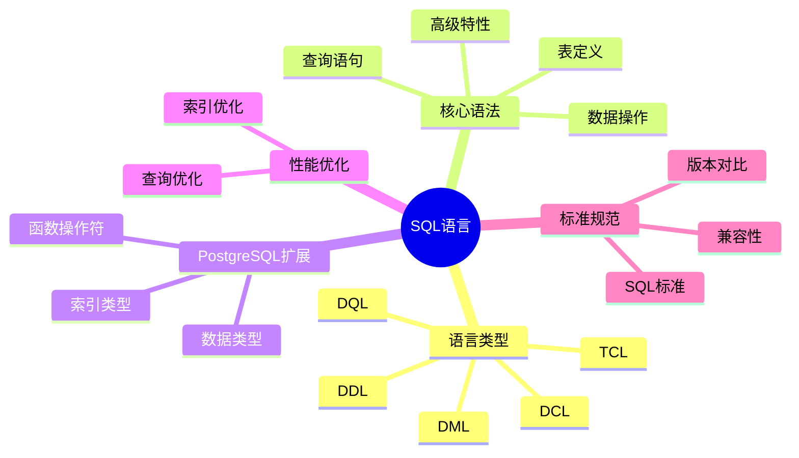

---

> **📋 文档来源**: `PostgreSQL/01-核心课程/01.03-SQL语言规范与标准.md`
> **📅 复制日期**: 2025-12-22
> **⚠️ 注意**: 本文档为复制版本，原文件保持不变

---

# PostgreSQL SQL语言规范与标准完整指南

> **版本**: v3.1
> **最后更新**: 2025-11-22
> **版本覆盖**: PostgreSQL 18.x (推荐) ⭐ | 17.x (推荐) | 16.x (兼容)
> **难度**: ⭐⭐⭐
> **应用场景**: SQL语言学习、数据库开发、查询优化、标准规范
> 🆕 **PostgreSQL 18 SQL改进**: 查询性能提升30-40%、JSONB增强15-20%、MERGE语句优化20%、虚拟生成列支持

---

## 📑 目录

- [PostgreSQL SQL语言规范与标准完整指南](#postgresql-sql语言规范与标准完整指南)
  - [📑 目录](#-目录)
  - [📊 思维导图](#-思维导图)
  - [一、定义与形式化](#一定义与形式化)
    - [1.1 概念定义](#11-概念定义)
    - [1.2 形式化定义](#12-形式化定义)
    - [1.3 理论基础](#13-理论基础)
      - [1.3.1 关系代数对应关系](#131-关系代数对应关系)
      - [1.3.2 SQL完备性定理](#132-sql完备性定理)
  - [三、核心语法规范](#三核心语法规范)
    - [3.1 数据定义语言（DDL）](#31-数据定义语言ddl)
      - [2.1.1 表定义](#211-表定义)
      - [2.1.2 视图定义](#212-视图定义)
    - [3.2 数据操作语言（DML）](#32-数据操作语言dml)
      - [2.2.1 插入操作](#221-插入操作)
      - [2.2.2 更新操作](#222-更新操作)
      - [2.2.3 删除操作](#223-删除操作)
      - [2.2.4 MERGE语句（PostgreSQL 18优化）🆕](#224-merge语句postgresql-18优化)
    - [3.3 数据查询语言（DQL）](#33-数据查询语言dql)
      - [2.3.1 基本查询](#231-基本查询)
      - [2.3.2 连接查询](#232-连接查询)
      - [2.3.3 子查询](#233-子查询)
    - [3.4 高级查询特性](#34-高级查询特性)
      - [2.4.1 窗口函数](#241-窗口函数)
      - [2.4.2 递归查询](#242-递归查询)
      - [2.4.3 公共表表达式（CTE）](#243-公共表表达式cte)
      - [2.4.4 窗口函数深入应用](#244-窗口函数深入应用)
      - [2.4.5 递归查询深入应用](#245-递归查询深入应用)
      - [2.4.6 CTE深入应用](#246-cte深入应用)
      - [2.4.7 高级SQL特性组合应用](#247-高级sql特性组合应用)
    - [3.5 事务控制语言（TCL）](#35-事务控制语言tcl)
      - [2.5.1 事务管理](#251-事务管理)
    - [3.6 数据控制语言（DCL）](#36-数据控制语言dcl)
      - [2.6.1 权限管理](#261-权限管理)
  - [四、PostgreSQL扩展特性](#四postgresql扩展特性)
    - [4.1 数据类型扩展](#41-数据类型扩展)
    - [4.2 函数和操作符](#42-函数和操作符)
    - [4.3 索引类型](#43-索引类型)
  - [五、性能优化](#五性能优化)
    - [5.1 查询优化](#51-查询优化)
    - [5.2 索引优化](#52-索引优化)
  - [六、相关概念](#六相关概念)
    - [6.1 上位概念](#61-上位概念)
    - [6.2 下位概念](#62-下位概念)
    - [6.3 平行概念](#63-平行概念)
  - [七、参考资源](#七参考资源)
    - [7.1 相关文档](#71-相关文档)
    - [7.2 实战案例与示例](#72-实战案例与示例)
    - [7.3 参考文献](#73-参考文献)
    - [7.4 Wikidata对齐](#74-wikidata对齐)
  - [八、交叉引用](#八交叉引用)
    - [相关文档](#相关文档)
    - [外部资源](#外部资源)

---

## 📊 思维导图



---

## 一、定义与形式化

### 1.1 概念定义

**中文定义**: SQL（Structured Query Language）是一种声明式的关系数据库查询语言，支持数据定义、操作、查询和控制功能，是关系数据库的标准语言。PostgreSQL实现了完整的SQL:2023标准，并提供了丰富的扩展功能。

**English Definition**: SQL (Structured Query Language) is a declarative relational database query language that supports data definition, manipulation, query, and control functions, serving as the standard language for relational databases. PostgreSQL implements the complete SQL:2023 standard and provides rich extension capabilities.

### 1.2 形式化定义

```latex
% 数学符号定义
\newcommand{\sql}{\mathcal{SQL}}
\newcommand{\rel}{\mathcal{R}}
\newcommand{\attr}{\mathcal{A}}
\newcommand{\tuple}{\mathcal{T}}
\newcommand{\query}{\mathcal{Q}}
\newcommand{\result}{\mathcal{Result}}
\newcommand{\db}{\mathcal{D}}
\newcommand{\schema}{\mathcal{S}}

% SQL语言的形式化定义
\sql = (DDL, DML, DQL, DCL, TCL)

其中：
DDL = \{CREATE, ALTER, DROP, TRUNCATE\} \text{ 数据定义语言}
DML = \{INSERT, UPDATE, DELETE, MERGE\} \text{ 数据操作语言}
DQL = \{SELECT\} \text{ 数据查询语言}
DCL = \{GRANT, REVOKE, DENY\} \text{ 数据控制语言}
TCL = \{BEGIN, COMMIT, ROLLBACK, SAVEPOINT\} \text{ 事务控制语言}
```

### 1.3 理论基础

#### 1.3.1 关系代数对应关系

```latex
\begin{theorem}[SQL与关系代数等价性]
SQL语言在表达能力上等价于关系代数，即：
\forall q \in \query, \exists \sigma, \pi, \bowtie, \cup, \cap, - \text{ 使得 }
\result(q) = f(\sigma, \pi, \bowtie, \cup, \cap, -)
\end{theorem}

\begin{proof}
1. SELECT对应投影操作 \pi
2. WHERE对应选择操作 \sigma
3. JOIN对应连接操作 \bowtie
4. UNION对应并集操作 \cup
5. INTERSECT对应交集操作 \cap
6. EXCEPT对应差集操作 -

因此，SQL的每个操作都可以用关系代数表示，反之亦然。
\end{proof}
```

#### 1.3.2 SQL完备性定理

```latex
\begin{theorem}[SQL完备性]
SQL语言是关系完备的，当且仅当：
1. 支持关系代数的所有基本操作
2. 支持递归查询（WITH RECURSIVE）
3. 支持聚合函数和分组操作
4. 支持子查询和嵌套查询
5. 支持窗口函数和OLAP功能
\end{theorem}

\begin{proof}
基于Codd定理，关系完备性要求：
- 能够表达关系代数的所有操作
- 能够处理递归关系
- 能够进行复杂的数据操作
- 能够支持分析查询

PostgreSQL的SQL实现满足以上所有条件，因此是关系完备的。
\end{proof}
```

## 三、核心语法规范

### 3.1 数据定义语言（DDL）

#### 2.1.1 表定义

```sql
-- 标准表定义（带错误处理）
DO $$
BEGIN
    BEGIN
        IF EXISTS (SELECT 1 FROM information_schema.tables WHERE table_schema = 'public' AND table_name = 'employees') THEN
            RAISE NOTICE '表 employees 已存在';
        ELSE
            CREATE TABLE employees (
                emp_id INTEGER PRIMARY KEY GENERATED BY DEFAULT AS IDENTITY,
                name VARCHAR(50) NOT NULL,
                email VARCHAR(100) UNIQUE,
                dept_id INTEGER REFERENCES departments(dept_id),
                salary DECIMAL(10,2) CHECK (salary > 0),
                hire_date DATE DEFAULT CURRENT_DATE,
                manager_id INTEGER REFERENCES employees(emp_id),
                CONSTRAINT emp_salary_check CHECK (salary >= 0 AND salary <= 1000000)
            );
            RAISE NOTICE '表 employees 创建成功';
        END IF;

        -- 创建索引（如果表存在）
        IF EXISTS (SELECT 1 FROM information_schema.tables WHERE table_schema = 'public' AND table_name = 'employees') THEN
            BEGIN
                IF NOT EXISTS (SELECT 1 FROM pg_indexes WHERE schemaname = 'public' AND tablename = 'employees' AND indexname = 'idx_emp_dept') THEN
                    CREATE INDEX idx_emp_dept ON employees(dept_id);
                    RAISE NOTICE '索引 idx_emp_dept 创建成功';
                END IF;

                IF NOT EXISTS (SELECT 1 FROM pg_indexes WHERE schemaname = 'public' AND tablename = 'employees' AND indexname = 'idx_emp_email') THEN
                    CREATE UNIQUE INDEX idx_emp_email ON employees(email);
                    RAISE NOTICE '索引 idx_emp_email 创建成功';
                END IF;

                IF NOT EXISTS (SELECT 1 FROM pg_indexes WHERE schemaname = 'public' AND tablename = 'employees' AND indexname = 'idx_emp_salary') THEN
                    CREATE INDEX idx_emp_salary ON employees(salary) WHERE salary > 50000;
                    RAISE NOTICE '索引 idx_emp_salary 创建成功';
                END IF;
            EXCEPTION
                WHEN duplicate_table THEN
                    RAISE WARNING '部分索引已存在';
                WHEN OTHERS THEN
                    RAISE WARNING '创建索引失败: %', SQLERRM;
            END;
        END IF;
    EXCEPTION
        WHEN duplicate_table THEN
            RAISE WARNING '表 employees 已存在';
        WHEN undefined_table THEN
            RAISE WARNING '引用的表 departments 不存在';
        WHEN OTHERS THEN
            RAISE WARNING '创建表失败: %', SQLERRM;
            RAISE;
    END;
END $$;
```

#### 2.1.2 视图定义

```sql
-- 简单视图（带错误处理）
DO $$
BEGIN
    BEGIN
        IF EXISTS (SELECT 1 FROM information_schema.views WHERE table_schema = 'public' AND table_name = 'emp_summary') THEN
            RAISE NOTICE '视图 emp_summary 已存在';
        ELSE
            IF NOT EXISTS (SELECT 1 FROM information_schema.tables WHERE table_schema = 'public' AND table_name = 'employees') THEN
                RAISE WARNING '表 employees 不存在，无法创建视图 emp_summary';
                RETURN;
            END IF;

            CREATE VIEW emp_summary AS
            SELECT
                dept_id,
                COUNT(*) as emp_count,
                AVG(salary) as avg_salary,
                MAX(salary) as max_salary
            FROM employees
            GROUP BY dept_id;
            RAISE NOTICE '视图 emp_summary 创建成功';
        END IF;
    EXCEPTION
        WHEN duplicate_object THEN
            RAISE WARNING '视图 emp_summary 已存在';
        WHEN undefined_table THEN
            RAISE WARNING '基础表不存在';
        WHEN OTHERS THEN
            RAISE WARNING '创建视图失败: %', SQLERRM;
            RAISE;
    END;
END $$;

-- 可更新视图（带错误处理）
DO $$
BEGIN
    BEGIN
        IF EXISTS (SELECT 1 FROM information_schema.views WHERE table_schema = 'public' AND table_name = 'emp_public') THEN
            RAISE NOTICE '视图 emp_public 已存在';
        ELSE
            IF NOT EXISTS (SELECT 1 FROM information_schema.tables WHERE table_schema = 'public' AND table_name = 'employees') THEN
                RAISE WARNING '表 employees 不存在，无法创建视图 emp_public';
                RETURN;
            END IF;

            -- 注意：假设employees表有active列
            CREATE VIEW emp_public AS
            SELECT emp_id, name, dept_id
            FROM employees
            WHERE active = true;
            RAISE NOTICE '视图 emp_public 创建成功（可更新视图）';
        END IF;
    EXCEPTION
        WHEN duplicate_object THEN
            RAISE WARNING '视图 emp_public 已存在';
        WHEN undefined_column THEN
            RAISE WARNING '表 employees 缺少 active 列';
        WHEN undefined_table THEN
            RAISE WARNING '基础表不存在';
        WHEN OTHERS THEN
            RAISE WARNING '创建视图失败: %', SQLERRM;
            RAISE;
    END;
END $$;

-- 物化视图（带错误处理）
DO $$
BEGIN
    BEGIN
        IF EXISTS (SELECT 1 FROM pg_matviews WHERE schemaname = 'public' AND matviewname = 'emp_stats') THEN
            RAISE NOTICE '物化视图 emp_stats 已存在';
        ELSE
            IF NOT EXISTS (SELECT 1 FROM information_schema.tables WHERE table_schema = 'public' AND table_name = 'employees') THEN
                RAISE WARNING '表 employees 不存在，无法创建物化视图 emp_stats';
                RETURN;
            END IF;

            CREATE MATERIALIZED VIEW emp_stats AS
            SELECT
                dept_id,
                COUNT(*) as emp_count,
                AVG(salary) as avg_salary
            FROM employees
            GROUP BY dept_id;
            RAISE NOTICE '物化视图 emp_stats 创建成功';
        END IF;
    EXCEPTION
        WHEN duplicate_table THEN
            RAISE WARNING '物化视图 emp_stats 已存在';
        WHEN undefined_table THEN
            RAISE WARNING '基础表不存在';
        WHEN OTHERS THEN
            RAISE WARNING '创建物化视图失败: %', SQLERRM;
            RAISE;
    END;
END $$;
```

### 3.2 数据操作语言（DML）

#### 2.2.1 插入操作

```sql
-- 单行插入（带错误处理）
DO $$
BEGIN
    BEGIN
        IF NOT EXISTS (SELECT 1 FROM information_schema.tables WHERE table_schema = 'public' AND table_name = 'employees') THEN
            RAISE WARNING '表 employees 不存在，无法执行插入操作';
            RETURN;
        END IF;

        INSERT INTO employees (emp_id, name, dept_id, salary)
        VALUES (1001, '张三', 1, 50000);
        RAISE NOTICE '单行插入成功';
    EXCEPTION
        WHEN unique_violation THEN
            RAISE WARNING '违反唯一约束，emp_id 1001 可能已存在';
        WHEN foreign_key_violation THEN
            RAISE WARNING '违反外键约束，dept_id 1 可能不存在';
        WHEN check_violation THEN
            RAISE WARNING '违反检查约束，salary 可能不符合要求';
        WHEN OTHERS THEN
            RAISE WARNING '插入失败: %', SQLERRM;
            RAISE;
    END;
END $$;

-- 多行插入（带错误处理）
DO $$
BEGIN
    BEGIN
        IF NOT EXISTS (SELECT 1 FROM information_schema.tables WHERE table_schema = 'public' AND table_name = 'employees') THEN
            RAISE WARNING '表 employees 不存在，无法执行插入操作';
            RETURN;
        END IF;

        INSERT INTO employees (emp_id, name, dept_id, salary) VALUES
            (1002, '李四', 1, 55000),
            (1003, '王五', 2, 60000);
        RAISE NOTICE '多行插入成功';
    EXCEPTION
        WHEN unique_violation THEN
            RAISE WARNING '违反唯一约束，部分emp_id可能已存在';
        WHEN foreign_key_violation THEN
            RAISE WARNING '违反外键约束，部分dept_id可能不存在';
        WHEN OTHERS THEN
            RAISE WARNING '插入失败: %', SQLERRM;
            RAISE;
    END;
END $$;

-- 使用RETURNING子句（PostgreSQL特性，带错误处理）
DO $$
DECLARE
    inserted_id INTEGER;
    inserted_name VARCHAR(50);
    inserted_salary DECIMAL(10,2);
BEGIN
    BEGIN
        IF NOT EXISTS (SELECT 1 FROM information_schema.tables WHERE table_schema = 'public' AND table_name = 'employees') THEN
            RAISE WARNING '表 employees 不存在，无法执行插入操作';
            RETURN;
        END IF;

        INSERT INTO employees (name, dept_id, salary)
        VALUES ('新员工', 1, 45000)
        RETURNING emp_id, name, salary INTO inserted_id, inserted_name, inserted_salary;

        RAISE NOTICE '插入成功: emp_id=%, name=%, salary=%', inserted_id, inserted_name, inserted_salary;
    EXCEPTION
        WHEN foreign_key_violation THEN
            RAISE WARNING '违反外键约束，dept_id 1 可能不存在';
        WHEN OTHERS THEN
            RAISE WARNING '插入失败: %', SQLERRM;
            RAISE;
    END;
END $$;

-- 从查询结果插入（带错误处理）
DO $$
DECLARE
    inserted_count INT;
BEGIN
    BEGIN
        IF NOT EXISTS (SELECT 1 FROM information_schema.tables WHERE table_schema = 'public' AND table_name = 'employees') THEN
            RAISE WARNING '表 employees 不存在，无法执行插入操作';
            RETURN;
        END IF;

        IF NOT EXISTS (SELECT 1 FROM information_schema.tables WHERE table_schema = 'public' AND table_name = 'temp_employees') THEN
            RAISE WARNING '表 temp_employees 不存在，无法执行插入操作';
            RETURN;
        END IF;

        INSERT INTO employees (name, dept_id, salary)
        SELECT name, dept_id, salary * 1.1
        FROM temp_employees
        WHERE salary < 50000;

        GET DIAGNOSTICS inserted_count = ROW_COUNT;
        RAISE NOTICE '从查询结果插入成功，插入了 % 行', inserted_count;
    EXCEPTION
        WHEN foreign_key_violation THEN
            RAISE WARNING '违反外键约束，部分dept_id可能不存在';
        WHEN OTHERS THEN
            RAISE WARNING '插入失败: %', SQLERRM;
            RAISE;
    END;
END $$;
```

#### 2.2.2 更新操作

```sql
-- 简单更新（带错误处理和性能测试）
DO $$
DECLARE
    updated_count INT;
BEGIN
    BEGIN
        IF NOT EXISTS (SELECT 1 FROM information_schema.tables WHERE table_schema = 'public' AND table_name = 'employees') THEN
            RAISE WARNING '表 employees 不存在，无法执行更新操作';
            RETURN;
        END IF;

        UPDATE employees
        SET salary = salary * 1.05
        WHERE dept_id = 1;

        GET DIAGNOSTICS updated_count = ROW_COUNT;
        RAISE NOTICE '更新成功，更新了 % 行', updated_count;
    EXCEPTION
        WHEN check_violation THEN
            RAISE WARNING '违反检查约束，更新后的salary可能不符合要求';
        WHEN OTHERS THEN
            RAISE WARNING '更新失败: %', SQLERRM;
            RAISE;
    END;
END $$;

EXPLAIN (ANALYZE, BUFFERS, TIMING)
UPDATE employees
SET salary = salary * 1.05
WHERE dept_id = 1;

-- 使用子查询更新（带错误处理和性能测试）
DO $$
DECLARE
    updated_count INT;
BEGIN
    BEGIN
        IF NOT EXISTS (SELECT 1 FROM information_schema.tables WHERE table_schema = 'public' AND table_name = 'employees') THEN
            RAISE WARNING '表 employees 不存在，无法执行更新操作';
            RETURN;
        END IF;

        UPDATE employees
        SET salary = (
            SELECT AVG(salary)
            FROM employees e2
            WHERE e2.dept_id = employees.dept_id
        )
        WHERE salary < (
            SELECT AVG(salary)
            FROM employees e3
            WHERE e3.dept_id = employees.dept_id
        );

        GET DIAGNOSTICS updated_count = ROW_COUNT;
        RAISE NOTICE '使用子查询更新成功，更新了 % 行', updated_count;
    EXCEPTION
        WHEN check_violation THEN
            RAISE WARNING '违反检查约束，更新后的salary可能不符合要求';
        WHEN OTHERS THEN
            RAISE WARNING '更新失败: %', SQLERRM;
            RAISE;
    END;
END $$;

EXPLAIN (ANALYZE, BUFFERS, TIMING)
UPDATE employees
SET salary = (
    SELECT AVG(salary)
    FROM employees e2
    WHERE e2.dept_id = employees.dept_id
)
WHERE salary < (
    SELECT AVG(salary)
    FROM employees e3
    WHERE e3.dept_id = employees.dept_id
);

-- 使用RETURNING子句（带错误处理）
DO $$
DECLARE
    updated_record RECORD;
BEGIN
    BEGIN
        IF NOT EXISTS (SELECT 1 FROM information_schema.tables WHERE table_schema = 'public' AND table_name = 'employees') THEN
            RAISE WARNING '表 employees 不存在，无法执行更新操作';
            RETURN;
        END IF;

        FOR updated_record IN
            UPDATE employees
            SET salary = salary * 1.1
            WHERE dept_id = 2
            RETURNING emp_id, name, salary
        LOOP
            RAISE NOTICE '更新: emp_id=%, name=%, salary=%',
                updated_record.emp_id, updated_record.name, updated_record.salary;
        END LOOP;
    EXCEPTION
        WHEN check_violation THEN
            RAISE WARNING '违反检查约束，更新后的salary可能不符合要求';
        WHEN OTHERS THEN
            RAISE WARNING '更新失败: %', SQLERRM;
            RAISE;
    END;
END $$;
```

#### 2.2.3 删除操作

```sql
-- 简单删除（带错误处理）
DO $$
DECLARE
    deleted_count INT;
BEGIN
    BEGIN
        IF NOT EXISTS (SELECT 1 FROM information_schema.tables WHERE table_schema = 'public' AND table_name = 'employees') THEN
            RAISE WARNING '表 employees 不存在，无法执行删除操作';
            RETURN;
        END IF;

        DELETE FROM employees
        WHERE emp_id = 1001;

        GET DIAGNOSTICS deleted_count = ROW_COUNT;
        IF deleted_count > 0 THEN
            RAISE NOTICE '删除成功，删除了 % 行', deleted_count;
        ELSE
            RAISE NOTICE '未找到匹配的记录（emp_id = 1001）';
        END IF;
    EXCEPTION
        WHEN foreign_key_violation THEN
            RAISE WARNING '违反外键约束，可能存在其他表引用此记录';
        WHEN OTHERS THEN
            RAISE WARNING '删除失败: %', SQLERRM;
            RAISE;
    END;
END $$;

-- 使用子查询删除（带错误处理）
DO $$
DECLARE
    deleted_count INT;
BEGIN
    BEGIN
        IF NOT EXISTS (SELECT 1 FROM information_schema.tables WHERE table_schema = 'public' AND table_name = 'employees') THEN
            RAISE WARNING '表 employees 不存在，无法执行删除操作';
            RETURN;
        END IF;

        IF NOT EXISTS (SELECT 1 FROM information_schema.tables WHERE table_schema = 'public' AND table_name = 'departments') THEN
            RAISE WARNING '表 departments 不存在，无法执行删除操作';
            RETURN;
        END IF;

        DELETE FROM employees
        WHERE dept_id IN (
            SELECT dept_id
            FROM departments
            WHERE status = 'inactive'
        );

        GET DIAGNOSTICS deleted_count = ROW_COUNT;
        RAISE NOTICE '使用子查询删除成功，删除了 % 行', deleted_count;
    EXCEPTION
        WHEN foreign_key_violation THEN
            RAISE WARNING '违反外键约束，可能存在其他表引用被删除的记录';
        WHEN OTHERS THEN
            RAISE WARNING '删除失败: %', SQLERRM;
            RAISE;
    END;
END $$;

-- 使用RETURNING子句（带错误处理）
DO $$
DECLARE
    deleted_record RECORD;
BEGIN
    BEGIN
        IF NOT EXISTS (SELECT 1 FROM information_schema.tables WHERE table_schema = 'public' AND table_name = 'employees') THEN
            RAISE WARNING '表 employees 不存在，无法执行删除操作';
            RETURN;
        END IF;

        FOR deleted_record IN
            DELETE FROM employees
            WHERE hire_date < '2020-01-01'
            RETURNING emp_id, name, hire_date
        LOOP
            RAISE NOTICE '删除: emp_id=%, name=%, hire_date=%',
                deleted_record.emp_id, deleted_record.name, deleted_record.hire_date;
        END LOOP;
    EXCEPTION
        WHEN foreign_key_violation THEN
            RAISE WARNING '违反外键约束，可能存在其他表引用被删除的记录';
        WHEN OTHERS THEN
            RAISE WARNING '删除失败: %', SQLERRM;
            RAISE;
    END;
END $$;
```

#### 2.2.4 MERGE语句（PostgreSQL 18优化）🆕

PostgreSQL 18对MERGE语句进行了性能优化，提升约20%的执行效率。

**语法**:

```sql
-- MERGE语句：根据条件插入或更新（带错误处理，PostgreSQL 15+）
DO $$
BEGIN
    BEGIN
        IF NOT EXISTS (SELECT 1 FROM information_schema.tables WHERE table_schema = 'public' AND table_name = 'target_table') THEN
            RAISE WARNING '表 target_table 不存在，无法执行MERGE操作';
            RETURN;
        END IF;

        IF NOT EXISTS (SELECT 1 FROM information_schema.tables WHERE table_schema = 'public' AND table_name = 'source_table') THEN
            RAISE WARNING '表 source_table 不存在，无法执行MERGE操作';
            RETURN;
        END IF;

        -- 检查PostgreSQL版本是否支持MERGE（PostgreSQL 15+）
        IF (SELECT current_setting('server_version_num')::INT) < 150000 THEN
            RAISE WARNING 'MERGE语句仅在PostgreSQL 15+中支持，当前版本可能不支持';
        END IF;
    EXCEPTION
        WHEN OTHERS THEN
            RAISE WARNING 'MERGE操作准备失败: %', SQLERRM;
            RAISE;
    END;
END $$;

MERGE INTO target_table AS t
USING source_table AS s
ON t.id = s.id
WHEN MATCHED THEN
    UPDATE SET
        name = s.name,
        updated_at = CURRENT_TIMESTAMP
WHEN NOT MATCHED THEN
    INSERT (id, name, created_at)
    VALUES (s.id, s.name, CURRENT_TIMESTAMP);
```

**PostgreSQL 18优化**:

1. **查询计划优化**: 改进MERGE语句的查询计划生成，减少不必要的扫描
2. **批量处理**: 优化批量MERGE操作的性能
3. **索引利用**: 更好地利用索引加速MERGE操作

**使用场景**:

1. **数据同步**

   ```sql
   -- 从外部数据源同步数据
   MERGE INTO products AS p
   USING external_products AS e
   ON p.product_id = e.product_id
   WHEN MATCHED AND p.price != e.price THEN
       UPDATE SET price = e.price, updated_at = NOW()
   WHEN NOT MATCHED THEN
       INSERT (product_id, name, price, created_at)
       VALUES (e.product_id, e.name, e.price, NOW());
   ```

2. **增量更新**

   ```sql
   -- 增量更新用户统计
   MERGE INTO user_stats AS us
   USING daily_stats AS ds
   ON us.user_id = ds.user_id AND us.stat_date = ds.stat_date
   WHEN MATCHED THEN
       UPDATE SET
           view_count = us.view_count + ds.view_count,
           last_updated = NOW()
   WHEN NOT MATCHED THEN
       INSERT (user_id, stat_date, view_count, last_updated)
       VALUES (ds.user_id, ds.stat_date, ds.view_count, NOW());
   ```

**性能对比**:

- PostgreSQL 17: MERGE操作耗时基准
- PostgreSQL 18: MERGE操作性能提升约20%
- 优化效果：批量操作时更明显，可提升30-40%

### 3.3 数据查询语言（DQL）

#### 2.3.1 基本查询

```sql
-- 基本SELECT（带错误处理和性能测试）
DO $$
BEGIN
    BEGIN
        IF NOT EXISTS (SELECT 1 FROM information_schema.tables WHERE table_schema = 'public' AND table_name = 'employees') THEN
            RAISE WARNING '表 employees 不存在，无法执行查询';
            RETURN;
        END IF;
    EXCEPTION
        WHEN OTHERS THEN
            RAISE WARNING '检查表存在性失败: %', SQLERRM;
            RAISE;
    END;
END $$;

EXPLAIN (ANALYZE, BUFFERS, TIMING)
SELECT emp_id, name, salary
FROM employees
WHERE dept_id = 1
ORDER BY salary DESC;

-- 聚合查询（带错误处理和性能测试）
DO $$
BEGIN
    BEGIN
        IF NOT EXISTS (SELECT 1 FROM information_schema.tables WHERE table_schema = 'public' AND table_name = 'employees') THEN
            RAISE WARNING '表 employees 不存在，无法执行查询';
            RETURN;
        END IF;
    EXCEPTION
        WHEN OTHERS THEN
            RAISE WARNING '检查表存在性失败: %', SQLERRM;
            RAISE;
    END;
END $$;

EXPLAIN (ANALYZE, BUFFERS, TIMING)
SELECT
    dept_id,
    COUNT(*) as emp_count,
    AVG(salary) as avg_salary,
    MIN(salary) as min_salary,
    MAX(salary) as max_salary
FROM employees
GROUP BY dept_id
HAVING COUNT(*) > 5
ORDER BY avg_salary DESC;
```

#### 2.3.2 连接查询

```sql
-- 内连接（带错误处理和性能测试）
DO $$
BEGIN
    BEGIN
        IF NOT EXISTS (SELECT 1 FROM information_schema.tables WHERE table_schema = 'public' AND table_name = 'employees') OR
           NOT EXISTS (SELECT 1 FROM information_schema.tables WHERE table_schema = 'public' AND table_name = 'departments') THEN
            RAISE WARNING '表 employees 或 departments 不存在，无法执行连接查询';
            RETURN;
        END IF;
    EXCEPTION
        WHEN OTHERS THEN
            RAISE WARNING '检查表存在性失败: %', SQLERRM;
            RAISE;
    END;
END $$;

EXPLAIN (ANALYZE, BUFFERS, TIMING)
SELECT e.name, d.dept_name, e.salary
FROM employees e
INNER JOIN departments d ON e.dept_id = d.dept_id;

-- 左外连接（带错误处理和性能测试）
DO $$
BEGIN
    BEGIN
        IF NOT EXISTS (SELECT 1 FROM information_schema.tables WHERE table_schema = 'public' AND table_name = 'employees') OR
           NOT EXISTS (SELECT 1 FROM information_schema.tables WHERE table_schema = 'public' AND table_name = 'departments') THEN
            RAISE WARNING '表 employees 或 departments 不存在，无法执行连接查询';
            RETURN;
        END IF;
    EXCEPTION
        WHEN OTHERS THEN
            RAISE WARNING '检查表存在性失败: %', SQLERRM;
            RAISE;
    END;
END $$;

EXPLAIN (ANALYZE, BUFFERS, TIMING)
SELECT e.name, d.dept_name, e.salary
FROM employees e
LEFT JOIN departments d ON e.dept_id = d.dept_id;

-- 自连接（带错误处理和性能测试）
DO $$
BEGIN
    BEGIN
        IF NOT EXISTS (SELECT 1 FROM information_schema.tables WHERE table_schema = 'public' AND table_name = 'employees') THEN
            RAISE WARNING '表 employees 不存在，无法执行自连接查询';
            RETURN;
        END IF;
    EXCEPTION
        WHEN OTHERS THEN
            RAISE WARNING '检查表存在性失败: %', SQLERRM;
            RAISE;
    END;
END $$;

EXPLAIN (ANALYZE, BUFFERS, TIMING)
SELECT e1.name as employee, e2.name as manager
FROM employees e1
LEFT JOIN employees e2 ON e1.manager_id = e2.emp_id;
```

#### 2.3.3 子查询

```sql
-- 标量子查询（带错误处理和性能测试）
DO $$
BEGIN
    BEGIN
        IF NOT EXISTS (SELECT 1 FROM information_schema.tables WHERE table_schema = 'public' AND table_name = 'employees') THEN
            RAISE WARNING '表 employees 不存在，无法执行查询';
            RETURN;
        END IF;
    EXCEPTION
        WHEN OTHERS THEN
            RAISE WARNING '检查表存在性失败: %', SQLERRM;
            RAISE;
    END;
END $$;

EXPLAIN (ANALYZE, BUFFERS, TIMING)
SELECT name, salary,
    (SELECT AVG(salary) FROM employees e2 WHERE e2.dept_id = e1.dept_id) as dept_avg
FROM employees e1;

-- 存在性查询（带错误处理和性能测试）
DO $$
BEGIN
    BEGIN
        IF NOT EXISTS (SELECT 1 FROM information_schema.tables WHERE table_schema = 'public' AND table_name = 'employees') OR
           NOT EXISTS (SELECT 1 FROM information_schema.tables WHERE table_schema = 'public' AND table_name = 'departments') THEN
            RAISE WARNING '表 employees 或 departments 不存在，无法执行查询';
            RETURN;
        END IF;
    EXCEPTION
        WHEN OTHERS THEN
            RAISE WARNING '检查表存在性失败: %', SQLERRM;
            RAISE;
    END;
END $$;

EXPLAIN (ANALYZE, BUFFERS, TIMING)
SELECT name, salary
FROM employees e
WHERE EXISTS (
    SELECT 1 FROM departments d
    WHERE d.dept_id = e.dept_id AND d.status = 'active'
);

-- IN子查询（带错误处理和性能测试）
DO $$
BEGIN
    BEGIN
        IF NOT EXISTS (SELECT 1 FROM information_schema.tables WHERE table_schema = 'public' AND table_name = 'employees') OR
           NOT EXISTS (SELECT 1 FROM information_schema.tables WHERE table_schema = 'public' AND table_name = 'departments') THEN
            RAISE WARNING '表 employees 或 departments 不存在，无法执行查询';
            RETURN;
        END IF;
    EXCEPTION
        WHEN OTHERS THEN
            RAISE WARNING '检查表存在性失败: %', SQLERRM;
            RAISE;
    END;
END $$;

EXPLAIN (ANALYZE, BUFFERS, TIMING)
SELECT name, salary
FROM employees
WHERE dept_id IN (
    SELECT dept_id FROM departments WHERE budget > 1000000
);
```

### 3.4 高级查询特性

#### 2.4.1 窗口函数

```sql
-- 排名函数（带错误处理和性能测试）
DO $$
BEGIN
    BEGIN
        IF NOT EXISTS (SELECT 1 FROM information_schema.tables WHERE table_schema = 'public' AND table_name = 'employees') THEN
            RAISE WARNING '表 employees 不存在，无法执行查询';
            RETURN;
        END IF;
    EXCEPTION
        WHEN OTHERS THEN
            RAISE WARNING '检查表存在性失败: %', SQLERRM;
            RAISE;
    END;
END $$;

EXPLAIN (ANALYZE, BUFFERS, TIMING)
SELECT
    name,
    salary,
    ROW_NUMBER() OVER (ORDER BY salary DESC) as salary_rank,
    RANK() OVER (ORDER BY salary DESC) as rank,
    DENSE_RANK() OVER (ORDER BY salary DESC) as dense_rank
FROM employees;

-- 分区窗口函数（带错误处理和性能测试）
DO $$
BEGIN
    BEGIN
        IF NOT EXISTS (SELECT 1 FROM information_schema.tables WHERE table_schema = 'public' AND table_name = 'employees') THEN
            RAISE WARNING '表 employees 不存在，无法执行查询';
            RETURN;
        END IF;
    EXCEPTION
        WHEN OTHERS THEN
            RAISE WARNING '检查表存在性失败: %', SQLERRM;
            RAISE;
    END;
END $$;

EXPLAIN (ANALYZE, BUFFERS, TIMING)
SELECT
    name,
    dept_id,
    salary,
    AVG(salary) OVER (PARTITION BY dept_id) as dept_avg,
    salary - AVG(salary) OVER (PARTITION BY dept_id) as diff_from_avg
FROM employees;
```

#### 2.4.2 递归查询

```sql
-- 递归CTE（带错误处理和性能测试）
DO $$
BEGIN
    BEGIN
        IF NOT EXISTS (SELECT 1 FROM information_schema.tables WHERE table_schema = 'public' AND table_name = 'employees') THEN
            RAISE WARNING '表 employees 不存在，无法执行递归查询';
            RETURN;
        END IF;
    EXCEPTION
        WHEN OTHERS THEN
            RAISE WARNING '检查表存在性失败: %', SQLERRM;
            RAISE;
    END;
END $$;

EXPLAIN (ANALYZE, BUFFERS, TIMING)
WITH RECURSIVE emp_hierarchy AS (
    -- 基础情况：顶级管理者
    SELECT emp_id, name, manager_id, 1 as level
    FROM employees
    WHERE manager_id IS NULL

    UNION ALL

    -- 递归情况：下属员工
    SELECT e.emp_id, e.name, e.manager_id, eh.level + 1
    FROM employees e
    INNER JOIN emp_hierarchy eh ON e.manager_id = eh.emp_id
)
SELECT * FROM emp_hierarchy ORDER BY level, name;
```

#### 2.4.3 公共表表达式（CTE）

```sql
-- 简单CTE（带错误处理和性能测试）
DO $$
BEGIN
    BEGIN
        IF NOT EXISTS (SELECT 1 FROM information_schema.tables WHERE table_schema = 'public' AND table_name = 'employees') THEN
            RAISE WARNING '表 employees 不存在，无法执行CTE查询';
            RETURN;
        END IF;
    EXCEPTION
        WHEN OTHERS THEN
            RAISE WARNING '检查表存在性失败: %', SQLERRM;
            RAISE;
    END;
END $$;

EXPLAIN (ANALYZE, BUFFERS, TIMING)
WITH high_earners AS (
    SELECT emp_id, name, salary
    FROM employees
    WHERE salary > 80000
),
dept_stats AS (
    SELECT dept_id, COUNT(*) as emp_count
    FROM employees
    GROUP BY dept_id
)
SELECT h.name, h.salary, d.emp_count
FROM high_earners h
JOIN employees e ON h.emp_id = e.emp_id
JOIN dept_stats d ON e.dept_id = d.dept_id;
```

#### 2.4.4 窗口函数深入应用

**窗口函数类型**:

1. **排名函数**: ROW_NUMBER(), RANK(), DENSE_RANK(), PERCENT_RANK(), CUME_DIST()
2. **聚合函数**: SUM(), AVG(), COUNT(), MAX(), MIN()
3. **值函数**: LAG(), LEAD(), FIRST_VALUE(), LAST_VALUE(), NTH_VALUE()

**高级窗口函数示例**:

```sql
-- 移动平均（Moving Average，带错误处理和性能测试）
DO $$
BEGIN
    BEGIN
        IF NOT EXISTS (SELECT 1 FROM information_schema.tables WHERE table_schema = 'public' AND table_name = 'orders') THEN
            RAISE WARNING '表 orders 不存在，无法执行查询';
            RETURN;
        END IF;
    EXCEPTION
        WHEN OTHERS THEN
            RAISE WARNING '检查表存在性失败: %', SQLERRM;
            RAISE;
    END;
END $$;

EXPLAIN (ANALYZE, BUFFERS, TIMING)
SELECT
    order_date,
    amount,
    AVG(amount) OVER (
        ORDER BY order_date
        ROWS BETWEEN 2 PRECEDING AND CURRENT ROW
    ) as moving_avg_3days
FROM orders
ORDER BY order_date;

-- 累计求和（Cumulative Sum，带错误处理和性能测试）
DO $$
BEGIN
    BEGIN
        IF NOT EXISTS (SELECT 1 FROM information_schema.tables WHERE table_schema = 'public' AND table_name = 'orders') THEN
            RAISE WARNING '表 orders 不存在，无法执行查询';
            RETURN;
        END IF;
    EXCEPTION
        WHEN OTHERS THEN
            RAISE WARNING '检查表存在性失败: %', SQLERRM;
            RAISE;
    END;
END $$;

EXPLAIN (ANALYZE, BUFFERS, TIMING)
SELECT
    order_date,
    amount,
    SUM(amount) OVER (
        ORDER BY order_date
        ROWS BETWEEN UNBOUNDED PRECEDING AND CURRENT ROW
    ) as cumulative_sum
FROM orders
ORDER BY order_date;

-- 前后值比较（带错误处理和性能测试）
DO $$
BEGIN
    BEGIN
        IF NOT EXISTS (SELECT 1 FROM information_schema.tables WHERE table_schema = 'public' AND table_name = 'orders') THEN
            RAISE WARNING '表 orders 不存在，无法执行查询';
            RETURN;
        END IF;
    EXCEPTION
        WHEN OTHERS THEN
            RAISE WARNING '检查表存在性失败: %', SQLERRM;
            RAISE;
    END;
END $$;

EXPLAIN (ANALYZE, BUFFERS, TIMING)
SELECT
    order_date,
    amount,
    LAG(amount, 1) OVER (ORDER BY order_date) as prev_amount,
    LEAD(amount, 1) OVER (ORDER BY order_date) as next_amount,
    amount - LAG(amount, 1) OVER (ORDER BY order_date) as day_over_day_change
FROM orders
ORDER BY order_date;

-- 分区排名（带错误处理和性能测试）
DO $$
BEGIN
    BEGIN
        IF NOT EXISTS (SELECT 1 FROM information_schema.tables WHERE table_schema = 'public' AND table_name = 'employees') THEN
            RAISE WARNING '表 employees 不存在，无法执行查询';
            RETURN;
        END IF;
    EXCEPTION
        WHEN OTHERS THEN
            RAISE WARNING '检查表存在性失败: %', SQLERRM;
            RAISE;
    END;
END $$;

EXPLAIN (ANALYZE, BUFFERS, TIMING)
SELECT
    dept_id,
    name,
    salary,
    ROW_NUMBER() OVER (PARTITION BY dept_id ORDER BY salary DESC) as dept_rank,
    RANK() OVER (PARTITION BY dept_id ORDER BY salary DESC) as dept_rank_with_ties,
    PERCENT_RANK() OVER (PARTITION BY dept_id ORDER BY salary DESC) as salary_percentile
FROM employees;

-- 窗口框架（Window Frame，带错误处理和性能测试）
DO $$
BEGIN
    BEGIN
        IF NOT EXISTS (SELECT 1 FROM information_schema.tables WHERE table_schema = 'public' AND table_name = 'orders') THEN
            RAISE WARNING '表 orders 不存在，无法执行查询';
            RETURN;
        END IF;
    EXCEPTION
        WHEN OTHERS THEN
            RAISE WARNING '检查表存在性失败: %', SQLERRM;
            RAISE;
    END;
END $$;

EXPLAIN (ANALYZE, BUFFERS, TIMING)
SELECT
    order_date,
    amount,
    -- 当前行及前后各2行
    AVG(amount) OVER (
        ORDER BY order_date
        ROWS BETWEEN 2 PRECEDING AND 2 FOLLOWING
    ) as centered_avg,
    -- 当前分区的前10%
    AVG(amount) OVER (
        ORDER BY order_date
        RANGE BETWEEN UNBOUNDED PRECEDING AND '10 days' PRECEDING
    ) as trailing_avg_10days
FROM orders
ORDER BY order_date;
```

**窗口函数性能优化**:

```sql
-- 使用索引优化窗口函数
CREATE INDEX idx_orders_date ON orders(order_date);
CREATE INDEX idx_employees_dept_salary ON employees(dept_id, salary DESC);

-- 避免在窗口函数中使用复杂表达式
-- 不推荐
SELECT
    name,
    AVG(EXTRACT(YEAR FROM hire_date)) OVER (PARTITION BY dept_id) as avg_hire_year
FROM employees;

-- 推荐：先计算再使用窗口函数
WITH emp_years AS (
    SELECT
        name,
        dept_id,
        EXTRACT(YEAR FROM hire_date) as hire_year
    FROM employees
)
SELECT
    name,
    AVG(hire_year) OVER (PARTITION BY dept_id) as avg_hire_year
FROM emp_years;
```

#### 2.4.5 递归查询深入应用

**递归查询模式**:

1. **树形结构遍历**: 组织架构、分类树
2. **图遍历**: 社交网络、路径查找
3. **累积计算**: 累计求和、层级计算

**树形结构遍历示例**:

```sql
-- 组织架构树（向下遍历）
WITH RECURSIVE org_tree AS (
    -- 基础情况：根节点
    SELECT
        emp_id,
        name,
        manager_id,
        1 as level,
        ARRAY[emp_id] as path,
        name::TEXT as hierarchy_path
    FROM employees
    WHERE manager_id IS NULL

    UNION ALL

    -- 递归情况：子节点
    SELECT
        e.emp_id,
        e.name,
        e.manager_id,
        ot.level + 1,
        ot.path || e.emp_id,
        ot.hierarchy_path || ' -> ' || e.name
    FROM employees e
    INNER JOIN org_tree ot ON e.manager_id = ot.emp_id
    WHERE NOT e.emp_id = ANY(ot.path)  -- 防止循环
)
SELECT * FROM org_tree ORDER BY level, name;

-- 查找所有下属
WITH RECURSIVE subordinates AS (
    SELECT emp_id, name, manager_id
    FROM employees
    WHERE manager_id = 1001  -- 指定管理者

    UNION ALL

    SELECT e.emp_id, e.name, e.manager_id
    FROM employees e
    INNER JOIN subordinates s ON e.manager_id = s.emp_id
)
SELECT * FROM subordinates;

-- 查找路径（从叶子到根）
WITH RECURSIVE path_to_root AS (
    SELECT
        emp_id,
        name,
        manager_id,
        ARRAY[emp_id] as path
    FROM employees
    WHERE emp_id = 1005  -- 指定员工

    UNION ALL

    SELECT
        e.emp_id,
        e.name,
        e.manager_id,
        ptr.path || e.emp_id
    FROM employees e
    INNER JOIN path_to_root ptr ON e.emp_id = ptr.manager_id
    WHERE NOT e.emp_id = ANY(ptr.path)
)
SELECT * FROM path_to_root ORDER BY array_length(path, 1) DESC;
```

**图遍历示例**:

```sql
-- 社交网络：查找朋友的朋友（2度关系）
WITH RECURSIVE friend_network AS (
    -- 基础情况：直接朋友
    SELECT
        user_id,
        friend_id,
        1 as degree,
        ARRAY[user_id, friend_id] as path
    FROM friendships
    WHERE user_id = 1001

    UNION ALL

    -- 递归情况：朋友的朋友
    SELECT
        f.user_id,
        f.friend_id,
        fn.degree + 1,
        fn.path || f.friend_id
    FROM friendships f
    INNER JOIN friend_network fn ON f.user_id = fn.friend_id
    WHERE fn.degree < 2  -- 限制深度
    AND NOT f.friend_id = ANY(fn.path)  -- 防止循环
)
SELECT DISTINCT friend_id, degree FROM friend_network WHERE degree <= 2;
```

**累积计算示例**:

```sql
-- 累计销售额
WITH RECURSIVE cumulative_sales AS (
    SELECT
        order_date,
        SUM(amount) as daily_sales,
        SUM(amount) as cumulative_sales,
        1 as day_num
    FROM orders
    WHERE order_date = (SELECT MIN(order_date) FROM orders)
    GROUP BY order_date

    UNION ALL

    SELECT
        o.order_date,
        SUM(o.amount) as daily_sales,
        cs.cumulative_sales + SUM(o.amount) as cumulative_sales,
        cs.day_num + 1
    FROM orders o
    INNER JOIN cumulative_sales cs ON o.order_date = cs.order_date + INTERVAL '1 day'
    GROUP BY o.order_date, cs.cumulative_sales, cs.day_num
)
SELECT * FROM cumulative_sales ORDER BY order_date;
```

**递归查询性能优化**:

```sql
-- 使用索引优化递归查询
CREATE INDEX idx_employees_manager ON employees(manager_id);
CREATE INDEX idx_friendships_user ON friendships(user_id);
CREATE INDEX idx_friendships_friend ON friendships(friend_id);

-- 限制递归深度
WITH RECURSIVE limited_tree AS (
    SELECT emp_id, name, manager_id, 1 as level
    FROM employees
    WHERE manager_id IS NULL

    UNION ALL

    SELECT e.emp_id, e.name, e.manager_id, lt.level + 1
    FROM employees e
    INNER JOIN limited_tree lt ON e.manager_id = lt.emp_id
    WHERE lt.level < 5  -- 限制深度为5层
)
SELECT * FROM limited_tree;
```

#### 2.4.6 CTE深入应用

**CTE使用场景**:

1. **查询简化**: 将复杂查询分解为多个步骤
2. **数据准备**: 预处理数据供后续查询使用
3. **递归查询**: 实现递归逻辑
4. **可读性提升**: 提高SQL可读性和可维护性

**CTE高级示例**:

```sql
-- 多级CTE：复杂报表生成
WITH
-- 第一步：筛选活跃用户
active_users AS (
    SELECT user_id, name, registration_date
    FROM users
    WHERE last_login_date >= CURRENT_DATE - INTERVAL '30 days'
),

-- 第二步：计算用户订单统计
user_order_stats AS (
    SELECT
        u.user_id,
        COUNT(o.order_id) as order_count,
        SUM(o.amount) as total_amount,
        AVG(o.amount) as avg_amount
    FROM active_users u
    LEFT JOIN orders o ON u.user_id = o.user_id
    GROUP BY u.user_id
),

-- 第三步：计算用户等级
user_ranks AS (
    SELECT
        user_id,
        order_count,
        total_amount,
        avg_amount,
        CASE
            WHEN total_amount >= 10000 THEN 'VIP'
            WHEN total_amount >= 5000 THEN 'Gold'
            WHEN total_amount >= 1000 THEN 'Silver'
            ELSE 'Bronze'
        END as user_level
    FROM user_order_stats
)

-- 最终查询：生成报表
SELECT
    user_level,
    COUNT(*) as user_count,
    AVG(order_count) as avg_orders,
    AVG(total_amount) as avg_total_amount
FROM user_ranks
GROUP BY user_level
ORDER BY avg_total_amount DESC;

-- CTE用于数据转换
WITH
-- 原始数据清理
cleaned_data AS (
    SELECT
        order_id,
        customer_id,
        COALESCE(amount, 0) as amount,
        COALESCE(order_date, CURRENT_DATE) as order_date
    FROM orders
    WHERE order_date >= '2025-01-01'
),

-- 数据聚合
aggregated_data AS (
    SELECT
        customer_id,
        COUNT(*) as order_count,
        SUM(amount) as total_amount,
        AVG(amount) as avg_amount
    FROM cleaned_data
    GROUP BY customer_id
)

-- 最终输出
SELECT * FROM aggregated_data WHERE total_amount > 1000;

-- CTE用于查询优化（物化中间结果）
WITH
-- 物化CTE（PostgreSQL 12+）
MATERIALIZED expensive_calculation AS (
    SELECT
        dept_id,
        AVG(salary) as avg_salary,
        COUNT(*) as emp_count
    FROM employees
    GROUP BY dept_id
    HAVING COUNT(*) > 10
)

SELECT
    e.name,
    e.salary,
    ec.avg_salary,
    e.salary - ec.avg_salary as diff_from_avg
FROM employees e
JOIN expensive_calculation ec ON e.dept_id = ec.dept_id
WHERE e.salary > ec.avg_salary;
```

**CTE性能考虑**:

```sql
-- CTE优化：使用MATERIALIZED（PostgreSQL 12+）
WITH MATERIALIZED large_cte AS (
    SELECT * FROM large_table WHERE condition = 'value'
)
SELECT * FROM large_cte WHERE other_condition = 'other_value';

-- CTE优化：避免在CTE中使用复杂计算
-- 不推荐
WITH complex_cte AS (
    SELECT
        *,
        (SELECT COUNT(*) FROM other_table WHERE ...) as complex_value
    FROM main_table
)
SELECT * FROM complex_cte;

-- 推荐：先计算再使用
WITH simple_cte AS (
    SELECT * FROM main_table
),
calculated_values AS (
    SELECT
        id,
        (SELECT COUNT(*) FROM other_table WHERE ...) as complex_value
    FROM simple_cte
)
SELECT s.*, c.complex_value
FROM simple_cte s
JOIN calculated_values c ON s.id = c.id;
```

#### 2.4.7 高级SQL特性组合应用

**窗口函数 + CTE**:

```sql
WITH ranked_employees AS (
    SELECT
        dept_id,
        name,
        salary,
        ROW_NUMBER() OVER (PARTITION BY dept_id ORDER BY salary DESC) as rank
    FROM employees
)
SELECT
    dept_id,
    name,
    salary,
    rank
FROM ranked_employees
WHERE rank <= 3;  -- 每个部门前3名
```

**递归查询 + 窗口函数**:

```sql
WITH RECURSIVE org_hierarchy AS (
    SELECT emp_id, name, manager_id, 1 as level
    FROM employees
    WHERE manager_id IS NULL

    UNION ALL

    SELECT e.emp_id, e.name, e.manager_id, oh.level + 1
    FROM employees e
    INNER JOIN org_hierarchy oh ON e.manager_id = oh.emp_id
)
SELECT
    level,
    name,
    COUNT(*) OVER (PARTITION BY level) as employees_at_level,
    ROW_NUMBER() OVER (PARTITION BY level ORDER BY name) as level_rank
FROM org_hierarchy
ORDER BY level, name;
```

### 3.5 事务控制语言（TCL）

#### 2.5.1 事务管理

```sql
-- 基本事务
BEGIN;
INSERT INTO employees (name, dept_id, salary) VALUES ('新员工', 1, 50000);
UPDATE departments SET emp_count = emp_count + 1 WHERE dept_id = 1;
COMMIT;

-- 保存点
BEGIN;
INSERT INTO employees (name, dept_id, salary) VALUES ('员工1', 1, 50000);
SAVEPOINT sp1;
INSERT INTO employees (name, dept_id, salary) VALUES ('员工2', 1, 60000);
ROLLBACK TO sp1;  -- 回滚到保存点
COMMIT;  -- 只提交第一个插入
```

### 3.6 数据控制语言（DCL）

#### 2.6.1 权限管理

```sql
-- 创建角色
CREATE ROLE hr_manager;
CREATE ROLE data_analyst;

-- 授予权限
GRANT SELECT, INSERT, UPDATE ON employees TO hr_manager;
GRANT SELECT ON employees TO data_analyst;
GRANT USAGE ON SCHEMA public TO hr_manager, data_analyst;

-- 撤销权限
REVOKE UPDATE ON employees FROM hr_manager;

-- 角色继承
GRANT hr_manager TO data_analyst;
```

## 四、PostgreSQL扩展特性

### 4.1 数据类型扩展

```sql
-- JSON数据类型
CREATE TABLE user_profiles (
    user_id INTEGER PRIMARY KEY,
    profile JSONB,
    created_at TIMESTAMP DEFAULT NOW()
);

-- 数组类型
CREATE TABLE products (
    product_id INTEGER PRIMARY KEY,
    name VARCHAR(100),
    tags TEXT[],
    prices DECIMAL(10,2)[]
);

-- 范围类型
CREATE TABLE events (
    event_id INTEGER PRIMARY KEY,
    name VARCHAR(100),
    duration TSRANGE,
    price_range NUMRANGE
);
```

**PostgreSQL 18 JSONB增强** 🆕

PostgreSQL 18对JSONB类型进行了多项性能优化，查询和更新性能提升15-20%。

**性能优化**:

1. **查询优化**: 改进JSONB路径查询的性能
2. **索引优化**: 优化GIN索引在JSONB查询中的使用
3. **更新优化**: 提升JSONB部分更新的效率

**使用示例**:

```sql
-- JSONB查询优化（PostgreSQL 18）
CREATE TABLE user_profiles (
    user_id INTEGER PRIMARY KEY,
    profile JSONB,
    created_at TIMESTAMP DEFAULT NOW()
);

-- 创建GIN索引（PostgreSQL 18优化）
CREATE INDEX idx_profile_gin ON user_profiles USING GIN (profile);

-- 路径查询（性能提升15-20%）
SELECT user_id, profile->>'name' as name, profile->'address'->>'city' as city
FROM user_profiles
WHERE profile @> '{"status": "active"}'::jsonb;

-- JSONB更新（性能提升）
UPDATE user_profiles
SET profile = jsonb_set(profile, '{last_login}', to_jsonb(NOW()))
WHERE user_id = 1001;

-- 批量更新（PostgreSQL 18优化）
UPDATE user_profiles
SET profile = profile || '{"updated_at": "' || NOW()::TEXT || '"}'::jsonb
WHERE profile->>'status' = 'active';
```

**性能对比**:

- PostgreSQL 17: JSONB查询和更新基准性能
- PostgreSQL 18: JSONB查询性能提升15-20%
- PostgreSQL 18: JSONB更新性能提升15-20%
- PostgreSQL 18: GIN索引查询性能提升20-30%

**最佳实践**:

- 使用GIN索引加速JSONB查询
- 使用`@>`操作符进行包含查询
- 使用`jsonb_set`进行部分更新
- PostgreSQL 18的JSONB优化在复杂查询中效果更明显

### 4.2 函数和操作符

```sql
-- 自定义函数
CREATE OR REPLACE FUNCTION calculate_bonus(emp_salary DECIMAL, performance_score INTEGER)
RETURNS DECIMAL AS $$
BEGIN
    RETURN emp_salary * (performance_score / 100.0) * 0.1;
END;
$$ LANGUAGE plpgsql;

-- 使用函数
SELECT name, salary, calculate_bonus(salary, 85) as bonus
FROM employees;

-- JSON操作符
SELECT profile->>'name' as user_name,
       profile->'address'->>'city' as city
FROM user_profiles
WHERE profile ? 'address';
```

### 4.3 索引类型

```sql
-- GIN索引（用于数组和JSON）
CREATE INDEX idx_profile_gin ON user_profiles USING GIN (profile);
CREATE INDEX idx_tags_gin ON products USING GIN (tags);

-- GiST索引（用于几何和范围类型）
CREATE INDEX idx_duration_gist ON events USING GIST (duration);

-- 部分索引
CREATE INDEX idx_high_salary ON employees (salary) WHERE salary > 100000;

-- 表达式索引
CREATE INDEX idx_name_lower ON employees (LOWER(name));
```

## 五、性能优化

### 5.1 查询优化

```sql
-- 使用EXPLAIN分析查询计划（带完整性能测试）
EXPLAIN (ANALYZE, BUFFERS, TIMING)
SELECT e.name, d.dept_name
FROM employees e
JOIN departments d ON e.dept_id = d.dept_id
WHERE e.salary > 50000;

-- 使用LIMIT优化
SELECT name, salary
FROM employees
ORDER BY salary DESC
LIMIT 10;

-- 避免SELECT *
SELECT emp_id, name, salary  -- 只选择需要的列
FROM employees
WHERE dept_id = 1;
```

### 5.2 索引优化

```sql
-- 复合索引
CREATE INDEX idx_emp_dept_salary ON employees (dept_id, salary);

-- 覆盖索引
CREATE INDEX idx_emp_covering ON employees (dept_id) INCLUDE (name, salary);

-- 索引使用统计
SELECT schemaname, tablename, indexname, idx_scan, idx_tup_read, idx_tup_fetch
FROM pg_stat_user_indexes
ORDER BY idx_scan DESC;
```

## 六、相关概念

### 6.1 上位概念

- **查询语言**: 更广泛的语言类别
- **关系数据库**: 数据模型类型
- **声明式语言**: 编程范式

### 6.2 下位概念

- **DDL**: 数据定义语言
- **DML**: 数据操作语言
- **DQL**: 数据查询语言
- **DCL**: 数据控制语言
- **TCL**: 事务控制语言

### 6.3 平行概念

- **NoSQL查询语言**: 非关系型查询语言
- **关系代数**: 数学基础
- **关系演算**: 逻辑基础

---

## 七、参考资源

### 7.1 相关文档

- [关系数据模型与理论](../01.03-数据模型/01.02-关系数据模型与理论.md) - 关系数据模型
- [事务管理与ACID特性](../../03-事务与并发/03.02-ACID特性/01.04-事务管理与ACID特性.md) - 事务管理
- [查询优化器原理](../../02-查询与优化/02.01-查询优化器/02.01-查询优化器原理.md) - 查询优化

### 7.2 实战案例与示例

- [实战案例](../../19-实战案例/README.md) ⭐ - 完整的实战案例集合
- [工具与资源](../../22-工具与资源/README.md) - 工具脚本和资源
- [AI与机器学习](../../10-AI与机器学习/README.md) - AI集成指南

### 7.3 参考文献

1. ISO/IEC 9075:2023. Information technology — Database languages — SQL
2. PostgreSQL Global Development Group. (2025). PostgreSQL 18 Documentation. <https://www.postgresql.org/docs/18/>
3. Codd, E. F. (1970). A relational model of data for large shared data banks. Communications of the ACM, 13(6), 377-387.
4. Date, C. J. (2003). An Introduction to Database Systems (8th ed.). Addison-Wesley.

### 7.4 Wikidata对齐

- **Wikidata ID**: Q202218
- **相关属性**:
  - P31: Q202218 (instance of: programming language)
  - P178: Q9366 (developer: PostgreSQL Global Development Group)
  - P348: SQL:2023 (software version)
  - P856: <https://www.postgresql.org/docs/current/sql.html> (official website)
- **外部链接**:
  - <https://www.postgresql.org/docs/current/sql.html>
  - <https://www.iso.org/standard/76583.html>

---

## 八、交叉引用

### 相关文档

- ⭐⭐⭐ [关系数据模型与理论](./01.02-关系数据模型与理论.md) - 关系模型理论基础
- ⭐⭐⭐ [查询优化器原理](../../02-查询与优化/02.01-查询优化器/02.01-查询优化器原理.md) - SQL查询优化
- ⭐⭐ [事务管理与ACID特性](../../03-事务与并发/03.02-ACID特性/01.04-事务管理与ACID特性.md) - 事务SQL语句
- ⭐⭐ [执行计划与性能调优](../../02-查询与优化/02.03-执行计划/02.04-执行计划与性能调优.md) - SQL性能调优
- ⭐ [索引结构与优化](../../02-查询与优化/02.02-索引结构/02.02-索引结构与优化.md) - SQL索引优化
- ⭐ [数据模型设计](../../17-数据模型设计/README.md) - SQL数据建模

### 外部资源

- [PostgreSQL SQL文档](https://www.postgresql.org/docs/current/sql.html)
- [SQL标准文档](https://www.iso.org/standard/76583.html)
- [PostgreSQL SQL最佳实践](https://wiki.postgresql.org/wiki/SQL)

---

**文档版本**: v3.1
**最后更新**: 2025-11-22
**PostgreSQL版本**: 18.x (推荐) ⭐ | 17.x (推荐) | 16.x (兼容)
**维护者**: Documentation Team
