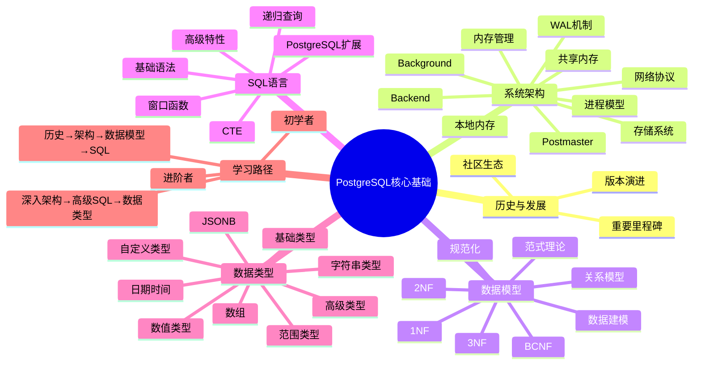
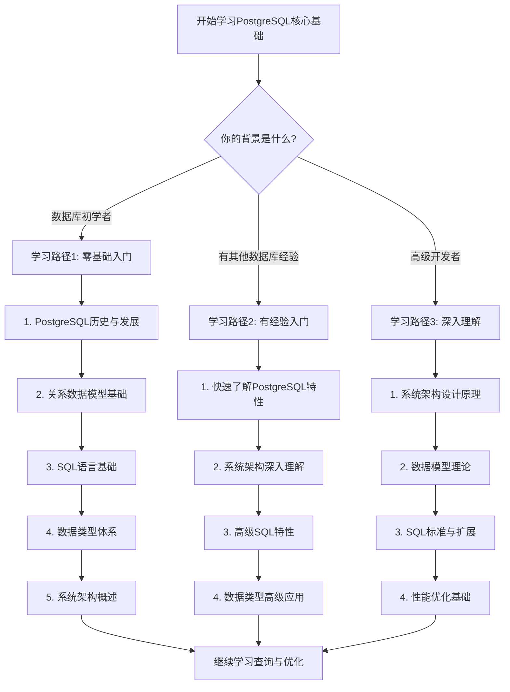

# 01-核心基础

> **主题**: PostgreSQL核心基础
> **包含内容**: PostgreSQL基础、架构、历史、SQL基础、数据类型

---

## 📊 知识体系思维导图

---

## 📋 主题说明

本主题整合所有PostgreSQL核心基础相关内容，包括：

- PostgreSQL历史与发展
- 系统架构与设计原理
- 关系数据模型与理论
- SQL语言规范与标准
- 数据类型体系

---

## 📂 子主题分类

### 01.01-历史与发展

- PostgreSQL发展历史
- 版本演进和重要里程碑
- 社区和生态系统

### 01.02-系统架构

- PostgreSQL系统架构
- 进程模型、内存管理、存储系统、网络协议
- 架构设计和最佳实践

### 01.03-数据模型

- 关系数据模型基础
- 范式理论（1NF、2NF、3NF、BCNF）
- 数据建模和规范化

### 01.04-SQL语言

- SQL语言基础和标准
- 高级SQL特性（窗口函数、递归查询、CTE）
- PostgreSQL扩展特性

### 01.05-数据类型

- 基础数据类型
- 高级数据类型（数组、JSONB、范围类型等）
- 自定义类型

---

## 📚 文档来源

- `PostgreSQL/01-核心课程/`
- `PostgreSQL/01-核心基础/`
- `PostgreSQL培训/01-SQL基础/`
- `PostgreSQL培训/03-数据类型/`
- `docs/01-PostgreSQL18/` (相关文档)

---

## 🔗 相关主题

- [02-查询与优化](../02-查询与优化/README.md) - 查询优化相关
- [03-事务与并发](../03-事务与并发/README.md) - 事务管理相关
- [17-数据模型设计](../17-数据模型设计/README.md) - 数据模型设计相关

---

## 📊 学习路径决策树

---

## 📊 核心概念对比矩阵

### PostgreSQL与其他数据库对比

| 特性维度 | PostgreSQL | MySQL | Oracle | SQL Server |
| --- | --- | --- | --- | --- |
| **架构模型** | 多进程 | 多线程 | 多进程/多线程混合 | 多线程 |
| **并发控制** | MVCC | 锁机制 | MVCC+锁 | 锁机制 |
| **SQL标准** | SQL:2023高度兼容 | SQL标准部分兼容 | SQL标准高度兼容 | SQL标准高度兼容 |
| **扩展性** | 优秀（扩展系统） | 一般 | 优秀 | 良好 |
| **开源** | 是（PostgreSQL许可证） | 是（GPL/商业） | 否 | 否 |
| **JSON支持** | 原生JSONB | JSON类型 | JSON类型 | JSON类型 |
| **全文搜索** | 原生支持 | 第三方插件 | Oracle Text | Full-Text Search |
| **向量搜索** | pgvector扩展 | 不支持 | 不支持 | 不支持 |
| **适用场景** | 企业级应用、数据分析 | Web应用 | 企业级应用 | 企业级应用 |

---

**状态**: ✅ 文档整合完成 | 🔄 持续完善中
**最后更新**: 2025年1月
