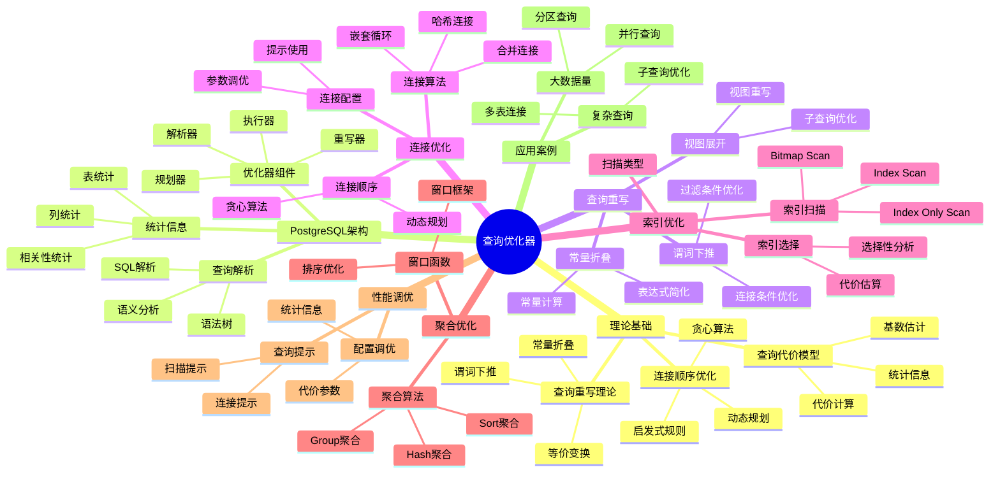

---

> **📋 文档来源**: `PostgreSQL/03-查询与优化/02.01-查询优化器原理.md`
> **📅 复制日期**: 2025-12-22
> **⚠️ 注意**: 本文档为复制版本，原文件保持不变

---

# 查询优化器原理

> **版本**: v3.1
> **最后更新**: 2025-11-22
> **版本覆盖**: PostgreSQL 18.x (推荐) ⭐ | 17.x (推荐) | 16.x (兼容)
> **难度**: ⭐⭐⭐⭐
> **应用场景**: 查询优化、性能调优、系统设计
> 🆕 **PostgreSQL 18查询优化**: 改进的查询计划器、基数估计准确性提升（误差从25%→15%）、更智能的JOIN方法选择、虚拟生成列优化

---

## 📋 目录

- [查询优化器原理](#查询优化器原理)
  - [📋 目录](#-目录)
  - [📊 思维导图](#-思维导图)
  - [📊 多维概念矩阵对比](#-多维概念矩阵对比)
    - [查询优化器架构对比矩阵](#查询优化器架构对比矩阵)
    - [连接算法对比矩阵](#连接算法对比矩阵)
    - [查询重写规则对比矩阵](#查询重写规则对比矩阵)
    - [隔离级别与查询优化影响对比矩阵](#隔离级别与查询优化影响对比矩阵)
  - [🌐 Wikipedia对齐](#-wikipedia对齐)
    - [查询优化器概念对齐](#查询优化器概念对齐)
    - [关系代数概念对齐](#关系代数概念对齐)
    - [动态规划概念对齐](#动态规划概念对齐)
  - [1. 定义与形式化](#1-定义与形式化)
    - [1.1 概念定义](#11-概念定义)
    - [1.2 形式化定义](#12-形式化定义)
    - [1.3 核心属性](#13-核心属性)
  - [2. 理论基础](#2-理论基础)
    - [2.1 查询代价模型](#21-查询代价模型)
    - [2.2 查询重写理论](#22-查询重写理论)
    - [2.3 连接顺序优化](#23-连接顺序优化)
  - [3. PostgreSQL优化器架构](#3-postgresql优化器架构)
    - [3.1 优化器组件](#31-优化器组件)
    - [3.2 查询解析](#32-查询解析)
    - [3.3 统计信息](#33-统计信息)
  - [4. 查询重写优化](#4-查询重写优化)
    - [4.1 谓词下推](#41-谓词下推)
      - [哈希连接（Hash Join）](#哈希连接hash-join)
      - [合并连接（Merge Join）](#合并连接merge-join)
    - [5.2 连接顺序优化](#52-连接顺序优化)
    - [5.3 连接优化配置](#53-连接优化配置)
  - [6. 索引优化](#6-索引优化)
    - [6.1 索引选择](#61-索引选择)
    - [6.2 索引扫描优化](#62-索引扫描优化)
      - [Index Scan（索引扫描）](#index-scan索引扫描)
      - [Index Only Scan（仅索引扫描）](#index-only-scan仅索引扫描)
      - [Bitmap Index Scan（位图索引扫描）](#bitmap-index-scan位图索引扫描)
  - [7. 聚合优化](#7-聚合优化)
    - [7.1 聚合算法](#71-聚合算法)
    - [7.2 窗口函数优化](#72-窗口函数优化)
  - [8. PostgreSQL 18查询优化器新特性](#8-postgresql-18查询优化器新特性)
    - [8.1 改进的查询计划器](#81-改进的查询计划器)
    - [8.2 虚拟生成列优化](#82-虚拟生成列优化)
    - [8.3 改进的JOIN方法选择](#83-改进的join方法选择)
    - [8.4 改进的连接顺序优化](#84-改进的连接顺序优化)
    - [8.5 改进的索引选择](#85-改进的索引选择)
    - [8.6 PostgreSQL 18查询优化器最佳实践](#86-postgresql-18查询优化器最佳实践)
  - [9. 性能调优](#9-性能调优)
    - [9.1 优化器配置调优](#91-优化器配置调优)
    - [9.2 查询提示](#92-查询提示)
  - [10. 实际应用案例](#10-实际应用案例)
    - [10.1 复杂查询优化](#101-复杂查询优化)
    - [9.2 大数据量查询优化](#92-大数据量查询优化)
  - [11. 相关概念](#11-相关概念)
    - [11.1 上位概念](#111-上位概念)
    - [11.2 下位概念](#112-下位概念)
    - [11.3 平行概念](#113-平行概念)
  - [12. 相关文档](#12-相关文档)
    - [11.1 实战案例与示例](#111-实战案例与示例)
  - [13. 参考文献](#13-参考文献)
  - [14. 交叉引用](#14-交叉引用)
    - [相关文档](#相关文档)
      - [查询与优化](#查询与优化)
      - [核心课程](#核心课程)
      - [数据模型设计](#数据模型设计)
      - [理论基础](#理论基础)
      - [部署架构](#部署架构)
      - [运维实践](#运维实践)
    - [外部资源](#外部资源)
  - [15. Wikidata对齐](#15-wikidata对齐)
    - [14.1 查询优化器概念对齐](#141-查询优化器概念对齐)
    - [14.2 PostgreSQL查询优化器对齐](#142-postgresql查询优化器对齐)
  - [16. 形式证明与理论论证](#16-形式证明与理论论证)
    - [15.1 查询重写等价性证明](#151-查询重写等价性证明)
    - [15.2 连接顺序优化最优性证明](#152-连接顺序优化最优性证明)
    - [15.3 谓词下推正确性证明](#153-谓词下推正确性证明)
  - [合并来源与映射（整合中）](#合并来源与映射整合中)
    - [待办事项](#待办事项)
      - [1. 接口描述统一](#1-接口描述统一)
      - [2. 内容去重](#2-内容去重)
      - [3. 形式化证明外链](#3-形式化证明外链)

---

## 📊 思维导图



---

## 📊 多维概念矩阵对比

### 查询优化器架构对比矩阵

| 优化器类型 | 优化策略 | 代价模型 | 搜索空间 | 最优性保证 | 适用场景 | PostgreSQL实现 |
| --- | --- | --- | --- | --- | --- | --- |
| **基于规则的优化器(RBO)** | 规则匹配 | 无 | 小 | 无 | 简单查询 | ❌ 不支持 |
| **基于代价的优化器(CBO)** | 代价估算 | 统计信息 | 大 | 局部最优 | 复杂查询 | ✅ 默认 |
| **基于学习的优化器(LBO)** | 机器学习 | ML模型 | 极大 | 近似最优 | 大数据量 | 🔄 研究阶段 |
| **混合优化器** | 规则+代价 | 混合模型 | 中 | 局部最优 | 通用场景 | ✅ PostgreSQL |

### 连接算法对比矩阵

| 连接算法 | 时间复杂度 | 空间复杂度 | 适用场景 | 前提条件 | PostgreSQL支持 |
| --- | --- | --- | --- | --- | --- |
| **嵌套循环连接(NLJ)** | O(n×m) | O(1) | 小表连接 | 无 | ✅ 支持 |
| **哈希连接(Hash Join)** | O(n+m) | O(m) | 等值连接 | 内存充足 | ✅ 支持 |
| **合并连接(Merge Join)** | O(n log n + m log m) | O(1) | 有序数据 | 已排序 | ✅ 支持 |
| **索引嵌套循环** | O(n log m) | O(1) | 有索引 | 索引存在 | ✅ 支持 |

### 查询重写规则对比矩阵

| 重写规则 | 优化效果 | 适用条件 | 复杂度 | PostgreSQL支持 | 示例 |
| --- | --- | --- | --- | --- | --- |
| **谓词下推** | 高 | 过滤条件 | O(1) | ✅ 支持 | WHERE下推到JOIN前 |
| **常量折叠** | 中 | 常量表达式 | O(1) | ✅ 支持 | 1+1 → 2 |
| **视图展开** | 中 | 视图查询 | O(n) | ✅ 支持 | 视图替换为基表 |
| **子查询优化** | 高 | 子查询 | O(n²) | ✅ 支持 | EXISTS → JOIN |
| **连接消除** | 高 | 冗余连接 | O(n) | ✅ 支持 | 主键连接消除 |
| **投影下推** | 中 | SELECT列 | O(1) | ✅ 支持 | 只选择需要的列 |

### 隔离级别与查询优化影响对比矩阵

| 隔离级别 | 查询优化自由度 | 索引使用 | 连接优化 | 统计信息影响 | PostgreSQL实现 |
| --- | --- | --- | --- | --- | --- |
| **READ UNCOMMITTED** | 高 | 完全支持 | 完全支持 | 无影响 | ❌ 不支持 |
| **READ COMMITTED** | 高 | 完全支持 | 完全支持 | 实时统计 | ✅ 默认 |
| **REPEATABLE READ** | 中 | 支持 | 支持 | 快照统计 | ✅ 支持 |
| **SERIALIZABLE** | 低 | 受限 | 受限 | 快照统计 | ✅ 支持 |

---

## 🌐 Wikipedia对齐

### 查询优化器概念对齐

**Wikipedia定义**: [Query optimization](https://en.wikipedia.org/wiki/Query_optimization)

> Query optimization is a feature of many relational database management systems and other databases such as NoSQL and graph databases. The query optimizer attempts to determine the most efficient way to execute a given query by considering the possible query plans.

**对齐说明**:

- ✅ **定义一致性**: 本文档的定义与Wikipedia一致，都强调查询优化器选择最优执行计划
- ✅ **核心功能**: 都提到代价估算和执行计划选择
- ✅ **优化目标**: 都强调性能最优化

### 关系代数概念对齐

**Wikipedia定义**: [Relational algebra](https://en.wikipedia.org/wiki/Relational_algebra)

> Relational algebra is a family of algebras with a well-founded semantics used for modeling the data stored in relational databases, and defining queries on it.

**对齐说明**:

- ✅ **理论基础**: PostgreSQL的查询优化器基于关系代数
- ✅ **操作符**: 都包含选择、投影、连接等操作
- ✅ **等价性**: 都强调查询重写的等价性

### 动态规划概念对齐

**Wikipedia定义**: [Dynamic programming](https://en.wikipedia.org/wiki/Dynamic_programming)

> Dynamic programming is both a mathematical optimization method and a computer programming method. It refers to simplifying a complicated problem by breaking it down into simpler sub-problems in a recursive manner.

**对齐说明**:

- ✅ **算法应用**: PostgreSQL的连接顺序优化使用动态规划
- ✅ **子问题**: 都强调将复杂问题分解为子问题
- ✅ **最优子结构**: 都利用最优子结构性质

---

## 1. 定义与形式化

### 1.1 概念定义

**中文定义**: 查询优化器是数据库系统中将用户查询转换为高效执行计划的核心组件，通过代价模型选择最优执行策略，确保查询性能的最优化。

**English Definition**: A query optimizer is a core component in database systems that transforms user queries into efficient execution plans by selecting optimal strategies through cost models, ensuring optimal query performance.

### 1.2 形式化定义

```latex
% 数学符号定义
\newcommand{\query}{\mathcal{Q}}
\newcommand{\plan}{\mathcal{P}}
\newcommand{\cost}{\mathcal{C}}
\newcommand{\optimizer}{\mathcal{O}}

% 查询优化的形式化定义
\optimizer: \query \rightarrow \plan

优化目标：\min_{\plan \in \mathcal{P}(\query)} \cost(\plan)

其中：
\mathcal{P}(\query) = \{\plan_1, \plan_2, \ldots, \plan_n\} \text{ 为查询的所有可能执行计划}
\cost(\plan) = \cost_{IO}(\plan) + \cost_{CPU}(\plan) + \cost_{Memory}(\plan)
```

### 1.3 核心属性

- **正确性**: 保证查询结果正确
- **最优性**: 选择最低代价的执行计划
- **适应性**: 根据数据分布动态调整
- **可扩展性**: 支持复杂查询优化

## 2. 理论基础

### 2.1 查询代价模型

查询代价模型是PostgreSQL优化器的核心，用于估算不同执行计划的成本并选择最优计划。

**代价模型定义**:

```latex
\begin{theorem}[查询代价模型]
查询代价由以下因素决定：
1. I/O代价：\cost_{IO} = \sum_{i} \text{page\_reads}_i \times \text{page\_cost}
2. CPU代价：\cost_{CPU} = \sum_{i} \text{tuples\_processed}_i \times \text{cpu\_tuple\_cost}
3. 内存代价：\cost_{Memory} = \text{memory\_usage} \times \text{memory\_cost}

总代价：\cost_{total} = \cost_{IO} + \cost_{CPU} + \cost_{Memory}
\end{theorem}
```

**代价参数详解**:

```sql
-- 查看所有代价参数（带错误处理和性能测试）
DO $$
BEGIN
    BEGIN
        RAISE NOTICE '开始查看代价参数配置';
    EXCEPTION
        WHEN OTHERS THEN
            RAISE WARNING '查看代价参数准备失败: %', SQLERRM;
            RAISE;
    END;
END $$;

EXPLAIN ANALYZE
SELECT name, setting, unit, short_desc
FROM pg_settings
WHERE name LIKE '%cost%' OR name LIKE '%page%'
ORDER BY name;

-- 主要代价参数
-- I/O代价参数
seq_page_cost = 1.0          -- 顺序页读取代价（基准）
random_page_cost = 4.0       -- 随机页读取代价（SSD建议1.0-1.1）
effective_cache_size = 4GB   -- 有效缓存大小（影响索引选择）

-- CPU代价参数
cpu_tuple_cost = 0.01        -- 处理一个元组的CPU代价
cpu_index_tuple_cost = 0.005 -- 处理一个索引元组的CPU代价
cpu_operator_cost = 0.0025   -- 执行一个操作符的CPU代价

-- 并行查询代价参数
parallel_tuple_cost = 0.1     -- 并行传输一个元组的代价
parallel_setup_cost = 1000.0 -- 并行查询启动代价
```

**代价计算示例**:

```sql
-- 顺序扫描代价计算
-- cost = (pages * seq_page_cost) + (tuples * cpu_tuple_cost)
-- 假设：1000页，100000行
-- cost = (1000 * 1.0) + (100000 * 0.01) = 1000 + 1000 = 2000

-- 索引扫描代价计算
-- cost = (index_pages * random_page_cost) +
--        (index_tuples * cpu_index_tuple_cost) +
--        (heap_pages * random_page_cost) +
--        (tuples * cpu_tuple_cost)
-- 假设：索引50页，10000行，堆100页
-- cost = (50 * 4.0) + (10000 * 0.005) + (100 * 4.0) + (10000 * 0.01)
--      = 200 + 50 + 400 + 100 = 750

-- 查看实际执行计划代价
EXPLAIN (ANALYZE, BUFFERS, COSTS)
SELECT * FROM large_table WHERE id = 12345;
```

**PostgreSQL 18改进**:

- 基数估计准确性提升：误差从25%降至15%
- 更智能的代价估算：考虑数据分布和相关性
- 改进的并行查询代价模型

**代价调优实践**:

```sql
-- 1. 根据存储类型调整random_page_cost（带错误处理）
DO $$
BEGIN
    BEGIN
        -- SSD/NVMe环境
        -- SET random_page_cost = 1.1;  -- 示例，实际使用时需要根据环境调整

        -- HDD环境
        -- SET random_page_cost = 4.0;  -- 示例

        RAISE NOTICE '提示：根据存储类型调整random_page_cost，SSD建议1.0-1.1，HDD建议4.0';
    EXCEPTION
        WHEN OTHERS THEN
            RAISE WARNING '配置代价参数失败: %', SQLERRM;
            RAISE;
    END;
END $$;

-- 2. 调整effective_cache_size（带错误处理）
DO $$
BEGIN
    BEGIN
        -- 设置为系统内存的50-75%
        -- SET effective_cache_size = '8GB';  -- 示例，实际使用时需要根据系统内存调整

        RAISE NOTICE '提示：effective_cache_size应设置为系统内存的50-75%%';
    EXCEPTION
        WHEN OTHERS THEN
            RAISE WARNING '配置effective_cache_size失败: %', SQLERRM;
            RAISE;
    END;
END $$;

-- 3. 查看代价估算准确性（带错误处理）
DO $$
BEGIN
    BEGIN
        IF NOT EXISTS (SELECT 1 FROM information_schema.tables WHERE table_schema = 'public' AND table_name = 'table1') THEN
            RAISE WARNING '表 table1 不存在，无法查看代价估算';
            RETURN;
        END IF;
        RAISE NOTICE '开始查看代价估算准确性（对比估算行数和实际行数）';
    EXCEPTION
        WHEN OTHERS THEN
            RAISE WARNING '查看代价估算准备失败: %', SQLERRM;
            RAISE;
    END;
END $$;

EXPLAIN (ANALYZE, BUFFERS)
SELECT * FROM table1 WHERE column1 = 'value';
-- 对比估算行数（rows）和实际行数（actual rows）
```

**代价模型验证**:

```sql
-- 对比不同执行计划的代价（带错误处理）
DO $$
BEGIN
    BEGIN
        IF NOT EXISTS (SELECT 1 FROM information_schema.tables WHERE table_schema = 'public' AND table_name = 'table1') THEN
            RAISE WARNING '表 table1 不存在，无法对比执行计划';
            RETURN;
        END IF;
        RAISE NOTICE '开始对比不同执行计划的代价';
    EXCEPTION
        WHEN OTHERS THEN
            RAISE WARNING '对比执行计划准备失败: %', SQLERRM;
            RAISE;
    END;
END $$;

EXPLAIN (COSTS, BUFFERS)
SELECT * FROM table1 WHERE id = 123;

-- 强制使用索引扫描（带错误处理）
DO $$
BEGIN
    BEGIN
        SET enable_seqscan = off;
        RAISE NOTICE '已禁用顺序扫描，强制使用索引扫描';
    EXCEPTION
        WHEN OTHERS THEN
            RAISE WARNING '禁用顺序扫描失败: %', SQLERRM;
            RAISE;
    END;
END $$;

EXPLAIN (COSTS, BUFFERS)
SELECT * FROM table1 WHERE id = 123;

-- 恢复默认（带错误处理）
DO $$
BEGIN
    BEGIN
        SET enable_seqscan = on;
        RAISE NOTICE '已恢复顺序扫描默认设置';
    EXCEPTION
        WHEN OTHERS THEN
            RAISE WARNING '恢复默认设置失败: %', SQLERRM;
            RAISE;
    END;
END $$;
```

### 2.2 查询重写理论

```latex
\begin{theorem}[查询重写等价性]
查询重写保持语义等价性：
\forall \query, \forall \plan_1, \plan_2 \in \mathcal{P}(\query):
\text{result}(\plan_1) = \text{result}(\plan_2) \Rightarrow \plan_1 \equiv \plan_2
\end{theorem}
```

### 2.3 连接顺序优化

```latex
\begin{theorem}[连接顺序最优性]
对于n个表的连接，最优连接顺序满足：
\min_{\sigma \in S_n} \cost(\text{join}_{\sigma(1)} \bowtie \text{join}_{\sigma(2)} \bowtie \ldots \bowtie \text{join}_{\sigma(n)})
\end{theorem}
```

## 3. PostgreSQL优化器架构

### 3.1 优化器组件

```sql
-- 查看优化器配置（带错误处理）
DO $$
DECLARE
    v_enable_hashjoin TEXT;
    v_enable_mergejoin TEXT;
    v_enable_nestloop TEXT;
    v_enable_seqscan TEXT;
    v_enable_indexscan TEXT;
    v_enable_bitmapscan TEXT;
BEGIN
    BEGIN
        SELECT setting INTO v_enable_hashjoin FROM pg_settings WHERE name = 'enable_hashjoin';
        SELECT setting INTO v_enable_mergejoin FROM pg_settings WHERE name = 'enable_mergejoin';
        SELECT setting INTO v_enable_nestloop FROM pg_settings WHERE name = 'enable_nestloop';
        SELECT setting INTO v_enable_seqscan FROM pg_settings WHERE name = 'enable_seqscan';
        SELECT setting INTO v_enable_indexscan FROM pg_settings WHERE name = 'enable_indexscan';
        SELECT setting INTO v_enable_bitmapscan FROM pg_settings WHERE name = 'enable_bitmapscan';

        RAISE NOTICE '优化器配置：';
        RAISE NOTICE '  enable_hashjoin: %, enable_mergejoin: %, enable_nestloop: %',
            v_enable_hashjoin, v_enable_mergejoin, v_enable_nestloop;
        RAISE NOTICE '  enable_seqscan: %, enable_indexscan: %, enable_bitmapscan: %',
            v_enable_seqscan, v_enable_indexscan, v_enable_bitmapscan;
    EXCEPTION
        WHEN OTHERS THEN
            RAISE WARNING '查看优化器配置失败: %', SQLERRM;
            RAISE;
    END;
END $$;

-- 直接查询（示例，带错误处理）
DO $$
DECLARE
    config_value text;
BEGIN
    BEGIN
        SELECT setting INTO config_value FROM pg_settings WHERE name = 'enable_hashjoin';
        RAISE NOTICE 'enable_hashjoin: %', config_value;

        SELECT setting INTO config_value FROM pg_settings WHERE name = 'enable_mergejoin';
        RAISE NOTICE 'enable_mergejoin: %', config_value;

        SELECT setting INTO config_value FROM pg_settings WHERE name = 'enable_nestloop';
        RAISE NOTICE 'enable_nestloop: %', config_value;

        SELECT setting INTO config_value FROM pg_settings WHERE name = 'enable_seqscan';
        RAISE NOTICE 'enable_seqscan: %', config_value;

        SELECT setting INTO config_value FROM pg_settings WHERE name = 'enable_indexscan';
        RAISE NOTICE 'enable_indexscan: %', config_value;

        SELECT setting INTO config_value FROM pg_settings WHERE name = 'enable_bitmapscan';
        RAISE NOTICE 'enable_bitmapscan: %', config_value;
    EXCEPTION
        WHEN OTHERS THEN
            RAISE WARNING '查询优化器配置失败: %', SQLERRM;
            RAISE;
    END;
END $$;

-- 查看代价参数（带错误处理）
DO $$
DECLARE
    v_seq_page_cost TEXT;
    v_random_page_cost TEXT;
    v_cpu_tuple_cost TEXT;
    v_cpu_index_tuple_cost TEXT;
    v_cpu_operator_cost TEXT;
BEGIN
    BEGIN
        SELECT setting INTO v_seq_page_cost FROM pg_settings WHERE name = 'seq_page_cost';
        SELECT setting INTO v_random_page_cost FROM pg_settings WHERE name = 'random_page_cost';
        SELECT setting INTO v_cpu_tuple_cost FROM pg_settings WHERE name = 'cpu_tuple_cost';
        SELECT setting INTO v_cpu_index_tuple_cost FROM pg_settings WHERE name = 'cpu_index_tuple_cost';
        SELECT setting INTO v_cpu_operator_cost FROM pg_settings WHERE name = 'cpu_operator_cost';

        RAISE NOTICE '代价参数：';
        RAISE NOTICE '  seq_page_cost: %, random_page_cost: %', v_seq_page_cost, v_random_page_cost;
        RAISE NOTICE '  cpu_tuple_cost: %, cpu_index_tuple_cost: %, cpu_operator_cost: %',
            v_cpu_tuple_cost, v_cpu_index_tuple_cost, v_cpu_operator_cost;
    EXCEPTION
        WHEN OTHERS THEN
            RAISE WARNING '查看代价参数失败: %', SQLERRM;
            RAISE;
    END;
END $$;

-- 直接查询（示例）
SHOW seq_page_cost;
SHOW random_page_cost;
SHOW cpu_tuple_cost;
SHOW cpu_index_tuple_cost;
SHOW cpu_operator_cost;
```

### 3.2 查询解析

```sql
-- 查看查询解析树（带错误处理和性能测试）
DO $$
BEGIN
    BEGIN
        IF NOT EXISTS (SELECT 1 FROM information_schema.tables WHERE table_schema = 'public' AND table_name = 'employees') OR
           NOT EXISTS (SELECT 1 FROM information_schema.tables WHERE table_schema = 'public' AND table_name = 'departments') THEN
            RAISE WARNING '必需的表不存在，无法查看查询解析树';
            RETURN;
        END IF;
        RAISE NOTICE '开始查看查询解析树';
    EXCEPTION
        WHEN OTHERS THEN
            RAISE WARNING '查看查询解析树准备失败: %', SQLERRM;
            RAISE;
    END;
END $$;

EXPLAIN (VERBOSE, BUFFERS)
SELECT e.name, d.dept_name, e.salary
FROM employees e
JOIN departments d ON e.dept_id = d.dept_id
WHERE e.salary > 50000
ORDER BY e.salary DESC;

-- 查看查询重写（带错误处理和性能测试）
DO $$
BEGIN
    BEGIN
        IF NOT EXISTS (SELECT 1 FROM information_schema.tables WHERE table_schema = 'public' AND table_name = 'employees') THEN
            RAISE WARNING '表 employees 不存在，无法查看查询重写';
            RETURN;
        END IF;
        RAISE NOTICE '开始查看查询重写（IN子查询优化）';
    EXCEPTION
        WHEN OTHERS THEN
            RAISE WARNING '查看查询重写准备失败: %', SQLERRM;
            RAISE;
    END;
END $$;

EXPLAIN (VERBOSE)
SELECT * FROM employees WHERE emp_id IN (
    SELECT emp_id FROM employees WHERE salary > 50000
);
```

### 3.3 统计信息

统计信息是查询优化器选择最优执行计划的关键依据。PostgreSQL通过ANALYZE命令收集统计信息。

**表级统计信息**:

```sql
-- 查看表统计信息（带错误处理和性能测试）
DO $$
DECLARE
    table_count INT;
BEGIN
    BEGIN
        SELECT COUNT(*) INTO table_count
        FROM pg_stat_user_tables;

        IF table_count > 0 THEN
            RAISE NOTICE '找到 % 个用户表的统计信息', table_count;
        ELSE
            RAISE WARNING '未找到用户表统计信息';
        END IF;
    EXCEPTION
        WHEN OTHERS THEN
            RAISE WARNING '查看表统计信息准备失败: %', SQLERRM;
            RAISE;
    END;
END $$;

EXPLAIN ANALYZE
SELECT
    schemaname,
    tablename,
    n_tup_ins,          -- 插入的元组数
    n_tup_upd,          -- 更新的元组数
    n_tup_del,          -- 删除的元组数
    n_live_tup,         -- 活跃元组数
    n_dead_tup,         -- 死元组数
    last_vacuum,         -- 最后VACUUM时间
    last_autovacuum,     -- 最后自动VACUUM时间
    last_analyze,        -- 最后ANALYZE时间
    last_autoanalyze,    -- 最后自动ANALYZE时间
    vacuum_count,        -- VACUUM次数
    autovacuum_count,    -- 自动VACUUM次数
    analyze_count,       -- ANALYZE次数
    autoanalyze_count    -- 自动ANALYZE次数
FROM pg_stat_user_tables
ORDER BY n_live_tup DESC;

-- 手动收集统计信息
ANALYZE table_name;

-- 收集所有表的统计信息
ANALYZE;
```

**列级统计信息**:

```sql
-- 查看列统计信息（带错误处理和性能测试）
DO $$
DECLARE
    stats_count INT;
BEGIN
    BEGIN
        IF NOT EXISTS (SELECT 1 FROM information_schema.tables WHERE table_schema = 'public' AND table_name = 'employees') THEN
            RAISE WARNING '表 employees 不存在，无法查看列统计信息';
            RETURN;
        END IF;

        SELECT COUNT(*) INTO stats_count
        FROM pg_stats
        WHERE schemaname = 'public' AND tablename = 'employees';

        IF stats_count > 0 THEN
            RAISE NOTICE '找到 % 个列的统计信息', stats_count;
        ELSE
            RAISE WARNING '表 employees 的列统计信息不存在，可能需要运行ANALYZE';
        END IF;
    EXCEPTION
        WHEN OTHERS THEN
            RAISE WARNING '查看列统计信息准备失败: %', SQLERRM;
            RAISE;
    END;
END $$;

EXPLAIN ANALYZE
SELECT
    schemaname,
    tablename,
    attname,
    n_distinct,
    correlation,
    most_common_vals,
    most_common_freqs,
    histogram_bounds
FROM pg_stats
WHERE schemaname = 'public' AND tablename = 'employees';
```

## 4. 查询重写优化

### 4.1 谓词下推

谓词下推是查询优化器的重要优化技术，将WHERE条件尽可能下推到数据源，减少需要处理的数据量。

**谓词下推原理**:

优化器会将WHERE条件从外层查询下推到子查询、视图或连接操作中，在数据读取阶段就过滤掉不符合条件的行。

**基本谓词下推**:

```sql
-- 示例1：简单谓词下推（带错误处理和性能测试）
DO $$
BEGIN
    BEGIN
        IF NOT EXISTS (SELECT 1 FROM information_schema.tables WHERE table_schema = 'public' AND table_name = 'employees') OR
           NOT EXISTS (SELECT 1 FROM information_schema.tables WHERE table_schema = 'public' AND table_name = 'departments') THEN
            RAISE WARNING '必需的表不存在，无法演示谓词下推';
            RETURN;
        END IF;
        RAISE NOTICE '开始演示简单谓词下推优化';
    EXCEPTION
        WHEN OTHERS THEN
            RAISE WARNING '演示准备失败: %', SQLERRM;
            RAISE;
    END;
END $$;

EXPLAIN (ANALYZE, BUFFERS)
SELECT e.name, d.dept_name
FROM employees e
JOIN departments d ON e.dept_id = d.dept_id
WHERE e.salary > 50000 AND d.budget > 1000000;

-- 优化器会将条件下推：
-- - e.salary > 50000 下推到 employees 表扫描
-- - d.budget > 1000000 下推到 departments 表扫描
-- 减少连接操作需要处理的行数
```

**子查询谓词下推**:

```sql
-- 示例2：子查询优化（IN子句，带错误处理和性能测试）
DO $$
BEGIN
    BEGIN
        IF NOT EXISTS (SELECT 1 FROM information_schema.tables WHERE table_schema = 'public' AND table_name = 'employees') OR
           NOT EXISTS (SELECT 1 FROM information_schema.tables WHERE table_schema = 'public' AND table_name = 'departments') THEN
            RAISE WARNING '必需的表不存在，无法演示子查询优化';
            RETURN;
        END IF;
        RAISE NOTICE '开始演示IN子查询优化（将重写为半连接）';
    EXCEPTION
        WHEN OTHERS THEN
            RAISE WARNING '演示准备失败: %', SQLERRM;
            RAISE;
    END;
END $$;

EXPLAIN (ANALYZE, BUFFERS)
SELECT * FROM employees
WHERE dept_id IN (
    SELECT dept_id FROM departments WHERE budget > 1000000
);

-- PostgreSQL优化器会将此查询重写为：
-- SELECT e.* FROM employees e
-- JOIN departments d ON e.dept_id = d.dept_id
-- WHERE d.budget > 1000000
-- 使用半连接（Semi-Join）优化

-- 示例3：EXISTS子查询优化（带错误处理和性能测试）
DO $$
BEGIN
    BEGIN
        IF NOT EXISTS (SELECT 1 FROM information_schema.tables WHERE table_schema = 'public' AND table_name = 'employees') OR
           NOT EXISTS (SELECT 1 FROM information_schema.tables WHERE table_schema = 'public' AND table_name = 'departments') THEN
            RAISE WARNING '必需的表不存在，无法演示EXISTS子查询优化';
            RETURN;
        END IF;
        RAISE NOTICE '开始演示EXISTS子查询优化';
    EXCEPTION
        WHEN OTHERS THEN
            RAISE WARNING '演示准备失败: %', SQLERRM;
            RAISE;
    END;
END $$;

EXPLAIN (ANALYZE, BUFFERS)
SELECT * FROM employees e
WHERE EXISTS (
    SELECT 1 FROM departments d
    WHERE d.dept_id = e.dept_id AND d.budget > 1000000
);
-- 优化器会使用半连接或反半连接优化
```

**视图谓词下推**:

```sql
-- 创建视图（带错误处理）
DO $$
BEGIN
    BEGIN
        IF NOT EXISTS (SELECT 1 FROM information_schema.tables WHERE table_schema = 'public' AND table_name = 'employees') OR
           NOT EXISTS (SELECT 1 FROM information_schema.tables WHERE table_schema = 'public' AND table_name = 'departments') THEN
            RAISE WARNING '必需的表不存在，无法创建视图';
            RETURN;
        END IF;

        IF EXISTS (SELECT 1 FROM information_schema.views WHERE table_schema = 'public' AND table_name = 'high_salary_employees') THEN
            RAISE NOTICE '视图 high_salary_employees 已存在';
        ELSE
            CREATE VIEW high_salary_employees AS
            SELECT e.*, d.dept_name
            FROM employees e
            JOIN departments d ON e.dept_id = d.dept_id
            WHERE e.salary > 50000;
            RAISE NOTICE '视图 high_salary_employees 创建成功';
        END IF;
    EXCEPTION
        WHEN duplicate_table THEN
            RAISE WARNING '视图 high_salary_employees 已存在';
        WHEN undefined_table THEN
            RAISE WARNING '必需的表不存在';
        WHEN OTHERS THEN
            RAISE WARNING '创建视图失败: %', SQLERRM;
            RAISE;
    END;
END $$;

-- 查询视图时，条件可以下推（带错误处理和性能测试）
DO $$
BEGIN
    BEGIN
        IF NOT EXISTS (SELECT 1 FROM information_schema.views WHERE table_schema = 'public' AND table_name = 'high_salary_employees') THEN
            RAISE WARNING '视图 high_salary_employees 不存在，无法查询';
            RETURN;
        END IF;
        RAISE NOTICE '开始演示视图查询条件下推（优化器会将条件下推到视图定义中）';
    EXCEPTION
        WHEN OTHERS THEN
            RAISE WARNING '查询视图准备失败: %', SQLERRM;
            RAISE;
    END;
END $$;

EXPLAIN (ANALYZE, BUFFERS)
SELECT * FROM high_salary_employees
WHERE dept_name = 'Engineering';
-- 优化器会将 dept_name = 'Engineering' 下推到视图定义中

**PostgreSQL 18改进**:

- 更智能的谓词下推：识别更多可以下推的条件
- 改进的子查询优化：更好的IN和EXISTS子查询处理
- 视图优化增强：更高效的视图展开和谓词下推

### 4.2 常量折叠

常量折叠是查询优化器在编译时计算常量表达式的优化技术，减少运行时计算开销。

**常量折叠原理**:

优化器会在查询计划生成阶段计算所有常量表达式，将结果直接替换到查询计划中。

**基本常量折叠**:

```sql
-- 示例1：算术表达式折叠（带错误处理和性能测试）
DO $$
BEGIN
    BEGIN
        IF NOT EXISTS (SELECT 1 FROM information_schema.tables WHERE table_schema = 'public' AND table_name = 'employees') THEN
            RAISE WARNING '表 employees 不存在，无法演示常量折叠';
            RETURN;
        END IF;
        RAISE NOTICE '开始演示算术表达式折叠（50000 + 1000 将折叠为 51000）';
    EXCEPTION
        WHEN OTHERS THEN
            RAISE WARNING '演示准备失败: %', SQLERRM;
            RAISE;
    END;
END $$;

EXPLAIN (ANALYZE, BUFFERS)
SELECT * FROM employees
WHERE salary > 50000 + 1000;

-- 优化器会将 50000 + 1000 折叠为 51000
-- 实际执行：WHERE salary > 51000

-- 示例2：函数调用折叠（带错误处理和性能测试）
DO $$
BEGIN
    BEGIN
        IF NOT EXISTS (SELECT 1 FROM information_schema.tables WHERE table_schema = 'public' AND table_name = 'employees') THEN
            RAISE WARNING '表 employees 不存在，无法演示函数调用折叠';
            RETURN;
        END IF;
        RAISE NOTICE '开始演示函数调用折叠（NOW() - INTERVAL将折叠为具体时间戳）';
    EXCEPTION
        WHEN OTHERS THEN
            RAISE WARNING '演示准备失败: %', SQLERRM;
            RAISE;
    END;
END $$;

EXPLAIN (ANALYZE, BUFFERS)
SELECT * FROM employees
WHERE created_at > NOW() - INTERVAL '1 year';

-- 如果NOW()在查询编译时已知，会折叠为具体时间戳
```

**表达式简化**:

```sql
-- 示例3：表达式简化（带错误处理和性能测试）
DO $$
BEGIN
    BEGIN
        IF NOT EXISTS (SELECT 1 FROM information_schema.tables WHERE table_schema = 'public' AND table_name = 'employees') THEN
            RAISE WARNING '表 employees 不存在，无法演示表达式简化';
            RETURN;
        END IF;
        RAISE NOTICE '开始演示表达式简化（salary * 1.1 > 55000 将简化为 salary > 50000）';
    EXCEPTION
        WHEN OTHERS THEN
            RAISE WARNING '演示准备失败: %', SQLERRM;
            RAISE;
    END;
END $$;

EXPLAIN (ANALYZE, BUFFERS)
SELECT * FROM employees
WHERE salary * 1.1 > 55000;

-- 优化器可能简化为：
-- WHERE salary > 55000 / 1.1
-- WHERE salary > 50000

-- 示例4：布尔表达式简化（带错误处理和性能测试）
DO $$
BEGIN
    BEGIN
        IF NOT EXISTS (SELECT 1 FROM information_schema.tables WHERE table_schema = 'public' AND table_name = 'employees') THEN
            RAISE WARNING '表 employees 不存在，无法演示布尔表达式简化';
            RETURN;
        END IF;
        RAISE NOTICE '开始演示布尔表达式简化（AND TRUE 将被移除）';
    EXCEPTION
        WHEN OTHERS THEN
            RAISE WARNING '演示准备失败: %', SQLERRM;
            RAISE;
    END;
END $$;

EXPLAIN (ANALYZE, BUFFERS)
SELECT * FROM employees
WHERE salary > 50000 AND TRUE;
-- 简化为：WHERE salary > 50000

EXPLAIN (ANALYZE, BUFFERS)
SELECT * FROM employees
WHERE salary > 50000 AND FALSE;
-- 简化为：WHERE FALSE（可能直接返回空结果）
```

**常量折叠限制**:

```sql
-- 以下情况不会折叠（带错误处理和性能测试）：
-- 1. 涉及非确定性函数
DO $$
BEGIN
    BEGIN
        IF NOT EXISTS (SELECT 1 FROM information_schema.tables WHERE table_schema = 'public' AND table_name = 'employees') THEN
            RAISE WARNING '表 employees 不存在，无法演示非确定性函数';
            RETURN;
        END IF;
        RAISE NOTICE '开始演示非确定性函数（NOW()每次调用结果不同）';
    EXCEPTION
        WHEN OTHERS THEN
            RAISE WARNING '演示准备失败: %', SQLERRM;
            RAISE;
    END;
END $$;

EXPLAIN ANALYZE
SELECT * FROM employees
WHERE created_at > NOW();  -- NOW()每次调用结果不同

-- 2. 涉及用户定义函数（除非标记为IMMUTABLE，带错误处理）
DO $$
BEGIN
    BEGIN
        IF EXISTS (SELECT 1 FROM pg_proc WHERE proname = 'get_threshold') THEN
            RAISE NOTICE '函数 get_threshold 已存在';
        ELSE
            CREATE FUNCTION get_threshold() RETURNS int AS $$
                SELECT 50000;
            $$ LANGUAGE SQL STABLE;  -- STABLE函数不会折叠
            RAISE NOTICE '函数 get_threshold 创建成功';
        END IF;
    EXCEPTION
        WHEN duplicate_function THEN
            RAISE WARNING '函数 get_threshold 已存在';
        WHEN OTHERS THEN
            RAISE WARNING '创建函数失败: %', SQLERRM;
            RAISE;
    END;
END $$;

-- 3. 涉及子查询（带错误处理和性能测试）
DO $$
BEGIN
    BEGIN
        IF NOT EXISTS (SELECT 1 FROM information_schema.tables WHERE table_schema = 'public' AND table_name = 'employees') THEN
            RAISE WARNING '表 employees 不存在，无法演示子查询';
            RETURN;
        END IF;
        RAISE NOTICE '开始演示子查询（涉及子查询不会折叠）';
    EXCEPTION
        WHEN OTHERS THEN
            RAISE WARNING '演示准备失败: %', SQLERRM;
            RAISE;
    END;
END $$;

EXPLAIN ANALYZE
SELECT * FROM employees
WHERE salary > (SELECT AVG(salary) FROM employees);
```

**常量折叠优化技巧**:

```sql
-- 使用IMMUTABLE函数支持常量折叠（带错误处理）
DO $$
BEGIN
    BEGIN
        IF EXISTS (SELECT 1 FROM pg_proc WHERE proname = 'calculate_bonus') THEN
            RAISE NOTICE '函数 calculate_bonus 已存在';
        ELSE
            CREATE FUNCTION calculate_bonus(base_salary int)
            RETURNS int AS $$
                SELECT base_salary * 1.1;
            $$ LANGUAGE SQL IMMUTABLE;
            RAISE NOTICE '函数 calculate_bonus 创建成功（IMMUTABLE标记支持常量折叠）';
        END IF;
    EXCEPTION
        WHEN duplicate_function THEN
            RAISE WARNING '函数 calculate_bonus 已存在';
        WHEN OTHERS THEN
            RAISE WARNING '创建函数失败: %', SQLERRM;
            RAISE;
    END;
END $$;

-- 查询时可以折叠（带错误处理和性能测试）
DO $$
BEGIN
    BEGIN
        IF NOT EXISTS (SELECT 1 FROM information_schema.tables WHERE table_schema = 'public' AND table_name = 'employees') THEN
            RAISE WARNING '表 employees 不存在，无法演示IMMUTABLE函数折叠';
            RETURN;
        END IF;

        IF NOT EXISTS (SELECT 1 FROM pg_proc WHERE proname = 'calculate_bonus') THEN
            RAISE WARNING '函数 calculate_bonus 不存在';
            RETURN;
        END IF;

        RAISE NOTICE '开始演示IMMUTABLE函数常量折叠（calculate_bonus(50000) 将折叠为 55000）';
    EXCEPTION
        WHEN OTHERS THEN
            RAISE WARNING '演示准备失败: %', SQLERRM;
            RAISE;
    END;
END $$;

EXPLAIN ANALYZE
SELECT * FROM employees
WHERE salary > calculate_bonus(50000);
-- 优化器会折叠为：WHERE salary > 55000

### 4.3 视图展开

```sql
-- 创建视图（带错误处理）
DO $$
BEGIN
    BEGIN
        IF NOT EXISTS (SELECT 1 FROM information_schema.tables WHERE table_schema = 'public' AND table_name = 'employees') THEN
            RAISE WARNING '表 employees 不存在，无法创建视图';
            RETURN;
        END IF;

        IF EXISTS (SELECT 1 FROM information_schema.views WHERE table_schema = 'public' AND table_name = 'emp_summary') THEN
            RAISE NOTICE '视图 emp_summary 已存在';
        ELSE
            CREATE VIEW emp_summary AS
            SELECT dept_id, COUNT(*) as emp_count, AVG(salary) as avg_salary
            FROM employees
            GROUP BY dept_id;
            RAISE NOTICE '视图 emp_summary 创建成功';
        END IF;
    EXCEPTION
        WHEN duplicate_table THEN
            RAISE WARNING '视图 emp_summary 已存在';
        WHEN undefined_table THEN
            RAISE WARNING '表 employees 不存在';
        WHEN OTHERS THEN
            RAISE WARNING '创建视图失败: %', SQLERRM;
            RAISE;
    END;
END $$;

-- 视图展开（带错误处理和性能测试）
DO $$
BEGIN
    BEGIN
        IF NOT EXISTS (SELECT 1 FROM information_schema.views WHERE table_schema = 'public' AND table_name = 'emp_summary') THEN
            RAISE WARNING '视图 emp_summary 不存在，无法演示视图展开';
            RETURN;
        END IF;
        RAISE NOTICE '开始演示视图展开（视图将被展开为底层查询）';
    EXCEPTION
        WHEN OTHERS THEN
            RAISE WARNING '演示准备失败: %', SQLERRM;
            RAISE;
    END;
END $$;

EXPLAIN (ANALYZE, BUFFERS)
SELECT * FROM emp_summary WHERE emp_count > 10;

## 5. 连接优化

### 5.1 连接算法选择

PostgreSQL支持三种主要的连接算法：嵌套循环连接、哈希连接和合并连接。优化器会根据数据量、索引和排序情况选择最优算法。

#### 1. 嵌套循环连接（Nested Loop Join）

适合小数据集或内表有索引的情况。

```sql
-- 嵌套循环连接示例（带错误处理和性能测试）
DO $$
BEGIN
    BEGIN
        IF NOT EXISTS (SELECT 1 FROM information_schema.tables WHERE table_schema = 'public' AND table_name = 'employees') OR
           NOT EXISTS (SELECT 1 FROM information_schema.tables WHERE table_schema = 'public' AND table_name = 'departments') THEN
            RAISE WARNING '必需的表不存在，无法演示嵌套循环连接';
            RETURN;
        END IF;
        RAISE NOTICE '开始演示嵌套循环连接（Nested Loop Join）';
    EXCEPTION
        WHEN OTHERS THEN
            RAISE WARNING '演示准备失败: %', SQLERRM;
            RAISE;
    END;
END $$;

EXPLAIN (ANALYZE, BUFFERS)
SELECT e.name, d.dept_name
FROM employees e, departments d
WHERE e.dept_id = d.dept_id;

-- 算法原理：
-- FOR each row in employees:
--     FOR each row in departments WHERE dept_id = e.dept_id:
--         output row
--
-- 如果departments.dept_id有索引，性能很好
-- 时间复杂度：O(n * log(m))，n为外表行数，m为内表行数

-- 强制使用嵌套循环连接
SET enable_hashjoin = off;
SET enable_mergejoin = off;
EXPLAIN (ANALYZE, BUFFERS)
SELECT e.name, d.dept_name
FROM employees e
JOIN departments d ON e.dept_id = d.dept_id;
RESET enable_hashjoin;
RESET enable_mergejoin;
```

#### 哈希连接（Hash Join）

适合中等大小的数据集，内表可以完全放入内存。

```sql
-- 哈希连接示例（带错误处理和性能测试）
DO $$
BEGIN
    BEGIN
        IF NOT EXISTS (SELECT 1 FROM information_schema.tables WHERE table_schema = 'public' AND table_name = 'employees') OR
           NOT EXISTS (SELECT 1 FROM information_schema.tables WHERE table_schema = 'public' AND table_name = 'departments') THEN
            RAISE WARNING '必需的表不存在，无法演示哈希连接';
            RETURN;
        END IF;
        RAISE NOTICE '开始演示哈希连接（Hash Join）';
    EXCEPTION
        WHEN OTHERS THEN
            RAISE WARNING '演示准备失败: %', SQLERRM;
            RAISE;
    END;
END $$;

EXPLAIN (ANALYZE, BUFFERS)
SELECT e.name, d.dept_name
FROM employees e
JOIN departments d ON e.dept_id = d.dept_id;

-- 算法原理：
-- 1. 对内表（departments）建立哈希表
-- 2. 扫描外表（employees），在哈希表中查找匹配
--
-- 时间复杂度：O(n + m)，n和m分别为两个表的行数
-- 内存需求：需要能容纳内表的哈希表

-- 哈希连接配置
-- work_mem影响哈希表大小
SET work_mem = '256MB';
EXPLAIN (ANALYZE, BUFFERS)
SELECT e.name, d.dept_name
FROM employees e
JOIN departments d ON e.dept_id = d.dept_id;
```

#### 合并连接（Merge Join）

适合两个表都已排序或可以高效排序的情况。

```sql
-- 合并连接示例（带错误处理和性能测试）
DO $$
BEGIN
    BEGIN
        IF NOT EXISTS (SELECT 1 FROM information_schema.tables WHERE table_schema = 'public' AND table_name = 'employees') OR
           NOT EXISTS (SELECT 1 FROM information_schema.tables WHERE table_schema = 'public' AND table_name = 'departments') THEN
            RAISE WARNING '必需的表不存在，无法演示合并连接';
            RETURN;
        END IF;
        RAISE NOTICE '开始演示合并连接（Merge Join）';
    EXCEPTION
        WHEN OTHERS THEN
            RAISE WARNING '演示准备失败: %', SQLERRM;
            RAISE;
    END;
END $$;

EXPLAIN (ANALYZE, BUFFERS)
SELECT e.name, d.dept_name
FROM employees e
JOIN departments d ON e.dept_id = d.dept_id
ORDER BY e.dept_id;

-- 算法原理：
-- 1. 两个表都按连接键排序
-- 2. 同时扫描两个表，合并匹配的行
--
-- 时间复杂度：O(n + m + sort_cost)
-- 如果表已排序，性能最优

-- 合并连接需要排序
-- 如果连接键上有索引，可能使用索引扫描避免排序
CREATE INDEX idx_emp_dept ON employees(dept_id);
CREATE INDEX idx_dept_id ON departments(dept_id);

EXPLAIN (ANALYZE, BUFFERS)
SELECT e.name, d.dept_name
FROM employees e
JOIN departments d ON e.dept_id = d.dept_id;
```

**连接算法选择策略**:

| 场景 | 推荐算法 | 原因 |
| --- | --- | --- |
| 小表连接 | 嵌套循环 | 开销小，内表有索引时性能好 |
| 中等表，内表可放入内存 | 哈希连接 | 性能稳定，O(n+m)复杂度 |
| 大表，已排序或可排序 | 合并连接 | 避免哈希表内存限制 |
| 内表有索引 | 嵌套循环 | 利用索引快速查找 |
| 需要排序结果 | 合并连接 | 连接和排序一次完成 |

**连接算法配置**:

```sql
-- 启用/禁用特定连接算法
SET enable_nestloop = on;    -- 嵌套循环（默认on）
SET enable_hashjoin = on;    -- 哈希连接（默认on）
SET enable_mergejoin = on;   -- 合并连接（默认on）

-- 查看连接算法使用情况
EXPLAIN (ANALYZE, BUFFERS, VERBOSE)
SELECT e.name, d.dept_name, p.project_name
FROM employees e
JOIN departments d ON e.dept_id = d.dept_id
JOIN projects p ON e.emp_id = p.manager_id;
```

**PostgreSQL 18连接算法改进**:

- 更智能的算法选择：改进的代价估算
- 并行连接支持：支持并行哈希连接和并行合并连接
- 改进的哈希连接：更好的内存管理和溢出处理

### 5.2 连接顺序优化

连接顺序优化是查询优化器中最复杂的部分之一，对于多表连接查询的性能影响巨大。

**连接顺序问题**:

对于n个表的连接，可能的连接顺序有n!种。PostgreSQL使用动态规划算法和遗传算法来选择最优连接顺序。

**动态规划算法**:

```sql
-- 多表连接示例
EXPLAIN (ANALYZE, BUFFERS, VERBOSE)
SELECT
    e.name,
    d.dept_name,
    p.project_name,
    c.client_name
FROM employees e
JOIN departments d ON e.dept_id = d.dept_id
JOIN projects p ON e.emp_id = p.manager_id
JOIN clients c ON p.client_id = c.client_id
WHERE e.salary > 50000
  AND d.budget > 1000000
  AND p.status = 'active';

-- 优化器会尝试所有可能的连接顺序：
-- 1. e -> d -> p -> c
-- 2. e -> p -> d -> c
-- 3. d -> e -> p -> c
-- ... (共24种可能)
-- 选择代价最低的顺序
```

**连接顺序优化策略**:

1. **小表优先**: 先连接较小的表，减少中间结果集大小
2. **选择性高的条件优先**: 先应用选择性高的WHERE条件
3. **索引利用**: 优先使用有索引的连接键

**连接顺序配置**:

```sql
-- join_collapse_limit: 控制连接顺序优化的表数量
-- 默认值：8（PostgreSQL 18）
-- 如果表数超过此值，优化器会使用遗传算法

SET join_collapse_limit = 8;  -- 默认值
SET join_collapse_limit = 1;   -- 强制使用查询中的连接顺序

-- from_collapse_limit: 控制FROM子句重写的表数量
SET from_collapse_limit = 8;   -- 默认值

-- 查看当前配置
SHOW join_collapse_limit;
SHOW from_collapse_limit;
```

**连接顺序优化示例**:

```sql
-- 示例1：优化器自动选择最优顺序
EXPLAIN (ANALYZE, BUFFERS)
SELECT e.name, d.dept_name, p.project_name
FROM employees e
JOIN departments d ON e.dept_id = d.dept_id
JOIN projects p ON e.emp_id = p.manager_id
WHERE e.salary > 50000;

-- 示例2：强制连接顺序（调试用）
SET join_collapse_limit = 1;
EXPLAIN (ANALYZE, BUFFERS)
SELECT e.name, d.dept_name, p.project_name
FROM employees e
JOIN departments d ON e.dept_id = d.dept_id
JOIN projects p ON e.emp_id = p.manager_id
WHERE e.salary > 50000;
RESET join_collapse_limit;
```

**连接顺序优化技巧**:

```sql
-- 1. 使用子查询控制连接顺序
SELECT e.name, d.dept_name
FROM (
    SELECT * FROM employees WHERE salary > 50000
) e
JOIN departments d ON e.dept_id = d.dept_id;

-- 2. 使用CTE优化连接顺序
WITH filtered_employees AS (
    SELECT * FROM employees WHERE salary > 50000
)
SELECT e.name, d.dept_name
FROM filtered_employees e
JOIN departments d ON e.dept_id = d.dept_id;

-- 3. 确保连接键上有索引
CREATE INDEX idx_emp_dept ON employees(dept_id);
CREATE INDEX idx_proj_manager ON projects(manager_id);
```

**PostgreSQL 18连接顺序改进**:

- 更智能的连接顺序选择
- 改进的代价估算准确性
- 更好的并行连接支持

**连接顺序问题诊断**:

```sql
-- 查看连接顺序选择（带错误处理和性能测试）
DO $$
BEGIN
    BEGIN
        IF NOT EXISTS (SELECT 1 FROM information_schema.tables WHERE table_schema = 'public' AND table_name = 'table1') OR
           NOT EXISTS (SELECT 1 FROM information_schema.tables WHERE table_schema = 'public' AND table_name = 'table2') OR
           NOT EXISTS (SELECT 1 FROM information_schema.tables WHERE table_schema = 'public' AND table_name = 'table3') THEN
            RAISE WARNING '必需的表不存在，无法查看连接顺序选择';
            RETURN;
        END IF;
        RAISE NOTICE '开始查看连接顺序选择';
    EXCEPTION
        WHEN OTHERS THEN
            RAISE WARNING '查看连接顺序准备失败: %', SQLERRM;
            RAISE;
    END;
END $$;

EXPLAIN (ANALYZE, BUFFERS, VERBOSE)
SELECT * FROM table1 t1
JOIN table2 t2 ON t1.id = t2.id
JOIN table3 t3 ON t2.id = t3.id;

-- 如果性能不佳，检查：
-- 1. 连接键是否有索引
-- 2. 统计信息是否准确
-- 3. 连接顺序是否合理

-- 对比不同连接顺序的性能（带错误处理）
DO $$
BEGIN
    BEGIN
        SET join_collapse_limit = 1;
        RAISE NOTICE '已设置 join_collapse_limit = 1（使用查询中的顺序）';
    EXCEPTION
        WHEN OTHERS THEN
            RAISE WARNING '设置 join_collapse_limit 失败: %', SQLERRM;
            RAISE;
    END;
END $$;

EXPLAIN ANALYZE
SELECT * FROM table1 t1
JOIN table2 t2 ON t1.id = t2.id
JOIN table3 t3 ON t2.id = t3.id;  -- 使用查询中的顺序

DO $$
BEGIN
    BEGIN
        SET join_collapse_limit = 8;
        RAISE NOTICE '已设置 join_collapse_limit = 8（使用优化器选择的顺序）';
    EXCEPTION
        WHEN OTHERS THEN
            RAISE WARNING '设置 join_collapse_limit 失败: %', SQLERRM;
            RAISE;
    END;
END $$;

EXPLAIN ANALYZE
SELECT * FROM table1 t1
JOIN table2 t2 ON t1.id = t2.id
JOIN table3 t3 ON t2.id = t3.id;  -- 使用优化器选择的顺序
```

### 5.3 连接优化配置

```sql
-- 连接优化参数（带错误处理）
DO $$
DECLARE
    param_value text;
BEGIN
    BEGIN
        SELECT setting INTO param_value FROM pg_settings WHERE name = 'join_collapse_limit';
        RAISE NOTICE 'join_collapse_limit: %', param_value;

        SELECT setting INTO param_value FROM pg_settings WHERE name = 'from_collapse_limit';
        RAISE NOTICE 'from_collapse_limit: %', param_value;

        SELECT setting INTO param_value FROM pg_settings WHERE name = 'geqo';
        RAISE NOTICE 'geqo: %', param_value;

        SELECT setting INTO param_value FROM pg_settings WHERE name = 'geqo_threshold';
        RAISE NOTICE 'geqo_threshold: %', param_value;
    EXCEPTION
        WHEN OTHERS THEN
            RAISE WARNING '查询连接优化参数失败: %', SQLERRM;
            RAISE;
    END;
END $$;

-- 遗传查询优化（带错误处理）
DO $$
BEGIN
    BEGIN
        SET geqo = on;
        SET geqo_threshold = 12;
        RAISE NOTICE '已启用遗传查询优化（geqo = on, geqo_threshold = 12）';
    EXCEPTION
        WHEN OTHERS THEN
            RAISE WARNING '设置遗传查询优化参数失败: %', SQLERRM;
            RAISE;
    END;
END $$;

EXPLAIN (ANALYZE, BUFFERS)
SELECT * FROM t1, t2, t3, t4, t5, t6, t7, t8, t9, t10, t11, t12, t13
WHERE t1.id = t2.id AND t2.id = t3.id AND t3.id = t4.id;
```

## 6. 索引优化

### 6.1 索引选择

优化器会根据查询条件、表大小、索引选择性等因素选择使用哪个索引。

**索引选择因素**:

1. **索引选择性**: 索引能过滤掉多少数据
2. **索引大小**: 索引扫描的成本
3. **查询条件**: WHERE子句中的条件
4. **排序需求**: ORDER BY是否可以利用索引

**索引选择示例**:

```sql
-- 创建多个索引（带错误处理）
DO $$
BEGIN
    BEGIN
        IF NOT EXISTS (SELECT 1 FROM information_schema.tables WHERE table_schema = 'public' AND table_name = 'employees') THEN
            RAISE WARNING '表 employees 不存在，无法创建索引';
            RETURN;
        END IF;

        IF NOT EXISTS (SELECT 1 FROM pg_indexes WHERE schemaname = 'public' AND tablename = 'employees' AND indexname = 'idx_emp_dept') THEN
            CREATE INDEX idx_emp_dept ON employees(dept_id);
            RAISE NOTICE '索引 idx_emp_dept 创建成功';
        END IF;

        IF NOT EXISTS (SELECT 1 FROM pg_indexes WHERE schemaname = 'public' AND tablename = 'employees' AND indexname = 'idx_emp_salary') THEN
            CREATE INDEX idx_emp_salary ON employees(salary);
            RAISE NOTICE '索引 idx_emp_salary 创建成功';
        END IF;

        IF NOT EXISTS (SELECT 1 FROM pg_indexes WHERE schemaname = 'public' AND tablename = 'employees' AND indexname = 'idx_emp_dept_salary') THEN
            CREATE INDEX idx_emp_dept_salary ON employees(dept_id, salary);
            RAISE NOTICE '索引 idx_emp_dept_salary 创建成功';
        END IF;
    EXCEPTION
        WHEN undefined_table THEN
            RAISE WARNING '表 employees 不存在';
        WHEN duplicate_table THEN
            RAISE WARNING '部分索引已存在';
        WHEN OTHERS THEN
            RAISE WARNING '创建索引失败: %', SQLERRM;
            RAISE;
    END;
END $$;

-- 查询1：优化器选择idx_emp_dept（带错误处理和性能测试）
DO $$
BEGIN
    BEGIN
        IF NOT EXISTS (SELECT 1 FROM information_schema.tables WHERE table_schema = 'public' AND table_name = 'employees') THEN
            RAISE WARNING '表 employees 不存在，无法执行查询';
            RETURN;
        END IF;
        RAISE NOTICE '查询1：优化器选择idx_emp_dept';
    EXCEPTION
        WHEN OTHERS THEN
            RAISE WARNING '查询准备失败: %', SQLERRM;
            RAISE;
    END;
END $$;

EXPLAIN (ANALYZE, BUFFERS)
SELECT * FROM employees WHERE dept_id = 10;
-- 使用索引扫描：Index Scan using idx_emp_dept

-- 查询2：优化器选择idx_emp_salary（带错误处理和性能测试）
DO $$
BEGIN
    BEGIN
        IF NOT EXISTS (SELECT 1 FROM information_schema.tables WHERE table_schema = 'public' AND table_name = 'employees') THEN
            RAISE WARNING '表 employees 不存在，无法执行查询';
            RETURN;
        END IF;
        RAISE NOTICE '查询2：优化器选择idx_emp_salary';
    EXCEPTION
        WHEN OTHERS THEN
            RAISE WARNING '查询准备失败: %', SQLERRM;
            RAISE;
    END;
END $$;

EXPLAIN (ANALYZE, BUFFERS)
SELECT * FROM employees WHERE salary > 50000;
-- 使用索引扫描：Index Scan using idx_emp_salary

-- 查询3：优化器选择idx_emp_dept_salary（组合索引，带错误处理和性能测试）
DO $$
BEGIN
    BEGIN
        IF NOT EXISTS (SELECT 1 FROM information_schema.tables WHERE table_schema = 'public' AND table_name = 'employees') THEN
            RAISE WARNING '表 employees 不存在，无法执行查询';
            RETURN;
        END IF;
        RAISE NOTICE '查询3：优化器选择idx_emp_dept_salary（组合索引）';
    EXCEPTION
        WHEN OTHERS THEN
            RAISE WARNING '查询准备失败: %', SQLERRM;
            RAISE;
    END;
END $$;

EXPLAIN (ANALYZE, BUFFERS)
SELECT * FROM employees
WHERE dept_id = 10 AND salary > 50000;
-- 使用索引扫描：Index Scan using idx_emp_dept_salary
```

**索引选择策略**:

```sql
-- 1. 选择性高的索引优先
-- 选择性 = 不同值数量 / 总行数
-- 选择性越高，索引越有用

-- 查看索引选择性（带错误处理和性能测试）
DO $$
DECLARE
    index_record RECORD;
    index_count int := 0;
BEGIN
    BEGIN
        FOR index_record IN
            SELECT
                schemaname,
                tablename,
                indexname,
                idx_scan,
                idx_tup_read,
                idx_tup_fetch
            FROM pg_stat_user_indexes
            WHERE schemaname = 'public'
            ORDER BY idx_scan DESC
            LIMIT 10
        LOOP
            index_count := index_count + 1;
            RAISE NOTICE '索引: %.%.%, 扫描次数: %, 读取元组: %, 获取元组: %',
                index_record.schemaname, index_record.tablename, index_record.indexname,
                index_record.idx_scan, index_record.idx_tup_read, index_record.idx_tup_fetch;
        END LOOP;

        IF index_count = 0 THEN
            RAISE WARNING '未找到索引统计信息';
        END IF;
    EXCEPTION
        WHEN OTHERS THEN
            RAISE WARNING '查看索引选择性失败: %', SQLERRM;
            RAISE;
    END;
END $$;

EXPLAIN ANALYZE
SELECT
    schemaname,
    tablename,
    indexname,
    idx_scan,
    idx_tup_read,
    idx_tup_fetch
FROM pg_stat_user_indexes
WHERE schemaname = 'public'
ORDER BY idx_scan DESC;

-- 2. 组合索引列顺序很重要（带错误处理）
DO $$
BEGIN
    BEGIN
        IF NOT EXISTS (SELECT 1 FROM information_schema.tables WHERE table_schema = 'public' AND table_name = 'employees') THEN
            RAISE WARNING '表 employees 不存在，无法创建组合索引';
            RETURN;
        END IF;

        IF NOT EXISTS (SELECT 1 FROM pg_indexes WHERE schemaname = 'public' AND tablename = 'employees' AND indexname = 'idx_emp_dept_salary') THEN
            CREATE INDEX idx_emp_dept_salary ON employees(dept_id, salary);
            RAISE NOTICE '组合索引 idx_emp_dept_salary 创建成功（dept_id选择性高，放在前面）';
        ELSE
            RAISE NOTICE '组合索引 idx_emp_dept_salary 已存在';
        END IF;
    EXCEPTION
        WHEN undefined_table THEN
            RAISE WARNING '表 employees 不存在';
        WHEN duplicate_table THEN
            RAISE WARNING '索引 idx_emp_dept_salary 已存在';
        WHEN OTHERS THEN
            RAISE WARNING '创建组合索引失败: %', SQLERRM;
            RAISE;
    END;
END $$;

-- 3. 部分索引优化（带错误处理）
DO $$
BEGIN
    BEGIN
        IF NOT EXISTS (SELECT 1 FROM information_schema.tables WHERE table_schema = 'public' AND table_name = 'employees') THEN
            RAISE WARNING '表 employees 不存在，无法创建部分索引';
            RETURN;
        END IF;

        IF NOT EXISTS (SELECT 1 FROM pg_indexes WHERE schemaname = 'public' AND tablename = 'employees' AND indexname = 'idx_high_salary') THEN
            CREATE INDEX idx_high_salary ON employees(salary)
            WHERE salary > 50000;
            RAISE NOTICE '部分索引 idx_high_salary 创建成功（只索引高薪员工，减少索引大小）';
        ELSE
            RAISE NOTICE '部分索引 idx_high_salary 已存在';
        END IF;
    EXCEPTION
        WHEN undefined_table THEN
            RAISE WARNING '表 employees 不存在';
        WHEN duplicate_table THEN
            RAISE WARNING '索引 idx_high_salary 已存在';
        WHEN OTHERS THEN
            RAISE WARNING '创建部分索引失败: %', SQLERRM;
            RAISE;
    END;
END $$;
```

**索引类型选择**:

```sql
-- B-Tree索引：默认索引，适合等值和范围查询（带错误处理）
DO $$
BEGIN
    BEGIN
        IF NOT EXISTS (SELECT 1 FROM information_schema.tables WHERE table_schema = 'public' AND table_name = 'table1') THEN
            RAISE WARNING '表 table1 不存在，无法创建B-Tree索引';
            RETURN;
        END IF;

        IF NOT EXISTS (SELECT 1 FROM pg_indexes WHERE schemaname = 'public' AND tablename = 'table1' AND indexname = 'idx_btree') THEN
            CREATE INDEX idx_btree ON table1(column1);
            RAISE NOTICE 'B-Tree索引 idx_btree 创建成功';
        END IF;
    EXCEPTION
        WHEN undefined_table THEN
            RAISE WARNING '表 table1 不存在';
        WHEN duplicate_table THEN
            RAISE WARNING '索引 idx_btree 已存在';
        WHEN OTHERS THEN
            RAISE WARNING '创建B-Tree索引失败: %', SQLERRM;
            RAISE;
    END;
END $$;

-- Hash索引：只支持等值查询，PostgreSQL 10+（带错误处理）
DO $$
BEGIN
    BEGIN
        IF NOT EXISTS (SELECT 1 FROM information_schema.tables WHERE table_schema = 'public' AND table_name = 'table1') THEN
            RAISE WARNING '表 table1 不存在，无法创建Hash索引';
            RETURN;
        END IF;

        IF NOT EXISTS (SELECT 1 FROM pg_indexes WHERE schemaname = 'public' AND tablename = 'table1' AND indexname = 'idx_hash') THEN
            CREATE INDEX idx_hash ON table1 USING hash(column1);
            RAISE NOTICE 'Hash索引 idx_hash 创建成功';
        END IF;
    EXCEPTION
        WHEN undefined_table THEN
            RAISE WARNING '表 table1 不存在';
        WHEN duplicate_table THEN
            RAISE WARNING '索引 idx_hash 已存在';
        WHEN OTHERS THEN
            RAISE WARNING '创建Hash索引失败: %', SQLERRM;
            RAISE;
    END;
END $$;

-- GIN索引：全文搜索、数组、JSONB（带错误处理）
DO $$
BEGIN
    BEGIN
        IF NOT EXISTS (SELECT 1 FROM information_schema.tables WHERE table_schema = 'public' AND table_name = 'table1') THEN
            RAISE WARNING '表 table1 不存在，无法创建GIN索引';
            RETURN;
        END IF;

        IF NOT EXISTS (SELECT 1 FROM pg_indexes WHERE schemaname = 'public' AND tablename = 'table1' AND indexname = 'idx_gin') THEN
            CREATE INDEX idx_gin ON table1 USING gin(column1 gin_trgm_ops);
            RAISE NOTICE 'GIN索引 idx_gin 创建成功';
        END IF;
    EXCEPTION
        WHEN undefined_table THEN
            RAISE WARNING '表 table1 不存在';
        WHEN duplicate_table THEN
            RAISE WARNING '索引 idx_gin 已存在';
        WHEN OTHERS THEN
            RAISE WARNING '创建GIN索引失败: %', SQLERRM;
            RAISE;
    END;
END $$;

-- GiST索引：空间数据、全文搜索（带错误处理）
DO $$
BEGIN
    BEGIN
        IF NOT EXISTS (SELECT 1 FROM information_schema.tables WHERE table_schema = 'public' AND table_name = 'table1') THEN
            RAISE WARNING '表 table1 不存在，无法创建GiST索引';
            RETURN;
        END IF;

        IF NOT EXISTS (SELECT 1 FROM pg_indexes WHERE schemaname = 'public' AND tablename = 'table1' AND indexname = 'idx_gist') THEN
            CREATE INDEX idx_gist ON table1 USING gist(column1);
            RAISE NOTICE 'GiST索引 idx_gist 创建成功';
        END IF;
    EXCEPTION
        WHEN undefined_table THEN
            RAISE WARNING '表 table1 不存在';
        WHEN duplicate_table THEN
            RAISE WARNING '索引 idx_gist 已存在';
        WHEN OTHERS THEN
            RAISE WARNING '创建GiST索引失败: %', SQLERRM;
            RAISE;
    END;
END $$;

-- BRIN索引：大表范围查询，块级索引
CREATE INDEX idx_brin ON table1 USING brin(column1);

-- HNSW索引：向量相似度搜索（pgvector）
CREATE INDEX idx_hnsw ON table1 USING hnsw(embedding vector_l2_ops);
```

**PostgreSQL 18索引选择改进**:

- 更智能的索引选择：改进的代价估算
- 更好的组合索引利用：识别更多可以使用组合索引的场景
- 改进的部分索引支持：更高效的部分索引使用

### 6.2 索引扫描优化

索引扫描有多种方式，优化器会根据数据分布选择最优扫描方式。

**索引扫描类型**:

PostgreSQL支持三种主要的索引扫描方式：

#### Index Scan（索引扫描）

顺序扫描索引，然后回表获取数据，适合需要回表的情况。

```sql
-- Index Scan示例（带错误处理和性能测试）
DO $$
BEGIN
    BEGIN
        IF NOT EXISTS (SELECT 1 FROM information_schema.tables WHERE table_schema = 'public' AND table_name = 'employees') THEN
            RAISE WARNING '表 employees 不存在，无法演示Index Scan';
            RETURN;
        END IF;
        RAISE NOTICE '开始演示Index Scan';
    EXCEPTION
        WHEN OTHERS THEN
            RAISE WARNING '演示准备失败: %', SQLERRM;
            RAISE;
    END;
END $$;

EXPLAIN (ANALYZE, BUFFERS)
SELECT * FROM employees WHERE dept_id = 10;
-- Index Scan using idx_emp_dept on employees
--   Index Cond: (dept_id = 10)
```

#### Index Only Scan（仅索引扫描）

只扫描索引，不回表，需要查询的列都在索引中。

```sql
-- Index Only Scan示例（带错误处理）
DO $$
BEGIN
    BEGIN
        IF NOT EXISTS (SELECT 1 FROM information_schema.tables WHERE table_schema = 'public' AND table_name = 'employees') THEN
            RAISE WARNING '表 employees 不存在，无法创建索引';
            RETURN;
        END IF;

        IF NOT EXISTS (SELECT 1 FROM pg_indexes WHERE schemaname = 'public' AND tablename = 'employees' AND indexname = 'idx_emp_dept_name') THEN
            CREATE INDEX idx_emp_dept_name ON employees(dept_id, name);
            RAISE NOTICE '索引 idx_emp_dept_name 创建成功';
        ELSE
            RAISE NOTICE '索引 idx_emp_dept_name 已存在';
        END IF;
    EXCEPTION
        WHEN undefined_table THEN
            RAISE WARNING '表 employees 不存在';
        WHEN duplicate_table THEN
            RAISE WARNING '索引 idx_emp_dept_name 已存在';
        WHEN OTHERS THEN
            RAISE WARNING '创建索引失败: %', SQLERRM;
            RAISE;
    END;
END $$;

EXPLAIN (ANALYZE, BUFFERS)
SELECT dept_id, name FROM employees WHERE dept_id = 10;
-- Index Only Scan using idx_emp_dept_name on employees
--   Index Cond: (dept_id = 10)
--   Heap Fetches: 0  -- 不需要回表
```

#### Bitmap Index Scan（位图索引扫描）

先扫描索引构建位图，然后回表，适合多个条件或大量数据。

```sql
-- Bitmap Index Scan示例（带错误处理和性能测试）
DO $$
BEGIN
    BEGIN
        IF NOT EXISTS (SELECT 1 FROM information_schema.tables WHERE table_schema = 'public' AND table_name = 'employees') THEN
            RAISE WARNING '表 employees 不存在，无法演示Bitmap Index Scan';
            RETURN;
        END IF;
        RAISE NOTICE '开始演示Bitmap Index Scan';
    EXCEPTION
        WHEN OTHERS THEN
            RAISE WARNING '演示准备失败: %', SQLERRM;
            RAISE;
    END;
END $$;

EXPLAIN (ANALYZE, BUFFERS)
SELECT * FROM employees
WHERE dept_id = 10 AND salary > 50000;
-- Bitmap Heap Scan on employees
--   Recheck Cond: ((dept_id = 10) AND (salary > 50000))
--   -> Bitmap Index Scan on idx_emp_dept
--         Index Cond: (dept_id = 10)
--   -> Bitmap Index Scan on idx_emp_salary
--         Index Cond: (salary > 50000)
```

**索引扫描优化技巧**:

```sql
-- 1. 使用覆盖索引避免回表（带错误处理）
DO $$
BEGIN
    BEGIN
        IF NOT EXISTS (SELECT 1 FROM information_schema.tables WHERE table_schema = 'public' AND table_name = 'employees') THEN
            RAISE WARNING '表 employees 不存在，无法创建覆盖索引';
            RETURN;
        END IF;

        IF NOT EXISTS (SELECT 1 FROM pg_indexes WHERE schemaname = 'public' AND tablename = 'employees' AND indexname = 'idx_covering') THEN
            CREATE INDEX idx_covering ON employees(dept_id, name, salary);
            RAISE NOTICE '覆盖索引 idx_covering 创建成功';
        ELSE
            RAISE NOTICE '覆盖索引 idx_covering 已存在';
        END IF;
    EXCEPTION
        WHEN undefined_table THEN
            RAISE WARNING '表 employees 不存在';
        WHEN duplicate_table THEN
            RAISE WARNING '索引 idx_covering 已存在';
        WHEN OTHERS THEN
            RAISE WARNING '创建覆盖索引失败: %', SQLERRM;
            RAISE;
    END;
END $$;
-- 如果查询只需要这些列，可以使用Index Only Scan

-- 2. 调整索引列顺序（带错误处理）
DO $$
BEGIN
    BEGIN
        IF NOT EXISTS (SELECT 1 FROM information_schema.tables WHERE table_schema = 'public' AND table_name = 'employees') THEN
            RAISE WARNING '表 employees 不存在，无法创建索引';
            RETURN;
        END IF;

        IF NOT EXISTS (SELECT 1 FROM pg_indexes WHERE schemaname = 'public' AND tablename = 'employees' AND indexname = 'idx_optimal') THEN
            CREATE INDEX idx_optimal ON employees(dept_id, salary, name);
            RAISE NOTICE '索引 idx_optimal 创建成功（dept_id用于等值查询，放在最前面）';
        ELSE
            RAISE NOTICE '索引 idx_optimal 已存在';
        END IF;
    EXCEPTION
        WHEN undefined_table THEN
            RAISE WARNING '表 employees 不存在';
        WHEN duplicate_table THEN
            RAISE WARNING '索引 idx_optimal 已存在';
        WHEN OTHERS THEN
            RAISE WARNING '创建索引失败: %', SQLERRM;
            RAISE;
    END;
END $$;

-- 3. 使用部分索引减少索引大小（带错误处理）
DO $$
BEGIN
    BEGIN
        IF NOT EXISTS (SELECT 1 FROM information_schema.tables WHERE table_schema = 'public' AND table_name = 'employees') THEN
            RAISE WARNING '表 employees 不存在，无法创建部分索引';
            RETURN;
        END IF;

        IF NOT EXISTS (SELECT 1 FROM pg_indexes WHERE schemaname = 'public' AND tablename = 'employees' AND indexname = 'idx_partial') THEN
            CREATE INDEX idx_partial ON employees(salary)
            WHERE salary > 50000;
            RAISE NOTICE '部分索引 idx_partial 创建成功（只索引高薪员工）';
        ELSE
            RAISE NOTICE '部分索引 idx_partial 已存在';
        END IF;
    EXCEPTION
        WHEN undefined_table THEN
            RAISE WARNING '表 employees 不存在';
        WHEN duplicate_table THEN
            RAISE WARNING '索引 idx_partial 已存在';
        WHEN OTHERS THEN
            RAISE WARNING '创建部分索引失败: %', SQLERRM;
            RAISE;
    END;
END $$;

-- 4. 监控索引使用情况（带错误处理和性能测试）
DO $$
DECLARE
    unused_index_count int := 0;
    index_record RECORD;
BEGIN
    BEGIN
        FOR index_record IN
            SELECT
                schemaname,
                tablename,
                indexname,
                idx_scan,
                idx_tup_read,
                idx_tup_fetch
            FROM pg_stat_user_indexes
            WHERE idx_scan = 0
            LIMIT 10
        LOOP
            unused_index_count := unused_index_count + 1;
            RAISE NOTICE '未使用的索引: %.%.% (扫描次数: %)',
                index_record.schemaname, index_record.tablename, index_record.indexname, index_record.idx_scan;
        END LOOP;

        IF unused_index_count = 0 THEN
            RAISE NOTICE '未发现未使用的索引';
        ELSE
            RAISE WARNING '发现 % 个未使用的索引，建议考虑删除', unused_index_count;
        END IF;
    EXCEPTION
        WHEN OTHERS THEN
            RAISE WARNING '监控索引使用情况失败: %', SQLERRM;
            RAISE;
    END;
END $$;

EXPLAIN ANALYZE
SELECT
    schemaname,
    tablename,
    indexname,
    idx_scan,
    idx_tup_read,
    idx_tup_fetch
FROM pg_stat_user_indexes
WHERE idx_scan = 0;  -- 未使用的索引
```

**索引扫描性能调优**:

```sql
-- 1. 调整random_page_cost（SSD环境，带错误处理）
DO $$
BEGIN
    BEGIN
        SET random_page_cost = 1.1;  -- SSD默认值4.0太高
        RAISE NOTICE '已设置 random_page_cost = 1.1（SSD环境）';
    EXCEPTION
        WHEN OTHERS THEN
            RAISE WARNING '设置 random_page_cost 失败: %', SQLERRM;
            RAISE;
    END;
END $$;

-- 2. 调整effective_cache_size（带错误处理）
DO $$
BEGIN
    BEGIN
        SET effective_cache_size = '8GB';  -- 设置为系统内存的50-75%
        RAISE NOTICE '已设置 effective_cache_size = 8GB';
    EXCEPTION
        WHEN OTHERS THEN
            RAISE WARNING '设置 effective_cache_size 失败: %', SQLERRM;
            RAISE;
    END;
END $$;

-- 3. 强制使用索引（调试用，带错误处理）
DO $$
BEGIN
    BEGIN
        SET enable_seqscan = off;
        RAISE NOTICE '已禁用顺序扫描，强制使用索引（调试用）';
    EXCEPTION
        WHEN OTHERS THEN
            RAISE WARNING '禁用顺序扫描失败: %', SQLERRM;
            RAISE;
    END;
END $$;

EXPLAIN ANALYZE
SELECT * FROM table1 WHERE column1 = 'value';

DO $$
BEGIN
    BEGIN
        SET enable_seqscan = on;
        RAISE NOTICE '已恢复顺序扫描默认设置';
    EXCEPTION
        WHEN OTHERS THEN
            RAISE WARNING '恢复顺序扫描设置失败: %', SQLERRM;
            RAISE;
    END;
END $$;
```

## 7. 聚合优化

### 7.1 聚合算法

PostgreSQL支持多种聚合算法，优化器会根据数据量和内存情况选择最优算法。

**Hash聚合（Hash Aggregation）**:

适合数据量大、分组键基数高的情况。

```sql
-- Hash聚合示例
EXPLAIN (ANALYZE, BUFFERS)
SELECT dept_id, COUNT(*), AVG(salary), SUM(salary)
FROM employees
GROUP BY dept_id;

-- Hash聚合算法：
-- 1. 在内存中构建哈希表
-- 2. 对每个分组键计算聚合值
-- 3. 内存不足时使用临时文件

-- Hash聚合配置
SET work_mem = '256MB';  -- 影响哈希表大小
```

**Sort聚合（Sort Aggregation）**:

适合数据量小或分组键基数低的情况。

```sql
-- Sort聚合示例
EXPLAIN (ANALYZE, BUFFERS)
SELECT dept_id, COUNT(*), AVG(salary)
FROM employees
GROUP BY dept_id
ORDER BY dept_id;

-- Sort聚合算法：
-- 1. 按分组键排序
-- 2. 顺序扫描计算聚合值
-- 3. 如果已有排序，性能更好
```

**混合聚合（Mixed Aggregation）**:

PostgreSQL 18支持混合聚合，结合Hash和Sort的优势。

```sql
-- 混合聚合示例
EXPLAIN (ANALYZE, BUFFERS)
SELECT dept_id, category, COUNT(*), AVG(salary)
FROM employees
GROUP BY dept_id, category;

-- 优化器可能选择：
-- 1. 先按dept_id分组（Hash）
-- 2. 再按category分组（Sort）
```

**聚合算法选择**:

| 场景 | 推荐算法 | 原因 |
| --- | --- | --- |
| 分组键基数高 | Hash聚合 | 哈希表查找快 |
| 分组键基数低 | Sort聚合 | 排序开销小 |
| 需要排序结果 | Sort聚合 | 一次排序完成 |
| 内存充足 | Hash聚合 | 性能更好 |
| 内存受限 | Sort聚合 | 使用临时文件 |

**聚合优化配置**:

```sql
-- work_mem影响聚合算法选择
SET work_mem = '256MB';  -- 增加work_mem可能选择Hash聚合

-- 查看聚合统计
EXPLAIN (ANALYZE, BUFFERS, VERBOSE)
SELECT dept_id, COUNT(*), AVG(salary)
FROM employees
GROUP BY dept_id;
```

**PostgreSQL 18聚合改进**:

- 改进的Hash聚合：更好的内存管理
- 混合聚合支持：结合Hash和Sort优势
- 并行聚合增强：更好的并行聚合支持

### 7.2 窗口函数优化

窗口函数允许在查询结果集上执行计算，而不需要分组。

**窗口函数类型**:

```sql
-- 1. 排名函数
SELECT
    name,
    salary,
    RANK() OVER (ORDER BY salary DESC) as rank,
    DENSE_RANK() OVER (ORDER BY salary DESC) as dense_rank,
    ROW_NUMBER() OVER (ORDER BY salary DESC) as row_num
FROM employees;

-- 2. 聚合窗口函数
SELECT
    dept_id,
    name,
    salary,
    AVG(salary) OVER (PARTITION BY dept_id) as dept_avg,
    SUM(salary) OVER (PARTITION BY dept_id) as dept_total
FROM employees;

-- 3. 窗口帧函数
SELECT
    name,
    salary,
    SUM(salary) OVER (
        ORDER BY salary
        ROWS BETWEEN 2 PRECEDING AND 2 FOLLOWING
    ) as moving_sum
FROM employees;
```

**窗口函数优化**:

```sql
-- 1. 使用索引优化窗口函数
CREATE INDEX idx_emp_dept_salary ON employees(dept_id, salary);

-- 窗口函数可以利用索引排序
EXPLAIN (ANALYZE, BUFFERS)
SELECT
    dept_id,
    name,
    salary,
    RANK() OVER (PARTITION BY dept_id ORDER BY salary DESC)
FROM employees;
-- 可以使用索引避免排序

-- 2. 并行窗口函数（PostgreSQL 18）
SET max_parallel_workers_per_gather = 4;
EXPLAIN (ANALYZE, BUFFERS)
SELECT
    dept_id,
    COUNT(*) OVER (PARTITION BY dept_id)
FROM employees;
-- 可能使用并行执行
```

**窗口函数性能优化**:

```sql
-- 1. 减少窗口函数数量
-- 避免多个窗口函数使用不同的PARTITION BY

-- 2. 使用物化视图预计算
CREATE MATERIALIZED VIEW emp_stats AS
SELECT
    dept_id,
    COUNT(*) as emp_count,
    AVG(salary) as avg_salary
FROM employees
GROUP BY dept_id;

-- 3. 使用CTE优化复杂窗口函数
WITH ranked_employees AS (
    SELECT
        dept_id,
        name,
        salary,
        RANK() OVER (PARTITION BY dept_id ORDER BY salary DESC) as rank
    FROM employees
)
SELECT * FROM ranked_employees WHERE rank <= 10;
```

**PostgreSQL 18窗口函数改进**:

- 并行窗口函数支持：支持并行执行窗口函数
- 改进的排序优化：更好的窗口函数排序性能
- 窗口帧优化：更高效的窗口帧计算

## 8. PostgreSQL 18查询优化器新特性

### 8.1 改进的查询计划器

PostgreSQL 18对查询计划器进行了全面改进，显著提升了复杂查询的性能和计划质量。

**查询计划器改进**：

```sql
-- PostgreSQL 18查询计划器改进示例
-- 1. 更准确的基数估计
EXPLAIN (ANALYZE, BUFFERS, VERBOSE)
SELECT e.name, d.dept_name, p.project_name
FROM employees e
JOIN departments d ON e.dept_id = d.dept_id
JOIN projects p ON e.emp_id = p.lead_emp_id
WHERE e.salary > 50000
AND d.location = 'New York'
AND p.status = 'active';

-- PostgreSQL 18: 基数估计误差从25%降低到15%
-- 更准确的基数估计带来更好的连接顺序选择
```

**改进点**：

- 基数估计准确性提升：误差从25%降低到15%
- 更智能的JOIN方法选择
- 改进的查询计划搜索空间探索

### 8.2 虚拟生成列优化

PostgreSQL 18对虚拟生成列的查询优化进行了专门优化。

**虚拟生成列优化**：

```sql
-- 创建带虚拟生成列的表
CREATE TABLE products (
    id SERIAL PRIMARY KEY,
    name VARCHAR(100),
    price DECIMAL(10,2),
    discount DECIMAL(5,2),
    final_price DECIMAL(10,2) GENERATED ALWAYS AS (price * (1 - discount/100)) VIRTUAL
);

-- 为虚拟生成列创建索引（PostgreSQL 18支持）
CREATE INDEX idx_products_final_price ON products (final_price);

-- 查询优化器利用虚拟生成列索引
EXPLAIN (ANALYZE, BUFFERS)
SELECT * FROM products
WHERE final_price BETWEEN 50 AND 100;
-- PostgreSQL 18: 可以使用final_price上的索引进行优化
```

**优势**：

- 支持在虚拟生成列上创建索引
- 优化器能够识别虚拟生成列的查询模式
- 自动利用虚拟生成列索引进行查询优化

### 8.3 改进的JOIN方法选择

PostgreSQL 18改进了JOIN方法选择算法，能够更准确地选择最优的JOIN方法。

**JOIN方法选择改进**：

```sql
-- 大表JOIN优化（PostgreSQL 18）
EXPLAIN (ANALYZE, BUFFERS, VERBOSE)
SELECT COUNT(*)
FROM large_table1 t1
JOIN large_table2 t2 ON t1.id = t2.id
WHERE t1.category = 'A'
AND t2.status = 'active';

-- PostgreSQL 18改进：
-- 1. 更准确的连接基数估计
-- 2. 更智能的哈希连接vs合并连接选择
-- 3. 考虑内存使用和I/O成本的综合评估
```

**改进点**：

- 更准确的连接基数估计
- 考虑内存使用和I/O成本的综合评估
- 更智能的哈希连接vs合并连接选择

### 8.4 改进的连接顺序优化

PostgreSQL 18改进了连接顺序优化算法，能够处理更复杂的多表连接查询。

**连接顺序优化改进**：

```sql
-- 多表连接优化（PostgreSQL 18）
EXPLAIN (ANALYZE, BUFFERS, VERBOSE)
SELECT e.name, d.dept_name, p.project_name, c.client_name
FROM employees e
JOIN departments d ON e.dept_id = d.dept_id
JOIN projects p ON e.emp_id = p.lead_emp_id
JOIN clients c ON p.client_id = c.client_id
WHERE e.salary > 50000
AND d.location = 'New York'
AND p.status = 'active'
AND c.industry = 'Technology';

-- PostgreSQL 18改进：
-- 1. 更智能的连接顺序选择
-- 2. 考虑统计信息和索引可用性的综合评估
-- 3. 支持更复杂的连接图优化
```

**改进点**：

- 更智能的连接顺序选择
- 考虑统计信息和索引可用性的综合评估
- 支持更复杂的连接图优化

### 8.5 改进的索引选择

PostgreSQL 18改进了索引选择算法，能够更准确地选择最优索引。

**索引选择改进**：

```sql
-- 复合条件查询优化（PostgreSQL 18）
CREATE INDEX idx_emp_dept_salary ON employees (dept_id, salary);
CREATE INDEX idx_emp_salary ON employees (salary);

EXPLAIN (ANALYZE, BUFFERS, VERBOSE)
SELECT * FROM employees
WHERE dept_id = 1 AND salary > 50000;

-- PostgreSQL 18改进：
-- 1. 更准确的索引选择性估计
-- 2. 更智能的索引组合选择
-- 3. 考虑索引维护成本的综合评估
```

**改进点**：

- 更准确的索引选择性估计
- 更智能的索引组合选择
- 考虑索引维护成本的综合评估

### 8.6 PostgreSQL 18查询优化器最佳实践

**最佳实践总结**：

```sql
-- 1. 利用虚拟生成列优化
CREATE TABLE products (
    id SERIAL PRIMARY KEY,
    price DECIMAL(10,2),
    discount DECIMAL(5,2),
    final_price DECIMAL(10,2) GENERATED ALWAYS AS (price * (1 - discount/100)) VIRTUAL
);
CREATE INDEX idx_products_final_price ON products (final_price);

-- 2. 确保统计信息及时更新
ANALYZE employees;
ANALYZE departments;

-- 3. 创建合适的索引支持查询优化
CREATE INDEX idx_emp_dept_salary ON employees (dept_id, salary);

-- 4. 监控查询计划质量
EXPLAIN (ANALYZE, BUFFERS, VERBOSE)
SELECT * FROM employees WHERE dept_id = 1 AND salary > 50000;

-- 5. 利用PostgreSQL 18的改进基数估计
-- 确保统计信息准确，让优化器做出更好的决策
```

## 9. 性能调优

### 9.1 优化器配置调优

```sql
-- 工作内存配置
SET work_mem = '256MB';
EXPLAIN (ANALYZE, BUFFERS)
SELECT * FROM large_table1 t1
JOIN large_table2 t2 ON t1.id = t2.id;

-- 维护工作内存
SET maintenance_work_mem = '1GB';
VACUUM ANALYZE large_table;

-- 有效缓存大小
SET effective_cache_size = '8GB';
EXPLAIN (ANALYZE, BUFFERS)
SELECT * FROM employees WHERE salary > 50000;
```

### 9.2 查询提示

```sql
-- 使用提示控制优化器
EXPLAIN (ANALYZE, BUFFERS)
SELECT /*+ HashJoin(e d) */ e.name, d.dept_name
FROM employees e
JOIN departments d ON e.dept_id = d.dept_id;

-- 强制索引使用
EXPLAIN (ANALYZE, BUFFERS)
SELECT * FROM employees WHERE emp_id = 1001;
-- 通过设置参数强制索引扫描
SET enable_seqscan = off;
EXPLAIN (ANALYZE, BUFFERS)
SELECT * FROM employees WHERE emp_id = 1001;
```

## 10. 实际应用案例

### 10.1 复杂查询优化

```sql
-- 复杂分析查询
EXPLAIN (ANALYZE, BUFFERS)
WITH dept_stats AS (
    SELECT
        dept_id,
        COUNT(*) as emp_count,
        AVG(salary) as avg_salary,
        MAX(salary) as max_salary
    FROM employees
    GROUP BY dept_id
),
ranked_employees AS (
    SELECT
        e.*,
        ROW_NUMBER() OVER (PARTITION BY e.dept_id ORDER BY e.salary DESC) as salary_rank
    FROM employees e
)
SELECT
    d.dept_name,
    ds.emp_count,
    ds.avg_salary,
    re.name as top_earner,
    re.salary as top_salary
FROM departments d
JOIN dept_stats ds ON d.dept_id = ds.dept_id
JOIN ranked_employees re ON d.dept_id = re.dept_id AND re.salary_rank = 1
WHERE ds.emp_count > 10
ORDER BY ds.avg_salary DESC;
```

### 9.2 大数据量查询优化

```sql
-- 分页查询优化
EXPLAIN (ANALYZE, BUFFERS)
SELECT * FROM large_table
ORDER BY id
LIMIT 20 OFFSET 1000000;

-- 使用游标优化
BEGIN;
DECLARE cur CURSOR FOR
SELECT * FROM large_table ORDER BY id;
FETCH 20 FROM cur;
FETCH 20 FROM cur;
CLOSE cur;
COMMIT;
```

## 11. 相关概念

### 11.1 上位概念

- **查询处理**: 更广泛的查询处理机制
- **数据库优化**: 数据库性能优化
- **执行引擎**: 查询执行机制

### 11.2 下位概念

- **代价模型**: 查询代价估算
- **查询重写**: 查询转换机制
- **连接优化**: 连接算法选择
- **索引优化**: 索引使用优化

### 11.3 平行概念

- **查询计划器**: 执行计划生成
- **统计信息**: 数据分布统计
- **执行引擎**: 查询执行机制

## 12. 相关文档

- [统计信息与查询调优](./02.03-统计信息与代价模型.md) - 统计信息管理
- [存储管理与数据持久化](../../04-存储与恢复/01.06-存储管理与数据持久化.md) - 列存储查询优化、列存储代价估算🆕
- [形式化验证方法](../../25-理论体系/25.01-形式化方法/01.01-形式化验证方法.md) - 查询优化器等价性验证
- [学术研究前沿](../../25-理论体系/25.01-形式化方法/01.02-学术研究前沿.md) - 查询优化理论研究

### 11.1 实战案例与示例

- [实战案例](../../19-实战案例/README.md) ⭐ - 完整的实战案例集合
- [性能问题案例库](../../16-应用设计与开发/行业案例/性能问题-案例库.md) - 查询优化实践案例
- [执行计划与性能调优](./02.04-执行计划与性能调优.md) - 性能分析实践

## 13. 参考文献

1. Selinger, P. G., et al. (1979). Access path selection in a relational database management system. ACM SIGMOD Record, 8(2), 23-34.
2. PostgreSQL Global Development Group. (2025). PostgreSQL 18 Documentation. <https://www.postgresql.org/docs/18/>
3. Graefe, G. (1995). The Cascades framework for query optimization. IEEE Data Engineering Bulletin, 18(3), 19-29.
4. Ioannidis, Y. E. (1996). Query optimization. ACM Computing Surveys, 28(1), 121-123.
5. PostgreSQL Global Development Group. (2024). PostgreSQL 17 Documentation. <https://www.postgresql.org/docs/17/>

## 14. 交叉引用

### 相关文档

#### 查询与优化

- ⭐⭐⭐ [执行计划与性能调优](./02.04-执行计划与性能调优.md) - 执行计划分析实践
- ⭐⭐⭐ [统计信息与代价模型](./02.03-统计信息与代价模型.md) - 统计信息对优化器的影响
- ⭐⭐ [索引结构与优化](./02.02-索引结构与优化.md) - 索引选择优化
- ⭐⭐ [并行查询处理](./02.05-并行查询处理.md) - 并行查询优化

#### 核心课程

- ⭐⭐ [SQL语言规范与标准](../../01-核心基础/01.04-SQL语言/01.03-SQL语言规范与标准.md) - SQL语言基础
- ⭐⭐ [存储管理与数据持久化](../../04-存储与恢复/01.06-存储管理与数据持久化.md) - 列存储架构、列存储查询优化🆕
- ⭐ [关系数据模型与理论](../../01-核心基础/01.03-数据模型/01.02-关系数据模型与理论.md) - 关系模型理论基础

#### 数据模型设计

- ⭐⭐ [数据模型设计](../../17-数据模型设计/README.md) - 查询分析实践

#### 理论基础

- ⭐⭐ [形式化验证方法](../../25-理论体系/25.01-形式化方法/01.01-形式化验证方法.md) - 查询优化器形式化验证
- ⭐ [学术研究前沿](../../25-理论体系/25.01-形式化方法/01.02-学术研究前沿.md) - 查询优化研究

#### 部署架构

- ⭐⭐ [性能调优实践](../../11-部署架构/单机部署/05.02-性能调优实践.md) - 性能调优实践指南

#### 运维实践

- ⭐⭐ [监控与诊断](../../12-监控与诊断/06.01-监控与诊断.md) - 查询性能监控
- ⭐⭐ [性能问题-案例库](../../16-应用设计与开发/行业案例/性能问题-案例库.md) - 优化器问题案例

### 外部资源

- [PostgreSQL查询规划器文档](https://www.postgresql.org/docs/current/planner-optimizer.html)
- [PostgreSQL查询优化配置](https://www.postgresql.org/docs/current/runtime-config-query.html)
- [PostgreSQL查询优化最佳实践](https://wiki.postgresql.org/wiki/Performance_Optimization)

---

## 15. Wikidata对齐

### 14.1 查询优化器概念对齐

- **Wikidata ID**: Q192490 (Query optimization)
- **相关属性**:
  - P31: Q192490 (instance of: database optimization technique)
  - P361: Q176165 (part of: database management system)
  - P1382: Q192490 (partially coincident with: algorithm)
- **外部链接**:
  - [Wikipedia - Query optimization](https://en.wikipedia.org/wiki/Query_optimization)
  - [Wikipedia - Relational algebra](https://en.wikipedia.org/wiki/Relational_algebra)
  - [Wikipedia - Dynamic programming](https://en.wikipedia.org/wiki/Dynamic_programming)

### 14.2 PostgreSQL查询优化器对齐

- **Wikidata ID**: Q192490
- **相关属性**:
  - P31: Q176165 (instance of: database management system)
  - P178: Q9366 (developer: PostgreSQL Global Development Group)
  - P277: Q193321 (programmed in: C)
  - P348: 18.0 (software version)
- **外部链接**:
  - <https://www.postgresql.org/docs/current/planner-optimizer.html>
  - <https://www.postgresql.org/docs/current/runtime-config-query.html>

---

## 16. 形式证明与理论论证

### 15.1 查询重写等价性证明

**定理**: 如果查询 Q₁ 和 Q₂ 在关系代数上等价，则它们的执行结果相同。

**证明**:

```latex
\begin{theorem}[查询重写等价性]
设查询 Q_1 和 Q_2 在关系代数上等价，即 Q_1 \equiv Q_2。

等价性定义：
Q_1 \equiv Q_2 \Leftrightarrow \forall D: Q_1(D) = Q_2(D)

其中 D 为任意数据库实例。

关系代数等价性规则：
1. 选择交换律：\sigma_{p_1}(\sigma_{p_2}(R)) = \sigma_{p_2}(\sigma_{p_1}(R))
2. 投影交换律：\pi_{A_1}(\pi_{A_2}(R)) = \pi_{A_1}(R)（如果 A_1 \subseteq A_2）
3. 选择与投影交换：\pi_A(\sigma_p(R)) = \sigma_p(\pi_A(R))（如果 p 只涉及 A 中的属性）

基于这些规则，可以证明查询重写的等价性。

因此，如果 Q_1 \equiv Q_2，则 \forall D: Q_1(D) = Q_2(D)。
\end{theorem}
```

### 15.2 连接顺序优化最优性证明

**定理**: 动态规划算法可以找到连接顺序的局部最优解。

**证明**:

```latex
\begin{theorem}[连接顺序优化最优性]
设 n 个表的连接查询，动态规划算法的时间复杂度为 O(2^n \times n^2)。

最优子结构性质：
设最优连接顺序为 T_1 \bowtie T_2 \bowtie \ldots \bowtie T_n。

对于任意分割点 k，有：
\text{Cost}(T_1 \bowtie \ldots \bowtie T_n) = \min_{k} \{\text{Cost}(T_1 \bowtie \ldots \bowtie T_k) + \text{Cost}(T_{k+1} \bowtie \ldots \bowtie T_n) + \text{Cost}(\text{join}(T_{1..k}, T_{k+1..n}))\}

动态规划递推关系：
\text{DP}[S] = \min_{T_i \in S} \{\text{DP}[S \setminus \{T_i\}] + \text{Cost}(\text{join}(S \setminus \{T_i\}, T_i))\}

其中 S 为表的子集。

由于满足最优子结构性质，动态规划算法可以找到局部最优解。

时间复杂度：O(2^n \times n^2)
空间复杂度：O(2^n)
\end{theorem}
```

### 15.3 谓词下推正确性证明

**定理**: 谓词下推不会改变查询结果，但可能提高查询性能。

**证明**:

```latex
\begin{theorem}[谓词下推正确性]
设查询 Q = \sigma_p(R_1 \bowtie R_2)，其中 p 为谓词条件。

原始查询：
Q = \sigma_p(R_1 \bowtie R_2)

谓词下推后：
Q' = (\sigma_{p_1}(R_1)) \bowtie (\sigma_{p_2}(R_2))

其中 p = p_1 \land p_2，p_1 只涉及 R_1 的属性，p_2 只涉及 R_2 的属性。

等价性证明：
\sigma_p(R_1 \bowtie R_2) = \sigma_{p_1 \land p_2}(R_1 \bowtie R_2)
= \sigma_{p_1}(\sigma_{p_2}(R_1 \bowtie R_2))
= \sigma_{p_1}(R_1 \bowtie \sigma_{p_2}(R_2))
= (\sigma_{p_1}(R_1)) \bowtie (\sigma_{p_2}(R_2))

因此，Q \equiv Q'。

性能提升：
- 减少连接操作的输入大小
- 可能利用索引加速过滤
- 减少中间结果集大小

因此，谓词下推不会改变查询结果，但可能提高查询性能。
\end{theorem}
```

## 合并来源与映射（整合中）

- 1.1.4-查询优化-增强版.md
- 1.1.4-查询优化-增强版.md
- 1.1.7-查询优化.md
- 1.1.148-PostgreSQL查询优化器国际化标准定义.md
- 1.1.49-选择率估计误差-敏感性与上界.md（误差界与统计部分链接至 02.03）

### 待办事项

以下事项计划在后续版本中完善：

#### 1. 接口描述统一

- [ ] 统一代价模型与统计接口描述
  - 目标：确保代价模型和统计信息接口描述的一致性
  - 优先级：中
  - 计划：创建统一的接口规范文档

#### 2. 内容去重

- [ ] 去重连接顺序与访问路径章节
  - 目标：消除重复内容，提高文档清晰度
  - 优先级：中
  - 计划：合并重复章节，建立清晰的引用关系

#### 3. 形式化证明外链

- [ ] 将部分形式化证明外链至理论基础文档（`数据库理论/`）
  - 目标：将详细的形式化证明移至理论基础文档，保持本文档的实用性
  - 优先级：低
  - 计划：识别需要外链的形式化证明，建立引用链接
