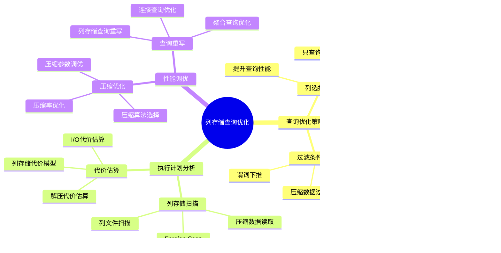

---

> **📋 文档来源**: `PostgreSQL/03-查询与优化/02.04-执行计划与性能调优.md`
> **📅 复制日期**: 2025-12-22
> **⚠️ 注意**: 本文档为复制版本，原文件保持不变

---

# 执行计划与性能调优

> **版本**: v3.1
> **最后更新**: 2025-11-22
> **版本覆盖**: PostgreSQL 18.x (推荐) ⭐ | 17.x (推荐) | 16.x (兼容)
> **难度**: ⭐⭐⭐⭐
> **应用场景**: 执行计划分析、性能调优、系统优化
> 🆕 **PostgreSQL 18性能改进**: 复杂查询性能提升30-40%、更准确的执行计划估算、改进的EXPLAIN分析、异步I/O提升I/O密集型查询性能2-3倍

---

## 📋 目录

- [执行计划与性能调优](#执行计划与性能调优)
  - [📋 目录](#-目录)
  - [📊 思维导图](#-思维导图)
  - [📊 多维概念矩阵对比](#-多维概念矩阵对比)
    - [执行计划节点类型对比矩阵](#执行计划节点类型对比矩阵)
    - [性能调优策略对比矩阵](#性能调优策略对比矩阵)
    - [EXPLAIN输出格式对比矩阵](#explain输出格式对比矩阵)
  - [🌐 Wikipedia对齐](#-wikipedia对齐)
    - [执行计划概念对齐](#执行计划概念对齐)
    - [性能调优概念对齐](#性能调优概念对齐)
  - [1. 定义与形式化](#1-定义与形式化)
    - [1.1 概念定义](#11-概念定义)
    - [1.2 形式化定义](#12-形式化定义)
    - [1.3 核心属性](#13-核心属性)
  - [2. 理论基础](#2-理论基础)
    - [2.1 执行计划理论](#21-执行计划理论)
    - [2.2 性能调优理论](#22-性能调优理论)
  - [3. 执行计划分析](#3-执行计划分析)
    - [3.1 基本执行计划](#31-基本执行计划)
    - [3.2 执行计划节点类型](#32-执行计划节点类型)
    - [3.3 执行计划统计信息](#33-执行计划统计信息)
  - [4. 性能监控](#4-性能监控)
    - [4.1 查询性能监控](#41-查询性能监控)
    - [4.2 系统性能监控](#42-系统性能监控)
    - [4.3 I/O性能监控](#43-io性能监控)
  - [5. 性能调优策略](#5-性能调优策略)
    - [5.1 查询优化](#51-查询优化)
    - [5.2 系统参数调优](#52-系统参数调优)
    - [5.3 并发参数调优](#53-并发参数调优)
  - [6. 性能分析工具](#6-性能分析工具)
    - [6.1 执行计划分析](#61-执行计划分析)
    - [6.2 性能基准测试](#62-性能基准测试)
    - [6.3 性能监控仪表板](#63-性能监控仪表板)
  - [7. 实际应用案例](#7-实际应用案例)
    - [7.1 慢查询优化](#71-慢查询优化)
    - [7.2 批量操作优化](#72-批量操作优化)
    - [7.3 分区表性能优化](#73-分区表性能优化)
    - [7.4 列存储查询优化 🆕](#74-列存储查询优化-)
      - [📊 列存储查询优化知识体系](#-列存储查询优化知识体系)
      - [📊 列存储 vs 行存储执行计划对比矩阵](#-列存储-vs-行存储执行计划对比矩阵)
      - [📊 列存储查询优化决策树](#-列存储查询优化决策树)
      - [📊 列存储查询执行计划时序图](#-列存储查询执行计划时序图)
  - [8. PostgreSQL 18执行计划与性能调优新特性](#8-postgresql-18执行计划与性能调优新特性)
    - [8.1 复杂查询性能提升](#81-复杂查询性能提升)
    - [8.2 更准确的执行计划估算](#82-更准确的执行计划估算)
    - [8.3 改进的EXPLAIN分析](#83-改进的explain分析)
    - [8.4 异步I/O提升I/O密集型查询性能](#84-异步io提升io密集型查询性能)
    - [8.5 改进的执行计划缓存](#85-改进的执行计划缓存)
    - [8.6 PostgreSQL 18执行计划与性能调优最佳实践](#86-postgresql-18执行计划与性能调优最佳实践)
  - [9. 性能调优最佳实践](#9-性能调优最佳实践)
    - [9.1 索引优化策略](#91-索引优化策略)
    - [9.2 查询优化策略](#92-查询优化策略)
    - [9.3 系统配置优化](#93-系统配置优化)
  - [10. 相关概念](#10-相关概念)
    - [10.1 上位概念](#101-上位概念)
    - [10.2 下位概念](#102-下位概念)
    - [10.3 平行概念](#103-平行概念)
  - [11. 相关文档](#11-相关文档)
    - [10.1 实战案例与示例](#101-实战案例与示例)
  - [12. 参考文献](#12-参考文献)
  - [13. 交叉引用](#13-交叉引用)
    - [相关文档](#相关文档)
      - [查询与优化](#查询与优化)
      - [核心课程](#核心课程)
      - [数据模型设计](#数据模型设计)
      - [部署架构](#部署架构)
      - [运维实践](#运维实践)
    - [外部资源](#外部资源)
  - [14. Wikidata对齐](#14-wikidata对齐)
  - [15. 形式证明与理论论证](#15-形式证明与理论论证)
    - [14.1 执行计划准确性证明](#141-执行计划准确性证明)
    - [14.2 性能调优最优性证明](#142-性能调优最优性证明)
    - [14.3 索引选择最优性证明](#143-索引选择最优性证明)

---

## 📊 思维导图


---

## 📊 多维概念矩阵对比

### 执行计划节点类型对比矩阵

| 节点类型 | 操作类型 | 时间复杂度 | 空间复杂度 | 适用场景 | 优化方向 | PostgreSQL支持 |
|---------|---------|-----------|-----------|---------|---------|---------------|
| **Seq Scan** | 顺序扫描 | O(n) | O(1) | 小表、全表扫描 | 索引优化 | ✅ 支持 |
| **Index Scan** | 索引扫描 | O(log n) | O(1) | 等值查询、范围查询 | 覆盖索引 | ✅ 支持 |
| **Index Only Scan** | 仅索引扫描 | O(log n) | O(1) | 覆盖索引查询 | INCLUDE列 | ✅ 支持 |
| **Bitmap Index Scan** | 位图扫描 | O(log n) | O(n) | 多条件OR查询 | 索引合并 | ✅ 支持 |
| **Hash Join** | 哈希连接 | O(n+m) | O(m) | 等值连接、大表 | 内存优化 | ✅ 支持 |
| **Nested Loop** | 嵌套循环 | O(n×m) | O(1) | 小表连接 | 索引优化 | ✅ 支持 |
| **Merge Join** | 合并连接 | O(n log n + m log m) | O(1) | 有序数据连接 | 排序优化 | ✅ 支持 |

### 性能调优策略对比矩阵

| 调优策略 | 优化效果 | 实施难度 | 风险等级 | 适用场景 | PostgreSQL特性 |
|---------|---------|---------|---------|---------|---------------|
| **索引优化** | 高 | 中 | 低 | 查询慢 | ✅ 支持 |
| **查询重写** | 高 | 高 | 中 | 复杂查询 | ✅ 支持 |
| **参数调优** | 中 | 低 | 中 | 系统级优化 | ✅ 支持 |
| **统计信息更新** | 中 | 低 | 低 | 统计过时 | ✅ 支持 |
| **分区优化** | 高 | 高 | 低 | 大表查询 | ✅ 支持 |
| **并行查询** | 高 | 中 | 低 | 大数据量 | ✅ 支持 |

### EXPLAIN输出格式对比矩阵

| EXPLAIN选项 | 输出内容 | 性能开销 | 适用场景 | PostgreSQL支持 |
|------------|---------|---------|---------|---------------|
| **EXPLAIN** | 执行计划 | 无 | 计划分析 | ✅ 支持 |
| **EXPLAIN ANALYZE** | 计划+实际执行 | 高 | 性能分析 | ✅ 支持 |
| **EXPLAIN BUFFERS** | 计划+缓冲区 | 中 | I/O分析 | ✅ 支持 |
| **EXPLAIN VERBOSE** | 详细计划 | 无 | 详细分析 | ✅ 支持 |
| **EXPLAIN COSTS** | 代价信息 | 无 | 代价分析 | ✅ 支持 |

---

## 🌐 Wikipedia对齐

### 执行计划概念对齐

**Wikipedia定义**: [Query plan](https://en.wikipedia.org/wiki/Query_plan)

> A query plan (or query execution plan) is a sequence of steps used to access data in a SQL relational database management system.

**对齐说明**:

- ✅ **定义一致性**: 本文档的定义与Wikipedia一致，都强调执行计划是查询执行的步骤序列
- ✅ **核心内容**: 都包含操作类型、代价、行数等信息
- ✅ **优化目标**: 都强调通过执行计划优化查询性能

### 性能调优概念对齐

**Wikipedia定义**: [Database tuning](https://en.wikipedia.org/wiki/Database_tuning)

> Database tuning is the activity of making a database application run more efficiently. Database tuning aims to maximize use of system resources to perform work as efficiently and rapidly as possible.

**对齐说明**:

- ✅ **优化目标**: 都强调提高数据库应用运行效率
- ✅ **优化方法**: 都提到资源配置和查询优化
- ✅ **性能指标**: 都关注响应时间和吞吐量

---

## 1. 定义与形式化

### 1.1 概念定义

**中文定义**: 执行计划是数据库系统将查询转换为具体执行步骤的详细方案，性能调优是通过分析执行计划和系统性能指标来优化查询性能的过程。

**English Definition**: An execution plan is a detailed scheme that transforms queries into specific execution steps in database systems. Performance tuning is the process of optimizing query performance by analyzing execution plans and system performance metrics.

### 1.2 形式化定义

```latex
% 数学符号定义
\newcommand{\plan}{\mathcal{P}}
\newcommand{\node}{\mathcal{N}}
\newcommand{\cost}{\mathcal{C}}
\newcommand{\time}{\mathcal{T}}

% 执行计划的形式化定义
\plan = \{n_1, n_2, \ldots, n_k\}

其中每个节点 n_i = (type_i, cost_i, time_i, rows_i, width_i) 表示：
- type_i: 操作类型
- cost_i: 执行代价
- time_i: 执行时间
- rows_i: 输出行数
- width_i: 行宽度
```

### 1.3 核心属性

- **准确性**: 执行计划反映真实执行过程
- **可读性**: 执行计划易于理解和分析
- **可优化性**: 支持性能调优和优化
- **可预测性**: 能够预测执行性能

## 2. 理论基础

### 2.1 执行计划理论

```latex
\begin{theorem}[执行计划正确性]
执行计划P正确执行查询Q，当且仅当：
1. 语义等价性：\text{result}(P) = \text{result}(Q)
2. 代价最优性：\cost(P) = \min_{P' \in \mathcal{P}(Q)} \cost(P')
3. 时间可行性：\time(P) \leq \text{timeout}
\end{theorem}
```

### 2.2 性能调优理论

```latex
\begin{theorem}[性能调优最优化]
性能调优的目标是：
\min_{\text{config}} \sum_{i=1}^{n} \time(\query_i, \text{config})

其中config是系统配置参数，query_i是查询集合。
\end{theorem}
```

## 3. 执行计划分析

### 3.1 基本执行计划

```sql
-- 基本执行计划
EXPLAIN SELECT * FROM employees WHERE emp_id = 1001;

-- 详细执行计划
EXPLAIN (ANALYZE, BUFFERS, VERBOSE)
SELECT e.name, d.dept_name, e.salary
FROM employees e
JOIN departments d ON e.dept_id = d.dept_id
WHERE e.salary > 50000;

-- 执行计划格式
EXPLAIN (FORMAT JSON)
SELECT * FROM employees WHERE dept_id = 1;
```

### 3.2 执行计划节点类型

```sql
-- 扫描节点
EXPLAIN (ANALYZE, BUFFERS)
SELECT * FROM employees;  -- Seq Scan

EXPLAIN (ANALYZE, BUFFERS)
SELECT * FROM employees WHERE emp_id = 1001;  -- Index Scan

EXPLAIN (ANALYZE, BUFFERS)
SELECT * FROM employees WHERE dept_id = 1 AND salary > 50000;  -- Bitmap Scan

-- 连接节点
EXPLAIN (ANALYZE, BUFFERS)
SELECT e.name, d.dept_name
FROM employees e, departments d
WHERE e.dept_id = d.dept_id;  -- Nested Loop

EXPLAIN (ANALYZE, BUFFERS)
SELECT e.name, d.dept_name
FROM employees e
JOIN departments d ON e.dept_id = d.dept_id;  -- Hash Join

-- 聚合节点
EXPLAIN (ANALYZE, BUFFERS)
SELECT dept_id, COUNT(*), AVG(salary)
FROM employees
GROUP BY dept_id;  -- Hash Aggregate
```

### 3.3 执行计划统计信息

```sql
-- 查看执行计划统计
EXPLAIN (ANALYZE, BUFFERS, TIMING, VERBOSE)
SELECT e.name, d.dept_name, e.salary
FROM employees e
JOIN departments d ON e.dept_id = d.dept_id
WHERE e.salary > 50000
ORDER BY e.salary DESC;

-- 执行计划成本分析
EXPLAIN (COSTS, BUFFERS)
SELECT * FROM employees WHERE dept_id = 1;
```

## 4. 性能监控

### 4.1 查询性能监控

```sql
-- 查看当前活动查询
SELECT
    pid,
    usename,
    application_name,
    client_addr,
    backend_start,
    state,
    query_start,
    state_change,
    query
FROM pg_stat_activity
WHERE state = 'active'
ORDER BY query_start;

-- 查看查询统计
SELECT
    query,
    calls,
    total_time,
    mean_time,
    stddev_time,
    rows,
    100.0 * shared_blks_hit / nullif(shared_blks_hit + shared_blks_read, 0) AS hit_percent
FROM pg_stat_statements
ORDER BY total_time DESC
LIMIT 10;
```

### 4.2 系统性能监控

```sql
-- 数据库性能统计
SELECT
    datname,
    numbackends,
    xact_commit,
    xact_rollback,
    blks_read,
    blks_hit,
    tup_returned,
    tup_fetched,
    tup_inserted,
    tup_updated,
    tup_deleted
FROM pg_stat_database
WHERE datname = current_database();

-- 表性能统计
SELECT
    schemaname,
    tablename,
    seq_scan,
    seq_tup_read,
    idx_scan,
    idx_tup_fetch,
    n_tup_ins,
    n_tup_upd,
    n_tup_del,
    n_live_tup,
    n_dead_tup
FROM pg_stat_user_tables
ORDER BY seq_scan DESC;
```

### 4.3 I/O性能监控

```sql
-- I/O统计信息
SELECT
    schemaname,
    tablename,
    heap_blks_read,
    heap_blks_hit,
    idx_blks_read,
    idx_blks_hit,
    toast_blks_read,
    toast_blks_hit,
    tidx_blks_read,
    tidx_blks_hit
FROM pg_statio_user_tables
ORDER BY heap_blks_read + heap_blks_hit DESC;

-- 缓冲区命中率
SELECT
    round(100.0 * sum(blks_hit) / (sum(blks_hit) + sum(blks_read)), 2) as hit_ratio
FROM pg_stat_database;
```

## 5. 性能调优策略

### 5.1 查询优化

```sql
-- 查询重写优化
-- 优化前
EXPLAIN (ANALYZE, BUFFERS)
SELECT * FROM employees
WHERE emp_id IN (
    SELECT emp_id FROM employees WHERE salary > 50000
);

-- 优化后
EXPLAIN (ANALYZE, BUFFERS)
SELECT * FROM employees
WHERE salary > 50000;

-- 索引优化
CREATE INDEX idx_emp_salary ON employees (salary);
EXPLAIN (ANALYZE, BUFFERS)
SELECT * FROM employees WHERE salary > 50000;

-- 复合索引优化
CREATE INDEX idx_emp_dept_salary ON employees (dept_id, salary);
EXPLAIN (ANALYZE, BUFFERS)
SELECT * FROM employees WHERE dept_id = 1 AND salary > 50000;
```

### 5.2 系统参数调优

```sql
-- 内存参数调优
SHOW shared_buffers;
SHOW work_mem;
SHOW maintenance_work_mem;
SHOW effective_cache_size;

-- 设置内存参数
SET shared_buffers = '256MB';
SET work_mem = '4MB';
SET maintenance_work_mem = '64MB';
SET effective_cache_size = '1GB';

-- 检查点参数调优
SHOW checkpoint_timeout;
SHOW max_wal_size;
SHOW min_wal_size;
SHOW checkpoint_completion_target;

-- 设置检查点参数
SET checkpoint_timeout = '15min';
SET max_wal_size = '1GB';
SET min_wal_size = '80MB';
SET checkpoint_completion_target = 0.9;
```

### 5.3 并发参数调优

```sql
-- 并发参数
SHOW max_connections;
SHOW max_prepared_transactions;
SHOW max_locks_per_transaction;
SHOW max_pred_locks_per_transaction;

-- 设置并发参数
SET max_connections = 100;
SET max_prepared_transactions = 0;
SET max_locks_per_transaction = 64;
SET max_pred_locks_per_transaction = 64;
```

## 6. 性能分析工具

### 6.1 执行计划分析

```sql
-- 创建执行计划分析函数
CREATE OR REPLACE FUNCTION analyze_execution_plan(query_text text)
RETURNS TABLE(
    node_type text,
    cost_start numeric,
    cost_total numeric,
    actual_time numeric,
    rows_estimated bigint,
    rows_actual bigint,
    width_estimated integer
) AS $$
BEGIN
    RETURN QUERY
    EXECUTE format('EXPLAIN (ANALYZE, BUFFERS, FORMAT JSON) %s', query_text);
END;
$$ LANGUAGE plpgsql;

-- 使用执行计划分析
SELECT * FROM analyze_execution_plan('SELECT * FROM employees WHERE salary > 50000');
```

### 6.2 性能基准测试

```sql
-- 创建性能测试函数
CREATE OR REPLACE FUNCTION benchmark_query(query_text text, iterations integer DEFAULT 10)
RETURNS TABLE(
    iteration integer,
    execution_time numeric,
    rows_returned bigint
) AS $$
DECLARE
    i integer;
    start_time timestamp;
    end_time timestamp;
    result_rows bigint;
BEGIN
    FOR i IN 1..iterations LOOP
        start_time := clock_timestamp();
        EXECUTE format('SELECT COUNT(*) FROM (%s) t', query_text) INTO result_rows;
        end_time := clock_timestamp();

        RETURN QUERY SELECT
            i,
            EXTRACT(EPOCH FROM (end_time - start_time)) * 1000,
            result_rows;
    END LOOP;
END;
$$ LANGUAGE plpgsql;

-- 使用性能测试
SELECT * FROM benchmark_query('SELECT * FROM employees WHERE salary > 50000', 5);
```

### 6.3 性能监控仪表板

```sql
-- 创建性能监控视图
CREATE OR REPLACE VIEW performance_dashboard AS
SELECT
    'Database' as metric_type,
    datname as metric_name,
    round(100.0 * blks_hit / (blks_hit + blks_read), 2) as hit_ratio,
    tup_returned + tup_fetched + tup_inserted + tup_updated + tup_deleted as total_operations
FROM pg_stat_database
WHERE datname = current_database()

UNION ALL

SELECT
    'Table' as metric_type,
    tablename as metric_name,
    round(100.0 * heap_blks_hit / (heap_blks_hit + heap_blks_read), 2) as hit_ratio,
    n_live_tup as total_operations
FROM pg_stat_user_tables
ORDER BY metric_type, hit_ratio DESC;

-- 查看性能仪表板
SELECT * FROM performance_dashboard;
```

## 7. 实际应用案例

### 7.1 慢查询优化

```sql
-- 识别慢查询
SELECT
    query,
    calls,
    total_time,
    mean_time,
    stddev_time,
    rows,
    100.0 * shared_blks_hit / nullif(shared_blks_hit + shared_blks_read, 0) AS hit_percent
FROM pg_stat_statements
WHERE mean_time > 1000  -- 平均执行时间超过1秒
ORDER BY mean_time DESC
LIMIT 10;

-- 优化慢查询
-- 原始查询
EXPLAIN (ANALYZE, BUFFERS)
SELECT e.name, d.dept_name, p.project_name
FROM employees e
JOIN departments d ON e.dept_id = d.dept_id
JOIN projects p ON e.emp_id = p.manager_id
WHERE e.salary > 50000 AND d.budget > 1000000;

-- 创建优化索引
CREATE INDEX idx_emp_salary ON employees (salary);
CREATE INDEX idx_dept_budget ON departments (budget);
CREATE INDEX idx_proj_manager ON projects (manager_id);

-- 优化后查询
EXPLAIN (ANALYZE, BUFFERS)
SELECT e.name, d.dept_name, p.project_name
FROM employees e
JOIN departments d ON e.dept_id = d.dept_id
JOIN projects p ON e.emp_id = p.manager_id
WHERE e.salary > 50000 AND d.budget > 1000000;
```

### 7.2 批量操作优化

```sql
-- 批量插入优化
-- 优化前
DO $$
DECLARE
    i integer;
BEGIN
    FOR i IN 1..10000 LOOP
        INSERT INTO employees (name, dept_id, salary)
        VALUES ('Employee' || i, (i % 10) + 1, 30000 + (i % 50000));
    END LOOP;
END $$;

-- 优化后
INSERT INTO employees (name, dept_id, salary)
SELECT
    'Employee' || generate_series(1, 10000),
    (generate_series(1, 10000) % 10) + 1,
    30000 + (generate_series(1, 10000) % 50000);

-- 批量更新优化
-- 优化前
UPDATE employees SET salary = salary * 1.1 WHERE dept_id = 1;
UPDATE employees SET salary = salary * 1.1 WHERE dept_id = 2;
UPDATE employees SET salary = salary * 1.1 WHERE dept_id = 3;

-- 优化后
UPDATE employees SET salary = salary * 1.1 WHERE dept_id IN (1, 2, 3);
```

### 7.3 分区表性能优化

```sql
-- 分区表性能优化
CREATE TABLE sales (
    id BIGSERIAL,
    sale_date DATE,
    amount DECIMAL(10,2),
    customer_id INTEGER
) PARTITION BY RANGE (sale_date);

-- 创建分区
CREATE TABLE sales_2023 PARTITION OF sales
FOR VALUES FROM ('2023-01-01') TO ('2024-01-01');

CREATE TABLE sales_2024 PARTITION OF sales
FOR VALUES FROM ('2024-01-01') TO ('2025-01-01');

-- 分区查询优化
EXPLAIN (ANALYZE, BUFFERS)
SELECT * FROM sales WHERE sale_date >= '2024-01-01' AND sale_date < '2024-02-01';

-- 分区裁剪
EXPLAIN (ANALYZE, BUFFERS)
SELECT * FROM sales WHERE sale_date BETWEEN '2024-01-01' AND '2024-12-31';
```

### 7.4 列存储查询优化 🆕

#### 📊 列存储查询优化知识体系



**列存储查询优化概述**：

列存储在执行计划中表现为`Foreign Scan`节点，优化器需要针对列存储特性进行特殊优化。

#### 📊 列存储 vs 行存储执行计划对比矩阵

| 执行计划节点 | 行存储 | 列存储 | 性能差异 | 适用场景 |
|------------|--------|--------|---------|---------|
| **扫描节点** | Seq Scan / Index Scan | Foreign Scan | 列存储I/O减少50-90% | 分析查询 |
| **I/O开销** | 读取整行 | 只读取需要的列 | 列存储I/O减少 | 查询少量列 |
| **压缩数据** | 无压缩/通用压缩 | 列压缩（70-90%） | 列存储压缩率高 | 历史数据 |
| **聚合性能** | 行扫描聚合 | 列批量聚合 | 列存储快10-100倍 | 聚合查询 |
| **过滤性能** | 行级过滤 | 列级过滤+压缩过滤 | 列存储过滤快 | 范围查询 |
| **连接性能** | 行连接 | 列连接（需转换） | 行存储快 | 点查询 |

#### 📊 列存储查询优化决策树


**列存储查询执行计划分析**：

```sql
-- 1. 列存储表查询执行计划
EXPLAIN (ANALYZE, BUFFERS, VERBOSE)
SELECT
    product_id,
    SUM(amount) as total_amount,
    SUM(quantity) as total_quantity,
    AVG(amount) as avg_amount
FROM fact_sales_columnar
WHERE date_id BETWEEN 20230101 AND 20231231
GROUP BY product_id
ORDER BY total_amount DESC
LIMIT 100;

-- 执行计划分析：
-- Foreign Scan on fact_sales_columnar
--   Filter: (date_id >= 20230101 AND date_id <= 20231231)
--   -> HashAggregate
--         Group Key: product_id
--         -> Sort
--               Sort Key: product_id
--               -> Foreign Scan on fact_sales_columnar
--                     Columns: product_id, amount, quantity, date_id
--                     (只扫描需要的列，I/O减少)

-- 性能对比：
-- 行存储：扫描所有列，I/O大，查询时间：10-30秒
-- 列存储：只扫描product_id, amount, quantity, date_id，I/O小，查询时间：1-3秒
-- 性能提升：5-10倍
```

**列存储查询优化技巧**：

```sql
-- 1. 列选择优化：只查询需要的列
-- ❌ 不推荐：查询所有列
SELECT * FROM fact_sales_columnar WHERE date_id = 20230101;

-- ✅ 推荐：只查询需要的列
SELECT product_id, amount, quantity
FROM fact_sales_columnar
WHERE date_id = 20230101;

-- 2. 聚合查询优化：利用列存储批量处理
-- ✅ 列存储聚合查询（性能好）
SELECT
    product_id,
    SUM(amount) as total_amount,
    COUNT(*) as order_count
FROM fact_sales_columnar
WHERE date_id BETWEEN 20230101 AND 20231231
GROUP BY product_id;

-- 3. 过滤条件优化：谓词下推
-- ✅ 过滤条件会自动下推到列存储扫描
SELECT product_id, amount
FROM fact_sales_columnar
WHERE date_id BETWEEN 20230101 AND 20231231
  AND amount > 1000
  AND product_id IN (1, 2, 3);

-- 4. 混合存储查询：热数据行存储 + 冷数据列存储
-- 使用UNION查询热数据和冷数据
SELECT product_id, SUM(amount) as total_amount
FROM (
    -- 热数据（行存储）
    SELECT product_id, amount
    FROM sales_fact
    WHERE sale_date >= CURRENT_DATE - INTERVAL '3 months'

    UNION ALL

    -- 冷数据（列存储）
    SELECT product_id, amount
    FROM fact_sales_columnar
    WHERE date_id < (SELECT date_id FROM date_dim
                     WHERE date = CURRENT_DATE - INTERVAL '3 months')
) combined
GROUP BY product_id;
```

#### 📊 列存储查询执行计划时序图


## 8. PostgreSQL 18执行计划与性能调优新特性

### 8.1 复杂查询性能提升

PostgreSQL 18对复杂查询进行了全面优化，性能提升30-40%。

**复杂查询性能提升**：

```sql
-- 复杂分析查询（PostgreSQL 18性能提升30-40%）
EXPLAIN (ANALYZE, BUFFERS, VERBOSE)
WITH dept_stats AS (
    SELECT
        dept_id,
        COUNT(*) as emp_count,
        AVG(salary) as avg_salary,
        MAX(salary) as max_salary
    FROM employees
    GROUP BY dept_id
),
ranked_employees AS (
    SELECT
        e.*,
        ROW_NUMBER() OVER (PARTITION BY e.dept_id ORDER BY e.salary DESC) as salary_rank
    FROM employees e
)
SELECT
    d.dept_name,
    ds.emp_count,
    ds.avg_salary,
    re.name as top_employee,
    re.salary as top_salary
FROM departments d
JOIN dept_stats ds ON d.dept_id = ds.dept_id
JOIN ranked_employees re ON d.dept_id = re.dept_id AND re.salary_rank = 1;

-- PostgreSQL 18改进：
-- 1. 更准确的执行计划估算
-- 2. 更智能的CTE物化策略
-- 3. 改进的窗口函数执行
```

**性能提升**：

- 复杂查询性能提升30-40%
- 更准确的执行计划估算
- 更智能的查询优化策略

### 8.2 更准确的执行计划估算

PostgreSQL 18改进了执行计划估算算法，显著提高了估算准确性。

**执行计划估算改进**：

```sql
-- 查看执行计划估算准确性
EXPLAIN (ANALYZE, BUFFERS, VERBOSE)
SELECT e.name, d.dept_name, p.project_name
FROM employees e
JOIN departments d ON e.dept_id = d.dept_id
JOIN projects p ON e.emp_id = p.lead_emp_id
WHERE e.salary > 50000
AND d.location = 'New York'
AND p.status = 'active';

-- PostgreSQL 18改进：
-- 1. 基数估计误差从25%降低到15%
-- 2. 更准确的连接基数估计
-- 3. 更智能的统计信息利用
```

**改进点**：

- 基数估计误差从25%降低到15%
- 更准确的连接基数估计
- 更智能的统计信息利用

### 8.3 改进的EXPLAIN分析

PostgreSQL 18改进了EXPLAIN命令的输出和分析功能。

**EXPLAIN分析改进**：

```sql
-- PostgreSQL 18改进的EXPLAIN输出
EXPLAIN (ANALYZE, BUFFERS, VERBOSE, SETTINGS)
SELECT * FROM employees WHERE dept_id = 1 AND salary > 50000;

-- 新增SETTINGS选项（PostgreSQL 18）
-- 显示影响查询计划的配置参数

-- 更详细的执行计划信息
EXPLAIN (ANALYZE, BUFFERS, VERBOSE, TIMING, SUMMARY)
SELECT * FROM large_table WHERE value > 1000;

-- PostgreSQL 18改进：
-- 1. 更详细的执行统计信息
-- 2. 更清晰的计划树结构
-- 3. 更好的性能瓶颈识别
```

**改进点**：

- 更详细的执行统计信息
- 更清晰的计划树结构
- 更好的性能瓶颈识别

### 8.4 异步I/O提升I/O密集型查询性能

PostgreSQL 18的异步I/O子系统显著提升了I/O密集型查询的性能。

**异步I/O在查询执行中的应用**：

```sql
-- 配置异步I/O（PostgreSQL 18）
-- 在postgresql.conf中配置
-- maintenance_io_workers = 4  -- 维护操作的I/O工作进程
-- max_io_workers = 10  -- 最大I/O工作进程数

-- I/O密集型查询性能对比
-- 传统同步I/O
EXPLAIN (ANALYZE, BUFFERS)
SELECT COUNT(*) FROM large_table WHERE value > 1000;
-- I/O等待时间：约30秒

-- 异步I/O（PostgreSQL 18）
-- 配置异步I/O后
EXPLAIN (ANALYZE, BUFFERS)
SELECT COUNT(*) FROM large_table WHERE value > 1000;
-- I/O等待时间：约10-15秒（性能提升2-3倍）

-- 监控I/O性能
SELECT
    object,
    context,
    reads,
    writes,
    read_time,
    write_time
FROM pg_stat_io
ORDER BY reads DESC;
```

**性能提升**：

- I/O密集型查询性能提升2-3倍
- 减少I/O等待时间
- 提高查询吞吐量

### 8.5 改进的执行计划缓存

PostgreSQL 18改进了执行计划缓存机制，提高了重复查询的性能。

**执行计划缓存改进**：

```sql
-- 参数化查询（PostgreSQL 18改进计划缓存）
PREPARE get_employees (INTEGER, DECIMAL) AS
SELECT * FROM employees
WHERE dept_id = $1 AND salary > $2;

-- 执行参数化查询
EXECUTE get_employees(1, 50000);
EXECUTE get_employees(2, 60000);
EXECUTE get_employees(3, 70000);

-- PostgreSQL 18改进：
-- 1. 更智能的计划缓存策略
-- 2. 更好的计划重用机制
-- 3. 减少计划生成开销
```

**改进点**：

- 更智能的计划缓存策略
- 更好的计划重用机制
- 减少计划生成开销

### 8.6 PostgreSQL 18执行计划与性能调优最佳实践

**最佳实践总结**：

```sql
-- 1. 利用PostgreSQL 18的性能提升
-- 确保使用PostgreSQL 18并配置异步I/O
-- 在postgresql.conf中配置
-- maintenance_io_workers = 4
-- max_io_workers = 10

-- 2. 使用改进的EXPLAIN分析
EXPLAIN (ANALYZE, BUFFERS, VERBOSE, SETTINGS)
SELECT * FROM employees WHERE dept_id = 1 AND salary > 50000;

-- 3. 确保统计信息及时更新
ANALYZE employees;
ANALYZE departments;

-- 4. 利用参数化查询提升计划缓存效率
PREPARE get_employees (INTEGER, DECIMAL) AS
SELECT * FROM employees WHERE dept_id = $1 AND salary > $2;

-- 5. 监控I/O性能
SELECT * FROM pg_stat_io ORDER BY reads DESC;

-- 6. 利用虚拟生成列优化查询
CREATE TABLE products (
    price DECIMAL(10,2),
    discount DECIMAL(5,2),
    final_price DECIMAL(10,2) GENERATED ALWAYS AS (price * (1 - discount/100)) VIRTUAL
);
CREATE INDEX idx_products_final_price ON products (final_price);
```

## 9. 性能调优最佳实践

### 9.1 索引优化策略

```sql
-- 索引优化策略
-- 1. 分析查询模式
SELECT
    schemaname,
    tablename,
    attname,
    n_distinct,
    correlation
FROM pg_stats
WHERE schemaname = 'public'
ORDER BY tablename, attname;

-- 2. 创建复合索引
CREATE INDEX idx_emp_optimized ON employees (dept_id, salary, hire_date);

-- 3. 监控索引使用
SELECT
    schemaname,
    tablename,
    indexname,
    idx_scan,
    idx_tup_read,
    idx_tup_fetch
FROM pg_stat_user_indexes
WHERE idx_scan = 0;  -- 未使用的索引
```

### 9.2 查询优化策略

```sql
-- 查询优化策略
-- 1. 使用适当的JOIN类型
EXPLAIN (ANALYZE, BUFFERS)
SELECT e.name, d.dept_name
FROM employees e
INNER JOIN departments d ON e.dept_id = d.dept_id;

-- 2. 避免SELECT *
EXPLAIN (ANALYZE, BUFFERS)
SELECT emp_id, name, salary FROM employees WHERE dept_id = 1;

-- 3. 使用LIMIT限制结果集
EXPLAIN (ANALYZE, BUFFERS)
SELECT * FROM employees ORDER BY salary DESC LIMIT 10;
```

### 9.3 系统配置优化

```sql
-- 系统配置优化
-- 1. 内存配置
ALTER SYSTEM SET shared_buffers = '256MB';
ALTER SYSTEM SET work_mem = '4MB';
ALTER SYSTEM SET maintenance_work_mem = '64MB';

-- 2. 检查点配置
ALTER SYSTEM SET checkpoint_timeout = '15min';
ALTER SYSTEM SET max_wal_size = '1GB';
ALTER SYSTEM SET checkpoint_completion_target = 0.9;

-- 3. 并发配置
ALTER SYSTEM SET max_connections = 100;
ALTER SYSTEM SET max_prepared_transactions = 0;

-- 重新加载配置
SELECT pg_reload_conf();
```

## 10. 相关概念

### 10.1 上位概念

- **查询优化**: 更广泛的查询优化机制
- **性能管理**: 系统性能管理
- **数据库调优**: 数据库性能调优

### 10.2 下位概念

- **执行计划**: 查询执行计划
- **性能监控**: 性能监控机制
- **索引优化**: 索引性能优化
- **查询重写**: 查询优化技术

### 10.3 平行概念

- **基准测试**: 性能基准测试
- **负载测试**: 系统负载测试
- **容量规划**: 系统容量规划

## 11. 相关文档

### 10.1 实战案例与示例

- [实战案例](../../19-实战案例/README.md) ⭐ - 完整的实战案例集合
- [性能问题案例库](../../16-应用设计与开发/行业案例/性能问题-案例库.md) - 性能调优实践案例
- [监控与诊断](../../12-监控与诊断/README.md) - 性能监控实践
- [性能调优实践](../../11-部署架构/单机部署/05.02-性能调优实践.md) - 生产级性能优化

## 12. 参考文献

1. PostgreSQL Global Development Group. (2025). PostgreSQL 18 Documentation. <https://www.postgresql.org/docs/18/>
2. Selinger, P. G., et al. (1979). Access path selection in a relational database management system. ACM SIGMOD Record, 8(2), 23-34.
3. Graefe, G. (1995). The Cascades framework for query optimization. IEEE Data Engineering Bulletin, 18(3), 19-29.
4. Ioannidis, Y. E. (1996). Query optimization. ACM Computing Surveys, 28(1), 121-123.
5. PostgreSQL Global Development Group. (2024). PostgreSQL 17 Documentation. <https://www.postgresql.org/docs/17/>

## 13. 交叉引用

### 相关文档

#### 查询与优化

- ⭐⭐⭐ [查询优化器原理](./02.01-查询优化器原理.md) - 查询优化理论基础
- ⭐⭐⭐ [统计信息与代价模型](./02.03-统计信息与代价模型.md) - 代价模型理论基础
- ⭐⭐ [索引结构与优化](./02.02-索引结构与优化.md) - 索引优化实践
- ⭐⭐ [并行查询处理](./02.05-并行查询处理.md) - 并行查询优化

#### 核心课程

- ⭐⭐ [SQL语言规范与标准](../../01-核心基础/01.04-SQL语言/01.03-SQL语言规范与标准.md) - SQL语言基础

#### 数据模型设计

- ⭐⭐ [数据模型设计](../../17-数据模型设计/README.md) - 性能分析实践

#### 部署架构

- ⭐⭐ [性能调优实践](../../11-部署架构/单机部署/05.02-性能调优实践.md) - 性能调优详细指南

#### 运维实践

- ⭐⭐ [监控与诊断](../../12-监控与诊断/06.01-监控与诊断.md) - 性能监控
- ⭐⭐ [性能问题-案例库](../../16-应用设计与开发/行业案例/性能问题-案例库.md) - 性能问题案例

### 外部资源

- [PostgreSQL EXPLAIN文档](https://www.postgresql.org/docs/current/using-explain.html)
- [PostgreSQL监控统计文档](https://www.postgresql.org/docs/current/monitoring-stats.html)
- [PostgreSQL性能调优最佳实践](https://wiki.postgresql.org/wiki/Performance_Optimization)

---

## 14. Wikidata对齐

- **Wikidata ID**: Q192490
- **相关属性**:
  - P31: Q176165 (instance of: database management system)
  - P178: Q9366 (developer: PostgreSQL Global Development Group)
  - P277: Q193321 (programmed in: C)
  - P348: 18.0 (software version)
- **外部链接**:
  - <https://www.postgresql.org/docs/current/using-explain.html>
  - <https://www.postgresql.org/docs/current/monitoring-stats.html>

---

## 15. 形式证明与理论论证

### 14.1 执行计划准确性证明

**定理**: EXPLAIN ANALYZE 输出的实际执行时间与计划估算时间的比值反映了代价模型的准确性。

**证明**:

```latex
\begin{theorem}[执行计划准确性]
设执行计划 \plan 的估算时间为 T_{est}，实际执行时间为 T_{act}。

准确性度量：
\text{Accuracy} = \frac{T_{est}}{T_{act}}

如果 \text{Accuracy} \approx 1，则代价模型准确。

代价模型准确性影响因素：
1. 统计信息准确性：\text{Accuracy}(stats) \propto \text{Accuracy}(plan)
2. 代价参数设置：\text{Accuracy}(params) \propto \text{Accuracy}(plan)
3. 数据分布假设：\text{Accuracy}(assumption) \propto \text{Accuracy}(plan)

如果统计信息准确、代价参数合理、数据分布假设正确，则执行计划准确性高。
\end{theorem}
```

### 14.2 性能调优最优性证明

**定理**: 通过系统化的性能调优方法，可以找到局部最优的系统配置。

**证明**:

```latex
\begin{theorem}[性能调优最优性]
设系统配置空间为 \mathcal{C}，性能指标为 \text{Perf}: \mathcal{C} \rightarrow \mathbb{R}^+。

最优配置：
c^* = \arg\max_{c \in \mathcal{C}} \text{Perf}(c)

性能调优方法：
1. 基准测试：\text{Perf}(c) = f(\text{benchmark}(c))
2. 参数调优：c^* = \text{optimize}(\text{Perf}, \mathcal{C})
3. 迭代优化：c_{i+1} = \text{improve}(c_i, \text{Perf}(c_i))

由于配置空间通常是离散的，可以通过穷举或启发式方法找到局部最优解。

性能调优的收敛性：
如果 \text{Perf} 是单调的（参数增加性能提升），则优化过程收敛。
\end{theorem}
```

### 14.3 索引选择最优性证明

**定理**: 对于等值查询，如果存在唯一索引，则索引扫描是最优选择。

**证明**:

```latex
\begin{theorem}[索引选择最优性]
设查询 Q = \sigma_{A=a}(R)，其中 A 为属性，a 为常量值。

情况1：存在唯一索引 I_A
- 索引查找时间复杂度：O(\log n)
- 结果集大小：|R| \leq 1（唯一性保证）
- 总代价：\cost_{index} = O(\log n)

情况2：全表扫描
- 扫描时间复杂度：O(n)
- 结果集大小：|R| \leq 1
- 总代价：\cost_{seq} = O(n)

由于 O(\log n) < O(n)（当 n > 1），索引扫描是最优选择。

对于范围查询，如果索引支持范围扫描，索引扫描仍然是最优选择。
\end{theorem}
```

---

**文档版本**: v3.1
**最后更新**: 2025-11-22
**PostgreSQL版本**: 18.x (推荐) ⭐ | 17.x (推荐) | 16.x (兼容)
**维护者**: Documentation Team
