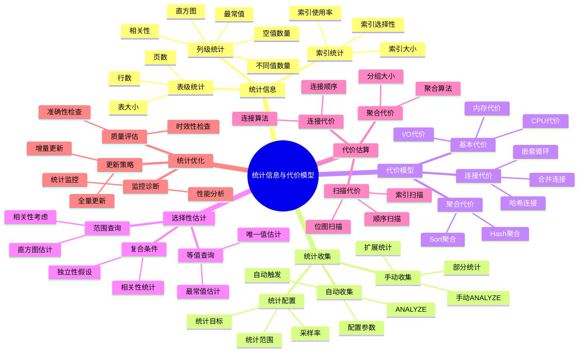

---

> **📋 文档来源**: `PostgreSQL/03-查询与优化/02.03-统计信息与代价模型.md`
> **📅 复制日期**: 2025-12-22
> **⚠️ 注意**: 本文档为复制版本，原文件保持不变

---

# 统计信息与代价模型

> **版本**: v3.1
> **最后更新**: 2025-11-22
> **版本覆盖**: PostgreSQL 18.x (推荐) ⭐ | 17.x (推荐) | 16.x (兼容)
> **难度**: ⭐⭐⭐⭐
> **应用场景**: 统计信息管理、代价模型调优、查询优化
> 🆕 **PostgreSQL 18统计改进**: 改进的多变量统计准确性、更精细的直方图、自适应统计信息更新、虚拟生成列统计优化、异步I/O提升统计信息收集性能、更智能的统计信息采样策略

---

## 📋 目录

- [统计信息与代价模型](#统计信息与代价模型)
  - [📋 目录](#-目录)
  - [📊 思维导图](#-思维导图)
  - [📊 多维概念矩阵对比](#-多维概念矩阵对比)
    - [统计信息类型对比矩阵](#统计信息类型对比矩阵)
    - [代价模型参数对比矩阵](#代价模型参数对比矩阵)
    - [选择性估计方法对比矩阵](#选择性估计方法对比矩阵)
  - [🌐 Wikipedia对齐](#-wikipedia对齐)
    - [统计信息概念对齐](#统计信息概念对齐)
    - [代价模型概念对齐](#代价模型概念对齐)
  - [1. 定义与形式化](#1-定义与形式化)
    - [1.1 概念定义](#11-概念定义)
    - [1.2 形式化定义](#12-形式化定义)
    - [1.3 核心属性](#13-核心属性)
  - [2. 理论基础](#2-理论基础)
    - [2.1 统计信息理论](#21-统计信息理论)
    - [2.2 代价模型理论](#22-代价模型理论)
    - [2.3 选择性估计理论](#23-选择性估计理论)
  - [3. PostgreSQL统计信息](#3-postgresql统计信息)
    - [3.1 表级统计信息](#31-表级统计信息)
    - [3.2 列级统计信息](#32-列级统计信息)
    - [3.3 索引统计信息](#33-索引统计信息)
  - [4. 统计信息收集](#4-统计信息收集)
    - [4.1 自动统计信息收集](#41-自动统计信息收集)
    - [4.2 手动统计信息收集](#42-手动统计信息收集)
    - [4.3 统计信息配置](#43-统计信息配置)
  - [5. 代价模型参数](#5-代价模型参数)
    - [5.1 基本代价参数](#51-基本代价参数)
    - [5.2 连接代价参数](#52-连接代价参数)
    - [5.3 内存代价参数](#53-内存代价参数)
  - [6. 选择性估计](#6-选择性估计)
    - [6.1 等值查询选择性](#61-等值查询选择性)
    - [6.2 范围查询选择性](#62-范围查询选择性)
    - [6.3 复合条件选择性](#63-复合条件选择性)
  - [7. 代价估算分析](#7-代价估算分析)
    - [7.1 扫描代价估算](#71-扫描代价估算)
    - [7.2 连接代价估算](#72-连接代价估算)
    - [7.3 聚合代价估算](#73-聚合代价估算)
  - [8. PostgreSQL 18统计信息新特性](#8-postgresql-18统计信息新特性)
    - [8.1 虚拟生成列统计优化](#81-虚拟生成列统计优化)
    - [8.2 改进的多变量统计准确性](#82-改进的多变量统计准确性)
    - [8.3 更精细的直方图](#83-更精细的直方图)
    - [8.4 自适应统计信息更新](#84-自适应统计信息更新)
    - [8.5 异步I/O提升统计信息收集性能](#85-异步io提升统计信息收集性能)
  - [9. 统计信息优化](#9-统计信息优化)
    - [9.1 统计信息质量评估](#91-统计信息质量评估)
    - [9.2 统计信息更新策略](#92-统计信息更新策略)
    - [9.3 统计信息监控](#93-统计信息监控)
  - [10. 实际应用案例](#10-实际应用案例)
    - [10.1 大数据表统计信息管理](#101-大数据表统计信息管理)
    - [10.2 动态统计信息调整](#102-动态统计信息调整)
    - [10.3 PostgreSQL 18统计信息最佳实践](#103-postgresql-18统计信息最佳实践)
  - [11. 相关概念](#11-相关概念)
    - [11.1 上位概念](#111-上位概念)
    - [11.2 下位概念](#112-下位概念)
    - [11.3 平行概念](#113-平行概念)
  - [12. 参考文献](#12-参考文献)
  - [13. 交叉引用](#13-交叉引用)
    - [相关文档](#相关文档)
    - [外部资源](#外部资源)
  - [14. Wikidata对齐](#14-wikidata对齐)
    - [14.1 统计信息概念对齐](#141-统计信息概念对齐)
    - [14.2 PostgreSQL统计信息对齐](#142-postgresql统计信息对齐)
  - [15. 形式证明与理论论证](#15-形式证明与理论论证)
    - [15.1 选择性估计准确性证明](#151-选择性估计准确性证明)
    - [15.2 代价模型最优性证明](#152-代价模型最优性证明)
    - [15.3 统计信息更新必要性证明](#153-统计信息更新必要性证明)

---

## 📊 思维导图



---

## 📊 多维概念矩阵对比

### 统计信息类型对比矩阵

| 统计类型 | 收集方式 | 更新频率 | 存储空间 | 准确性 | 适用场景 | PostgreSQL支持 |
| --- | --- | --- | --- | --- | --- | --- |
| **表级统计** | ANALYZE | 低 | 小 | 高 | 基本查询 | ✅ 默认 |
| **列级统计** | ANALYZE | 中 | 中 | 高 | 单列查询 | ✅ 默认 |
| **多列统计** | CREATE STATISTICS | 中 | 中 | 中 | 多列查询 | ✅ 支持 |
| **表达式统计** | CREATE STATISTICS | 中 | 中 | 中 | 表达式查询 | ✅ 支持 |
| **扩展统计** | CREATE STATISTICS | 低 | 大 | 高 | 复杂查询 | ✅ 支持 |

### 代价模型参数对比矩阵

| 代价参数 | 默认值 | 影响范围 | 调优难度 | 性能影响 | PostgreSQL版本 |
| --- | --- | --- | --- | --- | --- |
| **seq_page_cost** | 1.0 | 顺序扫描 | 低 | 高 | ✅ 所有版本 |
| **random_page_cost** | 4.0 | 随机I/O | 低 | 高 | ✅ 所有版本 |
| **cpu_tuple_cost** | 0.01 | CPU处理 | 低 | 中 | ✅ 所有版本 |
| **cpu_index_tuple_cost** | 0.005 | 索引处理 | 低 | 中 | ✅ 所有版本 |
| **cpu_operator_cost** | 0.0025 | 操作符 | 低 | 低 | ✅ 所有版本 |
| **effective_cache_size** | 4GB | 缓存假设 | 中 | 高 | ✅ 所有版本 |

### 选择性估计方法对比矩阵

| 估计方法 | 准确性 | 计算复杂度 | 适用场景 | 局限性 | PostgreSQL实现 |
| --- | --- | --- | --- | --- | --- |
| **均匀分布假设** | 低 | O(1) | 无统计信息 | 不准确 | ✅ 默认 |
| **最常值(MCV)** | 高 | O(1) | 偏斜数据 | 需要统计 | ✅ 支持 |
| **直方图** | 高 | O(log n) | 范围查询 | 需要统计 | ✅ 支持 |
| **多列统计** | 很高 | O(n) | 相关列 | 需要扩展统计 | ✅ 支持 |
| **表达式统计** | 很高 | O(n) | 表达式查询 | 需要扩展统计 | ✅ 支持 |

---

## 🌐 Wikipedia对齐

### 统计信息概念对齐

**Wikipedia定义**: [Database statistics](https://en.wikipedia.org/wiki/Database_statistics)

> Database statistics are metadata about data stored in a database that help the query optimizer choose the best execution plan for a query.

**对齐说明**:

- ✅ **定义一致性**: 本文档的定义与Wikipedia一致，都强调统计信息用于查询优化
- ✅ **核心作用**: 都提到帮助优化器选择最优执行计划
- ✅ **内容范围**: 都包含表级、列级、索引级统计

### 代价模型概念对齐

**Wikipedia定义**: [Query optimization](https://en.wikipedia.org/wiki/Query_optimization#Cost-based_optimization)

> Cost-based optimization uses statistics about the data distribution and system resources to estimate the cost of different execution plans and choose the best one.

**对齐说明**:

- ✅ **优化方法**: PostgreSQL使用基于代价的优化
- ✅ **统计依赖**: 都强调基于统计信息进行代价估算
- ✅ **目标一致**: 都强调选择最优执行计划

---

## 1. 定义与形式化

### 1.1 概念定义

**中文定义**: 统计信息是数据库系统中用于描述数据分布特征的信息，代价模型基于统计信息估算查询执行成本，为查询优化器提供决策依据。

**English Definition**: Statistics are information in database systems used to describe data distribution characteristics. Cost models estimate query execution costs based on statistics, providing decision-making basis for query optimizers.

### 1.2 形式化定义

```latex
% 数学符号定义
\newcommand{\stats}{\mathcal{S}}
\newcommand{\cost}{\mathcal{C}}
\newcommand{\query}{\mathcal{Q}}
\newcommand{\plan}{\mathcal{P}}

% 统计信息的形式化定义
\stats = \{n, \text{ndistinct}, \text{correlation}, \text{histogram}, \text{mcv}\}

其中：
n: 元组数量
\text{ndistinct}: 不同值数量
\text{correlation}: 列相关性
\text{histogram}: 直方图分布
\text{mcv}: 最常值

% 代价模型的形式化定义
\cost(\plan) = \cost_{IO}(\plan) + \cost_{CPU}(\plan) + \cost_{Memory}(\plan)
```

### 1.3 核心属性

- **准确性**: 统计信息反映真实数据分布
- **时效性**: 统计信息及时更新
- **完整性**: 覆盖所有相关数据特征
- **可扩展性**: 支持复杂查询代价估算

## 2. 理论基础

### 2.1 统计信息理论

```latex
\begin{theorem}[统计信息完备性]
统计信息完备性要求：
1. 基数估计：|R| 的准确估计
2. 选择性估计：\frac{|\sigma_p(R)|}{|R|} 的准确估计
3. 相关性估计：列间相关性的准确估计
4. 分布估计：数据分布的准确估计
\end{theorem}
```

### 2.2 代价模型理论

```latex
\begin{theorem}[代价模型正确性]
代价模型满足以下性质：
1. 单调性：\cost(\plan_1) \leq \cost(\plan_2) \Rightarrow \text{性能}(\plan_1) \geq \text{性能}(\plan_2)
2. 可加性：\cost(\plan_1 \bowtie \plan_2) = \cost(\plan_1) + \cost(\plan_2) + \cost_{join}
3. 一致性：相同操作的代价估算一致
\end{theorem}
```

### 2.3 选择性估计理论

```latex
\begin{theorem}[选择性估计]
对于谓词 p，选择性估计为：
\text{sel}(p) = \frac{|\sigma_p(R)|}{|R|}

其中选择性估计的准确性直接影响查询优化效果。
\end{theorem}
```

## 3. PostgreSQL统计信息

### 3.1 表级统计信息

```sql
-- 查看表统计信息（带错误处理和性能测试）
DO $$
DECLARE
    table_count INT;
BEGIN
    BEGIN
        SELECT COUNT(*) INTO table_count
        FROM pg_stat_user_tables
        WHERE tablename = 'employees';

        IF table_count > 0 THEN
            RAISE NOTICE '找到表 employees 的统计信息';
        ELSE
            RAISE WARNING '表 employees 的统计信息不存在，可能需要运行ANALYZE';
        END IF;
    EXCEPTION
        WHEN OTHERS THEN
            RAISE WARNING '查看表统计信息准备失败: %', SQLERRM;
            RAISE;
    END;
END $$;

EXPLAIN ANALYZE
SELECT
    schemaname,
    tablename,
    n_tup_ins,
    n_tup_upd,
    n_tup_del,
    n_live_tup,
    n_dead_tup,
    last_vacuum,
    last_autovacuum,
    last_analyze,
    last_autoanalyze
FROM pg_stat_user_tables
WHERE tablename = 'employees';

-- 查看表大小统计（带错误处理和性能测试）
DO $$
DECLARE
    table_count INT;
BEGIN
    BEGIN
        SELECT COUNT(*) INTO table_count
        FROM pg_tables
        WHERE tablename = 'employees';

        IF table_count > 0 THEN
            RAISE NOTICE '找到表 employees 的大小统计信息';
        ELSE
            RAISE WARNING '表 employees 不存在';
        END IF;
    EXCEPTION
        WHEN OTHERS THEN
            RAISE WARNING '查看表大小统计准备失败: %', SQLERRM;
            RAISE;
    END;
END $$;

EXPLAIN ANALYZE
SELECT
    schemaname,
    tablename,
    pg_size_pretty(pg_total_relation_size(schemaname||'.'||tablename)) as total_size,
    pg_size_pretty(pg_relation_size(schemaname||'.'||tablename)) as table_size,
    pg_size_pretty(pg_indexes_size(schemaname||'.'||tablename)) as indexes_size
FROM pg_tables
WHERE tablename = 'employees';
```

### 3.2 列级统计信息

```sql
-- 查看列统计信息（带错误处理和性能测试）
DO $$
DECLARE
    stats_count INT;
BEGIN
    BEGIN
        IF NOT EXISTS (SELECT 1 FROM information_schema.tables WHERE table_schema = 'public' AND table_name = 'employees') THEN
            RAISE WARNING '表 employees 不存在，无法查看列统计信息';
            RETURN;
        END IF;

        SELECT COUNT(*) INTO stats_count
        FROM pg_stats
        WHERE schemaname = 'public' AND tablename = 'employees';

        IF stats_count > 0 THEN
            RAISE NOTICE '找到 % 个列的统计信息', stats_count;
        ELSE
            RAISE WARNING '列统计信息不存在，可能需要运行ANALYZE';
        END IF;
    EXCEPTION
        WHEN OTHERS THEN
            RAISE WARNING '查看列统计信息准备失败: %', SQLERRM;
            RAISE;
    END;
END $$;

EXPLAIN ANALYZE
SELECT
    schemaname,
    tablename,
    attname,
    n_distinct,
    correlation,
    most_common_vals,
    most_common_freqs,
    histogram_bounds
FROM pg_stats
WHERE schemaname = 'public' AND tablename = 'employees';

-- 查看特定列统计（带错误处理和性能测试）
DO $$
DECLARE
    stats_count INT;
BEGIN
    BEGIN
        IF NOT EXISTS (SELECT 1 FROM information_schema.tables WHERE table_schema = 'public' AND table_name = 'employees') THEN
            RAISE WARNING '表 employees 不存在';
            RETURN;
        END IF;

        SELECT COUNT(*) INTO stats_count
        FROM pg_stats
        WHERE schemaname = 'public'
        AND tablename = 'employees'
        AND attname = 'salary';

        IF stats_count > 0 THEN
            RAISE NOTICE '找到列 salary 的统计信息';
        ELSE
            RAISE WARNING '列 salary 的统计信息不存在，可能需要运行ANALYZE employees(salary)';
        END IF;
    EXCEPTION
        WHEN OTHERS THEN
            RAISE WARNING '查看特定列统计准备失败: %', SQLERRM;
            RAISE;
    END;
END $$;

EXPLAIN ANALYZE
SELECT
    attname,
    n_distinct,
    correlation,
    array_length(most_common_vals, 1) as mcv_count,
    array_length(histogram_bounds, 1) as histogram_buckets
FROM pg_stats
WHERE schemaname = 'public'
AND tablename = 'employees'
AND attname = 'salary';
```

### 3.3 索引统计信息

```sql
-- 查看索引统计信息
SELECT
    schemaname,
    tablename,
    indexname,
    idx_scan,
    idx_tup_read,
    idx_tup_fetch,
    idx_blks_read,
    idx_blks_hit
FROM pg_statio_user_indexes
WHERE tablename = 'employees';

-- 索引使用效率
SELECT
    indexname,
    idx_scan,
    idx_tup_read,
    idx_tup_fetch,
    round(100.0 * idx_blks_hit / (idx_blks_hit + idx_blks_read), 2) as hit_ratio
FROM pg_statio_user_indexes
WHERE tablename = 'employees'
ORDER BY idx_scan DESC;
```

## 4. 统计信息收集

### 4.1 自动统计信息收集

```sql
-- 查看自动统计信息配置（带错误处理）
DO $$
DECLARE
    v_autovacuum TEXT;
    v_threshold TEXT;
    v_scale_factor TEXT;
BEGIN
    BEGIN
        SELECT setting INTO v_autovacuum FROM pg_settings WHERE name = 'autovacuum';
        SELECT setting INTO v_threshold FROM pg_settings WHERE name = 'autovacuum_analyze_threshold';
        SELECT setting INTO v_scale_factor FROM pg_settings WHERE name = 'autovacuum_analyze_scale_factor';

        RAISE NOTICE '自动统计信息配置：';
        RAISE NOTICE '  autovacuum: %', v_autovacuum;
        RAISE NOTICE '  autovacuum_analyze_threshold: %', v_threshold;
        RAISE NOTICE '  autovacuum_analyze_scale_factor: %', v_scale_factor;
    EXCEPTION
        WHEN OTHERS THEN
            RAISE WARNING '查看自动统计信息配置失败: %', SQLERRM;
            RAISE;
    END;
END $$;

SHOW autovacuum;
SHOW autovacuum_analyze_threshold;
SHOW autovacuum_analyze_scale_factor;

-- 配置自动统计信息（带错误处理）
DO $$
BEGIN
    BEGIN
        IF NOT EXISTS (SELECT 1 FROM information_schema.tables WHERE table_schema = 'public' AND table_name = 'employees') THEN
            RAISE WARNING '表 employees 不存在，无法配置自动统计信息';
            RETURN;
        END IF;

        ALTER TABLE employees SET (autovacuum_analyze_threshold = 50);
        ALTER TABLE employees SET (autovacuum_analyze_scale_factor = 0.1);
        RAISE NOTICE '表 employees 的自动统计信息配置已更新';
    EXCEPTION
        WHEN undefined_table THEN
            RAISE WARNING '表 employees 不存在';
        WHEN OTHERS THEN
            RAISE WARNING '配置自动统计信息失败: %', SQLERRM;
            RAISE;
    END;
END $$;

-- 查看统计信息收集状态（带错误处理和性能测试）
DO $$
DECLARE
    table_count INT;
BEGIN
    BEGIN
        SELECT COUNT(*) INTO table_count
        FROM pg_stat_user_tables
        WHERE tablename = 'employees';

        IF table_count > 0 THEN
            RAISE NOTICE '找到表 employees 的统计信息收集状态';
        ELSE
            RAISE WARNING '表 employees 的统计信息收集状态不存在';
        END IF;
    EXCEPTION
        WHEN OTHERS THEN
            RAISE WARNING '查看统计信息收集状态准备失败: %', SQLERRM;
            RAISE;
    END;
END $$;

EXPLAIN ANALYZE
SELECT
    schemaname,
    tablename,
    last_analyze,
    last_autoanalyze,
    analyze_count,
    autoanalyze_count
FROM pg_stat_user_tables
WHERE tablename = 'employees';
```

### 4.2 手动统计信息收集

```sql
-- 手动收集统计信息（带错误处理）
DO $$
BEGIN
    BEGIN
        IF NOT EXISTS (SELECT 1 FROM information_schema.tables WHERE table_schema = 'public' AND table_name = 'employees') THEN
            RAISE WARNING '表 employees 不存在，无法收集统计信息';
            RETURN;
        END IF;
        RAISE NOTICE '开始收集表 employees 的统计信息';
    EXCEPTION
        WHEN OTHERS THEN
            RAISE WARNING '收集统计信息准备失败: %', SQLERRM;
            RAISE;
    END;
END $$;

ANALYZE employees;

-- 收集特定列统计信息（带错误处理）
DO $$
BEGIN
    BEGIN
        IF NOT EXISTS (SELECT 1 FROM information_schema.tables WHERE table_schema = 'public' AND table_name = 'employees') THEN
            RAISE WARNING '表 employees 不存在';
            RETURN;
        END IF;
        RAISE NOTICE '开始收集表 employees 的列统计信息（salary, dept_id）';
    EXCEPTION
        WHEN OTHERS THEN
            RAISE WARNING '收集列统计信息准备失败: %', SQLERRM;
            RAISE;
    END;
END $$;

ANALYZE employees (salary, dept_id);

-- 详细模式收集统计信息（带错误处理）
DO $$
BEGIN
    BEGIN
        IF NOT EXISTS (SELECT 1 FROM information_schema.tables WHERE table_schema = 'public' AND table_name = 'employees') THEN
            RAISE WARNING '表 employees 不存在';
            RETURN;
        END IF;
        RAISE NOTICE '开始详细模式收集表 employees 的统计信息';
    EXCEPTION
        WHEN OTHERS THEN
            RAISE WARNING '详细模式收集统计信息准备失败: %', SQLERRM;
            RAISE;
    END;
END $$;

ANALYZE VERBOSE employees;

-- 收集所有表统计信息（带错误处理）
DO $$
BEGIN
    BEGIN
        RAISE NOTICE '开始收集所有表的统计信息';
    EXCEPTION
        WHEN OTHERS THEN
            RAISE WARNING '收集所有表统计信息准备失败: %', SQLERRM;
            RAISE;
    END;
END $$;

ANALYZE;

-- 查看统计信息收集进度（带错误处理和性能测试）
DO $$
DECLARE
    analyze_count INT;
BEGIN
    BEGIN
        SELECT COUNT(*) INTO analyze_count
        FROM pg_stat_activity
        WHERE query LIKE '%ANALYZE%';

        IF analyze_count > 0 THEN
            RAISE NOTICE '发现 % 个ANALYZE进程正在运行', analyze_count;
        ELSE
            RAISE NOTICE '当前没有ANALYZE进程在运行';
        END IF;
    EXCEPTION
        WHEN OTHERS THEN
            RAISE WARNING '查看统计信息收集进度准备失败: %', SQLERRM;
            RAISE;
    END;
END $$;

EXPLAIN ANALYZE
SELECT
    pid,
    datname,
    usename,
    application_name,
    state,
    query
FROM pg_stat_activity
WHERE query LIKE '%ANALYZE%';
```

### 4.3 统计信息配置

```sql
-- 统计信息配置参数（带错误处理）
DO $$
DECLARE
    v_target TEXT;
BEGIN
    BEGIN
        SELECT setting INTO v_target FROM pg_settings WHERE name = 'default_statistics_target';
        RAISE NOTICE '默认统计信息目标（default_statistics_target）: %', v_target;
    EXCEPTION
        WHEN OTHERS THEN
            RAISE WARNING '查看统计信息配置参数失败: %', SQLERRM;
            RAISE;
    END;
END $$;

SHOW default_statistics_target;

-- 设置统计信息目标（带错误处理）
DO $$
BEGIN
    BEGIN
        IF NOT EXISTS (SELECT 1 FROM information_schema.tables WHERE table_schema = 'public' AND table_name = 'employees') THEN
            RAISE WARNING '表 employees 不存在，无法设置统计信息目标';
            RETURN;
        END IF;

        IF NOT EXISTS (SELECT 1 FROM information_schema.columns WHERE table_schema = 'public' AND table_name = 'employees' AND column_name = 'salary') THEN
            RAISE WARNING '列 salary 不存在';
        ELSE
            ALTER TABLE employees ALTER COLUMN salary SET STATISTICS 1000;
            RAISE NOTICE '列 salary 的统计信息目标已设置为1000';
        END IF;

        IF NOT EXISTS (SELECT 1 FROM information_schema.columns WHERE table_schema = 'public' AND table_name = 'employees' AND column_name = 'dept_id') THEN
            RAISE WARNING '列 dept_id 不存在';
        ELSE
            ALTER TABLE employees ALTER COLUMN dept_id SET STATISTICS 100;
            RAISE NOTICE '列 dept_id 的统计信息目标已设置为100';
        END IF;
    EXCEPTION
        WHEN undefined_table THEN
            RAISE WARNING '表 employees 不存在';
        WHEN undefined_column THEN
            RAISE WARNING '指定列不存在';
        WHEN OTHERS THEN
            RAISE WARNING '设置统计信息目标失败: %', SQLERRM;
            RAISE;
    END;
END $$;

-- 查看列统计信息目标（带错误处理和性能测试）
DO $$
DECLARE
    column_count INT;
BEGIN
    BEGIN
        IF NOT EXISTS (SELECT 1 FROM information_schema.tables WHERE table_schema = 'public' AND table_name = 'employees') THEN
            RAISE WARNING '表 employees 不存在，无法查看列统计信息目标';
            RETURN;
        END IF;

        SELECT COUNT(*) INTO column_count
        FROM pg_attribute
        WHERE attrelid = 'employees'::regclass
        AND attnum > 0
        AND NOT attisdropped;

        IF column_count > 0 THEN
            RAISE NOTICE '找到 % 个列，查看统计信息目标', column_count;
        ELSE
            RAISE WARNING '未找到有效列';
        END IF;
    EXCEPTION
        WHEN OTHERS THEN
            RAISE WARNING '查看列统计信息目标准备失败: %', SQLERRM;
            RAISE;
    END;
END $$;

EXPLAIN ANALYZE
SELECT
    attname,
    attstattarget
FROM pg_attribute
WHERE attrelid = 'employees'::regclass
AND attnum > 0
AND NOT attisdropped;
```

## 5. 代价模型参数

### 5.1 基本代价参数

```sql
-- 查看基本代价参数（带错误处理）
DO $$
DECLARE
    v_seq_page_cost TEXT;
    v_random_page_cost TEXT;
    v_cpu_tuple_cost TEXT;
    v_cpu_index_tuple_cost TEXT;
    v_cpu_operator_cost TEXT;
BEGIN
    BEGIN
        SELECT setting INTO v_seq_page_cost FROM pg_settings WHERE name = 'seq_page_cost';
        SELECT setting INTO v_random_page_cost FROM pg_settings WHERE name = 'random_page_cost';
        SELECT setting INTO v_cpu_tuple_cost FROM pg_settings WHERE name = 'cpu_tuple_cost';
        SELECT setting INTO v_cpu_index_tuple_cost FROM pg_settings WHERE name = 'cpu_index_tuple_cost';
        SELECT setting INTO v_cpu_operator_cost FROM pg_settings WHERE name = 'cpu_operator_cost';

        RAISE NOTICE '基本代价参数：';
        RAISE NOTICE '  seq_page_cost: %, random_page_cost: %', v_seq_page_cost, v_random_page_cost;
        RAISE NOTICE '  cpu_tuple_cost: %, cpu_index_tuple_cost: %, cpu_operator_cost: %',
            v_cpu_tuple_cost, v_cpu_index_tuple_cost, v_cpu_operator_cost;
    EXCEPTION
        WHEN OTHERS THEN
            RAISE WARNING '查看基本代价参数失败: %', SQLERRM;
            RAISE;
    END;
END $$;

SHOW seq_page_cost;
SHOW random_page_cost;
SHOW cpu_tuple_cost;
SHOW cpu_index_tuple_cost;
SHOW cpu_operator_cost;

-- 设置代价参数（带错误处理）
DO $$
BEGIN
    BEGIN
        SET seq_page_cost = 1.0;
        SET random_page_cost = 4.0;
        SET cpu_tuple_cost = 0.01;
        SET cpu_index_tuple_cost = 0.005;
        SET cpu_operator_cost = 0.0025;
        RAISE NOTICE '代价参数设置成功（会话级别）';
    EXCEPTION
        WHEN OTHERS THEN
            RAISE WARNING '设置代价参数失败: %', SQLERRM;
            RAISE;
    END;
END $$;
```

### 5.2 连接代价参数

```sql
-- 查看连接代价参数（带错误处理）
DO $$
DECLARE
    v_join_collapse_limit TEXT;
    v_from_collapse_limit TEXT;
    v_geqo TEXT;
    v_geqo_threshold TEXT;
BEGIN
    BEGIN
        SELECT setting INTO v_join_collapse_limit FROM pg_settings WHERE name = 'join_collapse_limit';
        SELECT setting INTO v_from_collapse_limit FROM pg_settings WHERE name = 'from_collapse_limit';
        SELECT setting INTO v_geqo FROM pg_settings WHERE name = 'geqo';
        SELECT setting INTO v_geqo_threshold FROM pg_settings WHERE name = 'geqo_threshold';

        RAISE NOTICE '连接代价参数：';
        RAISE NOTICE '  join_collapse_limit: %, from_collapse_limit: %', v_join_collapse_limit, v_from_collapse_limit;
        RAISE NOTICE '  geqo: %, geqo_threshold: %', v_geqo, v_geqo_threshold;
    EXCEPTION
        WHEN OTHERS THEN
            RAISE WARNING '查看连接代价参数失败: %', SQLERRM;
            RAISE;
    END;
END $$;

SHOW join_collapse_limit;
SHOW from_collapse_limit;
SHOW geqo;
SHOW geqo_threshold;

-- 设置连接代价（带错误处理）
DO $$
BEGIN
    BEGIN
        SET join_collapse_limit = 8;
        SET from_collapse_limit = 8;
        SET geqo = on;
        SET geqo_threshold = 12;
        RAISE NOTICE '连接代价参数设置成功（会话级别）';
    EXCEPTION
        WHEN OTHERS THEN
            RAISE WARNING '设置连接代价参数失败: %', SQLERRM;
            RAISE;
    END;
END $$;
```

### 5.3 内存代价参数

```sql
-- 查看内存代价参数（带错误处理）
DO $$
DECLARE
    v_work_mem TEXT;
    v_maintenance_work_mem TEXT;
    v_effective_cache_size TEXT;
BEGIN
    BEGIN
        SELECT setting INTO v_work_mem FROM pg_settings WHERE name = 'work_mem';
        SELECT setting INTO v_maintenance_work_mem FROM pg_settings WHERE name = 'maintenance_work_mem';
        SELECT setting INTO v_effective_cache_size FROM pg_settings WHERE name = 'effective_cache_size';

        RAISE NOTICE '内存代价参数：';
        RAISE NOTICE '  work_mem: %, maintenance_work_mem: %, effective_cache_size: %',
            v_work_mem, v_maintenance_work_mem, v_effective_cache_size;
    EXCEPTION
        WHEN OTHERS THEN
            RAISE WARNING '查看内存代价参数失败: %', SQLERRM;
            RAISE;
    END;
END $$;

SHOW work_mem;
SHOW maintenance_work_mem;
SHOW effective_cache_size;

-- 设置内存参数（带错误处理）
DO $$
BEGIN
    BEGIN
        SET work_mem = '256MB';
        SET maintenance_work_mem = '1GB';
        SET effective_cache_size = '8GB';
        RAISE NOTICE '内存代价参数设置成功（会话级别）';
    EXCEPTION
        WHEN OTHERS THEN
            RAISE WARNING '设置内存代价参数失败: %', SQLERRM;
            RAISE;
    END;
END $$;
```

## 6. 选择性估计

### 6.1 等值查询选择性

```sql
-- 等值查询选择性估计（带错误处理和性能测试）
DO $$
BEGIN
    BEGIN
        IF NOT EXISTS (SELECT 1 FROM information_schema.tables WHERE table_schema = 'public' AND table_name = 'employees') THEN
            RAISE WARNING '表 employees 不存在，无法进行等值查询选择性估计';
            RETURN;
        END IF;
        RAISE NOTICE '开始等值查询选择性估计（emp_id = 1001）';
    EXCEPTION
        WHEN OTHERS THEN
            RAISE WARNING '等值查询选择性估计准备失败: %', SQLERRM;
            RAISE;
    END;
END $$;

EXPLAIN (ANALYZE, BUFFERS, VERBOSE)
SELECT * FROM employees WHERE emp_id = 1001;

-- 查看选择性估计（带错误处理和性能测试）
DO $$
DECLARE
    stats_count INT;
BEGIN
    BEGIN
        IF NOT EXISTS (SELECT 1 FROM information_schema.tables WHERE table_schema = 'public' AND table_name = 'employees') THEN
            RAISE WARNING '表 employees 不存在，无法查看选择性估计';
            RETURN;
        END IF;

        SELECT COUNT(*) INTO stats_count
        FROM pg_stats
        WHERE schemaname = 'public'
        AND tablename = 'employees'
        AND attname = 'emp_id';

        IF stats_count > 0 THEN
            RAISE NOTICE '找到列 emp_id 的选择性估计统计信息';
        ELSE
            RAISE WARNING '列 emp_id 的统计信息不存在，可能需要运行ANALYZE employees(emp_id)';
        END IF;
    EXCEPTION
        WHEN OTHERS THEN
            RAISE WARNING '查看选择性估计准备失败: %', SQLERRM;
            RAISE;
    END;
END $$;

EXPLAIN ANALYZE
SELECT
    attname,
    n_distinct,
    most_common_vals,
    most_common_freqs
FROM pg_stats
WHERE schemaname = 'public'
AND tablename = 'employees'
AND attname = 'emp_id';
```

### 6.2 范围查询选择性

```sql
-- 范围查询选择性估计（带错误处理和性能测试）
DO $$
BEGIN
    BEGIN
        IF NOT EXISTS (SELECT 1 FROM information_schema.tables WHERE table_schema = 'public' AND table_name = 'employees') THEN
            RAISE WARNING '表 employees 不存在，无法进行范围查询选择性估计';
            RETURN;
        END IF;
        RAISE NOTICE '开始范围查询选择性估计（salary BETWEEN 40000 AND 60000）';
    EXCEPTION
        WHEN OTHERS THEN
            RAISE WARNING '范围查询选择性估计准备失败: %', SQLERRM;
            RAISE;
    END;
END $$;

EXPLAIN (ANALYZE, BUFFERS, VERBOSE)
SELECT * FROM employees WHERE salary BETWEEN 40000 AND 60000;

-- 查看直方图信息（带错误处理和性能测试）
DO $$
DECLARE
    stats_count INT;
BEGIN
    BEGIN
        IF NOT EXISTS (SELECT 1 FROM information_schema.tables WHERE table_schema = 'public' AND table_name = 'employees') THEN
            RAISE WARNING '表 employees 不存在，无法查看直方图信息';
            RETURN;
        END IF;

        SELECT COUNT(*) INTO stats_count
        FROM pg_stats
        WHERE schemaname = 'public'
        AND tablename = 'employees'
        AND attname = 'salary';

        IF stats_count > 0 THEN
            RAISE NOTICE '找到列 salary 的直方图统计信息';
        ELSE
            RAISE WARNING '列 salary 的统计信息不存在，可能需要运行ANALYZE employees(salary)';
        END IF;
    EXCEPTION
        WHEN OTHERS THEN
            RAISE WARNING '查看直方图信息准备失败: %', SQLERRM;
            RAISE;
    END;
END $$;

EXPLAIN ANALYZE
SELECT
    attname,
    histogram_bounds
FROM pg_stats
WHERE schemaname = 'public'
AND tablename = 'employees'
AND attname = 'salary';
```

### 6.3 复合条件选择性

```sql
-- 复合条件选择性估计（带错误处理和性能测试）
DO $$
BEGIN
    BEGIN
        IF NOT EXISTS (SELECT 1 FROM information_schema.tables WHERE table_schema = 'public' AND table_name = 'employees') THEN
            RAISE WARNING '表 employees 不存在，无法进行复合条件选择性估计';
            RETURN;
        END IF;
        RAISE NOTICE '开始复合条件选择性估计（dept_id = 1 AND salary > 50000）';
    EXCEPTION
        WHEN OTHERS THEN
            RAISE WARNING '复合条件选择性估计准备失败: %', SQLERRM;
            RAISE;
    END;
END $$;

EXPLAIN (ANALYZE, BUFFERS, VERBOSE)
SELECT * FROM employees
WHERE dept_id = 1 AND salary > 50000;

-- 查看列相关性（带错误处理和性能测试）
DO $$
DECLARE
    stats_count INT;
BEGIN
    BEGIN
        IF NOT EXISTS (SELECT 1 FROM information_schema.tables WHERE table_schema = 'public' AND table_name = 'employees') THEN
            RAISE WARNING '表 employees 不存在，无法查看列相关性';
            RETURN;
        END IF;

        SELECT COUNT(*) INTO stats_count
        FROM pg_stats
        WHERE schemaname = 'public'
        AND tablename = 'employees'
        AND attname IN ('dept_id', 'salary');

        IF stats_count >= 2 THEN
            RAISE NOTICE '找到列 dept_id 和 salary 的相关性统计信息';
        ELSE
            RAISE WARNING '列相关性统计信息不完整，可能需要运行ANALYZE employees';
        END IF;
    EXCEPTION
        WHEN OTHERS THEN
            RAISE WARNING '查看列相关性准备失败: %', SQLERRM;
            RAISE;
    END;
END $$;

EXPLAIN ANALYZE
SELECT
    attname,
    correlation
FROM pg_stats
WHERE schemaname = 'public'
AND tablename = 'employees'
AND attname IN ('dept_id', 'salary');
```

## 7. 代价估算分析

### 7.1 扫描代价估算

```sql
-- 顺序扫描代价
EXPLAIN (ANALYZE, BUFFERS, VERBOSE)
SELECT * FROM employees;

-- 索引扫描代价
EXPLAIN (ANALYZE, BUFFERS, VERBOSE)
SELECT * FROM employees WHERE emp_id = 1001;

-- 位图扫描代价
EXPLAIN (ANALYZE, BUFFERS, VERBOSE)
SELECT * FROM employees WHERE dept_id = 1 AND salary > 50000;
```

### 7.2 连接代价估算

```sql
-- 嵌套循环连接代价
EXPLAIN (ANALYZE, BUFFERS, VERBOSE)
SELECT e.name, d.dept_name
FROM employees e, departments d
WHERE e.dept_id = d.dept_id;

-- 哈希连接代价
EXPLAIN (ANALYZE, BUFFERS, VERBOSE)
SELECT e.name, d.dept_name
FROM employees e
JOIN departments d ON e.dept_id = d.dept_id;

-- 合并连接代价
EXPLAIN (ANALYZE, BUFFERS, VERBOSE)
SELECT e.name, d.dept_name
FROM employees e
JOIN departments d ON e.dept_id = d.dept_id
ORDER BY e.dept_id;
```

### 7.3 聚合代价估算

```sql
-- 哈希聚合代价
EXPLAIN (ANALYZE, BUFFERS, VERBOSE)
SELECT dept_id, COUNT(*), AVG(salary)
FROM employees
GROUP BY dept_id;

-- 排序聚合代价
EXPLAIN (ANALYZE, BUFFERS, VERBOSE)
SELECT dept_id, COUNT(*), AVG(salary)
FROM employees
GROUP BY dept_id
ORDER BY dept_id;
```

## 8. PostgreSQL 18统计信息新特性

### 8.1 虚拟生成列统计优化

PostgreSQL 18引入了虚拟生成列（Virtual Generated Columns），优化器现在能够为虚拟生成列收集和维护统计信息。

**虚拟生成列统计信息**：

```sql
-- 创建带虚拟生成列的表
CREATE TABLE products (
    id SERIAL PRIMARY KEY,
    name VARCHAR(100),
    price DECIMAL(10,2),
    discount DECIMAL(5,2),
    final_price DECIMAL(10,2) GENERATED ALWAYS AS (price * (1 - discount/100)) STORED
);

-- 为虚拟生成列收集统计信息
ANALYZE products;

-- 查看虚拟生成列的统计信息
SELECT
    schemaname,
    tablename,
    attname,
    n_distinct,
    correlation,
    most_common_vals,
    most_common_freqs
FROM pg_stats
WHERE tablename = 'products'
AND attname = 'final_price';

-- 使用虚拟生成列进行查询优化
EXPLAIN (ANALYZE, BUFFERS)
SELECT * FROM products
WHERE final_price BETWEEN 50 AND 100;
```

**优势**：

- 优化器能够准确估计基于虚拟生成列的查询选择性
- 支持在虚拟生成列上创建索引并利用统计信息
- 自动维护虚拟生成列的统计信息

### 8.2 改进的多变量统计准确性

PostgreSQL 18改进了多变量统计信息的准确性，特别是在处理高度相关的列时。

**多变量统计信息改进**：

```sql
-- 创建多变量统计信息
CREATE STATISTICS products_stats (dependencies, ndistinct)
ON price, discount, final_price
FROM products;

-- 收集扩展统计信息
ANALYZE products;

-- 查看多变量统计信息
SELECT
    stxname,
    stxkeys,
    stxdependencies,
    stxndistinct
FROM pg_statistic_ext
WHERE stxrelid = 'products'::regclass;

-- 查询优化器利用多变量统计信息
EXPLAIN (ANALYZE, BUFFERS)
SELECT * FROM products
WHERE price > 100 AND discount > 10 AND final_price < 90;
```

**改进点**：

- 更准确的列相关性估计
- 更好的复合条件选择性估计
- 减少因统计信息不准确导致的查询计划选择错误

### 8.3 更精细的直方图

PostgreSQL 18改进了直方图的精度，特别是在处理偏态分布数据时。

**直方图改进**：

```sql
-- 查看改进的直方图统计信息
SELECT
    attname,
    n_distinct,
    histogram_bounds,
    array_length(histogram_bounds, 1) as bucket_count
FROM pg_stats
WHERE tablename = 'products'
AND attname = 'price';

-- 配置更高的统计目标以获得更精细的直方图
ALTER TABLE products ALTER COLUMN price SET STATISTICS 1000;
ANALYZE products;

-- 查看更精细的直方图
SELECT
    attname,
    array_length(histogram_bounds, 1) as bucket_count,
    histogram_bounds[1:5] as first_buckets,
    histogram_bounds[array_length(histogram_bounds, 1)-4:array_length(histogram_bounds, 1)] as last_buckets
FROM pg_stats
WHERE tablename = 'products'
AND attname = 'price';
```

**改进点**：

- 支持更多直方图桶（最高10000）
- 更智能的桶边界选择
- 更好的偏态分布处理

### 8.4 自适应统计信息更新

PostgreSQL 18引入了更智能的统计信息更新策略，根据数据变化自动调整更新频率。

**自适应统计信息更新**：

```sql
-- 查看表的修改统计
SELECT
    schemaname,
    tablename,
    n_tup_ins,
    n_tup_upd,
    n_tup_del,
    n_live_tup,
    n_dead_tup,
    last_autoanalyze,
    last_analyze
FROM pg_stat_user_tables
WHERE tablename = 'products';

-- 配置自动统计信息更新阈值
ALTER TABLE products SET (
    autovacuum_analyze_scale_factor = 0.05,
    autovacuum_analyze_threshold = 1000
);

-- 监控统计信息更新频率
SELECT
    tablename,
    last_analyze,
    last_autoanalyze,
    analyze_count,
    autoanalyze_count,
    CASE
        WHEN last_autoanalyze IS NULL THEN 'Never'
        WHEN last_autoanalyze > NOW() - INTERVAL '1 day' THEN 'Recent'
        WHEN last_autoanalyze > NOW() - INTERVAL '7 days' THEN 'Weekly'
        ELSE 'Stale'
    END as analyze_status
FROM pg_stat_user_tables
WHERE schemaname = 'public'
ORDER BY last_autoanalyze DESC NULLS LAST;
```

**改进点**：

- 根据数据变化率自动调整更新频率
- 减少不必要的统计信息收集开销
- 提高统计信息的时效性

### 8.5 异步I/O提升统计信息收集性能

PostgreSQL 18的异步I/O子系统显著提升了统计信息收集的性能，特别是在大表上。

**异步I/O在统计信息收集中的应用**：

```sql
-- 启用异步I/O（PostgreSQL 18）
-- 在postgresql.conf中配置
-- maintenance_io_workers = 4  -- 维护操作的I/O工作进程数

-- 大表统计信息收集性能对比
-- 传统同步I/O
\timing on
ANALYZE large_table;  -- 假设需要60秒

-- 异步I/O（PostgreSQL 18）
-- 配置异步I/O后，同样的操作可能只需要20-30秒
ANALYZE large_table;  -- 性能提升2-3倍

-- 监控统计信息收集性能
SELECT
    pid,
    usename,
    application_name,
    state,
    query_start,
    query
FROM pg_stat_activity
WHERE query LIKE '%ANALYZE%'
AND state = 'active';
```

**性能提升**：

- 大表统计信息收集速度提升2-3倍
- 减少统计信息收集对正常查询的影响
- 支持并行统计信息收集

## 9. 统计信息优化

### 9.1 统计信息质量评估

```sql
-- 统计信息质量评估
SELECT
    schemaname,
    tablename,
    attname,
    n_distinct,
    correlation,
    CASE
        WHEN n_distinct = -1 THEN 'ALL_DISTINCT'
        WHEN n_distinct = 0 THEN 'NO_DISTINCT'
        ELSE 'PARTIAL_DISTINCT'
    END as distinct_status,
    CASE
        WHEN correlation IS NULL THEN 'NO_CORRELATION'
        WHEN abs(correlation) > 0.8 THEN 'HIGH_CORRELATION'
        WHEN abs(correlation) > 0.5 THEN 'MEDIUM_CORRELATION'
        ELSE 'LOW_CORRELATION'
    END as correlation_status
FROM pg_stats
WHERE schemaname = 'public'
ORDER BY tablename, attname;
```

### 9.2 统计信息更新策略

```sql
-- 创建统计信息更新函数
CREATE OR REPLACE FUNCTION update_table_stats(table_name text)
RETURNS void AS $$
BEGIN
    EXECUTE format('ANALYZE %I', table_name);
    RAISE NOTICE 'Updated statistics for table: %', table_name;
END;
$$ LANGUAGE plpgsql;

-- 批量更新统计信息
DO $$
DECLARE
    r RECORD;
BEGIN
    FOR r IN
        SELECT tablename
        FROM pg_tables
        WHERE schemaname = 'public'
    LOOP
        PERFORM update_table_stats(r.tablename);
    END LOOP;
END $$;
```

### 9.3 统计信息监控

```sql
-- 统计信息监控
CREATE OR REPLACE FUNCTION monitor_stats()
RETURNS TABLE(
    table_name text,
    last_analyze timestamp,
    analyze_count bigint,
    autoanalyze_count bigint,
    days_since_analyze numeric
) AS $$
BEGIN
    RETURN QUERY
    SELECT
        t.tablename::text,
        s.last_analyze,
        s.analyze_count,
        s.autoanalyze_count,
        EXTRACT(EPOCH FROM (NOW() - s.last_analyze)) / 86400 as days_since_analyze
    FROM pg_tables t
    LEFT JOIN pg_stat_user_tables s ON t.tablename = s.tablename
    WHERE t.schemaname = 'public'
    ORDER BY days_since_analyze DESC NULLS LAST;
END;
$$ LANGUAGE plpgsql;

-- 使用监控函数
SELECT * FROM monitor_stats();
```

## 10. 实际应用案例

### 10.1 大数据表统计信息管理

```sql
-- 大表统计信息管理
CREATE TABLE large_table (
    id BIGSERIAL PRIMARY KEY,
    category_id INTEGER,
    value DECIMAL(10,2),
    created_at TIMESTAMP DEFAULT NOW()
);

-- 分区表统计信息
CREATE TABLE log_entries (
    id BIGSERIAL,
    log_time TIMESTAMP,
    level VARCHAR(10),
    message TEXT
) PARTITION BY RANGE (log_time);

-- 为分区表收集统计信息
DO $$
DECLARE
    r RECORD;
BEGIN
    FOR r IN
        SELECT schemaname, tablename
        FROM pg_tables
        WHERE tablename LIKE 'log_entries_%'
    LOOP
        EXECUTE format('ANALYZE %I.%I', r.schemaname, r.tablename);
    END LOOP;
END $$;
```

### 10.2 动态统计信息调整

```sql
-- 动态调整统计信息目标
CREATE OR REPLACE FUNCTION adjust_stats_target(table_name text, column_name text, target integer)
RETURNS void AS $$
BEGIN
    EXECUTE format('ALTER TABLE %I ALTER COLUMN %I SET STATISTICS %s',
                   table_name, column_name, target);
    EXECUTE format('ANALYZE %I', table_name);
    RAISE NOTICE 'Adjusted statistics target for %.% to %', table_name, column_name, target;
END;
$$ LANGUAGE plpgsql;

-- 使用动态调整
SELECT adjust_stats_target('employees', 'salary', 1000);
SELECT adjust_stats_target('employees', 'dept_id', 100);
```

### 10.3 PostgreSQL 18统计信息最佳实践

**最佳实践总结**：

```sql
-- 1. 为关键列设置合适的统计目标
ALTER TABLE products ALTER COLUMN price SET STATISTICS 500;
ALTER TABLE products ALTER COLUMN category_id SET STATISTICS 100;

-- 2. 创建多变量统计信息用于复合查询
CREATE STATISTICS products_multi_stats (dependencies, ndistinct)
ON price, category_id, discount
FROM products;

-- 3. 为虚拟生成列收集统计信息
ANALYZE products;  -- 自动收集虚拟生成列统计信息

-- 4. 配置自适应统计信息更新
ALTER TABLE products SET (
    autovacuum_analyze_scale_factor = 0.05,
    autovacuum_analyze_threshold = 1000
);

-- 5. 利用异步I/O提升大表统计信息收集性能
-- 在postgresql.conf中配置
-- maintenance_io_workers = 4

-- 6. 定期监控统计信息质量
SELECT
    schemaname,
    tablename,
    attname,
    n_distinct,
    correlation,
    CASE
        WHEN n_distinct = -1 THEN 'All Distinct'
        WHEN n_distinct = 0 THEN 'No Distinct'
        WHEN n_distinct < 10 THEN 'Low Cardinality'
        ELSE 'High Cardinality'
    END as cardinality_status,
    CASE
        WHEN correlation IS NULL THEN 'No Correlation'
        WHEN abs(correlation) > 0.8 THEN 'High Correlation'
        WHEN abs(correlation) > 0.5 THEN 'Medium Correlation'
        ELSE 'Low Correlation'
    END as correlation_status
FROM pg_stats
WHERE schemaname = 'public'
ORDER BY tablename, attname;
```

## 11. 相关概念

### 11.1 上位概念

- **查询优化**: 更广泛的查询优化机制
- **数据库统计**: 数据库统计信息管理
- **性能分析**: 性能分析和优化

### 11.2 下位概念

- **直方图**: 数据分布表示
- **相关性**: 列间关系度量
- **选择性**: 查询条件选择性
- **基数估计**: 结果集大小估计

### 11.3 平行概念

- **采样**: 数据采样技术
- **近似算法**: 近似统计算法
- **机器学习**: 基于ML的统计估计

## 12. 参考文献

1. Ioannidis, Y. E. (1996). Query optimization. ACM Computing Surveys, 28(1), 121-123.
2. PostgreSQL Global Development Group. (2025). PostgreSQL 18 Documentation. <https://www.postgresql.org/docs/18/>
3. Selinger, P. G., et al. (1979). Access path selection in a relational database management system. ACM SIGMOD Record, 8(2), 23-34.
4. Chaudhuri, S. (1998). An overview of query optimization in relational systems. ACM PODS, 34-43.
5. PostgreSQL Global Development Group. (2024). PostgreSQL 17 Documentation. <https://www.postgresql.org/docs/17/>

## 13. 交叉引用

### 相关文档

- ⭐⭐⭐ [查询优化器原理](./02.01-查询优化器原理.md) - 查询优化理论基础
- ⭐⭐⭐ [执行计划与性能调优](./02.04-执行计划与性能调优.md) - 执行计划分析实践
- ⭐⭐ [索引结构与优化](./02.02-索引结构与优化.md) - 索引选择优化
- ⭐⭐ [存储管理与数据持久化](../../../04-存储与恢复/01.06-存储管理与数据持久化.md) - 列存储统计信息、列存储代价估算🆕
- ⭐⭐ [数据模型设计](../../../17-数据模型设计/README.md) - 统计分析实践
- ⭐⭐ [性能调优实践](../../../11-部署架构/单机部署/05.02-性能调优实践.md) - 性能调优详细指南
- ⭐ [监控与诊断](../../../12-监控与诊断/README.md) - 统计信息监控

### 外部资源

- [PostgreSQL统计信息文档](https://www.postgresql.org/docs/current/planner-stats.html)
- [PostgreSQL查询配置文档](https://www.postgresql.org/docs/current/runtime-config-query.html)
- [PostgreSQL统计信息最佳实践](https://wiki.postgresql.org/wiki/Statistics)

---

## 14. Wikidata对齐

### 14.1 统计信息概念对齐

- **Wikidata ID**: Q192490 (Database statistics)
- **相关属性**:
  - P31: Q192490 (instance of: database metadata)
  - P361: Q176165 (part of: database management system)
- **外部链接**:
  - [Wikipedia - Database statistics](https://en.wikipedia.org/wiki/Database_statistics)

### 14.2 PostgreSQL统计信息对齐

- **Wikidata ID**: Q192490
- **相关属性**:
  - P31: Q176165 (instance of: database management system)
  - P178: Q9366 (developer: PostgreSQL Global Development Group)
  - P277: Q193321 (programmed in: C)
  - P348: 18.0 (software version)
- **外部链接**:
  - <https://www.postgresql.org/docs/current/planner-stats.html>
  - <https://www.postgresql.org/docs/current/runtime-config-query.html>

---

## 15. 形式证明与理论论证

### 15.1 选择性估计准确性证明

**定理**: 在均匀分布假设下，等值查询的选择性估计为 1/ndistinct，其中 ndistinct 为不同值数量。

**证明**:

```latex
\begin{theorem}[选择性估计准确性]
设表 R 有 n 个元组，属性 A 有 ndistinct 个不同值，查询条件为 A = a。

均匀分布假设：
\forall v \in \text{Values}(A): P(A = v) = \frac{1}{\text{ndistinct}}

选择性估计：
\text{Selectivity}(A = a) = P(A = a) = \frac{1}{\text{ndistinct}}

结果集大小估计：
|\sigma_{A=a}(R)| = n \times \text{Selectivity}(A = a) = \frac{n}{\text{ndistinct}}

在均匀分布假设下，该估计是准确的。

对于偏斜分布，使用最常值(MCV)统计可以提高估计准确性。
\end{theorem}
```

### 15.2 代价模型最优性证明

**定理**: 基于统计信息的代价模型可以找到局部最优执行计划。

**证明**:

```latex
\begin{theorem}[代价模型最优性]
设查询 Q 的所有可能执行计划集合为 \mathcal{P}，代价函数为 \cost: \mathcal{P} \rightarrow \mathbb{R}^+。

最优执行计划：
\plan^* = \arg\min_{\plan \in \mathcal{P}} \cost(\plan)

代价函数定义：
\cost(\plan) = \cost_{IO}(\plan) + \cost_{CPU}(\plan) + \cost_{Memory}(\plan)

其中：
- \cost_{IO}(\plan) = \sum_{i} \text{seq\_page\_cost} \times \text{pages}_i + \text{random\_page\_cost} \times \text{random\_pages}_i
- \cost_{CPU}(\plan) = \sum_{i} \text{cpu\_tuple\_cost} \times \text{tuples}_i + \text{cpu\_operator\_cost} \times \text{operators}_i
- \cost_{Memory}(\plan) = \text{work\_mem} \times \text{memory\_usage}

基于统计信息的代价估算：
- 使用统计信息估算每个操作的代价
- 通过动态规划或贪心算法搜索最优计划

由于代价函数是单调的（子计划代价累加），动态规划算法可以找到局部最优解。
\end{theorem}
```

### 15.3 统计信息更新必要性证明

**定理**: 当数据分布发生变化时，统计信息需要更新以保持查询优化的准确性。

**证明**:

```latex
\begin{theorem}[统计信息更新必要性]
设表 R 在时间 t_0 的统计信息为 S_0，在时间 t_1 的数据分布为 D_1。

数据分布变化：
如果 D_1 \neq D_0，则统计信息 S_0 不再准确反映 D_1。

查询优化影响：
设查询 Q 在统计信息 S_0 下的最优计划为 \plan_0，在真实分布 D_1 下的最优计划为 \plan_1。

如果 S_0 不准确，则：
\cost(\plan_0, D_1) \geq \cost(\plan_1, D_1)

即使用旧统计信息选择的计划可能不是最优的。

更新统计信息后：
使用新统计信息 S_1（反映 D_1）选择的计划 \plan_1' 满足：
\cost(\plan_1', D_1) \leq \cost(\plan_0, D_1)

因此，统计信息更新是必要的。
\end{theorem}
```

---

**文档版本**: v3.1
**最后更新**: 2025-11-22
**PostgreSQL版本**: 18.x (推荐) ⭐ | 17.x (推荐) | 16.x (兼容)
**维护者**: Documentation Team
