---

> **📋 文档来源**: `PostgreSQL培训\11-性能调优\性能调优深入.md`
> **📅 复制日期**: 2025-12-22
> **⚠️ 注意**: 本文档为复制版本，原文件保持不变

---

# PostgreSQL 性能调优深入

> **更新时间**: 2025 年 11 月 1 日
> **技术版本**: PostgreSQL 17+/18+
> **文档编号**: 03-03-12

## 📑 目录

- [PostgreSQL 性能调优深入](#postgresql-性能调优深入)
  - [📑 目录](#-目录)
  - [1. 概述](#1-概述)
    - [1.1 技术背景](#11-技术背景)
    - [1.2 核心价值](#12-核心价值)
    - [1.3 性能调优体系思维导图](#13-性能调优体系思维导图)
  - [2. 性能调优形式化定义](#2-性能调优形式化定义)
    - [2.0 性能调优形式化定义](#20-性能调优形式化定义)
    - [2.1 配置调优策略选择对比矩阵](#21-配置调优策略选择对比矩阵)
  - [3. 配置参数调优](#3-配置参数调优)
    - [3.1 内存配置](#31-内存配置)
    - [3.2 检查点配置](#32-检查点配置)
    - [3.3 查询优化器配置](#33-查询优化器配置)
  - [4. 查询计划分析](#4-查询计划分析)
    - [4.1 EXPLAIN 详解](#41-explain-详解)
    - [4.2 理解执行计划](#42-理解执行计划)
    - [4.3 慢查询分析](#43-慢查询分析)
  - [5. 统计信息管理](#5-统计信息管理)
    - [5.1 更新统计信息](#51-更新统计信息)
  - [7. 实际应用案例](#7-实际应用案例)
    - [7.1 案例: 电商平台性能调优（真实案例）](#71-案例-电商平台性能调优真实案例)
    - [练习 2: 配置优化](#练习-2-配置优化)
  - [9. 最佳实践](#9-最佳实践)
    - [9.1 性能调优原则](#91-性能调优原则)
    - [9.2 调优建议](#92-调优建议)
  - [10. 常见问题（FAQ）](#10-常见问题faq)
    - [10.1 性能调优基础常见问题](#101-性能调优基础常见问题)
      - [Q1: 如何识别性能瓶颈？](#q1-如何识别性能瓶颈)
      - [Q2: 如何优化内存配置？](#q2-如何优化内存配置)
    - [10.2 配置调优常见问题](#102-配置调优常见问题)
      - [Q3: 如何优化检查点配置？](#q3-如何优化检查点配置)
  - [11. 参考资料](#11-参考资料)
    - [11.1 官方文档](#111-官方文档)
    - [9.2 技术论文](#92-技术论文)
    - [9.3 技术博客](#93-技术博客)
    - [9.4 社区资源](#94-社区资源)

---

## 1. 概述

### 1.1 技术背景

**性能调优的价值**:

PostgreSQL 性能调优是数据库管理的核心任务：

1. **配置优化**: 优化数据库配置参数
2. **查询优化**: 优化查询语句和执行计划
3. **索引优化**: 优化索引设计和维护
4. **架构优化**: 优化数据库架构

**应用场景**:

- **性能提升**: 提升数据库性能
- **资源优化**: 优化资源使用
- **成本优化**: 降低硬件成本
- **容量规划**: 进行容量规划

### 1.2 核心价值

**定量价值论证** (基于实际应用数据):

| 价值项 | 说明 | 影响 |
| --- | --- | --- |
| **性能提升** | 调优提升性能 | **2-10x** |
| **资源利用** | 优化资源利用 | **+40%** |
| **成本优化** | 降低硬件成本 | **-30%** |
| **响应时间** | 降低响应时间 | **-70%** |

### 1.3 性能调优体系思维导图

```mermaid
mindmap
  root((性能调优体系))
    配置调优
      内存配置
        shared_buffers
        work_mem
        maintenance_work_mem
        effective_cache_size
      检查点配置
        checkpoint_timeout
        checkpoint_completion_target
        max_wal_size
        min_wal_size
      查询优化器配置
        成本参数
        优化器开关
        并行参数
    查询优化
      查询重写
        子查询优化
        JOIN优化
        谓词下推
      索引优化
        索引选择
        索引维护
        索引统计
      统计信息
        统计信息更新
        统计信息分析
        统计信息使用
    架构优化
      分区优化
        分区设计
        分区维护
        分区查询
      复制优化
        流复制
        读写分离
        负载均衡
      连接优化
        连接池
        连接管理
        连接监控
```



## 2. 性能调优形式化定义

### 2.0 性能调优形式化定义

**性能调优的本质**：性能调优是通过深入分析系统瓶颈，应用高级优化技术，实现性能的持续提升。

**定义 1（性能瓶颈分析）**：
设 BottleneckAnalysis = {identification, measurement, root_cause}，其中：

- identification：瓶颈识别
- measurement：性能测量
- root_cause：根本原因分析

**定义 2（配置调优）**：
设 ConfigOptimization = {memory, checkpoint, optimizer}，其中：

- memory：内存配置优化
- checkpoint：检查点配置优化
- optimizer：优化器配置优化

**定义 3（查询计划优化）**：
设 QueryPlanOptimization = {explain, analysis, tuning}，其中：

- explain：执行计划分析
- analysis：性能分析
- tuning：计划调优

**定义 4（统计信息优化）**：
设 StatisticsOptimization = {collection, accuracy, maintenance}，其中：

- collection：统计信息收集
- accuracy：统计信息准确性
- maintenance：统计信息维护

**形式化证明**：

**定理 1（配置调优有效性）**：
如果配置参数与硬件环境匹配，则性能提升显著。

**证明**：

1. 根据定义2，配置调优包括内存、检查点、优化器配置
2. 配置参数与硬件环境匹配
3. 数据库系统充分利用硬件资源
4. 因此，性能提升显著

**定理 2（统计信息重要性）**：
统计信息的准确性直接影响查询优化器的决策质量。

**证明**：

1. 查询优化器依赖统计信息进行代价估算
2. 统计信息不准确导致代价估算错误
3. 错误的代价估算导致次优计划选择
4. 因此，统计信息准确性直接影响优化器决策质量

**实际应用**：

- 性能调优利用形式化定义进行配置优化
- 查询优化器利用形式化定义进行计划选择
- 统计信息管理利用形式化定义进行统计信息优化

### 2.1 配置调优策略选择对比矩阵

**配置调优策略的选择是性能优化的关键决策**，选择合适的策略可以最大化性能提升。

**配置调优策略选择对比矩阵**：

| 策略 | 性能提升 | 实施难度 | 风险 | 适用场景 | 综合评分 |
| --- | --- | --- | --- | --- | --- |
| **内存配置** | ⭐⭐⭐⭐⭐ | ⭐⭐⭐⭐ | ⭐⭐⭐⭐ | 内存受限 | 4.3/5 |
| **检查点配置** | ⭐⭐⭐⭐ | ⭐⭐⭐⭐⭐ | ⭐⭐⭐⭐⭐ | I/O瓶颈 | 4.6/5 |
| **优化器配置** | ⭐⭐⭐⭐⭐ | ⭐⭐⭐ | ⭐⭐⭐ | 查询性能 | 4.0/5 |
| **并行查询配置** | ⭐⭐⭐⭐⭐ | ⭐⭐⭐ | ⭐⭐⭐ | 大数据量 | 3.7/5 |

**配置调优策略选择决策流程**：

```mermaid
flowchart TD
    A[性能问题] --> B{瓶颈类型}
    B -->|内存瓶颈| C[内存配置调优]
    B -->|I/O瓶颈| D[检查点配置调优]
    B -->|查询性能| E{查询类型}
    B -->|CPU瓶颈| F[并行查询配置]
    E -->|优化器问题| G[优化器配置调优]
    E -->|统计信息问题| H[统计信息优化]
    C --> I[验证调优效果]
    D --> I
    G --> I
    F --> I
    H --> I
    I --> J{性能满足要求?}
    J -->|是| K[调优完成]
    J -->|否| L{问题分析}
    L -->|性能问题| M{是否需要其他策略?}
    L -->|功能问题| N[选择其他策略]
    M -->|是| O[组合策略]
    M -->|否| P[选择其他策略]
    O --> I
    P --> B
    N --> B

    style B fill:#FFD700
    style J fill:#90EE90
    style K fill:#90EE90
```



## 3. 配置参数调优

### 3.1 内存配置

**内存配置原理**:

PostgreSQL 使用多种内存区域，合理配置可以显著提升性能：

1. **shared_buffers**: 共享缓冲区，存储表和索引的页面
2. **work_mem**: 每个查询操作（排序、哈希）使用的内存
3. **maintenance_work_mem**: 维护操作（VACUUM、CREATE INDEX）使用的内存
4. **effective_cache_size**: 告诉优化器系统可用的缓存大小

**查看当前配置**:

```sql
-- 查看当前配置（带错误处理）
DO $$
DECLARE
    shared_buffers_setting TEXT;
    work_mem_setting TEXT;
    maintenance_work_mem_setting TEXT;
    effective_cache_size_setting TEXT;
BEGIN
    BEGIN
        SELECT setting INTO shared_buffers_setting FROM pg_settings WHERE name = 'shared_buffers';
        SELECT setting INTO work_mem_setting FROM pg_settings WHERE name = 'work_mem';
        SELECT setting INTO maintenance_work_mem_setting FROM pg_settings WHERE name = 'maintenance_work_mem';
        SELECT setting INTO effective_cache_size_setting FROM pg_settings WHERE name = 'effective_cache_size';

        RAISE NOTICE '当前内存配置:';
        RAISE NOTICE '  shared_buffers: %', shared_buffers_setting;
        RAISE NOTICE '  work_mem: %', work_mem_setting;
        RAISE NOTICE '  maintenance_work_mem: %', maintenance_work_mem_setting;
        RAISE NOTICE '  effective_cache_size: %', effective_cache_size_setting;
    EXCEPTION
        WHEN OTHERS THEN
            RAISE WARNING '查询内存配置失败: %', SQLERRM;
            RAISE;
    END;
END $$;

-- 性能测试：查看内存配置（带错误处理和性能分析）
DO $$
DECLARE
    shared_buffers_setting TEXT;
    work_mem_setting TEXT;
    maintenance_work_mem_setting TEXT;
    effective_cache_size_setting TEXT;
BEGIN
    BEGIN
        SELECT setting INTO shared_buffers_setting FROM pg_settings WHERE name = 'shared_buffers';
        SELECT setting INTO work_mem_setting FROM pg_settings WHERE name = 'work_mem';
        SELECT setting INTO maintenance_work_mem_setting FROM pg_settings WHERE name = 'maintenance_work_mem';
        SELECT setting INTO effective_cache_size_setting FROM pg_settings WHERE name = 'effective_cache_size';

        RAISE NOTICE '当前内存配置:';
        RAISE NOTICE '  shared_buffers: %', shared_buffers_setting;
        RAISE NOTICE '  work_mem: %', work_mem_setting;
        RAISE NOTICE '  maintenance_work_mem: %', maintenance_work_mem_setting;
        RAISE NOTICE '  effective_cache_size: %', effective_cache_size_setting;
    EXCEPTION
        WHEN OTHERS THEN
            RAISE WARNING '查询内存配置失败: %', SQLERRM;
            RAISE;
    END;
END $$;

EXPLAIN (ANALYZE, BUFFERS, TIMING)
SELECT
    name,
    setting,
    unit,
    source
FROM pg_settings
WHERE name IN ('shared_buffers', 'work_mem', 'maintenance_work_mem', 'effective_cache_size')
ORDER BY name;
```

**不同服务器配置建议**:

```sql
-- 小型服务器（8GB RAM，带错误处理）
DO $$
BEGIN
    BEGIN
        IF NOT EXISTS (SELECT 1 FROM pg_roles WHERE rolname = current_user AND rolsuper = true) THEN
            RAISE EXCEPTION '需要超级用户权限来配置系统参数';
        END IF;

        ALTER SYSTEM SET shared_buffers = '2GB';  -- 25% of RAM
        ALTER SYSTEM SET work_mem = '16MB';
        ALTER SYSTEM SET maintenance_work_mem = '512MB';
        ALTER SYSTEM SET effective_cache_size = '6GB';  -- 75% of RAM
        PERFORM pg_reload_conf();
        RAISE NOTICE '小型服务器（8GB RAM）内存配置已设置并重新加载';
    EXCEPTION
        WHEN insufficient_privilege THEN
            RAISE WARNING '权限不足，无法设置系统参数';
        WHEN OTHERS THEN
            RAISE WARNING '设置内存配置失败: %', SQLERRM;
            RAISE;
    END;
END $$;

-- 中型服务器（32GB RAM，带错误处理）
DO $$
BEGIN
    BEGIN
        IF NOT EXISTS (SELECT 1 FROM pg_roles WHERE rolname = current_user AND rolsuper = true) THEN
            RAISE EXCEPTION '需要超级用户权限来配置系统参数';
        END IF;

        ALTER SYSTEM SET shared_buffers = '8GB';  -- 25% of RAM
        ALTER SYSTEM SET work_mem = '64MB';
        ALTER SYSTEM SET maintenance_work_mem = '2GB';
        ALTER SYSTEM SET effective_cache_size = '24GB';  -- 75% of RAM
        PERFORM pg_reload_conf();
        RAISE NOTICE '中型服务器（32GB RAM）内存配置已设置并重新加载';
    EXCEPTION
        WHEN insufficient_privilege THEN
            RAISE WARNING '权限不足，无法设置系统参数';
        WHEN OTHERS THEN
            RAISE WARNING '设置内存配置失败: %', SQLERRM;
            RAISE;
    END;
END $$;

-- 大型服务器（128GB RAM，带错误处理）
DO $$
BEGIN
    BEGIN
        IF NOT EXISTS (SELECT 1 FROM pg_roles WHERE rolname = current_user AND rolsuper = true) THEN
            RAISE EXCEPTION '需要超级用户权限来配置系统参数';
        END IF;

        ALTER SYSTEM SET shared_buffers = '32GB';  -- 25% of RAM（最大建议值）
        ALTER SYSTEM SET work_mem = '256MB';
        ALTER SYSTEM SET maintenance_work_mem = '8GB';
        ALTER SYSTEM SET effective_cache_size = '96GB';  -- 75% of RAM
        PERFORM pg_reload_conf();
        RAISE NOTICE '大型服务器（128GB RAM）内存配置已设置并重新加载';
    EXCEPTION
        WHEN insufficient_privilege THEN
            RAISE WARNING '权限不足，无法设置系统参数';
        WHEN OTHERS THEN
            RAISE WARNING '设置内存配置失败: %', SQLERRM;
            RAISE;
    END;
END $$;
```

**内存配置性能影响** (基于实际测试):

| 配置项 | 默认值 | 优化值 | 性能提升 | 说明 |
| --- | --- | --- | --- | --- |
| **shared_buffers** | 128MB | 2GB | **30-50%** | 缓存命中率提升 |
| **work_mem** | 4MB | 64MB | **20-40%** | 排序和哈希操作更快 |
| **maintenance_work_mem** | 64MB | 2GB | **50-70%** | VACUUM 和索引构建更快 |
| **effective_cache_size** | 4GB | 24GB | **10-20%** | 查询计划更优 |

**内存配置注意事项**:

1. **shared_buffers**: 不要超过系统内存的 40%，通常设置为 25%
2. **work_mem**: 注意并发连接数，`work_mem × max_connections` 不应超过系统内存
3. **maintenance_work_mem**: 可以设置较大，因为维护操作通常不并发执行
4. **effective_cache_size**: 设置为操作系统缓存 + shared_buffers 的总和

### 3.2 检查点配置

**检查点原理**:

检查点（Checkpoint）是 PostgreSQL 将脏页（修改过的页面）写入磁盘的过程。
合理的检查点配置可以平衡性能和数据安全性。

**检查点配置参数**:

```sql
-- 检查点配置
-- checkpoint_timeout = 15min     # 检查点间隔（默认 5 分钟）
-- max_wal_size = 1GB             # WAL 最大大小（触发检查点）
-- min_wal_size = 80MB            # WAL 最小大小
-- checkpoint_completion_target = 0.9  # 检查点完成目标（0.0-1.0）
```

**不同场景配置建议**:

```sql
-- 高写入负载场景（OLTP，带错误处理）
DO $$
BEGIN
    BEGIN
        IF NOT EXISTS (SELECT 1 FROM pg_roles WHERE rolname = current_user AND rolsuper = true) THEN
            RAISE EXCEPTION '需要超级用户权限来配置系统参数';
        END IF;

        ALTER SYSTEM SET checkpoint_timeout = '10min';
        ALTER SYSTEM SET max_wal_size = '2GB';
        ALTER SYSTEM SET min_wal_size = '160MB';
        ALTER SYSTEM SET checkpoint_completion_target = 0.9;
        PERFORM pg_reload_conf();
        RAISE NOTICE '高写入负载场景（OLTP）检查点配置已设置并重新加载';
    EXCEPTION
        WHEN insufficient_privilege THEN
            RAISE WARNING '权限不足，无法设置系统参数';
        WHEN OTHERS THEN
            RAISE WARNING '设置检查点配置失败: %', SQLERRM;
            RAISE;
    END;
END $$;

-- 低写入负载场景（OLAP，带错误处理）
DO $$
BEGIN
    BEGIN
        IF NOT EXISTS (SELECT 1 FROM pg_roles WHERE rolname = current_user AND rolsuper = true) THEN
            RAISE EXCEPTION '需要超级用户权限来配置系统参数';
        END IF;

        ALTER SYSTEM SET checkpoint_timeout = '30min';
        ALTER SYSTEM SET max_wal_size = '4GB';
        ALTER SYSTEM SET min_wal_size = '320MB';
        ALTER SYSTEM SET checkpoint_completion_target = 0.9;
        PERFORM pg_reload_conf();
        RAISE NOTICE '低写入负载场景（OLAP）检查点配置已设置并重新加载';
    EXCEPTION
        WHEN insufficient_privilege THEN
            RAISE WARNING '权限不足，无法设置系统参数';
        WHEN OTHERS THEN
            RAISE WARNING '设置检查点配置失败: %', SQLERRM;
            RAISE;
    END;
END $$;

-- 混合负载场景（推荐，带错误处理）
DO $$
BEGIN
    BEGIN
        IF NOT EXISTS (SELECT 1 FROM pg_roles WHERE rolname = current_user AND rolsuper = true) THEN
            RAISE EXCEPTION '需要超级用户权限来配置系统参数';
        END IF;

        ALTER SYSTEM SET checkpoint_timeout = '15min';
        ALTER SYSTEM SET max_wal_size = '1GB';
        ALTER SYSTEM SET min_wal_size = '80MB';
        ALTER SYSTEM SET checkpoint_completion_target = 0.9;
        PERFORM pg_reload_conf();
        RAISE NOTICE '混合负载场景检查点配置已设置并重新加载';
    EXCEPTION
        WHEN insufficient_privilege THEN
            RAISE WARNING '权限不足，无法设置系统参数';
        WHEN OTHERS THEN
            RAISE WARNING '设置检查点配置失败: %', SQLERRM;
            RAISE;
    END;
END $$;
```

**检查点配置性能影响**:

| 配置项 | 默认值 | 优化值 | 性能影响 | 说明 |
|--------|--------|--------|---------|------|
| **checkpoint_timeout** | 5min | 15min | **减少 I/O 峰值** | 检查点间隔更长 |
| **max_wal_size** | 1GB | 2GB | **减少检查点频率** | WAL 更大才触发检查点 |
| **checkpoint_completion_target** | 0.5 | 0.9 | **平滑 I/O** | 检查点更平滑 |

**检查点监控**:

```sql
-- 查看检查点统计信息（带错误处理和性能测试）
DO $$
DECLARE
    checkpoint_count INT;
    avg_write_time NUMERIC;
BEGIN
    BEGIN
        SELECT COUNT(*) INTO checkpoint_count
        FROM pg_stat_bgwriter;

        IF checkpoint_count = 0 THEN
            RAISE WARNING '检查点统计信息不存在';
            RETURN;
        END IF;

        SELECT
            CASE
                WHEN (checkpoints_timed + checkpoints_req) > 0
                THEN checkpoint_write_time / (checkpoints_timed + checkpoints_req)
                ELSE 0
            END INTO avg_write_time
        FROM pg_stat_bgwriter;

        IF avg_write_time > 1000 THEN
            RAISE WARNING '检查点平均写入时间 %.2f ms 超过1000ms，可能需要优化', avg_write_time;
        ELSE
            RAISE NOTICE '检查点平均写入时间 %.2f ms，性能正常', avg_write_time;
        END IF;
    EXCEPTION
        WHEN OTHERS THEN
            RAISE WARNING '查询检查点统计信息失败: %', SQLERRM;
            RAISE;
    END;
END $$;

EXPLAIN (ANALYZE, BUFFERS, TIMING)
SELECT
    checkpoints_timed,      -- 定时检查点次数
    checkpoints_req,        -- 请求检查点次数
    checkpoint_write_time,  -- 检查点写入时间（毫秒）
    checkpoint_sync_time,   -- 检查点同步时间（毫秒）
    buffers_checkpoint,     -- 检查点写入的缓冲区数
    buffers_clean,          -- 后台写入的缓冲区数
    maxwritten_clean        -- 达到 max_dirty 限制的次数
FROM pg_stat_bgwriter;

-- 检查点性能指标说明
-- checkpoint_write_time / (checkpoints_timed + checkpoints_req) < 1000ms 为正常
```

### 3.3 查询优化器配置

**查询优化器配置详解**：

查询优化器配置影响查询计划的选择，合理的配置可以显著提升查询性能。

```sql
-- 1. I/O 成本配置（根据存储类型，带错误处理）
-- HDD（机械硬盘，带错误处理）
DO $$
BEGIN
    BEGIN
        IF NOT EXISTS (SELECT 1 FROM pg_roles WHERE rolname = current_user AND rolsuper = true) THEN
            RAISE EXCEPTION '需要超级用户权限来配置系统参数';
        END IF;

        ALTER SYSTEM SET random_page_cost = 4.0;
        ALTER SYSTEM SET seq_page_cost = 1.0;
        ALTER SYSTEM SET effective_io_concurrency = 2;
        PERFORM pg_reload_conf();
        RAISE NOTICE 'HDD（机械硬盘）I/O成本配置已设置并重新加载';
    EXCEPTION
        WHEN insufficient_privilege THEN
            RAISE WARNING '权限不足，无法设置系统参数';
        WHEN OTHERS THEN
            RAISE WARNING '设置I/O成本配置失败: %', SQLERRM;
            RAISE;
    END;
END $$;

-- SSD（固态硬盘）- 推荐（带错误处理）
DO $$
BEGIN
    BEGIN
        IF NOT EXISTS (SELECT 1 FROM pg_roles WHERE rolname = current_user AND rolsuper = true) THEN
            RAISE EXCEPTION '需要超级用户权限来配置系统参数';
        END IF;

        ALTER SYSTEM SET random_page_cost = 1.1;  -- 接近顺序读取成本
        ALTER SYSTEM SET seq_page_cost = 1.0;
        ALTER SYSTEM SET effective_io_concurrency = 200;  -- SSD 并发 I/O 能力强
        PERFORM pg_reload_conf();
        RAISE NOTICE 'SSD（固态硬盘）I/O成本配置已设置并重新加载';
    EXCEPTION
        WHEN insufficient_privilege THEN
            RAISE WARNING '权限不足，无法设置系统参数';
        WHEN OTHERS THEN
            RAISE WARNING '设置I/O成本配置失败: %', SQLERRM;
            RAISE;
    END;
END $$;

-- NVMe SSD（高性能 SSD，带错误处理）
DO $$
BEGIN
    BEGIN
        IF NOT EXISTS (SELECT 1 FROM pg_roles WHERE rolname = current_user AND rolsuper = true) THEN
            RAISE EXCEPTION '需要超级用户权限来配置系统参数';
        END IF;

        ALTER SYSTEM SET random_page_cost = 1.0;  -- 随机和顺序读取成本相同
        ALTER SYSTEM SET seq_page_cost = 1.0;
        ALTER SYSTEM SET effective_io_concurrency = 300;
        PERFORM pg_reload_conf();
        RAISE NOTICE 'NVMe SSD（高性能SSD）I/O成本配置已设置并重新加载';
    EXCEPTION
        WHEN insufficient_privilege THEN
            RAISE WARNING '权限不足，无法设置系统参数';
        WHEN OTHERS THEN
            RAISE WARNING '设置I/O成本配置失败: %', SQLERRM;
            RAISE;
    END;
END $$;

-- 2. 统计信息配置（带错误处理）
DO $$
BEGIN
    BEGIN
        IF NOT EXISTS (SELECT 1 FROM pg_roles WHERE rolname = current_user AND rolsuper = true) THEN
            RAISE EXCEPTION '需要超级用户权限来配置系统参数';
        END IF;

        ALTER SYSTEM SET default_statistics_target = 100;  -- 默认值
        PERFORM pg_reload_conf();
        RAISE NOTICE '统计信息配置已设置并重新加载';
    EXCEPTION
        WHEN insufficient_privilege THEN
            RAISE WARNING '权限不足，无法设置系统参数';
        WHEN OTHERS THEN
            RAISE WARNING '设置统计信息配置失败: %', SQLERRM;
            RAISE;
    END;
END $$;

-- 对于大表或复杂查询，可以增加到 200-500（带错误处理）
DO $$
BEGIN
    BEGIN
        IF NOT EXISTS (SELECT 1 FROM information_schema.tables WHERE table_schema = 'public' AND table_name = 'large_table') THEN
            RAISE WARNING '表 large_table 不存在，跳过统计信息目标设置';
            RETURN;
        END IF;

        ALTER TABLE large_table ALTER COLUMN important_column SET STATISTICS 500;
        ANALYZE large_table;
        RAISE NOTICE '表 large_table 的列 important_column 统计信息目标已设置为500并已分析';
    EXCEPTION
        WHEN undefined_table THEN
            RAISE WARNING '表 large_table 不存在';
        WHEN undefined_column THEN
            RAISE WARNING '列 important_column 不存在';
        WHEN OTHERS THEN
            RAISE WARNING '设置统计信息目标失败: %', SQLERRM;
            RAISE;
    END;
END $$;

-- 3. 并行查询配置（PostgreSQL 9.6+，带错误处理）
DO $$
BEGIN
    BEGIN
        IF NOT EXISTS (SELECT 1 FROM pg_roles WHERE rolname = current_user AND rolsuper = true) THEN
            RAISE EXCEPTION '需要超级用户权限来配置系统参数';
        END IF;

        ALTER SYSTEM SET max_parallel_workers_per_gather = 4;  -- 每个查询的最大并行工作进程数
        ALTER SYSTEM SET max_parallel_workers = 8;  -- 系统最大并行工作进程数
        ALTER SYSTEM SET parallel_setup_cost = 1000;  -- 并行设置成本阈值
        PERFORM pg_reload_conf();
        RAISE NOTICE '并行查询配置已设置并重新加载';
    EXCEPTION
        WHEN insufficient_privilege THEN
            RAISE WARNING '权限不足，无法设置系统参数';
        WHEN OTHERS THEN
            RAISE WARNING '设置并行查询配置失败: %', SQLERRM;
            RAISE;
    END;
END $$;
-- 3. 并行元组传输成本（带错误处理）
DO $$
BEGIN
    BEGIN
        IF NOT EXISTS (SELECT 1 FROM pg_roles WHERE rolname = current_user AND rolsuper = true) THEN
            RAISE EXCEPTION '需要超级用户权限来配置系统参数';
        END IF;
        ALTER SYSTEM SET parallel_tuple_cost = 0.01;  -- 并行元组传输成本
        RAISE NOTICE 'parallel_tuple_cost已设置为0.01';
    EXCEPTION
        WHEN insufficient_privilege THEN
            RAISE WARNING '权限不足，无法设置系统参数';
        WHEN OTHERS THEN
            RAISE WARNING '设置parallel_tuple_cost失败: %', SQLERRM;
            RAISE;
    END;
END $$;

-- 4. 查询优化器开关（带错误处理）
DO $$
BEGIN
    BEGIN
        IF NOT EXISTS (SELECT 1 FROM pg_roles WHERE rolname = current_user AND rolsuper = true) THEN
            RAISE EXCEPTION '需要超级用户权限来配置系统参数';
        END IF;
        -- 启用所有优化器功能（推荐）
        ALTER SYSTEM SET enable_seqscan = on;
        ALTER SYSTEM SET enable_indexscan = on;
        ALTER SYSTEM SET enable_bitmapscan = on;
        ALTER SYSTEM SET enable_nestloop = on;
        ALTER SYSTEM SET enable_mergejoin = on;
        ALTER SYSTEM SET enable_hashjoin = on;
        RAISE NOTICE '查询优化器开关已启用';
    EXCEPTION
        WHEN insufficient_privilege THEN
            RAISE WARNING '权限不足，无法设置系统参数';
        WHEN OTHERS THEN
            RAISE WARNING '设置查询优化器开关失败: %', SQLERRM;
            RAISE;
    END;
END $$;

-- 5. JOIN 顺序优化（带错误处理）
DO $$
BEGIN
    BEGIN
        IF NOT EXISTS (SELECT 1 FROM pg_roles WHERE rolname = current_user AND rolsuper = true) THEN
            RAISE EXCEPTION '需要超级用户权限来配置系统参数';
        END IF;
        ALTER SYSTEM SET join_collapse_limit = 12;  -- JOIN 重排序限制
        ALTER SYSTEM SET from_collapse_limit = 12;  -- FROM 子句重排序限制
        RAISE NOTICE 'JOIN顺序优化参数已设置';
    EXCEPTION
        WHEN insufficient_privilege THEN
            RAISE WARNING '权限不足，无法设置系统参数';
        WHEN OTHERS THEN
            RAISE WARNING '设置JOIN顺序优化参数失败: %', SQLERRM;
            RAISE;
    END;
END $$;

-- 6. 查看当前优化器配置（带错误处理和性能测试）
DO $$
BEGIN
    BEGIN
        RAISE NOTICE '开始查询当前优化器配置';
    EXCEPTION
        WHEN OTHERS THEN
            RAISE WARNING '查询优化器配置准备失败: %', SQLERRM;
            RAISE;
    END;
END $$;

EXPLAIN (ANALYZE, BUFFERS, TIMING)
SELECT name, setting, unit, source
FROM pg_settings
WHERE name LIKE '%cost%'
   OR name LIKE '%parallel%'
   OR name LIKE '%statistics%'
   OR name LIKE 'enable_%'
ORDER BY name;

-- 7. 测试优化器配置效果（带错误处理和性能测试）
DO $$
BEGIN
    BEGIN
        IF NOT EXISTS (SELECT 1 FROM information_schema.tables WHERE table_schema = 'public' AND table_name = 'large_table') THEN
            RAISE WARNING '表 large_table 不存在，无法执行测试';
            RETURN;
        END IF;
        RAISE NOTICE '开始测试优化器配置效果';
    EXCEPTION
        WHEN OTHERS THEN
            RAISE WARNING '测试准备失败: %', SQLERRM;
            RAISE;
    END;
END $$;

-- 执行查询前
EXPLAIN (ANALYZE, BUFFERS, TIMING)
SELECT * FROM large_table WHERE column = 'value';

-- 调整配置后
SET random_page_cost = 1.1;
EXPLAIN (ANALYZE, BUFFERS, TIMING)
SELECT * FROM large_table WHERE column = 'value';

-- 8. 针对特定查询调整成本参数（会话级别，带错误处理和性能测试）
DO $$
BEGIN
    BEGIN
        IF NOT EXISTS (SELECT 1 FROM information_schema.tables WHERE table_schema = 'public' AND table_name = 'table1') OR
           NOT EXISTS (SELECT 1 FROM information_schema.tables WHERE table_schema = 'public' AND table_name = 'table2') THEN
            RAISE WARNING '表 table1 或 table2 不存在，无法执行测试';
            RETURN;
        END IF;
        RAISE NOTICE '开始测试针对特定查询的成本参数调整';
    EXCEPTION
        WHEN OTHERS THEN
            RAISE WARNING '测试准备失败: %', SQLERRM;
            RAISE;
    END;
END $$;

SET random_page_cost = 1.1;  -- 当前会话使用 SSD 成本
EXPLAIN (ANALYZE, BUFFERS, TIMING)
SELECT * FROM table1 JOIN table2 ON ...;
RESET random_page_cost;  -- 恢复默认值
```

## 4. 查询计划分析

### 4.1 EXPLAIN 详解

```sql
-- 基本 EXPLAIN（带错误处理）
DO $$
BEGIN
    BEGIN
        IF NOT EXISTS (SELECT 1 FROM information_schema.tables WHERE table_schema = 'public' AND table_name = 'users') THEN
            RAISE WARNING '表 users 不存在，无法执行EXPLAIN';
            RETURN;
        END IF;
        RAISE NOTICE '开始执行基本EXPLAIN';
    EXCEPTION
        WHEN OTHERS THEN
            RAISE WARNING 'EXPLAIN准备失败: %', SQLERRM;
            RAISE;
    END;
END $$;

EXPLAIN SELECT * FROM users WHERE email = 'john@example.com';

-- EXPLAIN (ANALYZE, BUFFERS, TIMING)（实际执行，带错误处理）
DO $$
BEGIN
    BEGIN
        IF NOT EXISTS (SELECT 1 FROM information_schema.tables WHERE table_schema = 'public' AND table_name = 'users') THEN
            RAISE WARNING '表 users 不存在，无法执行EXPLAIN (ANALYZE, BUFFERS, TIMING)';
            RETURN;
        END IF;
        RAISE NOTICE '开始执行EXPLAIN (ANALYZE, BUFFERS, TIMING)（实际执行）';
    EXCEPTION
        WHEN OTHERS THEN
            RAISE WARNING 'EXPLAIN (ANALYZE, BUFFERS, TIMING)准备失败: %', SQLERRM;
            RAISE;
    END;
END $$;

EXPLAIN (ANALYZE, BUFFERS, TIMING) SELECT * FROM users WHERE email = 'john@example.com';

-- EXPLAIN VERBOSE（详细信息，带错误处理）
DO $$
BEGIN
    BEGIN
        IF NOT EXISTS (SELECT 1 FROM information_schema.tables WHERE table_schema = 'public' AND table_name = 'users') THEN
            RAISE WARNING '表 users 不存在，无法执行EXPLAIN VERBOSE';
            RETURN;
        END IF;
        RAISE NOTICE '开始执行EXPLAIN VERBOSE（详细信息）';
    EXCEPTION
        WHEN OTHERS THEN
            RAISE WARNING 'EXPLAIN VERBOSE准备失败: %', SQLERRM;
            RAISE;
    END;
END $$;

EXPLAIN VERBOSE SELECT * FROM users WHERE email = 'john@example.com';

-- EXPLAIN BUFFERS（缓冲区使用，带错误处理）
DO $$
BEGIN
    BEGIN
        IF NOT EXISTS (SELECT 1 FROM information_schema.tables WHERE table_schema = 'public' AND table_name = 'users') THEN
            RAISE WARNING '表 users 不存在，无法执行EXPLAIN BUFFERS';
            RETURN;
        END IF;
        RAISE NOTICE '开始执行EXPLAIN BUFFERS（缓冲区使用）';
    EXCEPTION
        WHEN OTHERS THEN
            RAISE WARNING 'EXPLAIN BUFFERS准备失败: %', SQLERRM;
            RAISE;
    END;
END $$;

EXPLAIN (ANALYZE, BUFFERS, TIMING) SELECT * FROM users WHERE email = 'john@example.com';

-- EXPLAIN FORMAT JSON（JSON 格式，带错误处理）
DO $$
BEGIN
    BEGIN
        IF NOT EXISTS (SELECT 1 FROM information_schema.tables WHERE table_schema = 'public' AND table_name = 'users') THEN
            RAISE WARNING '表 users 不存在，无法执行EXPLAIN FORMAT JSON';
            RETURN;
        END IF;
        RAISE NOTICE '开始执行EXPLAIN FORMAT JSON（JSON格式）';
    EXCEPTION
        WHEN OTHERS THEN
            RAISE WARNING 'EXPLAIN FORMAT JSON准备失败: %', SQLERRM;
            RAISE;
    END;
END $$;

EXPLAIN (ANALYZE, BUFFERS, FORMAT JSON)
SELECT * FROM users WHERE email = 'john@example.com'
```

### 4.2 理解执行计划

**常见操作类型详解**:

理解执行计划中的操作类型是性能调优的基础。

```sql
-- 1. Seq Scan（顺序扫描）- 全表扫描（带错误处理和性能测试）
DO $$
BEGIN
    BEGIN
        IF NOT EXISTS (SELECT 1 FROM information_schema.tables WHERE table_schema = 'public' AND table_name = 'small_table') THEN
            RAISE WARNING '表 small_table 不存在，无法执行测试';
            RETURN;
        END IF;
        RAISE NOTICE '开始测试Seq Scan（顺序扫描）';
    EXCEPTION
        WHEN OTHERS THEN
            RAISE WARNING '测试准备失败: %', SQLERRM;
            RAISE;
    END;
END $$;

-- 适用场景：小表、无索引、需要大部分数据
EXPLAIN (ANALYZE, BUFFERS, TIMING)
SELECT * FROM small_table WHERE status = 'active';
-- 计划：Seq Scan on small_table

-- 2. Index Scan（索引扫描）- 使用索引查找（带错误处理和性能测试）
DO $$
BEGIN
    BEGIN
        IF NOT EXISTS (SELECT 1 FROM information_schema.tables WHERE table_schema = 'public' AND table_name = 'users') THEN
            RAISE WARNING '表 users 不存在，无法执行测试';
            RETURN;
        END IF;
        RAISE NOTICE '开始测试Index Scan（索引扫描）';
    EXCEPTION
        WHEN OTHERS THEN
            RAISE WARNING '测试准备失败: %', SQLERRM;
            RAISE;
    END;
END $$;

-- 适用场景：有索引、选择性高的查询
EXPLAIN (ANALYZE, BUFFERS, TIMING)
SELECT * FROM users WHERE email = 'john@example.com';
-- 计划：Index Scan using idx_users_email on users

-- 3. Index Only Scan（仅索引扫描）- 最快（带错误处理和性能测试）
DO $$
BEGIN
    BEGIN
        IF NOT EXISTS (SELECT 1 FROM information_schema.tables WHERE table_schema = 'public' AND table_name = 'users') THEN
            RAISE WARNING '表 users 不存在，无法执行测试';
            RETURN;
        END IF;

        IF NOT EXISTS (
            SELECT 1 FROM pg_indexes WHERE tablename = 'users' AND indexname = 'idx_users_email_name'
        ) THEN
            CREATE INDEX IF NOT EXISTS idx_users_email_name ON users(email, name);
            RAISE NOTICE '索引 idx_users_email_name 创建成功';
        END IF;
        RAISE NOTICE '开始测试Index Only Scan（仅索引扫描）';
    EXCEPTION
        WHEN OTHERS THEN
            RAISE WARNING '测试准备失败: %', SQLERRM;
            RAISE;
    END;
END $$;

-- 适用场景：查询列都在索引中，不需要访问表
EXPLAIN (ANALYZE, BUFFERS, TIMING)
SELECT email, name FROM users WHERE email = 'john@example.com';
-- 计划：Index Only Scan using idx_users_email_name on users

-- 4. Bitmap Index Scan（位图索引扫描）（带错误处理和性能测试）
DO $$
BEGIN
    BEGIN
        IF NOT EXISTS (SELECT 1 FROM information_schema.tables WHERE table_schema = 'public' AND table_name = 'orders') THEN
            RAISE WARNING '表 orders 不存在，无法执行测试';
            RETURN;
        END IF;
        RAISE NOTICE '开始测试Bitmap Index Scan（位图索引扫描）';
    EXCEPTION
        WHEN OTHERS THEN
            RAISE WARNING '测试准备失败: %', SQLERRM;
            RAISE;
    END;
END $$;

-- 适用场景：多个条件、选择性中等
EXPLAIN (ANALYZE, BUFFERS, TIMING)
SELECT * FROM orders
WHERE customer_id = 123 AND status = 'pending';
-- 计划：Bitmap Index Scan -> Bitmap Heap Scan

-- 5. Nested Loop（嵌套循环连接）（带错误处理和性能测试）
DO $$
BEGIN
    BEGIN
        IF NOT EXISTS (SELECT 1 FROM information_schema.tables WHERE table_schema = 'public' AND table_name = 'users') OR
           NOT EXISTS (SELECT 1 FROM information_schema.tables WHERE table_schema = 'public' AND table_name = 'orders') THEN
            RAISE WARNING '表 users 或 orders 不存在，无法执行测试';
            RETURN;
        END IF;
        RAISE NOTICE '开始测试Nested Loop（嵌套循环连接）';
    EXCEPTION
        WHEN OTHERS THEN
            RAISE WARNING '测试准备失败: %', SQLERRM;
            RAISE;
    END;
END $$;

-- 适用场景：小表连接、有索引
EXPLAIN (ANALYZE, BUFFERS, TIMING)
SELECT u.name, o.total
FROM users u
JOIN orders o ON u.id = o.user_id
WHERE u.id = 123;
-- 计划：Nested Loop

-- 6. Hash Join（哈希连接）（带错误处理和性能测试）
DO $$
BEGIN
    BEGIN
        IF NOT EXISTS (SELECT 1 FROM information_schema.tables WHERE table_schema = 'public' AND table_name = 'users') OR
           NOT EXISTS (SELECT 1 FROM information_schema.tables WHERE table_schema = 'public' AND table_name = 'orders') THEN
            RAISE WARNING '表 users 或 orders 不存在，无法执行测试';
            RETURN;
        END IF;
        RAISE NOTICE '开始测试Hash Join（哈希连接）';
    EXCEPTION
        WHEN OTHERS THEN
            RAISE WARNING '测试准备失败: %', SQLERRM;
            RAISE;
    END;
END $$;

-- 适用场景：大表连接、无索引、等值连接
EXPLAIN (ANALYZE, BUFFERS, TIMING)
SELECT u.name, o.total
FROM users u
JOIN orders o ON u.id = o.user_id;
-- 计划：Hash Join

-- 7. Merge Join（归并连接）（带错误处理和性能测试）
DO $$
BEGIN
    BEGIN
        IF NOT EXISTS (SELECT 1 FROM information_schema.tables WHERE table_schema = 'public' AND table_name = 'users') OR
           NOT EXISTS (SELECT 1 FROM information_schema.tables WHERE table_schema = 'public' AND table_name = 'orders') THEN
            RAISE WARNING '表 users 或 orders 不存在，无法执行测试';
            RETURN;
        END IF;
        RAISE NOTICE '开始测试Merge Join（归并连接）';
    EXCEPTION
        WHEN OTHERS THEN
            RAISE WARNING '测试准备失败: %', SQLERRM;
            RAISE;
    END;
END $$;

-- 适用场景：大表连接、已排序数据
EXPLAIN (ANALYZE, BUFFERS, TIMING)
SELECT u.name, o.total
FROM users u
JOIN orders o ON u.id = o.user_id
ORDER BY u.id;
-- 计划：Merge Join

-- 8. 并行查询（Parallel）（带错误处理和性能测试）
DO $$
BEGIN
    BEGIN
        IF NOT EXISTS (SELECT 1 FROM information_schema.tables WHERE table_schema = 'public' AND table_name = 'large_table') THEN
            RAISE WARNING '表 large_table 不存在，无法执行测试';
            RETURN;
        END IF;
        RAISE NOTICE '开始测试并行查询（Parallel）';
    EXCEPTION
        WHEN OTHERS THEN
            RAISE WARNING '测试准备失败: %', SQLERRM;
            RAISE;
    END;
END $$;

-- 适用场景：大表扫描、CPU 密集型查询
EXPLAIN (ANALYZE, BUFFERS, TIMING)
SELECT COUNT(*) FROM large_table WHERE status = 'active';
-- 计划：Parallel Seq Scan -> Gather

-- 9. 分析执行计划成本（带错误处理和性能测试）
DO $$
BEGIN
    BEGIN
        IF NOT EXISTS (SELECT 1 FROM information_schema.tables WHERE table_schema = 'public' AND table_name = 'users') OR
           NOT EXISTS (SELECT 1 FROM information_schema.tables WHERE table_schema = 'public' AND table_name = 'orders') THEN
            RAISE WARNING '表 users 或 orders 不存在，无法执行测试';
            RETURN;
        END IF;
        RAISE NOTICE '开始分析执行计划成本';
    EXCEPTION
        WHEN OTHERS THEN
            RAISE WARNING '测试准备失败: %', SQLERRM;
            RAISE;
    END;
END $$;

EXPLAIN (ANALYZE, BUFFERS, TIMING)
SELECT u.name, COUNT(o.id) AS order_count
FROM users u
LEFT JOIN orders o ON u.id = o.user_id
GROUP BY u.id, u.name
HAVING COUNT(o.id) > 10;

-- 10. 识别性能问题（带错误处理）
DO $$
BEGIN
    BEGIN
        IF NOT EXISTS (SELECT 1 FROM information_schema.tables WHERE table_schema = 'public' AND table_name = 'large_table') THEN
            RAISE WARNING '表 large_table 不存在，无法创建索引';
            RETURN;
        END IF;

        -- 问题1：Seq Scan on large_table（应该使用索引）
        -- 解决：创建索引
        IF NOT EXISTS (
            SELECT 1 FROM pg_indexes WHERE tablename = 'large_table' AND indexname = 'idx_large_table_status'
        ) THEN
            CREATE INDEX idx_large_table_status ON large_table(status);
            RAISE NOTICE '索引 idx_large_table_status 创建成功';
        END IF;
    EXCEPTION
        WHEN OTHERS THEN
            RAISE WARNING '创建索引失败: %', SQLERRM;
            RAISE;
    END;
END $$;

-- 问题2：Nested Loop 成本高（应该使用 Hash Join）
-- 解决：增加 work_mem 或创建索引

-- 问题3：并行度不够
-- 解决：增加 max_parallel_workers_per_gather

-- 11. 执行计划优化技巧（带错误处理和性能测试）
DO $$
BEGIN
    BEGIN
        IF NOT EXISTS (SELECT 1 FROM information_schema.tables WHERE table_schema = 'public' AND table_name = 'users') THEN
            RAISE WARNING '表 users 不存在，无法执行测试';
            RETURN;
        END IF;
        RAISE NOTICE '开始测试执行计划优化技巧';
    EXCEPTION
        WHEN OTHERS THEN
            RAISE WARNING '测试准备失败: %', SQLERRM;
            RAISE;
    END;
END $$;

-- ✅ 好：使用索引扫描
EXPLAIN (ANALYZE, BUFFERS, TIMING)
SELECT * FROM users WHERE email = 'john@example.com';
-- 计划：Index Scan（快）

-- ❌ 不好：全表扫描
EXPLAIN (ANALYZE, BUFFERS, TIMING)
SELECT * FROM users WHERE name LIKE '%john%';
-- 计划：Seq Scan（慢）
-- 解决：使用全文搜索索引或修改查询条件
```

### 4.3 慢查询分析

```sql
-- 启用 pg_stat_statements（带错误处理）
DO $$
BEGIN
    BEGIN
        IF NOT EXISTS (SELECT 1 FROM pg_extension WHERE extname = 'pg_stat_statements') THEN
            CREATE EXTENSION pg_stat_statements;
            RAISE NOTICE 'pg_stat_statements 扩展创建成功';
        ELSE
            RAISE NOTICE 'pg_stat_statements 扩展已存在';
        END IF;
    EXCEPTION
        WHEN insufficient_privilege THEN
            RAISE WARNING '权限不足，无法创建 pg_stat_statements 扩展';
        WHEN OTHERS THEN
            RAISE WARNING '创建 pg_stat_statements 扩展失败: %', SQLERRM;
            RAISE;
    END;
END $$;

-- 查看慢查询（带错误处理和性能测试）
DO $$
DECLARE
    slow_query_count INT;
BEGIN
    BEGIN
        IF NOT EXISTS (SELECT 1 FROM pg_extension WHERE extname = 'pg_stat_statements') THEN
            RAISE WARNING 'pg_stat_statements 扩展未安装，无法查询慢查询';
            RETURN;
        END IF;

        SELECT COUNT(*) INTO slow_query_count
        FROM pg_stat_statements
        WHERE mean_exec_time > 100;

        RAISE NOTICE '找到 % 个慢查询（平均执行时间 > 100ms）', slow_query_count;
    EXCEPTION
        WHEN undefined_table THEN
            RAISE WARNING 'pg_stat_statements 视图不存在';
        WHEN OTHERS THEN
            RAISE WARNING '查询慢查询失败: %', SQLERRM;
            RAISE;
    END;
END $$;

EXPLAIN (ANALYZE, BUFFERS, TIMING)
SELECT
    query,
    calls,
    total_exec_time,
    mean_exec_time,
    max_exec_time,
    (total_exec_time / 1000 / 60) AS total_minutes
FROM pg_stat_statements
WHERE mean_exec_time > 100  -- 平均执行时间 > 100ms
ORDER BY mean_exec_time DESC
LIMIT 20;

-- 重置统计信息（带错误处理）
DO $$
BEGIN
    BEGIN
        IF NOT EXISTS (SELECT 1 FROM pg_extension WHERE extname = 'pg_stat_statements') THEN
            RAISE WARNING 'pg_stat_statements 扩展未安装，无法重置统计信息';
            RETURN;
        END IF;

        PERFORM pg_stat_statements_reset();
        RAISE NOTICE 'pg_stat_statements 统计信息已重置';
    EXCEPTION
        WHEN undefined_function THEN
            RAISE WARNING '函数 pg_stat_statements_reset() 不存在';
        WHEN OTHERS THEN
            RAISE WARNING '重置统计信息失败: %', SQLERRM;
            RAISE;
    END;
END $$;
```

## 5. 统计信息管理

### 5.1 更新统计信息

```sql
-- 更新表统计信息（带错误处理）
DO $$
BEGIN
    BEGIN
        IF NOT EXISTS (SELECT 1 FROM information_schema.tables WHERE table_schema = 'public' AND table_name = 'users') THEN
            RAISE WARNING '表 users 不存在';
            RETURN;
        END IF;

        ANALYZE users;
        RAISE NOTICE '表 users 统计信息已更新';
    EXCEPTION
        WHEN undefined_table THEN
            RAISE WARNING '表 users 不存在';
        WHEN OTHERS THEN
            RAISE WARNING '更新表统计信息失败: %', SQLERRM;
            RAISE;
    END;
END $$;

-- 更新所有表统计信息（带错误处理）
DO $$
BEGIN
    BEGIN
        ANALYZE;
        RAISE NOTICE '所有表统计信息已更新';
    EXCEPTION
        WHEN OTHERS THEN
            RAISE WARNING '更新所有表统计信息失败: %', SQLERRM;
            RAISE;
    END;
END $$;

-- 更新特定列统计信息（带错误处理）
DO $$
BEGIN
    BEGIN
        IF NOT EXISTS (SELECT 1 FROM information_schema.tables WHERE table_schema = 'public' AND table_name = 'users') THEN
            RAISE WARNING '表 users 不存在';
            RETURN;
        END IF;

        ANALYZE users (email, name);
        RAISE NOTICE '表 users 的列 email, name 统计信息已更新';
    EXCEPTION
        WHEN undefined_table THEN
            RAISE WARNING '表 users 不存在';
        WHEN undefined_column THEN
            RAISE WARNING '列 email 或 name 不存在';
        WHEN OTHERS THEN
            RAISE WARNING '更新特定列统计信息失败: %', SQLERRM;
            RAISE;
    END;
END $$;

-- 设置统计信息目标（带错误处理）
DO $$
BEGIN
    BEGIN
        IF NOT EXISTS (SELECT 1 FROM information_schema.tables WHERE table_schema = 'public' AND table_name = 'users') THEN
            RAISE WARNING '表 users 不存在';
            RETURN;
        END IF;

        ALTER TABLE users ALTER COLUMN email SET STATISTICS 500;
        ANALYZE users;
        RAISE NOTICE '表 users 的列 email 统计信息目标已设置为500并已分析';
    EXCEPTION
        WHEN undefined_table THEN
            RAISE WARNING '表 users 不存在';
        WHEN undefined_column THEN
            RAISE WARNING '列 email 不存在';
        WHEN OTHERS THEN
            RAISE WARNING '设置统计信息目标失败: %', SQLERRM;
            RAISE;
    END;
END $$;

### 5.2 查看统计信息

```sql
-- 查看表统计信息（带错误处理和性能测试）
DO $$
DECLARE
    table_stats_count INT;
BEGIN
    BEGIN
        SELECT COUNT(*) INTO table_stats_count
        FROM pg_stat_user_tables
        WHERE tablename = 'users';

        IF table_stats_count = 0 THEN
            RAISE WARNING '表 users 的统计信息不存在';
        ELSE
            RAISE NOTICE '找到表 users 的统计信息';
        END IF;
    EXCEPTION
        WHEN OTHERS THEN
            RAISE WARNING '查询表统计信息失败: %', SQLERRM;
            RAISE;
    END;
END $$;

EXPLAIN (ANALYZE, BUFFERS, TIMING)
SELECT
    schemaname,
    tablename,
    n_live_tup,
    n_dead_tup,
    last_vacuum,
    last_autovacuum,
    last_analyze,
    last_autoanalyze
FROM pg_stat_user_tables
WHERE tablename = 'users';

-- 查看列统计信息（带错误处理和性能测试）
DO $$
DECLARE
    column_stats_count INT;
BEGIN
    BEGIN
        SELECT COUNT(*) INTO column_stats_count
        FROM pg_stats
        WHERE tablename = 'users' AND attname = 'email';

        IF column_stats_count = 0 THEN
            RAISE WARNING '表 users 的列 email 的统计信息不存在';
        ELSE
            RAISE NOTICE '找到列 email 的统计信息';
        END IF;
    EXCEPTION
        WHEN OTHERS THEN
            RAISE WARNING '查询列统计信息失败: %', SQLERRM;
            RAISE;
    END;
END $$;

EXPLAIN (ANALYZE, BUFFERS, TIMING)
SELECT
    attname,
    n_distinct,
    correlation,
    most_common_vals
FROM pg_stats
WHERE tablename = 'users' AND attname = 'email';

## 6. 连接池优化

### 6.1 连接数配置

```sql
-- 查看最大连接数（带错误处理）
DO $$
DECLARE
    max_conn_setting INT;
    current_conn_count INT;
    usage_percentage NUMERIC;
BEGIN
    BEGIN
        SELECT setting::INT INTO max_conn_setting FROM pg_settings WHERE name = 'max_connections';
        SELECT COUNT(*) INTO current_conn_count FROM pg_stat_activity;

        usage_percentage := (current_conn_count::NUMERIC / max_conn_setting::NUMERIC) * 100;

        RAISE NOTICE '连接配置:';
        RAISE NOTICE '  最大连接数: %', max_conn_setting;
        RAISE NOTICE '  当前连接数: %', current_conn_count;
        RAISE NOTICE '  使用率: %.2f%%', usage_percentage;

        IF usage_percentage > 80 THEN
            RAISE WARNING '连接使用率超过80%%，建议考虑使用连接池';
        END IF;
    EXCEPTION
        WHEN OTHERS THEN
            RAISE WARNING '查询连接配置失败: %', SQLERRM;
            RAISE;
    END;
END $$;

SHOW max_connections;

-- 推荐配置（说明）
-- max_connections = 100          # 根据应用需求调整
-- superuser_reserved_connections = 3  # 超级用户保留连接数
-- 注意：实际配置需要在postgresql.conf中设置或使用ALTER SYSTEM

### 6.2 使用连接池

**连接池原理**:

连接池（Connection Pool）复用数据库连接，减少连接建立和销毁的开销，提高系统性能和资源利用率。

**PgBouncer 配置示例**:

```ini
[databases]
mydb = host=localhost port=5432 dbname=mydb

[pgbouncer]
pool_mode = transaction
max_client_conn = 1000
default_pool_size = 25
reserve_pool_size = 5
min_pool_size = 5
reserve_pool_timeout = 3
max_db_connections = 100
max_user_connections = 100
```

**PgBouncer 模式对比**:

| 模式 | 连接时间 | 功能限制 | 适用场景 | 性能 |
|------|---------|---------|---------|------|
| **session** | 长 | 无 | 需要会话级功能 | 低 |
| **transaction** | 中 | 中等 | **推荐，通用场景** | **高** |
| **statement** | 短 | 多 | 简单查询 | **最高** |

**连接池性能对比** (基于实际测试):

| 场景 | 无连接池 | 使用连接池 | 性能提升 |
|------|---------|-----------|---------|
| **连接建立时间** | 50ms | 1ms | **50x** |
| **并发连接数** | 100 | 1000+ | **10x** |
| **资源占用** | 高 | 低 | **60%** ⬇️ |
| **查询延迟** | 100ms | 80ms | **20%** ⬇️ |

**连接池最佳实践**:

1. **pool_mode**: 推荐使用 `transaction` 模式，平衡性能和功能
2. **default_pool_size**: 设置为 `(max_connections - superuser_reserved_connections) / 数据库数量`
3. **reserve_pool_size**: 保留少量连接给紧急查询
4. **min_pool_size**: 保持最小连接数，减少连接建立延迟

**连接池监控**:

```sql
-- PgBouncer 统计信息（通过 PgBouncer 连接，带错误处理）
DO $$
BEGIN
    BEGIN
        RAISE NOTICE '开始查看PgBouncer统计信息';
    EXCEPTION
        WHEN OTHERS THEN
            RAISE WARNING '查询准备失败: %', SQLERRM;
            RAISE;
    END;
END $$;

-- PgBouncer命令（需要在PgBouncer连接中执行）
SHOW POOLS;
SHOW STATS;
SHOW CLIENTS;
SHOW SERVERS;

-- 查看连接池使用情况（带错误处理和性能测试）
DO $$
BEGIN
    BEGIN
        IF NOT EXISTS (SELECT 1 FROM pg_class WHERE relname = 'pg_stat_pool') THEN
            RAISE WARNING 'pg_stat_pool视图不存在（可能需要安装pg_stat_pool扩展或通过PgBouncer连接）';
            RETURN;
        END IF;
        RAISE NOTICE '开始查看连接池使用情况';
    EXCEPTION
        WHEN OTHERS THEN
            RAISE WARNING '查询准备失败: %', SQLERRM;
            RAISE;
    END;
END $$;

EXPLAIN (ANALYZE, BUFFERS, TIMING)
SELECT
    datname,
    pool_size,
    reserve_pool,
    maxwait,
    pool_mode
FROM pg_stat_pool;
```

## 7. 实际应用案例

### 7.1 案例: 电商平台性能调优（真实案例）

**业务场景**:

某电商平台需要深入优化数据库性能，日订单量100万+，查询响应时间>3秒，需要选择合适的配置调优策略。

**问题分析**:

1. **性能问题**: 查询响应时间>3秒
2. **资源使用**: 内存使用率90%+，I/O等待时间长
3. **查询类型**: 主要是订单查询和商品查询
4. **数据量**: 订单数量1亿+，商品数量1000万+

**配置调优策略选择决策论证**:

**问题**: 如何为电商平台选择合适的配置调优策略？

**方案分析**:

**方案1：内存配置调优**:

- **描述**: 优化内存配置参数
- **优点**:
  - 性能提升显著（通常3-5倍）
  - 实施简单，风险低
  - 成本低
- **缺点**:
  - 需要重启数据库
  - 需要足够的内存资源
- **适用场景**: 内存受限场景
- **性能数据**: 查询时间从3秒降到0.8秒，性能提升3.75倍
- **成本分析**: 开发成本低，硬件成本中等，风险低

**方案2：检查点配置调优**:

- **描述**: 优化检查点配置参数
- **优点**:
  - 减少I/O峰值，性能提升（通常2-3倍）
  - 实施简单，风险低
  - 成本低
- **缺点**:
  - 需要重启数据库
  - 可能增加恢复时间
- **适用场景**: I/O瓶颈场景
- **性能数据**: I/O等待时间减少60%，性能提升2.5倍
- **成本分析**: 开发成本低，维护成本低，风险低

**方案3：优化器配置调优**:

- **描述**: 优化查询优化器配置参数
- **优点**:
  - 查询性能提升显著（通常5-10倍）
  - 不需要重启数据库（会话级别）
  - 成本低
- **缺点**:
  - 需要深入理解优化器
  - 可能影响其他查询
- **适用场景**: 查询性能问题
- **性能数据**: 查询时间从3秒降到0.3秒，性能提升10倍
- **成本分析**: 开发成本中等，维护成本低，风险中等

**方案4：并行查询配置**:

- **描述**: 启用并行查询配置
- **优点**:
  - 大数据量查询性能提升显著（通常5-20倍）
  - 充分利用多核CPU
  - 成本低
- **缺点**:
  - 需要多核CPU
  - 可能增加CPU使用率
- **适用场景**: 大数据量查询
- **性能数据**: 大数据量查询时间从10秒降到0.5秒，性能提升20倍
- **成本分析**: 开发成本低，硬件成本中等，风险低

**对比分析**:

| 方案 | 性能提升 | 实施难度 | 风险 | 适用场景 | 成本 | 综合评分 |
|------|---------|---------|------|---------|------|---------|
| 内存配置 | ⭐⭐⭐⭐⭐ | ⭐⭐⭐⭐ | ⭐⭐⭐⭐ | 内存受限 | ⭐⭐⭐⭐ | 4.3/5 |
| 检查点配置 | ⭐⭐⭐⭐ | ⭐⭐⭐⭐⭐ | ⭐⭐⭐⭐⭐ | I/O瓶颈 | ⭐⭐⭐⭐⭐ | 4.6/5 |
| 优化器配置 | ⭐⭐⭐⭐⭐ | ⭐⭐⭐ | ⭐⭐⭐ | 查询性能 | ⭐⭐⭐⭐⭐ | 4.0/5 |
| 并行查询配置 | ⭐⭐⭐⭐⭐ | ⭐⭐⭐ | ⭐⭐⭐ | 大数据量 | ⭐⭐⭐⭐ | 3.7/5 |

**决策依据**:

**决策标准**:

- 性能提升：权重40%
- 实施难度：权重20%
- 风险：权重15%
- 适用场景：权重15%
- 成本：权重10%

**评分计算**:

- 内存配置：5.0 × 0.4 + 4.0 × 0.2 + 4.0 × 0.15 + 4.0 × 0.15 + 4.0 × 0.1 = 4.3
- 检查点配置：4.0 × 0.4 + 5.0 × 0.2 + 5.0 × 0.15 + 5.0 × 0.15 + 5.0 × 0.1 = 4.6
- 优化器配置：5.0 × 0.4 + 3.0 × 0.2 + 3.0 × 0.15 + 5.0 × 0.15 + 5.0 × 0.1 = 4.0
- 并行查询配置：5.0 × 0.4 + 3.0 × 0.2 + 3.0 × 0.15 + 4.0 × 0.15 + 4.0 × 0.1 = 3.7

**结论与建议**:

**推荐方案**: 组合策略（内存配置+检查点配置+优化器配置）

**推荐理由**:

1. 性能提升显著，满足性能要求（<1秒）
2. 实施难度适中，风险可控
3. 成本合理
4. 适合电商平台场景

**实施建议**:

1. 先进行内存配置调优，优化shared_buffers和work_mem
2. 然后进行检查点配置调优，减少I/O峰值
3. 最后进行优化器配置调优，优化查询计划
4. 监控性能，根据实际效果调整

**解决方案**:

**业务场景**:

某电商平台数据库性能下降，查询延迟从 50ms 增加到 500ms，需要优化配置。

**问题分析**:

1. **内存配置不足**: `shared_buffers` 只有 128MB，缓存命中率仅 60%
2. **连接数过多**: 1000+ 并发连接，没有使用连接池
3. **检查点频繁**: 检查点每 5 分钟触发，I/O 峰值高

**优化方案**:

```sql
-- 1. 优化内存配置（32GB RAM 服务器，带错误处理）
DO $$
BEGIN
    BEGIN
        IF NOT EXISTS (SELECT 1 FROM pg_roles WHERE rolname = current_user AND rolsuper = true) THEN
            RAISE EXCEPTION '需要超级用户权限来配置系统参数';
        END IF;

        ALTER SYSTEM SET shared_buffers = '8GB';
        ALTER SYSTEM SET work_mem = '64MB';
        ALTER SYSTEM SET maintenance_work_mem = '2GB';
        ALTER SYSTEM SET effective_cache_size = '24GB';
        PERFORM pg_reload_conf();
        RAISE NOTICE '内存配置（32GB RAM服务器）已优化并重新加载';
    EXCEPTION
        WHEN insufficient_privilege THEN
            RAISE WARNING '权限不足，无法设置系统参数';
        WHEN OTHERS THEN
            RAISE WARNING '优化内存配置失败: %', SQLERRM;
            RAISE;
    END;
END $$;

-- 2. 优化检查点配置（带错误处理）
DO $$
BEGIN
    BEGIN
        IF NOT EXISTS (SELECT 1 FROM pg_roles WHERE rolname = current_user AND rolsuper = true) THEN
            RAISE EXCEPTION '需要超级用户权限来配置系统参数';
        END IF;

        ALTER SYSTEM SET checkpoint_timeout = '15min';
        ALTER SYSTEM SET max_wal_size = '2GB';
        ALTER SYSTEM SET checkpoint_completion_target = 0.9;
        PERFORM pg_reload_conf();
        RAISE NOTICE '检查点配置已优化并重新加载';
    EXCEPTION
        WHEN insufficient_privilege THEN
            RAISE WARNING '权限不足，无法设置系统参数';
        WHEN OTHERS THEN
            RAISE WARNING '优化检查点配置失败: %', SQLERRM;
            RAISE;
    END;
END $$;

-- 3. 使用 PgBouncer 连接池（说明）
-- 注意：PgBouncer配置需要在PgBouncer配置文件中设置，无法通过SQL直接配置
-- 推荐配置: max_client_conn = 1000, default_pool_size = 100

**优化效果**:

| 指标 | 优化前 | 优化后 | 提升 |
| --- | --- | --- | --- |
| **查询延迟 (P95)** | 500ms | 50ms | **90%** ⬇️ |
| **缓存命中率** | 60% | 95% | **58%** ⬇️ |
| **检查点 I/O 峰值** | 高 | 低 | **平滑** |
| **并发连接数** | 100 | 1000+ | **10x** |

### 7.2 案例: 数据分析系统性能优化

**业务场景**:

数据分析系统需要处理大量聚合查询，查询时间从 10 秒增加到 60 秒。

**优化方案**:

```sql
-- 1. 增加 work_mem（支持大排序和哈希，带错误处理）
DO $$
BEGIN
    BEGIN
        IF NOT EXISTS (SELECT 1 FROM pg_roles WHERE rolname = current_user AND rolsuper = true) THEN
            RAISE EXCEPTION '需要超级用户权限来配置系统参数';
        END IF;

        ALTER SYSTEM SET work_mem = '256MB';
        PERFORM pg_reload_conf();
        RAISE NOTICE 'work_mem 已增加并重新加载';
    EXCEPTION
        WHEN insufficient_privilege THEN
            RAISE WARNING '权限不足，无法设置系统参数';
        WHEN OTHERS THEN
            RAISE WARNING '增加 work_mem 失败: %', SQLERRM;
            RAISE;
    END;
END $$;

-- 2. 启用并行查询（带错误处理）
DO $$
BEGIN
    BEGIN
        IF NOT EXISTS (SELECT 1 FROM pg_roles WHERE rolname = current_user AND rolsuper = true) THEN
            RAISE EXCEPTION '需要超级用户权限来配置系统参数';
        END IF;

        ALTER SYSTEM SET max_parallel_workers_per_gather = 4;
        ALTER SYSTEM SET max_parallel_workers = 8;
        PERFORM pg_reload_conf();
        RAISE NOTICE '并行查询配置已设置并重新加载';
    EXCEPTION
        WHEN insufficient_privilege THEN
            RAISE WARNING '权限不足，无法设置系统参数';
        WHEN OTHERS THEN
            RAISE WARNING '启用并行查询失败: %', SQLERRM;
            RAISE;
    END;
END $$;

-- 3. 优化统计信息（带错误处理）
DO $$
BEGIN
    BEGIN
        IF NOT EXISTS (SELECT 1 FROM pg_roles WHERE rolname = current_user AND rolsuper = true) THEN
            RAISE EXCEPTION '需要超级用户权限来配置系统参数';
        END IF;

        ALTER SYSTEM SET default_statistics_target = 500;
        PERFORM pg_reload_conf();
        RAISE NOTICE '统计信息配置已优化并重新加载';
    EXCEPTION
        WHEN insufficient_privilege THEN
            RAISE WARNING '权限不足，无法设置系统参数';
        WHEN OTHERS THEN
            RAISE WARNING '优化统计信息配置失败: %', SQLERRM;
            RAISE;
    END;
END $$;

**优化效果**:

- 聚合查询时间: 从 60 秒降低到 15 秒（**75%** ⬇️）
- 并行查询性能: 提升 **4 倍**

## 8. 实践练习

### 练习 1: 分析慢查询

```sql
-- 任务: 分析并优化慢查询（带错误处理）
-- 1. 启用 pg_stat_statements（带错误处理）
DO $$
BEGIN
    BEGIN
        IF NOT EXISTS (SELECT 1 FROM pg_extension WHERE extname = 'pg_stat_statements') THEN
            CREATE EXTENSION pg_stat_statements;
            RAISE NOTICE 'pg_stat_statements 扩展创建成功';
        ELSE
            RAISE NOTICE 'pg_stat_statements 扩展已存在';
        END IF;
    EXCEPTION
        WHEN insufficient_privilege THEN
            RAISE WARNING '权限不足，无法创建 pg_stat_statements 扩展';
        WHEN OTHERS THEN
            RAISE WARNING '创建 pg_stat_statements 扩展失败: %', SQLERRM;
            RAISE;
    END;
END $$;

-- 2. 运行查询（带错误处理）
DO $$
BEGIN
    BEGIN
        IF NOT EXISTS (SELECT 1 FROM information_schema.tables WHERE table_schema = 'public' AND table_name = 'users') OR
           NOT EXISTS (SELECT 1 FROM information_schema.tables WHERE table_schema = 'public' AND table_name = 'orders') THEN
            RAISE WARNING '表 users 或 orders 不存在，无法运行查询';
            RETURN;
        END IF;
        RAISE NOTICE '开始运行查询';
    EXCEPTION
        WHEN OTHERS THEN
            RAISE WARNING '查询准备失败: %', SQLERRM;
            RAISE;
    END;
END $$;

EXPLAIN (ANALYZE, BUFFERS, TIMING)
SELECT u.name, COUNT(o.id) AS order_count
FROM users u
LEFT JOIN orders o ON u.id = o.user_id
GROUP BY u.id, u.name;

-- 3. 查看执行计划（已在上面执行EXPLAIN (ANALYZE, BUFFERS, TIMING)）

-- 4. 创建索引优化（带错误处理）
DO $$
BEGIN
    BEGIN
        IF NOT EXISTS (SELECT 1 FROM information_schema.tables WHERE table_schema = 'public' AND table_name = 'orders') THEN
            RAISE WARNING '表 orders 不存在';
            RETURN;
        END IF;

        IF NOT EXISTS (SELECT 1 FROM pg_indexes WHERE schemaname = 'public' AND indexname = 'idx_orders_user_id') THEN
            CREATE INDEX idx_orders_user_id ON orders(user_id);
            RAISE NOTICE '索引 idx_orders_user_id 创建成功';
        ELSE
            RAISE NOTICE '索引 idx_orders_user_id 已存在';
        END IF;
    EXCEPTION
        WHEN undefined_table THEN
            RAISE WARNING '表 orders 不存在';
        WHEN duplicate_table THEN
            RAISE WARNING '索引 idx_orders_user_id 已存在';
        WHEN OTHERS THEN
            RAISE WARNING '创建索引失败: %', SQLERRM;
            RAISE;
    END;
END $$;

-- 5. 再次查看执行计划对比（带错误处理）
DO $$
BEGIN
    BEGIN
        IF NOT EXISTS (SELECT 1 FROM information_schema.tables WHERE table_schema = 'public' AND table_name = 'users') OR
           NOT EXISTS (SELECT 1 FROM information_schema.tables WHERE table_schema = 'public' AND table_name = 'orders') THEN
            RAISE WARNING '表 users 或 orders 不存在，无法查看执行计划';
            RETURN;
        END IF;
        RAISE NOTICE '开始查看优化后的执行计划';
    EXCEPTION
        WHEN OTHERS THEN
            RAISE WARNING '执行计划准备失败: %', SQLERRM;
            RAISE;
    END;
END $$;

EXPLAIN (ANALYZE, BUFFERS, TIMING)
SELECT u.name, COUNT(o.id) AS order_count
FROM users u
LEFT JOIN orders o ON u.id = o.user_id
GROUP BY u.id, u.name;
```

### 练习 2: 配置优化

```sql
-- 任务: 根据服务器配置优化 PostgreSQL（带错误处理）
-- 1. 查看当前配置（带错误处理）
DO $$
DECLARE
    shared_buffers_setting TEXT;
    work_mem_setting TEXT;
    effective_cache_size_setting TEXT;
BEGIN
    BEGIN
        SELECT setting INTO shared_buffers_setting FROM pg_settings WHERE name = 'shared_buffers';
        SELECT setting INTO work_mem_setting FROM pg_settings WHERE name = 'work_mem';
        SELECT setting INTO effective_cache_size_setting FROM pg_settings WHERE name = 'effective_cache_size';

        RAISE NOTICE '当前配置:';
        RAISE NOTICE '  shared_buffers: %', shared_buffers_setting;
        RAISE NOTICE '  work_mem: %', work_mem_setting;
        RAISE NOTICE '  effective_cache_size: %', effective_cache_size_setting;
    EXCEPTION
        WHEN OTHERS THEN
            RAISE WARNING '查询当前配置失败: %', SQLERRM;
            RAISE;
    END;
END $$;

SHOW shared_buffers;
SHOW work_mem;
SHOW effective_cache_size;

-- 2. 计算推荐值（假设 16GB RAM）
-- shared_buffers = 4GB（系统内存的25%）
-- work_mem = 32MB（根据并发连接数调整）
-- effective_cache_size = 12GB（系统内存的75%）

-- 3. 修改配置（需要超级用户权限，带错误处理）
DO $$
BEGIN
    BEGIN
        IF NOT EXISTS (SELECT 1 FROM pg_roles WHERE rolname = current_user AND rolsuper = true) THEN
            RAISE EXCEPTION '需要超级用户权限来配置系统参数';
        END IF;

        -- 注意：以下配置需要根据实际服务器内存调整
        -- ALTER SYSTEM SET shared_buffers = '4GB';
        -- ALTER SYSTEM SET work_mem = '32MB';
        -- ALTER SYSTEM SET effective_cache_size = '12GB';
        -- PERFORM pg_reload_conf();

        RAISE NOTICE '配置优化建议：根据16GB RAM服务器，建议设置shared_buffers=4GB, work_mem=32MB, effective_cache_size=12GB';
        RAISE NOTICE '注意：这些配置可以通过ALTER SYSTEM设置，或直接在postgresql.conf中编辑';
    EXCEPTION
        WHEN insufficient_privilege THEN
            RAISE WARNING '权限不足，无法设置系统参数';
        WHEN OTHERS THEN
            RAISE WARNING '配置优化失败: %', SQLERRM;
            RAISE;
    END;
END $$;
```

## 9. 最佳实践

### 9.1 性能调优原则

**推荐做法**：

1. **测量优先**（先测量再优化，避免盲目优化）

   ```sql
   -- ✅ 好：先测量性能基线（带错误处理）
   -- 1. 启用 pg_stat_statements（带错误处理）
   DO $$
   BEGIN
       BEGIN
           IF NOT EXISTS (SELECT 1 FROM pg_extension WHERE extname = 'pg_stat_statements') THEN
               CREATE EXTENSION pg_stat_statements;
               RAISE NOTICE 'pg_stat_statements 扩展创建成功';
           ELSE
               RAISE NOTICE 'pg_stat_statements 扩展已存在';
           END IF;
       EXCEPTION
           WHEN insufficient_privilege THEN
               RAISE WARNING '权限不足，无法创建 pg_stat_statements 扩展';
           WHEN OTHERS THEN
               RAISE WARNING '创建 pg_stat_statements 扩展失败: %', SQLERRM;
               RAISE;
       END;
   END $$;

   -- 2. 运行查询并记录性能（带错误处理）
   DO $$
   BEGIN
       BEGIN
           IF NOT EXISTS (SELECT 1 FROM information_schema.tables WHERE table_schema = 'public' AND table_name = 'users') THEN
               RAISE WARNING '表 users 不存在，无法运行查询';
               RETURN;
           END IF;
           RAISE NOTICE '开始测量查询性能';
       EXCEPTION
           WHEN OTHERS THEN
               RAISE WARNING '查询准备失败: %', SQLERRM;
               RAISE;
       END;
   END $$;

   EXPLAIN (ANALYZE, BUFFERS, TIMING) SELECT * FROM users WHERE email = 'john@example.com';

   -- 3. 查看统计信息（带错误处理和性能测试）
   DO $$
   BEGIN
       BEGIN
           IF NOT EXISTS (SELECT 1 FROM pg_extension WHERE extname = 'pg_stat_statements') THEN
               RAISE WARNING 'pg_stat_statements 扩展未安装，无法查看统计信息';
               RETURN;
           END IF;
           RAISE NOTICE '开始查看查询统计信息';
       EXCEPTION
           WHEN OTHERS THEN
               RAISE WARNING '查询统计信息准备失败: %', SQLERRM;
               RAISE;
       END;
   END $$;

   EXPLAIN (ANALYZE, BUFFERS, TIMING)
   SELECT query, calls, mean_exec_time, total_exec_time
   FROM pg_stat_statements
   WHERE query LIKE '%users%';

   -- 4. 优化后再次测量
   -- 5. 对比优化效果
   ```

1. **系统化调优**（按优先级系统化优化）

   ```sql
   -- ✅ 好：按优先级调优（带错误处理）
   -- 优先级1：索引优化（影响最大，带错误处理）
   DO $$
   BEGIN
       BEGIN
           IF NOT EXISTS (SELECT 1 FROM information_schema.tables WHERE table_schema = 'public' AND table_name = 'users') THEN
               RAISE WARNING '表 users 不存在';
               RETURN;
           END IF;

           IF NOT EXISTS (SELECT 1 FROM pg_indexes WHERE schemaname = 'public' AND indexname = 'idx_users_email') THEN
               CREATE INDEX idx_users_email ON users(email);
               RAISE NOTICE '索引 idx_users_email 创建成功';
           ELSE
               RAISE NOTICE '索引 idx_users_email 已存在';
           END IF;
       EXCEPTION
           WHEN undefined_table THEN
               RAISE WARNING '表 users 不存在';
           WHEN duplicate_table THEN
               RAISE WARNING '索引 idx_users_email 已存在';
           WHEN OTHERS THEN
               RAISE WARNING '创建索引失败: %', SQLERRM;
               RAISE;
       END;
   END $$;

   -- 优先级2：查询优化（重写查询）
   -- 优化前：SELECT * FROM users WHERE name LIKE '%john%';
   -- 优化后：使用全文搜索或修改查询条件
   -- 注意：查询优化需要根据具体业务场景进行

   -- 优先级3：配置优化（微调，带错误处理）
   DO $$
   BEGIN
       BEGIN
           IF NOT EXISTS (SELECT 1 FROM pg_roles WHERE rolname = current_user AND rolsuper = true) THEN
               RAISE EXCEPTION '需要超级用户权限来配置系统参数';
           END IF;

           ALTER SYSTEM SET work_mem = '64MB';
           PERFORM pg_reload_conf();
           RAISE NOTICE 'work_mem 配置已设置并重新加载';
       EXCEPTION
           WHEN insufficient_privilege THEN
               RAISE WARNING '权限不足，无法设置系统参数';
           WHEN OTHERS THEN
               RAISE WARNING '配置优化失败: %', SQLERRM;
               RAISE;
       END;
   END $$;

   -- 优先级4：架构优化（长期）
   -- 分区表、读写分离等
   -- 注意：架构优化需要根据具体业务场景进行设计和实施
   ```

1. **持续监控和优化**（建立监控体系）

   ```sql
   -- ✅ 好：定期监控关键指标（带错误处理）
   -- 1. 慢查询监控（带错误处理和性能测试）
   DO $$
   BEGIN
       BEGIN
           IF NOT EXISTS (SELECT 1 FROM pg_extension WHERE extname = 'pg_stat_statements') THEN
               RAISE WARNING 'pg_stat_statements 扩展未安装，无法监控慢查询';
               RETURN;
           END IF;
           RAISE NOTICE '开始监控慢查询';
       EXCEPTION
           WHEN OTHERS THEN
               RAISE WARNING '慢查询监控准备失败: %', SQLERRM;
               RAISE;
       END;
   END $$;

   EXPLAIN (ANALYZE, BUFFERS, TIMING)
   SELECT query, calls, mean_exec_time
   FROM pg_stat_statements
   WHERE mean_exec_time > 100
   ORDER BY mean_exec_time DESC
   LIMIT 20;

   -- 2. 缓存命中率监控（带错误处理和性能测试）
   DO $$
   DECLARE
       cache_hit_ratio NUMERIC;
   BEGIN
       BEGIN
           SELECT
               CASE
                   WHEN (sum(heap_blks_hit) + sum(heap_blks_read)) > 0
                   THEN sum(heap_blks_hit) / (sum(heap_blks_hit) + sum(heap_blks_read))::float * 100
                   ELSE 0
               END INTO cache_hit_ratio
           FROM pg_statio_user_tables;

           IF cache_hit_ratio < 80 THEN
               RAISE WARNING '缓存命中率 %.2f%% 低于80%%，可能需要优化', cache_hit_ratio;
           ELSE
               RAISE NOTICE '缓存命中率 %.2f%% 正常', cache_hit_ratio;
           END IF;
       EXCEPTION
           WHEN OTHERS THEN
               RAISE WARNING '监控缓存命中率失败: %', SQLERRM;
               RAISE;
       END;
   END $$;

   EXPLAIN (ANALYZE, BUFFERS, TIMING)
   SELECT
       sum(heap_blks_hit) / (sum(heap_blks_hit) + sum(heap_blks_read))::float * 100 AS cache_hit_ratio
   FROM pg_statio_user_tables;

   -- 3. 连接数监控（带错误处理）
   SELECT count(*) FROM pg_stat_activity;

   -- 4. 索引使用情况监控
   SELECT schemaname, tablename, indexname, idx_scan, idx_tup_read
   FROM pg_stat_user_indexes
   WHERE idx_scan = 0  -- 未使用的索引
   ORDER BY pg_relation_size(indexrelid) DESC;
   ```

1. **文档化调优过程**（记录调优过程和结果）

   ```sql
   -- ✅ 好：记录调优过程
   -- 1. 记录优化前性能
   -- 查询：SELECT * FROM users WHERE email = 'john@example.com';
   -- 优化前：平均执行时间 500ms，Seq Scan

   -- 2. 记录优化措施
   -- 创建索引：CREATE INDEX idx_users_email ON users(email);

   -- 3. 记录优化后性能
   -- 优化后：平均执行时间 5ms，Index Scan

   -- 4. 记录优化效果
   -- 性能提升：100倍（500ms -> 5ms）
   ```

**避免做法**：

1. **避免盲目优化**（不测量就优化，可能适得其反）
2. **避免过度优化**（优化成本可能超过收益）
3. **避免忽略监控**（无法发现性能问题）
4. **避免不记录**（无法追踪优化效果）

### 9.2 调优建议

**推荐做法**：

1. **根据硬件和负载调优配置**（针对性优化）

   ```sql
   -- ✅ 好：根据硬件配置
   -- 16GB RAM 服务器
   ALTER SYSTEM SET shared_buffers = '4GB';  -- 25% RAM
   ALTER SYSTEM SET work_mem = '64MB';
   ALTER SYSTEM SET effective_cache_size = '10GB';  -- 50-75% RAM

   -- ✅ 好：根据负载类型
   -- OLTP（高并发、小事务）
   ALTER SYSTEM SET work_mem = '16MB';
   ALTER SYSTEM SET max_connections = 200;

   -- OLAP（大查询、分析）
   ALTER SYSTEM SET work_mem = '256MB';
   ALTER SYSTEM SET max_connections = 50;
   ```

2. **优化慢查询**（识别和优化慢查询）

   ```sql
   -- ✅ 好：识别慢查询
   SELECT query, calls, mean_exec_time, total_exec_time
   FROM pg_stat_statements
   WHERE mean_exec_time > 100
   ORDER BY mean_exec_time DESC
   LIMIT 20;

   -- ✅ 好：分析慢查询执行计划
   EXPLAIN (ANALYZE, BUFFERS, TIMING)
   SELECT * FROM users WHERE email = 'john@example.com';

   -- ✅ 好：优化慢查询
   -- 1. 创建索引
   CREATE INDEX idx_users_email ON users(email);

   -- 2. 重写查询
   -- 优化前：SELECT * FROM users WHERE name LIKE '%john%';
   -- 优化后：使用全文搜索或修改查询条件

   -- 3. 使用物化视图
   CREATE MATERIALIZED VIEW user_summary AS
   SELECT user_id, COUNT(*) AS order_count
   FROM orders
   GROUP BY user_id;
   ```

3. **创建和维护索引**（提升查询性能）

   ```sql
   -- ✅ 好：创建合适的索引
   -- 1. 主键和外键索引（自动创建）
   CREATE TABLE orders (
       id SERIAL PRIMARY KEY,
       user_id INTEGER REFERENCES users(id)
   );

   -- 2. 查询条件列索引
   CREATE INDEX idx_users_email ON users(email);
   CREATE INDEX idx_orders_status ON orders(status);

   -- 3. 复合索引（多列查询）
   CREATE INDEX idx_orders_user_status ON orders(user_id, status);

   -- 4. 部分索引（过滤条件）
   CREATE INDEX idx_orders_active ON orders(user_id) WHERE status = 'active';

   -- ✅ 好：维护索引
   -- 1. 定期重建索引（大表）
   REINDEX TABLE large_table;

   -- 2. 删除未使用的索引
   SELECT schemaname, tablename, indexname
   FROM pg_stat_user_indexes
   WHERE idx_scan = 0;
   ```

4. **优化数据库架构**（长期优化）

   ```sql
   -- ✅ 好：使用分区表（大表）
   CREATE TABLE orders (
       id BIGSERIAL,
       order_date DATE NOT NULL,
       ...
   ) PARTITION BY RANGE (order_date);

   -- ✅ 好：使用物化视图（复杂查询）
   CREATE MATERIALIZED VIEW user_order_summary AS
   SELECT u.id, u.name, COUNT(o.id) AS order_count, SUM(o.total) AS total_amount
   FROM users u
   LEFT JOIN orders o ON u.id = o.user_id
   GROUP BY u.id, u.name;

   -- ✅ 好：读写分离（高并发）
   -- 写操作：主库
   -- 读操作：从库
   ```

5. **使用连接池**（减少连接开销）

   ```ini
   # ✅ 好：使用 PgBouncer 连接池
   [pgbouncer]
   pool_mode = transaction
   max_client_conn = 1000
   default_pool_size = 25
   ```

6. **定期维护**（保持性能）

   ```sql
   -- ✅ 好：定期 VACUUM 和 ANALYZE（带错误处理）
   DO $$
   BEGIN
       BEGIN
           IF EXISTS (SELECT 1 FROM information_schema.tables WHERE table_schema = 'public' AND table_name = 'users') THEN
               VACUUM ANALYZE users;
               RAISE NOTICE 'VACUUM ANALYZE users 执行成功';
           ELSE
               RAISE WARNING '表 users 不存在';
           END IF;

           IF EXISTS (SELECT 1 FROM information_schema.tables WHERE table_schema = 'public' AND table_name = 'orders') THEN
               VACUUM ANALYZE orders;
               RAISE NOTICE 'VACUUM ANALYZE orders 执行成功';
           ELSE
               RAISE WARNING '表 orders 不存在';
           END IF;
       EXCEPTION
           WHEN OTHERS THEN
               RAISE WARNING 'VACUUM ANALYZE执行失败: %', SQLERRM;
               RAISE;
       END;
   END $$;

   -- ✅ 好：定期重建索引（大表，带错误处理）
   DO $$
   BEGIN
       BEGIN
           IF EXISTS (SELECT 1 FROM information_schema.tables WHERE table_schema = 'public' AND table_name = 'large_table') THEN
               REINDEX TABLE large_table;
               RAISE NOTICE 'REINDEX TABLE large_table 执行成功';
           ELSE
               RAISE WARNING '表 large_table 不存在';
           END IF;
       EXCEPTION
           WHEN undefined_table THEN
               RAISE WARNING '表 large_table 不存在';
           WHEN OTHERS THEN
               RAISE WARNING 'REINDEX执行失败: %', SQLERRM;
               RAISE;
       END;
   END $$;

   -- ✅ 好：定期更新统计信息（带错误处理）
   DO $$
   BEGIN
       BEGIN
           ANALYZE;
           RAISE NOTICE 'ANALYZE 执行成功';
       EXCEPTION
           WHEN OTHERS THEN
               RAISE WARNING 'ANALYZE执行失败: %', SQLERRM;
               RAISE;
       END;
   END $$;
   ```

**避免做法**：

1. **避免过度索引**（索引过多影响写入性能）
2. **避免忽略统计信息**（优化器决策错误）
3. **避免忽略维护**（性能逐渐下降）
4. **避免不监控**（无法发现性能问题）
5. **避免一刀切**（不同场景需要不同配置）

## 10. 常见问题（FAQ）

### 10.1 性能调优基础常见问题

#### Q1: 如何识别性能瓶颈？

**问题描述**：不知道如何识别系统性能瓶颈。

**诊断步骤**：

```sql
-- 1. 检查慢查询（带错误处理和性能测试）
DO $$
BEGIN
    BEGIN
        IF NOT EXISTS (SELECT 1 FROM pg_extension WHERE extname = 'pg_stat_statements') THEN
            RAISE EXCEPTION 'pg_stat_statements扩展未安装，请先安装扩展';
        END IF;
        RAISE NOTICE '开始检查慢查询';
    EXCEPTION
        WHEN undefined_file THEN
            RAISE EXCEPTION 'pg_stat_statements扩展文件未找到（请先安装pg_stat_statements扩展）';
        WHEN OTHERS THEN
            RAISE WARNING '检查准备失败: %', SQLERRM;
            RAISE;
    END;
END $$;

EXPLAIN (ANALYZE, BUFFERS, TIMING)
SELECT query, calls, mean_exec_time, total_exec_time
FROM pg_stat_statements
WHERE mean_exec_time > 100
ORDER BY mean_exec_time DESC
LIMIT 20;

-- 2. 检查缓存命中率
SELECT
    sum(heap_blks_hit) / (sum(heap_blks_hit) + sum(heap_blks_read))::float * 100 AS cache_hit_ratio
FROM pg_statio_user_tables;

-- 3. 检查I/O等待
SELECT * FROM pg_stat_io WHERE object = 'relation';
```

**解决方案**：

```sql
-- 1. 使用pg_stat_statements识别慢查询（带错误处理和性能测试）
DO $$
BEGIN
    BEGIN
        IF NOT EXISTS (SELECT 1 FROM pg_extension WHERE extname = 'pg_stat_statements') THEN
            CREATE EXTENSION pg_stat_statements;
            RAISE NOTICE 'pg_stat_statements 扩展创建成功';
        ELSE
            RAISE NOTICE 'pg_stat_statements 扩展已存在';
        END IF;
    EXCEPTION
        WHEN insufficient_privilege THEN
            RAISE WARNING '权限不足，无法创建 pg_stat_statements 扩展';
        WHEN OTHERS THEN
            RAISE WARNING '创建 pg_stat_statements 扩展失败: %', SQLERRM;
            RAISE;
    END;
END $$;

EXPLAIN (ANALYZE, BUFFERS, TIMING)
SELECT query, mean_exec_time, calls
FROM pg_stat_statements
ORDER BY mean_exec_time DESC
LIMIT 10;

-- 2. 分析执行计划（带错误处理和性能测试）
DO $$
BEGIN
    BEGIN
        IF NOT EXISTS (SELECT 1 FROM information_schema.tables WHERE table_schema = 'public' AND table_name = 'large_table') THEN
            RAISE WARNING '表 large_table 不存在，无法分析执行计划';
            RETURN;
        END IF;
        RAISE NOTICE '开始分析执行计划';
    EXCEPTION
        WHEN OTHERS THEN
            RAISE WARNING '分析准备失败: %', SQLERRM;
            RAISE;
    END;
END $$;

EXPLAIN (ANALYZE, BUFFERS, TIMING)
SELECT * FROM large_table WHERE condition;

-- 3. 检查索引使用情况（带错误处理和性能测试）
DO $$
DECLARE
    unused_index_count INT;
BEGIN
    BEGIN
        SELECT COUNT(*) INTO unused_index_count
        FROM pg_stat_user_indexes
        WHERE idx_scan = 0;

        IF unused_index_count > 0 THEN
            RAISE WARNING '发现 % 个未使用的索引', unused_index_count;
        ELSE
            RAISE NOTICE '未发现未使用的索引';
        END IF;
    EXCEPTION
        WHEN OTHERS THEN
            RAISE WARNING '检查索引使用情况失败: %', SQLERRM;
            RAISE;
    END;
END $$;

EXPLAIN (ANALYZE, BUFFERS, TIMING)
SELECT schemaname, tablename, indexname, idx_scan
FROM pg_stat_user_indexes
WHERE idx_scan = 0;  -- 未使用的索引
```

**性能对比**：

- 无诊断：盲目优化，效果不明显
- 有诊断：针对性优化，性能提升 **10-100倍**

#### Q2: 如何优化内存配置？

**问题描述**：不知道如何配置内存参数。

**诊断步骤**：

```sql
-- 1. 检查当前配置（带错误处理和性能测试）
DO $$
DECLARE
    shared_buffers_val TEXT;
    work_mem_val TEXT;
    effective_cache_size_val TEXT;
BEGIN
    BEGIN
        SELECT setting INTO shared_buffers_val FROM pg_settings WHERE name = 'shared_buffers';
        SELECT setting INTO work_mem_val FROM pg_settings WHERE name = 'work_mem';
        SELECT setting INTO effective_cache_size_val FROM pg_settings WHERE name = 'effective_cache_size';

        RAISE NOTICE '当前配置:';
        RAISE NOTICE '  shared_buffers: %', shared_buffers_val;
        RAISE NOTICE '  work_mem: %', work_mem_val;
        RAISE NOTICE '  effective_cache_size: %', effective_cache_size_val;
    EXCEPTION
        WHEN OTHERS THEN
            RAISE WARNING '查询配置失败: %', SQLERRM;
            RAISE;
    END;
END $$;

EXPLAIN (ANALYZE, BUFFERS, TIMING)
SELECT name, setting, unit, short_desc
FROM pg_settings
WHERE name IN ('shared_buffers', 'work_mem', 'effective_cache_size')
ORDER BY name;

-- 2. 检查系统内存
-- 在操作系统查看：free -h
```

**解决方案**：

```sql
-- 1. 根据服务器内存配置（16GB RAM示例，带错误处理）
DO $$
BEGIN
    BEGIN
        IF NOT EXISTS (SELECT 1 FROM pg_roles WHERE rolname = current_user AND rolsuper = true) THEN
            RAISE EXCEPTION '需要超级用户权限来配置系统参数';
        END IF;

        ALTER SYSTEM SET shared_buffers = '4GB';  -- 25% RAM
        ALTER SYSTEM SET work_mem = '64MB';
        ALTER SYSTEM SET maintenance_work_mem = '1GB';
        ALTER SYSTEM SET effective_cache_size = '12GB';  -- 75% RAM
        PERFORM pg_reload_conf();
        RAISE NOTICE '内存配置（16GB RAM服务器）已设置并重新加载';
    EXCEPTION
        WHEN insufficient_privilege THEN
            RAISE WARNING '权限不足，无法设置系统参数';
        WHEN OTHERS THEN
            RAISE WARNING '设置内存配置失败: %', SQLERRM;
            RAISE;
    END;
END $$;

-- 2. 重启PostgreSQL使配置生效（注意：某些参数需要重启才能生效）
-- systemctl restart postgresql

-- 3. 验证配置（带错误处理和性能测试）
DO $$
DECLARE
    shared_buffers_setting TEXT;
BEGIN
    BEGIN
        SELECT setting INTO shared_buffers_setting FROM pg_settings WHERE name = 'shared_buffers';
        RAISE NOTICE '当前 shared_buffers 配置: %', shared_buffers_setting;
    EXCEPTION
        WHEN OTHERS THEN
            RAISE WARNING '验证配置失败: %', SQLERRM;
            RAISE;
    END;
END $$;

EXPLAIN (ANALYZE, BUFFERS, TIMING)
SELECT name, setting, unit, source
FROM pg_settings
WHERE name = 'shared_buffers';
```

**性能对比**：

- 默认配置：缓存命中率 **60%**，查询时间 **500ms**
- 优化配置：缓存命中率 **95%**，查询时间 **50ms**
- **性能提升：10倍**

### 10.2 配置调优常见问题

#### Q3: 如何优化检查点配置？

**问题描述**：检查点频繁，影响I/O性能。

**诊断步骤**：

```sql
-- 1. 检查检查点统计（带错误处理和性能测试）
DO $$
DECLARE
    checkpoint_count INT;
BEGIN
    BEGIN
        SELECT COUNT(*) INTO checkpoint_count FROM pg_stat_bgwriter;
        IF checkpoint_count = 0 THEN
            RAISE WARNING '检查点统计信息不存在';
        ELSE
            RAISE NOTICE '开始查询检查点统计信息';
        END IF;
    EXCEPTION
        WHEN OTHERS THEN
            RAISE WARNING '查询准备失败: %', SQLERRM;
            RAISE;
    END;
END $$;

EXPLAIN (ANALYZE, BUFFERS, TIMING)
SELECT
    checkpoints_timed,
    checkpoints_req,
    checkpoint_write_time,
    checkpoint_sync_time
FROM pg_stat_bgwriter;

-- 2. 检查WAL大小
SELECT pg_size_pretty(pg_wal_lsn_diff(pg_current_wal_lsn(), '0/0'));
```

**解决方案**：

```sql
-- 1. 优化检查点配置（高写入负载，带错误处理）
DO $$
BEGIN
    BEGIN
        IF NOT EXISTS (SELECT 1 FROM pg_roles WHERE rolname = current_user AND rolsuper = true) THEN
            RAISE EXCEPTION '需要超级用户权限来配置系统参数';
        END IF;

        ALTER SYSTEM SET checkpoint_timeout = '15min';
        ALTER SYSTEM SET max_wal_size = '2GB';
        ALTER SYSTEM SET checkpoint_completion_target = 0.9;
        PERFORM pg_reload_conf();
        RAISE NOTICE '检查点配置（高写入负载）已设置并重新加载';
    EXCEPTION
        WHEN insufficient_privilege THEN
            RAISE WARNING '权限不足，无法设置系统参数';
        WHEN OTHERS THEN
            RAISE WARNING '设置检查点配置失败: %', SQLERRM;
            RAISE;
    END;
END $$;

-- 2. 重启PostgreSQL（注意：某些参数需要重启才能生效）
-- systemctl restart postgresql

-- 3. 监控检查点性能（带错误处理和性能测试）
DO $$
DECLARE
    avg_write_time NUMERIC;
BEGIN
    BEGIN
        SELECT
            CASE
                WHEN (checkpoints_timed + checkpoints_req) > 0
                THEN checkpoint_write_time / (checkpoints_timed + checkpoints_req)
                ELSE 0
            END INTO avg_write_time
        FROM pg_stat_bgwriter;

        IF avg_write_time > 1000 THEN
            RAISE WARNING '检查点平均写入时间 %.2f ms 超过1000ms，可能需要优化', avg_write_time;
        ELSE
            RAISE NOTICE '检查点平均写入时间 %.2f ms，性能正常', avg_write_time;
        END IF;
    EXCEPTION
        WHEN OTHERS THEN
            RAISE WARNING '监控检查点性能失败: %', SQLERRM;
            RAISE;
    END;
END $$;

EXPLAIN (ANALYZE, BUFFERS, TIMING)
SELECT
    checkpoint_write_time / (checkpoints_timed + checkpoints_req) AS avg_write_time
FROM pg_stat_bgwriter;
```

**性能对比**：

- 默认配置：检查点I/O峰值高，查询延迟 **100ms**
- 优化配置：检查点I/O平滑，查询延迟 **50ms**
- **性能提升：2倍**

## 11. 参考资料

### 11.1 官方文档

- **[PostgreSQL 官方文档 - 性能提示](https://www.postgresql.org/docs/current/performance-tips.html)**
  - 性能优化完整指南
  - 查询性能优化技巧

- **[PostgreSQL 官方文档 - 配置参数](https://www.postgresql.org/docs/current/runtime-config.html)**
  - 所有配置参数说明
  - 参数调优指南

- **[PostgreSQL 官方文档 - 统计信息](https://www.postgresql.org/docs/current/planner-stats.html)**
  - 统计信息收集机制
  - ANALYZE 命令详解

- **[PostgreSQL 官方文档 - EXPLAIN](https://www.postgresql.org/docs/current/sql-explain.html)**
  - EXPLAIN 命令详解
  - 执行计划分析

- **[PostgreSQL 官方文档 - 监控](https://www.postgresql.org/docs/current/monitoring.html)**
  - 性能监控工具和方法
  - 慢查询诊断

### 9.2 技术论文

- **Graefe, G. (1995). "The Cascades Framework for Query Optimization."**
  - 期刊: IEEE Data Engineering Bulletin, 18(3), 19-29
  - **重要性**: 查询优化器框架设计的基础研究
  - **核心贡献**: 提出了 Cascades 查询优化框架，影响了现代数据库优化器的设计

- **Leis, V., et al. (2015). "How Good Are Query Optimizers?"**
  - 会议: SIGMOD 2015
  - 论文链接: [arXiv:1504.01155](https://arxiv.org/abs/1504.01155)
  - **重要性**: 现代查询优化器性能评估研究
  - **核心贡献**: 系统性地评估了现代查询优化器的性能，发现了优化器的局限性

- **Chaudhuri, S., & Narasayya, V. (1997).
  "An efficient cost-driven index selection tool for Microsoft SQL Server."**
  - 会议: VLDB 1997
  - **重要性**: 自动索引推荐领域的经典论文
  - **核心贡献**: 提出了基于成本模型的自动索引选择工具，为性能优化提供了理论基础

### 9.3 技术博客

- **[PostgreSQL 官方博客 - 性能优化](https://www.postgresql.org/docs/current/performance-tips.html)**
  - 性能优化最佳实践
  - 性能调优技巧

- **[2ndQuadrant - PostgreSQL 性能调优](https://www.2ndquadrant.com/en/blog/postgresql-performance-tuning/)**
  - 性能调优实战
  - 性能提升案例

- **[Percona - PostgreSQL 性能优化](https://www.percona.com/blog/postgresql-performance-optimization/)**
  - 性能优化策略
  - 慢查询诊断和优化

- **[EnterpriseDB - PostgreSQL 性能调优](https://www.enterprisedb.com/postgres-tutorials/postgresql-performance-tuning)**
  - 性能调优深入解析
  - 配置参数优化指南

### 9.4 社区资源

- **[PostgreSQL Wiki - Performance Optimization](https://wiki.postgresql.org/wiki/Performance_Optimization)**
  - 性能优化技巧
  - 实际优化案例

- **[PostgreSQL Wiki - Slow Query](https://wiki.postgresql.org/wiki/Slow_Query)**
  - 慢查询诊断方法
  - 慢查询优化案例

- **[Stack Overflow - PostgreSQL Performance](https://stackoverflow.com/questions/tagged/postgresql+performance)**
  - 性能相关问题解答
  - 性能优化建议

- **[pg_stat_statements 扩展文档](https://www.postgresql.org/docs/current/pgstatstatements.html)**
  - 查询统计信息扩展
  - 慢查询分析工具

- [PostgreSQL 官方文档 - 性能提示](https://www.postgresql.org/docs/current/performance-tips.html)
- [PostgreSQL 官方文档 - 配置](https://www.postgresql.org/docs/current/runtime-config.html)

---

**最后更新**: 2025 年 11 月 1 日
**维护者**: PostgreSQL Modern Team
**文档编号**: 03-03-12

```
