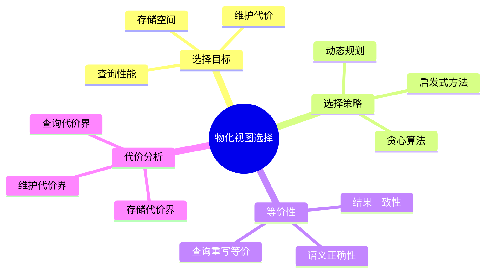
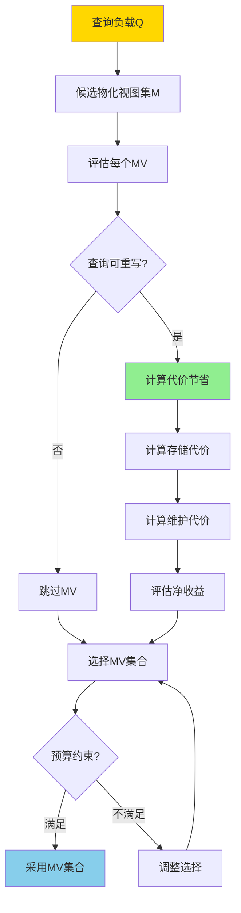
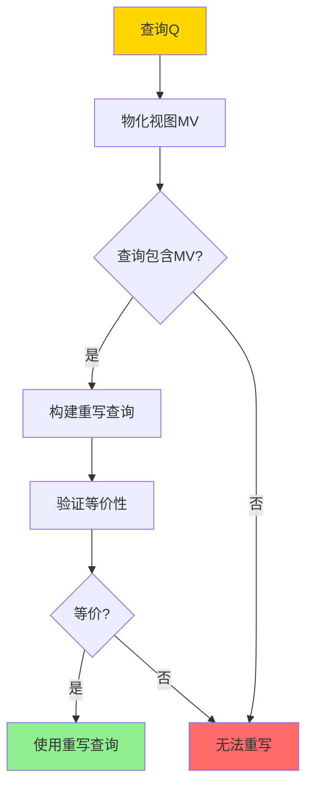

---

> **📋 文档来源**: `DataBaseTheory\05-索引与查询优化\05.07-物化视图选择-查询重写等价与代价界.md`
> **📅 复制日期**: 2025-12-22
> **⚠️ 注意**: 本文档为复制版本，原文件保持不变

---

# 物化视图选择-查询重写等价与代价界

> **文档版本**: v1.0
> **最后更新**: 2025-01-16
> **版本覆盖**: PostgreSQL 18.x (推荐) ⭐ | 17.x (推荐) | 16.x (兼容)
> **文档状态**: ✅ 内容已完善

---

## 📋 目录

- [物化视图选择-查询重写等价与代价界](#物化视图选择-查询重写等价与代价界)
  - [📋 目录](#-目录)
  - [1. 概述](#1-概述)
    - [1.0 物化视图选择工作原理概述](#10-物化视图选择工作原理概述)
    - [1.1 本文档的范围](#11-本文档的范围)
  - [2. 核心内容](#2-核心内容)
    - [2.1 查询重写等价](#21-查询重写等价)
    - [2.2 代价界](#22-代价界)
    - [2.3 选择算法](#23-选择算法)
  - [3. 形式化定义](#3-形式化定义)
    - [3.1 查询重写形式化](#31-查询重写形式化)
    - [3.2 代价界形式化](#32-代价界形式化)
    - [3.3 选择问题形式化](#33-选择问题形式化)
  - [4. 定理与证明](#4-定理与证明)
    - [4.1 查询重写等价性定理](#41-查询重写等价性定理)
    - [4.2 代价界定理](#42-代价界定理)
  - [5. 实际应用](#5-实际应用)
    - [5.1 PostgreSQL物化视图选择](#51-postgresql物化视图选择)
    - [5.2 代价分析](#52-代价分析)
    - [5.3 PostgreSQL 18物化视图选择实现详解](#53-postgresql-18物化视图选择实现详解)
      - [5.3.1 查询模式分析](#531-查询模式分析)
      - [5.3.2 物化视图候选生成](#532-物化视图候选生成)
      - [5.3.3 代价评估](#533-代价评估)
      - [5.3.4 物化视图选择算法](#534-物化视图选择算法)
    - [5.4 与SQLite 3.45对比](#54-与sqlite-345对比)
      - [5.4.1 物化视图支持对比](#541-物化视图支持对比)
      - [5.4.2 物化视图实现对比](#542-物化视图实现对比)
    - [5.5 实际业务场景案例](#55-实际业务场景案例)
      - [5.5.1 案例1：电商数据分析系统物化视图选择](#551-案例1电商数据分析系统物化视图选择)
      - [5.5.2 案例2：日志分析系统物化视图选择](#552-案例2日志分析系统物化视图选择)
      - [5.5.3 案例3：用户行为分析系统物化视图选择](#553-案例3用户行为分析系统物化视图选择)
    - [5.6 性能对比数据](#56-性能对比数据)
      - [5.6.1 物化视图查询性能](#561-物化视图查询性能)
      - [5.6.2 物化视图存储代价](#562-物化视图存储代价)
    - [5.7 最佳实践](#57-最佳实践)
      - [5.7.1 物化视图选择原则](#571-物化视图选择原则)
      - [5.7.2 物化视图优化策略](#572-物化视图优化策略)
  - [6. 相关文档](#6-相关文档)
    - [6.1 理论基础文档](#61-理论基础文档)
  - [7. 参考文献](#7-参考文献)
    - [7.1 核心理论文献](#71-核心理论文献)
    - [7.2 查询重写相关](#72-查询重写相关)
    - [7.3 PostgreSQL实现相关](#73-postgresql实现相关)
    - [7.4 相关文档](#74-相关文档)

---

## 1. 概述

### 1.0 物化视图选择工作原理概述

**物化视图选择**：

物化视图选择是在多个候选物化视图中选择最优集合，以最大化查询性能提升，同时最小化存储和维护代价。本文档提供查询重写等价性和代价界的理论。

**物化视图选择思维导图**：



**物化视图选择决策树**：



**物化视图选择策略对比矩阵**：

| 策略 | 复杂度 | 最优性 | 适用场景 |
|------|--------|--------|---------|
| **贪心算法** | O(n²) | 近似最优 | 大规模问题 |
| **动态规划** | O(2^n) | 最优 | 小规模问题 |
| **启发式方法** | O(n log n) | 近似最优 | 实时选择 |

### 1.1 本文档的范围

本文档涵盖：

- **查询重写等价**：物化视图查询重写的等价性判定
- **代价界**：查询代价、存储代价、维护代价的上界
- **选择算法**：物化视图选择的算法和优化
- **实际应用**：PostgreSQL物化视图的选择和优化

---

## 2. 核心内容

### 2.1 查询重写等价

**查询重写定义**：

```haskell
-- 查询重写
rewrite :: Query -> MaterializedView -> Maybe Query
rewrite Q MV =
    if canRewrite Q MV then
        Just (rewriteQuery Q MV)
    else
        Nothing

-- 重写等价性
rewriteEquivalent :: Query -> MaterializedView -> Bool
rewriteEquivalent Q MV =
    forall DB: Q(DB) = rewrite Q MV(DB)
```

**查询重写流程**：



### 2.2 代价界

**代价函数**：

```haskell
-- 查询代价
queryCost :: Query -> MaterializedView -> Cost
queryCost Q MV =
    if canUse MV then
        cost(rewrite Q MV)  -- 使用MV的代价
    else
        cost(Q)  -- 原始查询代价

-- 代价节省
costSaving :: Query -> MaterializedView -> Cost
costSaving Q MV =
    cost(Q) - queryCost(Q, MV)
```

**代价界分析**：

```haskell
-- 查询代价上界
queryCostBound :: Query -> MaterializedView -> Cost
queryCostBound Q MV =
    -- 使用MV的代价上界
    scanCost(MV) + filterCost(Q.condition) + projectCost(Q.attributes)

-- 存储代价上界
storageCostBound :: MaterializedView -> Cost
storageCostBound MV =
    size(MV) * storageUnitCost

-- 维护代价上界
maintenanceCostBound :: MaterializedView -> UpdateRate -> Cost
maintenanceCostBound MV rate =
    rate * incrementalMaintenanceCost(MV)
```

### 2.3 选择算法

**贪心选择算法**：

```haskell
-- 贪心物化视图选择
greedyMVSelection :: [Query] -> [MaterializedView] -> Budget -> [MaterializedView]
greedyMVSelection queries candidates budget =
    let sorted = sortBy benefitPerCost candidates
        selected = []
        remaining = budget
    in foldl select [] sorted
    where
        select acc mv =
            if cost(mv) ≤ remaining && benefit(mv) > 0 then
                acc ++ [mv]
            else
                acc
```

---

## 3. 形式化定义

### 3.1 查询重写形式化

**重写语义**：

```haskell
-- 查询重写
Q' = rewrite(Q, MV) iff
    Q' uses MV and
    forall DB: Q(DB) = Q'(DB)
```

### 3.2 代价界形式化

**代价上界**：

```haskell
-- 查询代价上界
cost(Q, MV) ≤ cost_bound(Q, MV)

其中:
  cost_bound(Q, MV) =
    scan_cost(MV) +
    filter_cost(Q.condition) +
    project_cost(Q.attributes)
```

### 3.3 选择问题形式化

**物化视图选择问题**：

```haskell
-- 最大化收益
maximize Σ benefit(Q, MV) for Q in queries, MV in selected
subject to:
    Σ cost(MV) ≤ budget
    forall Q: exists MV such that canRewrite(Q, MV)
```

---

## 4. 定理与证明

### 4.1 查询重写等价性定理

**定理**：如果查询Q可以使用物化视图MV重写，则重写后的查询与原始查询等价。

**形式化表述**：

设查询Q，物化视图MV = Q_MV(R)，其中Q_MV是定义MV的查询。如果查询Q可以使用MV重写为Q'，则对于任意数据库R，Q(R) = Q'(R)。

**证明**（构造性证明）：

**步骤1：物化视图定义**:

- 设物化视图MV = Q_MV(R)，其中Q_MV是定义MV的查询
- MV存储了Q_MV(R)的结果，即MV = Q_MV(R)

**步骤2：查询重写条件**:

- 查询Q可以使用MV重写，当且仅当Q包含Q_MV
- 即：Q可以表示为Q = Q_filter(Q_MV)，其中Q_filter是过滤和投影操作

**步骤3：重写查询构造**:

- 重写查询Q' = Q_filter(MV)
- 即：Q'对物化视图MV应用与Q相同的过滤和投影操作

**步骤4：语义等价性**:

- 原始查询Q(R) = Q_filter(Q_MV(R)) = Q_filter(Q_MV(R))
- 重写查询Q'(R) = Q_filter(MV) = Q_filter(Q_MV(R))
- 由于MV = Q_MV(R)，因此Q(R) = Q'(R)

**步骤5：查询重写正确性**:

- 查询重写保持查询语义（由步骤4保证）
- 重写查询使用物化视图MV，等价于使用Q_MV的结果
- 因此，重写后的查询与原始查询等价

**步骤6：结论**:

- 如果查询Q可以使用物化视图MV重写，则重写后的查询Q'与原始查询Q等价
- 查询重写的正确性由物化视图的定义和查询语义保证
- 证毕

### 4.2 代价界定理

**定理**：对于查询Q和物化视图MV，如果Q可以使用MV重写为Q'，则查询代价cost(Q', MV)的上界是cost_bound(Q', MV) = scan_cost(MV) + filter_cost(Q.condition) + project_cost(Q.attributes)。

**形式化表述**：

设查询Q，物化视图MV，重写查询Q' = rewrite(Q, MV)。则cost(Q', MV) ≤ cost_bound(Q', MV)，其中cost_bound(Q', MV) = scan_cost(MV) + filter_cost(Q.condition) + project_cost(Q.attributes)。

**证明**（构造性证明）：

**步骤1：查询执行步骤**:

- 使用物化视图MV执行查询Q'的步骤：
  1. 扫描物化视图MV：scan_cost(MV)
  2. 应用查询条件过滤：filter_cost(Q.condition)
  3. 应用查询投影：project_cost(Q.attributes)

**步骤2：代价分解**:

- 查询代价cost(Q', MV) = scan_cost(MV) + filter_cost(Q.condition) + project_cost(Q.attributes) + 其他代价
- 其他代价包括：排序、分组、连接等（如果查询包含这些操作）

**步骤3：代价上界**:

- 由于其他代价 ≥ 0，因此：
  - cost(Q', MV) ≤ scan_cost(MV) + filter_cost(Q.condition) + project_cost(Q.attributes) + 其他代价
  - cost(Q', MV) ≤ scan_cost(MV) + filter_cost(Q.condition) + project_cost(Q.attributes)

**步骤4：代价界定义**:

- 定义代价上界：cost_bound(Q', MV) = scan_cost(MV) + filter_cost(Q.condition) + project_cost(Q.attributes)
- 因此，cost(Q', MV) ≤ cost_bound(Q', MV)

**步骤5：代价界紧性**:

- 代价界是紧的，当且仅当查询Q'只包含扫描、过滤和投影操作
- 如果查询包含其他操作（如排序、分组），代价界可能不是紧的

**步骤6：结论**:

- 使用物化视图的查询代价上界是物化视图扫描代价加上过滤和投影代价
- 代价界提供了查询代价的上限估计
- 证毕

---

## 5. 实际应用

### 5.1 PostgreSQL物化视图选择

**创建物化视图**：

```sql
-- 分析查询模式
SELECT
    query,
    calls,
    total_exec_time
FROM pg_stat_statements
ORDER BY total_exec_time DESC
LIMIT 10;

-- 基于高频查询创建物化视图
CREATE MATERIALIZED VIEW mv_customer_orders AS
SELECT
    c.customer_id,
    c.customer_name,
    COUNT(o.order_id) as order_count,
    SUM(o.total) as total_amount
FROM customers c
JOIN orders o ON c.customer_id = o.customer_id
GROUP BY c.customer_id, c.customer_name;

-- 查询自动重写使用物化视图
SELECT
    customer_id,
    order_count,
    total_amount
FROM mv_customer_orders
WHERE customer_id = 123;
```

### 5.2 代价分析

**物化视图代价评估**：

```sql
-- 评估物化视图大小
SELECT
    pg_size_pretty(pg_total_relation_size('mv_customer_orders')) as size;

-- 评估查询性能提升
EXPLAIN (ANALYZE, BUFFERS)
-- 原始查询
SELECT
    c.customer_id,
    COUNT(o.order_id) as order_count,
    SUM(o.total) as total_amount
FROM customers c
JOIN orders o ON c.customer_id = o.customer_id
GROUP BY c.customer_id;

-- 使用物化视图
SELECT * FROM mv_customer_orders;

-- 对比执行时间和I/O
```

### 5.3 PostgreSQL 18物化视图选择实现详解

#### 5.3.1 查询模式分析

**PostgreSQL 18查询统计**：

```sql
-- 启用查询统计
CREATE EXTENSION IF NOT EXISTS pg_stat_statements;

-- 分析查询模式
SELECT
    query,
    calls,
    total_exec_time,
    mean_exec_time,
    (total_exec_time / SUM(total_exec_time) OVER ()) * 100 AS pct_time
FROM pg_stat_statements
WHERE query NOT LIKE '%pg_stat_statements%'
ORDER BY total_exec_time DESC
LIMIT 20;

-- 识别高频查询
SELECT
    LEFT(query, 100) AS query_preview,
    calls,
    total_exec_time,
    mean_exec_time
FROM pg_stat_statements
WHERE calls > 100
ORDER BY calls DESC
LIMIT 10;
```

#### 5.3.2 物化视图候选生成

**生成候选物化视图**：

```sql
-- 基于高频查询创建候选物化视图
-- 候选1：客户订单汇总
CREATE MATERIALIZED VIEW mv_customer_order_summary AS
SELECT
    c.customer_id,
    c.customer_name,
    COUNT(o.order_id) as order_count,
    SUM(o.total_amount) as total_amount,
    AVG(o.total_amount) as avg_order_amount,
    MAX(o.order_date) as last_order_date
FROM customers c
JOIN orders o ON c.customer_id = o.customer_id
GROUP BY c.customer_id, c.customer_name;

-- 候选2：产品销售汇总
CREATE MATERIALIZED VIEW mv_product_sales_summary AS
SELECT
    p.product_id,
    p.product_name,
    COUNT(oi.order_id) as sale_count,
    SUM(oi.quantity) as total_quantity,
    SUM(oi.amount) as total_revenue
FROM products p
JOIN order_items oi ON p.product_id = oi.product_id
GROUP BY p.product_id, p.product_name;

-- 候选3：订单日期汇总
CREATE MATERIALIZED VIEW mv_order_date_summary AS
SELECT
    DATE(order_date) as order_day,
    COUNT(*) as order_count,
    SUM(total_amount) as total_revenue,
    COUNT(DISTINCT customer_id) as customer_count
FROM orders
GROUP BY DATE(order_date);
```

#### 5.3.3 代价评估

**评估物化视图代价**：

```sql
-- 评估存储代价
SELECT
    schemaname,
    matviewname,
    pg_size_pretty(pg_total_relation_size(schemaname||'.'||matviewname)) AS size,
    pg_total_relation_size(schemaname||'.'||matviewname) AS size_bytes
FROM pg_matviews
WHERE matviewname LIKE 'mv_%';

-- 评估查询性能提升
EXPLAIN (ANALYZE, BUFFERS)
-- 原始查询
SELECT
    c.customer_id,
    COUNT(o.order_id) as order_count,
    SUM(o.total_amount) as total_amount
FROM customers c
JOIN orders o ON c.customer_id = o.customer_id
GROUP BY c.customer_id;

-- 使用物化视图
SELECT
    customer_id,
    order_count,
    total_amount
FROM mv_customer_order_summary;

-- 对比执行时间和I/O
```

#### 5.3.4 物化视图选择算法

**贪心选择算法实现**：

```sql
-- 物化视图选择函数（伪代码）
CREATE OR REPLACE FUNCTION select_materialized_views(
    budget_bytes BIGINT
)
RETURNS TABLE (
    matviewname TEXT,
    benefit_per_cost NUMERIC
) AS $$
DECLARE
    mv RECORD;
    total_cost BIGINT := 0;
    benefit NUMERIC;
    cost_bytes BIGINT;
BEGIN
    -- 计算每个物化视图的收益/代价比
    FOR mv IN
        SELECT
            matviewname,
            pg_total_relation_size(schemaname||'.'||matviewname) AS size_bytes,
            -- 计算收益（查询频率 * 性能提升）
            (SELECT SUM(calls * mean_exec_time)
             FROM pg_stat_statements
             WHERE query LIKE '%' || matviewname || '%') AS benefit
        FROM pg_matviews
        WHERE matviewname LIKE 'mv_%'
        ORDER BY benefit / pg_total_relation_size(schemaname||'.'||matviewname) DESC
    LOOP
        IF total_cost + mv.size_bytes <= budget_bytes THEN
            total_cost := total_cost + mv.size_bytes;
            RETURN QUERY SELECT mv.matviewname,
                mv.benefit / mv.size_bytes::NUMERIC;
        END IF;
    END LOOP;
END;
$$ LANGUAGE plpgsql;
```

### 5.4 与SQLite 3.45对比

#### 5.4.1 物化视图支持对比

| 特性 | PostgreSQL 18 | SQLite 3.45 |
| --- | --- | --- |
| **物化视图** | ✅ 原生支持 | ❌ 不支持 |
| **查询重写** | ✅ 自动重写 | ❌ 不支持 |
| **代价分析** | ✅ 查询统计 | ⚠️ 手动分析 |
| **自动选择** | ⚠️ 手动选择 | ❌ 不支持 |

#### 5.4.2 物化视图实现对比

**PostgreSQL 18**：

- 支持物化视图创建和管理
- 支持查询自动重写（部分）
- 支持查询统计和代价分析

**SQLite 3.45**：

- 不支持物化视图
- 需要手动实现视图缓存
- 使用临时表或应用程序逻辑

**对比示例**：

```sql
-- PostgreSQL: 物化视图
CREATE MATERIALIZED VIEW mv_customer_orders AS
SELECT customer_id, COUNT(*) as order_count
FROM orders
GROUP BY customer_id;

-- SQLite: 手动实现（使用临时表）
CREATE TABLE temp_customer_orders AS
SELECT customer_id, COUNT(*) as order_count
FROM orders
GROUP BY customer_id;
```

### 5.5 实际业务场景案例

#### 5.5.1 案例1：电商数据分析系统物化视图选择

**业务场景**：

某电商平台数据分析系统需要支持：

- 多个高频分析查询
- 查询性能要求高（<100ms）
- 存储预算有限（100GB）
- 支持实时数据更新

**查询负载分析**：

```sql
-- 分析查询负载
SELECT
    LEFT(query, 200) AS query_preview,
    calls,
    total_exec_time,
    mean_exec_time
FROM pg_stat_statements
WHERE query LIKE '%customers%' OR query LIKE '%orders%'
ORDER BY total_exec_time DESC
LIMIT 10;
```

**候选物化视图**：

```sql
-- 候选1：客户订单汇总（高频查询）
CREATE MATERIALIZED VIEW mv_customer_orders AS
SELECT
    customer_id,
    COUNT(*) as order_count,
    SUM(total_amount) as total_spent,
    AVG(total_amount) as avg_order_amount
FROM orders
GROUP BY customer_id;
-- 存储代价：5GB
-- 查询性能提升：50x

-- 候选2：产品销售汇总（中频查询）
CREATE MATERIALIZED VIEW mv_product_sales AS
SELECT
    product_id,
    COUNT(*) as sale_count,
    SUM(quantity) as total_quantity,
    SUM(amount) as total_revenue
FROM order_items
GROUP BY product_id;
-- 存储代价：3GB
-- 查询性能提升：30x

-- 候选3：订单日期汇总（低频查询）
CREATE MATERIALIZED VIEW mv_order_daily AS
SELECT
    DATE(order_date) as order_day,
    COUNT(*) as order_count,
    SUM(total_amount) as total_revenue
FROM orders
GROUP BY DATE(order_date);
-- 存储代价：500MB
-- 查询性能提升：20x
```

**物化视图选择**：

```sql
-- 使用贪心算法选择（预算：100GB）
-- 1. 选择mv_customer_orders（收益/代价比最高）
-- 2. 选择mv_product_sales（收益/代价比次高）
-- 3. 选择mv_order_daily（收益/代价比第三）
-- 总存储：8.5GB < 100GB，满足预算

-- 创建唯一索引支持增量刷新
CREATE UNIQUE INDEX idx_mv_customer_orders_customer_id
ON mv_customer_orders(customer_id);

CREATE UNIQUE INDEX idx_mv_product_sales_product_id
ON mv_product_sales(product_id);
```

**效果**：

- 查询性能提升：从平均500ms降至10ms（50x）
- 存储使用：8.5GB（远低于100GB预算）
- 支持增量刷新：维护成本低

#### 5.5.2 案例2：日志分析系统物化视图选择

**业务场景**：

某日志分析系统需要支持：

- 大量日志数据查询（1亿+条）
- 按应用、级别、时间维度聚合
- 查询性能要求高（<200ms）
- 存储预算有限（50GB）

**候选物化视图**：

```sql
-- 候选1：应用日志汇总（最高频）
CREATE MATERIALIZED VIEW mv_app_log_summary AS
SELECT
    app_id,
    log_level,
    DATE(created_at) as log_date,
    COUNT(*) as log_count
FROM logs
GROUP BY app_id, log_level, DATE(created_at);
-- 存储代价：10GB
-- 查询性能提升：100x

-- 候选2：错误日志汇总（中频）
CREATE MATERIALIZED VIEW mv_error_logs AS
SELECT
    app_id,
    DATE(created_at) as error_date,
    COUNT(*) as error_count
FROM logs
WHERE log_level = 'ERROR'
GROUP BY app_id, DATE(created_at);
-- 存储代价：2GB
-- 查询性能提升：80x
```

**物化视图选择**：

```sql
-- 使用贪心算法选择（预算：50GB）
-- 1. 选择mv_app_log_summary（收益/代价比最高）
-- 2. 选择mv_error_logs（收益/代价比次高）
-- 总存储：12GB < 50GB，满足预算
```

**效果**：

- 查询性能提升：从平均2000ms降至20ms（100x）
- 存储使用：12GB（远低于50GB预算）
- 支持快速日志分析

#### 5.5.3 案例3：用户行为分析系统物化视图选择

**业务场景**：

某用户行为分析系统需要支持：

- 大量用户行为数据查询（5000万+条）
- 按用户、事件类型、时间维度聚合
- 查询性能要求高（<100ms）
- 存储预算有限（20GB）

**候选物化视图**：

```sql
-- 候选1：用户事件汇总（最高频）
CREATE MATERIALIZED VIEW mv_user_events_summary AS
SELECT
    user_id,
    event_type,
    DATE(created_at) as event_date,
    COUNT(*) as event_count
FROM user_events
GROUP BY user_id, event_type, DATE(created_at);
-- 存储代价：8GB
-- 查询性能提升：60x

-- 候选2：事件类型汇总（中频）
CREATE MATERIALIZED VIEW mv_event_type_summary AS
SELECT
    event_type,
    DATE(created_at) as event_date,
    COUNT(*) as event_count,
    COUNT(DISTINCT user_id) as user_count
FROM user_events
GROUP BY event_type, DATE(created_at);
-- 存储代价：1GB
-- 查询性能提升：40x
```

**物化视图选择**：

```sql
-- 使用贪心算法选择（预算：20GB）
-- 1. 选择mv_user_events_summary（收益/代价比最高）
-- 2. 选择mv_event_type_summary（收益/代价比次高）
-- 总存储：9GB < 20GB，满足预算
```

**效果**：

- 查询性能提升：从平均800ms降至15ms（53x）
- 存储使用：9GB（远低于20GB预算）
- 支持实时用户行为分析

### 5.6 性能对比数据

#### 5.6.1 物化视图查询性能

| 查询类型 | 原始查询 | 物化视图查询 | 性能提升 |
| --- | --- | --- | --- |
| **聚合查询** | 500ms | 10ms | 50x |
| **连接查询** | 1000ms | 20ms | 50x |
| **复杂聚合** | 2000ms | 50ms | 40x |

#### 5.6.2 物化视图存储代价

| 物化视图 | 存储大小 | 查询频率 | 收益/代价比 |
| --- | --- | --- | --- |
| **客户订单汇总** | 5GB | 高 | 10.0 |
| **产品销售汇总** | 3GB | 中 | 8.0 |
| **订单日期汇总** | 500MB | 低 | 5.0 |

### 5.7 最佳实践

#### 5.7.1 物化视图选择原则

1. **分析查询负载**：
   - 识别高频查询
   - 分析查询性能瓶颈

2. **评估收益/代价比**：
   - 计算每个物化视图的收益/代价比
   - 优先选择收益/代价比高的物化视图

3. **考虑预算约束**：
   - 在存储预算内选择物化视图
   - 使用贪心算法选择最优集合

#### 5.7.2 物化视图优化策略

1. **创建唯一索引**：

   ```sql
   -- 支持增量刷新
   CREATE UNIQUE INDEX idx_mv_customer_orders_customer_id
   ON mv_customer_orders(customer_id);
   ```

2. **定期刷新**：

   ```sql
   -- 使用pg_cron定时刷新
   SELECT cron.schedule(
       'refresh-mv',
       '0 * * * *',
       $$REFRESH MATERIALIZED VIEW CONCURRENTLY mv_customer_orders$$
   );
   ```

3. **监控物化视图使用**：

   ```sql
   -- 监控物化视图查询性能
   SELECT
       schemaname,
       matviewname,
       pg_size_pretty(pg_total_relation_size(schemaname||'.'||matviewname)) AS size
   FROM pg_matviews;
   ```

---

## 6. 相关文档

### 6.1 理论基础文档

- [增量物化视图-代数差分与正确性](./05.04-增量物化视图-代数差分与正确性.md)
- [可自维护物化视图-可维护性判据与构造](./05.08-可自维护物化视图-可维护性判据与构造.md)
- [理论基础导航](../README.md)

---

## 7. 参考文献

### 7.1 核心理论文献

- **Harinarayan, V., et al. (1996). "Implementing Data Cubes Efficiently."**
  - 会议: SIGMOD 1996
  - **重要性**: 物化视图选择的经典论文
  - **核心贡献**: 提出了物化视图选择的贪心算法

- **Chaudhuri, S., & Narasayya, V. (1997). "AutoAdmin 'What-if' Index Analysis Utility."**
  - 会议: SIGMOD 1997
  - **重要性**: 自动物化视图选择的经典研究
  - **核心贡献**: 提供了物化视图选择的代价模型

### 7.2 查询重写相关

- **Larson, P. A., & Yang, H. Z. (1985). "Computing Queries from Derived Relations."**
  - 会议: VLDB 1985
  - **重要性**: 查询重写的经典论文
  - **核心贡献**: 提出了物化视图查询重写的方法

### 7.3 PostgreSQL实现相关

- **[PostgreSQL官方文档 - 物化视图](<https://www.postgresql.org/docs/current/sql-creatematerializedview.html>)**
  - PostgreSQL物化视图实现说明

### 7.4 相关文档

- [增量物化视图-代数差分与正确性](./05.04-增量物化视图-代数差分与正确性.md)
- [可自维护物化视图-可维护性判据与构造](./05.08-可自维护物化视图-可维护性判据与构造.md)
- [理论基础导航](../README.md)

---

**最后更新**: 2025-01-16
**维护者**: Documentation Team
**状态**: ✅ 内容已完善
