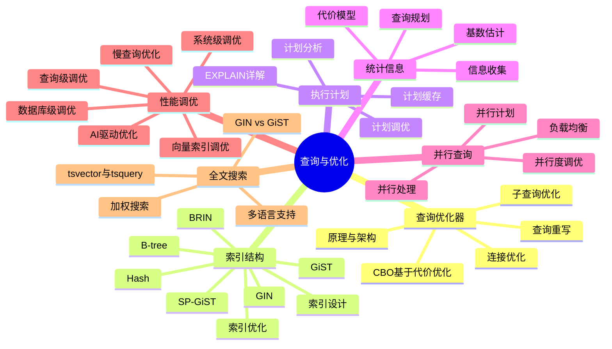
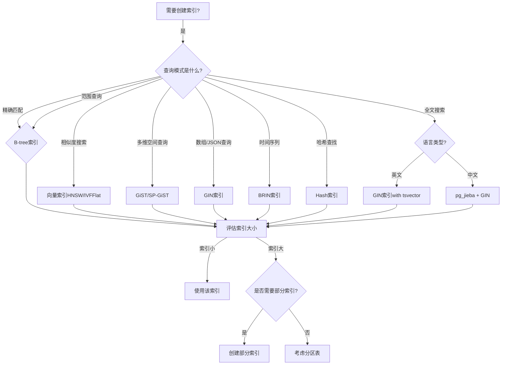

# 02-查询与优化

> **主题**: 查询与优化
> **包含内容**: 查询优化器、索引、执行计划、统计信息、并行查询、性能调优

---

## 📊 知识体系思维导图

---

## 📋 主题说明

本主题整合所有查询处理与优化相关内容，包括：

- 查询优化器原理与实现
- 索引结构与优化策略
- 执行计划分析与调优
- 统计信息与代价模型
- 并行查询处理
- 性能调优实践

---

## 📂 子主题分类

### 02.01-查询优化器

- 查询优化器原理
- CBO（基于代价的优化器）
- 查询重写与优化规则

### 02.02-索引结构

- 索引类型（B-tree、Hash、GIN、GiST、SP-GiST、BRIN）
- 索引设计与优化
- 索引维护策略

### 02.03-执行计划

- EXPLAIN命令详解
- 执行计划分析
- 查询计划缓存

### 02.04-统计信息

- 统计信息收集
- 代价模型
- 查询规划

### 02.05-并行查询

- 并行查询处理
- 并行执行计划
- 并行度调优

### 02.06-性能调优

- 性能调优体系详解
- 系统级调优、数据库级调优、查询级调优
- 慢查询优化完整实战手册
- 性能测试与基准测试
- AI驱动的查询优化器
- 向量索引高级调优
- 参数优化与自适应调整

### 深度应用指南

- **[索引与查询优化深度应用指南.md](./索引与查询优化深度应用指南.md)** ⭐⭐⭐⭐⭐ ⭐ 新增
  - 索引类型对比与选型（B-tree、GIN、GiST、BRIN）
  - 索引优化场景（覆盖索引、部分索引、表达式索引、多列索引）
  - 查询优化场景（JOIN优化、子查询优化、聚合优化、排序优化）
  - 执行计划深度分析
  - 分区表优化场景
  - **字数**: 约35,000字
  - **状态**: ✅ 已完成

### 02.07-全文搜索

- 全文搜索基础（tsvector与tsquery）
- 高级搜索技巧（加权搜索、相关性排序）
- 性能优化（GIN vs GiST索引）
- 多语言支持（中文全文搜索）
- 实战案例（博客搜索、电商搜索、文档管理）

---

## 📚 文档来源

- `PostgreSQL/02-查询处理/`
- `PostgreSQL/03-查询与优化/`
- `PostgreSQL培训/01-SQL基础/查询优化体系详解.md`
- `PostgreSQL培训/11-性能调优/`
- `DataBaseTheory/05-索引与查询优化/`
- `docs/01-PostgreSQL18/` (相关文档)

---

## 🔗 相关主题

- [01-核心基础](../01-核心基础/README.md) - SQL基础
- [12-监控与诊断](../12-监控与诊断/README.md) - 性能诊断
- [21-最佳实践](../21-最佳实践/README.md) - 优化最佳实践

---

## 📊 索引类型选型决策树

---

## 📊 索引类型对比矩阵

| 索引类型 | 适用场景 | 查询性能 | 写入性能 | 存储开销 | PostgreSQL版本 |
|---------|---------|---------|---------|---------|--------------|
| **B-tree** | 精确匹配、范围查询、排序 | ⭐⭐⭐⭐⭐ | ⭐⭐⭐⭐ | 中 | 所有版本 |
| **Hash** | 精确匹配(等值查询) | ⭐⭐⭐⭐⭐ | ⭐⭐⭐⭐ | 中 | 10.0+ |
| **GIN** | 全文搜索、数组查询、JSONB | ⭐⭐⭐⭐ | ⭐⭐ | 大 | 所有版本 |
| **GiST** | 多维数据、范围类型、全文搜索 | ⭐⭐⭐⭐ | ⭐⭐⭐ | 中-大 | 所有版本 |
| **SP-GiST** | 非平衡数据结构 | ⭐⭐⭐⭐ | ⭐⭐⭐ | 中-大 | 9.2+ |
| **BRIN** | 时间序列、有序数据 | ⭐⭐⭐ | ⭐⭐⭐⭐⭐ | 极小 | 9.5+ |
| **HNSW** (pgvector) | 向量相似度搜索 | ⭐⭐⭐⭐⭐ | ⭐⭐ | 大 | pgvector扩展 |
| **IVFFlat** (pgvector) | 大规模向量搜索 | ⭐⭐⭐⭐ | ⭐⭐⭐ | 中-大 | pgvector扩展 |

---

**状态**: ✅ 文档整合完成 | 🔄 持续完善中
**最后更新**: 2025年1月
