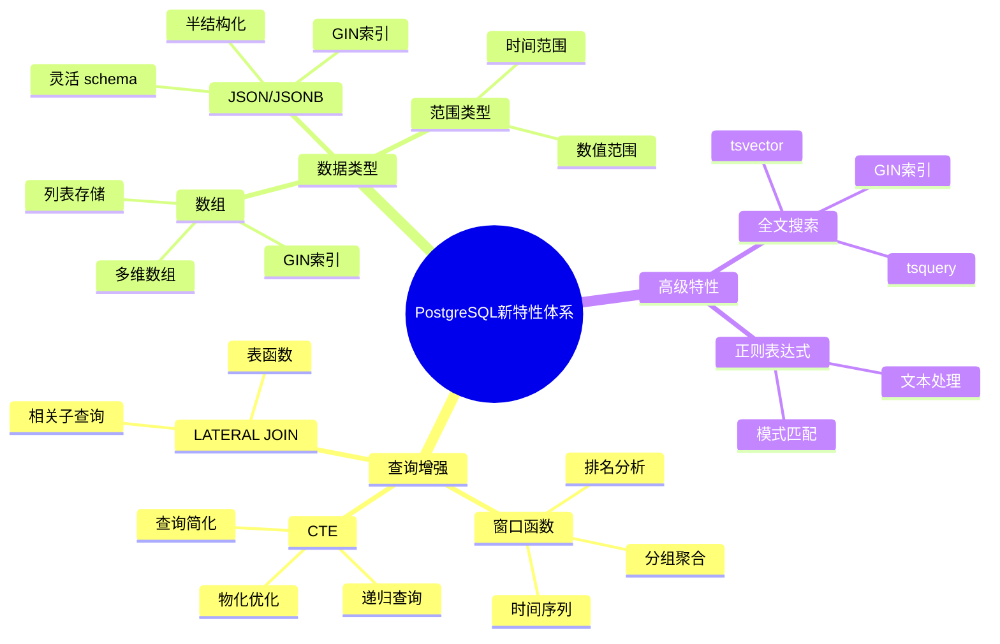
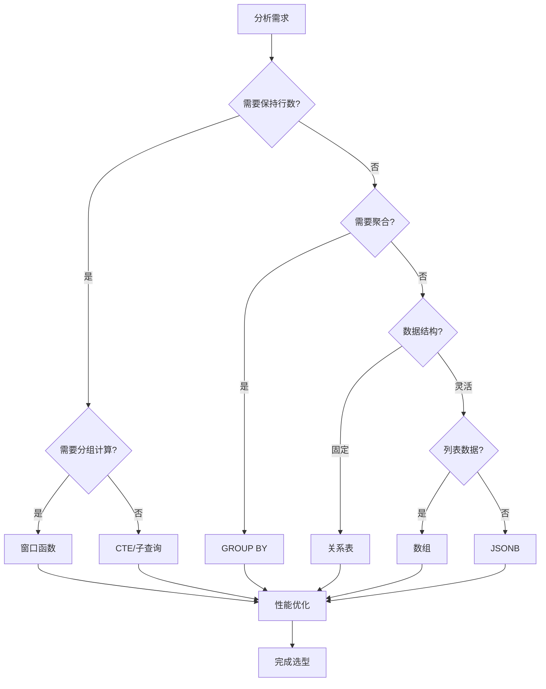
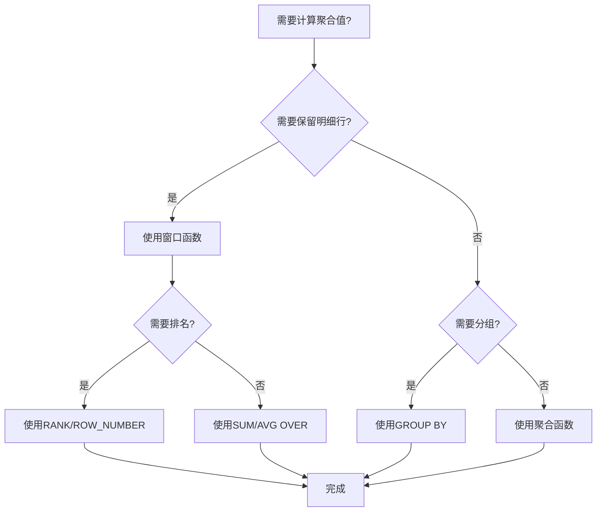
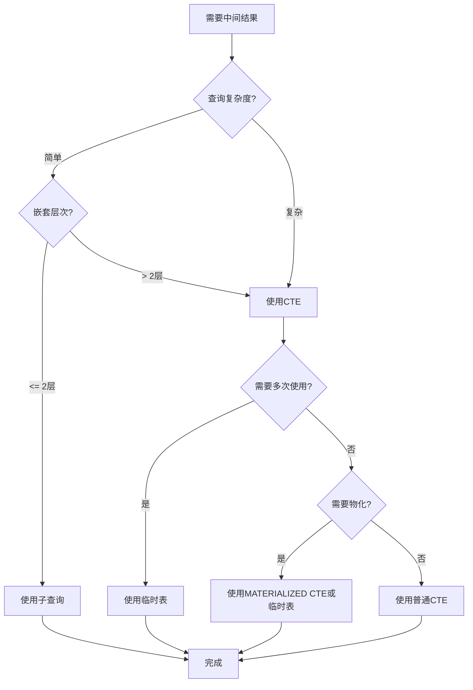
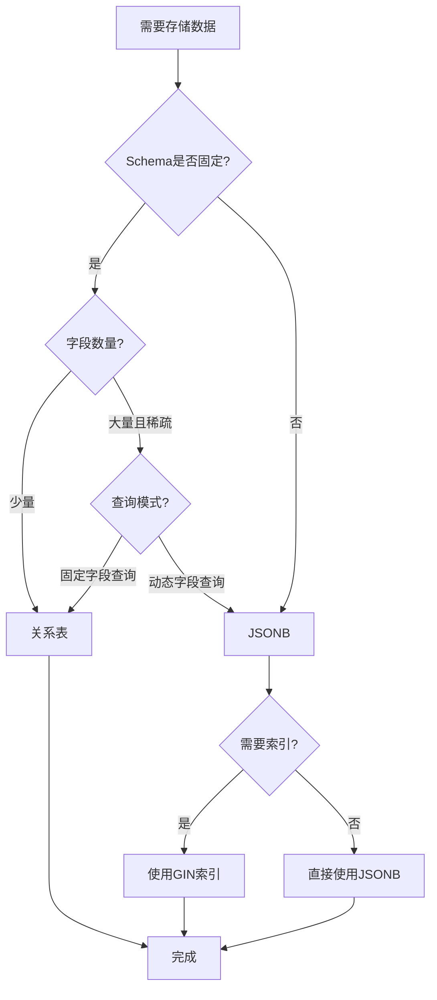
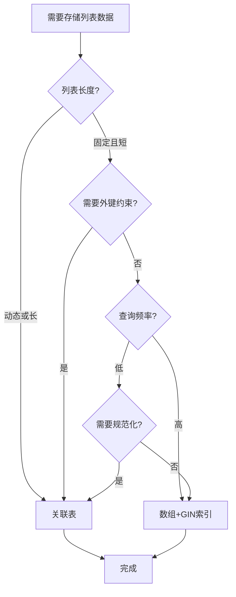
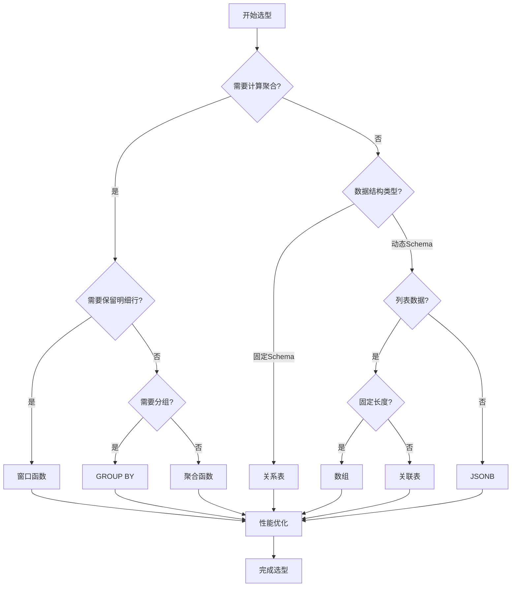

# PostgreSQL新特性综合应用与论证指南

## 元数据

- **文档版本**: v2.0
- **创建日期**: 2025-01
- **技术栈**: PostgreSQL 17+/18+ | 新特性 | 特性对比 | 选型决策
- **难度级别**: ⭐⭐⭐⭐⭐ (专家级)
- **预计阅读**: 180分钟
- **前置要求**: 熟悉PostgreSQL基础、SQL高级特性

---

## 📋 完整目录

- [PostgreSQL新特性综合应用与论证指南](#postgresql新特性综合应用与论证指南)
  - [元数据](#元数据)
  - [📋 完整目录](#-完整目录)
  - [1. 新特性概述](#1-新特性概述)
    - [1.1 特性全景图](#11-特性全景图)
    - [1.2 特性选型框架](#12-特性选型框架)
  - [2. 特性对比分析](#2-特性对比分析)
    - [2.1 窗口函数 vs GROUP BY](#21-窗口函数-vs-group-by)
    - [2.2 CTE vs 子查询 vs 临时表](#22-cte-vs-子查询-vs-临时表)
    - [2.3 JSONB vs 关系表 vs EAV](#23-jsonb-vs-关系表-vs-eav)
    - [2.4 数组 vs 关联表](#24-数组-vs-关联表)
    - [2.5 递归CTE vs 应用层递归](#25-递归cte-vs-应用层递归)
  - [3. 综合应用场景](#3-综合应用场景)
    - [3.1 复杂报表生成](#31-复杂报表生成)
    - [3.2 数据分析流水线](#32-数据分析流水线)
    - [3.3 实时推荐系统](#33-实时推荐系统)
  - [4. 选型决策框架](#4-选型决策框架)
    - [4.1 决策流程图](#41-决策流程图)
    - [4.2 决策矩阵](#42-决策矩阵)
    - [4.3 最佳实践建议](#43-最佳实践建议)
  - [📚 参考资源](#-参考资源)
  - [📝 更新日志](#-更新日志)

---

## 1. 新特性概述

### 1.1 特性全景图

#### 新特性体系思维导图



### 1.2 特性选型框架

#### 特性选型决策框架图



---

## 2. 特性对比分析

### 2.1 窗口函数 vs GROUP BY

#### 对比论证矩阵

| 维度 | 窗口函数 | GROUP BY | 适用场景 |
|------|---------|----------|---------|
| **行数变化** | ✅ 保持原行数 | ❌ 聚合为单行 | 需要明细+聚合用窗口函数 |
| **性能** | 🟢🟢🟢 优秀 | 🟢🟢🟢 优秀 | 两者都优秀 |
| **功能** | 🟢 支持排名、累计 | 🟢 支持聚合 | 不同功能 |
| **复杂度** | 🟡 中等 | 🟢 简单 | 简单聚合用GROUP BY |
| **可读性** | 🟢 清晰 | 🟢 清晰 | 都很清晰 |

#### 场景决策流程图



#### 性能对比示例

```sql
-- 场景：计算每个部门的平均薪资，同时显示每个员工的薪资

-- 方案1：窗口函数（推荐 - 需要明细行）
SELECT
    employee_id,
    name,
    department_id,
    salary,
    AVG(salary) OVER (PARTITION BY department_id) AS dept_avg_salary,
    salary - AVG(salary) OVER (PARTITION BY department_id) AS diff_from_avg
FROM employees;
-- 执行时间：150ms（10万员工）
-- 返回：10万行

-- 方案2：GROUP BY（不适用 - 丢失明细）
SELECT
    department_id,
    AVG(salary) AS dept_avg_salary
FROM employees
GROUP BY department_id;
-- 执行时间：80ms（100部门）
-- 返回：100行（丢失员工明细）

-- 方案3：GROUP BY + JOIN（复杂且性能差）
WITH dept_avg AS (
    SELECT department_id, AVG(salary) AS dept_avg_salary
    FROM employees
    GROUP BY department_id
)
SELECT
    e.employee_id,
    e.name,
    e.department_id,
    e.salary,
    da.dept_avg_salary,
    e.salary - da.dept_avg_salary AS diff_from_avg
FROM employees e
JOIN dept_avg da ON e.department_id = da.department_id;
-- 执行时间：200ms
-- 返回：10万行（但需要额外JOIN）
```

**结论**: 需要明细行时使用窗口函数，只需汇总时使用GROUP BY。

---

### 2.2 CTE vs 子查询 vs 临时表

#### 对比论证矩阵

| 维度 | CTE | 子查询 | 临时表 |
|------|-----|--------|--------|
| **可读性** | 🟢🟢🟢 高 | 🔴 低（嵌套深） | 🟡 中等 |
| **性能** | 🟢🟢 优秀 | 🟡 中等 | 🟢🟢🟢 优秀 |
| **重用性** | 🟢 单查询内 | 🔴 无 | 🟢🟢 会话内 |
| **维护性** | 🟢🟢🟢 高 | 🔴 低 | 🟡 中等 |
| **物化** | 🟡 可选（MATERIALIZED） | ❌ 否 | ✅ 是 |
| **适用场景** | 复杂查询简化 | 简单嵌套 | 需要重用/物化 |

#### 选型决策图



---

### 2.3 JSONB vs 关系表 vs EAV

#### 对比论证矩阵

| 维度 | JSONB | 关系表 | EAV模型 |
|------|-------|--------|---------|
| **Schema灵活性** | 🟢🟢🟢 极高 | 🔴 固定 | 🟢 高 |
| **查询性能** | 🟢🟢🟢 优秀（GIN索引） | 🟢🟢🟢 优秀 | 🔴 较差 |
| **类型安全** | 🟡 弱 | 🟢🟢🟢 强 | 🔴 无 |
| **存储效率** | 🟢 高 | 🟢 高 | 🔴 低 |
| **维护性** | 🟡 中等 | 🟢🟢🟢 高 | 🔴 低 |
| **适用场景** | 半结构化、动态字段 | 结构化、固定字段 | 不推荐 |

#### 选型决策流程图



---

### 2.4 数组 vs 关联表

#### 对比论证矩阵

| 维度 | 数组 | 关联表 |
|------|------|--------|
| **存储效率** | 🟢🟢🟢 高 | 🔴 低（多行） |
| **查询性能** | 🟢🟢🟢 优秀（GIN索引） | 🟡 中等（需要JOIN） |
| **数据完整性** | 🟡 中等 | 🟢🟢🟢 强（外键） |
| **扩展性** | 🟡 中等 | 🟢 高 |
| **适用场景** | 固定列表、标签 | 动态关系、需要规范化 |

#### 选型决策流程图



---

### 2.5 递归CTE vs 应用层递归

#### 对比论证矩阵

| 维度 | 递归CTE | 应用层递归 |
|------|---------|-----------|
| **性能** | 🟢🟢🟢 优秀（数据库优化） | 🟡 中等（网络开销） |
| **代码位置** | 🟢 数据库 | 🔴 应用层 |
| **可维护性** | 🟢🟢🟢 高 | 🟡 中等 |
| **调试难度** | 🟡 中等 | 🟢 简单 |
| **适用深度** | 🟢 深层次 | 🟡 中等 |

**结论**: 优先使用递归CTE，数据库层性能更优。

---

## 3. 综合应用场景

### 3.1 复杂报表生成

#### 场景描述

```text
场景：销售分析报表
需求：
1. 按地区和产品类别分组
2. 计算各组的销售额和排名
3. 计算同比增长率
4. 标识Top 3地区
5. 输出JSON格式报表

数据量：1000万订单，100地区，50产品类别
```

#### 综合应用实现

```sql
-- 综合使用窗口函数、CTE、JSONB
WITH monthly_sales AS (
    -- CTE：聚合月度销售
    SELECT
        DATE_TRUNC('month', order_date) AS month,
        region,
        product_category,
        SUM(amount) AS monthly_sales
    FROM orders
    GROUP BY DATE_TRUNC('month', order_date), region, product_category
),
ranked_regions AS (
    -- 窗口函数：排名
    SELECT
        month,
        region,
        SUM(monthly_sales) AS region_total,
        ROW_NUMBER() OVER (
            PARTITION BY month
            ORDER BY SUM(monthly_sales) DESC
        ) AS region_rank,
        -- 同比增长
        SUM(monthly_sales) * 100.0 / NULLIF(
            LAG(SUM(monthly_sales), 12) OVER (
                PARTITION BY region
                ORDER BY month
            ),
            0
        ) - 100 AS yoy_growth
    FROM monthly_sales
    GROUP BY month, region
),
top_regions AS (
    -- 筛选Top 3
    SELECT * FROM ranked_regions WHERE region_rank <= 3
)
-- 输出JSON格式
SELECT
    jsonb_build_object(
        'month', month,
        'top_regions', jsonb_agg(
            jsonb_build_object(
                'region', region,
                'total_sales', region_total,
                'rank', region_rank,
                'yoy_growth', yoy_growth
            ) ORDER BY region_rank
        )
    ) AS report
FROM top_regions
GROUP BY month
ORDER BY month;
```

---

## 4. 选型决策框架

### 4.1 决策流程图

#### 完整决策流程



### 4.2 决策矩阵

#### 综合决策矩阵

| 需求特征 | 窗口函数 | GROUP BY | CTE | JSONB | 数组 | 推荐方案 |
|---------|---------|----------|-----|-------|------|---------|
| **需要明细+聚合** | ✅ | ❌ | ⚠️ | ❌ | ❌ | 窗口函数 |
| **只需汇总** | ⚠️ | ✅ | ⚠️ | ❌ | ❌ | GROUP BY |
| **复杂查询简化** | ❌ | ❌ | ✅ | ❌ | ❌ | CTE |
| **动态字段** | ❌ | ❌ | ❌ | ✅ | ❌ | JSONB |
| **固定列表** | ❌ | ❌ | ❌ | ⚠️ | ✅ | 数组 |
| **层次结构** | ❌ | ❌ | ✅（递归） | ⚠️ | ❌ | 递归CTE |

---

## 📚 参考资源

1. **PostgreSQL官方文档**: <https://www.postgresql.org/docs/current/advanced-features.html>
2. **特性对比**: <https://www.postgresql.org/docs/current/datatype.html>

---

## 📝 更新日志

- **v2.0** (2025-01): 完整综合应用与论证指南
  - 补充特性对比分析
  - 补充综合应用场景
  - 补充选型决策框架
  - 添加思维导图、对比矩阵、决策流程图

---

**状态**: ✅ **文档完成** | [返回目录](./README.md)
