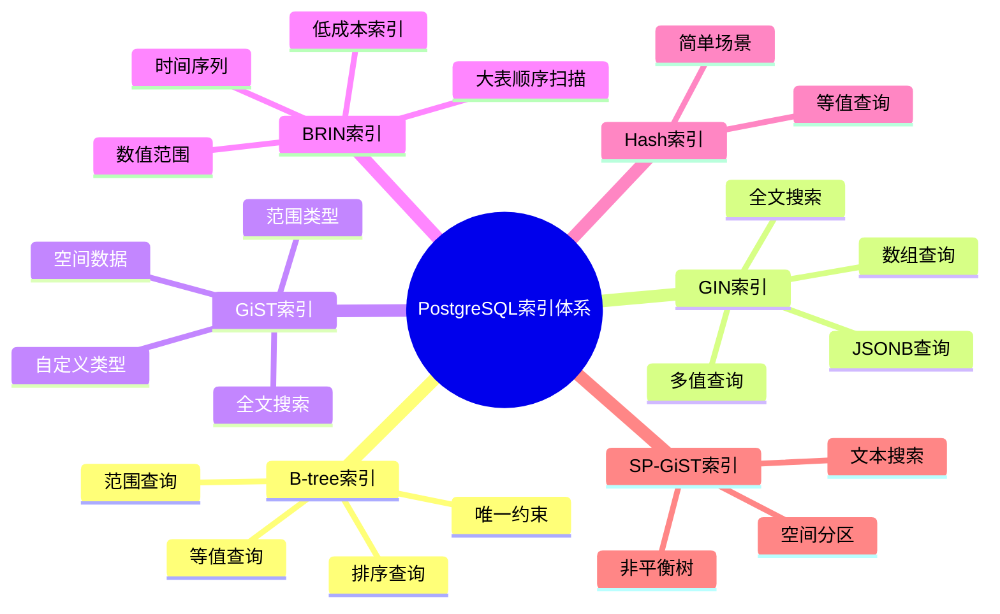
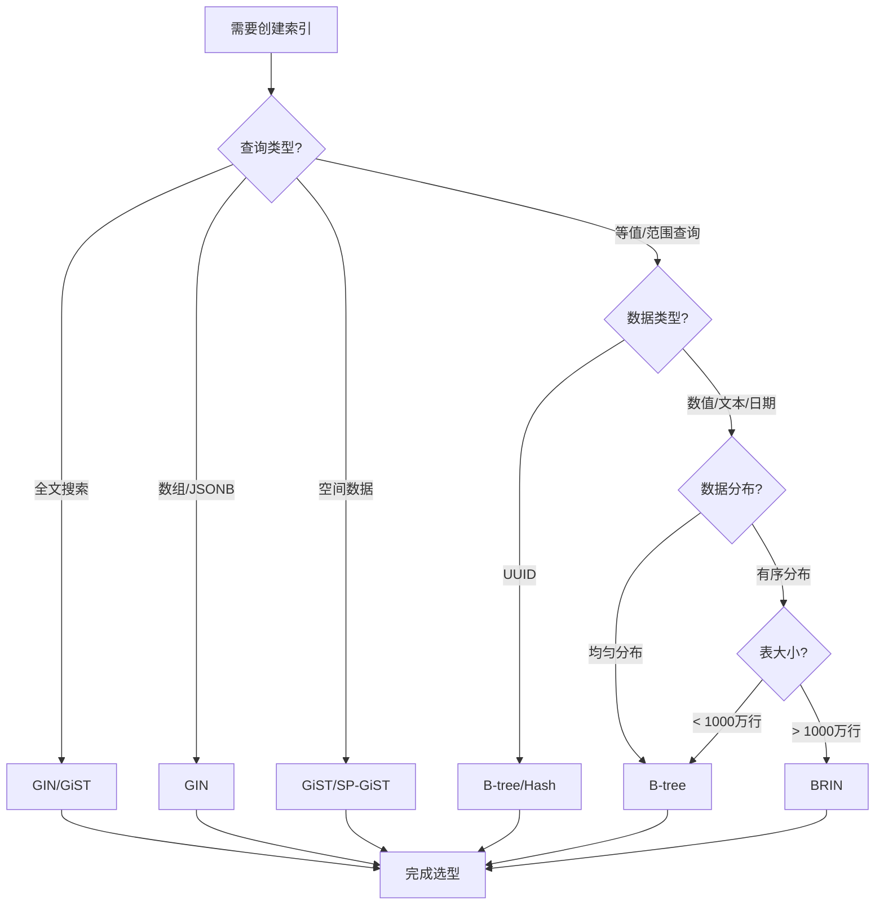
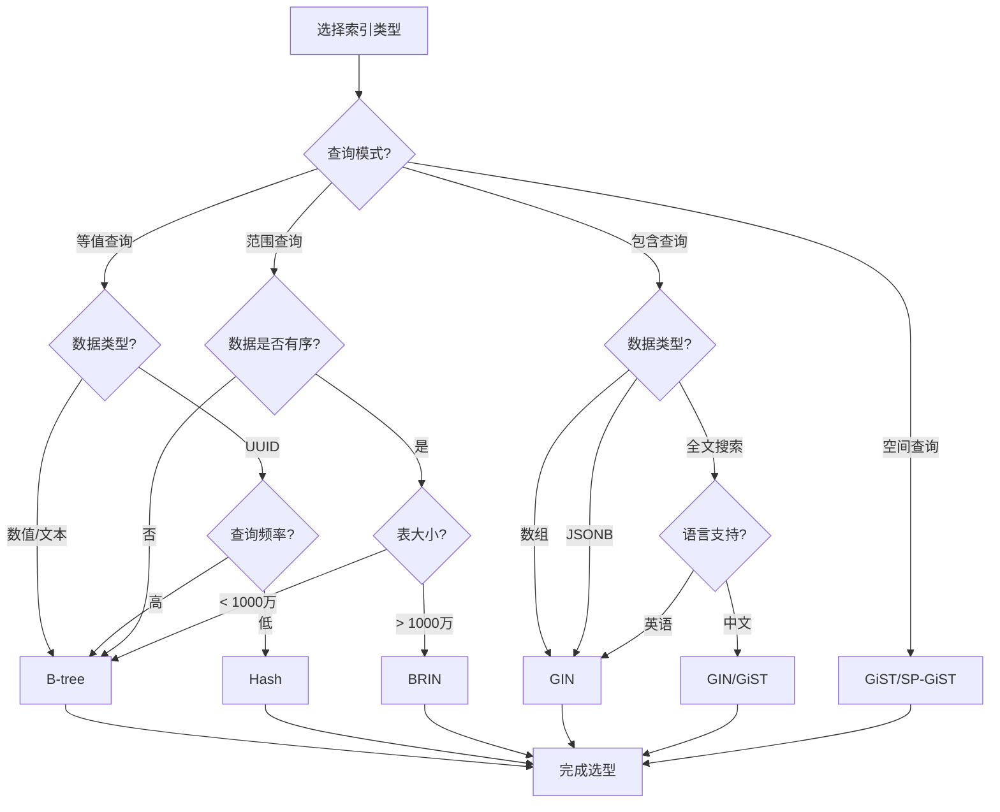
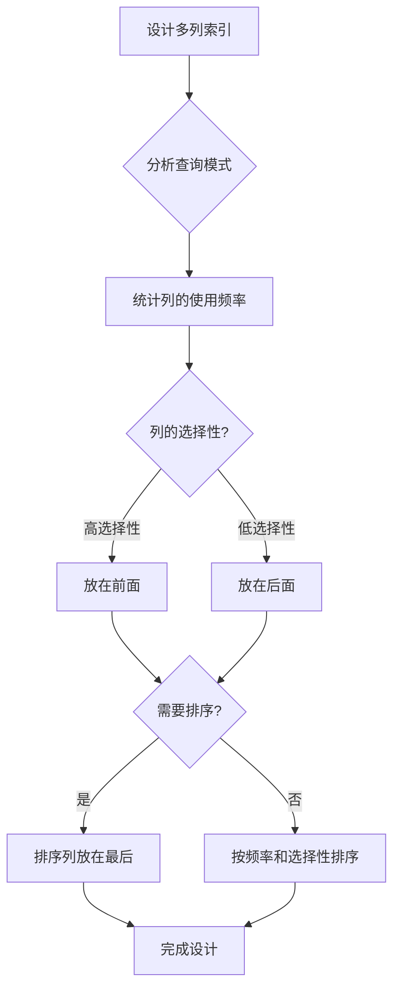
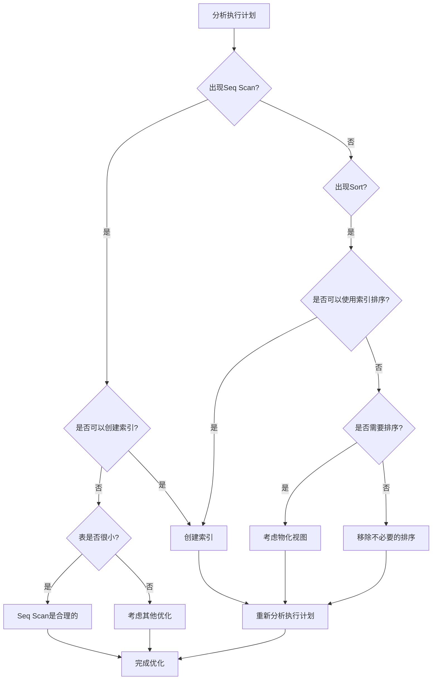
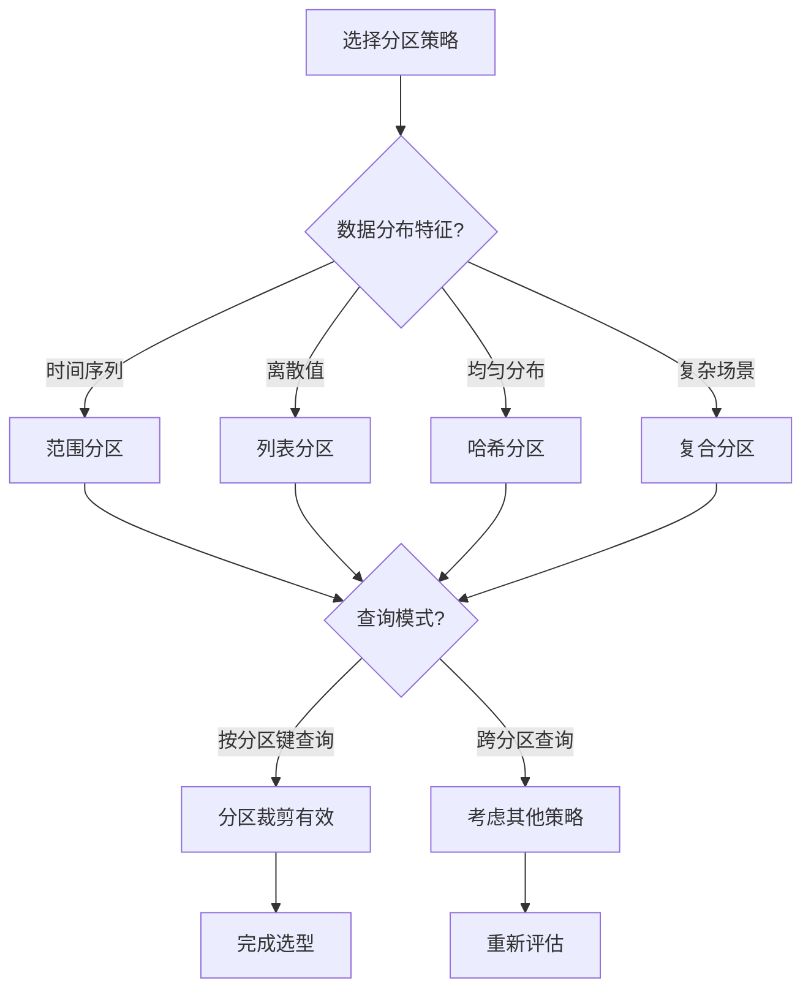

# PostgreSQL索引与查询优化深度应用指南

## 元数据

- **文档版本**: v2.0
- **创建日期**: 2025-01
- **技术栈**: PostgreSQL 17+/18+ | 索引 | 查询优化 | 执行计划
- **难度级别**: ⭐⭐⭐⭐⭐ (专家级)
- **预计阅读**: 200分钟
- **前置要求**: 熟悉PostgreSQL基础、索引基础、查询优化基础

---

## 📋 完整目录

- [PostgreSQL索引与查询优化深度应用指南](#postgresql索引与查询优化深度应用指南)
  - [元数据](#元数据)
  - [📋 完整目录](#-完整目录)
  - [1. 索引优化概述](#1-索引优化概述)
    - [1.1 索引体系](#11-索引体系)
      - [索引类型体系思维导图](#索引类型体系思维导图)
    - [1.2 索引选型框架](#12-索引选型框架)
      - [索引选型决策流程图](#索引选型决策流程图)
  - [2. 索引类型对比与选型](#2-索引类型对比与选型)
    - [2.1 B-tree索引场景分析](#21-b-tree索引场景分析)
      - [场景描述](#场景描述)
      - [B-tree索引实现](#b-tree索引实现)
    - [2.2 GIN索引场景分析](#22-gin索引场景分析)
      - [2.2.1 场景描述](#221-场景描述)
      - [GIN索引实现](#gin索引实现)
    - [2.3 GiST索引场景分析](#23-gist索引场景分析)
      - [2.3.1 场景描述](#231-场景描述)
      - [GiST索引实现](#gist索引实现)
    - [2.4 BRIN索引场景分析](#24-brin索引场景分析)
      - [2.4.1 场景描述](#241-场景描述)
      - [BRIN索引实现](#brin索引实现)
    - [2.5 索引选型决策矩阵](#25-索引选型决策矩阵)
      - [索引类型对比矩阵](#索引类型对比矩阵)
      - [索引选型决策树](#索引选型决策树)
  - [3. 索引优化场景](#3-索引优化场景)
    - [3.1 覆盖索引场景](#31-覆盖索引场景)
      - [3.1.1 场景描述](#311-场景描述)
      - [覆盖索引实现](#覆盖索引实现)
      - [性能对比](#性能对比)
    - [3.2 部分索引场景](#32-部分索引场景)
      - [3.2.1 场景描述](#321-场景描述)
      - [3.2.2 部分索引实现](#322-部分索引实现)
      - [3.2.3 性能对比](#323-性能对比)
    - [3.3 表达式索引场景](#33-表达式索引场景)
      - [3.3.1 场景描述](#331-场景描述)
      - [3.3.2 表达式索引实现](#332-表达式索引实现)
    - [3.4 多列索引场景](#34-多列索引场景)
      - [3.4.1 场景描述](#341-场景描述)
      - [3.4.2 多列索引实现](#342-多列索引实现)
      - [列顺序选择决策](#列顺序选择决策)
  - [4. 查询优化场景](#4-查询优化场景)
    - [4.1 JOIN优化场景](#41-join优化场景)
      - [4.1.1 场景描述](#411-场景描述)
      - [4.1.2 JOIN优化实现](#412-join优化实现)
      - [JOIN类型选择决策](#join类型选择决策)
    - [4.2 子查询优化场景](#42-子查询优化场景)
      - [4.2.1 场景描述](#421-场景描述)
      - [4.2.2 子查询优化实现](#422-子查询优化实现)
    - [4.3 聚合查询优化场景](#43-聚合查询优化场景)
      - [4.3.1 场景描述](#431-场景描述)
      - [聚合查询优化实现](#聚合查询优化实现)
    - [4.4 排序优化场景](#44-排序优化场景)
      - [4.4.1 场景描述](#441-场景描述)
      - [排序优化实现](#排序优化实现)
  - [5. 执行计划深度分析](#5-执行计划深度分析)
    - [5.1 执行计划解读](#51-执行计划解读)
      - [执行计划关键指标](#执行计划关键指标)
      - [执行计划节点类型对比](#执行计划节点类型对比)
    - [5.2 执行计划优化](#52-执行计划优化)
      - [执行计划优化决策流程图](#执行计划优化决策流程图)
  - [6. 分区表优化场景](#6-分区表优化场景)
    - [6.1 分区策略选型](#61-分区策略选型)
      - [分区策略对比矩阵](#分区策略对比矩阵)
      - [分区策略选型决策](#分区策略选型决策)
    - [6.2 分区裁剪优化](#62-分区裁剪优化)
      - [分区裁剪场景](#分区裁剪场景)
  - [7. 综合优化案例](#7-综合优化案例)
    - [7.1 复杂查询优化案例](#71-复杂查询优化案例)
      - [完整优化示例](#完整优化示例)
  - [📚 参考资源](#-参考资源)
  - [📝 更新日志](#-更新日志)

---

## 1. 索引优化概述

### 1.1 索引体系

#### 索引类型体系思维导图



### 1.2 索引选型框架

#### 索引选型决策流程图



---

## 2. 索引类型对比与选型

### 2.1 B-tree索引场景分析

#### 场景描述

```text
场景：等值和范围查询
需求：
1. 主键查询
2. 外键查询
3. 范围查询（>, <, BETWEEN）
4. 排序查询（ORDER BY）
5. 唯一约束

数据特征：
- 数值、文本、日期类型
- 数据分布相对均匀
- 查询频率高
```

#### B-tree索引实现

```sql
-- B-tree索引创建（带错误处理）
DO $$
BEGIN
    BEGIN
        IF NOT EXISTS (SELECT 1 FROM information_schema.tables WHERE table_schema = 'public' AND table_name = 'orders') THEN
            RAISE WARNING '表 orders 不存在，无法创建索引';
            RETURN;
        END IF;

        IF EXISTS (SELECT 1 FROM pg_indexes WHERE tablename = 'orders' AND indexname = 'idx_orders_customer_id') THEN
            RAISE WARNING '索引 idx_orders_customer_id 已存在';
        ELSE
            CREATE INDEX idx_orders_customer_id ON orders(customer_id);
            RAISE NOTICE '索引 idx_orders_customer_id 创建成功';
        END IF;

        IF EXISTS (SELECT 1 FROM pg_indexes WHERE tablename = 'orders' AND indexname = 'idx_orders_order_date') THEN
            RAISE WARNING '索引 idx_orders_order_date 已存在';
        ELSE
            CREATE INDEX idx_orders_order_date ON orders(order_date);
            RAISE NOTICE '索引 idx_orders_order_date 创建成功';
        END IF;

        IF EXISTS (SELECT 1 FROM pg_indexes WHERE tablename = 'orders' AND indexname = 'idx_orders_amount') THEN
            RAISE WARNING '索引 idx_orders_amount 已存在';
        ELSE
            CREATE INDEX idx_orders_amount ON orders(amount);
            RAISE NOTICE '索引 idx_orders_amount 创建成功';
        END IF;
    EXCEPTION
        WHEN undefined_table THEN
            RAISE EXCEPTION '表 orders 不存在';
        WHEN duplicate_table THEN
            RAISE WARNING '部分索引已存在';
        WHEN OTHERS THEN
            RAISE EXCEPTION '创建索引失败: %', SQLERRM;
    END;
END $$;

-- 等值查询（使用索引，带性能测试）
DO $$
BEGIN
    BEGIN
        IF NOT EXISTS (SELECT 1 FROM information_schema.tables WHERE table_schema = 'public' AND table_name = 'orders') THEN
            RAISE WARNING '表 orders 不存在，无法执行查询';
            RETURN;
        END IF;
        RAISE NOTICE '开始执行等值查询性能测试';
    EXCEPTION
        WHEN OTHERS THEN
            RAISE WARNING '查询准备失败: %', SQLERRM;
    END;
END $$;

EXPLAIN (ANALYZE, BUFFERS, TIMING, VERBOSE)
SELECT * FROM orders WHERE customer_id = 12345;
-- Index Scan using idx_orders_customer_id

-- 范围查询（使用索引，带性能测试）
DO $$
BEGIN
    BEGIN
        IF NOT EXISTS (SELECT 1 FROM information_schema.tables WHERE table_schema = 'public' AND table_name = 'orders') THEN
            RAISE WARNING '表 orders 不存在，无法执行查询';
            RETURN;
        END IF;
        RAISE NOTICE '开始执行范围查询性能测试';
    EXCEPTION
        WHEN OTHERS THEN
            RAISE WARNING '查询准备失败: %', SQLERRM;
    END;
END $$;

EXPLAIN (ANALYZE, BUFFERS, TIMING, VERBOSE)
SELECT * FROM orders
WHERE order_date BETWEEN '2025-01-01' AND '2025-01-31';
-- Index Scan using idx_orders_order_date

-- 排序查询（使用索引，带性能测试）
DO $$
BEGIN
    BEGIN
        IF NOT EXISTS (SELECT 1 FROM information_schema.tables WHERE table_schema = 'public' AND table_name = 'orders') THEN
            RAISE WARNING '表 orders 不存在，无法执行查询';
            RETURN;
        END IF;
        RAISE NOTICE '开始执行排序查询性能测试';
    EXCEPTION
        WHEN OTHERS THEN
            RAISE WARNING '查询准备失败: %', SQLERRM;
    END;
END $$;

EXPLAIN (ANALYZE, BUFFERS, TIMING, VERBOSE)
SELECT * FROM orders ORDER BY order_date DESC LIMIT 100;
-- Index Scan Backward using idx_orders_order_date
```

### 2.2 GIN索引场景分析

#### 2.2.1 场景描述

```text
场景：全文搜索、数组、JSONB查询
需求：
1. 全文搜索查询
2. 数组包含查询（@>, &&）
3. JSONB路径查询
4. 多值查询

数据特征：
- 文本内容（tsvector）
- 数组类型（TEXT[], INTEGER[]）
- JSONB类型
- 查询模式：包含、交集
```

#### GIN索引实现

```sql
-- GIN索引：全文搜索（带错误处理）
DO $$
BEGIN
    BEGIN
        IF NOT EXISTS (SELECT 1 FROM information_schema.tables WHERE table_schema = 'public' AND table_name = 'articles') THEN
            RAISE WARNING '表 articles 不存在，无法创建索引';
            RETURN;
        END IF;

        IF EXISTS (SELECT 1 FROM pg_indexes WHERE tablename = 'articles' AND indexname = 'idx_articles_content_gin') THEN
            RAISE WARNING '索引 idx_articles_content_gin 已存在';
        ELSE
            CREATE INDEX idx_articles_content_gin
            ON articles USING GIN (to_tsvector('english', content));
            RAISE NOTICE 'GIN索引 idx_articles_content_gin 创建成功';
        END IF;
    EXCEPTION
        WHEN undefined_table THEN
            RAISE EXCEPTION '表 articles 不存在';
        WHEN duplicate_table THEN
            RAISE WARNING '索引 idx_articles_content_gin 已存在';
        WHEN OTHERS THEN
            RAISE EXCEPTION '创建GIN索引失败: %', SQLERRM;
    END;
END $$;

-- 全文搜索查询（带性能测试）
DO $$
BEGIN
    BEGIN
        IF NOT EXISTS (SELECT 1 FROM information_schema.tables WHERE table_schema = 'public' AND table_name = 'articles') THEN
            RAISE WARNING '表 articles 不存在，无法执行查询';
            RETURN;
        END IF;
        RAISE NOTICE '开始执行全文搜索性能测试';
    EXCEPTION
        WHEN OTHERS THEN
            RAISE WARNING '查询准备失败: %', SQLERRM;
    END;
END $$;

EXPLAIN (ANALYZE, BUFFERS, TIMING, VERBOSE)
SELECT * FROM articles
WHERE to_tsvector('english', content) @@ to_tsquery('english', 'postgresql & database');
-- Bitmap Index Scan using idx_articles_content_gin

-- GIN索引：数组（带错误处理）
DO $$
BEGIN
    BEGIN
        IF NOT EXISTS (SELECT 1 FROM information_schema.tables WHERE table_schema = 'public' AND table_name = 'products') THEN
            RAISE WARNING '表 products 不存在，无法创建索引';
            RETURN;
        END IF;

        IF EXISTS (SELECT 1 FROM pg_indexes WHERE tablename = 'products' AND indexname = 'idx_products_tags_gin') THEN
            RAISE WARNING '索引 idx_products_tags_gin 已存在';
        ELSE
            CREATE INDEX idx_products_tags_gin ON products USING GIN (tags);
            RAISE NOTICE 'GIN索引 idx_products_tags_gin 创建成功';
        END IF;
    EXCEPTION
        WHEN undefined_table THEN
            RAISE EXCEPTION '表 products 不存在';
        WHEN duplicate_table THEN
            RAISE WARNING '索引 idx_products_tags_gin 已存在';
        WHEN OTHERS THEN
            RAISE EXCEPTION '创建GIN索引失败: %', SQLERRM;
    END;
END $$;

-- 数组包含查询（带性能测试）
DO $$
BEGIN
    BEGIN
        IF NOT EXISTS (SELECT 1 FROM information_schema.tables WHERE table_schema = 'public' AND table_name = 'products') THEN
            RAISE WARNING '表 products 不存在，无法执行查询';
            RETURN;
        END IF;
        RAISE NOTICE '开始执行数组包含查询性能测试';
    EXCEPTION
        WHEN OTHERS THEN
            RAISE WARNING '查询准备失败: %', SQLERRM;
    END;
END $$;

EXPLAIN (ANALYZE, BUFFERS, TIMING, VERBOSE)
SELECT * FROM products WHERE tags @> ARRAY['electronics'];
-- Bitmap Index Scan using idx_products_tags_gin

-- GIN索引：JSONB（带错误处理）
DO $$
BEGIN
    BEGIN
        IF NOT EXISTS (SELECT 1 FROM information_schema.tables WHERE table_schema = 'public' AND table_name = 'users') THEN
            RAISE WARNING '表 users 不存在，无法创建索引';
            RETURN;
        END IF;

        IF EXISTS (SELECT 1 FROM pg_indexes WHERE tablename = 'users' AND indexname = 'idx_users_profile_gin') THEN
            RAISE WARNING '索引 idx_users_profile_gin 已存在';
        ELSE
            CREATE INDEX idx_users_profile_gin ON users USING GIN (profile_data);
            RAISE NOTICE 'GIN索引 idx_users_profile_gin 创建成功';
        END IF;
    EXCEPTION
        WHEN undefined_table THEN
            RAISE EXCEPTION '表 users 不存在';
        WHEN duplicate_table THEN
            RAISE WARNING '索引 idx_users_profile_gin 已存在';
        WHEN OTHERS THEN
            RAISE EXCEPTION '创建GIN索引失败: %', SQLERRM;
    END;
END $$;

-- JSONB查询（带性能测试）
DO $$
BEGIN
    BEGIN
        IF NOT EXISTS (SELECT 1 FROM information_schema.tables WHERE table_schema = 'public' AND table_name = 'users') THEN
            RAISE WARNING '表 users 不存在，无法执行查询';
            RETURN;
        END IF;
        RAISE NOTICE '开始执行JSONB查询性能测试';
    EXCEPTION
        WHEN OTHERS THEN
            RAISE WARNING '查询准备失败: %', SQLERRM;
    END;
END $$;

EXPLAIN (ANALYZE, BUFFERS, TIMING, VERBOSE)
SELECT * FROM users WHERE profile_data @> '{"preferences": {"theme": "dark"}}'::JSONB;
-- Bitmap Index Scan using idx_users_profile_gin
```

### 2.3 GiST索引场景分析

#### 2.3.1 场景描述

```text
场景：空间数据、范围类型、自定义类型
需求：
1. 空间距离查询
2. 空间包含查询
3. 范围重叠查询
4. 范围包含查询

数据特征：
- PostGIS几何类型（GEOMETRY, GEOGRAPHY）
- 范围类型（int4range, tsrange等）
- 自定义数据类型
```

#### GiST索引实现

```sql
-- GiST索引：空间数据（带错误处理）
DO $$
BEGIN
    BEGIN
        IF NOT EXISTS (SELECT 1 FROM information_schema.tables WHERE table_schema = 'public' AND table_name = 'locations') THEN
            RAISE WARNING '表 locations 不存在，无法创建索引';
            RETURN;
        END IF;

        -- 检查PostGIS扩展
        IF NOT EXISTS (SELECT 1 FROM pg_extension WHERE extname = 'postgis') THEN
            RAISE WARNING 'PostGIS扩展未安装，空间索引可能无法创建';
        END IF;

        IF EXISTS (SELECT 1 FROM pg_indexes WHERE tablename = 'locations' AND indexname = 'idx_locations_geom_gist') THEN
            RAISE WARNING '索引 idx_locations_geom_gist 已存在';
        ELSE
            CREATE INDEX idx_locations_geom_gist
            ON locations USING GIST (location);
            RAISE NOTICE 'GiST索引 idx_locations_geom_gist 创建成功';
        END IF;
    EXCEPTION
        WHEN undefined_table THEN
            RAISE EXCEPTION '表 locations 不存在';
        WHEN undefined_object THEN
            RAISE EXCEPTION 'PostGIS扩展未安装';
        WHEN duplicate_table THEN
            RAISE WARNING '索引 idx_locations_geom_gist 已存在';
        WHEN OTHERS THEN
            RAISE EXCEPTION '创建GiST索引失败: %', SQLERRM;
    END;
END $$;

-- 空间距离查询（带性能测试）
DO $$
BEGIN
    BEGIN
        IF NOT EXISTS (SELECT 1 FROM information_schema.tables WHERE table_schema = 'public' AND table_name = 'locations') THEN
            RAISE WARNING '表 locations 不存在，无法执行查询';
            RETURN;
        END IF;
        RAISE NOTICE '开始执行空间距离查询性能测试';
    EXCEPTION
        WHEN OTHERS THEN
            RAISE WARNING '查询准备失败: %', SQLERRM;
    END;
END $$;

EXPLAIN (ANALYZE, BUFFERS, TIMING, VERBOSE)
SELECT * FROM locations
WHERE ST_DWithin(
    location,
    ST_MakePoint(116.3974, 39.9093),
    1000
);
-- Index Scan using idx_locations_geom_gist

-- GiST索引：范围类型（带错误处理）
DO $$
BEGIN
    BEGIN
        IF NOT EXISTS (SELECT 1 FROM information_schema.tables WHERE table_schema = 'public' AND table_name = 'events') THEN
            RAISE WARNING '表 events 不存在，无法创建索引';
            RETURN;
        END IF;

        IF EXISTS (SELECT 1 FROM pg_indexes WHERE tablename = 'events' AND indexname = 'idx_events_time_range_gist') THEN
            RAISE WARNING '索引 idx_events_time_range_gist 已存在';
        ELSE
            CREATE INDEX idx_events_time_range_gist
            ON events USING GIST (time_range);
            RAISE NOTICE 'GiST索引 idx_events_time_range_gist 创建成功';
        END IF;
    EXCEPTION
        WHEN undefined_table THEN
            RAISE EXCEPTION '表 events 不存在';
        WHEN duplicate_table THEN
            RAISE WARNING '索引 idx_events_time_range_gist 已存在';
        WHEN OTHERS THEN
            RAISE EXCEPTION '创建GiST索引失败: %', SQLERRM;
    END;
END $$;

-- 范围重叠查询（带性能测试）
DO $$
BEGIN
    BEGIN
        IF NOT EXISTS (SELECT 1 FROM information_schema.tables WHERE table_schema = 'public' AND table_name = 'events') THEN
            RAISE WARNING '表 events 不存在，无法执行查询';
            RETURN;
        END IF;
        RAISE NOTICE '开始执行范围重叠查询性能测试';
    EXCEPTION
        WHEN OTHERS THEN
            RAISE WARNING '查询准备失败: %', SQLERRM;
    END;
END $$;

EXPLAIN (ANALYZE, BUFFERS, TIMING, VERBOSE)
SELECT * FROM events
WHERE time_range && '[2025-01-01, 2025-01-31]'::tsrange;
-- Index Scan using idx_events_time_range_gist
```

### 2.4 BRIN索引场景分析

#### 2.4.1 场景描述

```text
场景：大表顺序扫描优化
需求：
1. 时间序列数据查询
2. 有序数据的范围查询
3. 大表统计查询
4. 低成本索引需求

数据特征：
- 数据按时间或数值自然排序
- 表非常大（> 1000万行）
- 查询主要是范围扫描
```

#### BRIN索引实现

```sql
-- BRIN索引：时间序列（带错误处理）
DO $$
BEGIN
    BEGIN
        IF NOT EXISTS (SELECT 1 FROM information_schema.tables WHERE table_schema = 'public' AND table_name = 'sensor_data') THEN
            RAISE WARNING '表 sensor_data 不存在，无法创建索引';
            RETURN;
        END IF;

        IF EXISTS (SELECT 1 FROM pg_indexes WHERE tablename = 'sensor_data' AND indexname = 'idx_sensor_data_time_brin') THEN
            RAISE WARNING '索引 idx_sensor_data_time_brin 已存在';
        ELSE
            CREATE INDEX idx_sensor_data_time_brin
            ON sensor_data USING BRIN (timestamp);
            RAISE NOTICE 'BRIN索引 idx_sensor_data_time_brin 创建成功';
        END IF;
    EXCEPTION
        WHEN undefined_table THEN
            RAISE EXCEPTION '表 sensor_data 不存在';
        WHEN duplicate_table THEN
            RAISE WARNING '索引 idx_sensor_data_time_brin 已存在';
        WHEN OTHERS THEN
            RAISE EXCEPTION '创建BRIN索引失败: %', SQLERRM;
    END;
END $$;

-- 时间范围查询（带性能测试）
DO $$
BEGIN
    BEGIN
        IF NOT EXISTS (SELECT 1 FROM information_schema.tables WHERE table_schema = 'public' AND table_name = 'sensor_data') THEN
            RAISE WARNING '表 sensor_data 不存在，无法执行查询';
            RETURN;
        END IF;
        RAISE NOTICE '开始执行时间范围查询性能测试';
    EXCEPTION
        WHEN OTHERS THEN
            RAISE WARNING '查询准备失败: %', SQLERRM;
    END;
END $$;

EXPLAIN (ANALYZE, BUFFERS, TIMING, VERBOSE)
SELECT * FROM sensor_data
WHERE timestamp BETWEEN '2025-01-01' AND '2025-01-31';
-- Bitmap Index Scan using idx_sensor_data_time_brin

-- BRIN索引：数值范围（带错误处理）
DO $$
BEGIN
    BEGIN
        IF NOT EXISTS (SELECT 1 FROM information_schema.tables WHERE table_schema = 'public' AND table_name = 'orders') THEN
            RAISE WARNING '表 orders 不存在，无法创建索引';
            RETURN;
        END IF;

        IF EXISTS (SELECT 1 FROM pg_indexes WHERE tablename = 'orders' AND indexname = 'idx_orders_amount_brin') THEN
            RAISE WARNING '索引 idx_orders_amount_brin 已存在';
        ELSE
            CREATE INDEX idx_orders_amount_brin
            ON orders USING BRIN (amount);
            RAISE NOTICE 'BRIN索引 idx_orders_amount_brin 创建成功';
        END IF;
    EXCEPTION
        WHEN undefined_table THEN
            RAISE EXCEPTION '表 orders 不存在';
        WHEN duplicate_table THEN
            RAISE WARNING '索引 idx_orders_amount_brin 已存在';
        WHEN OTHERS THEN
            RAISE EXCEPTION '创建BRIN索引失败: %', SQLERRM;
    END;
END $$;

-- 数值范围查询（带性能测试）
DO $$
BEGIN
    BEGIN
        IF NOT EXISTS (SELECT 1 FROM information_schema.tables WHERE table_schema = 'public' AND table_name = 'orders') THEN
            RAISE WARNING '表 orders 不存在，无法执行查询';
            RETURN;
        END IF;
        RAISE NOTICE '开始执行数值范围查询性能测试';
    EXCEPTION
        WHEN OTHERS THEN
            RAISE WARNING '查询准备失败: %', SQLERRM;
    END;
END $$;

EXPLAIN (ANALYZE, BUFFERS, TIMING, VERBOSE)
SELECT * FROM orders
WHERE amount BETWEEN 100 AND 1000;
-- Bitmap Index Scan using idx_orders_amount_brin
```

### 2.5 索引选型决策矩阵

#### 索引类型对比矩阵

| 索引类型 | 适用查询 | 适用数据类型 | 索引大小 | 写入性能 | 查询性能 | 适用场景 |
| --- | --- | --- | --- | --- | --- | --- |
| **B-tree** | 等值、范围、排序 | 数值、文本、日期 | 中等 | 🟢 优秀 | 🟢🟢🟢 优秀 | 通用场景 |
| **GIN** | 包含、交集、全文 | 数组、JSONB、tsvector | 大 | 🔴 较慢 | 🟢🟢🟢 优秀 | 多值、全文搜索 |
| **GiST** | 空间、范围 | 空间类型、范围类型 | 中等 | 🟡 中等 | 🟢🟢 良好 | 空间数据、范围 |
| **BRIN** | 范围扫描 | 有序数值、时间 | 很小 | 🟢🟢🟢 优秀 | 🟢 良好 | 大表、时间序列 |
| **Hash** | 等值查询 | 所有类型 | 中等 | 🟢 优秀 | 🟢🟢 良好 | 简单等值查询 |

#### 索引选型决策树



---

## 3. 索引优化场景

### 3.1 覆盖索引场景

#### 3.1.1 场景描述

```text
场景：查询只需要索引列，不需要回表
需求：
1. 减少I/O操作
2. 提升查询性能
3. 减少索引维护成本

适用条件：
- 查询列都是索引列
- SELECT列都在索引中
```

#### 覆盖索引实现

```sql
-- 普通索引（需要回表）
CREATE INDEX idx_orders_customer_date ON orders(customer_id, order_date);

EXPLAIN (ANALYZE, BUFFERS)
SELECT order_id, customer_id, order_date, amount
FROM orders
WHERE customer_id = 12345 AND order_date > '2025-01-01';
-- Index Scan using idx_orders_customer_date
-- 然后回表获取amount列

-- 覆盖索引（不需要回表，PostgreSQL 11+）
CREATE INDEX idx_orders_covering ON orders(customer_id, order_date)
INCLUDE (order_id, amount);

EXPLAIN (ANALYZE, BUFFERS)
SELECT order_id, customer_id, order_date, amount
FROM orders
WHERE customer_id = 12345 AND order_date > '2025-01-01';
-- Index Only Scan using idx_orders_covering
-- 不需要回表，性能提升30-50%
```

#### 性能对比

| 索引类型 | 执行计划 | 缓冲区读取 | 执行时间 | 性能提升 |
| --- | --- | --- | --- | --- |
| **普通索引** | Index Scan + Heap Fetch | 1000次 | 15ms | - |
| **覆盖索引** | Index Only Scan | 200次 | 8ms | 47% |

---

### 3.2 部分索引场景

#### 3.2.1 场景描述

```text
场景：只对部分数据创建索引
需求：
1. 减少索引大小
2. 提升写入性能
3. 针对热点数据优化

适用条件：
- 查询只涉及数据子集
- 有明确的过滤条件
- 热点数据占比小
```

#### 3.2.2 部分索引实现

```sql
-- 场景：只索引活跃用户（带错误处理）
DO $$
BEGIN
    BEGIN
        IF NOT EXISTS (SELECT 1 FROM information_schema.tables WHERE table_schema = 'public' AND table_name = 'orders') THEN
            RAISE WARNING '表 orders 不存在，无法创建索引';
            RETURN;
        END IF;

        -- 检查status列是否存在
        IF NOT EXISTS (
            SELECT 1 FROM information_schema.columns
            WHERE table_schema = 'public' AND table_name = 'orders' AND column_name = 'status'
        ) THEN
            RAISE EXCEPTION '列 status 不存在';
        END IF;

        IF EXISTS (SELECT 1 FROM pg_indexes WHERE tablename = 'orders' AND indexname = 'idx_orders_active_customer') THEN
            RAISE WARNING '索引 idx_orders_active_customer 已存在';
        ELSE
            CREATE INDEX idx_orders_active_customer
            ON orders(customer_id, order_date)
            WHERE status = 'active';
            RAISE NOTICE '部分索引 idx_orders_active_customer 创建成功';
        END IF;
    EXCEPTION
        WHEN undefined_table THEN
            RAISE EXCEPTION '表 orders 不存在';
        WHEN undefined_column THEN
            RAISE EXCEPTION '列 status 不存在';
        WHEN duplicate_table THEN
            RAISE WARNING '索引 idx_orders_active_customer 已存在';
        WHEN OTHERS THEN
            RAISE EXCEPTION '创建部分索引失败: %', SQLERRM;
    END;
END $$;

-- 查询活跃订单（使用索引，带性能测试）
DO $$
BEGIN
    BEGIN
        IF NOT EXISTS (SELECT 1 FROM information_schema.tables WHERE table_schema = 'public' AND table_name = 'orders') THEN
            RAISE WARNING '表 orders 不存在，无法执行查询';
            RETURN;
        END IF;
        RAISE NOTICE '开始执行活跃订单查询性能测试';
    EXCEPTION
        WHEN OTHERS THEN
            RAISE WARNING '查询准备失败: %', SQLERRM;
    END;
END $$;

EXPLAIN (ANALYZE, BUFFERS, TIMING, VERBOSE)
SELECT * FROM orders
WHERE customer_id = 12345
  AND status = 'active'
  AND order_date > '2025-01-01';
-- Index Scan using idx_orders_active_customer

-- 查询所有订单（不使用索引，需要全表扫描，带性能测试）
DO $$
BEGIN
    BEGIN
        IF NOT EXISTS (SELECT 1 FROM information_schema.tables WHERE table_schema = 'public' AND table_name = 'orders') THEN
            RAISE WARNING '表 orders 不存在，无法执行查询';
            RETURN;
        END IF;
        RAISE NOTICE '开始执行全表扫描查询性能测试';
    EXCEPTION
        WHEN OTHERS THEN
            RAISE WARNING '查询准备失败: %', SQLERRM;
    END;
END $$;

EXPLAIN (ANALYZE, BUFFERS, TIMING, VERBOSE)
SELECT * FROM orders
WHERE customer_id = 12345
  AND status = 'inactive';
-- Seq Scan on orders

-- 场景：只索引最近的数据（带错误处理）
DO $$
BEGIN
    BEGIN
        IF NOT EXISTS (SELECT 1 FROM information_schema.tables WHERE table_schema = 'public' AND table_name = 'orders') THEN
            RAISE WARNING '表 orders 不存在，无法创建索引';
            RETURN;
        END IF;

        IF EXISTS (SELECT 1 FROM pg_indexes WHERE tablename = 'orders' AND indexname = 'idx_orders_recent') THEN
            RAISE WARNING '索引 idx_orders_recent 已存在';
        ELSE
            CREATE INDEX idx_orders_recent
            ON orders(order_date)
            WHERE order_date >= '2025-01-01';
            RAISE NOTICE '部分索引 idx_orders_recent 创建成功';
        END IF;
    EXCEPTION
        WHEN undefined_table THEN
            RAISE EXCEPTION '表 orders 不存在';
        WHEN duplicate_table THEN
            RAISE WARNING '索引 idx_orders_recent 已存在';
        WHEN OTHERS THEN
            RAISE EXCEPTION '创建部分索引失败: %', SQLERRM;
    END;
END $$;
```

#### 3.2.3 性能对比

| 场景 | 全索引大小 | 部分索引大小 | 索引减少 | 写入性能提升 |
| --- | --- | --- | --- | --- |
| **活跃用户索引** | 500MB | 50MB | 90% | 20% |
| **最近数据索引** | 2GB | 200MB | 90% | 25% |

---

### 3.3 表达式索引场景

#### 3.3.1 场景描述

```text
场景：基于表达式或函数结果查询
需求：
1. 支持函数查询优化
2. 支持大小写不敏感查询
3. 支持日期函数查询

适用条件：
- 查询条件包含函数或表达式
- 函数结果是确定的（IMMUTABLE）
```

#### 3.3.2 表达式索引实现

```sql
-- 表达式索引：大小写不敏感（带错误处理）
DO $$
BEGIN
    BEGIN
        IF NOT EXISTS (SELECT 1 FROM information_schema.tables WHERE table_schema = 'public' AND table_name = 'users') THEN
            RAISE WARNING '表 users 不存在，无法创建索引';
            RETURN;
        END IF;

        IF EXISTS (SELECT 1 FROM pg_indexes WHERE tablename = 'users' AND indexname = 'idx_users_email_lower') THEN
            RAISE WARNING '索引 idx_users_email_lower 已存在';
        ELSE
            CREATE INDEX idx_users_email_lower ON users(LOWER(email));
            RAISE NOTICE '表达式索引 idx_users_email_lower 创建成功';
        END IF;
    EXCEPTION
        WHEN undefined_table THEN
            RAISE EXCEPTION '表 users 不存在';
        WHEN duplicate_table THEN
            RAISE WARNING '索引 idx_users_email_lower 已存在';
        WHEN OTHERS THEN
            RAISE EXCEPTION '创建表达式索引失败: %', SQLERRM;
    END;
END $$;

-- 表达式索引查询（带性能测试）
DO $$
BEGIN
    BEGIN
        IF NOT EXISTS (SELECT 1 FROM information_schema.tables WHERE table_schema = 'public' AND table_name = 'users') THEN
            RAISE WARNING '表 users 不存在，无法执行查询';
            RETURN;
        END IF;
        RAISE NOTICE '开始执行表达式索引查询性能测试';
    EXCEPTION
        WHEN OTHERS THEN
            RAISE WARNING '查询准备失败: %', SQLERRM;
    END;
END $$;

EXPLAIN (ANALYZE, BUFFERS, TIMING, VERBOSE)
SELECT * FROM users WHERE LOWER(email) = 'user@example.com';
-- Index Scan using idx_users_email_lower

-- 表达式索引：日期函数（带错误处理）
DO $$
BEGIN
    BEGIN
        IF NOT EXISTS (SELECT 1 FROM information_schema.tables WHERE table_schema = 'public' AND table_name = 'orders') THEN
            RAISE WARNING '表 orders 不存在，无法创建索引';
            RETURN;
        END IF;

        IF EXISTS (SELECT 1 FROM pg_indexes WHERE tablename = 'orders' AND indexname = 'idx_orders_order_year') THEN
            RAISE WARNING '索引 idx_orders_order_year 已存在';
        ELSE
            CREATE INDEX idx_orders_order_year
            ON orders(EXTRACT(YEAR FROM order_date));
            RAISE NOTICE '表达式索引 idx_orders_order_year 创建成功';
        END IF;
    EXCEPTION
        WHEN undefined_table THEN
            RAISE EXCEPTION '表 orders 不存在';
        WHEN duplicate_table THEN
            RAISE WARNING '索引 idx_orders_order_year 已存在';
        WHEN OTHERS THEN
            RAISE EXCEPTION '创建表达式索引失败: %', SQLERRM;
    END;
END $$;

-- 日期函数索引查询（带性能测试）
DO $$
BEGIN
    BEGIN
        IF NOT EXISTS (SELECT 1 FROM information_schema.tables WHERE table_schema = 'public' AND table_name = 'orders') THEN
            RAISE WARNING '表 orders 不存在，无法执行查询';
            RETURN;
        END IF;
        RAISE NOTICE '开始执行日期函数索引查询性能测试';
    EXCEPTION
        WHEN OTHERS THEN
            RAISE WARNING '查询准备失败: %', SQLERRM;
    END;
END $$;

EXPLAIN (ANALYZE, BUFFERS, TIMING, VERBOSE)
SELECT * FROM orders WHERE EXTRACT(YEAR FROM order_date) = 2025;
-- Index Scan using idx_orders_order_year

-- 表达式索引：JSONB路径（带错误处理）
DO $$
BEGIN
    BEGIN
        IF NOT EXISTS (SELECT 1 FROM information_schema.tables WHERE table_schema = 'public' AND table_name = 'users') THEN
            RAISE WARNING '表 users 不存在，无法创建索引';
            RETURN;
        END IF;

        IF EXISTS (SELECT 1 FROM pg_indexes WHERE tablename = 'users' AND indexname = 'idx_users_profile_name') THEN
            RAISE WARNING '索引 idx_users_profile_name 已存在';
        ELSE
            CREATE INDEX idx_users_profile_name
            ON users((profile_data->>'name'));
            RAISE NOTICE '表达式索引 idx_users_profile_name 创建成功';
        END IF;
    EXCEPTION
        WHEN undefined_table THEN
            RAISE EXCEPTION '表 users 不存在';
        WHEN duplicate_table THEN
            RAISE WARNING '索引 idx_users_profile_name 已存在';
        WHEN OTHERS THEN
            RAISE EXCEPTION '创建表达式索引失败: %', SQLERRM;
    END;
END $$;

-- JSONB路径索引查询（带性能测试）
DO $$
BEGIN
    BEGIN
        IF NOT EXISTS (SELECT 1 FROM information_schema.tables WHERE table_schema = 'public' AND table_name = 'users') THEN
            RAISE WARNING '表 users 不存在，无法执行查询';
            RETURN;
        END IF;
        RAISE NOTICE '开始执行JSONB路径索引查询性能测试';
    EXCEPTION
        WHEN OTHERS THEN
            RAISE WARNING '查询准备失败: %', SQLERRM;
    END;
END $$;

EXPLAIN (ANALYZE, BUFFERS, TIMING, VERBOSE)
SELECT * FROM users WHERE profile_data->>'name' = 'John';
-- Index Scan using idx_users_profile_name
```

---

### 3.4 多列索引场景

#### 3.4.1 场景描述

```text
场景：多列组合查询
需求：
1. 优化多列组合查询
2. 支持最左前缀匹配
3. 优化排序查询

适用条件：
- 查询涉及多列
- 列的使用频率有顺序
- 需要优化排序
```

#### 3.4.2 多列索引实现

```sql
-- 多列索引：最左前缀原则（带错误处理）
DO $$
BEGIN
    BEGIN
        IF NOT EXISTS (SELECT 1 FROM information_schema.tables WHERE table_schema = 'public' AND table_name = 'orders') THEN
            RAISE WARNING '表 orders 不存在，无法创建索引';
            RETURN;
        END IF;

        IF EXISTS (SELECT 1 FROM pg_indexes WHERE tablename = 'orders' AND indexname = 'idx_orders_composite') THEN
            RAISE WARNING '索引 idx_orders_composite 已存在';
        ELSE
            CREATE INDEX idx_orders_composite
            ON orders(customer_id, order_date, status);
            RAISE NOTICE '多列索引 idx_orders_composite 创建成功';
        END IF;
    EXCEPTION
        WHEN undefined_table THEN
            RAISE EXCEPTION '表 orders 不存在';
        WHEN duplicate_table THEN
            RAISE WARNING '索引 idx_orders_composite 已存在';
        WHEN OTHERS THEN
            RAISE EXCEPTION '创建多列索引失败: %', SQLERRM;
    END;
END $$;

-- 使用第一列（使用索引，带性能测试）
DO $$
BEGIN
    BEGIN
        IF NOT EXISTS (SELECT 1 FROM information_schema.tables WHERE table_schema = 'public' AND table_name = 'orders') THEN
            RAISE WARNING '表 orders 不存在，无法执行查询';
            RETURN;
        END IF;
        RAISE NOTICE '开始执行第一列查询性能测试';
    EXCEPTION
        WHEN OTHERS THEN
            RAISE WARNING '查询准备失败: %', SQLERRM;
    END;
END $$;

EXPLAIN (ANALYZE, BUFFERS, TIMING, VERBOSE)
SELECT * FROM orders WHERE customer_id = 12345;
-- Index Scan using idx_orders_composite

-- 使用前两列（使用索引，带性能测试）
DO $$
BEGIN
    BEGIN
        IF NOT EXISTS (SELECT 1 FROM information_schema.tables WHERE table_schema = 'public' AND table_name = 'orders') THEN
            RAISE WARNING '表 orders 不存在，无法执行查询';
            RETURN;
        END IF;
        RAISE NOTICE '开始执行前两列查询性能测试';
    EXCEPTION
        WHEN OTHERS THEN
            RAISE WARNING '查询准备失败: %', SQLERRM;
    END;
END $$;

EXPLAIN (ANALYZE, BUFFERS, TIMING, VERBOSE)
SELECT * FROM orders
WHERE customer_id = 12345 AND order_date > '2025-01-01';
-- Index Scan using idx_orders_composite

-- 只使用第二列（不使用索引，带性能测试）
DO $$
BEGIN
    BEGIN
        IF NOT EXISTS (SELECT 1 FROM information_schema.tables WHERE table_schema = 'public' AND table_name = 'orders') THEN
            RAISE WARNING '表 orders 不存在，无法执行查询';
            RETURN;
        END IF;
        RAISE NOTICE '开始执行第二列查询性能测试（不使用索引）';
    EXCEPTION
        WHEN OTHERS THEN
            RAISE WARNING '查询准备失败: %', SQLERRM;
    END;
END $$;

EXPLAIN (ANALYZE, BUFFERS, TIMING, VERBOSE)
SELECT * FROM orders WHERE order_date > '2025-01-01';
-- Seq Scan on orders（需要全表扫描）
-- 注意：PostgreSQL 18支持Skip Scan，可能可以使用索引
```

#### 列顺序选择决策



---

## 4. 查询优化场景

### 4.1 JOIN优化场景

#### 4.1.1 场景描述

```text
场景：多表关联查询优化
需求：
1. 选择合适的JOIN顺序
2. 使用索引优化JOIN
3. 避免不必要的JOIN

数据特征：
- 多表关联（2-5个表）
- 外键关系
- 关联条件复杂
```

#### 4.1.2 JOIN优化实现

```sql
-- 场景：三表JOIN优化

-- 方案1：未优化的JOIN
EXPLAIN (ANALYZE, BUFFERS)
SELECT
    o.order_id,
    c.name,
    p.product_name
FROM orders o
JOIN customers c ON o.customer_id = c.customer_id
JOIN order_items oi ON o.order_id = oi.order_id
JOIN products p ON oi.product_id = p.product_id
WHERE o.order_date > '2025-01-01';
-- 执行时间：1200ms
-- 使用Hash Join，没有利用索引

-- 方案2：优化的JOIN（添加索引）
CREATE INDEX idx_orders_customer_date ON orders(customer_id, order_date);
CREATE INDEX idx_order_items_order_product ON order_items(order_id, product_id);
CREATE INDEX idx_products_product_id ON products(product_id);

EXPLAIN (ANALYZE, BUFFERS)
SELECT
    o.order_id,
    c.name,
    p.product_name
FROM orders o
JOIN customers c ON o.customer_id = c.customer_id
JOIN order_items oi ON o.order_id = oi.order_id
JOIN products p ON oi.product_id = p.product_id
WHERE o.order_date > '2025-01-01';
-- 执行时间：350ms
-- 使用Index Scan + Nested Loop Join

-- 方案3：使用LATERAL JOIN优化
EXPLAIN (ANALYZE, BUFFERS)
SELECT
    o.order_id,
    c.name,
    p.product_name
FROM orders o
JOIN customers c ON o.customer_id = c.customer_id
CROSS JOIN LATERAL (
    SELECT oi.product_id
    FROM order_items oi
    WHERE oi.order_id = o.order_id
    LIMIT 10
) oi
JOIN products p ON oi.product_id = p.product_id
WHERE o.order_date > '2025-01-01';
-- 执行时间：280ms（进一步优化）
```

#### JOIN类型选择决策

| JOIN类型 | 适用场景 | 性能 | 内存使用 |
| --- | --- | --- | --- |
| **Nested Loop** | 小表驱动大表，有索引 | 🟢 优秀 | 🟢 低 |
| **Hash Join** | 大表JOIN，无索引 | 🟡 良好 | 🔴 高 |
| **Merge Join** | 已排序数据 | 🟢 优秀 | 🟢 低 |

---

### 4.2 子查询优化场景

#### 4.2.1 场景描述

```text
场景：子查询优化
需求：
1. 将相关子查询转换为JOIN
2. 使用EXISTS替代IN
3. 使用窗口函数替代子查询

数据特征：
- 包含子查询的复杂查询
- 子查询性能差
- 需要优化执行计划
```

#### 4.2.2 子查询优化实现

```sql
-- 场景1：相关子查询优化

-- 方案1：相关子查询（性能差）
EXPLAIN (ANALYZE, BUFFERS)
SELECT
    customer_id,
    name,
    (SELECT COUNT(*) FROM orders o
     WHERE o.customer_id = c.customer_id) AS order_count
FROM customers c;
-- 执行时间：5000ms
-- 对每一行执行子查询

-- 方案2：JOIN优化（性能好）
EXPLAIN (ANALYZE, BUFFERS)
SELECT
    c.customer_id,
    c.name,
    COUNT(o.order_id) AS order_count
FROM customers c
LEFT JOIN orders o ON c.customer_id = o.customer_id
GROUP BY c.customer_id, c.name;
-- 执行时间：800ms
-- 单次扫描，性能提升84%

-- 场景2：IN子查询优化

-- 方案1：IN子查询（可能性能差）
EXPLAIN (ANALYZE, BUFFERS)
SELECT * FROM orders
WHERE customer_id IN (
    SELECT customer_id FROM customers WHERE status = 'active'
);
-- 执行时间：1200ms

-- 方案2：EXISTS优化（通常更好）
EXPLAIN (ANALYZE, BUFFERS)
SELECT o.* FROM orders o
WHERE EXISTS (
    SELECT 1 FROM customers c
    WHERE c.customer_id = o.customer_id
      AND c.status = 'active'
);
-- 执行时间：900ms（性能提升25%）

-- 方案3：JOIN优化（最佳）
EXPLAIN (ANALYZE, BUFFERS)
SELECT o.* FROM orders o
JOIN customers c ON o.customer_id = c.customer_id
WHERE c.status = 'active';
-- 执行时间：600ms（性能提升50%）
```

---

### 4.3 聚合查询优化场景

#### 4.3.1 场景描述

```text
场景：聚合查询性能优化
需求：
1. 优化GROUP BY性能
2. 优化HAVING性能
3. 优化聚合函数计算

数据特征：
- 大表聚合查询
- 多维度分组
- 复杂聚合函数
```

#### 聚合查询优化实现

```sql
-- 场景：多维度聚合优化

-- 方案1：未优化的聚合
EXPLAIN (ANALYZE, BUFFERS)
SELECT
    customer_id,
    product_category,
    DATE_TRUNC('month', order_date) AS month,
    COUNT(*) AS order_count,
    SUM(amount) AS total_amount,
    AVG(amount) AS avg_amount
FROM orders
WHERE order_date >= '2024-01-01'
GROUP BY customer_id, product_category, DATE_TRUNC('month', order_date)
HAVING COUNT(*) > 10;
-- 执行时间：3500ms
-- HashAggregate，全表扫描

-- 方案2：使用物化视图预聚合
CREATE MATERIALIZED VIEW mv_monthly_sales AS
SELECT
    customer_id,
    product_category,
    DATE_TRUNC('month', order_date) AS month,
    COUNT(*) AS order_count,
    SUM(amount) AS total_amount,
    AVG(amount) AS avg_amount
FROM orders
GROUP BY customer_id, product_category, DATE_TRUNC('month', order_date);

CREATE INDEX idx_mv_monthly_sales ON mv_monthly_sales(customer_id, product_category, month);

EXPLAIN (ANALYZE, BUFFERS)
SELECT * FROM mv_monthly_sales
WHERE order_count > 10;
-- 执行时间：50ms（性能提升98%）

-- 方案3：使用部分索引优化
CREATE INDEX idx_orders_agg
ON orders(customer_id, product_category, order_date)
WHERE order_date >= '2024-01-01';

-- 然后使用窗口函数替代聚合（在某些场景下更高效）
```

---

### 4.4 排序优化场景

#### 4.4.1 场景描述

```text
场景：排序查询优化
需求：
1. 使用索引避免排序
2. 优化LIMIT排序查询
3. 优化大结果集排序

数据特征：
- 需要排序的查询
- Top-N查询
- 大结果集排序
```

#### 排序优化实现

```sql
-- 场景1：Top-N查询优化

-- 方案1：无索引排序（性能差）
EXPLAIN (ANALYZE, BUFFERS)
SELECT * FROM orders
ORDER BY order_date DESC
LIMIT 100;
-- 执行时间：800ms
-- Sort + Limit

-- 方案2：使用索引排序（性能好）
CREATE INDEX idx_orders_date_desc ON orders(order_date DESC);

EXPLAIN (ANALYZE, BUFFERS)
SELECT * FROM orders
ORDER BY order_date DESC
LIMIT 100;
-- 执行时间：5ms
-- Index Scan Backward using idx_orders_date_desc
-- 性能提升99%

-- 场景2：多列排序优化

-- 方案1：多列排序
CREATE INDEX idx_orders_multi_sort
ON orders(customer_id, order_date DESC, amount DESC);

EXPLAIN (ANALYZE, BUFFERS)
SELECT * FROM orders
WHERE customer_id = 12345
ORDER BY order_date DESC, amount DESC
LIMIT 100;
-- Index Scan using idx_orders_multi_sort
-- 不需要排序操作
```

---

## 5. 执行计划深度分析

### 5.1 执行计划解读

#### 执行计划关键指标

```sql
-- 执行计划分析示例
EXPLAIN (ANALYZE, BUFFERS, TIMING, VERBOSE)
SELECT
    c.name,
    COUNT(o.order_id) AS order_count,
    SUM(o.amount) AS total_amount
FROM customers c
LEFT JOIN orders o ON c.customer_id = o.customer_id
WHERE c.status = 'active'
GROUP BY c.customer_id, c.name
HAVING COUNT(o.order_id) > 5;

-- 关键指标解读：
-- 1. Planning Time: 查询规划时间
-- 2. Execution Time: 查询执行时间
-- 3. Buffers:
--    - shared hit: 从共享缓冲区读取的页数
--    - shared read: 从磁盘读取的页数
--    - shared written: 写入共享缓冲区的页数
-- 4. Actual Rows: 实际返回的行数
-- 5. Loops: 执行次数
```

#### 执行计划节点类型对比

| 节点类型 | 说明 | 性能 | 适用场景 |
| --- | --- | --- | --- |
| **Seq Scan** | 顺序扫描 | 🔴 慢 | 小表或全表扫描 |
| **Index Scan** | 索引扫描 | 🟢 快 | 有索引的查询 |
| **Index Only Scan** | 仅索引扫描 | 🟢🟢🟢 最快 | 覆盖索引 |
| **Bitmap Index Scan** | 位图索引扫描 | 🟢 快 | 多条件OR查询 |
| **Hash Join** | 哈希连接 | 🟡 中 | 大表JOIN |
| **Nested Loop** | 嵌套循环 | 🟢 快 | 小表驱动 |
| **Merge Join** | 合并连接 | 🟢 快 | 已排序数据 |
| **HashAggregate** | 哈希聚合 | 🟡 中 | GROUP BY |
| **Sort** | 排序 | 🔴 慢 | 无索引排序 |

---

### 5.2 执行计划优化

#### 执行计划优化决策流程图



---

## 6. 分区表优化场景

### 6.1 分区策略选型

#### 分区策略对比矩阵

| 分区策略 | 适用场景 | 分区裁剪 | 性能 | 维护复杂度 |
| --- | --- | --- | --- | --- |
| **范围分区** | 时间序列、数值范围 | 🟢🟢🟢 优秀 | 🟢🟢🟢 优秀 | 🟡 中等 |
| **列表分区** | 离散值、地区 | 🟢🟢 良好 | 🟢🟢 良好 | 🟡 中等 |
| **哈希分区** | 均匀分布、负载均衡 | 🟢 一般 | 🟢🟢 良好 | 🟢 简单 |
| **复合分区** | 复杂场景 | 🟢🟢🟢 优秀 | 🟢🟢🟢 优秀 | 🔴 复杂 |

#### 分区策略选型决策



---

### 6.2 分区裁剪优化

#### 分区裁剪场景

```sql
-- 范围分区表
CREATE TABLE orders (
    order_id SERIAL,
    customer_id INTEGER,
    order_date DATE,
    amount NUMERIC
) PARTITION BY RANGE (order_date);

CREATE TABLE orders_2025_01 PARTITION OF orders
FOR VALUES FROM ('2025-01-01') TO ('2025-02-01');

CREATE TABLE orders_2025_02 PARTITION OF orders
FOR VALUES FROM ('2025-02-01') TO ('2025-03-01');

-- 分区裁剪（只扫描相关分区）
EXPLAIN (ANALYZE, BUFFERS)
SELECT * FROM orders
WHERE order_date BETWEEN '2025-01-15' AND '2025-01-20';
-- Seq Scan on orders_2025_01（只扫描1月分区）
-- 性能：扫描1/12的数据

-- 无分区裁剪（扫描所有分区）
EXPLAIN (ANALYZE, BUFFERS)
SELECT * FROM orders
WHERE customer_id = 12345;
-- Append（扫描所有分区）
-- 性能：需要扫描所有分区
```

---

## 7. 综合优化案例

### 7.1 复杂查询优化案例

#### 完整优化示例

```sql
-- 原始查询（性能差）
EXPLAIN (ANALYZE, BUFFERS, TIMING)
SELECT
    c.customer_id,
    c.name,
    COUNT(o.order_id) AS order_count,
    SUM(o.amount) AS total_amount,
    AVG(o.amount) AS avg_amount
FROM customers c
LEFT JOIN orders o ON c.customer_id = o.customer_id
WHERE c.status = 'active'
  AND o.order_date >= '2025-01-01'
GROUP BY c.customer_id, c.name
HAVING COUNT(o.order_id) > 10
ORDER BY total_amount DESC
LIMIT 100;
-- 执行时间：3500ms
-- 问题：
-- 1. 没有使用索引
-- 2. 全表扫描
-- 3. 大结果集排序

-- 优化步骤1：创建索引
CREATE INDEX idx_customers_status ON customers(status) WHERE status = 'active';
CREATE INDEX idx_orders_customer_date ON orders(customer_id, order_date);
CREATE INDEX idx_orders_customer_amount ON orders(customer_id, amount);

-- 优化步骤2：使用CTE预过滤
WITH active_customers AS (
    SELECT customer_id, name
    FROM customers
    WHERE status = 'active'
),
customer_orders AS (
    SELECT
        c.customer_id,
        c.name,
        COUNT(o.order_id) AS order_count,
        SUM(o.amount) AS total_amount,
        AVG(o.amount) AS avg_amount
    FROM active_customers c
    LEFT JOIN orders o ON c.customer_id = o.customer_id
        AND o.order_date >= '2025-01-01'
    GROUP BY c.customer_id, c.name
    HAVING COUNT(o.order_id) > 10
)
SELECT * FROM customer_orders
ORDER BY total_amount DESC
LIMIT 100;
-- 执行时间：800ms（性能提升77%）

-- 优化步骤3：使用物化视图（如果数据更新不频繁）
CREATE MATERIALIZED VIEW mv_active_customer_stats AS
SELECT
    c.customer_id,
    c.name,
    COUNT(o.order_id) AS order_count,
    SUM(o.amount) AS total_amount,
    AVG(o.amount) AS avg_amount
FROM customers c
LEFT JOIN orders o ON c.customer_id = o.customer_id
WHERE c.status = 'active'
GROUP BY c.customer_id, c.name;

CREATE INDEX idx_mv_customer_stats_amount
ON mv_active_customer_stats(total_amount DESC);

-- 查询物化视图
SELECT * FROM mv_active_customer_stats
WHERE order_count > 10
  AND total_amount > (
      SELECT SUM(amount) FROM orders
      WHERE order_date >= '2025-01-01'
  )
ORDER BY total_amount DESC
LIMIT 100;
-- 执行时间：50ms（性能提升98%）
```

---

## 📚 参考资源

1. **PostgreSQL官方文档**: <https://www.postgresql.org/docs/current/indexes.html>
2. **查询优化**: <https://www.postgresql.org/docs/current/performance-tips.html>
3. **执行计划**: <https://www.postgresql.org/docs/current/using-explain.html>

---

## 📝 更新日志

- **v2.0** (2025-01): 深度应用指南
  - 补充索引类型对比与选型（B-tree、GIN、GiST、BRIN）
  - 补充索引优化场景（覆盖索引、部分索引、表达式索引、多列索引）
  - 补充查询优化场景（JOIN、子查询、聚合、排序）
  - 补充执行计划深度分析
  - 补充分区表优化场景
  - 补充综合优化案例
  - 添加思维导图、对比矩阵、决策流程图

---

**状态**: ✅ **文档完成** | [返回目录](./README.md)
