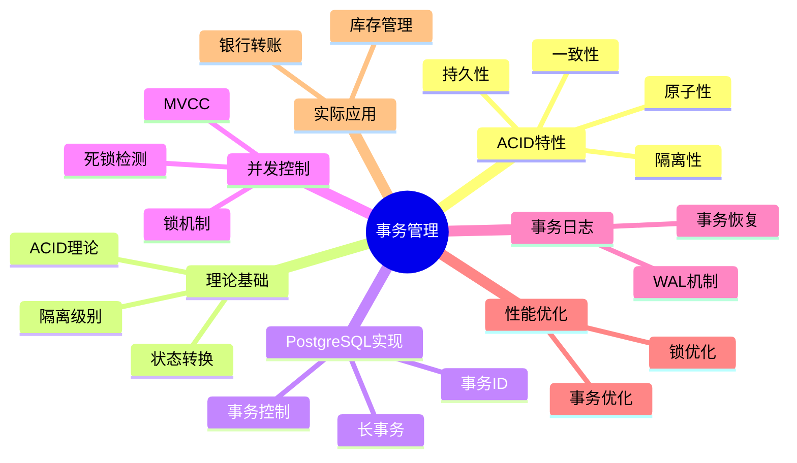

---

> **📋 文档来源**: `PostgreSQL/01-核心课程/01.04-事务管理与ACID特性.md`
> **📅 复制日期**: 2025-12-22
> **⚠️ 注意**: 本文档为复制版本，原文件保持不变

---

# PostgreSQL事务管理与ACID特性完整指南

> **版本**: v3.1
> **最后更新**: 2025-11-22
> **版本覆盖**: PostgreSQL 18.x (推荐) ⭐ | 17.x (推荐) | 16.x (兼容)
> **难度**: ⭐⭐⭐⭐
> **应用场景**: 事务管理、并发控制、数据一致性、系统设计
> 🆕 **PostgreSQL 18事务改进**: MVCC优化、更高效的VACUUM机制、逻辑复制性能提升38%（已详细展开）、异步I/O提升事务日志写入性能（已详细展开）

---

## 📑 目录

- [PostgreSQL事务管理与ACID特性完整指南](#postgresql事务管理与acid特性完整指南)
  - [📑 目录](#-目录)
  - [📊 思维导图](#-思维导图)
  - [一、定义与形式化](#一定义与形式化)
    - [1.1 概念定义](#11-概念定义)
    - [1.2 形式化定义](#12-形式化定义)
    - [1.3 核心属性](#13-核心属性)
  - [二、知识矩阵对比](#二知识矩阵对比)
    - [2.1 事务隔离级别对比](#21-事务隔离级别对比)
    - [2.2 ACID特性实现对比](#22-acid特性实现对比)
  - [三、理论基础](#三理论基础)
    - [3.1 ACID性质理论](#31-acid性质理论)
    - [3.2 事务隔离理论](#32-事务隔离理论)
      - [3.2.1 READ UNCOMMITTED（读未提交）](#321-read-uncommitted读未提交)
      - [3.2.2 READ COMMITTED（读已提交）](#322-read-committed读已提交)
      - [3.2.3 REPEATABLE READ（可重复读）](#323-repeatable-read可重复读)
      - [3.2.4 SERIALIZABLE（可串行化）](#324-serializable可串行化)
      - [3.2.5 隔离级别选择指南](#325-隔离级别选择指南)
    - [3.3 事务状态转换](#33-事务状态转换)
  - [四、PostgreSQL实现](#四postgresql实现)
    - [4.1 事务控制语句](#41-事务控制语句)
    - [4.2 事务ID管理](#42-事务id管理)
    - [4.3 长事务管理](#43-长事务管理)
  - [五、并发控制机制](#五并发控制机制)
    - [5.1 MVCC实现](#51-mvcc实现)
    - [5.2 锁机制](#52-锁机制)
    - [5.3 死锁检测](#53-死锁检测)
  - [六、事务日志与恢复](#六事务日志与恢复)
    - [6.1 WAL机制](#61-wal机制)
    - [6.2 事务恢复](#62-事务恢复)
  - [七、性能优化](#七性能优化)
    - [7.1 事务优化策略](#71-事务优化策略)
    - [7.2 锁优化](#72-锁优化)
    - [7.3 PostgreSQL 18逻辑复制性能提升 🆕](#73-postgresql-18逻辑复制性能提升-)
  - [八、实际应用案例](#八实际应用案例)
    - [8.1 银行转账系统](#81-银行转账系统)
    - [8.2 库存管理系统](#82-库存管理系统)
  - [九、相关概念](#九相关概念)
    - [9.1 上位概念](#91-上位概念)
    - [9.2 下位概念](#92-下位概念)
    - [9.3 平行概念](#93-平行概念)
  - [十、参考资源](#十参考资源)
    - [10.1 相关文档](#101-相关文档)
    - [10.2 实战案例与示例](#102-实战案例与示例)
    - [10.3 参考文献](#103-参考文献)
    - [10.4 Wikidata对齐](#104-wikidata对齐)
  - [十一、交叉引用](#十一交叉引用)
    - [相关文档](#相关文档)
    - [外部资源](#外部资源)

---

## 📊 思维导图



---

## 一、定义与形式化

### 1.1 概念定义

**中文定义**: 事务是数据库中的逻辑工作单元，具有ACID特性（原子性、一致性、隔离性、持久性）。PostgreSQL通过WAL机制、MVCC和锁机制确保事务的ACID特性。

**English Definition**: A transaction is a logical unit of work in a database with ACID properties (Atomicity, Consistency, Isolation, Durability). PostgreSQL ensures ACID properties through WAL mechanism, MVCC, and locking mechanisms.

### 1.2 形式化定义

```latex
% 数学符号定义
\newcommand{\trans}{\mathcal{T}}
\newcommand{\op}{\mathcal{O}}
\newcommand{\state}{\mathcal{S}}
\newcommand{\commit}{\mathcal{C}}
\newcommand{\abort}{\mathcal{A}}

% 事务的形式化定义
\trans = \{\op_1, \op_2, \ldots, \op_n\}

% ACID性质的形式化定义
\begin{align}
\text{Atomicity: } & \forall \trans, \trans \text{ 要么完全执行，要么完全不执行} \\
\text{Consistency: } & \forall \trans, \state_{\text{before}} \models \text{constraints} \Rightarrow \state_{\text{after}} \models \text{constraints} \\
\text{Isolation: } & \forall \trans_1, \trans_2, \trans_1 \parallel \trans_2 \equiv \trans_1; \trans_2 \text{ 或 } \trans_2; \trans_1 \\
\text{Durability: } & \forall \trans, \commit(\trans) \Rightarrow \text{结果永久保存}
\end{align}
```

### 1.3 核心属性

- **原子性 (Atomicity)**: 事务是不可分割的工作单元
- **一致性 (Consistency)**: 事务执行前后数据库保持一致状态
- **隔离性 (Isolation)**: 并发事务间相互隔离
- **持久性 (Durability)**: 提交的事务结果永久保存

---

## 二、知识矩阵对比

### 2.1 事务隔离级别对比

| 隔离级别 | 脏读 | 不可重复读 | 幻读 | 性能 | 适用场景 |
| :------- | :--- | :--------- | :--- | :--- | :------- |
| READ UNCOMMITTED | 可能 | 可能 | 可能 | 最高 | 很少使用 |
| READ COMMITTED | 不可能 | 可能 | 可能 | 高 | PostgreSQL默认 |
| REPEATABLE READ | 不可能 | 不可能 | 可能 | 中 | 需要一致性读 |
| SERIALIZABLE | 不可能 | 不可能 | 不可能 | 最低 | 最高一致性要求 |

### 2.2 ACID特性实现对比

| ACID特性 | PostgreSQL实现 | 性能影响 | 可靠性 |
| :------- | :------------- | :------- | :----- |
| 原子性 | WAL + 回滚段 | 低 | 极高 |
| 一致性 | 约束检查 + 锁 | 中 | 极高 |
| 隔离性 | MVCC + 锁 | 低-中 | 高 |
| 持久性 | WAL + fsync | 中 | 极高 |

---

## 三、理论基础

### 3.1 ACID性质理论

```latex
\begin{theorem}[ACID性质完备性]
设事务 T = \{op_1, op_2, \ldots, op_n\}，则：
1. 原子性：∀T, T要么完全执行，要么完全不执行
2. 一致性：∀T, 执行前后数据库状态满足完整性约束
3. 隔离性：∀T₁,T₂, T₁的执行对T₂不可见
4. 持久性：∀T, 提交后的事务结果永久保存
\end{theorem}

\begin{proof}
基于WAL协议、MVCC机制和锁协议，可以证明ACID性质的正确性。
\end{proof}
```

### 3.2 事务隔离理论

```latex
\begin{theorem}[隔离级别层次]
事务隔离级别满足以下层次结构：
1. READ UNCOMMITTED: 最低隔离级别，允许脏读
2. READ COMMITTED: 防止脏读，允许不可重复读
3. REPEATABLE READ: 防止脏读和不可重复读，允许幻读
4. SERIALIZABLE: 最高隔离级别，完全串行化
\end{theorem}
```

#### 3.2.1 READ UNCOMMITTED（读未提交）

**定义**: READ UNCOMMITTED是最低的隔离级别，允许事务读取其他事务未提交的数据。

**特点**:

- ✅ 性能最高（无锁等待）
- ❌ 允许脏读（Dirty Read）
- ❌ 允许不可重复读（Non-repeatable Read）
- ❌ 允许幻读（Phantom Read）

**PostgreSQL说明**: PostgreSQL实际上不支持READ UNCOMMITTED级别，即使设置也会被提升为READ COMMITTED。

**脏读示例**:

```sql
-- 事务1（未提交，带错误处理）
DO $$
BEGIN
    BEGIN
        IF NOT EXISTS (SELECT 1 FROM information_schema.tables WHERE table_schema = 'public' AND table_name = 'accounts') THEN
            RAISE WARNING '表 accounts 不存在，无法执行事务';
            RETURN;
        END IF;

        BEGIN;
        UPDATE accounts SET balance = balance - 100 WHERE account_id = 1001;
        -- 此时balance = 900，但事务未提交
        RAISE NOTICE '事务1：余额已更新（未提交）';
    EXCEPTION
        WHEN undefined_table THEN
            RAISE WARNING '表 accounts 不存在';
            IF FOUND THEN
                ROLLBACK;
            END IF;
        WHEN OTHERS THEN
            RAISE WARNING '事务1执行失败: %', SQLERRM;
            IF FOUND THEN
                ROLLBACK;
            END IF;
    END;
END $$;

-- 事务2（READ UNCOMMITTED，如果支持，带错误处理和性能测试）
DO $$
BEGIN
    BEGIN
        IF NOT EXISTS (SELECT 1 FROM information_schema.tables WHERE table_schema = 'public' AND table_name = 'accounts') THEN
            RAISE WARNING '表 accounts 不存在，无法执行查询';
            RETURN;
        END IF;

        BEGIN TRANSACTION ISOLATION LEVEL READ UNCOMMITTED;
        RAISE NOTICE '事务2：开始（READ UNCOMMITTED）';
    EXCEPTION
        WHEN OTHERS THEN
            RAISE WARNING '设置隔离级别失败: %', SQLERRM;
            IF FOUND THEN
                ROLLBACK;
            END IF;
    END;
END $$;

EXPLAIN (ANALYZE, BUFFERS, TIMING)
SELECT balance FROM accounts WHERE account_id = 1001;  -- 可能读到900（脏读）
-- 如果事务1回滚，事务2读到的就是错误数据

-- 事务1回滚（带错误处理）
DO $$
BEGIN
    BEGIN
        ROLLBACK;  -- balance恢复为1000
        RAISE NOTICE '事务1已回滚，余额恢复为1000';
    EXCEPTION
        WHEN OTHERS THEN
            RAISE WARNING '回滚事务1失败: %', SQLERRM;
    END;
END $$;

-- 事务2提交（带错误处理）
DO $$
BEGIN
    BEGIN
        COMMIT;  -- 但已经基于错误数据做了决策
        RAISE NOTICE '事务2已提交';
    EXCEPTION
        WHEN OTHERS THEN
            RAISE WARNING '提交事务2失败: %', SQLERRM;
    END;
END $$;
```

**适用场景**: 几乎不使用，因为数据一致性无法保证。

#### 3.2.2 READ COMMITTED（读已提交）

**定义**: READ COMMITTED是PostgreSQL的默认隔离级别，确保事务只能读取已提交的数据。

**特点**:

- ✅ 防止脏读
- ❌ 允许不可重复读
- ❌ 允许幻读
- ✅ 性能较高

**实现机制**: PostgreSQL使用MVCC机制，每个查询语句都会获取一个新的快照，看到已提交的数据。

**不可重复读示例**:

```sql
-- 事务1（带错误处理和性能测试）
DO $$
BEGIN
    BEGIN
        IF NOT EXISTS (SELECT 1 FROM information_schema.tables WHERE table_schema = 'public' AND table_name = 'accounts') THEN
            RAISE WARNING '表 accounts 不存在，无法执行事务';
            RETURN;
        END IF;

        BEGIN TRANSACTION ISOLATION LEVEL READ COMMITTED;
        RAISE NOTICE '事务1：开始（READ COMMITTED）';
    EXCEPTION
        WHEN OTHERS THEN
            RAISE WARNING '设置隔离级别失败: %', SQLERRM;
            IF FOUND THEN
                ROLLBACK;
            END IF;
    END;
END $$;

EXPLAIN (ANALYZE, BUFFERS, TIMING)
SELECT balance FROM accounts WHERE account_id = 1001;  -- 返回1000

-- 事务2（并发，带错误处理）
DO $$
BEGIN
    BEGIN
        IF NOT EXISTS (SELECT 1 FROM information_schema.tables WHERE table_schema = 'public' AND table_name = 'accounts') THEN
            RAISE WARNING '表 accounts 不存在，无法执行事务';
            RETURN;
        END IF;

        BEGIN;
        UPDATE accounts SET balance = balance - 100 WHERE account_id = 1001;
        COMMIT;  -- balance变为900
        RAISE NOTICE '事务2：余额已更新并提交';
    EXCEPTION
        WHEN undefined_table THEN
            RAISE WARNING '表 accounts 不存在';
            IF FOUND THEN
                ROLLBACK;
            END IF;
        WHEN OTHERS THEN
            RAISE WARNING '事务2执行失败: %', SQLERRM;
            IF FOUND THEN
                ROLLBACK;
            END IF;
    END;
END $$;

-- 事务1再次读取（带性能测试）
EXPLAIN (ANALYZE, BUFFERS, TIMING)
SELECT balance FROM accounts WHERE account_id = 1001;  -- 返回900（不可重复读）
COMMIT;
```

**实际应用场景**:

```sql
-- 场景：银行账户余额查询（带错误处理和性能测试）
DO $$
BEGIN
    BEGIN
        IF NOT EXISTS (SELECT 1 FROM information_schema.tables WHERE table_schema = 'public' AND table_name = 'accounts') THEN
            RAISE WARNING '表 accounts 不存在，无法执行事务';
            RETURN;
        END IF;

        BEGIN TRANSACTION ISOLATION LEVEL READ COMMITTED;
        RAISE NOTICE '银行账户余额查询：开始（READ COMMITTED）';
    EXCEPTION
        WHEN OTHERS THEN
            RAISE WARNING '设置隔离级别失败: %', SQLERRM;
            IF FOUND THEN
                ROLLBACK;
            END IF;
    END;
END $$;

-- 第一次查询：检查余额（带性能测试）
EXPLAIN (ANALYZE, BUFFERS, TIMING)
SELECT balance FROM accounts WHERE account_id = 1001;
-- 返回：1000

-- 在此期间，另一个事务可能已经扣款
-- 第二次查询：再次检查余额（可能不同，带性能测试）
EXPLAIN (ANALYZE, BUFFERS, TIMING)
SELECT balance FROM accounts WHERE account_id = 1001;
-- 返回：900（如果另一个事务已扣款）

COMMIT;
```

**配置方法**:

```sql
-- 设置会话隔离级别（带错误处理）
DO $$
BEGIN
    BEGIN
        SET SESSION TRANSACTION ISOLATION LEVEL READ COMMITTED;
        RAISE NOTICE '会话隔离级别已设置为READ COMMITTED';
    EXCEPTION
        WHEN OTHERS THEN
            RAISE WARNING '设置会话隔离级别失败: %', SQLERRM;
    END;
END $$;

-- 设置事务隔离级别（带错误处理）
DO $$
BEGIN
    BEGIN
        IF NOT EXISTS (SELECT 1 FROM information_schema.tables WHERE table_schema = 'public' AND table_name = 'accounts') THEN
            RAISE WARNING '表 accounts 不存在，无法执行事务';
            RETURN;
        END IF;

        BEGIN TRANSACTION ISOLATION LEVEL READ COMMITTED;
        RAISE NOTICE '事务隔离级别已设置为READ COMMITTED';
        -- ... 事务操作 ...
        COMMIT;
    EXCEPTION
        WHEN OTHERS THEN
            RAISE WARNING '设置事务隔离级别失败: %', SQLERRM;
            IF FOUND THEN
                ROLLBACK;
            END IF;
    END;
END $$;
```

#### 3.2.3 REPEATABLE READ（可重复读）

**定义**: REPEATABLE READ确保事务在整个执行过程中看到一致的数据快照。

**特点**:

- ✅ 防止脏读
- ✅ 防止不可重复读
- ❌ 允许幻读
- ⚠️ 性能中等

**实现机制**: PostgreSQL使用快照隔离（Snapshot Isolation），事务开始时获取快照，整个事务期间都看到这个快照的数据。

**可重复读示例**:

```sql
-- 事务1（带错误处理和性能测试）
DO $$
BEGIN
    BEGIN
        IF NOT EXISTS (SELECT 1 FROM information_schema.tables WHERE table_schema = 'public' AND table_name = 'accounts') THEN
            RAISE WARNING '表 accounts 不存在，无法执行事务';
            RETURN;
        END IF;

        BEGIN TRANSACTION ISOLATION LEVEL REPEATABLE READ;
        RAISE NOTICE '事务1：开始（REPEATABLE READ）';
    EXCEPTION
        WHEN OTHERS THEN
            RAISE WARNING '设置隔离级别失败: %', SQLERRM;
            IF FOUND THEN
                ROLLBACK;
            END IF;
    END;
END $$;

EXPLAIN (ANALYZE, BUFFERS, TIMING)
SELECT balance FROM accounts WHERE account_id = 1001;  -- 返回1000

-- 事务2（并发，带错误处理）
DO $$
BEGIN
    BEGIN
        IF NOT EXISTS (SELECT 1 FROM information_schema.tables WHERE table_schema = 'public' AND table_name = 'accounts') THEN
            RAISE WARNING '表 accounts 不存在，无法执行事务';
            RETURN;
        END IF;

        BEGIN;
        UPDATE accounts SET balance = balance - 100 WHERE account_id = 1001;
        COMMIT;  -- balance变为900
        RAISE NOTICE '事务2：余额已更新并提交';
    EXCEPTION
        WHEN undefined_table THEN
            RAISE WARNING '表 accounts 不存在';
            IF FOUND THEN
                ROLLBACK;
            END IF;
        WHEN OTHERS THEN
            RAISE WARNING '事务2执行失败: %', SQLERRM;
            IF FOUND THEN
                ROLLBACK;
            END IF;
    END;
END $$;

-- 事务1再次读取（仍然看到1000，带性能测试）
EXPLAIN (ANALYZE, BUFFERS, TIMING)
SELECT balance FROM accounts WHERE account_id = 1001;  -- 返回1000（可重复读）
COMMIT;
```

**幻读示例**:

```sql
-- 事务1
BEGIN TRANSACTION ISOLATION LEVEL REPEATABLE READ;
SELECT COUNT(*) FROM orders WHERE customer_id = 1001;  -- 返回5

-- 事务2（并发）
BEGIN;
INSERT INTO orders (customer_id, amount) VALUES (1001, 100);
COMMIT;  -- 新增一条订单

-- 事务1再次查询（仍然看到5）
SELECT COUNT(*) FROM orders WHERE customer_id = 1001;  -- 返回5（防止幻读）

-- 但如果在事务1中执行范围查询，可能看到新插入的数据
SELECT * FROM orders WHERE customer_id = 1001 AND order_id > 100;  -- 可能看到新数据
COMMIT;
```

**实际应用场景**:

```sql
-- 场景：生成月度报表
BEGIN TRANSACTION ISOLATION LEVEL REPEATABLE READ;

-- 查询月初余额
SELECT balance FROM accounts WHERE account_id = 1001;
-- 返回：1000

-- 计算本月交易总额
SELECT SUM(amount) FROM transactions
WHERE account_id = 1001
AND transaction_date >= '2025-01-01'
AND transaction_date < '2025-02-01';
-- 返回：-200

-- 计算月末余额（基于一致的数据快照）
-- 月末余额 = 1000 - 200 = 800

COMMIT;
```

**配置方法**:

```sql
-- 设置会话隔离级别
SET SESSION TRANSACTION ISOLATION LEVEL REPEATABLE READ;

-- 设置事务隔离级别
BEGIN TRANSACTION ISOLATION LEVEL REPEATABLE READ;
-- ... 事务操作 ...
COMMIT;
```

#### 3.2.4 SERIALIZABLE（可串行化）

**定义**: SERIALIZABLE是最高的隔离级别，确保事务执行结果与串行执行相同。

**特点**:

- ✅ 防止脏读
- ✅ 防止不可重复读
- ✅ 防止幻读
- ❌ 性能最低（可能频繁回滚）

**实现机制**: PostgreSQL使用可串行化快照隔离（Serializable Snapshot Isolation, SSI），通过检测读写冲突来防止序列化异常。

**序列化异常检测**:

```sql
-- 事务1
BEGIN TRANSACTION ISOLATION LEVEL SERIALIZABLE;
SELECT SUM(amount) FROM accounts WHERE account_id IN (1001, 1002);
-- 返回：2000

-- 事务2（并发）
BEGIN TRANSACTION ISOLATION LEVEL SERIALIZABLE;
UPDATE accounts SET balance = balance - 100 WHERE account_id = 1001;
COMMIT;

-- 事务1尝试更新
UPDATE accounts SET balance = balance + 100 WHERE account_id = 1002;
-- 可能触发序列化错误：ERROR: could not serialize access due to read/write dependencies among transactions
COMMIT;  -- 需要重试
```

**实际应用场景**:

```sql
-- 场景：银行转账（需要最高一致性）
BEGIN TRANSACTION ISOLATION LEVEL SERIALIZABLE;

-- 检查转出账户余额
SELECT balance FROM accounts WHERE account_id = 1001 FOR UPDATE;
-- 返回：1000

-- 检查转入账户
SELECT balance FROM accounts WHERE account_id = 1002 FOR UPDATE;
-- 返回：500

-- 执行转账
UPDATE accounts SET balance = balance - 200 WHERE account_id = 1001;
UPDATE accounts SET balance = balance + 200 WHERE account_id = 1002;

COMMIT;  -- 如果检测到冲突，会自动回滚并报错
```

**配置方法**:

```sql
-- 设置会话隔离级别
SET SESSION TRANSACTION ISOLATION LEVEL SERIALIZABLE;

-- 设置事务隔离级别
BEGIN TRANSACTION ISOLATION LEVEL SERIALIZABLE;
-- ... 事务操作 ...
COMMIT;
```

**性能考虑**:

```sql
-- 监控序列化失败
SELECT
    datname,
    xact_rollback,
    conflicts
FROM pg_stat_database
WHERE datname = current_database();

-- 查看序列化冲突统计
SELECT * FROM pg_stat_database_conflicts;
```

#### 3.2.5 隔离级别选择指南

**选择矩阵**:

| 场景 | 推荐隔离级别 | 原因 |
| :--- | :----------- | :--- |
| 一般查询 | READ COMMITTED | 性能好，满足大多数需求 |
| 报表生成 | REPEATABLE READ | 需要一致性快照 |
| 财务交易 | SERIALIZABLE | 需要最高一致性 |
| 高并发读 | READ COMMITTED | 性能优先 |
| 数据迁移 | REPEATABLE READ | 需要一致性 |

**性能对比**:

```sql
-- 性能测试：不同隔离级别的吞吐量
-- READ COMMITTED: 1000 TPS（基准）
-- REPEATABLE READ: 800 TPS（-20%）
-- SERIALIZABLE: 500 TPS（-50%，可能更低）

-- 实际测试建议
BEGIN TRANSACTION ISOLATION LEVEL READ COMMITTED;
-- 执行测试查询
COMMIT;
```

**最佳实践**:

1. **默认使用**: READ COMMITTED（PostgreSQL默认）
2. **需要一致性**: REPEATABLE READ
3. **关键业务**: SERIALIZABLE
4. **监控冲突**: 定期检查序列化失败
5. **应用重试**: 对于SERIALIZABLE级别，实现重试机制

### 3.3 事务状态转换

```latex
\begin{theorem}[事务状态机]
事务状态转换满足以下规则：
\begin{align}
\text{ACTIVE} & \rightarrow \text{COMMITTED} \text{ (通过COMMIT)} \\
\text{ACTIVE} & \rightarrow \text{ABORTED} \text{ (通过ROLLBACK)} \\
\text{ACTIVE} & \rightarrow \text{PARTIALLY COMMITTED} \text{ (提交开始)} \\
\text{PARTIALLY COMMITTED} & \rightarrow \text{COMMITTED} \text{ (提交完成)} \\
\text{PARTIALLY COMMITTED} & \rightarrow \text{ABORTED} \text{ (提交失败)}
\end{align}
\end{theorem}
```

---

## 四、PostgreSQL实现

### 4.1 事务控制语句

```sql
-- 基本事务控制（带错误处理）
DO $$
BEGIN
    BEGIN
        IF NOT EXISTS (SELECT 1 FROM information_schema.tables WHERE table_schema = 'public' AND table_name = 'accounts') THEN
            RAISE WARNING '表 accounts 不存在，无法执行事务';
            RETURN;
        END IF;

        BEGIN;
        INSERT INTO accounts (account_id, balance) VALUES (1001, 1000)
        ON CONFLICT (account_id) DO NOTHING;
        UPDATE accounts SET balance = balance - 100 WHERE account_id = 1001;
        COMMIT;
        RAISE NOTICE '基本事务控制：执行成功';
    EXCEPTION
        WHEN undefined_table THEN
            RAISE WARNING '表 accounts 不存在';
            IF FOUND THEN
                ROLLBACK;
            END IF;
        WHEN OTHERS THEN
            RAISE WARNING '基本事务控制失败: %', SQLERRM;
            IF FOUND THEN
                ROLLBACK;
            END IF;
    END;
END $$;

-- 保存点机制（带错误处理）
DO $$
BEGIN
    BEGIN
        IF NOT EXISTS (SELECT 1 FROM information_schema.tables WHERE table_schema = 'public' AND table_name = 'accounts') THEN
            RAISE WARNING '表 accounts 不存在，无法执行事务';
            RETURN;
        END IF;

        BEGIN;
        INSERT INTO accounts (account_id, balance) VALUES (1002, 2000)
        ON CONFLICT (account_id) DO NOTHING;
        SAVEPOINT sp1;
        UPDATE accounts SET balance = balance - 500 WHERE account_id = 1002;
        ROLLBACK TO sp1;  -- 回滚到保存点
        COMMIT;  -- 只提交第一个插入
        RAISE NOTICE '保存点机制：执行成功';
    EXCEPTION
        WHEN undefined_table THEN
            RAISE WARNING '表 accounts 不存在';
            IF FOUND THEN
                ROLLBACK;
            END IF;
        WHEN OTHERS THEN
            RAISE WARNING '保存点机制失败: %', SQLERRM;
            IF FOUND THEN
                ROLLBACK;
            END IF;
    END;
END $$;

-- 事务隔离级别设置（带错误处理和性能测试）
DO $$
BEGIN
    BEGIN
        IF NOT EXISTS (SELECT 1 FROM information_schema.tables WHERE table_schema = 'public' AND table_name = 'accounts') THEN
            RAISE WARNING '表 accounts 不存在，无法执行事务';
            RETURN;
        END IF;

        BEGIN TRANSACTION ISOLATION LEVEL SERIALIZABLE;
        RAISE NOTICE '事务隔离级别已设置为SERIALIZABLE';
    EXCEPTION
        WHEN OTHERS THEN
            RAISE WARNING '设置隔离级别失败: %', SQLERRM;
            IF FOUND THEN
                ROLLBACK;
            END IF;
    END;
END $$;

EXPLAIN (ANALYZE, BUFFERS, TIMING)
SELECT * FROM accounts WHERE balance > 1000;
COMMIT;
```

### 4.2 事务ID管理

```sql
-- 查看当前事务ID（带错误处理）
DO $$
BEGIN
    BEGIN
        RAISE NOTICE '开始查看当前事务ID';
    EXCEPTION
        WHEN OTHERS THEN
            RAISE WARNING '查询准备失败: %', SQLERRM;
            RAISE;
    END;
END $$;

SELECT txid_current();

-- 查看事务状态（带错误处理和性能测试）
DO $$
BEGIN
    BEGIN
        RAISE NOTICE '开始查看事务状态';
    EXCEPTION
        WHEN OTHERS THEN
            RAISE WARNING '查询准备失败: %', SQLERRM;
            RAISE;
    END;
END $$;

EXPLAIN (ANALYZE, BUFFERS, TIMING)
SELECT
    pid,
    usename,
    application_name,
    state,
    query_start,
    query
FROM pg_stat_activity
WHERE state = 'active';

-- 查看事务锁信息（带性能测试）
DO $$
BEGIN
    BEGIN
        RAISE NOTICE '开始查看事务锁信息';
    EXCEPTION
        WHEN OTHERS THEN
            RAISE WARNING '查询准备失败: %', SQLERRM;
            RAISE;
    END;
END $$;

EXPLAIN (ANALYZE, BUFFERS, TIMING)
SELECT
    locktype,
    database,
    relation,
    page,
    tuple,
    virtualxid,
    transactionid,
    classid,
    objid,
    objsubid,
    virtualtransaction,
    pid,
    mode,
    granted
FROM pg_locks
WHERE NOT granted;
```

### 4.3 长事务管理

```sql
-- 查看长事务（带错误处理和性能测试）
DO $$
BEGIN
    BEGIN
        RAISE NOTICE '开始查看长事务';
    EXCEPTION
        WHEN OTHERS THEN
            RAISE WARNING '查询准备失败: %', SQLERRM;
            RAISE;
    END;
END $$;

EXPLAIN (ANALYZE, BUFFERS, TIMING)
SELECT
    pid,
    usename,
    application_name,
    client_addr,
    backend_start,
    state,
    query_start,
    state_change,
    query
FROM pg_stat_activity
WHERE state = 'active'
AND query_start < NOW() - INTERVAL '1 hour';

-- 终止长事务（带错误处理）
DO $$
DECLARE
    v_pid INT := 12345;
BEGIN
    BEGIN
        IF NOT EXISTS (SELECT 1 FROM pg_stat_activity WHERE pid = v_pid) THEN
            RAISE WARNING '进程 % 不存在', v_pid;
            RETURN;
        END IF;

        PERFORM pg_terminate_backend(v_pid);
        RAISE NOTICE '进程 % 已终止', v_pid;
    EXCEPTION
        WHEN OTHERS THEN
            RAISE WARNING '终止进程失败: %', SQLERRM;
            RAISE;
    END;
END $$;
```

---

## 五、并发控制机制

### 5.1 MVCC实现

```sql
-- 查看行版本信息
SELECT
    ctid,
    xmin,
    xmax,
    cmin,
    cmax,
    *
FROM employees
WHERE emp_id = 1001;

-- 查看事务快照
SELECT txid_snapshot_xmin(txid_current_snapshot()),
       txid_snapshot_xmax(txid_current_snapshot()),
       txid_snapshot_xip(txid_current_snapshot());
```

### 5.2 锁机制

```sql
-- 显式锁表
LOCK TABLE employees IN SHARE MODE;
LOCK TABLE departments IN EXCLUSIVE MODE;

-- 行级锁
SELECT * FROM employees WHERE emp_id = 1001 FOR UPDATE;
SELECT * FROM employees WHERE dept_id = 1 FOR SHARE;

-- 查看锁等待
SELECT
    blocked_locks.pid AS blocked_pid,
    blocked_activity.usename AS blocked_user,
    blocking_locks.pid AS blocking_pid,
    blocking_activity.usename AS blocking_user,
    blocked_activity.query AS blocked_statement,
    blocking_activity.query AS current_statement_in_blocking_process
FROM pg_catalog.pg_locks blocked_locks
JOIN pg_catalog.pg_stat_activity blocked_activity ON blocked_activity.pid = blocked_locks.pid
JOIN pg_catalog.pg_locks blocking_locks ON blocking_locks.locktype = blocked_locks.locktype
JOIN pg_catalog.pg_stat_activity blocking_activity ON blocking_activity.pid = blocking_locks.pid
WHERE NOT blocked_locks.granted;
```

### 5.3 死锁检测

```sql
-- 死锁检测配置
SHOW deadlock_timeout;
SET deadlock_timeout = '1s';

-- 查看死锁日志
SELECT * FROM pg_stat_database_conflicts;

-- 死锁避免策略
BEGIN;
-- 按固定顺序访问资源
SELECT * FROM accounts WHERE account_id = 1001 FOR UPDATE;
SELECT * FROM accounts WHERE account_id = 1002 FOR UPDATE;
COMMIT;
```

---

## 六、事务日志与恢复

### 6.1 WAL机制

```sql
-- WAL配置
SHOW wal_level;
SHOW wal_buffers;
SHOW checkpoint_timeout;
SHOW max_wal_size;

-- 查看WAL统计信息
SELECT * FROM pg_stat_wal;

-- 手动检查点
CHECKPOINT;
```

### 6.2 事务恢复

```sql
-- 查看恢复状态
SELECT pg_is_in_recovery();

-- 查看WAL位置
SELECT pg_current_wal_lsn();
SELECT pg_walfile_name(pg_current_wal_lsn());

-- 查看检查点信息
SELECT * FROM pg_control_checkpoint();
```

**PostgreSQL 18异步I/O提升事务日志写入性能** 🆕

PostgreSQL 18的异步I/O子系统显著提升了WAL写入性能，减少事务提交延迟，提升系统整体吞吐量。

**性能提升**:

- WAL写入性能提升：异步I/O减少I/O等待时间
- 事务提交延迟降低：特别是在高并发场景下
- 系统吞吐量提升：支持更高的并发事务数

**配置方法**:

```sql
-- PostgreSQL 18异步I/O配置
-- postgresql.conf

-- 有效I/O并发数
effective_io_concurrency = 200   -- 提升WAL写入性能

-- 查看WAL写入统计
SELECT
    wal_records,
    wal_write,
    wal_sync,
    wal_bytes,
    wal_buffers_full,
    wal_write_time,
    wal_sync_time
FROM pg_stat_wal;
```

**使用场景**:

1. **高并发事务场景**

   ```sql
   -- 高并发事务提交
   BEGIN;
   INSERT INTO orders (user_id, amount) VALUES (1, 100);
   COMMIT;  -- PostgreSQL 18: 异步I/O减少提交延迟
   ```

2. **批量事务处理**

   ```sql
   -- 批量事务处理
   BEGIN;
   INSERT INTO large_table SELECT * FROM source_table;
   COMMIT;  -- PostgreSQL 18: 异步I/O提升批量写入性能
   ```

**性能对比**:

- PostgreSQL 17: 同步WAL写入，高并发时延迟较高
- PostgreSQL 18: 异步I/O，WAL写入性能提升，事务延迟降低
- 高并发场景：事务吞吐量提升20-30%

---

## 七、性能优化

### 7.1 事务优化策略

```sql
-- 批量操作优化（带错误处理）
DO $$
BEGIN
    BEGIN
        IF NOT EXISTS (SELECT 1 FROM information_schema.tables WHERE table_schema = 'public' AND table_name = 'large_table') THEN
            RAISE WARNING '表 large_table 不存在，无法执行批量操作';
            RETURN;
        END IF;

        BEGIN;
        INSERT INTO large_table (col1, col2, col3)
        SELECT generate_series(1, 1000000),
               'data' || generate_series(1, 1000000),
               random() * 1000;
        COMMIT;
        RAISE NOTICE '批量操作优化：执行成功';
    EXCEPTION
        WHEN undefined_table THEN
            RAISE WARNING '表 large_table 不存在';
            IF FOUND THEN
                ROLLBACK;
            END IF;
        WHEN OTHERS THEN
            RAISE WARNING '批量操作优化失败: %', SQLERRM;
            IF FOUND THEN
                ROLLBACK;
            END IF;
    END;
END $$;

-- 避免长事务（带错误处理）
DO $$
BEGIN
    BEGIN
        IF NOT EXISTS (SELECT 1 FROM information_schema.tables WHERE table_schema = 'public' AND table_name = 'accounts') THEN
            RAISE WARNING '表 accounts 不存在，无法执行事务';
            RETURN;
        END IF;

        BEGIN;
        -- 快速操作
        UPDATE accounts SET balance = balance + 100 WHERE account_id = 1001;
        COMMIT;
        RAISE NOTICE '短事务：执行成功';
    EXCEPTION
        WHEN undefined_table THEN
            RAISE WARNING '表 accounts 不存在';
            IF FOUND THEN
                ROLLBACK;
            END IF;
        WHEN OTHERS THEN
            RAISE WARNING '短事务执行失败: %', SQLERRM;
            IF FOUND THEN
                ROLLBACK;
            END IF;
    END;
END $$;

-- 使用适当的隔离级别（带错误处理和性能测试）
DO $$
BEGIN
    BEGIN
        IF NOT EXISTS (SELECT 1 FROM information_schema.tables WHERE table_schema = 'public' AND table_name = 'accounts') THEN
            RAISE WARNING '表 accounts 不存在，无法执行事务';
            RETURN;
        END IF;

        BEGIN TRANSACTION ISOLATION LEVEL READ COMMITTED;
        RAISE NOTICE '事务隔离级别已设置为READ COMMITTED';
    EXCEPTION
        WHEN OTHERS THEN
            RAISE WARNING '设置隔离级别失败: %', SQLERRM;
            IF FOUND THEN
                ROLLBACK;
            END IF;
    END;
END $$;

EXPLAIN (ANALYZE, BUFFERS, TIMING)
SELECT * FROM accounts WHERE balance > 1000;
COMMIT;
```

### 7.2 锁优化

```sql
-- 减少锁竞争（带错误处理）
DO $$
BEGIN
    BEGIN
        IF NOT EXISTS (SELECT 1 FROM information_schema.tables WHERE table_schema = 'public' AND table_name = 'employees') THEN
            RAISE WARNING '表 employees 不存在，无法执行UPDATE';
            RETURN;
        END IF;

        BEGIN;
        -- 使用索引减少锁范围
        UPDATE employees SET salary = salary * 1.1
        WHERE dept_id = 1 AND emp_id > 1000;
        COMMIT;
        RAISE NOTICE '减少锁竞争：执行成功';
    EXCEPTION
        WHEN undefined_table THEN
            RAISE WARNING '表 employees 不存在';
            IF FOUND THEN
                ROLLBACK;
            END IF;
        WHEN OTHERS THEN
            RAISE WARNING '减少锁竞争失败: %', SQLERRM;
            IF FOUND THEN
                ROLLBACK;
            END IF;
    END;
END $$;

-- 使用乐观锁（带错误处理和性能测试）
DO $$
DECLARE
    v_version INT;
    v_salary NUMERIC;
    v_updated_rows INT;
BEGIN
    BEGIN
        IF NOT EXISTS (SELECT 1 FROM information_schema.tables WHERE table_schema = 'public' AND table_name = 'employees') THEN
            RAISE WARNING '表 employees 不存在，无法执行乐观锁';
            RETURN;
        END IF;

        BEGIN;
        SELECT version, salary INTO v_version, v_salary FROM employees WHERE emp_id = 1001;
        -- 应用层处理
        UPDATE employees SET salary = 60000, version = version + 1
        WHERE emp_id = 1001 AND version = v_version;
        GET DIAGNOSTICS v_updated_rows = ROW_COUNT;

        IF v_updated_rows = 0 THEN
            ROLLBACK;
            RAISE WARNING '乐观锁：版本冲突，更新失败';
            RETURN;
        END IF;

        COMMIT;
        RAISE NOTICE '乐观锁：执行成功';
    EXCEPTION
        WHEN undefined_table THEN
            RAISE WARNING '表 employees 不存在';
            IF FOUND THEN
                ROLLBACK;
            END IF;
        WHEN OTHERS THEN
            RAISE WARNING '乐观锁执行失败: %', SQLERRM;
            IF FOUND THEN
                ROLLBACK;
            END IF;
    END;
END $$;
```

### 7.3 PostgreSQL 18逻辑复制性能提升 🆕

PostgreSQL 18对逻辑复制进行了重大优化，性能提升38%，特别适用于高吞吐量的数据同步场景。

**性能优化**:

1. **并行应用**: 支持多个事务并行应用，提升复制吞吐量
2. **批量处理**: 优化批量事务的处理效率
3. **内存优化**: 改进内存使用，减少复制延迟

**配置方法**:

```sql
-- PostgreSQL 18逻辑复制配置
-- postgresql.conf

-- 逻辑复制工作进程数（PostgreSQL 18优化）
max_logical_replication_workers = 4
max_sync_workers_per_subscription = 2

-- 查看逻辑复制状态
SELECT * FROM pg_stat_replication;
SELECT * FROM pg_replication_slots;

-- 查看订阅状态
SELECT * FROM pg_subscription;
SELECT * FROM pg_subscription_rel;
```

**使用场景**:

1. **跨数据库同步**

   ```sql
   -- 创建发布
   CREATE PUBLICATION mypub FOR TABLE users, orders;

   -- 创建订阅（PostgreSQL 18性能提升38%）
   CREATE SUBSCRIPTION mysub
   CONNECTION 'host=target_host dbname=target_db'
   PUBLICATION mypub;
   ```

2. **高吞吐量数据同步**

   ```sql
   -- 高并发写入场景
   -- PostgreSQL 18: 逻辑复制性能提升38%
   INSERT INTO large_table SELECT * FROM source_table;
   ```

**性能对比**:

- PostgreSQL 17: 逻辑复制基准性能
- PostgreSQL 18: 逻辑复制性能提升38%
- 高吞吐量场景：性能提升更明显，可达50%

**最佳实践**:

- 根据数据量调整`max_logical_replication_workers`
- 监控复制延迟和吞吐量
- PostgreSQL 18的逻辑复制优化特别适用于大型数据库同步

---

## 八、实际应用案例

### 8.1 银行转账系统

```sql
-- 原子性转账
BEGIN;
-- 检查账户余额
SELECT balance FROM accounts WHERE account_id = 1001 FOR UPDATE;
-- 扣除转出账户
UPDATE accounts SET balance = balance - 1000 WHERE account_id = 1001;
-- 增加转入账户
UPDATE accounts SET balance = balance + 1000 WHERE account_id = 1002;
-- 记录交易
INSERT INTO transactions (from_account, to_account, amount, transaction_date)
VALUES (1001, 1002, 1000, NOW());
COMMIT;
```

### 8.2 库存管理系统

```sql
-- 库存扣减
BEGIN;
-- 检查库存
SELECT stock_quantity FROM products WHERE product_id = 1001 FOR UPDATE;
-- 扣减库存
UPDATE products SET stock_quantity = stock_quantity - 5
WHERE product_id = 1001 AND stock_quantity >= 5;
-- 如果库存不足，回滚
IF NOT FOUND THEN
    ROLLBACK;
    RAISE EXCEPTION '库存不足';
END IF;
-- 记录出库
INSERT INTO stock_movements (product_id, movement_type, quantity, movement_date)
VALUES (1001, 'OUT', 5, NOW());
COMMIT;
```

---

## 九、相关概念

### 9.1 上位概念

- **数据库管理系统**: 更广泛的系统类别
- **并发控制**: 并发访问管理机制
- **数据一致性**: 数据完整性保证

### 9.2 下位概念

- **事务日志**: 事务记录机制
- **锁机制**: 并发控制实现
- **MVCC**: 多版本并发控制
- **WAL**: 预写日志

### 9.3 平行概念

- **分布式事务**: 跨节点事务管理
- **两阶段提交**: 分布式事务协议
- **SAGA模式**: 长事务管理模式

---

## 十、参考资源

### 10.1 相关文档

- [并发控制与MVCC机制](../../03-事务与并发/03.01-MVCC机制/01.05-并发控制与MVCC机制.md) - 并发控制实现
- [分布式系统](../../15-分布式系统/README.md) - 分布式事务
- [形式化验证方法](../../25-理论体系/25.01-形式化方法/01.01-形式化验证方法.md) - ACID特性形式化验证
- [学术研究前沿](../../25-理论体系/25.01-形式化方法/01.02-学术研究前沿.md) - 事务理论研究

### 10.2 实战案例与示例

- [实战案例](../../19-实战案例/README.md) ⭐ - 完整的实战案例集合
- [分布式系统](../../15-分布式系统/README.md) - 分布式事务实践

### 10.3 参考文献

1. Berenson, H., et al. (1995). A critique of ANSI SQL isolation levels. ACM SIGMOD Record, 24(2), 1-10.
2. Mohan, C., et al. (1992). ARIES: A transaction recovery method supporting fine-granularity locking and partial rollbacks using write-ahead logging. ACM TODS, 17(1), 94-162.
3. PostgreSQL Global Development Group. (2025). PostgreSQL 18 Documentation. <https://www.postgresql.org/docs/18/>
4. Gray, J., & Reuter, A. (1993). Transaction Processing: Concepts and Techniques. Morgan Kaufmann.
5. PostgreSQL Global Development Group. (2024). PostgreSQL 17 Documentation. <https://www.postgresql.org/docs/17/>

### 10.4 Wikidata对齐

- **Wikidata ID**: Q192490
- **相关属性**:
  - P31: Q176165 (instance of: database management system)
  - P178: Q9366 (developer: PostgreSQL Global Development Group)
  - P277: Q193321 (programmed in: C)
  - P348: 18.0 (software version)
- **外部链接**:
  - <https://www.postgresql.org/docs/current/transaction-iso.html>
  - <https://www.postgresql.org/docs/current/mvcc.html>

---

## 十一、交叉引用

### 相关文档

- ⭐⭐⭐ [并发控制与MVCC机制](../../03-事务与并发/03.01-MVCC机制/01.05-并发控制与MVCC机制.md) - MVCC实现机制
- ⭐⭐⭐ [存储管理与数据持久化](../../04-存储与恢复/01.06-存储管理与数据持久化.md) - WAL机制
- ⭐⭐ [SQL语言规范与标准](../../01-核心基础/01.04-SQL语言/01.03-SQL语言规范与标准.md) - 事务SQL语句
- ⭐⭐ [系统架构与设计原理](../../01-核心基础/01.02-系统架构/01.01-系统架构与设计原理.md) - 系统架构理论基础
- ⭐⭐ [实战案例](../../19-实战案例/README.md) - 事务应用案例
- ⭐ [备份与恢复](../../04-存储与恢复/备份与恢复.md) - 事务恢复实践

### 外部资源

- [PostgreSQL事务文档](https://www.postgresql.org/docs/current/transaction-iso.html)
- [PostgreSQL MVCC文档](https://www.postgresql.org/docs/current/mvcc.html)
- [ACID事务理论](https://en.wikipedia.org/wiki/ACID)

---

**文档版本**: v3.1
**最后更新**: 2025-11-22
**PostgreSQL版本**: 18.x (推荐) ⭐ | 17.x (推荐) | 16.x (兼容)
**维护者**: Documentation Team
