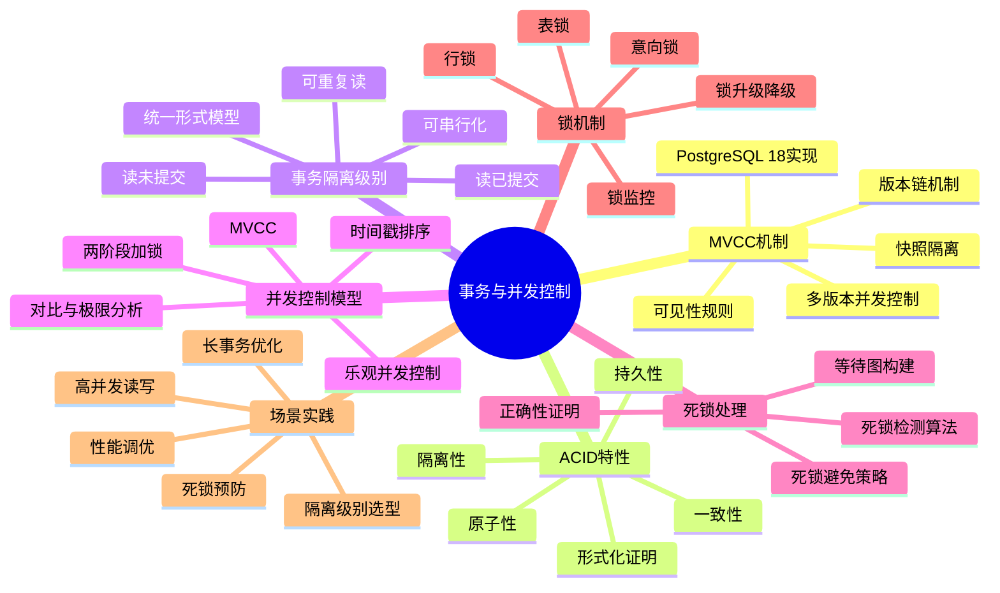
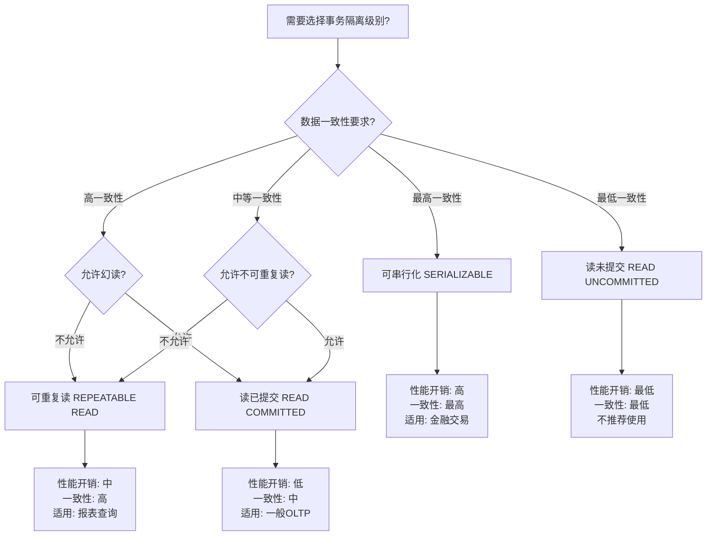
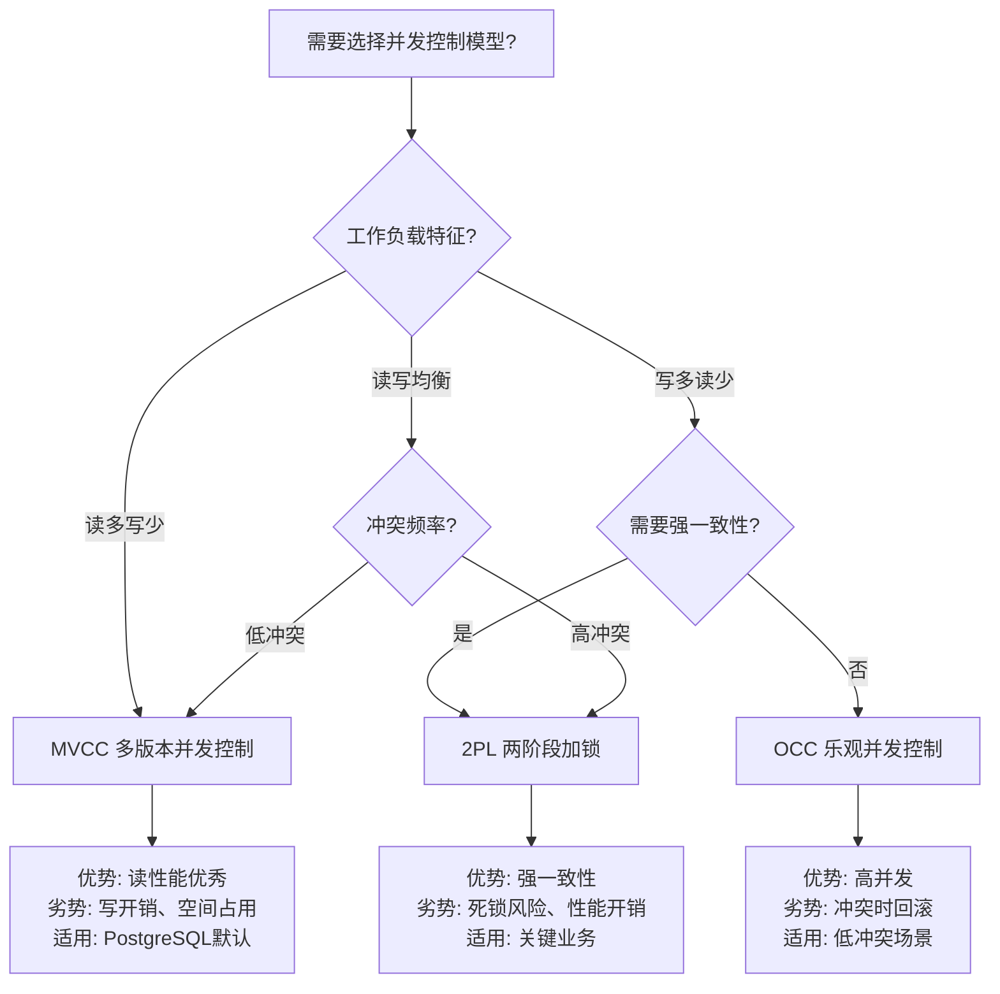

---

> **📋 文档来源**: `DataBaseTheory\03-事务与并发控制\README.md`
> **📅 复制日期**: 2025-12-22
> **⚠️ 注意**: 本文档为复制版本，原文件保持不变

---

# 事务与并发控制模块

> **模块状态**: ✅ 100%完成
> **文档数量**: 12个文档
> **版本覆盖**: PostgreSQL 18.x (推荐) ⭐ | 17.x (推荐) | 16.x (兼容)
> **最后更新**: 2025年1月

---

## 📊 知识体系思维导图

---

## 📋 模块概述

本模块提供PostgreSQL事务与并发控制机制的**完整理论体系**，涵盖：

- ✅ MVCC（多版本并发控制）的完整形式化证明
- ✅ 事务隔离级别的统一形式模型
- ✅ 并发控制模型的对比与极限分析
- ✅ 死锁检测与避免策略的形式化
- ✅ 锁机制的深度解析与实践指南

---

## 📚 文档索引

### 理论深度文档（10个）

#### 核心理论

1. **[03.01-MVCC高级分析与形式证明.md](./03.01-MVCC高级分析与形式证明.md)** ⭐⭐⭐⭐⭐
   - **字数**: 1911行
   - **内容**: MVCC的完整形式化定义、可见性规则、快照隔离、版本链机制
   - **特色**: 包含完整的数学证明、PostgreSQL 18实现详解、实际应用案例

2. **[03.02-MVCC与其他并发控制模型对比与极限分析.md](./03.02-MVCC与其他并发控制模型对比与极限分析.md)** ⭐⭐⭐⭐⭐
   - **字数**: 769行
   - **内容**: MVCC vs 2PL vs T/O vs OCC的全面对比
   - **特色**: 性能极限分析、场景选择决策树、PostgreSQL 18/SQLite对比

3. **[03.03-事务隔离与MVCC-统一形式模型与完备性证明.md](./03.03-事务隔离与MVCC-统一形式模型与完备性证明.md)** ⭐⭐⭐⭐⭐
   - **字数**: 902行
   - **内容**: 事务隔离级别的统一形式模型、MVCC可见性规则、隔离级别实现
   - **特色**: 完备性定理证明、PostgreSQL 18隔离级别实现详解

#### 并发控制机制

1. **[03.04-谓词锁与幽灵现象-形式化与消除条件.md](./03.04-谓词锁与幽灵现象-形式化与消除条件.md)** ⭐⭐⭐⭐⭐
   - **字数**: 838行
   - **内容**: 谓词锁的形式化定义、幽灵现象的形式化、消除条件
   - **特色**: 完整的数学证明、PostgreSQL 18实现、实际案例

2. **[03.05-调度等价-冲突与视图等价的充要关系.md](./03.05-调度等价-冲突与视图等价的充要关系.md)** ⭐⭐⭐⭐⭐
   - **字数**: 902行
   - **内容**: 冲突等价、视图等价、充要关系
   - **特色**: 严格的数学证明、PostgreSQL 18查询优化器应用

3. **[03.06-快照隔离异常谱系-形式分类与必要条件.md](./03.06-快照隔离异常谱系-形式分类与必要条件.md)** ⭐⭐⭐⭐⭐
   - **字数**: 993行
   - **内容**: 快照隔离异常的形式分类、必要条件、SSI机制
   - **特色**: 完整的异常谱系、PostgreSQL 18 SSI实现

#### 一致性模型

1. **[03.07-线性化与串行化-对象与事务一致性的形式关系.md](./03.07-线性化与串行化-对象与事务一致性的形式关系.md)** ⭐⭐⭐⭐⭐
   - **字数**: 801行
   - **内容**: 线性化、串行化、形式关系
   - **特色**: 严格的数学证明、PostgreSQL 18串行化实现

#### 死锁与锁机制

1. **[03.08-死锁与等待图-检测正确性与避免策略.md](./03.08-死锁与等待图-检测正确性与避免策略.md)** ⭐⭐⭐⭐⭐
   - **字数**: 894行
   - **内容**: 等待图构建、死锁检测算法、死锁避免策略
   - **特色**: 死锁检测正确性定理、PostgreSQL 18死锁检测详解

2. **[03.09-两阶段加锁-可串行化的严格证明.md](./03.09-两阶段加锁-可串行化的严格证明.md)** ⭐⭐⭐⭐⭐
   - **字数**: 889行
   - **内容**: 两阶段加锁协议、可串行化的严格证明
   - **特色**: 完整的数学证明、PostgreSQL 18锁机制实现

3. **[03.10-锁升级与降级-安全性与死锁影响的形式证明.md](./03.10-锁升级与降级-安全性与死锁影响的形式证明.md)** ⭐⭐⭐⭐⭐
    - **字数**: 812行
    - **内容**: 锁升级与降级的安全性、死锁影响的形式证明
    - **特色**: 严格的形式化证明、PostgreSQL 18实现

### 实用快速参考（1个）

1. **[11-锁机制深度解析.md](./11-锁机制深度解析.md)** ⭐⭐⭐⭐
    - **字数**: 298行
    - **内容**: 锁层次、表锁、行锁、死锁、Advisory Lock、监控
    - **定位**: 实用快速参考文档，提供锁机制的实用使用指南
    - **特色**: 实际SQL示例、监控查询、最佳实践

### 场景分析指南（1个）

1. **[事务与并发优化场景分析指南.md](./事务与并发优化场景分析指南.md)** ⭐⭐⭐⭐⭐ ⭐ 新增
    - **字数**: 约30,000字
    - **内容**: 高并发读写场景、长事务优化、死锁预防与处理、事务隔离级别选型、锁优化场景、并发性能调优
    - **定位**: 场景分析与优化指南，提供完整的场景分析和优化方案
    - **特色**: 场景分析、方案对比、性能论证、最佳实践
    - **状态**: ✅ 已完成

---

## 🎯 学习路径

### 初学者路径

1. 先阅读 **[11-锁机制深度解析.md](./11-锁机制深度解析.md)** - 了解基本概念
2. 然后阅读 **[03.01-MVCC高级分析与形式证明.md](./03.01-MVCC高级分析与形式证明.md)** - 深入理解MVCC
3. 最后阅读 **[03.03-事务隔离与MVCC-统一形式模型与完备性证明.md](./03.03-事务隔离与MVCC-统一形式模型与完备性证明.md)** - 掌握隔离级别

### 进阶路径

1. **[03.02-MVCC与其他并发控制模型对比与极限分析.md](./03.02-MVCC与其他并发控制模型对比与极限分析.md)** - 理解不同模型
2. **[03.09-两阶段加锁-可串行化的严格证明.md](./03.09-两阶段加锁-可串行化的严格证明.md)** - 掌握2PL
3. **[03.08-死锁与等待图-检测正确性与避免策略.md](./03.08-死锁与等待图-检测正确性与避免策略.md)** - 理解死锁

### 专家路径

1. **[03.05-调度等价-冲突与视图等价的充要关系.md](./03.05-调度等价-冲突与视图等价的充要关系.md)** - 深入调度理论
2. **[03.07-线性化与串行化-对象与事务一致性的形式关系.md](./03.07-线性化与串行化-对象与事务一致性的形式关系.md)** - 掌握一致性模型
3. **[03.06-快照隔离异常谱系-形式分类与必要条件.md](./03.06-快照隔离异常谱系-形式分类与必要条件.md)** - 理解异常谱系

---

## 📊 文档统计

| 文档类型 | 数量 | 总字数 | 完成度 |
| --- | --- | --- | --- |
| 理论深度文档 | 10 | 8,711行 | 100% ✅ |
| 实用快速参考 | 1 | 298行 | 100% ✅ |
| 场景分析指南 | 1 | 约30,000字 | 100% ✅ |
| **总计** | **12** | **约39,000字** | **100%** ✅ |

---

## 📊 并发控制模型对比矩阵

| 并发控制模型 | 读性能 | 写性能 | 冲突检测 | 死锁风险 | 适用场景 | PostgreSQL支持 |
| --- | --- | --- | --- | --- | --- | --- |
| **MVCC** | ⭐⭐⭐⭐⭐ | ⭐⭐⭐⭐ | 快照隔离 | 低 | 读多写少、OLTP | ✅ 原生支持 |
| **2PL (两阶段加锁)** | ⭐⭐⭐ | ⭐⭐⭐⭐ | 锁机制 | 中-高 | 强一致性要求 | ✅ 支持 |
| **T/O (时间戳排序)** | ⭐⭐⭐⭐ | ⭐⭐⭐ | 时间戳 | 低 | 分布式系统 | ⚠️ 部分支持 |
| **OCC (乐观并发控制)** | ⭐⭐⭐⭐⭐ | ⭐⭐⭐ | 验证阶段 | 低 | 冲突少的场景 | ⚠️ 部分支持 |

---

## 📊 事务隔离级别选型决策树

---

## 📊 并发控制模型选型决策树

---

## 🔗 相关模块

### 理论体系

- **[25-理论体系](../25-理论体系/README.md)** - 完整的理论体系
- **[25-理论体系/25.01-形式化方法](../25-理论体系/25.01-形式化方法/README.md)** - 形式化方法基础

### 实践应用

- **[19-实战案例](../19-实战案例/README.md)** - 10个生产级场景案例
- **[20-故障诊断案例](../20-故障诊断案例/README.md)** - 故障诊断案例

---

## ✅ 模块完成情况

### 完成度

- ✅ **理论深度文档**: 10/10 (100%)
- ✅ **实用快速参考**: 1/1 (100%)
- ✅ **场景分析指南**: 1/1 (100%)
- ✅ **总体完成度**: 12/12 (100%)

### 质量指标

- ✅ **形式化证明**: 所有理论文档包含完整的数学证明
- ✅ **PostgreSQL 18覆盖**: 所有文档包含PostgreSQL 18实现详解
- ✅ **实际应用**: 所有文档包含实际业务场景案例
- ✅ **代码示例**: 所有文档包含可运行的SQL代码

---

## 📝 文档特点

### 理论深度文档（03.01-03.10）

- ✅ 完整的形式化定义
- ✅ 严格的数学证明
- ✅ PostgreSQL 18实现详解
- ✅ SQLite 3.45对比分析
- ✅ 实际业务场景案例
- ✅ 最佳实践建议

### 实用快速参考（11-锁机制深度解析）

- ✅ 锁机制快速查阅
- ✅ 实际SQL示例
- ✅ 监控查询脚本
- ✅ 最佳实践指南

---

**模块状态**: ✅ 100%完成
**最后更新**: 2025年1月
**维护者**: DataBaseTheory Team
