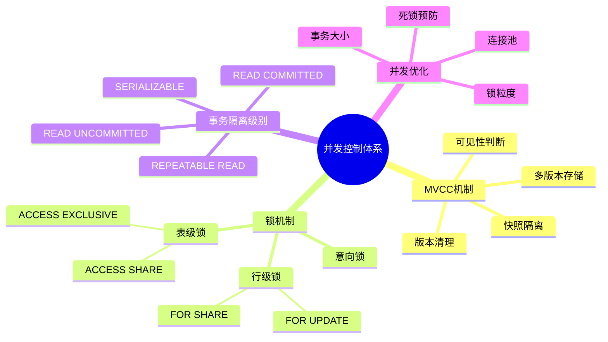
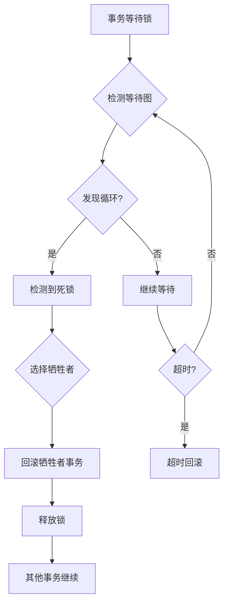
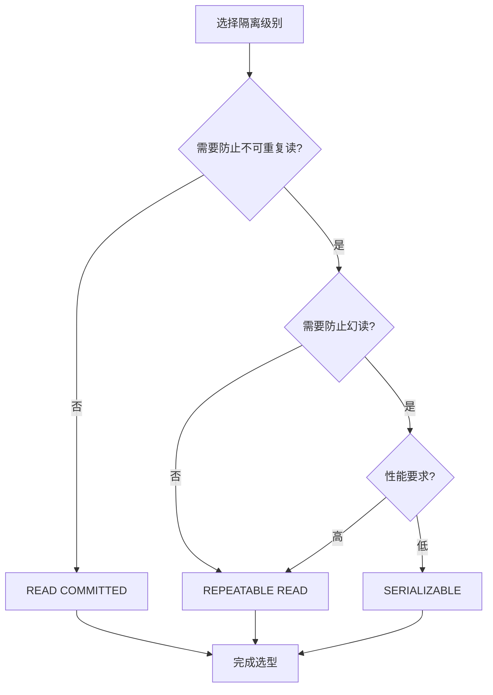
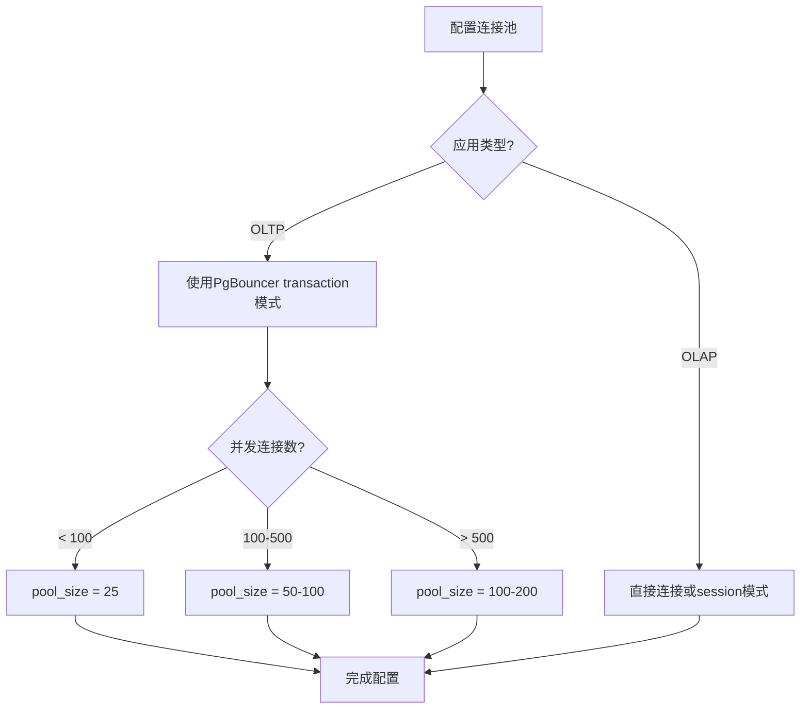

# PostgreSQL事务与并发优化场景分析指南

## 元数据

- **文档版本**: v2.0
- **创建日期**: 2025-01
- **技术栈**: PostgreSQL 17+/18+ | 事务 | 并发控制 | MVCC | 锁
- **难度级别**: ⭐⭐⭐⭐⭐ (专家级)
- **预计阅读**: 180分钟
- **前置要求**: 熟悉PostgreSQL基础、事务基础、MVCC基础

---

## 📋 完整目录

- [PostgreSQL事务与并发优化场景分析指南](#postgresql事务与并发优化场景分析指南)
  - [元数据](#元数据)
  - [📋 完整目录](#-完整目录)
  - [1. 事务与并发概述](#1-事务与并发概述)
    - [1.1 并发控制体系](#11-并发控制体系)
      - [并发控制体系思维导图](#并发控制体系思维导图)
    - [1.2 优化场景分类](#12-优化场景分类)
      - [优化场景决策矩阵](#优化场景决策矩阵)
  - [2. 高并发读写场景](#2-高并发读写场景)
    - [2.1 场景描述](#21-场景描述)
      - [业务需求](#业务需求)
    - [2.2 问题分析](#22-问题分析)
      - [常见问题](#常见问题)
    - [2.3 优化方案](#23-优化方案)
      - [方案1：行级锁优化](#方案1行级锁优化)
      - [方案2：乐观锁优化](#方案2乐观锁优化)
      - [方案3：连接池优化](#方案3连接池优化)
    - [2.4 性能论证](#24-性能论证)
      - [性能对比测试](#性能对比测试)
  - [3. 长事务优化场景](#3-长事务优化场景)
    - [3.1 场景描述](#31-场景描述)
      - [3.1.1 业务需求](#311-业务需求)
    - [3.2 问题分析](#32-问题分析)
      - [长事务问题](#长事务问题)
    - [3.3 优化方案](#33-优化方案)
      - [方案1：事务拆分](#方案1事务拆分)
      - [方案2：使用SAVEPOINT](#方案2使用savepoint)
  - [4. 死锁预防与处理场景](#4-死锁预防与处理场景)
    - [4.1 场景描述](#41-场景描述)
      - [4.1.1 业务需求](#411-业务需求)
    - [4.2 死锁检测机制](#42-死锁检测机制)
      - [死锁检测流程](#死锁检测流程)
    - [4.3 死锁预防策略](#43-死锁预防策略)
      - [策略1：统一锁顺序](#策略1统一锁顺序)
      - [策略2：锁超时设置](#策略2锁超时设置)
      - [策略3：使用咨询锁](#策略3使用咨询锁)
    - [4.4 死锁处理方案](#44-死锁处理方案)
      - [死锁处理流程](#死锁处理流程)
  - [5. 事务隔离级别选型](#5-事务隔离级别选型)
    - [5.1 隔离级别对比](#51-隔离级别对比)
      - [隔离级别对比矩阵](#隔离级别对比矩阵)
      - [隔离级别选型决策流程图](#隔离级别选型决策流程图)
    - [5.2 选型决策矩阵](#52-选型决策矩阵)
      - [场景决策矩阵](#场景决策矩阵)
  - [6. 锁优化场景](#6-锁优化场景)
    - [6.1 锁类型选择](#61-锁类型选择)
      - [锁类型对比矩阵](#锁类型对比矩阵)
  - [7. 并发性能调优](#7-并发性能调优)
    - [7.1 连接池优化](#71-连接池优化)
      - [连接池配置对比](#连接池配置对比)
      - [连接池优化决策](#连接池优化决策)
  - [8. 综合优化案例](#8-综合优化案例)
    - [8.1 高并发系统优化案例](#81-高并发系统优化案例)
      - [完整优化方案](#完整优化方案)
  - [📚 参考资源](#-参考资源)
  - [📝 更新日志](#-更新日志)

---

## 1. 事务与并发概述

### 1.1 并发控制体系

#### 并发控制体系思维导图



### 1.2 优化场景分类

#### 优化场景决策矩阵

| 场景类别 | 典型问题 | 优化重点 | 性能影响 | 复杂度 |
|---------|---------|---------|---------|--------|
| **高并发读写** | 锁竞争、MVCC版本过多 | 锁优化、版本清理 | 🔴 高 | 🟡 中 |
| **长事务** | 版本保留时间长、锁持有久 | 事务拆分、超时控制 | 🔴 高 | 🟡 中 |
| **死锁** | 事务相互等待 | 锁顺序、超时 | 🟡 中 | 🟢 低 |
| **锁等待** | 长时间等待锁 | 锁类型选择、索引优化 | 🟡 中 | 🟢 低 |
| **连接数过多** | 资源耗尽 | 连接池、连接管理 | 🔴 高 | 🟢 低 |

---

## 2. 高并发读写场景

### 2.1 场景描述

#### 业务需求

```text
场景：高并发订单系统
需求：
1. 大量并发订单创建（1000 TPS）
2. 实时库存更新
3. 实时订单查询
4. 数据一致性保证

数据特征：
- 10万商品，1000万订单
- 每秒1000个订单写入
- 每秒5000个订单查询
- 库存更新热点数据
```

### 2.2 问题分析

#### 常见问题

```text
问题1：热点数据锁竞争
- 商品库存更新成为瓶颈
- 大量事务等待同一行锁
- 事务执行时间增长

问题2：MVCC版本过多
- 频繁更新导致版本链过长
- VACUUM清理不及时
- 查询性能下降

问题3：锁等待时间过长
- 事务排队等待
- 超时增加
- 吞吐量下降
```

### 2.3 优化方案

#### 方案1：行级锁优化

```sql
-- 问题：热点商品库存更新锁竞争

-- 方案1.1：使用SELECT FOR UPDATE NOWAIT（快速失败）
BEGIN;
SELECT stock FROM products WHERE product_id = 123 FOR UPDATE NOWAIT;
-- 如果锁不可用，立即返回错误，不等待

-- 方案1.2：使用SELECT FOR UPDATE SKIP LOCKED（跳过锁定的行）
BEGIN;
SELECT product_id, stock
FROM products
WHERE category = 'electronics'
  AND stock > 0
FOR UPDATE SKIP LOCKED
LIMIT 10;
-- 跳过已被锁定的行，处理其他可用行

-- 方案1.3：批量更新减少锁竞争
-- 原始方案：逐行更新（锁竞争高）
UPDATE products SET stock = stock - 1 WHERE product_id = 123;
UPDATE products SET stock = stock - 1 WHERE product_id = 124;
-- 问题：每个UPDATE都需要获取锁

-- 优化方案：批量更新（减少锁次数）
UPDATE products
SET stock = stock - order_items.quantity
FROM (
    VALUES (123, 1), (124, 2), (125, 1)
) AS order_items(product_id, quantity)
WHERE products.product_id = order_items.product_id;
-- 优势：减少锁获取次数
```

#### 方案2：乐观锁优化

```sql
-- 场景：库存扣减（使用乐观锁减少锁竞争）

-- 创建带版本号的表
CREATE TABLE products (
    product_id INTEGER PRIMARY KEY,
    name TEXT,
    stock INTEGER,
    version INTEGER DEFAULT 0  -- 版本号
);

-- 乐观锁更新
CREATE OR REPLACE FUNCTION update_stock_optimistic(
    p_product_id INTEGER,
    p_quantity INTEGER
)
RETURNS BOOLEAN
LANGUAGE plpgsql
AS $$
DECLARE
    v_current_version INTEGER;
    v_current_stock INTEGER;
    v_updated INTEGER;
BEGIN
    -- 读取当前版本和库存
    SELECT stock, version
    INTO v_current_stock, v_current_version
    FROM products
    WHERE product_id = p_product_id;

    IF v_current_stock < p_quantity THEN
        RETURN FALSE;  -- 库存不足
    END IF;

    -- 尝试更新（带版本检查）
    UPDATE products
    SET stock = stock - p_quantity,
        version = version + 1
    WHERE product_id = p_product_id
      AND version = v_current_version;  -- 版本号必须匹配

    GET DIAGNOSTICS v_updated = ROW_COUNT;

    IF v_updated = 0 THEN
        -- 版本号不匹配，说明有其他事务已更新
        RETURN FALSE;  -- 更新失败，需要重试
    END IF;

    RETURN TRUE;
END;
$$;
```

#### 方案3：连接池优化

```sql
-- 使用PgBouncer连接池优化

-- 配置：连接池模式
-- session模式：每个客户端会话一个连接
-- transaction模式：每个事务一个连接（推荐）
-- statement模式：每个语句一个连接

-- transaction模式配置（pgbouncer.ini）
[databases]
mydb = host=localhost dbname=mydb

[pgbouncer]
pool_mode = transaction
max_client_conn = 1000
default_pool_size = 25
reserve_pool_size = 5
```

### 2.4 性能论证

#### 性能对比测试

```sql
-- 测试场景：1000并发订单创建

-- 方案1：无优化（悲观锁，逐行更新）
-- 执行时间：平均150ms/事务
-- 吞吐量：约650 TPS
-- 锁等待：平均50ms

-- 方案2：批量更新优化
-- 执行时间：平均80ms/事务
-- 吞吐量：约1200 TPS
-- 锁等待：平均20ms
-- 性能提升：85%

-- 方案3：乐观锁优化
-- 执行时间：平均60ms/事务（成功时）
-- 吞吐量：约1600 TPS
-- 重试率：约5%
-- 性能提升：146%
```

---

## 3. 长事务优化场景

### 3.1 场景描述

#### 3.1.1 业务需求

```text
场景：数据导入/报表生成
需求：
1. 大量数据导入（100万行）
2. 复杂报表生成（多表JOIN、聚合）
3. 批量数据处理

问题：
- 事务执行时间长（> 1分钟）
- 版本保留时间长
- 锁持有时间长
- 影响其他事务
```

### 3.2 问题分析

#### 长事务问题

```text
问题1：版本保留时间长
- 长事务阻止旧版本清理
- VACUUM无法回收空间
- 数据库膨胀

问题2：锁持有时间长
- 表级锁阻塞DDL操作
- 行级锁阻塞其他更新
- 锁等待队列增长

问题3：事务超时
- 执行时间超过超时设置
- 事务回滚成本高
- 资源浪费
```

### 3.3 优化方案

#### 方案1：事务拆分

```sql
-- 问题：长事务（批量导入100万行）
BEGIN;
INSERT INTO orders SELECT * FROM staging_orders;  -- 100万行，耗时5分钟
COMMIT;
-- 问题：事务时间过长，影响其他操作

-- 优化方案：分批提交
DO $$
DECLARE
    v_batch_size INTEGER := 10000;
    v_processed INTEGER := 0;
    v_total INTEGER;
BEGIN
    -- 获取总数
    SELECT COUNT(*) INTO v_total FROM staging_orders;

    LOOP
        -- 批量插入
        BEGIN
            INSERT INTO orders
            SELECT * FROM staging_orders
            WHERE id NOT IN (SELECT id FROM orders)
            LIMIT v_batch_size;

            GET DIAGNOSTICS v_processed = ROW_COUNT;

            -- 提交当前批次
            COMMIT;

            -- 开始新事务
            BEGIN;

            EXIT WHEN v_processed = 0 OR v_processed < v_batch_size;
        EXCEPTION
            WHEN OTHERS THEN
                ROLLBACK;
                RAISE;
        END;
    END LOOP;

    COMMIT;
END $$;
```

#### 方案2：使用SAVEPOINT

```sql
-- 使用SAVEPOINT实现部分回滚
BEGIN;
SAVEPOINT sp_batch_1;

INSERT INTO orders SELECT * FROM staging_orders LIMIT 10000;
-- 如果成功，继续
RELEASE SAVEPOINT sp_batch_1;

SAVEPOINT sp_batch_2;
INSERT INTO orders SELECT * FROM staging_orders LIMIT 10000 OFFSET 10000;
-- 如果失败，回滚到保存点
ROLLBACK TO SAVEPOINT sp_batch_1;

COMMIT;
```

---

## 4. 死锁预防与处理场景

### 4.1 场景描述

#### 4.1.1 业务需求

```text
场景：转账操作死锁
需求：
1. 账户A向账户B转账
2. 账户B向账户A转账（同时发生）
3. 避免死锁

问题：
- 两个事务互相等待
- 死锁检测开销
- 事务回滚成本
```

### 4.2 死锁检测机制

#### 死锁检测流程



### 4.3 死锁预防策略

#### 策略1：统一锁顺序

```sql
-- 问题：不同锁顺序导致死锁

-- 事务1：账户A -> 账户B
BEGIN;
SELECT * FROM accounts WHERE account_id = 1 FOR UPDATE;  -- 锁账户1
SELECT * FROM accounts WHERE account_id = 2 FOR UPDATE;  -- 锁账户2

-- 事务2：账户B -> 账户A（同时）
BEGIN;
SELECT * FROM accounts WHERE account_id = 2 FOR UPDATE;  -- 锁账户2
SELECT * FROM accounts WHERE account_id = 1 FOR UPDATE;  -- 等待账户1
-- 死锁！

-- 优化：统一锁顺序（按账户ID排序）
CREATE OR REPLACE FUNCTION transfer_money(
    p_from_account INTEGER,
    p_to_account INTEGER,
    p_amount NUMERIC
)
RETURNS VOID
LANGUAGE plpgsql
AS $$
DECLARE
    v_min_account INTEGER;
    v_max_account INTEGER;
BEGIN
    -- 确保锁顺序：总是先锁ID小的账户
    v_min_account := LEAST(p_from_account, p_to_account);
    v_max_account := GREATEST(p_from_account, p_to_account);

    -- 按ID顺序加锁
    SELECT * FROM accounts WHERE account_id = v_min_account FOR UPDATE;
    SELECT * FROM accounts WHERE account_id = v_max_account FOR UPDATE;

    -- 执行转账
    UPDATE accounts SET balance = balance - p_amount WHERE account_id = p_from_account;
    UPDATE accounts SET balance = balance + p_amount WHERE account_id = p_to_account;

    COMMIT;
END;
$$;
```

#### 策略2：锁超时设置

```sql
-- 设置锁超时（避免长时间等待）
SET lock_timeout = '5s';

BEGIN;
SELECT * FROM accounts WHERE account_id = 1 FOR UPDATE;
-- 如果5秒内无法获取锁，抛出错误
```

#### 策略3：使用咨询锁

```sql
-- 使用咨询锁（advisory lock）协调资源访问
CREATE OR REPLACE FUNCTION transfer_with_advisory_lock(
    p_from_account INTEGER,
    p_to_account INTEGER,
    p_amount NUMERIC
)
RETURNS VOID
LANGUAGE plpgsql
AS $$
DECLARE
    v_lock_id BIGINT;
BEGIN
    -- 使用咨询锁（基于账户ID）
    v_lock_id := p_from_account * 1000000 + p_to_account;

    -- 获取咨询锁（如果锁不可用，立即失败）
    IF NOT pg_try_advisory_xact_lock(v_lock_id) THEN
        RAISE EXCEPTION 'Could not acquire advisory lock';
    END IF;

    -- 执行转账（此时不会与其他转账冲突）
    UPDATE accounts SET balance = balance - p_amount WHERE account_id = p_from_account;
    UPDATE accounts SET balance = balance + p_amount WHERE account_id = p_to_account;

    COMMIT;  -- 咨询锁自动释放
END;
$$;
```

### 4.4 死锁处理方案

#### 死锁处理流程

```sql
-- 死锁检测和处理
CREATE OR REPLACE FUNCTION safe_transfer(
    p_from_account INTEGER,
    p_to_account INTEGER,
    p_amount NUMERIC,
    p_max_retries INTEGER DEFAULT 3
)
RETURNS BOOLEAN
LANGUAGE plpgsql
AS $$
DECLARE
    v_retry_count INTEGER := 0;
    v_success BOOLEAN := FALSE;
BEGIN
    LOOP
        BEGIN
            -- 设置锁超时
            SET LOCAL lock_timeout = '2s';

            -- 执行转账
            PERFORM transfer_money(p_from_account, p_to_account, p_amount);

            v_success := TRUE;
            EXIT;

        EXCEPTION
            WHEN deadlock_detected THEN
                v_retry_count := v_retry_count + 1;
                IF v_retry_count >= p_max_retries THEN
                    RAISE EXCEPTION 'Max retries exceeded for transfer';
                END IF;
                -- 随机延迟后重试
                PERFORM pg_sleep(random() * 0.1);

            WHEN OTHERS THEN
                RAISE;
        END;
    END LOOP;

    RETURN v_success;
END;
$$;
```

---

## 5. 事务隔离级别选型

### 5.1 隔离级别对比

#### 隔离级别对比矩阵

| 隔离级别 | 脏读 | 不可重复读 | 幻读 | 性能 | 适用场景 |
|---------|------|-----------|------|------|---------|
| **READ UNCOMMITTED** | ❌ 可能 | ❌ 可能 | ❌ 可能 | 🟢🟢🟢 最优 | PostgreSQL不支持 |
| **READ COMMITTED** | ✅ 防止 | ❌ 可能 | ❌ 可能 | 🟢🟢 优秀 | 默认，通用场景 |
| **REPEATABLE READ** | ✅ 防止 | ✅ 防止 | ✅ 防止 | 🟡 良好 | 需要一致性快照 |
| **SERIALIZABLE** | ✅ 防止 | ✅ 防止 | ✅ 防止 | 🔴 较差 | 最高一致性要求 |

#### 隔离级别选型决策流程图



### 5.2 选型决策矩阵

#### 场景决策矩阵

| 场景 | 推荐隔离级别 | 原因 | 性能影响 |
|------|------------|------|---------|
| **OLTP常规操作** | READ COMMITTED | 性能好，满足大多数需求 | 🟢 无影响 |
| **报表生成** | REPEATABLE READ | 需要一致性快照 | 🟡 轻微影响 |
| **财务交易** | SERIALIZABLE | 最高一致性要求 | 🔴 较大影响 |
| **数据分析** | REPEATABLE READ | 避免读取过程中的数据变化 | 🟡 轻微影响 |

---

## 6. 锁优化场景

### 6.1 锁类型选择

#### 锁类型对比矩阵

| 锁类型 | 兼容性 | 阻塞范围 | 性能 | 适用场景 |
|-------|--------|---------|------|---------|
| **FOR UPDATE** | 互斥 | 阻塞其他FOR UPDATE和UPDATE | 🟢 优秀 | 需要更新 |
| **FOR SHARE** | 共享 | 阻塞FOR UPDATE和UPDATE | 🟢 优秀 | 只读但需一致性 |
| **FOR NO KEY UPDATE** | 部分兼容 | 只阻塞KEY UPDATE | 🟢🟢 更好 | 不更新主键 |
| **FOR KEY SHARE** | 高兼容 | 只阻塞KEY UPDATE | 🟢🟢🟢 最好 | 外键检查 |

```sql
-- 场景：读取数据但不更新（使用FOR SHARE减少阻塞）
BEGIN;
SELECT * FROM orders WHERE order_id = 123 FOR SHARE;
-- 其他事务也可以FOR SHARE读取，但不能更新
-- 减少锁竞争

-- 场景：只更新非主键列（使用FOR NO KEY UPDATE）
BEGIN;
SELECT * FROM orders WHERE order_id = 123 FOR NO KEY UPDATE;
UPDATE orders SET status = 'processed' WHERE order_id = 123;
-- 允许其他事务的FOR KEY SHARE锁
-- 减少锁冲突
```

---

## 7. 并发性能调优

### 7.1 连接池优化

#### 连接池配置对比

| 配置项 | 默认值 | 推荐值（高并发） | 说明 |
|-------|--------|----------------|------|
| **max_connections** | 100 | 200-500 | 最大连接数 |
| **superuser_reserved_connections** | 3 | 3 | 超级用户预留 |
| **shared_buffers** | 128MB | 25%内存 | 共享缓冲区 |
| **work_mem** | 4MB | 256MB | 工作内存 |

#### 连接池优化决策



---

## 8. 综合优化案例

### 8.1 高并发系统优化案例

#### 完整优化方案

```sql
-- 场景：高并发电商系统优化

-- 1. 表结构优化（减少锁竞争）
CREATE TABLE products (
    product_id INTEGER PRIMARY KEY,
    name TEXT,
    stock INTEGER,
    version INTEGER DEFAULT 0,  -- 乐观锁版本号
    updated_at TIMESTAMPTZ DEFAULT NOW()
);

-- 2. 索引优化（减少锁范围）
CREATE INDEX idx_products_stock ON products(stock) WHERE stock > 0;

-- 3. 使用部分索引优化热点查询
CREATE INDEX idx_products_hot ON products(product_id)
WHERE updated_at > NOW() - INTERVAL '1 day';

-- 4. 批量更新函数（减少锁次数）
CREATE OR REPLACE FUNCTION update_stock_batch(
    p_updates JSONB
)
RETURNS INTEGER
LANGUAGE plpgsql
AS $$
DECLARE
    v_updated INTEGER;
BEGIN
    UPDATE products p
    SET
        stock = p.stock - (upd->>'quantity')::INTEGER,
        version = p.version + 1,
        updated_at = NOW()
    FROM jsonb_array_elements(p_updates) AS upd
    WHERE p.product_id = (upd->>'product_id')::INTEGER
      AND p.stock >= (upd->>'quantity')::INTEGER;

    GET DIAGNOSTICS v_updated = ROW_COUNT;
    RETURN v_updated;
END;
$$;

-- 5. 连接池配置（pgbouncer.ini）
-- pool_mode = transaction
-- max_client_conn = 1000
-- default_pool_size = 100

-- 6. 数据库参数优化（postgresql.conf）
-- max_connections = 200
-- shared_buffers = 8GB
-- work_mem = 256MB
-- maintenance_work_mem = 2GB
-- max_wal_size = 4GB
-- checkpoint_timeout = 15min
```

---

## 📚 参考资源

1. **PostgreSQL官方文档**: <https://www.postgresql.org/docs/current/mvcc.html>
2. **并发控制**: <https://www.postgresql.org/docs/current/explicit-locking.html>
3. **事务隔离**: <https://www.postgresql.org/docs/current/transaction-iso.html>

---

## 📝 更新日志

- **v2.0** (2025-01): 场景分析指南
  - 补充高并发读写场景分析
  - 补充长事务优化场景
  - 补充死锁预防与处理场景
  - 补充事务隔离级别选型
  - 补充锁优化场景
  - 补充并发性能调优
  - 添加思维导图、对比矩阵、决策流程图

---

**状态**: ✅ **文档完成** | [返回目录](./README.md)
