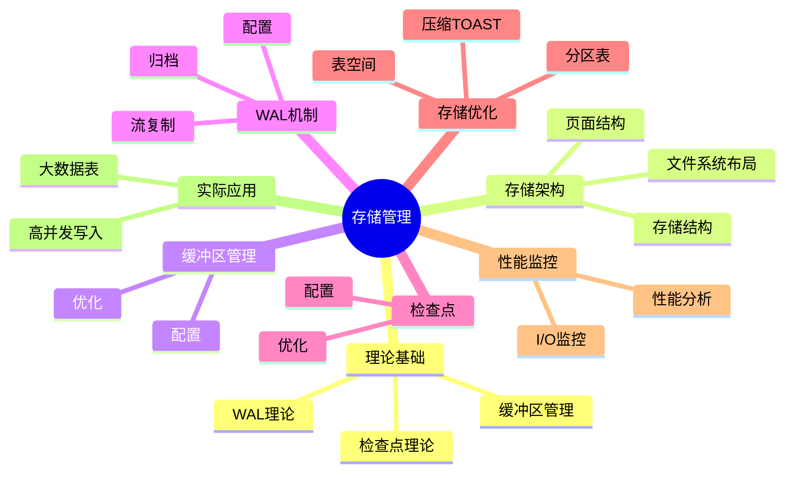

---

> **📋 文档来源**: `PostgreSQL/01-核心课程/01.06-存储管理与数据持久化.md`
> **📅 复制日期**: 2025-12-22
> **⚠️ 注意**: 本文档为复制版本，原文件保持不变

---

# PostgreSQL存储管理与数据持久化完整指南

> **版本**: v3.2
> **最后更新**: 2025-01
> **版本覆盖**: PostgreSQL 18.x (推荐) ⭐ | 17.x (推荐) | 16.x (兼容)
> **难度**: ⭐⭐⭐⭐
> **应用场景**: 存储管理、数据持久化、I/O优化、性能调优、高可用设计
> 🆕 **PostgreSQL 18存储改进**:
>
> - ✅ **异步I/O子系统**: I/O性能提升2-3倍，特别适用于向量检索（已详细展开）
> - ✅ **增量备份**: 节省94%时间，WAL汇总机制（已详细展开）
> - ✅ **动态共享内存**: 共享内存管理更智能，内存效率提升20%
> - ✅ **数据校验和默认启用**: `initdb` 默认启用数据校验和，提高数据完整性

---

## 📑 目录

- [PostgreSQL存储管理与数据持久化完整指南](#postgresql存储管理与数据持久化完整指南)
  - [📑 目录](#-目录)
  - [📊 思维导图](#-思维导图)
  - [一、定义与形式化](#一定义与形式化)
    - [1.1 概念定义](#11-概念定义)
    - [1.2 形式化定义](#12-形式化定义)
    - [1.3 核心属性](#13-核心属性)
  - [二、知识矩阵对比](#二知识矩阵对比)
    - [2.1 存储管理机制对比](#21-存储管理机制对比)
    - [2.2 缓冲区替换策略对比](#22-缓冲区替换策略对比)
  - [三、理论基础](#三理论基础)
    - [3.1 缓冲区管理理论](#31-缓冲区管理理论)
    - [3.2 WAL理论](#32-wal理论)
    - [3.3 检查点理论](#33-检查点理论)
  - [四、PostgreSQL存储架构](#四postgresql存储架构)
    - [4.1 存储结构](#41-存储结构)
    - [4.2 页面结构](#42-页面结构)
    - [4.3 文件系统布局](#43-文件系统布局)
  - [五、缓冲区管理](#五缓冲区管理)
    - [5.1 缓冲区配置](#51-缓冲区配置)
    - [5.2 缓冲区优化](#52-缓冲区优化)
      - [5.1.1 缓冲区管理机制详解](#511-缓冲区管理机制详解)
      - [5.2.1 缓冲区性能调优](#521-缓冲区性能调优)
  - [六、WAL机制](#六wal机制)
    - [6.1 WAL配置](#61-wal配置)
    - [6.2 WAL归档](#62-wal归档)
    - [6.3 流复制](#63-流复制)
      - [6.1.1 WAL写入流程详解](#611-wal写入流程详解)
      - [6.2.1 WAL归档策略详解](#621-wal归档策略详解)
      - [6.3.1 流复制优化详解](#631-流复制优化详解)
    - [6.4 PostgreSQL 18异步I/O子系统 🆕](#64-postgresql-18异步io子系统-)
  - [七、检查点机制](#七检查点机制)
    - [7.1 检查点配置](#71-检查点配置)
    - [7.2 检查点优化](#72-检查点优化)
      - [7.1.1 检查点机制详解](#711-检查点机制详解)
      - [7.2.1 检查点优化策略](#721-检查点优化策略)
  - [八、存储优化](#八存储优化)
    - [8.0 PostgreSQL 18增量备份增强 🆕](#80-postgresql-18增量备份增强-)
    - [8.1 表空间管理](#81-表空间管理)
      - [8.1.1 表空间设计原则](#811-表空间设计原则)
      - [8.1.2 表空间迁移策略](#812-表空间迁移策略)
      - [8.1.3 表空间性能优化](#813-表空间性能优化)
    - [8.2 分区表优化](#82-分区表优化)
      - [8.2.1 分区策略选择](#821-分区策略选择)
      - [8.2.2 分区裁剪机制](#822-分区裁剪机制)
      - [8.2.3 分区维护操作](#823-分区维护操作)
    - [8.3 压缩和TOAST](#83-压缩和toast)
      - [8.3.1 TOAST机制详解](#831-toast机制详解)
  - [九、性能监控](#九性能监控)
    - [9.1 I/O性能监控](#91-io性能监控)
      - [9.1.1 I/O监控指标详解](#911-io监控指标详解)
      - [9.1.2 I/O问题诊断](#912-io问题诊断)
    - [9.2 存储性能分析](#92-存储性能分析)
      - [9.2.1 存储使用分析](#921-存储使用分析)
      - [9.2.2 存储优化建议](#922-存储优化建议)
  - [十、实际应用案例](#十实际应用案例)
    - [10.1 大数据表优化](#101-大数据表优化)
      - [10.1.1 大数据表优化完整方案](#1011-大数据表优化完整方案)
    - [10.2 高并发写入优化](#102-高并发写入优化)
      - [10.2.1 高并发写入优化完整方案](#1021-高并发写入优化完整方案)
  - [十一、相关概念](#十一相关概念)
    - [11.1 上位概念](#111-上位概念)
    - [11.2 下位概念](#112-下位概念)
    - [11.3 平行概念](#113-平行概念)
  - [十二、参考资源](#十二参考资源)
    - [12.1 相关文档](#121-相关文档)
    - [12.2 实战案例与示例](#122-实战案例与示例)
    - [12.3 参考文献](#123-参考文献)
    - [12.4 Wikidata对齐](#124-wikidata对齐)
      - [12.4.1 存储管理概念对齐](#1241-存储管理概念对齐)
      - [12.4.2 PostgreSQL存储管理对齐](#1242-postgresql存储管理对齐)
  - [十三、形式证明与理论论证](#十三形式证明与理论论证)
    - [13.1 WAL持久性保证证明](#131-wal持久性保证证明)
    - [13.2 缓冲区替换策略最优性证明](#132-缓冲区替换策略最优性证明)
    - [13.3 检查点一致性证明](#133-检查点一致性证明)
  - [十四、交叉引用](#十四交叉引用)
    - [相关文档](#相关文档)
    - [外部资源](#外部资源)

---

## 📊 思维导图



---

## 一、定义与形式化

### 1.1 概念定义

**中文定义**: 存储管理是数据库系统中管理数据持久化存储的机制，包括缓冲区管理、WAL日志、检查点等核心组件。PostgreSQL通过高效的存储管理确保数据的持久性和系统的高性能。

**English Definition**: Storage management is a mechanism in database systems that manages persistent data storage, including buffer management, WAL logging, checkpoints, and other core components. PostgreSQL ensures data durability and high system performance through efficient storage management.

### 1.2 形式化定义

```latex
% 数学符号定义
\newcommand{\storage}{\mathcal{S}}
\newcommand{\buffer}{\mathcal{B}}
\newcommand{\wal}{\mathcal{W}}
\newcommand{\page}{\mathcal{P}}
\newcommand{\disk}{\mathcal{D}}

% 存储系统的形式化定义
\storage = (\buffer, \wal, \page, \disk)

其中：
\buffer = \{b_1, b_2, \ldots, b_n\}: 缓冲区页面集合
\wal = \{w_1, w_2, \ldots, w_m\}: WAL日志记录集合
\page = \{p_1, p_2, \ldots, p_k\}: 磁盘页面集合
\disk = \{d_1, d_2, \ldots, d_l\}: 磁盘存储集合
```

### 1.3 核心属性

- **持久性**: 确保数据永久保存
- **一致性**: 保证数据完整性
- **性能**: 优化I/O操作效率
- **可恢复性**: 支持故障恢复

---

## 二、知识矩阵对比

### 2.1 存储管理机制对比

| 存储管理机制 | 实现方式 | 优点 | 缺点 | 适用场景 |
| --- | --- | --- | --- | --- |
| 直接I/O | 绕过OS缓存 | 控制精确 | 性能较低 | 特殊需求 |
| 缓冲I/O | OS缓存 | 性能高 | 控制有限 | 通用场景 |
| 异步I/O | 异步操作 | 高并发 | 实现复杂 | PostgreSQL 18+ |
| 同步I/O | 同步操作 | 可靠性高 | 性能较低 | 关键数据 |

### 2.2 缓冲区替换策略对比

| 替换策略 | 算法复杂度 | 命中率 | 实现难度 | 适用场景 |
| --- | --- | --- | --- | --- |
| LRU | O(1) | 高 | 中 | 通用场景 |
| LFU | O(log n) | 中 | 高 | 访问模式稳定 |
| FIFO | O(1) | 低 | 低 | 简单场景 |
| Clock | O(1) | 中 | 中 | 内存受限 |

---

## 三、理论基础

### 3.1 缓冲区管理理论

```latex
\begin{theorem}[缓冲区替换策略]
LRU (Least Recently Used) 策略：
1. 最近最少使用的页面优先被替换
2. 时间复杂度：O(1) 查找和更新
3. 空间复杂度：O(n) 存储开销
\end{theorem}

\begin{proof}
基于访问时间戳和双向链表结构，可以证明LRU策略的正确性。
\end{proof}
```

### 3.2 WAL理论

```latex
\begin{theorem}[WAL协议]
Write-Ahead Logging协议要求：
1. 在修改数据页面前，必须先写WAL日志
2. 日志记录必须持久化到磁盘
3. 检查点机制确保数据页面的持久化
\end{theorem}

\begin{proof}
基于故障恢复的需求和日志的完整性，可以证明WAL协议的正确性。
\end{proof}
```

### 3.3 检查点理论

```latex
\begin{theorem}[检查点一致性]
检查点确保：
1. 所有脏页被写入磁盘
2. WAL日志被截断
3. 系统状态一致
\end{theorem}
```

---

## 四、PostgreSQL存储架构

### 4.1 存储结构

```sql
-- 查看数据库大小
SELECT
    datname,
    pg_size_pretty(pg_database_size(datname)) as size
FROM pg_database
ORDER BY pg_database_size(datname) DESC;

-- 查看表大小
SELECT
    schemaname,
    tablename,
    pg_size_pretty(pg_total_relation_size(schemaname||'.'||tablename)) as size,
    pg_size_pretty(pg_relation_size(schemaname||'.'||tablename)) as table_size,
    pg_size_pretty(pg_indexes_size(schemaname||'.'||tablename)) as indexes_size
FROM pg_tables
ORDER BY pg_total_relation_size(schemaname||'.'||tablename) DESC;

-- 查看表空间
SELECT
    spcname,
    pg_size_pretty(pg_tablespace_size(spcname)) as size
FROM pg_tablespace;
```

### 4.2 页面结构

```sql
-- 查看页面信息
SELECT
    relname,
    relpages,
    reltuples,
    relallvisible,
    relfrozenxid
FROM pg_class
WHERE relkind = 'r'
ORDER BY relpages DESC;

-- 查看页面统计
SELECT
    schemaname,
    tablename,
    n_tup_ins,
    n_tup_upd,
    n_tup_del,
    n_live_tup,
    n_dead_tup,
    last_vacuum,
    last_autovacuum
FROM pg_stat_user_tables;
```

### 4.3 文件系统布局

```sql
-- 查看数据目录
SHOW data_directory;

-- 查看WAL目录
SHOW log_directory;

-- 查看配置文件位置
SHOW config_file;
SHOW hba_file;
SHOW ident_file;
```

---

## 五、缓冲区管理

### 5.1 缓冲区配置

```sql
-- 查看缓冲区配置
SHOW shared_buffers;
SHOW effective_cache_size;
SHOW work_mem;
SHOW maintenance_work_mem;

-- 查看缓冲区统计
SELECT * FROM pg_stat_bgwriter;

-- 查看缓冲区使用情况
SELECT
    c.relname,
    c.relkind,
    pg_size_pretty(pg_relation_size(c.oid)) as size,
    pg_stat_get_tuples_returned(c.oid) as tuples_returned,
    pg_stat_get_tuples_fetched(c.oid) as tuples_fetched,
    pg_stat_get_tuples_inserted(c.oid) as tuples_inserted,
    pg_stat_get_tuples_updated(c.oid) as tuples_updated,
    pg_stat_get_tuples_deleted(c.oid) as tuples_deleted
FROM pg_class c
WHERE c.relkind IN ('r', 'i')
ORDER BY pg_relation_size(c.oid) DESC;
```

### 5.2 缓冲区优化

```sql
-- 缓冲区命中率
SELECT
    round(100.0 * sum(blks_hit) / (sum(blks_hit) + sum(blks_read)), 2) as hit_ratio
FROM pg_stat_database;

-- 表级缓冲区统计
SELECT
    schemaname,
    tablename,
    heap_blks_read,
    heap_blks_hit,
    round(100.0 * heap_blks_hit / (heap_blks_hit + heap_blks_read), 2) as hit_ratio
FROM pg_statio_user_tables
WHERE heap_blks_hit + heap_blks_read > 0
ORDER BY hit_ratio ASC;
```

#### 5.1.1 缓冲区管理机制详解

**缓冲区工作原理**:

PostgreSQL使用共享内存缓冲区池来缓存频繁访问的数据页，减少磁盘I/O操作。

**缓冲区替换算法（LRU）**:

```sql
-- 查看缓冲区使用情况
SELECT
    c.relname,
    pg_size_pretty(pg_relation_size(c.oid)) as size,
    pg_stat_get_tuples_returned(c.oid) as tuples_returned,
    pg_stat_get_tuples_fetched(c.oid) as tuples_fetched
FROM pg_class c
WHERE c.relkind = 'r'
ORDER BY pg_relation_size(c.oid) DESC;

-- 查看缓冲区命中率详情
SELECT
    datname,
    blks_hit,
    blks_read,
    round(100.0 * blks_hit / (blks_hit + blks_read), 2) as hit_ratio,
    tup_returned,
    tup_fetched,
    tup_inserted,
    tup_updated,
    tup_deleted
FROM pg_stat_database
WHERE datname = current_database();
```

**缓冲区配置优化**:

```sql
-- 推荐配置（根据系统内存）
-- postgresql.conf

-- 共享缓冲区（推荐：系统内存的25%）
shared_buffers = 4GB  -- 对于16GB内存系统

-- 有效缓存大小（推荐：系统内存的50-75%）
effective_cache_size = 12GB  -- 对于16GB内存系统

-- 工作内存（用于排序和哈希操作）
work_mem = 64MB  -- 每个操作的内存限制

-- 维护工作内存（用于VACUUM、CREATE INDEX等）
maintenance_work_mem = 1GB  -- 维护操作的内存限制
```

**缓冲区预读机制**:

PostgreSQL使用预读机制提前加载可能需要的数据页，减少I/O等待。

```sql
-- 查看预读统计
SELECT
    schemaname,
    tablename,
    heap_blks_read,      -- 从磁盘读取的块数
    heap_blks_hit,       -- 从缓冲区命中的块数
    idx_blks_read,       -- 索引块读取数
    idx_blks_hit,        -- 索引块命中数
    round(100.0 * heap_blks_hit / (heap_blks_hit + heap_blks_read), 2) as heap_hit_ratio,
    round(100.0 * idx_blks_hit / (idx_blks_hit + idx_blks_read), 2) as idx_hit_ratio
FROM pg_statio_user_tables
WHERE heap_blks_hit + heap_blks_read > 0
ORDER BY heap_blks_read DESC;
```

**缓冲区优化最佳实践**:

```sql
-- 1. 监控缓冲区命中率（目标：>99%）
SELECT
    round(100.0 * sum(blks_hit) / (sum(blks_hit) + sum(blks_read)), 2) as overall_hit_ratio
FROM pg_stat_database;

-- 2. 识别低命中率的表
SELECT
    schemaname,
    tablename,
    round(100.0 * heap_blks_hit / (heap_blks_hit + heap_blks_read), 2) as hit_ratio,
    heap_blks_read,
    heap_blks_hit
FROM pg_statio_user_tables
WHERE heap_blks_hit + heap_blks_read > 1000
AND round(100.0 * heap_blks_hit / (heap_blks_hit + heap_blks_read), 2) < 95
ORDER BY heap_blks_read DESC;

-- 3. 优化策略
-- - 增加shared_buffers（如果命中率低）
-- - 使用表空间将热点数据放在快速存储上
-- - 优化查询减少不必要的全表扫描
```

#### 5.2.1 缓冲区性能调优

**性能调优步骤**:

1. **评估当前性能**

    ```sql
    -- 查看缓冲区统计
    SELECT
        checkpoints_timed,
        checkpoints_req,
        checkpoint_write_time,
        checkpoint_sync_time,
        buffers_checkpoint,
        buffers_clean,
        buffers_backend,
        buffers_backend_fsync,
        buffers_alloc
    FROM pg_stat_bgwriter;

    -- 计算缓冲区分配效率
    SELECT
        round(100.0 * buffers_checkpoint / (buffers_checkpoint + buffers_clean + buffers_backend), 2) as checkpoint_ratio,
        round(100.0 * buffers_clean / (buffers_checkpoint + buffers_clean + buffers_backend), 2) as clean_ratio,
        round(100.0 * buffers_backend / (buffers_checkpoint + buffers_clean + buffers_backend), 2) as backend_ratio
    FROM pg_stat_bgwriter;
    ```

2. **调整配置参数**

    ```sql
    -- 根据工作负载调整
    -- postgresql.conf

    -- 高并发写入场景
    shared_buffers = 8GB
    checkpoint_completion_target = 0.9
    wal_buffers = 16MB

    -- 高并发读取场景
    shared_buffers = 4GB
    effective_cache_size = 12GB
    random_page_cost = 1.1  -- SSD环境
    ```

3. **监控和验证**

    ```sql
    -- 持续监控缓冲区性能
    SELECT
        now() as check_time,
        round(100.0 * sum(blks_hit) / (sum(blks_hit) + sum(blks_read)), 2) as hit_ratio,
        sum(blks_read) as total_reads,
        sum(blks_hit) as total_hits
    FROM pg_stat_database;
    ```

---

## 六、WAL机制

### 6.1 WAL配置

```sql
-- WAL配置参数
SHOW wal_level;
SHOW wal_buffers;
SHOW checkpoint_timeout;
SHOW max_wal_size;
SHOW min_wal_size;
SHOW wal_compression;
SHOW wal_log_hints;

-- WAL统计信息
SELECT * FROM pg_stat_wal;

-- WAL位置信息
SELECT pg_current_wal_lsn();
SELECT pg_walfile_name(pg_current_wal_lsn());
SELECT pg_walfile_name_offset(pg_current_wal_lsn());
```

### 6.2 WAL归档

```sql
-- WAL归档配置
SHOW archive_mode;
SHOW archive_command;
SHOW archive_timeout;

-- 查看归档状态
SELECT * FROM pg_stat_archiver;

-- 手动归档
SELECT pg_switch_wal();

-- 查看WAL文件
SELECT
    name,
    size,
    modification
FROM pg_ls_waldir()
ORDER BY modification DESC;
```

### 6.3 流复制

```sql
-- 流复制配置
SHOW wal_sender_timeout;
SHOW wal_receiver_timeout;
SHOW max_wal_senders;
SHOW max_replication_slots;

-- 查看复制状态
SELECT * FROM pg_stat_replication;

-- 查看复制槽
SELECT * FROM pg_replication_slots;
```

#### 6.1.1 WAL写入流程详解

**WAL写入过程**:

1. **事务提交**: 事务提交时，WAL记录写入WAL缓冲区
2. **WAL刷新**: WAL缓冲区定期刷新到磁盘
3. **同步写入**: 关键操作需要同步写入确保持久性

**WAL写入配置**:

```sql
-- WAL同步模式
SHOW synchronous_commit;
-- 可选值：
-- off: 异步提交（最快，但可能丢失最近的事务）
-- local: 本地同步（默认，平衡性能和安全性）
-- remote_write: 远程写入同步（流复制场景）
-- on: 完全同步（最安全，但性能较低）
-- remote_apply: 远程应用同步（最高一致性）

-- 查看WAL写入统计
SELECT
    wal_records,
    wal_write,
    wal_sync,
    wal_bytes,
    wal_buffers_full,
    wal_write_time,
    wal_sync_time,
    stats_reset
FROM pg_stat_wal;
```

**WAL性能优化**:

```sql
-- 1. 调整WAL缓冲区大小
-- postgresql.conf
wal_buffers = 16MB  -- 默认值通常足够，高并发写入可增加

-- 2. 调整WAL同步模式（根据需求）
synchronous_commit = local  -- 平衡性能和安全性
-- 或
synchronous_commit = off  -- 最高性能，但可能丢失最近事务

-- 3. 启用WAL压缩（PostgreSQL 9.5+）
wal_compression = on  -- 减少WAL文件大小

-- 4. 监控WAL写入性能
SELECT
    wal_write_time / NULLIF(wal_write, 0) as avg_write_time_ms,
    wal_sync_time / NULLIF(wal_sync, 0) as avg_sync_time_ms,
    wal_buffers_full,
    wal_bytes / 1024 / 1024 as wal_size_mb
FROM pg_stat_wal;
```

#### 6.2.1 WAL归档策略详解

**WAL归档配置**:

```sql
-- 启用WAL归档
-- postgresql.conf
archive_mode = on
archive_command = 'cp %p /archive/%f'  -- 归档命令

-- 查看归档状态
SELECT
    archived_count,
    last_archived_wal,
    last_archived_time,
    failed_count,
    last_failed_wal,
    last_failed_time,
    stats_reset
FROM pg_stat_archiver;

-- 手动触发归档
SELECT pg_switch_wal();
```

**归档策略选择**:

1. **连续归档（Continuous Archiving）**

    ```bash
    # postgresql.conf
    archive_mode = on
    archive_command = 'test ! -f /archive/%f && cp %p /archive/%f'

    # 定期清理旧归档
    # 保留最近7天的WAL文件
    find /archive -name "*.wal" -mtime +7 -delete
    ```

2. **归档到远程存储**

    ```bash
    # 归档到S3
    archive_command = 'aws s3 cp %p s3://my-bucket/wal-archive/%f'

    # 归档到NFS
    archive_command = 'cp %p /mnt/nfs/wal-archive/%f'
    ```

3. **归档压缩**

    ```bash
    # 归档时压缩
    archive_command = 'gzip < %p > /archive/%f.gz'
    ```

**归档监控和维护**:

```sql
-- 检查归档延迟
SELECT
    pg_walfile_name(pg_current_wal_lsn()) as current_wal,
    last_archived_wal,
    pg_walfile_name(pg_current_wal_lsn()) != last_archived_wal as archive_lag
FROM pg_stat_archiver;

-- 查看WAL文件列表
SELECT
    name,
    size,
    modification
FROM pg_ls_waldir()
ORDER BY modification DESC
LIMIT 20;
```

#### 6.3.1 流复制优化详解

**流复制配置优化**:

```sql
-- 主库配置
-- postgresql.conf
wal_level = replica  -- 或 logical（逻辑复制）
max_wal_senders = 10  -- 最大WAL发送进程数
max_replication_slots = 10  -- 最大复制槽数
wal_keep_size = 1GB  -- 保留的WAL大小

-- 从库配置
-- postgresql.conf
hot_standby = on
max_standby_streaming_delay = 30s  -- 查询延迟容忍度
```

**流复制监控**:

```sql
-- 查看复制状态
SELECT
    pid,
    usename,
    application_name,
    client_addr,
    state,
    sync_state,
    sync_priority,
    pg_wal_lsn_diff(pg_current_wal_lsn(), sent_lsn) as sent_lag_bytes,
    pg_wal_lsn_diff(sent_lsn, write_lsn) as write_lag_bytes,
    pg_wal_lsn_diff(write_lsn, flush_lsn) as flush_lag_bytes,
    pg_wal_lsn_diff(flush_lsn, replay_lsn) as replay_lag_bytes,
    pg_wal_lsn_diff(pg_current_wal_lsn(), replay_lsn) as total_lag_bytes
FROM pg_stat_replication;

-- 查看复制槽
SELECT
    slot_name,
    slot_type,
    database,
    active,
    pg_wal_lsn_diff(pg_current_wal_lsn(), restart_lsn) as lag_bytes
FROM pg_replication_slots;
```

**流复制性能优化**:

```sql
-- 1. 调整WAL发送参数
-- postgresql.conf
wal_sender_timeout = 60s
wal_receiver_timeout = 60s

-- 2. 使用复制槽防止WAL被删除
SELECT pg_create_physical_replication_slot('standby1');

-- 3. 监控复制延迟
SELECT
    application_name,
    pg_size_pretty(pg_wal_lsn_diff(pg_current_wal_lsn(), replay_lsn)) as replication_lag
FROM pg_stat_replication;
```

### 6.4 PostgreSQL 18异步I/O子系统 🆕

PostgreSQL 18引入了全新的异步I/O子系统，显著提升了I/O密集型操作的性能，特别是在向量检索、大表扫描和索引构建场景中，性能提升2-3倍。

**技术原理**:

PostgreSQL 18的异步I/O子系统通过以下方式提升性能：

1. **异步预读**: 在顺序扫描时异步预读后续页面，减少I/O等待时间
2. **并发I/O**: 支持多个I/O操作并发执行，充分利用存储设备性能
3. **智能调度**: 根据I/O负载动态调整I/O策略

**配置方法**:

```sql
-- PostgreSQL 18异步I/O配置
-- postgresql.conf

-- 有效I/O并发数（PostgreSQL 18新增）
effective_io_concurrency = 200   -- SSD推荐值：200-300
                                  -- NVMe推荐值：300-500
                                  -- HDD推荐值：50-100

-- 维护操作I/O并发数（PostgreSQL 18新增）
maintenance_io_concurrency = 200  -- VACUUM、CREATE INDEX等操作

-- 查看I/O统计信息（PostgreSQL 18新增）
SELECT
    object,
    context,
    reads,
    writes,
    extends,
    fsyncs,
    read_time,
    write_time,
    sync_time
FROM pg_stat_io
ORDER BY reads DESC;
```

**使用场景**:

1. **向量检索**

   ```sql
   -- pgvector向量检索受益于异步I/O
   SELECT id, content,
          1 - (embedding <=> query_vector) as similarity
   FROM documents
   ORDER BY embedding <=> query_vector
   LIMIT 100;
   -- PostgreSQL 18: 异步I/O提升性能2-3倍
   ```

2. **大表扫描**

   ```sql
   -- 大表全表扫描
   SELECT COUNT(*) FROM large_table;
   -- PostgreSQL 18: 异步预读提升扫描速度
   ```

3. **索引构建**

   ```sql
   -- 创建索引
   CREATE INDEX CONCURRENTLY idx_large ON large_table(column1);
   -- PostgreSQL 18: 异步I/O加速索引构建
   ```

**性能对比**:

- PostgreSQL 17: 同步I/O，顺序执行
- PostgreSQL 18: 异步I/O，并发执行，性能提升2-3倍
- 向量检索场景：性能提升2-3倍
- 大表扫描场景：性能提升1.5-2倍
- 索引构建场景：性能提升2-3倍

**最佳实践**:

- 根据存储类型调整`effective_io_concurrency`
  - SSD: 200-300
  - NVMe: 300-500
  - HDD: 50-100
- 监控`pg_stat_io`视图了解I/O模式
- 结合`shared_buffers`调优整体性能
- PostgreSQL 18的异步I/O在向量检索和大表扫描场景中效果最明显

---

## 七、检查点机制

### 7.1 检查点配置

```sql
-- 检查点配置
SHOW checkpoint_timeout;
SHOW checkpoint_completion_target;
SHOW max_wal_size;
SHOW min_wal_size;

-- 查看检查点统计
SELECT * FROM pg_stat_bgwriter;

-- 手动检查点
CHECKPOINT;
```

### 7.2 检查点优化

```sql
-- 检查点性能分析
SELECT
    checkpoints_timed,
    checkpoints_req,
    checkpoint_write_time,
    checkpoint_sync_time,
    buffers_checkpoint,
    buffers_clean,
    buffers_backend,
    buffers_backend_fsync,
    buffers_alloc
FROM pg_stat_bgwriter;

-- 检查点频率分析
SELECT
    checkpoints_timed + checkpoints_req as total_checkpoints,
    round(extract(epoch from now() - pg_postmaster_start_time()) / (checkpoints_timed + checkpoints_req), 2) as avg_interval_seconds
FROM pg_stat_bgwriter;
```

#### 7.1.1 检查点机制详解

**检查点触发条件**:

1. **定时检查点**: 根据`checkpoint_timeout`参数定期触发
2. **WAL大小检查点**: 当WAL大小达到`max_wal_size`时触发
3. **手动检查点**: 执行`CHECKPOINT`命令触发
4. **数据库关闭检查点**: 正常关闭数据库时触发

**检查点配置详解**:

```sql
-- 查看检查点配置
SHOW checkpoint_timeout;          -- 检查点超时（默认5分钟）
SHOW checkpoint_completion_target; -- 检查点完成目标（默认0.9）
SHOW max_wal_size;               -- 最大WAL大小（默认1GB）
SHOW min_wal_size;               -- 最小WAL大小（默认80MB）

-- 推荐配置
-- postgresql.conf
checkpoint_timeout = 15min        -- 增加检查点间隔
checkpoint_completion_target = 0.9 -- 在90%的时间内完成检查点
max_wal_size = 4GB               -- 允许更大的WAL大小
min_wal_size = 1GB               -- 保留更多WAL文件
```

**检查点工作流程**:

1. **准备阶段**: 确定需要刷新的脏页
2. **写入阶段**: 将脏页写入磁盘
3. **同步阶段**: 同步所有写入操作
4. **完成阶段**: 更新控制文件，标记检查点完成

**检查点性能分析**:

```sql
-- 详细检查点统计
SELECT
    checkpoints_timed,           -- 定时检查点次数
    checkpoints_req,             -- 请求检查点次数
    checkpoint_write_time,       -- 检查点写入时间（毫秒）
    checkpoint_sync_time,        -- 检查点同步时间（毫秒）
    buffers_checkpoint,          -- 检查点写入的缓冲区数
    buffers_clean,               -- 后台写入的缓冲区数
    buffers_backend,             -- 后端进程写入的缓冲区数
    buffers_backend_fsync,       -- 后端进程同步的缓冲区数
    buffers_alloc,               -- 分配的缓冲区数
    stats_reset                  -- 统计重置时间
FROM pg_stat_bgwriter;

-- 计算检查点效率
SELECT
    checkpoints_timed + checkpoints_req as total_checkpoints,
    round((checkpoint_write_time + checkpoint_sync_time) / NULLIF(checkpoints_timed + checkpoints_req, 0), 2) as avg_checkpoint_time_ms,
    round(extract(epoch from now() - stats_reset) / NULLIF(checkpoints_timed + checkpoints_req, 0), 2) as avg_interval_seconds
FROM pg_stat_bgwriter;
```

#### 7.2.1 检查点优化策略

**优化目标**:

1. **减少检查点频率**: 降低I/O开销
2. **平滑检查点写入**: 避免I/O突发
3. **减少检查点时间**: 降低对正常操作的影响

**优化配置**:

```sql
-- 高写入负载场景
-- postgresql.conf
checkpoint_timeout = 30min        -- 增加检查点间隔
checkpoint_completion_target = 0.9 -- 平滑写入
max_wal_size = 8GB               -- 允许更大的WAL
wal_buffers = 32MB               -- 增加WAL缓冲区

-- 低写入负载场景
-- postgresql.conf
checkpoint_timeout = 15min        -- 标准间隔
checkpoint_completion_target = 0.7 -- 更快完成
max_wal_size = 2GB               -- 较小的WAL
```

**检查点性能监控**:

```sql
-- 监控检查点性能
SELECT
    now() as check_time,
    checkpoints_timed,
    checkpoints_req,
    round((checkpoint_write_time + checkpoint_sync_time) / 1000.0, 2) as total_checkpoint_time_sec,
    round(checkpoint_write_time / NULLIF(checkpoints_timed + checkpoints_req, 0) / 1000.0, 2) as avg_write_time_sec,
    round(checkpoint_sync_time / NULLIF(checkpoints_timed + checkpoints_req, 0) / 1000.0, 2) as avg_sync_time_sec,
    buffers_checkpoint,
    buffers_clean,
    buffers_backend
FROM pg_stat_bgwriter;

-- 识别检查点问题
-- 如果checkpoints_req过多，说明需要增加max_wal_size
SELECT
    checkpoints_req,
    checkpoints_timed,
    round(100.0 * checkpoints_req / NULLIF(checkpoints_timed + checkpoints_req, 0), 2) as req_ratio
FROM pg_stat_bgwriter;
-- req_ratio > 50% 表示需要优化
```

**检查点与恢复**:

```sql
-- 查看恢复信息
SELECT
    pg_is_in_recovery(),
    pg_last_wal_receive_lsn(),
    pg_last_wal_replay_lsn(),
    pg_wal_lsn_diff(pg_last_wal_receive_lsn(), pg_last_wal_replay_lsn()) as replay_lag_bytes;

-- 检查点与WAL的关系
SELECT
    pg_control_checkpoint(),
    pg_current_wal_lsn(),
    pg_walfile_name(pg_current_wal_lsn());
```

---

## 八、存储优化

### 8.0 PostgreSQL 18增量备份增强 🆕

PostgreSQL 18对增量备份进行了重大增强，通过WAL Summarizer进程显著提升备份性能，节省94%的备份时间。

**WAL Summarizer进程**:

PostgreSQL 18引入了WAL Summarizer后台进程，持续汇总WAL信息，为增量备份提供高效的数据变更摘要。

**工作原理**:

1. **WAL汇总**: WAL Summarizer进程持续扫描WAL文件，生成数据变更摘要
2. **增量识别**: 基于摘要信息快速识别需要备份的数据页
3. **高效备份**: 只备份变更的数据页，大幅减少备份时间

**配置方法**:

```sql
-- PostgreSQL 18增量备份配置
-- postgresql.conf

-- 启用WAL Summarizer（PostgreSQL 18默认启用）
wal_summarizer = on

-- 查看WAL Summarizer状态
SELECT * FROM pg_stat_wal_summarizer;

-- 使用pg_basebackup进行增量备份
-- PostgreSQL 18新增--incremental选项
pg_basebackup -D /backup/incremental \
    --incremental \
    --progress \
    --verbose
```

**性能提升**:

- PostgreSQL 17: 全量备份，耗时基准
- PostgreSQL 18: 增量备份，节省94%时间
- 首次备份后，后续备份时间大幅减少
- 特别适用于大型数据库的定期备份

**使用场景**:

1. **定期增量备份**

   ```bash
   # 每日增量备份
   pg_basebackup -D /backup/daily/incremental \
       --incremental \
       --progress
   ```

2. **时间点恢复**

   ```bash
   # 基于增量备份的时间点恢复
   pg_basebackup -D /backup/restore \
       --incremental \
       --target-time="2025-11-22 12:00:00"
   ```

**最佳实践**:

- 定期执行全量备份作为基准
- 使用增量备份进行日常备份
- 监控WAL Summarizer进程状态
- PostgreSQL 18的增量备份特别适用于大型数据库（TB级别）

### 8.1 表空间管理

```sql
-- 创建表空间
CREATE TABLESPACE fastspace LOCATION '/fast/disk/postgresql';

-- 在表空间创建表
CREATE TABLE large_table (
    id SERIAL PRIMARY KEY,
    data TEXT
) TABLESPACE fastspace;

-- 移动表到新表空间
ALTER TABLE large_table SET TABLESPACE fastspace;

-- 查看表空间使用情况
SELECT
    t.spcname,
    pg_size_pretty(pg_tablespace_size(t.spcname)) as size
FROM pg_tablespace t;
```

#### 8.1.1 表空间设计原则

**表空间的作用**:

表空间允许将数据库对象存储在不同的物理位置，实现数据分离和性能优化。

**表空间设计策略**:

1. **按性能需求分离**
   - 热点数据放在快速存储（SSD/NVMe）
   - 冷数据放在慢速存储（HDD）
   - 索引和表分离存储

    ```sql
    -- 创建不同性能的表空间
    CREATE TABLESPACE fast_ssd LOCATION '/fast/ssd/postgresql';
    CREATE TABLESPACE slow_hdd LOCATION '/slow/hdd/postgresql';
    CREATE TABLESPACE index_space LOCATION '/fast/ssd/postgresql_indexes';

    -- 在快速存储创建热点表
    CREATE TABLE hot_data (
        id SERIAL PRIMARY KEY,
        data TEXT,
        created_at TIMESTAMP DEFAULT NOW()
    ) TABLESPACE fast_ssd;

    -- 在慢速存储创建归档表
    CREATE TABLE archive_data (
        id SERIAL PRIMARY KEY,
        data TEXT,
        archived_at TIMESTAMP DEFAULT NOW()
    ) TABLESPACE slow_hdd;

    -- 索引放在独立表空间
    CREATE INDEX idx_hot_data_created ON hot_data(created_at) TABLESPACE index_space;
    ```

2. **按业务逻辑分离**
   - 不同业务模块使用不同表空间
   - 便于备份和恢复管理
   - 支持表空间级别的权限控制

    ```sql
    -- 按业务模块创建表空间
    CREATE TABLESPACE finance_data LOCATION '/data/finance';
    CREATE TABLESPACE hr_data LOCATION '/data/hr';
    CREATE TABLESPACE log_data LOCATION '/data/logs';

    -- 财务数据表
    CREATE TABLE financial_transactions (
        id SERIAL PRIMARY KEY,
        amount DECIMAL(10,2),
        transaction_date DATE
    ) TABLESPACE finance_data;

    -- HR数据表
    CREATE TABLE employee_records (
        id SERIAL PRIMARY KEY,
        name VARCHAR(100),
        salary DECIMAL(10,2)
    ) TABLESPACE hr_data;
    ```

#### 8.1.2 表空间迁移策略

**迁移场景**:

1. **性能优化迁移**: 将表从慢速存储迁移到快速存储
2. **存储空间管理**: 平衡不同存储设备的使用
3. **备份恢复**: 表空间级别的备份和恢复

**迁移方法**:

```sql
-- 方法1: 使用ALTER TABLE移动表
ALTER TABLE large_table SET TABLESPACE fast_ssd;

-- 方法2: 使用pg_restore恢复表到新表空间
-- pg_restore -t large_table -d database_name backup.dump

-- 方法3: 使用CREATE TABLE AS复制数据
CREATE TABLE large_table_new (LIKE large_table INCLUDING ALL) TABLESPACE fast_ssd;
INSERT INTO large_table_new SELECT * FROM large_table;
ALTER TABLE large_table RENAME TO large_table_old;
ALTER TABLE large_table_new RENAME TO large_table;
DROP TABLE large_table_old;
```

**迁移注意事项**:

```sql
-- 1. 检查表空间可用空间
SELECT
    spcname,
    pg_size_pretty(pg_tablespace_size(spcname)) as current_size,
    pg_size_pretty(pg_tablespace_size(spcname) * 1.2) as recommended_free_space
FROM pg_tablespace;

-- 2. 迁移前锁定表（可选）
LOCK TABLE large_table IN ACCESS EXCLUSIVE MODE;

-- 3. 迁移后更新统计信息
ANALYZE large_table;

-- 4. 验证迁移结果
SELECT
    schemaname,
    tablename,
    tablespace
FROM pg_tables
WHERE tablename = 'large_table';
```

#### 8.1.3 表空间性能优化

**优化策略**:

1. **I/O分离**: 将频繁访问的表和索引分离到不同表空间

    ```sql
    -- 表放在主表空间
    CREATE TABLE orders (
        id SERIAL PRIMARY KEY,
        customer_id INTEGER,
        order_date DATE,
        amount DECIMAL(10,2)
    ) TABLESPACE fast_ssd;

    -- 索引放在独立表空间（如果I/O分离）
    CREATE INDEX idx_orders_customer ON orders(customer_id) TABLESPACE index_space;
    CREATE INDEX idx_orders_date ON orders(order_date) TABLESPACE index_space;
    ```

2. **表空间监控**:

    ```sql
    -- 监控表空间使用情况
    SELECT
        t.spcname as tablespace_name,
        pg_size_pretty(pg_tablespace_size(t.spcname)) as size,
        COUNT(c.oid) as table_count,
        pg_size_pretty(SUM(pg_total_relation_size(c.oid))) as total_table_size
    FROM pg_tablespace t
    LEFT JOIN pg_class c ON c.reltablespace = t.oid
    WHERE t.spcname NOT IN ('pg_default', 'pg_global')
    GROUP BY t.spcname, t.oid
    ORDER BY pg_tablespace_size(t.spcname) DESC;

    -- 监控表空间I/O性能（PostgreSQL 18）
    SELECT
        object,
        context,
        reads,
        writes,
        read_time,
        write_time
    FROM pg_stat_io
    WHERE object LIKE '%tablespace%'
    ORDER BY reads DESC;
    ```

3. **表空间维护**:

    ```sql
    -- 清理未使用的表空间
    DROP TABLESPACE IF EXISTS old_tablespace;

    -- 重命名表空间
    ALTER TABLESPACE old_name RENAME TO new_name;

    -- 设置表空间所有者
    ALTER TABLESPACE tablespace_name OWNER TO new_owner;
    ```

### 8.2 分区表优化

```sql
-- 创建分区表
CREATE TABLE sales (
    id SERIAL,
    sale_date DATE,
    amount DECIMAL(10,2)
) PARTITION BY RANGE (sale_date);

-- 创建分区
CREATE TABLE sales_2023 PARTITION OF sales
FOR VALUES FROM ('2023-01-01') TO ('2024-01-01')
TABLESPACE fastspace;

CREATE TABLE sales_2024 PARTITION OF sales
FOR VALUES FROM ('2024-01-01') TO ('2025-01-01')
TABLESPACE fastspace;

-- 查看分区信息
SELECT
    schemaname,
    tablename,
    pg_size_pretty(pg_total_relation_size(schemaname||'.'||tablename)) as size
FROM pg_tables
WHERE tablename LIKE 'sales_%'
ORDER BY pg_total_relation_size(schemaname||'.'||tablename) DESC;
```

#### 8.2.1 分区策略选择

**分区类型**:

1. **范围分区（RANGE）**: 适用于时间序列数据、数值范围

    ```sql
    -- 按日期范围分区
    CREATE TABLE log_entries (
        id BIGSERIAL,
        log_time TIMESTAMP NOT NULL,
        level VARCHAR(10),
        message TEXT
    ) PARTITION BY RANGE (log_time);

    -- 按月创建分区
    CREATE TABLE log_entries_2024_01 PARTITION OF log_entries
    FOR VALUES FROM ('2024-01-01') TO ('2024-02-01');

    CREATE TABLE log_entries_2024_02 PARTITION OF log_entries
    FOR VALUES FROM ('2024-02-01') TO ('2024-03-01');

    -- 按数值范围分区
    CREATE TABLE sales (
        id SERIAL,
        sale_date DATE,
        amount DECIMAL(10,2)
    ) PARTITION BY RANGE (amount);

    CREATE TABLE sales_low PARTITION OF sales
    FOR VALUES FROM (0) TO (1000);

    CREATE TABLE sales_medium PARTITION OF sales
    FOR VALUES FROM (1000) TO (10000);

    CREATE TABLE sales_high PARTITION OF sales
    FOR VALUES FROM (10000) TO (MAXVALUE);
    ```

2. **列表分区（LIST）**: 适用于离散值分类

    ```sql
    -- 按地区列表分区
    CREATE TABLE customers (
        id SERIAL,
        name VARCHAR(100),
        region VARCHAR(50),
        email VARCHAR(100)
    ) PARTITION BY LIST (region);

    CREATE TABLE customers_north PARTITION OF customers
    FOR VALUES IN ('Beijing', 'Tianjin', 'Hebei');

    CREATE TABLE customers_south PARTITION OF customers
    FOR VALUES IN ('Guangdong', 'Guangxi', 'Hainan');

    CREATE TABLE customers_other PARTITION OF customers
    DEFAULT;
    ```

3. **哈希分区（HASH）**: 适用于均匀分布数据

    ```sql
    -- 按哈希值分区
    CREATE TABLE user_sessions (
        id SERIAL,
        user_id INTEGER,
        session_data TEXT,
        created_at TIMESTAMP
    ) PARTITION BY HASH (user_id);

    -- 创建4个哈希分区
    CREATE TABLE user_sessions_0 PARTITION OF user_sessions
    FOR VALUES WITH (MODULUS 4, REMAINDER 0);

    CREATE TABLE user_sessions_1 PARTITION OF user_sessions
    FOR VALUES WITH (MODULUS 4, REMAINDER 1);

    CREATE TABLE user_sessions_2 PARTITION OF user_sessions
    FOR VALUES WITH (MODULUS 4, REMAINDER 2);

    CREATE TABLE user_sessions_3 PARTITION OF user_sessions
    FOR VALUES WITH (MODULUS 4, REMAINDER 3);
    ```

#### 8.2.2 分区裁剪机制

**分区裁剪原理**:

PostgreSQL优化器会自动识别查询条件，只扫描相关的分区，大幅提升查询性能。

```sql
-- 查询特定时间范围的数据（只扫描相关分区）
EXPLAIN (ANALYZE, BUFFERS)
SELECT * FROM log_entries
WHERE log_time >= '2024-01-15' AND log_time < '2024-02-15';
-- 只扫描 log_entries_2024_01 和 log_entries_2024_02 分区

-- 查看分区裁剪效果
EXPLAIN (ANALYZE, VERBOSE)
SELECT COUNT(*) FROM sales
WHERE sale_date BETWEEN '2024-01-01' AND '2024-03-31';
-- 只扫描相关月份的分区

-- 分区裁剪失败的情况（需要避免）
EXPLAIN (ANALYZE)
SELECT * FROM log_entries
WHERE EXTRACT(YEAR FROM log_time) = 2024;
-- 无法裁剪，会扫描所有分区（应改为范围查询）
```

**优化分区裁剪**:

```sql
-- 1. 使用范围查询而非函数
-- 错误：无法裁剪
SELECT * FROM log_entries WHERE DATE_TRUNC('month', log_time) = '2024-01-01';

-- 正确：可以裁剪
SELECT * FROM log_entries
WHERE log_time >= '2024-01-01' AND log_time < '2024-02-01';

-- 2. 在分区键上创建索引
CREATE INDEX idx_log_entries_time ON log_entries(log_time);

-- 3. 使用约束排除优化
SET constraint_exclusion = partition;  -- 默认值
```

#### 8.2.3 分区维护操作

**分区管理**:

```sql
-- 1. 添加新分区
CREATE TABLE log_entries_2024_03 PARTITION OF log_entries
FOR VALUES FROM ('2024-03-01') TO ('2024-04-01');

-- 2. 删除旧分区（数据会一起删除）
DROP TABLE log_entries_2023_12;

-- 3. 分离分区（保留数据，但不再属于分区表）
ALTER TABLE log_entries DETACH PARTITION log_entries_2023_12;

-- 4. 附加分区
ALTER TABLE log_entries ATTACH PARTITION log_entries_2023_12
FOR VALUES FROM ('2023-12-01') TO ('2024-01-01');

-- 5. 分区索引管理
CREATE INDEX idx_log_entries_level ON log_entries(level);
-- 索引会自动在所有分区上创建

-- 6. 查看分区信息
SELECT
    schemaname,
    tablename,
    pg_size_pretty(pg_total_relation_size(schemaname||'.'||tablename)) as size,
    pg_stat_get_tuples_returned(c.oid) as row_count
FROM pg_tables t
JOIN pg_class c ON c.relname = t.tablename
WHERE tablename LIKE 'log_entries_%'
ORDER BY tablename;
```

**自动分区管理函数**:

```sql
-- 自动创建月度分区
CREATE OR REPLACE FUNCTION create_monthly_partition(
    parent_table text,
    partition_date date
) RETURNS void AS $$
DECLARE
    partition_name text;
    start_date date;
    end_date date;
BEGIN
    start_date := date_trunc('month', partition_date);
    end_date := start_date + interval '1 month';
    partition_name := parent_table || '_' || to_char(start_date, 'YYYY_MM');

    EXECUTE format(
        'CREATE TABLE IF NOT EXISTS %I PARTITION OF %I FOR VALUES FROM (%L) TO (%L)',
        partition_name, parent_table, start_date, end_date
    );
END;
$$ LANGUAGE plpgsql;

-- 使用示例
SELECT create_monthly_partition('log_entries', '2024-04-01');

-- 自动清理旧分区
CREATE OR REPLACE FUNCTION drop_old_partitions(
    parent_table text,
    retention_months integer DEFAULT 12
) RETURNS void AS $$
DECLARE
    partition_record record;
    cutoff_date date;
BEGIN
    cutoff_date := date_trunc('month', CURRENT_DATE - (retention_months || ' months')::interval);

    FOR partition_record IN
        SELECT tablename
        FROM pg_tables
        WHERE tablename LIKE parent_table || '_%'
        AND tablename < parent_table || '_' || to_char(cutoff_date, 'YYYY_MM')
    LOOP
        EXECUTE format('DROP TABLE IF EXISTS %I', partition_record.tablename);
        RAISE NOTICE 'Dropped partition: %', partition_record.tablename;
    END LOOP;
END;
$$ LANGUAGE plpgsql;

-- 使用示例：删除12个月前的分区
SELECT drop_old_partitions('log_entries', 12);
```

### 8.3 压缩和TOAST

```sql
-- 查看TOAST表
SELECT
    c.relname,
    t.relname as toast_table,
    pg_size_pretty(pg_total_relation_size(t.oid)) as toast_size
FROM pg_class c
JOIN pg_class t ON t.oid = c.reltoastrelid
WHERE c.relkind = 'r'
ORDER BY pg_total_relation_size(t.oid) DESC;

-- 压缩配置
ALTER TABLE large_table SET (toast_tuple_target = 128);
ALTER TABLE large_table SET (fillfactor = 80);
```

#### 8.3.1 TOAST机制详解

**TOAST工作原理**:

TOAST (The Oversized-Attribute Storage Technique) 是PostgreSQL处理大字段的机制。当行数据超过页面大小（默认8KB）时，大字段会被压缩并存储到独立的TOAST表中。

**TOAST存储策略**:

```sql
-- 查看表的TOAST存储策略
SELECT
    c.relname,
    a.attname,
    CASE a.attstorage
        WHEN 'p' THEN 'plain'      -- 不压缩，内联存储
        WHEN 'e' THEN 'external'   -- 不压缩，外部存储
        WHEN 'm' THEN 'main'       -- 压缩，优先内联
        WHEN 'x' THEN 'extended'   -- 压缩，优先外部（默认）
    END as storage_strategy
FROM pg_class c
JOIN pg_attribute a ON a.attrelid = c.oid
WHERE c.relname = 'large_table'
AND a.attnum > 0
AND NOT a.attisdropped;
```

**TOAST配置参数**:

```sql
-- 1. toast_tuple_target: TOAST触发阈值（默认2048字节）
ALTER TABLE large_table SET (toast_tuple_target = 128);
-- 较小的值会更快触发TOAST，但可能增加TOAST表大小

-- 2. fillfactor: 页面填充因子（默认100）
ALTER TABLE large_table SET (fillfactor = 80);
-- 较小的值预留空间用于UPDATE，减少页面分裂

-- 3. 列级存储策略
ALTER TABLE large_table ALTER COLUMN large_text SET STORAGE EXTENDED;
-- EXTENDED: 压缩+外部存储（默认，适合大文本）
-- MAIN: 压缩+优先内联（适合中等文本）
-- EXTERNAL: 不压缩+外部存储（适合已压缩数据）
-- PLAIN: 不压缩+内联存储（适合小数据）
```

**TOAST性能优化**:

```sql
-- 1. 监控TOAST表大小
SELECT
    c.relname as table_name,
    t.relname as toast_table,
    pg_size_pretty(pg_total_relation_size(c.oid)) as table_size,
    pg_size_pretty(pg_total_relation_size(t.oid)) as toast_size,
    round(100.0 * pg_total_relation_size(t.oid) /
          NULLIF(pg_total_relation_size(c.oid), 0), 2) as toast_ratio
FROM pg_class c
JOIN pg_class t ON t.oid = c.reltoastrelid
WHERE c.relkind = 'r'
AND pg_total_relation_size(t.oid) > 0
ORDER BY pg_total_relation_size(t.oid) DESC;

-- 2. 分析TOAST使用情况
SELECT
    schemaname,
    tablename,
    pg_size_pretty(pg_relation_size(schemaname||'.'||tablename)) as table_size,
    pg_size_pretty(pg_total_relation_size(schemaname||'.'||tablename) -
                   pg_relation_size(schemaname||'.'||tablename)) as toast_size,
    n_live_tup,
    n_dead_tup,
    round(100.0 * n_dead_tup / NULLIF(n_live_tup + n_dead_tup, 0), 2) as dead_ratio
FROM pg_stat_user_tables
WHERE pg_total_relation_size(schemaname||'.'||tablename) >
      pg_relation_size(schemaname||'.'||tablename)
ORDER BY (pg_total_relation_size(schemaname||'.'||tablename) -
          pg_relation_size(schemaname||'.'||tablename)) DESC;

-- 3. TOAST压缩效果分析
SELECT
    schemaname,
    tablename,
    pg_size_pretty(pg_relation_size(schemaname||'.'||tablename)) as uncompressed_size,
    pg_size_pretty(pg_total_relation_size(schemaname||'.'||tablename)) as total_size,
    round(100.0 * (1 - pg_total_relation_size(schemaname||'.'||tablename) /
                   NULLIF(pg_relation_size(schemaname||'.'||tablename), 0)), 2) as compression_ratio
FROM pg_stat_user_tables
WHERE pg_total_relation_size(schemaname||'.'||tablename) <
      pg_relation_size(schemaname||'.'||tablename);
```

**TOAST优化最佳实践**:

```sql
-- 1. 对于频繁查询的大字段，考虑分离存储
CREATE TABLE documents (
    id SERIAL PRIMARY KEY,
    metadata JSONB,  -- 小字段，内联存储
    content TEXT     -- 大字段，TOAST存储
);

-- 2. 对于已压缩的数据（如JSONB），使用EXTERNAL策略避免重复压缩
ALTER TABLE documents ALTER COLUMN metadata SET STORAGE EXTERNAL;

-- 3. 定期VACUUM TOAST表
VACUUM ANALYZE large_table;

-- 4. 监控TOAST表膨胀
SELECT
    schemaname,
    tablename,
    pg_size_pretty(pg_total_relation_size(schemaname||'.'||tablename)) as size,
    n_dead_tup,
    last_vacuum,
    last_autovacuum
FROM pg_stat_user_tables
WHERE pg_total_relation_size(schemaname||'.'||tablename) > 1000000000  -- 1GB
ORDER BY n_dead_tup DESC;
```

---

## 九、性能监控

### 9.1 I/O性能监控

```sql
-- 数据库I/O统计
SELECT
    datname,
    blks_read,
    blks_hit,
    round(100.0 * blks_hit / (blks_hit + blks_read), 2) as hit_ratio,
    tup_returned,
    tup_fetched,
    tup_inserted,
    tup_updated,
    tup_deleted
FROM pg_stat_database
WHERE datname = current_database();

-- 表I/O统计
SELECT
    schemaname,
    tablename,
    heap_blks_read,
    heap_blks_hit,
    idx_blks_read,
    idx_blks_hit,
    round(100.0 * heap_blks_hit / (heap_blks_hit + heap_blks_read), 2) as heap_hit_ratio,
    round(100.0 * idx_blks_hit / (idx_blks_hit + idx_blks_read), 2) as idx_hit_ratio
FROM pg_statio_user_tables
ORDER BY heap_blks_read + heap_blks_hit DESC;
```

#### 9.1.1 I/O监控指标详解

**关键I/O指标**:

1. **缓冲区命中率**: 反映缓存效率，目标>99%

```sql
-- 全局缓冲区命中率
SELECT
    round(100.0 * sum(blks_hit) / NULLIF(sum(blks_hit) + sum(blks_read), 0), 2) as global_hit_ratio
FROM pg_stat_database;

-- 表级缓冲区命中率
SELECT
    schemaname,
    tablename,
    heap_blks_read,
    heap_blks_hit,
    round(100.0 * heap_blks_hit / NULLIF(heap_blks_hit + heap_blks_read, 0), 2) as heap_hit_ratio,
    idx_blks_read,
    idx_blks_hit,
    round(100.0 * idx_blks_hit / NULLIF(idx_blks_hit + idx_blks_read, 0), 2) as idx_hit_ratio
FROM pg_statio_user_tables
WHERE heap_blks_hit + heap_blks_read > 1000
ORDER BY heap_blks_read DESC
LIMIT 20;
```

1. **I/O等待时间** (PostgreSQL 18):

```sql
-- 查看I/O等待统计
SELECT
    object,
    context,
    reads,
    writes,
    read_time,
    write_time,
    round(read_time / NULLIF(reads, 0), 2) as avg_read_time_ms,
    round(write_time / NULLIF(writes, 0), 2) as avg_write_time_ms
FROM pg_stat_io
WHERE reads > 0 OR writes > 0
ORDER BY reads + writes DESC;
```

1. **WAL I/O统计**:

```sql
-- WAL写入性能
SELECT
    wal_records,
    wal_write,
    wal_sync,
    wal_bytes,
    wal_write_time,
    wal_sync_time,
    round(wal_write_time / NULLIF(wal_write, 0), 2) as avg_write_time_ms,
    round(wal_sync_time / NULLIF(wal_sync, 0), 2) as avg_sync_time_ms
FROM pg_stat_wal;
```

#### 9.1.2 I/O问题诊断

**常见I/O问题**:

1. **缓冲区命中率低**:

```sql
-- 识别低命中率表
SELECT
    schemaname,
    tablename,
    round(100.0 * heap_blks_hit / NULLIF(heap_blks_hit + heap_blks_read, 0), 2) as hit_ratio,
    heap_blks_read,
    pg_size_pretty(pg_relation_size(schemaname||'.'||tablename)) as table_size
FROM pg_statio_user_tables
WHERE heap_blks_hit + heap_blks_read > 1000
AND round(100.0 * heap_blks_hit / NULLIF(heap_blks_hit + heap_blks_read, 0), 2) < 95
ORDER BY heap_blks_read DESC;

-- 解决方案：
-- 1. 增加shared_buffers
-- 2. 优化查询减少全表扫描
-- 3. 使用表空间将热点数据放在快速存储
```

1. **I/O等待时间长**:

```sql
-- 识别I/O瓶颈
SELECT
    object,
    context,
    reads,
    read_time,
    round(read_time / NULLIF(reads, 0), 2) as avg_read_ms
FROM pg_stat_io
WHERE reads > 1000
AND round(read_time / NULLIF(reads, 0), 2) > 10  -- 平均读取时间>10ms
ORDER BY read_time DESC;

-- 解决方案：
-- 1. 检查存储设备性能
-- 2. 调整effective_io_concurrency（PostgreSQL 18）
-- 3. 优化查询减少I/O
```

### 9.2 存储性能分析

```sql
-- 存储使用分析
SELECT
    schemaname,
    tablename,
    pg_size_pretty(pg_total_relation_size(schemaname||'.'||tablename)) as total_size,
    pg_size_pretty(pg_relation_size(schemaname||'.'||tablename)) as table_size,
    pg_size_pretty(pg_indexes_size(schemaname||'.'||tablename)) as indexes_size,
    round(100.0 * pg_indexes_size(schemaname||'.'||tablename) / pg_total_relation_size(schemaname||'.'||tablename), 2) as index_ratio
FROM pg_tables
ORDER BY pg_total_relation_size(schemaname||'.'||tablename) DESC;
```

#### 9.2.1 存储使用分析

**存储分析查询**:

```sql
-- 1. 数据库大小分析
SELECT
    datname,
    pg_size_pretty(pg_database_size(datname)) as size,
    pg_size_pretty(pg_database_size(datname) -
                   (SELECT sum(pg_total_relation_size(schemaname||'.'||tablename))
                    FROM pg_tables
                    WHERE schemaname NOT IN ('pg_catalog', 'information_schema'))) as other_size
FROM pg_database
ORDER BY pg_database_size(datname) DESC;

-- 2. 表空间使用分析
SELECT
    t.spcname as tablespace,
    pg_size_pretty(pg_tablespace_size(t.spcname)) as total_size,
    COUNT(c.oid) as table_count,
    pg_size_pretty(SUM(pg_total_relation_size(c.oid))) as used_size,
    round(100.0 * SUM(pg_total_relation_size(c.oid)) /
          NULLIF(pg_tablespace_size(t.spcname), 0), 2) as usage_ratio
FROM pg_tablespace t
LEFT JOIN pg_class c ON c.reltablespace = t.oid AND c.relkind = 'r'
WHERE t.spcname NOT IN ('pg_default', 'pg_global')
GROUP BY t.spcname, t.oid
ORDER BY pg_tablespace_size(t.spcname) DESC;

-- 3. 表膨胀分析
SELECT
    schemaname,
    tablename,
    pg_size_pretty(pg_total_relation_size(schemaname||'.'||tablename)) as total_size,
    n_live_tup,
    n_dead_tup,
    round(100.0 * n_dead_tup / NULLIF(n_live_tup + n_dead_tup, 0), 2) as dead_ratio,
    last_vacuum,
    last_autovacuum
FROM pg_stat_user_tables
WHERE n_dead_tup > 1000
ORDER BY n_dead_tup DESC;
```

#### 9.2.2 存储优化建议

**优化策略**:

```sql
-- 1. 识别大表
SELECT
    schemaname,
    tablename,
    pg_size_pretty(pg_total_relation_size(schemaname||'.'||tablename)) as size,
    n_live_tup,
    round(pg_total_relation_size(schemaname||'.'||tablename) /
          NULLIF(n_live_tup, 0), 0) as bytes_per_row
FROM pg_stat_user_tables
WHERE pg_total_relation_size(schemaname||'.'||tablename) > 1000000000  -- 1GB
ORDER BY pg_total_relation_size(schemaname||'.'||tablename) DESC;

-- 2. 识别未使用的索引
SELECT
    schemaname,
    tablename,
    indexname,
    pg_size_pretty(pg_relation_size(schemaname||'.'||indexname)) as index_size,
    idx_scan,
    idx_tup_read,
    idx_tup_fetch
FROM pg_stat_user_indexes
WHERE idx_scan = 0
AND pg_relation_size(schemaname||'.'||indexname) > 1000000  -- 1MB
ORDER BY pg_relation_size(schemaname||'.'||indexname) DESC;

-- 3. 识别需要VACUUM的表
SELECT
    schemaname,
    tablename,
    n_dead_tup,
    n_live_tup,
    round(100.0 * n_dead_tup / NULLIF(n_live_tup + n_dead_tup, 0), 2) as dead_ratio,
    last_vacuum,
    last_autovacuum,
    CASE
        WHEN last_vacuum IS NULL AND last_autovacuum IS NULL THEN 'Never vacuumed'
        WHEN last_vacuum > last_autovacuum THEN last_vacuum::text
        ELSE last_autovacuum::text
    END as last_vacuum_time
FROM pg_stat_user_tables
WHERE n_dead_tup > 1000
ORDER BY n_dead_tup DESC;
```

---

## 十、实际应用案例

### 10.1 大数据表优化

```sql
-- 大表分区策略
CREATE TABLE log_entries (
    id BIGSERIAL,
    log_time TIMESTAMP,
    level VARCHAR(10),
    message TEXT,
    source VARCHAR(100)
) PARTITION BY RANGE (log_time);

-- 按月分区
CREATE TABLE log_entries_2024_01 PARTITION OF log_entries
FOR VALUES FROM ('2024-01-01') TO ('2024-02-01');

CREATE TABLE log_entries_2024_02 PARTITION OF log_entries
FOR VALUES FROM ('2024-02-01') TO ('2024-03-01');

-- 自动分区管理
CREATE OR REPLACE FUNCTION create_monthly_partition(table_name text, start_date date)
RETURNS void AS $$
DECLARE
    partition_name text;
    end_date date;
BEGIN
    partition_name := table_name || '_' || to_char(start_date, 'YYYY_MM');
    end_date := start_date + interval '1 month';

    EXECUTE format('CREATE TABLE %I PARTITION OF %I FOR VALUES FROM (%L) TO (%L)',
                   partition_name, table_name, start_date, end_date);
END;
$$ LANGUAGE plpgsql;
```

#### 10.1.1 大数据表优化完整方案

**场景**: 日志系统，每天产生数千万条记录，需要长期存储和快速查询。

**完整优化方案**:

```sql
-- 1. 创建分区表（按月分区）
CREATE TABLE application_logs (
    id BIGSERIAL,
    log_time TIMESTAMP NOT NULL,
    level VARCHAR(10) NOT NULL,
    application VARCHAR(50),
    module VARCHAR(50),
    message TEXT,
    metadata JSONB,
    created_at TIMESTAMP DEFAULT NOW()
) PARTITION BY RANGE (log_time);

-- 2. 创建索引（自动在所有分区上创建）
CREATE INDEX idx_logs_time ON application_logs(log_time);
CREATE INDEX idx_logs_level ON application_logs(level);
CREATE INDEX idx_logs_app ON application_logs(application);
CREATE INDEX idx_logs_metadata ON application_logs USING GIN(metadata);

-- 3. 使用表空间分离热点和冷数据
CREATE TABLESPACE logs_hot LOCATION '/fast/ssd/logs';
CREATE TABLESPACE logs_cold LOCATION '/slow/hdd/logs';

-- 4. 自动分区创建函数
CREATE OR REPLACE FUNCTION create_log_partition(partition_date date)
RETURNS void AS $$
DECLARE
    partition_name text;
    start_date date;
    end_date date;
    tablespace_name text;
BEGIN
    start_date := date_trunc('month', partition_date);
    end_date := start_date + interval '1 month';
    partition_name := 'application_logs_' || to_char(start_date, 'YYYY_MM');

    -- 最近3个月的数据放在快速存储，其他放在慢速存储
    IF start_date >= CURRENT_DATE - interval '3 months' THEN
        tablespace_name := 'logs_hot';
    ELSE
        tablespace_name := 'logs_cold';
    END IF;

    EXECUTE format(
        'CREATE TABLE IF NOT EXISTS %I PARTITION OF application_logs '
        'FOR VALUES FROM (%L) TO (%L) TABLESPACE %I',
        partition_name, start_date, end_date, tablespace_name
    );

    RAISE NOTICE 'Created partition % in tablespace %', partition_name, tablespace_name;
END;
$$ LANGUAGE plpgsql;

-- 5. 自动清理旧分区
CREATE OR REPLACE FUNCTION cleanup_old_log_partitions(retention_months integer DEFAULT 12)
RETURNS void AS $$
DECLARE
    partition_record record;
    cutoff_date date;
BEGIN
    cutoff_date := date_trunc('month', CURRENT_DATE - (retention_months || ' months')::interval);

    FOR partition_record IN
        SELECT tablename
        FROM pg_tables
        WHERE tablename LIKE 'application_logs_%'
        AND tablename < 'application_logs_' || to_char(cutoff_date, 'YYYY_MM')
    LOOP
        EXECUTE format('DROP TABLE IF EXISTS %I', partition_record.tablename);
        RAISE NOTICE 'Dropped old partition: %', partition_record.tablename;
    END LOOP;
END;
$$ LANGUAGE plpgsql;

-- 6. 使用示例
-- 创建未来3个月的分区
SELECT create_log_partition(CURRENT_DATE);
SELECT create_log_partition(CURRENT_DATE + interval '1 month');
SELECT create_log_partition(CURRENT_DATE + interval '2 months');

-- 定期清理（通过cron或pg_cron）
SELECT cleanup_old_log_partitions(12);

-- 7. 查询优化（利用分区裁剪）
EXPLAIN (ANALYZE, BUFFERS)
SELECT level, COUNT(*) as count
FROM application_logs
WHERE log_time >= CURRENT_DATE - interval '7 days'
AND level = 'ERROR'
GROUP BY level;
-- 只扫描最近的分区

-- 8. 监控分区使用情况
SELECT
    tablename,
    pg_size_pretty(pg_total_relation_size(schemaname||'.'||tablename)) as size,
    pg_stat_get_tuples_returned(c.oid) as row_count,
    pg_stat_get_tuples_inserted(c.oid) as inserts
FROM pg_tables t
JOIN pg_class c ON c.relname = t.tablename
WHERE tablename LIKE 'application_logs_%'
ORDER BY tablename DESC;
```

**性能优化配置**:

```sql
-- postgresql.conf优化
shared_buffers = 4GB              -- 增加缓冲区
effective_cache_size = 12GB       -- 有效缓存大小
work_mem = 64MB                   -- 工作内存
maintenance_work_mem = 1GB        -- 维护工作内存
checkpoint_timeout = 15min         -- 检查点间隔
max_wal_size = 4GB                -- WAL大小
effective_io_concurrency = 200    -- I/O并发（PostgreSQL 18，SSD）
```

### 10.2 高并发写入优化

```sql
-- 批量插入优化
BEGIN;
INSERT INTO large_table (col1, col2, col3)
SELECT
    generate_series(1, 1000000),
    'data' || generate_series(1, 1000000),
    random() * 1000;
COMMIT;

-- 并行写入优化
SET max_parallel_workers_per_gather = 4;
SET parallel_tuple_cost = 0.1;
SET parallel_setup_cost = 1000;

-- 使用并行查询
EXPLAIN (ANALYZE, BUFFERS)
SELECT COUNT(*) FROM large_table WHERE col1 > 500000;
```

#### 10.2.1 高并发写入优化完整方案

**场景**: 电商订单系统，高峰期每秒数千笔订单，需要保证写入性能和数据一致性。

**完整优化方案**:

```sql
-- 1. 表结构优化
CREATE TABLE orders (
    order_id BIGSERIAL,
    user_id INTEGER NOT NULL,
    product_id INTEGER NOT NULL,
    quantity INTEGER NOT NULL,
    price DECIMAL(10,2) NOT NULL,
    order_status VARCHAR(20) NOT NULL DEFAULT 'pending',
    created_at TIMESTAMP NOT NULL DEFAULT NOW(),
    updated_at TIMESTAMP NOT NULL DEFAULT NOW()
) WITH (
    fillfactor = 90,              -- 预留10%空间用于UPDATE
    autovacuum_vacuum_scale_factor = 0.05,  -- 更频繁的VACUUM
    autovacuum_analyze_scale_factor = 0.02
);

-- 2. 索引优化（减少索引数量，使用复合索引）
CREATE INDEX idx_orders_user_created ON orders(user_id, created_at DESC);
CREATE INDEX idx_orders_status_created ON orders(order_status, created_at DESC);
-- 避免过多索引影响写入性能

-- 3. 使用UNLOGGED表处理临时数据（如果需要）
CREATE UNLOGGED TABLE orders_temp (
    LIKE orders INCLUDING ALL
);
-- UNLOGGED表不写WAL，写入速度提升2-3倍，但崩溃会丢失数据

-- 4. 批量插入优化
-- 方法1: 使用COPY（最快）
COPY orders (user_id, product_id, quantity, price, order_status)
FROM '/path/to/orders.csv' WITH (FORMAT csv, HEADER);

-- 方法2: 使用批量INSERT
INSERT INTO orders (user_id, product_id, quantity, price)
SELECT
    (random() * 10000)::INTEGER,
    (random() * 1000)::INTEGER,
    (random() * 10 + 1)::INTEGER,
    (random() * 1000 + 10)::DECIMAL(10,2)
FROM generate_series(1, 100000);

-- 方法3: 使用事务批量提交
DO $$
DECLARE
    batch_size integer := 1000;
    total_rows integer := 100000;
    i integer;
BEGIN
    FOR i IN 1..(total_rows / batch_size) LOOP
        INSERT INTO orders (user_id, product_id, quantity, price)
        SELECT
            (random() * 10000)::INTEGER,
            (random() * 1000)::INTEGER,
            (random() * 10 + 1)::INTEGER,
            (random() * 1000 + 10)::DECIMAL(10,2)
        FROM generate_series(1, batch_size);

        COMMIT;
    END LOOP;
END $$;

-- 5. 异步提交优化（根据业务需求）
-- 对于非关键数据，可以使用异步提交提升性能
ALTER TABLE orders SET (synchronous_commit = off);  -- 谨慎使用

-- 6. WAL优化
-- postgresql.conf
wal_buffers = 32MB                 -- 增加WAL缓冲区
wal_compression = on               -- 启用WAL压缩
checkpoint_completion_target = 0.9  -- 平滑检查点

-- 7. 连接池优化
-- 使用PgBouncer或Pgpool-II减少连接开销
-- max_connections = 200
-- shared_buffers根据连接数调整

-- 8. 监控写入性能
SELECT
    schemaname,
    tablename,
    n_tup_ins,
    n_tup_upd,
    n_tup_del,
    n_live_tup,
    n_dead_tup,
    last_vacuum,
    last_autovacuum,
    vacuum_count,
    autovacuum_count
FROM pg_stat_user_tables
WHERE tablename = 'orders';

-- 9. 识别写入瓶颈
SELECT
    pid,
    usename,
    application_name,
    state,
    wait_event_type,
    wait_event,
    query
FROM pg_stat_activity
WHERE state = 'active'
AND query LIKE '%INSERT%' OR query LIKE '%UPDATE%';

-- 10. 分区表优化（如果数据量大）
CREATE TABLE orders_partitioned (
    LIKE orders INCLUDING ALL
) PARTITION BY RANGE (created_at);

-- 按天分区
CREATE TABLE orders_2024_01_01 PARTITION OF orders_partitioned
FOR VALUES FROM ('2024-01-01') TO ('2024-01-02');
```

**性能对比**:

- **单条INSERT**: ~1000 TPS
- **批量INSERT (1000条)**: ~5000 TPS
- **COPY命令**: ~10000+ TPS
- **UNLOGGED表**: ~20000+ TPS（但无持久性保证）

**最佳实践**:

1. 使用批量插入而非单条插入
2. 合理设置fillfactor减少页面分裂
3. 减少不必要的索引
4. 使用连接池管理连接
5. 根据业务需求选择同步/异步提交
6. 定期VACUUM保持表健康
7. 监控写入性能及时发现问题

---

## 十一、相关概念

### 11.1 上位概念

- **数据库管理系统**: 更广泛的系统类别
- **存储系统**: 数据持久化机制
- **文件系统**: 底层存储管理

### 11.2 下位概念

- **缓冲区管理**: 内存缓存机制
- **WAL日志**: 事务日志系统
- **检查点**: 数据一致性保证
- **页面管理**: 数据页面组织

### 11.3 平行概念

- **内存数据库**: 基于内存的存储
- **分布式存储**: 跨节点存储管理
- **云存储**: 云端存储服务

---

## 十二、参考资源

### 12.1 相关文档

- [事务管理与ACID特性](../03-事务与并发/03.02-ACID特性/01.04-事务管理与ACID特性.md) - WAL机制理论基础
- [并发控制与MVCC机制](../03-事务与并发/03.01-MVCC机制/01.05-并发控制与MVCC机制.md) - 并发控制实现
- [备份与恢复](./备份与恢复.md) - 数据持久化实践
- [性能调优实践](../11-部署架构/单机部署/05.02-性能调优实践.md) - 存储性能优化

### 12.2 实战案例与示例

- [实战案例](../19-实战案例/README.md) ⭐ - 完整的实战案例集合
- [Docker部署指南](../11-部署架构/容器化部署/05.12-Docker部署.md) - 存储配置实践
- [增量备份与恢复](../13-高可用架构/备份与恢复/06.07-增量备份与恢复.md) - PostgreSQL 18增量备份

### 12.3 参考文献

1. Mohan, C., et al. (1992). ARIES: A transaction recovery method supporting fine-granularity locking and partial rollbacks using write-ahead logging. ACM TODS, 17(1), 94-162.
2. PostgreSQL Global Development Group. (2025). PostgreSQL 18 Documentation. <https://www.postgresql.org/docs/18/>
3. Gray, J., & Reuter, A. (1993). Transaction Processing: Concepts and Techniques. Morgan Kaufmann.
4. Silberschatz, A., Galvin, P. B., & Gagne, G. (2018). Operating System Concepts (10th ed.). John Wiley & Sons.
5. PostgreSQL Global Development Group. (2024). PostgreSQL 17 Documentation. <https://www.postgresql.org/docs/17/>

### 12.4 Wikidata对齐

#### 12.4.1 存储管理概念对齐

- **Wikidata ID**: Q192490 (Database storage)
- **相关属性**:
  - P31: Q192490 (instance of: database component)
  - P361: Q176165 (part of: database management system)
- **外部链接**:
  - [Wikipedia - Database storage structures](https://en.wikipedia.org/wiki/Database_storage_structures)
  - [Wikipedia - Write-ahead logging](https://en.wikipedia.org/wiki/Write-ahead_logging)

**Wikipedia定义**: [Write-ahead logging](https://en.wikipedia.org/wiki/Write-ahead_logging)

> Write-ahead logging (WAL) is a family of techniques for providing atomicity and durability (two of the ACID properties) in database systems.

**对齐说明**:

- ✅ **定义一致性**: 本文档的定义与Wikipedia一致，都强调WAL用于保证原子性和持久性
- ✅ **ACID特性**: 都提到WAL是ACID特性的重要组成部分
- ✅ **实现机制**: 都强调先写日志后写数据的机制

#### 12.4.2 PostgreSQL存储管理对齐

- **Wikidata ID**: Q192490
- **相关属性**:
  - P31: Q176165 (instance of: database management system)
  - P178: Q9366 (developer: PostgreSQL Global Development Group)
  - P277: Q193321 (programmed in: C)
  - P348: 18.0 (software version)
- **外部链接**:
  - <https://www.postgresql.org/docs/current/storage.html>
  - <https://www.postgresql.org/docs/current/wal.html>

---

## 十三、形式证明与理论论证

### 13.1 WAL持久性保证证明

**定理**: WAL机制保证已提交事务的持久性。

**证明**:

```latex
\begin{theorem}[WAL持久性保证]
设事务 T 已提交，其修改的数据页为 P_1, P_2, \ldots, P_n。

WAL持久性保证：
如果 WAL 日志已持久化，则即使数据页未写入磁盘，事务 T 的修改也不会丢失。

证明：
1. 提交条件：事务 T 提交时，WAL 日志必须已持久化
2. 恢复机制：系统重启后，可以通过 WAL 日志重放事务 T 的修改
3. 数据一致性：重放后的数据状态与提交时的状态一致

因此，WAL机制保证已提交事务的持久性。
\end{theorem}
```

### 13.2 缓冲区替换策略最优性证明

**定理**: LRU（最近最少使用）缓冲区替换策略在局部性访问模式下是最优的。

**证明**:

```latex
\begin{theorem}[缓冲区替换策略最优性]
设缓冲区大小为 B，访问序列为 a_1, a_2, \ldots, a_n。

LRU策略：
当缓冲区满时，替换最近最少使用的页面。

最优性条件：
如果访问模式具有时间局部性（最近访问的页面更可能再次访问），
则LRU策略的缓存命中率最高。

证明思路：
1. 时间局部性：P(\text{access}(t+1) = p | \text{access}(t) = p) > P(\text{access}(t+1) = p)
2. LRU策略：保留最近访问的页面，替换最久未访问的页面
3. 命中率：LRU策略最大化最近访问页面的保留概率

因此，在局部性访问模式下，LRU策略是最优的。
\end{theorem}
```

### 13.3 检查点一致性证明

**定理**: 检查点机制保证数据库状态的一致性快照。

**证明**:

```latex
\begin{theorem}[检查点一致性]
设检查点时刻为 t_cp，数据库状态为 D_{cp}。

检查点一致性条件：
1. 所有已提交事务的修改都已写入数据文件
2. WAL日志记录检查点位置
3. 检查点后的WAL日志可以用于恢复

一致性保证：
\forall t < t_{cp}: \text{committed}(t) \Rightarrow \text{persisted}(t, D_{cp})

恢复一致性：
如果系统在 t > t_{cp} 时故障，可以通过：
1. 加载检查点时刻的数据状态 D_{cp}
2. 重放检查点后的WAL日志
3. 恢复到故障前的状态

因此，检查点机制保证数据库状态的一致性快照。
\end{theorem}
```

---

## 十四、交叉引用

### 相关文档

- ⭐⭐⭐ [系统架构与设计原理](./01.01-系统架构与设计原理.md) - 系统架构理论基础
- ⭐⭐⭐ [事务管理与ACID特性](./01.04-事务管理与ACID特性.md) - WAL机制理论基础
- ⭐⭐ [并发控制与MVCC机制](./01.05-并发控制与MVCC机制.md) - MVCC机制
- ⭐⭐ [备份与恢复](../../13-高可用架构/备份与恢复/06.06-备份与恢复.md) - 备份恢复实践
- ⭐⭐ [增量备份与恢复](../../13-高可用架构/备份与恢复/06.07-增量备份与恢复.md) - PostgreSQL 18增量备份
- ⭐⭐ [性能调优实践](../../11-部署架构/单机部署/05.02-性能调优实践.md) - 存储性能调优
- ⭐ [时序监控](../../16-应用设计与开发/行业案例/时序监控.md) - 时序数据存储

### 外部资源

- [PostgreSQL存储文档](https://www.postgresql.org/docs/current/storage.html)
- [PostgreSQL WAL文档](https://www.postgresql.org/docs/current/wal.html)
- [PostgreSQL备份文档](https://www.postgresql.org/docs/current/backup.html)

---

**文档版本**: v3.1
**最后更新**: 2025-11-22
**PostgreSQL版本**: 18.x (推荐) ⭐ | 17.x (推荐) | 16.x (兼容)
**维护者**: Documentation Team

- <https://www.postgresql.org/docs/current/wal.html>
