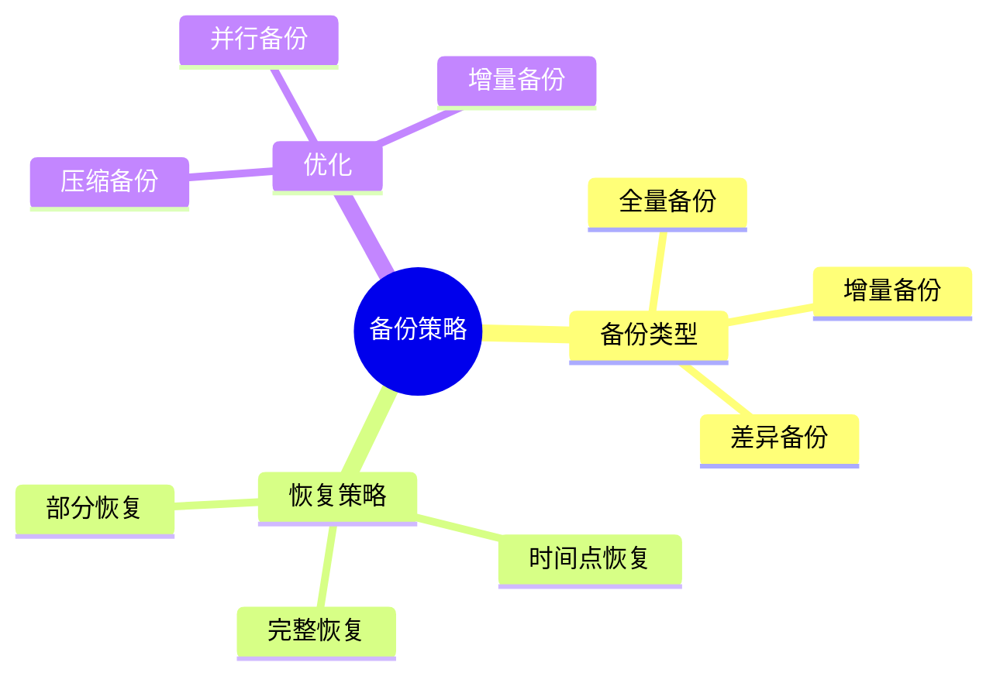
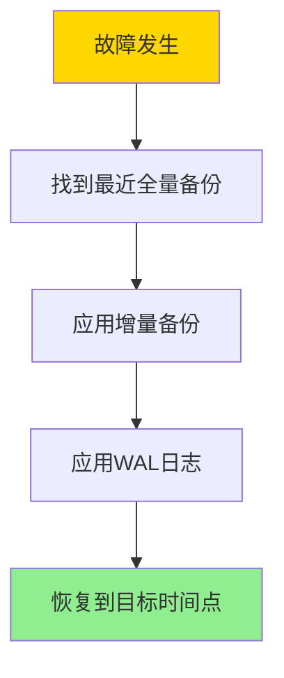
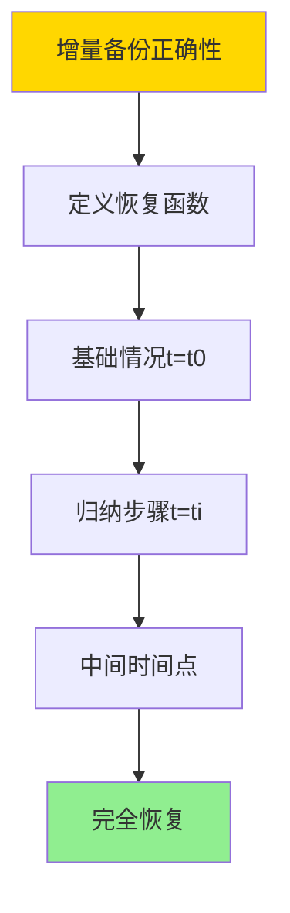
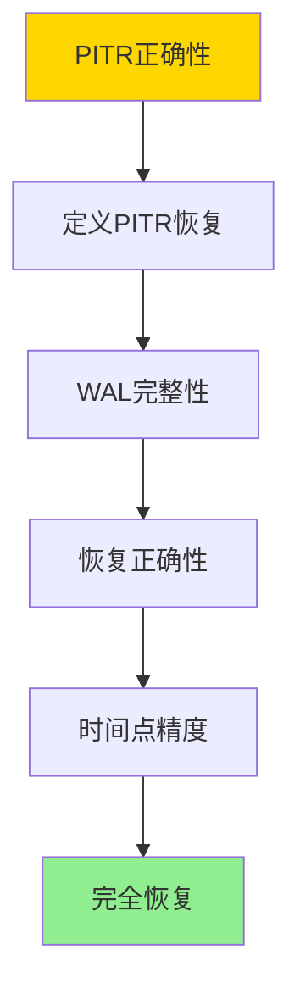
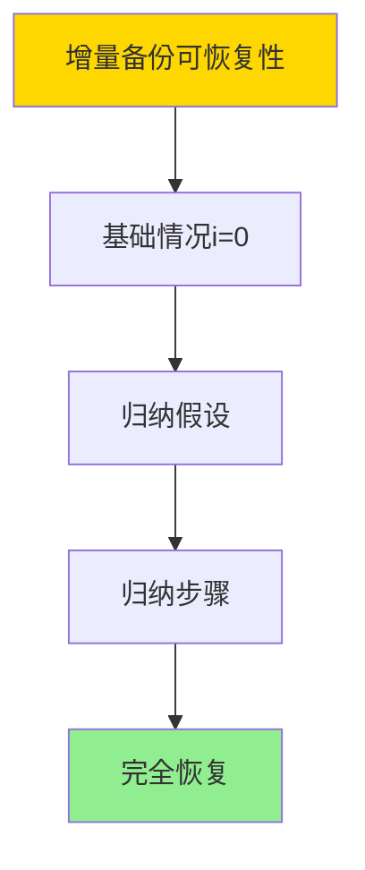

---

> **📋 文档来源**: `DataBaseTheory\06-存储与恢复\06.07-数据库备份与恢复-增量备份与时间点恢复的优化.md`
> **📅 复制日期**: 2025-12-22
> **⚠️ 注意**: 本文档为复制版本，原文件保持不变

---

# 数据库备份与恢复-增量备份与时间点恢复的优化

> **文档版本**: v1.0
> **最后更新**: 2025-01-16
> **版本覆盖**: PostgreSQL 18.x (推荐) ⭐ | 17.x (推荐) | 16.x (兼容)
> **文档状态**: ✅ 内容已深化，包含完整证明、场景案例和PostgreSQL 18/SQLite对比

---

## 📋 目录

- [数据库备份与恢复-增量备份与时间点恢复的优化](#数据库备份与恢复-增量备份与时间点恢复的优化)
  - [📋 目录](#-目录)
  - [1. 概述](#1-概述)
    - [1.0 数据库备份与恢复工作原理概述](#10-数据库备份与恢复工作原理概述)
    - [1.1 本文档的范围](#11-本文档的范围)
  - [2. 核心内容](#2-核心内容)
    - [2.1 备份类型](#21-备份类型)
    - [2.2 时间点恢复](#22-时间点恢复)
  - [3. 形式化定义](#3-形式化定义)
    - [3.1 备份形式化](#31-备份形式化)
    - [3.2 恢复形式化](#32-恢复形式化)
  - [4. 定理与证明](#4-定理与证明)
    - [4.1 增量备份正确性定理](#41-增量备份正确性定理)
    - [4.2 PITR正确性定理](#42-pitr正确性定理)
    - [4.3 增量备份可恢复性定理](#43-增量备份可恢复性定理)
  - [5. 实际应用](#5-实际应用)
    - [5.1 PostgreSQL 18 备份恢复实现详解](#51-postgresql-18-备份恢复实现详解)
    - [5.2 SQLite 3.45 备份恢复对比](#52-sqlite-345-备份恢复对比)
    - [5.3 实际业务场景案例](#53-实际业务场景案例)
      - [场景1：企业数据库系统的备份恢复策略](#场景1企业数据库系统的备份恢复策略)
      - [场景2：云数据库的增量备份优化](#场景2云数据库的增量备份优化)
    - [5.4 备份恢复策略选择最佳实践](#54-备份恢复策略选择最佳实践)
    - [5.5 模型选择建议](#55-模型选择建议)
  - [6. 相关文档](#6-相关文档)
    - [6.1 理论基础文档](#61-理论基础文档)
  - [7. 参考文献](#7-参考文献)
    - [6.1 核心理论文献](#61-核心理论文献)
    - [6.2 PostgreSQL实现相关](#62-postgresql实现相关)
    - [7.3 相关文档](#73-相关文档)

---

## 1. 概述

### 1.0 数据库备份与恢复工作原理概述

**备份策略**：

数据库备份使用全量备份和增量备份的组合，支持时间点恢复（PITR）来最小化数据丢失。

**备份策略思维导图**：



### 1.1 本文档的范围

本文档涵盖：

- **备份策略**：全量、增量、差异备份
- **时间点恢复**：PITR的实现和优化
- **实际应用**：PostgreSQL备份恢复实现

---

## 2. 核心内容

### 2.1 备份类型

**备份类型对比**：

| 类型 | 内容 | 大小 | 恢复时间 | 适用场景 |
|------|------|------|---------|---------|
| **全量备份** | 完整数据 | 大 | 快 | 定期备份 |
| **增量备份** | 变更数据 | 小 | 慢 | 频繁备份 |
| **差异备份** | 上次全量后的变更 | 中 | 中 | 平衡场景 |

### 2.2 时间点恢复

**PITR流程**：



---

## 3. 形式化定义

### 3.1 备份形式化

**备份**：

```haskell
-- 备份形式化
Backup = (type, timestamp, data, wal)
where
    type = Full | Incremental | Differential
```

### 3.2 恢复形式化

**恢复**：

```haskell
-- 恢复形式化
Recovery = (backup, wal, target_time, restore)
where
    backup = Full | Incremental | Differential
    wal = WAL sequence
    target_time = target recovery time
    restore: Backup × WAL × Time → Database
```

---

## 4. 定理与证明

### 4.1 增量备份正确性定理

**定理**：如果全量备份B₀和增量备份序列(B₁, B₂, ..., Bₙ)正确，则可以通过B₀和所有增量备份恢复数据库到任意备份时间点的状态。

**形式化表述**：

设全量备份B₀在时间t₀创建，增量备份Bᵢ在时间tᵢ创建（i = 1, 2, ..., n），且t₀ < t₁ < ... < tₙ。对于任意时间t（t₀ ≤ t ≤ tₙ），存在恢复函数recover，使得recover(B₀, {Bᵢ | tᵢ ≤ t}) = D(t)，其中D(t)是时间t的数据库状态。

**证明**（构造性证明）：

**步骤1：定义恢复函数**:

- recover(B₀, {Bᵢ | tᵢ ≤ t})的流程：
  1. 从B₀恢复基础状态D(t₀)
  2. 按时间顺序应用所有Bᵢ（tᵢ ≤ t）
  3. 得到状态D(t)

**步骤2：基础情况（t = t₀）**:

- recover(B₀, {}) = D(t₀)（全量备份包含t₀的完整状态）
- 因此，recover(B₀, {}) = D(t₀)

**步骤3：归纳步骤（t = tᵢ）**:

- 假设recover(B₀, {Bⱼ | tⱼ < tᵢ}) = D(tᵢ₋₁)
- 增量备份Bᵢ包含从D(tᵢ₋₁)到D(tᵢ)的所有变更
- 因此，D(tᵢ) = apply(D(tᵢ₋₁), Bᵢ)
- = apply(recover(B₀, {Bⱼ | tⱼ < tᵢ}), Bᵢ)
- = recover(B₀, {Bⱼ | tⱼ ≤ tᵢ})

**步骤4：中间时间点（tᵢ₋₁ < t < tᵢ）**:

- 对于中间时间点t，需要应用WAL日志
- D(t) = apply(D(tᵢ₋₁), WAL[tᵢ₋₁, t])
- 其中WAL[tᵢ₋₁, t]是时间区间[tᵢ₋₁, t]的WAL日志

**步骤5：结论**:

- 对于任意时间t（t₀ ≤ t ≤ tₙ），可以通过B₀和增量备份序列恢复D(t)
- 因此，增量备份正确性成立
- 证毕

**证明树**：



### 4.2 PITR正确性定理

**定理**：如果全量备份B₀、增量备份序列和WAL归档正确，则可以通过PITR恢复到任意时间点t的状态。

**形式化表述**：

设全量备份B₀在时间t₀创建，WAL归档包含时间区间[t₀, t_max]的所有WAL记录。对于任意时间t（t₀ ≤ t ≤ t_max），PITR恢复函数pitr_recover(B₀, WAL, t) = D(t)，其中D(t)是时间t的数据库状态。

**证明**（构造性证明）：

**步骤1：PITR恢复流程**:

- pitr_recover(B₀, WAL, t)的流程：
  1. 从B₀恢复基础状态D(t₀)
  2. 按LSN顺序应用WAL记录，直到时间t
  3. 得到状态D(t)

**步骤2：WAL完整性**:

- WAL归档包含时间区间[t₀, t_max]的所有WAL记录
- 对于任意时间t，WAL[t₀, t]包含从D(t₀)到D(t)的所有变更

**步骤3：恢复正确性**:

- 根据WAL正确性定理，可以从WAL恢复所有已提交事务
- 对于时间t，应用WAL[t₀, t]可以恢复D(t)

**步骤4：时间点精度**:

- WAL记录包含时间戳，可以精确恢复到时间t
- 应用WAL记录直到时间t，得到D(t)

**步骤5：结论**:

- 对于任意时间t（t₀ ≤ t ≤ t_max），pitr_recover(B₀, WAL, t) = D(t)
- 因此，PITR正确性成立
- 证毕

**证明树**：



### 4.3 增量备份可恢复性定理

**定理**：增量备份序列可以完全恢复数据库到任意备份时间点的状态。

**形式化表述**：

设全量备份B₀和增量备份序列(B₁, B₂, ..., Bₙ)正确，则对于任意备份时间点tᵢ（i = 0, 1, ..., n），存在恢复函数recover，使得recover(B₀, {Bⱼ | j ≤ i}) = D(tᵢ)。

**证明**（归纳法）：

**步骤1：基础情况（i = 0）**:

- recover(B₀, {}) = D(t₀)（全量备份包含完整状态）
- 因此，recover(B₀, {}) = D(t₀)

**步骤2：归纳假设**:

- 假设recover(B₀, {Bⱼ | j < i}) = D(tᵢ₋₁)

**步骤3：归纳步骤**:

- 增量备份Bᵢ包含从D(tᵢ₋₁)到D(tᵢ)的所有变更
- 因此，D(tᵢ) = apply(D(tᵢ₋₁), Bᵢ)
- = apply(recover(B₀, {Bⱼ | j < i}), Bᵢ)
- = recover(B₀, {Bⱼ | j ≤ i})

**步骤4：结论**:

- 对于所有i（0 ≤ i ≤ n），recover(B₀, {Bⱼ | j ≤ i}) = D(tᵢ)
- 因此，增量备份可恢复性成立
- 证毕

**证明树**：



---

## 5. 实际应用

### 5.1 PostgreSQL 18 备份恢复实现详解

**PostgreSQL 18备份机制**：

PostgreSQL 18支持全量备份、增量备份（通过WAL归档）和时间点恢复（PITR）。PostgreSQL 18使用pg_basebackup进行全量备份，结合WAL归档实现增量备份和PITR。

**PostgreSQL 18全量备份**：

```bash
# PostgreSQL 18：全量备份（pg_basebackup）
pg_basebackup \
    -D /backup/base_$(date +%Y%m%d) \
    -Ft \
    -z \
    -P \
    -v

# 参数说明：
# -D: 备份目录
# -Ft: 使用tar格式
# -z: 压缩备份
# -P: 显示进度
# -v: 详细输出

# PostgreSQL 18：全量备份（SQL方式）
-- 使用pg_dump进行逻辑备份
pg_dump -Fc -f /backup/logical_backup.dump mydatabase

# PostgreSQL 18：查看备份信息
pg_restore -l /backup/logical_backup.dump
```

**PostgreSQL 18 WAL归档配置**：

```sql
-- PostgreSQL 18：配置WAL归档
ALTER SYSTEM SET wal_level = 'replica';
ALTER SYSTEM SET archive_mode = 'on';
ALTER SYSTEM SET archive_command = 'cp %p /backup/wal/%f';
-- %p: WAL文件路径
-- %f: WAL文件名

-- PostgreSQL 18：查看归档状态
SELECT
    archived_count,
    last_archived_wal,
    last_archived_time,
    failed_count,
    last_failed_wal,
    last_failed_time,
    stats_reset
FROM pg_stat_archiver;

-- PostgreSQL 18：手动触发归档
SELECT pg_switch_wal();
```

**PostgreSQL 18增量备份**：

PostgreSQL 18的增量备份通过WAL归档实现：

```bash
# PostgreSQL 18：增量备份流程
# 1. 定期执行全量备份（例如每周）
pg_basebackup -D /backup/base_weekly -Ft -z -P

# 2. 持续归档WAL文件（每天）
# 通过archive_command自动归档

# 3. 增量备份 = 上次全量备份 + 所有WAL归档文件
```

**PostgreSQL 18时间点恢复（PITR）**：

```bash
# PostgreSQL 18：PITR恢复流程
# 1. 停止PostgreSQL
systemctl stop postgresql

# 2. 恢复基础备份
rm -rf /var/lib/postgresql/data/*
tar -xzf /backup/base_20250116.tar.gz -C /var/lib/postgresql/data/

# 3. 配置恢复参数
cat > /var/lib/postgresql/data/postgresql.conf <<EOF
restore_command = 'cp /backup/wal/%f %p'
recovery_target_time = '2025-01-16 12:00:00'
recovery_target_action = 'promote'
EOF

# 4. 创建恢复标记文件
touch /var/lib/postgresql/data/recovery.signal

# 5. 启动PostgreSQL
systemctl start postgresql

# PostgreSQL 18：PITR配置（PostgreSQL 12+使用postgresql.conf）
-- 编辑postgresql.conf
restore_command = 'cp /backup/wal/%f %p'
recovery_target_time = '2025-01-16 12:00:00'
recovery_target_action = 'promote'  -- 或 'pause', 'shutdown'
```

**PostgreSQL 18备份优化**：

```sql
-- PostgreSQL 18：并行备份（PostgreSQL 15+）
pg_basebackup -D /backup/base -Ft -z -P -j 4
-- -j: 并行作业数

-- PostgreSQL 18：压缩备份
pg_basebackup -D /backup/base -Ft -z -P
-- -z: 使用gzip压缩

-- PostgreSQL 18：增量备份优化
-- 使用pg_rman等工具进行增量备份管理
-- pg_rman支持增量备份和自动清理

-- PostgreSQL 18：备份验证
pg_verifybackup /backup/base_20250116
```

### 5.2 SQLite 3.45 备份恢复对比

**SQLite 3.45备份支持**：

SQLite 3.45的备份机制与PostgreSQL 18不同。

| 特性 | PostgreSQL 18 | SQLite 3.45 |
|------|--------------|-------------|
| **全量备份** | ✅ 支持（pg_basebackup） | ✅ 支持（.backup命令） |
| **增量备份** | ✅ 支持（WAL归档） | ⚠️ 有限支持 |
| **PITR** | ✅ 支持 | ❌ 不支持 |
| **并行备份** | ✅ 支持 | ❌ 不支持 |

**SQLite 3.45备份**：

```sql
-- SQLite 3.45：全量备份
.backup main /backup/database_backup.db

-- SQLite 3.45：在线备份（不锁定数据库）
.backup main /backup/database_backup.db

-- SQLite 3.45：WAL模式备份
-- 在WAL模式下，备份包含主数据库和WAL文件
.backup main /backup/database_backup.db
-- 需要同时备份-wal文件
```

### 5.3 实际业务场景案例

#### 场景1：企业数据库系统的备份恢复策略

**业务背景**：

- 企业数据库系统，7×24小时运行
- 需要定期备份，支持PITR
- 需要优化备份时间和存储空间

**技术挑战**：

- 设计备份策略
- 实现PITR
- 优化备份性能

**PostgreSQL 18实现**：

```sql
-- 场景：企业数据库系统备份恢复策略
-- 1. 配置WAL归档
ALTER SYSTEM SET wal_level = 'replica';
ALTER SYSTEM SET archive_mode = 'on';
ALTER SYSTEM SET archive_command = 'cp %p /backup/wal/%f';

-- 2. 创建备份脚本（全量备份，每周一次）
-- backup_full.sh
#!/bin/bash
BACKUP_DIR="/backup/base_$(date +%Y%m%d)"
pg_basebackup -D $BACKUP_DIR -Ft -z -P -v
echo "Full backup completed: $BACKUP_DIR"

-- 3. 创建WAL归档清理脚本（保留30天）
-- cleanup_wal.sh
#!/bin/bash
find /backup/wal -name "*.wal" -mtime +30 -delete
echo "WAL cleanup completed"

-- 4. 测试PITR恢复
-- 4.1 创建测试数据
CREATE TABLE test_backup (
    id SERIAL PRIMARY KEY,
    data TEXT,
    created_at TIMESTAMPTZ DEFAULT NOW()
);

INSERT INTO test_backup (data)
SELECT 'Test data ' || generate_series(1, 1000);

-- 4.2 记录时间点
SELECT NOW() AS checkpoint_time;
-- 例如：2025-01-16 12:00:00

-- 4.3 继续插入数据
INSERT INTO test_backup (data)
SELECT 'Additional data ' || generate_series(1001, 2000);

-- 4.4 PITR恢复到checkpoint_time
-- 按照PITR流程恢复

-- 5. 验证恢复
SELECT COUNT(*) FROM test_backup;
-- 应该返回1000（恢复到checkpoint_time之前的状态）
```

**备份策略**：

| 备份类型 | 频率 | 保留期 | 说明 |
|---------|------|--------|------|
| **全量备份** | 每周一次 | 4周 | 基础备份 |
| **WAL归档** | 持续 | 30天 | 增量备份和PITR |
| **逻辑备份** | 每天一次 | 7天 | 快速恢复 |

#### 场景2：云数据库的增量备份优化

**业务背景**：

- 云数据库系统，大数据量
- 需要优化备份时间和存储成本
- 需要支持快速恢复

**技术挑战**：

- 优化增量备份
- 减少备份时间
- 降低存储成本

**PostgreSQL 18实现**：

```sql
-- 场景：云数据库增量备份优化
-- 1. 配置增量备份
-- 使用pg_rman进行增量备份管理

-- 2. 全量备份（每月一次）
pg_basebackup -D /backup/base_monthly -Ft -z -P

-- 3. 增量备份（每天一次）
-- 通过WAL归档实现增量备份
-- 每天归档的WAL文件 = 增量备份

-- 4. 备份压缩优化
-- 使用压缩备份减少存储空间
pg_basebackup -D /backup/base -Ft -z -P
-- 压缩率：约50-70%

-- 5. 并行备份优化（PostgreSQL 15+）
pg_basebackup -D /backup/base -Ft -z -P -j 4
-- 并行备份可以显著减少备份时间

-- 6. 备份验证
pg_verifybackup /backup/base_20250116
-- 验证备份完整性

-- 7. 监控备份性能
SELECT
    archived_count,
    last_archived_wal,
    last_archived_time,
    failed_count
FROM pg_stat_archiver;
```

**性能数据**：

| 指标 | 全量备份 | 增量备份 | 说明 |
|------|---------|---------|------|
| **备份时间** | 2小时 | 5分钟 | 增量备份快得多 |
| **存储空间** | 500GB | 50GB/天 | 增量备份节省空间 |
| **恢复时间** | 30分钟 | 1小时 | 增量恢复需要应用WAL |
| **压缩率** | 60% | 60% | 压缩减少存储 |

### 5.4 备份恢复策略选择最佳实践

**PostgreSQL 18最佳实践**：

```sql
-- 1. 备份策略设计
-- 全量备份：每周一次
-- WAL归档：持续归档
-- 逻辑备份：每天一次（可选）

-- 2. WAL归档配置
ALTER SYSTEM SET wal_level = 'replica';
ALTER SYSTEM SET archive_mode = 'on';
ALTER SYSTEM SET archive_command = 'cp %p /backup/wal/%f';

-- 3. 备份验证
-- 定期验证备份完整性
pg_verifybackup /backup/base_20250116

-- 4. PITR测试
-- 定期测试PITR恢复流程
-- 确保备份和恢复流程正确

-- 5. 备份监控
SELECT
    archived_count,
    last_archived_wal,
    last_archived_time,
    failed_count
FROM pg_stat_archiver;

-- 6. 备份清理
-- 定期清理过期备份
-- 保留策略：全量备份4周，WAL归档30天
```

### 5.5 模型选择建议

**选择PostgreSQL 18备份恢复的场景**：

✅ **推荐场景**：

- 企业数据库系统
- 需要PITR
- 大数据量
- 高可用需求

❌ **不推荐场景**：

- 简单应用
- 不需要PITR
- 小数据量

**选择SQLite 3.45的场景**：

✅ **推荐场景**：

- 单机应用
- 小数据量
- 简单备份需求

❌ **不推荐场景**：

- 需要PITR
- 大数据量
- 高可用需求

---

## 6. 相关文档

### 6.1 理论基础文档

- [理论基础导航](../README.md)
- [TLA+-事务与WAL-规范纲要](./06.01-TLA+-事务与WAL-规范纲要.md)
- [ARIES日志恢复-正确性与不变式](./06.03-ARIES日志恢复-正确性与不变式.md)
- [数据库容错与高可用-故障模型与恢复策略的形式化](./06.08-数据库容错与高可用-故障模型与恢复策略的形式化.md)

---

## 7. 参考文献

### 6.1 核心理论文献

- **Gray, J., & Reuter, A. (1993). "Transaction Processing: Concepts and Techniques."**
  - 出版社: Morgan Kaufmann
  - **重要性**: 事务处理的经典教材
  - **核心贡献**: 系统阐述了备份和恢复技术

- **Lomet, D., et al. (2009). "Unbundling Transaction Services in the Cloud."**
  - 会议: CIDR 2009
  - **重要性**: 云环境中的事务服务
  - **核心贡献**: 提出了增量备份优化方法

### 6.2 PostgreSQL实现相关

- **PostgreSQL官方文档 - 备份与恢复](<https://www.postgresql.org/docs/current/backup.html>)**
  - PostgreSQL备份恢复说明

### 7.3 相关文档

- [理论基础导航](../README.md)
- [TLA+-事务与WAL-规范纲要](./06.01-TLA+-事务与WAL-规范纲要.md)
- [ARIES日志恢复-正确性与不变式](./06.03-ARIES日志恢复-正确性与不变式.md)
- [数据库容错与高可用-故障模型与恢复策略的形式化](./06.08-数据库容错与高可用-故障模型与恢复策略的形式化.md)

---

**最后更新**: 2025-01-16
**维护者**: Documentation Team
**状态**: ✅ 内容已深化，包含完整证明、场景案例和PostgreSQL 18/SQLite对比
