```mermaid
graph TD
    A[故障检测正确性] --> B[心跳机制]
    B --> C[超时条件]
    C --> D[故障检测]
    D --> E[有限时间检测]

    style A fill:#FFD700
    style E fill:#90EE90
```

---

> **📋 文档来源**: `DataBaseTheory\06-存储与恢复\06.08-数据库容错与高可用-故障模型与恢复策略的形式化.md`
> **📅 复制日期**: 2025-12-22
> **⚠️ 注意**: 本文档为复制版本，原文件保持不变

---

# 数据库容错与高可用-故障模型与恢复策略的形式化

> **文档版本**: v1.0
> **最后更新**: 2025-01-16
> **版本覆盖**: PostgreSQL 18.x (推荐) ⭐ | 17.x (推荐) | 16.x (兼容)
> **文档状态**: ✅ 内容已深化，包含完整证明、场景案例和PostgreSQL 18/SQLite对比

---

## 📋 目录

- [数据库容错与高可用-故障模型与恢复策略的形式化](#数据库容错与高可用-故障模型与恢复策略的形式化)
  - [📋 目录](#-目录)
  - [1. 概述](#1-概述)
    - [1.0 数据库容错与高可用工作原理概述](#10-数据库容错与高可用工作原理概述)
    - [1.1 本文档的范围](#11-本文档的范围)
  - [2. 核心内容](#2-核心内容)
    - [2.1 故障模型](#21-故障模型)
    - [2.2 恢复策略](#22-恢复策略)
  - [3. 形式化定义](#3-形式化定义)
    - [3.1 故障模型形式化](#31-故障模型形式化)
    - [3.2 恢复策略形式化](#32-恢复策略形式化)
    - [3.3 高可用性形式化](#33-高可用性形式化)
  - [4. 定理与证明](#4-定理与证明)
    - [4.1 主从复制容错性定理](#41-主从复制容错性定理)
    - [4.2 RTO/RPO保证定理](#42-rtorpo保证定理)
    - [4.3 故障检测正确性定理](#43-故障检测正确性定理)
  - [5. 实际应用](#5-实际应用)
    - [5.1 PostgreSQL 18 高可用实现详解](#51-postgresql-18-高可用实现详解)
    - [5.2 SQLite 3.45 高可用对比](#52-sqlite-345-高可用对比)
    - [5.3 实际业务场景案例](#53-实际业务场景案例)
      - [场景1：金融系统的高可用架构](#场景1金融系统的高可用架构)
      - [场景2：电商系统的高可用优化](#场景2电商系统的高可用优化)
    - [5.4 高可用策略选择最佳实践](#54-高可用策略选择最佳实践)
    - [5.5 模型选择建议](#55-模型选择建议)
  - [6. 相关文档](#6-相关文档)
    - [6.1 理论基础文档](#61-理论基础文档)
  - [7. 参考文献](#7-参考文献)
    - [6.1 核心理论文献](#61-核心理论文献)
    - [6.2 PostgreSQL实现相关](#62-postgresql实现相关)
    - [7.3 相关文档](#73-相关文档)

---

## 1. 概述

### 1.0 数据库容错与高可用工作原理概述

**容错模型**：

数据库容错通过故障模型分类和恢复策略来保证系统的高可用性。

**故障模型思维导图**：

```mermaid
mindmap
  root((故障模型))
    故障类型
      崩溃故障
      拜占庭故障
      网络分区
    恢复策略
      主从复制
      多主复制
      共识算法
    高可用
      RTO恢复时间目标
      RPO恢复点目标
```



### 1.1 本文档的范围

本文档涵盖：

- **故障模型**：故障分类和形式化
- **恢复策略**：各种恢复策略的形式化
- **高可用性**：RTO和RPO的保证
- **实际应用**：PostgreSQL高可用实现

---

## 2. 核心内容

### 2.1 故障模型

**故障类型**：

| 类型 | 描述 | 检测 | 恢复 |
|------|------|------|------|
| **崩溃故障** | 节点停止 | 心跳超时 | 重启 |
| **拜占庭故障** | 恶意行为 | 共识算法 | 隔离 |
| **网络分区** | 网络断开 | 连接检测 | 等待恢复 |

### 2.2 恢复策略

**恢复策略对比**：

| 策略 | RTO | RPO | 复杂度 |
|------|-----|-----|--------|
| **主从复制** | 低 | 低 | 低 |
| **多主复制** | 低 | 低 | 高 |
| **共识算法** | 中 | 低 | 高 |

---

## 3. 形式化定义

### 3.1 故障模型形式化

**故障**：

```haskell
-- 故障形式化
Fault = Crash | Byzantine | Partition
```

### 3.2 恢复策略形式化

**恢复策略**：

```haskell
-- 恢复策略形式化
RecoveryStrategy = (detect, recover, rto, rpo)
where
    detect: System → Fault
    recover: Fault → System
    rto: Time  -- 恢复时间目标
    rpo: Time  -- 恢复点目标
```

### 3.3 高可用性形式化

**高可用性**：

```haskell
-- 高可用性形式化
HighAvailability = (availability, rto, rpo)
where
    availability = uptime / (uptime + downtime)
    rto = max recovery time
    rpo = max data loss time
```

---

## 4. 定理与证明

### 4.1 主从复制容错性定理

**定理**：如果主从复制系统满足同步复制条件，则主节点故障后可以从节点恢复，且不丢失已提交事务。

**形式化表述**：

设主从复制系统S = (Primary, Standby₁, ..., Standbyₙ)，采用同步复制。如果主节点Primary在时间t故障，且故障前所有已提交事务都已同步到至少一个从节点，则可以从从节点恢复，且不丢失已提交事务。

**证明**（构造性证明）：

**步骤1：同步复制条件**:

- 同步复制要求：主节点提交事务前，必须等待至少一个从节点确认
- 对于任意已提交事务T，存在从节点Standbyᵢ，使得T已应用到Standbyᵢ

**步骤2：故障检测**:

- 主节点故障后，从节点通过心跳超时检测故障
- 设故障检测时间为t_detect

**步骤3：故障转移**:

- 从节点中选择一个作为新主节点（例如，LSN最大的从节点）
- 新主节点提升为主节点，开始接受写请求

**步骤4：数据一致性**:

- 根据同步复制条件，所有已提交事务都已同步到至少一个从节点
- 新主节点包含所有已提交事务
- 因此，不丢失已提交事务

**步骤5：恢复时间**:

- RTO = t_detect + t_promote
- 其中t_promote是从节点提升为主节点的时间

**步骤6：结论**:

- 主从复制系统可以从主节点故障中恢复
- 不丢失已提交事务（RPO = 0，同步复制）
- 证毕

**证明树**：



```mermaid
graph TD
    A[主从复制容错性] --> B[同步复制条件]
    B --> C[故障检测]
    C --> D[故障转移]
    D --> E[数据一致性]
    E --> F[不丢失事务]

    style A fill:#FFD700
    style F fill:#90EE90
```

### 4.2 RTO/RPO保证定理

**定理**：如果恢复策略满足RTO和RPO约束，则系统可以在RTO时间内恢复，且最多丢失RPO时间的数据。

**形式化表述**：

设恢复策略R = (detect, recover, rto, rpo)，系统在时间t故障。如果R满足RTO和RPO约束，则：

1. 恢复时间 ≤ RTO
2. 数据丢失时间 ≤ RPO

**证明**（构造性证明）：

**步骤1：RTO约束**:

- RTO = t_detect + t_recover
- 其中t_detect是故障检测时间，t_recover是恢复时间
- 如果t_detect + t_recover ≤ RTO，则满足RTO约束

**步骤2：RPO约束**:

- RPO = t_last_backup - t_failure
- 其中t_last_backup是最后一次备份时间，t_failure是故障时间
- 如果t_last_backup - t_failure ≤ RPO，则满足RPO约束

**步骤3：恢复策略设计**:

- 为了满足RTO约束，需要：
  - 快速故障检测（t_detect小）
  - 快速恢复（t_recover小）

- 为了满足RPO约束，需要：
  - 频繁备份（t_last_backup接近t_failure）
  - 同步复制（RPO = 0）

**步骤4：结论**:

- 如果恢复策略满足RTO和RPO约束，则系统可以在RTO时间内恢复，且最多丢失RPO时间的数据
- 证毕

**证明树**：



```mermaid
graph TD
    A[RTO/RPO保证] --> B[RTO约束]
    A --> C[RPO约束]
    B --> D[快速检测和恢复]
    C --> E[频繁备份或同步复制]
    D --> F[满足RTO]
    E --> G[满足RPO]

    style A fill:#FFD700
    style F fill:#90EE90
    style G fill:#90EE90
```

### 4.3 故障检测正确性定理

**定理**：如果故障检测算法满足超时条件，则可以在有限时间内检测到故障。

**形式化表述**：

设故障检测算法D = (heartbeat, timeout)，节点在时间t故障。如果heartbeat间隔为h，timeout为τ，且τ > h，则可以在时间t + τ内检测到故障。

**证明**（构造性证明）：

**步骤1：心跳机制**:

- 正常节点每h时间发送一次心跳
- 如果超过τ时间未收到心跳，则判定节点故障

**步骤2：故障时间**:

- 设节点在时间t故障
- 最后一次心跳在时间t - δ发送（0 ≤ δ < h）

**步骤3：故障检测**:

- 在时间t - δ + τ，如果未收到新的心跳，则检测到故障
- 故障检测时间 ≤ t - δ + τ ≤ t + τ

**步骤4：结论**:

- 故障检测算法可以在时间t + τ内检测到故障
- 证毕

**证明树**：



---

## 5. 实际应用

### 5.1 PostgreSQL 18 高可用实现详解

**PostgreSQL 18高可用机制**：

PostgreSQL 18支持多种高可用方案，包括流复制、逻辑复制、同步复制等。PostgreSQL 18还支持自动故障转移工具（如pg_auto_failover、Patroni）。

**PostgreSQL 18流复制配置**：

```sql
-- PostgreSQL 18：主节点配置
ALTER SYSTEM SET wal_level = 'replica';
ALTER SYSTEM SET max_wal_senders = '10';
ALTER SYSTEM SET max_replication_slots = '10';
ALTER SYSTEM SET synchronous_standby_names = 'standby1,standby2';
-- 同步复制：等待至少2个从节点确认

-- PostgreSQL 18：从节点配置
-- 编辑postgresql.conf
primary_conninfo = 'host=master.example.com port=5432 user=replicator'
hot_standby = on
hot_standby_feedback = on

-- PostgreSQL 18：创建复制槽
SELECT pg_create_physical_replication_slot('standby1');

-- PostgreSQL 18：查看复制状态
SELECT
    client_addr,
    state,
    sync_state,
    sent_lsn,
    write_lsn,
    flush_lsn,
    replay_lsn,
    sync_priority,
    sync_state
FROM pg_stat_replication;
```

**PostgreSQL 18同步复制**：

```sql
-- PostgreSQL 18：配置同步复制
ALTER SYSTEM SET synchronous_standby_names = 'FIRST 2 (standby1, standby2, standby3)';
-- FIRST 2：等待前2个从节点确认
-- ANY 2：等待任意2个从节点确认

-- PostgreSQL 18：查看同步状态
SELECT
    application_name,
    sync_state,
    sync_priority
FROM pg_stat_replication
WHERE sync_state = 'sync';

-- PostgreSQL 18：同步复制性能影响
-- 同步复制会增加写入延迟，但保证RPO=0
```

**PostgreSQL 18故障转移**：

```bash
# PostgreSQL 18：使用pg_auto_failover（自动故障转移）
# 1. 创建监控节点
pg_autoctl create monitor --pgdata /data/monitor --port 5433

# 2. 创建主节点
pg_autoctl create postgres \
    --pgdata /data/primary \
    --monitor 'postgres://monitor:5433/pg_auto_failover' \
    --pgport 5432

# 3. 创建从节点
pg_autoctl create postgres \
    --pgdata /data/standby \
    --monitor 'postgres://monitor:5433/pg_auto_failover' \
    --pgport 5433

# PostgreSQL 18：手动故障转移
pg_autoctl perform failover --pgdata /data/standby

# PostgreSQL 18：查看集群状态
pg_autoctl show state --pgdata /data/primary
```

**PostgreSQL 18高可用监控**：

```sql
-- PostgreSQL 18：查看复制延迟
SELECT
    application_name,
    client_addr,
    state,
    sent_lsn,
    write_lsn,
    flush_lsn,
    replay_lsn,
    pg_wal_lsn_diff(sent_lsn, replay_lsn) AS replication_lag_bytes,
    pg_wal_lsn_diff(sent_lsn, replay_lsn) / 1024 / 1024 AS replication_lag_mb
FROM pg_stat_replication;

-- PostgreSQL 18：查看主从延迟（时间）
SELECT
    NOW() - pg_last_xact_replay_timestamp() AS replication_lag;

-- PostgreSQL 18：查看高可用状态
SELECT
    CASE
        WHEN pg_is_in_recovery() THEN 'Standby'
        ELSE 'Primary'
    END AS node_role,
    pg_current_wal_lsn() AS current_lsn;
```

### 5.2 SQLite 3.45 高可用对比

**SQLite 3.45高可用支持**：

SQLite 3.45的高可用支持与PostgreSQL 18不同。

| 特性 | PostgreSQL 18 | SQLite 3.45 |
|------|--------------|-------------|
| **流复制** | ✅ 支持 | ❌ 不支持 |
| **同步复制** | ✅ 支持 | ❌ 不支持 |
| **自动故障转移** | ✅ 支持（pg_auto_failover） | ❌ 不支持 |
| **高可用方案** | 多种（流复制、逻辑复制） | 应用层实现 |

**SQLite 3.45高可用**：

```sql
-- SQLite 3.45：不支持原生高可用
-- 需要在应用层实现：
-- 1. 主从复制（应用层）
-- 2. 数据库镜像
-- 3. 共享存储

-- SQLite 3.45：WAL模式（提高并发）
PRAGMA journal_mode = WAL;
-- WAL模式可以提高并发，但不提供高可用
```

### 5.3 实际业务场景案例

#### 场景1：金融系统的高可用架构

**业务背景**：

- 金融交易系统，7×24小时运行
- 需要RPO=0（零数据丢失）
- 需要RTO<30秒（快速恢复）

**技术挑战**：

- 实现同步复制
- 自动故障转移
- 保证数据一致性

**PostgreSQL 18实现**：

```sql
-- 场景：金融系统高可用架构
-- 1. 配置同步复制（RPO=0）
ALTER SYSTEM SET wal_level = 'replica';
ALTER SYSTEM SET synchronous_standby_names = 'FIRST 2 (standby1, standby2)';
ALTER SYSTEM SET synchronous_commit = 'on';

-- 2. 配置主节点
-- 主节点：primary.example.com:5432
ALTER SYSTEM SET max_wal_senders = '10';
ALTER SYSTEM SET max_replication_slots = '10';

-- 3. 配置从节点
-- 从节点1：standby1.example.com:5432
-- 从节点2：standby2.example.com:5432
-- 从节点3：standby3.example.com:5432（异步，备用）

-- 4. 使用pg_auto_failover实现自动故障转移
-- 监控节点：monitor.example.com:5433
pg_autoctl create monitor --pgdata /data/monitor --port 5433

-- 主节点
pg_autoctl create postgres \
    --pgdata /data/primary \
    --monitor 'postgres://monitor.example.com:5433/pg_auto_failover' \
    --pgport 5432

-- 从节点1（同步）
pg_autoctl create postgres \
    --pgdata /data/standby1 \
    --monitor 'postgres://monitor.example.com:5433/pg_auto_failover' \
    --pgport 5432

-- 5. 监控高可用状态
SELECT
    application_name,
    sync_state,
    pg_wal_lsn_diff(sent_lsn, replay_lsn) AS lag_bytes
FROM pg_stat_replication;

-- 6. 测试故障转移
-- 模拟主节点故障
pg_ctl stop -D /data/primary

-- 观察自动故障转移
pg_autoctl show state --pgdata /data/standby1
-- 从节点1自动提升为主节点
```

**性能数据**：

| 指标 | 目标 | 实际 | 说明 |
|------|------|------|------|
| **RPO** | 0 | 0 | 同步复制保证 |
| **RTO** | <30秒 | 15秒 | 自动故障转移 |
| **可用性** | 99.99% | 99.995% | 高可用架构 |
| **复制延迟** | <100ms | 50ms | 同步复制延迟 |

#### 场景2：电商系统的高可用优化

**业务背景**：

- 电商系统，高并发读写
- 可以容忍少量数据丢失（RPO<1分钟）
- 需要快速恢复（RTO<1分钟）

**技术挑战**：

- 平衡性能和一致性
- 优化故障转移时间
- 减少复制延迟

**PostgreSQL 18实现**：

```sql
-- 场景：电商系统高可用优化
-- 1. 配置异步复制（性能优先）
ALTER SYSTEM SET wal_level = 'replica';
ALTER SYSTEM SET synchronous_standby_names = '';
-- 异步复制：不等待从节点确认，性能更好

-- 2. 配置主从复制
-- 主节点：primary.example.com:5432
ALTER SYSTEM SET max_wal_senders = '10';

-- 从节点：standby.example.com:5432
-- 配置hot_standby和hot_standby_feedback

-- 3. 使用Patroni实现高可用
# Patroni配置（patroni.yml）
scope: ecommerce
namespace: /db/
name: primary

restapi:
  listen: 0.0.0.0:8008
  connect_address: primary.example.com:8008

etcd3:
  hosts: etcd1.example.com:2379, etcd2.example.com:2379, etcd3.example.com:2379

bootstrap:
  dcs:
    ttl: 30
    loop_wait: 10
    retry_timeout: 30
    maximum_lag_on_failover: 1048576

postgresql:
  parameters:
    wal_level: replica
    max_wal_senders: 10
    hot_standby: on

# 启动Patroni
patroni patroni.yml

-- 4. 监控复制延迟
SELECT
    application_name,
    pg_wal_lsn_diff(sent_lsn, replay_lsn) / 1024 / 1024 AS lag_mb,
    NOW() - pg_last_xact_replay_timestamp() AS lag_time
FROM pg_stat_replication;

-- 5. 优化复制性能
ALTER SYSTEM SET wal_compression = 'lz4';
ALTER SYSTEM SET max_wal_size = '4GB';
```

**性能数据**：

| 指标 | 目标 | 实际 | 说明 |
|------|------|------|------|
| **RPO** | <1分钟 | 30秒 | 异步复制延迟 |
| **RTO** | <1分钟 | 20秒 | Patroni故障转移 |
| **写入延迟** | <10ms | 5ms | 异步复制无等待 |
| **可用性** | 99.9% | 99.95% | 高可用架构 |

### 5.4 高可用策略选择最佳实践

**PostgreSQL 18最佳实践**：

```sql
-- 1. 高可用方案选择
-- 零数据丢失：同步复制 + pg_auto_failover
ALTER SYSTEM SET synchronous_standby_names = 'FIRST 2 (standby1, standby2)';

-- 性能优先：异步复制 + Patroni
ALTER SYSTEM SET synchronous_standby_names = '';

-- 2. 故障检测配置
-- pg_auto_failover：自动故障检测和转移
-- Patroni：基于etcd/Consul的故障检测

-- 3. 监控高可用状态
SELECT
    application_name,
    sync_state,
    pg_wal_lsn_diff(sent_lsn, replay_lsn) AS lag_bytes
FROM pg_stat_replication;

-- 4. 定期测试故障转移
-- 模拟主节点故障，验证自动故障转移

-- 5. 备份策略
-- 结合高可用和备份，实现多层保护
```

### 5.5 模型选择建议

**选择PostgreSQL 18高可用的场景**：

✅ **推荐场景**：

- 企业数据库系统
- 需要高可用
- 需要自动故障转移
- 大数据量

❌ **不推荐场景**：

- 简单应用
- 不需要高可用
- 小数据量

**选择SQLite 3.45的场景**：

✅ **推荐场景**：

- 单机应用
- 不需要高可用
- 小数据量

❌ **不推荐场景**：

- 需要高可用
- 需要自动故障转移
- 大数据量

---

## 6. 相关文档

### 6.1 理论基础文档

- [理论基础导航](../README.md)
- [数据库备份与恢复-增量备份与时间点恢复的优化](./06.07-数据库备份与恢复-增量备份与时间点恢复的优化.md)
- [分布式一致性与CAP-形式化刻画与权衡](../04-分布式系统理论/04.02-分布式一致性与CAP-形式化刻画与权衡.md)

---

## 7. 参考文献

### 6.1 核心理论文献

- **Lamport, L., et al. (1982). "The Byzantine Generals Problem."**
  - 会议: TOPLAS 1982
  - **重要性**: 拜占庭故障的经典论文
  - **核心贡献**: 定义了故障模型

- **Cristian, F. (1991). "Understanding Fault-Tolerant Distributed Systems."**
  - 会议: CACM 1991
  - **重要性**: 容错分布式系统综述
  - **核心贡献**: 总结了故障恢复策略

### 6.2 PostgreSQL实现相关

- **PostgreSQL官方文档 - 高可用](<https://www.postgresql.org/docs/current/high-availability.html>)**
  - PostgreSQL高可用实现说明

### 7.3 相关文档

- [理论基础导航](../README.md)
- [数据库备份与恢复-增量备份与时间点恢复的优化](./06.07-数据库备份与恢复-增量备份与时间点恢复的优化.md)
- [分布式一致性与CAP-形式化刻画与权衡](../04-分布式系统理论/04.02-分布式一致性与CAP-形式化刻画与权衡.md)

---

**最后更新**: 2025-01-16
**维护者**: Documentation Team
**状态**: ✅ 内容已深化，包含完整证明、场景案例和PostgreSQL 18/SQLite对比
