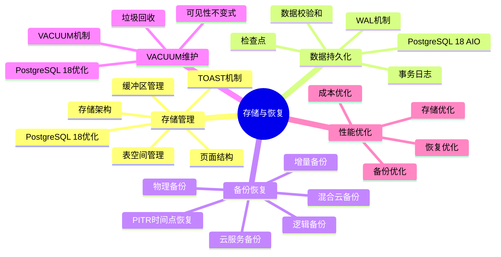
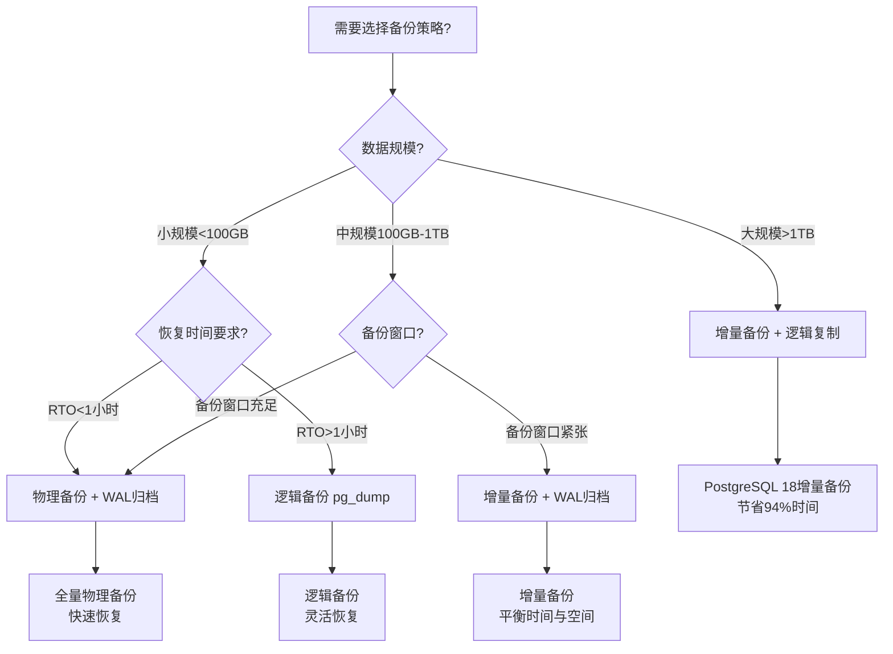

# 04-存储与恢复

> **文档总数**: 22个文档
> **覆盖领域**: 存储管理、WAL、备份恢复、VACUUM、检查点、缓冲区管理
> **版本覆盖**: PostgreSQL 18.x (推荐) ⭐ | 17.x (推荐) | 16.x (兼容)

---

## 📊 知识体系思维导图

---

## 📋 主题说明

本主题整合所有PostgreSQL存储管理与数据恢复相关内容，包括存储架构、WAL机制、备份恢复策略、VACUUM维护等。

---

## 📚 核心文档

### 存储管理

- **[存储管理体系详解.md](./存储管理体系详解.md)** - 存储管理完整体系
- **[01.06-存储管理与数据持久化.md](./01.06-存储管理与数据持久化.md)** - 存储管理与数据持久化
- **[表空间与存储管理.md](./表空间与存储管理.md)** - 表空间管理

### WAL与日志

- **[09-WAL深度解析.md](./09-WAL深度解析.md)** - WAL机制深度解析
- **[06.01-TLA+-事务与WAL-规范纲要.md](./06.01-TLA+-事务与WAL-规范纲要.md)** - WAL形式化规范
- **[06.06-数据库日志压缩-增量编码与压缩率优化.md](./06.06-数据库日志压缩-增量编码与压缩率优化.md)** - 日志压缩优化

### 备份与恢复

- **[\【深入】PostgreSQL备份恢复完善-PITR与灾备演练指南.md](./【深入】PostgreSQL备份恢复完善-PITR与灾备演练指南.md)** - PITR与灾备演练
- **[备份与恢复.md](../04-存储与恢复/备份与恢复.md)** - 备份恢复基础
- **[备份恢复体系详解.md](./备份恢复体系详解.md)** - 备份恢复完整体系
- **[06.07-数据库备份与恢复-增量备份与时间点恢复的优化.md](./06.07-数据库备份与恢复-增量备份与时间点恢复的优化.md)** - 增量备份优化
- **[存储与备份恢复场景分析指南.md](./存储与备份恢复场景分析指南.md)** ⭐⭐⭐⭐⭐ ⭐ 新增
  - 存储优化场景（表空间设计、分区策略、存储成本优化）
  - 备份策略选型决策（物理备份 vs 逻辑备份 vs 流复制备份对比）
  - 恢复场景分析（PITR、完整恢复、部分恢复场景）
  - 数据归档场景（归档策略、归档工具对比）
  - **字数**: 约28,000字
  - **状态**: ✅ 已完成

- **[混合云数据备份实践指南.md](./混合云数据备份实践指南.md)** ⭐⭐⭐⭐⭐ ⭐ 新增
  - 混合云备份架构设计（跨平台数据同步、公有云与私有云备份）
  - 数据一致性保证（跨平台数据一致性、数据校验与验证）
  - 安全策略整合（跨平台安全策略、数据加密与传输）
  - 成本优化策略（混合云成本分析、成本优化方案）
  - 恢复演练与验证
  - 综合选型案例（AWS+私有云、Azure+本地数据中心）
  - **字数**: 约22,000字
  - **状态**: ✅ 已完成

- **[数据库备份策略深度解析指南.md](./数据库备份策略深度解析指南.md)** ⭐⭐⭐⭐⭐ ⭐ 新增
  - 备份类型深度对比（全量、增量、日志备份）
  - 备份策略选型框架
  - 备份性能优化
  - 备份成本优化
  - 备份验证方法
  - 恢复演练流程
  - **字数**: 约25,000字
  - **状态**: ✅ 已完成

- **[数据恢复技术进阶应用指南.md](./数据恢复技术进阶应用指南.md)** ⭐⭐⭐⭐⭐ ⭐ 新增
  - 数据恢复技术原理
  - 数据恢复窗口期分析
  - 数据恢复工具对比
  - 数据恢复最佳实践
  - 数据恢复自动化
  - 数据恢复成本分析
  - **字数**: 约20,000字
  - **状态**: ✅ 已完成

- **[云服务备份与恢复解决方案指南.md](./云服务备份与恢复解决方案指南.md)** ⭐⭐⭐⭐⭐ ⭐ 新增
  - AWS备份方案
  - Azure备份方案
  - GCP备份方案
  - 云服务备份工具对比
  - 跨云备份策略
  - 云服务备份成本优化
  - **字数**: 约30,000字
  - **状态**: ✅ 已完成

- **[混合云数据备份实践指南.md](./混合云数据备份实践指南.md)** ⭐⭐⭐⭐⭐ ⭐ 新增
  - 混合云备份架构设计（跨平台数据同步、公有云与私有云备份）
  - 数据一致性保证（跨平台数据一致性、数据校验与验证）
  - 安全策略整合（跨平台安全策略、数据加密与传输）
  - 成本优化策略（混合云成本分析、成本优化方案）
  - 恢复演练与验证
  - 综合选型案例（AWS+私有云、Azure+本地数据中心）
  - **字数**: 约22,000字
  - **状态**: ✅ 已完成

- **[数据库备份策略深度解析指南.md](./数据库备份策略深度解析指南.md)** ⭐⭐⭐⭐⭐ ⭐ 新增
  - 全量备份深度解析（物理备份、逻辑备份、优化策略）
  - 增量备份深度解析（PostgreSQL 18增量备份、基于LSN的增量）
  - 日志备份深度解析（WAL归档、连续归档）
  - 备份策略综合对比（对比矩阵、选型决策）
  - 备份策略性能影响分析
  - 备份策略成本分析
  - 综合选型案例（大规模系统、关键业务）
  - **字数**: 约25,000字
  - **状态**: ✅ 已完成

- **[数据恢复技术进阶应用指南.md](./数据恢复技术进阶应用指南.md)** ⭐⭐⭐⭐⭐ ⭐ 新增
  - 数据恢复核心原理（恢复原理、技术演进）
  - 不同存储介质的数据恢复（SSD、HDD、云存储）
  - 数据恢复工具对比（原生工具、第三方工具）
  - 数据恢复最佳实践（恢复流程、恢复验证）
  - 数据恢复成本分析
  - 综合选型案例（大规模数据恢复、关键业务数据恢复）
  - **字数**: 约20,000字
  - **状态**: ✅ 已完成

- **[云服务备份与恢复解决方案指南.md](./云服务备份与恢复解决方案指南.md)** ⭐⭐⭐⭐⭐ ⭐ 新增
  - AWS备份与恢复解决方案（RDS备份、S3备份、Backup服务）
  - Azure备份与恢复解决方案（Database备份、Blob备份、Backup服务）
  - GCP备份与恢复解决方案（Cloud SQL备份、Cloud Storage备份）
  - 云服务备份工具对比
  - 跨云备份策略
  - 云服务备份成本优化
  - 综合选型案例（AWS环境、多云环境）
  - **字数**: 约30,000字
  - **状态**: ✅ 已完成

### VACUUM与维护

- **[VACUUM与维护.md](./VACUUM与维护.md)** - VACUUM维护基础
- **[06.02-VACUUM与可见性不变式-垃圾回收正确性.md](./06.02-VACUUM与可见性不变式-垃圾回收正确性.md)** - VACUUM正确性证明

### 理论文档

- **[06.03-ARIES日志恢复-正确性与不变式.md](./06.03-ARIES日志恢复-正确性与不变式.md)** - ARIES恢复算法
- **[06.04-数据库压缩与编码-信息论下界与最优编码.md](./06.04-数据库压缩与编码-信息论下界与最优编码.md)** - 压缩编码理论
- **[06.05-数据库缓存策略-工作集理论与最优替换算法.md](./06.05-数据库缓存策略-工作集理论与最优替换算法.md)** - 缓存策略理论
- **[06.08-数据库容错与高可用-故障模型与恢复策略的形式化.md](./06.08-数据库容错与高可用-故障模型与恢复策略的形式化.md)** - 容错与高可用理论

---

## 🆕 PostgreSQL 18 存储增强

### 异步I/O (AIO) 子系统 ⭐⭐⭐⭐⭐

PostgreSQL 18 引入了异步I/O子系统，I/O性能提升2-3倍。

- **特性**: 支持顺序扫描、位图堆扫描和VACUUM操作的异步I/O
- **性能提升**: 2-3倍（I/O密集型工作负载）
- **相关文档**: [01.06-存储管理与数据持久化.md](./01.06-存储管理与数据持久化.md)

### 数据校验和默认启用 ⭐⭐⭐

PostgreSQL 18 的 `initdb` 默认启用数据校验和，提高数据完整性。

- **特性**: 自动检测数据损坏
- **影响**: 新安装默认启用，升级需要手动启用
- **相关文档**: [01.06-存储管理与数据持久化.md](./01.06-存储管理与数据持久化.md)

---

## 📊 备份策略选型决策树

---

## 📊 备份方案对比矩阵

| 备份方案 | 备份速度 | 恢复速度 | 存储空间 | 灵活性 | 适用场景 | PostgreSQL版本 |
| --- | --- | --- | --- | --- | --- | --- |
| **物理备份** | ⭐⭐⭐⭐ | ⭐⭐⭐⭐⭐ | 中 | 低 | 快速恢复、大规模数据 | 所有版本 |
| **逻辑备份 (pg_dump)** | ⭐⭐⭐ | ⭐⭐⭐ | 大 | ⭐⭐⭐⭐⭐ | 跨版本迁移、选择性恢复 | 所有版本 |
| **增量备份** | ⭐⭐⭐⭐⭐ | ⭐⭐⭐⭐ | 小 | 中 | 大规模数据、频繁备份 | 18+ ⭐ |
| **WAL归档** | ⭐⭐⭐⭐⭐ | ⭐⭐⭐⭐ | 小 | 中 | PITR、连续备份 | 所有版本 |
| **流复制** | ⭐⭐⭐⭐⭐ | ⭐⭐⭐⭐⭐ | 中 | 中 | 高可用、实时备份 | 所有版本 |

---

## 🎯 使用建议

### 学习路径

1. 从 [存储管理体系详解.md](./存储管理体系详解.md) 了解存储架构
2. 学习 [09-WAL深度解析.md](./09-WAL深度解析.md) 理解WAL机制
3. 掌握 [备份恢复体系详解.md](./备份恢复体系详解.md) 学习备份策略
4. 实践 [VACUUM与维护.md](./VACUUM与维护.md) 进行日常维护

### 生产环境

1. 配置 [备份与恢复.md](../04-存储与恢复/备份与恢复.md) 建立备份策略
2. 参考 [【深入】PostgreSQL备份恢复完善-PITR与灾备演练指南.md](./【深入】PostgreSQL备份恢复完善-PITR与灾备演练指南.md) 进行灾备演练
3. 定期执行 [VACUUM与维护.md](./VACUUM与维护.md) 维护任务

---

## 📚 文档来源

本主题整合了以下源目录的文档：

- `PostgreSQL/01-核心课程/01.06-存储管理与数据持久化.md`
- `PostgreSQL/04-部署运维/04.05-备份与恢复.md`
- `PostgreSQL培训/06-存储管理/`
- `PostgreSQL培训/08-备份恢复/`
- `DataBaseTheory/06-存储与恢复/`

**原则**: 所有文档均为复制，原文件保持不变。

---

## 🔗 相关文档

- [13-高可用架构](../13-高可用架构/README.md) - 高可用架构设计
- [12-监控与诊断](../12-监控与诊断/README.md) - 监控和诊断方法
- [21-最佳实践/运维手册/备份与恢复.md](../21-最佳实践/运维手册/备份与恢复.md) - 备份恢复最佳实践

---

**最后更新**: 2025年1月
**状态**: ✅ 文档整合完成
