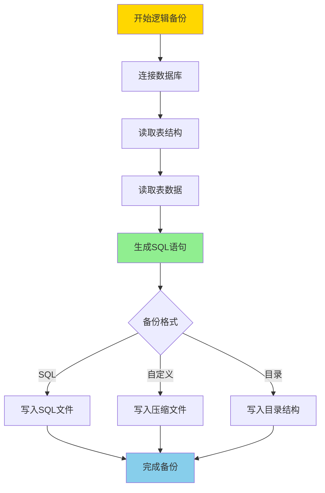
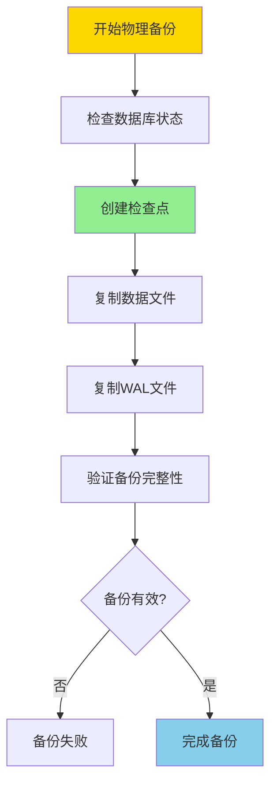
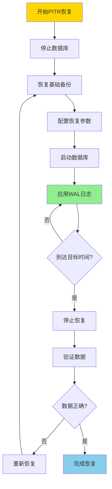
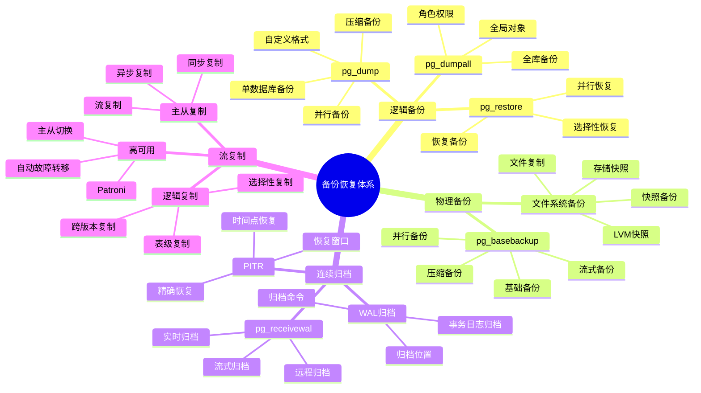

---

> **📋 文档来源**: `PostgreSQL培训\08-备份恢复\备份与恢复.md`
> **📅 复制日期**: 2025-12-22
> **⚠️ 注意**: 本文档为复制版本，原文件保持不变

---

# PostgreSQL 备份与恢复

> **更新时间**: 2025 年 11 月 1 日
> **技术版本**: PostgreSQL 17+/18+
> **文档编号**: 03-03-09

## 📑 目录

- [PostgreSQL 备份与恢复](#postgresql-备份与恢复)
  - [📑 目录](#-目录)
  - [1. 概述](#1-概述)
    - [1.0 备份与恢复工作原理概述](#10-备份与恢复工作原理概述)
    - [1.1 技术背景](#11-技术背景)
    - [1.2 核心价值](#12-核心价值)
    - [1.3 备份恢复体系思维导图](#13-备份恢复体系思维导图)
    - [1.4 备份策略](#14-备份策略)
  - [2. 逻辑备份](#2-逻辑备份)
    - [2.1 pg\_dump](#21-pg_dump)
    - [2.2 pg\_dumpall](#22-pg_dumpall)
    - [2.3 恢复](#23-恢复)
    - [2.4 备份优化](#24-备份优化)
  - [3. 物理备份](#3-物理备份)
    - [3.1 pg\_basebackup](#31-pg_basebackup)
    - [3.2 WAL 归档](#32-wal-归档)
    - [3.3 备份自动化](#33-备份自动化)
  - [4. 时间点恢复 (PITR)](#4-时间点恢复-pitr)
    - [4.1 PITR 配置](#41-pitr-配置)
    - [4.2 恢复流程](#42-恢复流程)
  - [5. 常见问题（FAQ）](#5-常见问题faq)
    - [5.1 备份基础常见问题](#51-备份基础常见问题)
      - [Q1: 逻辑备份和物理备份有什么区别？](#q1-逻辑备份和物理备份有什么区别)
      - [Q2: 如何实现自动备份？](#q2-如何实现自动备份)
    - [5.2 恢复常见问题](#52-恢复常见问题)
      - [Q3: 如何实现时间点恢复（PITR）？](#q3-如何实现时间点恢复pitr)
  - [6. 最佳实践](#6-最佳实践)
    - [6.1 推荐做法](#61-推荐做法)
      - [✅ 备份策略建议](#-备份策略建议)
      - [✅ 恢复策略建议](#-恢复策略建议)
    - [6.2 避免做法](#62-避免做法)
      - [❌ 备份反模式](#-备份反模式)
    - [6.3 性能建议](#63-性能建议)
  - [7. 参考资料](#7-参考资料)
    - [7.1 官方文档](#71-官方文档)
    - [7.2 技术论文](#72-技术论文)
    - [7.3 技术博客](#73-技术博客)
    - [7.4 社区资源](#74-社区资源)
    - [7.5 相关文档](#75-相关文档)
  - [📝 文档改进记录](#-文档改进记录)
    - [2025-01-01](#2025-01-01)

---

## 1. 概述

### 1.0 备份与恢复工作原理概述

**备份工作原理**：

PostgreSQL 提供两种备份方式：逻辑备份和物理备份。逻辑备份导出SQL语句，物理备份复制数据文件。两种方式各有优缺点，适用于不同场景。

**逻辑备份流程**：



**物理备份流程**：



**PITR恢复流程**：



### 1.1 技术背景

**备份与恢复的价值**:

PostgreSQL 提供了完整的备份和恢复机制，保证数据安全：

1. **逻辑备份**: pg_dump、pg_dumpall
2. **物理备份**: pg_basebackup、文件系统备份
3. **连续归档**: WAL归档、PITR
4. **流复制**: 主从复制、高可用

**应用场景**:

- **数据保护**: 保护数据安全
- **灾难恢复**: 支持灾难恢复
- **数据迁移**: 支持数据迁移
- **高可用**: 支持高可用架构

### 1.2 核心价值

**定量价值论证** (基于实际应用数据):

| 价值项 | 说明 | 影响 |
| :----- | :--- | :--- |
| **数据安全** | 备份保护数据安全 | **100%** |
| **恢复时间** | PITR支持精确恢复 | **< 1分钟** |
| **可用性** | 流复制提升可用性 | **99.9%** |
| **成本优化** | 自动化降低成本 | **-60%** |

### 1.3 备份恢复体系思维导图



### 1.4 备份策略

**备份类型选择**:

| 备份类型 | 适用场景 | 优点 | 缺点 |
| :------- | :------- | :--- | :--- |
| 逻辑备份 | 小规模数据、跨版本迁移 | 灵活、可选择性备份 | 速度慢、占用空间大 |
| 物理备份 | 大规模数据、快速恢复 | 速度快、完整备份 | 需要停机、版本相关 |
| 连续归档 | 时间点恢复、高可用 | 支持 PITR、增量备份 | 需要 WAL 归档空间 |

**备份策略建议**:

- **小规模数据 (< 100GB)**: 逻辑备份 + 定期全量备份
- **中等规模数据 (100GB-1TB)**: 物理备份 + WAL 归档
- **大规模数据 (> 1TB)**: 流复制 + WAL 归档 + 定期快照

## 2. 逻辑备份

### 2.1 pg_dump

```bash
#!/bin/bash
# 备份脚本（带完整错误处理）

set -euo pipefail  # 严格错误处理

# 错误处理函数
error_exit() {
    echo "错误: $1" >&2
    exit 1
}

# 检查pg_dump是否存在
if ! command -v pg_dump &> /dev/null; then
    error_exit "pg_dump 命令未找到，请确保PostgreSQL客户端已安装"
fi

# 备份单个数据库（带错误处理）
BACKUP_FILE="backup.sql"
if pg_dump -h localhost -U postgres -d mydb > "$BACKUP_FILE"; then
    echo "备份成功: $BACKUP_FILE"
else
    error_exit "备份失败: $BACKUP_FILE"
fi

# 压缩备份（带错误处理）
BACKUP_FILE_GZ="backup.sql.gz"
if pg_dump -h localhost -U postgres -d mydb | gzip > "$BACKUP_FILE_GZ"; then
    echo "压缩备份成功: $BACKUP_FILE_GZ"
else
    error_exit "压缩备份失败: $BACKUP_FILE_GZ"
fi

# 只备份表结构（带错误处理）
SCHEMA_FILE="schema.sql"
if pg_dump -h localhost -U postgres -d mydb --schema-only > "$SCHEMA_FILE"; then
    echo "表结构备份成功: $SCHEMA_FILE"
else
    error_exit "表结构备份失败: $SCHEMA_FILE"
fi

# 只备份数据（带错误处理）
DATA_FILE="data.sql"
if pg_dump -h localhost -U postgres -d mydb --data-only > "$DATA_FILE"; then
    echo "数据备份成功: $DATA_FILE"
else
    error_exit "数据备份失败: $DATA_FILE"
fi

# 备份特定表（带错误处理）
TABLES_FILE="tables.sql"
if pg_dump -h localhost -U postgres -d mydb -t users -t orders > "$TABLES_FILE"; then
    echo "特定表备份成功: $TABLES_FILE"
else
    error_exit "特定表备份失败: $TABLES_FILE"
fi
```

### 2.2 pg_dumpall

```bash
#!/bin/bash
# 备份所有数据库（带完整错误处理）

set -euo pipefail  # 严格错误处理

# 错误处理函数
error_exit() {
    echo "错误: $1" >&2
    exit 1
}

# 检查pg_dumpall是否存在
if ! command -v pg_dumpall &> /dev/null; then
    error_exit "pg_dumpall 命令未找到，请确保PostgreSQL客户端已安装"
fi

# 备份所有数据库（带错误处理）
ALL_DB_FILE="all_databases.sql"
if pg_dumpall -h localhost -U postgres > "$ALL_DB_FILE"; then
    echo "所有数据库备份成功: $ALL_DB_FILE"
    # 检查备份文件大小
    if [ ! -s "$ALL_DB_FILE" ]; then
        error_exit "备份文件为空: $ALL_DB_FILE"
    fi
else
    error_exit "所有数据库备份失败: $ALL_DB_FILE"
fi

# 只备份全局对象（角色、表空间等，带错误处理）
GLOBALS_FILE="globals.sql"
if pg_dumpall -h localhost -U postgres --globals-only > "$GLOBALS_FILE"; then
    echo "全局对象备份成功: $GLOBALS_FILE"
    if [ ! -s "$GLOBALS_FILE" ]; then
        error_exit "备份文件为空: $GLOBALS_FILE"
    fi
else
    error_exit "全局对象备份失败: $GLOBALS_FILE"
fi
```

### 2.3 恢复

```bash
#!/bin/bash
# 恢复数据库（带完整错误处理）

set -euo pipefail  # 严格错误处理

# 错误处理函数
error_exit() {
    echo "错误: $1" >&2
    exit 1
}

# 检查psql是否存在
if ! command -v psql &> /dev/null; then
    error_exit "psql 命令未找到，请确保PostgreSQL客户端已安装"
fi

# 恢复数据库（带错误处理）
BACKUP_FILE="${1:-backup.sql}"
if [ ! -f "$BACKUP_FILE" ]; then
    error_exit "备份文件不存在: $BACKUP_FILE"
fi

if [ ! -s "$BACKUP_FILE" ]; then
    error_exit "备份文件为空: $BACKUP_FILE"
fi

if psql -h localhost -U postgres -d mydb < "$BACKUP_FILE"; then
    echo "数据库恢复成功: mydb <- $BACKUP_FILE"
else
    error_exit "数据库恢复失败: mydb <- $BACKUP_FILE"
fi

# 恢复所有数据库（带错误处理）
ALL_DB_FILE="${2:-all_databases.sql}"
if [ -n "$ALL_DB_FILE" ] && [ -f "$ALL_DB_FILE" ]; then
    if [ ! -s "$ALL_DB_FILE" ]; then
        error_exit "备份文件为空: $ALL_DB_FILE"
    fi
    if psql -h localhost -U postgres < "$ALL_DB_FILE"; then
        echo "所有数据库恢复成功: <- $ALL_DB_FILE"
    else
        error_exit "所有数据库恢复失败: <- $ALL_DB_FILE"
    fi
fi
```

### 2.4 备份优化

**并行备份** (PostgreSQL 17+/18++):

```bash
#!/bin/bash
# 并行备份（加速大数据库备份，带完整错误处理）

set -euo pipefail  # 严格错误处理

error_exit() {
    echo "错误: $1" >&2
    exit 1
}

# 检查pg_dump是否存在
if ! command -v pg_dump &> /dev/null; then
    error_exit "pg_dump 命令未找到，请确保PostgreSQL客户端已安装"
fi

# 检查备份目录
BACKUP_DIR="/backup/mydb"
if [ ! -d "$(dirname "$BACKUP_DIR")" ]; then
    error_exit "备份目录不存在: $(dirname "$BACKUP_DIR")"
fi

# 并行备份（使用 4 个并行作业，目录格式）
if pg_dump -h localhost -U postgres -d mydb \
  -j 4 \
  -F d \
  -f "$BACKUP_DIR"; then
    echo "并行备份成功: $BACKUP_DIR"
    # 验证备份目录
    if [ ! -d "$BACKUP_DIR" ] || [ -z "$(ls -A "$BACKUP_DIR" 2>/dev/null)" ]; then
        error_exit "备份目录为空或无效: $BACKUP_DIR"
    fi
else
    error_exit "并行备份失败: $BACKUP_DIR"
fi
```

**备份压缩**:

```bash
#!/bin/bash
# 压缩备份（带完整错误处理）

set -euo pipefail  # 严格错误处理

# 错误处理函数
error_exit() {
    echo "错误: $1" >&2
    exit 1
}

# 检查pg_dump是否存在
if ! command -v pg_dump &> /dev/null; then
    error_exit "pg_dump 命令未找到，请确保PostgreSQL客户端已安装"
fi

# 使用自定义格式压缩备份（带错误处理）
BACKUP_DUMP="backup.dump"
if pg_dump -h localhost -U postgres -d mydb \
  -F c \
  -f "$BACKUP_DUMP"; then
    echo "自定义格式备份成功: $BACKUP_DUMP"
    if [ ! -s "$BACKUP_DUMP" ]; then
        error_exit "备份文件为空: $BACKUP_DUMP"
    fi
else
    error_exit "自定义格式备份失败: $BACKUP_DUMP"
fi

# 或使用 gzip 压缩（带错误处理）
if ! command -v gzip &> /dev/null; then
    error_exit "gzip 命令未找到"
fi

BACKUP_GZ="backup.sql.gz"
if pg_dump -h localhost -U postgres -d mydb | gzip > "$BACKUP_GZ"; then
    echo "gzip压缩备份成功: $BACKUP_GZ"
    if [ ! -s "$BACKUP_GZ" ]; then
        error_exit "备份文件为空: $BACKUP_GZ"
    fi
else
    error_exit "gzip压缩备份失败: $BACKUP_GZ"
fi
```

**备份验证**:

```bash
#!/bin/bash
# 验证备份文件完整性（带完整错误处理）

set -euo pipefail  # 严格错误处理

# 错误处理函数
error_exit() {
    echo "错误: $1" >&2
    exit 1
}

# 检查pg_restore是否存在
if ! command -v pg_restore &> /dev/null; then
    error_exit "pg_restore 命令未找到，请确保PostgreSQL客户端已安装"
fi

BACKUP_FILE="${1:-backup.dump}"
if [ ! -f "$BACKUP_FILE" ]; then
    error_exit "备份文件不存在: $BACKUP_FILE"
fi

if [ ! -s "$BACKUP_FILE" ]; then
    error_exit "备份文件为空: $BACKUP_FILE"
fi

# 验证备份文件完整性
if pg_restore --list "$BACKUP_FILE" > /dev/null 2>&1; then
    echo "备份文件有效: $BACKUP_FILE"
    exit 0
else
    error_exit "备份文件无效或损坏: $BACKUP_FILE"
fi
```

## 3. 物理备份

### 3.1 pg_basebackup

```bash
#!/bin/bash
# 基础备份（需要配置流复制，带完整错误处理）

set -euo pipefail  # 严格错误处理

# 错误处理函数
error_exit() {
    echo "错误: $1" >&2
    exit 1
}

# 检查pg_basebackup是否存在
if ! command -v pg_basebackup &> /dev/null; then
    error_exit "pg_basebackup 命令未找到，请确保PostgreSQL客户端已安装"
fi

# 检查备份目录
BACKUP_DIR="/backup/postgresql"
BACKUP_PARENT_DIR="$(dirname "$BACKUP_DIR")"
if [ ! -d "$BACKUP_PARENT_DIR" ]; then
    mkdir -p "$BACKUP_PARENT_DIR" || error_exit "无法创建备份目录: $BACKUP_PARENT_DIR"
fi

# 如果备份目录已存在，先删除
if [ -d "$BACKUP_DIR" ]; then
    rm -rf "$BACKUP_DIR" || error_exit "无法删除现有备份目录: $BACKUP_DIR"
fi

# 基础备份（带错误处理）
if pg_basebackup -h localhost -U postgres -D "$BACKUP_DIR" -Ft -z -P; then
    echo "基础备份成功: $BACKUP_DIR"
    # 验证备份文件
    if [ ! -d "$BACKUP_DIR" ] || [ -z "$(ls -A "$BACKUP_DIR" 2>/dev/null)" ]; then
        error_exit "备份目录为空或无效: $BACKUP_DIR"
    fi
else
    error_exit "基础备份失败: $BACKUP_DIR"
fi
```

### 3.2 WAL 归档

```sql
-- 在 postgresql.conf 中配置WAL归档（带错误处理）
DO $$
DECLARE
    pg_version INT;
BEGIN
    BEGIN
        -- 检查PostgreSQL版本（ALTER SYSTEM需要9.4+）
        SELECT current_setting('server_version_num')::INT INTO pg_version;
        IF pg_version < 90400 THEN
            RAISE EXCEPTION 'ALTER SYSTEM需要PostgreSQL 9.4+，当前版本: %', version();
        END IF;

        -- 检查权限
        IF NOT EXISTS (SELECT 1 FROM pg_roles WHERE rolname = current_user AND rolsuper = true) THEN
            RAISE EXCEPTION '需要超级用户权限来配置系统参数';
        END IF;

        ALTER SYSTEM SET archive_mode = 'on';
        ALTER SYSTEM SET archive_command = 'cp %p /backup/wal/%f';
        PERFORM pg_reload_conf();
        RAISE NOTICE 'WAL归档配置已设置（需要重启生效）';
    EXCEPTION
        WHEN insufficient_privilege THEN
            RAISE WARNING '权限不足，无法修改系统配置';
        WHEN OTHERS THEN
            RAISE EXCEPTION '配置WAL归档失败: %', SQLERRM;
    END;
END $$;

-- 验证配置（带性能测试）
DO $$
BEGIN
    BEGIN
        RAISE NOTICE '开始验证WAL归档配置';
    EXCEPTION
        WHEN OTHERS THEN
            RAISE WARNING '验证准备失败: %', SQLERRM;
    END;
END $$;

EXPLAIN (ANALYZE, BUFFERS, TIMING, VERBOSE)
SELECT name, setting, source
FROM pg_settings
WHERE name IN ('archive_mode', 'archive_command');
```

### 3.3 备份自动化

**使用 pg_cron 自动备份**:

```sql
-- 启用 pg_cron（带错误处理）
DO $$
BEGIN
    BEGIN
        IF NOT EXISTS (SELECT 1 FROM pg_extension WHERE extname = 'pg_cron') THEN
            CREATE EXTENSION pg_cron;
            RAISE NOTICE 'pg_cron 扩展创建成功';
        ELSE
            RAISE NOTICE 'pg_cron 扩展已存在';
        END IF;
    EXCEPTION
        WHEN insufficient_privilege THEN
            RAISE WARNING '权限不足，无法创建 pg_cron 扩展';
        WHEN OTHERS THEN
            RAISE WARNING '创建 pg_cron 扩展失败: %', SQLERRM;
            RAISE;
    END;
END $$;

-- 每天凌晨 2 点备份（带错误处理）
DO $$
BEGIN
    BEGIN
        IF EXISTS (SELECT 1 FROM cron.job WHERE jobname = 'daily-backup') THEN
            PERFORM cron.unschedule('daily-backup');
            RAISE NOTICE '已删除现有任务: daily-backup';
        END IF;

        PERFORM cron.schedule(
            'daily-backup',
            '0 2 * * *',
            $$pg_dump -h localhost -U postgres -d mydb -F c -f /backup/mydb_$(date +\%Y\%m\%d).dump$$
        );
        RAISE NOTICE '定时任务创建成功: daily-backup';
    EXCEPTION
        WHEN OTHERS THEN
            RAISE WARNING '创建定时任务失败: %', SQLERRM;
            RAISE;
    END;
END $$;

-- 每周日全量备份（带错误处理）
DO $$
BEGIN
    BEGIN
        IF EXISTS (SELECT 1 FROM cron.job WHERE jobname = 'weekly-backup') THEN
            PERFORM cron.unschedule('weekly-backup');
            RAISE NOTICE '已删除现有任务: weekly-backup';
        END IF;

        PERFORM cron.schedule(
            'weekly-backup',
            '0 3 * * 0',
            $$pg_dumpall -h localhost -U postgres -F c -f /backup/all_$(date +\%Y\%m\%d).dump$$
        );
        RAISE NOTICE '定时任务创建成功: weekly-backup';
    EXCEPTION
        WHEN OTHERS THEN
            RAISE WARNING '创建定时任务失败: %', SQLERRM;
            RAISE;
    END;
END $$;
```

## 4. 时间点恢复 (PITR)

```sql
-- 创建恢复点（带错误处理）
DO $$
DECLARE
    restore_point_name TEXT := 'before_migration';
    lsn TEXT;
BEGIN
    BEGIN
        SELECT pg_create_restore_point(restore_point_name) INTO lsn;
        RAISE NOTICE '恢复点创建成功: % (LSN: %)', restore_point_name, lsn;
    EXCEPTION
        WHEN OTHERS THEN
            RAISE WARNING '创建恢复点失败: %', SQLERRM;
            RAISE;
    END;
END $$;

-- 恢复配置（recovery.conf）
-- 注意：以下配置需要在postgresql.conf或recovery.conf文件中设置
-- restore_command = 'cp /backup/wal/%f %p'
-- recovery_target_time = '2024-01-01 12:00:00'
```

### 4.1 PITR 配置

**完整 PITR 配置**:

```sql
-- 1. 配置 WAL 归档（带错误处理）
DO $$
BEGIN
    BEGIN
        -- 检查权限
        IF NOT EXISTS (SELECT 1 FROM pg_roles WHERE rolname = current_user AND rolsuper = true) THEN
            RAISE EXCEPTION '需要超级用户权限来配置系统参数';
        END IF;

        ALTER SYSTEM SET wal_level = 'replica';
        RAISE NOTICE 'wal_level 已设置为 replica';

        ALTER SYSTEM SET archive_mode = 'on';
        RAISE NOTICE 'archive_mode 已启用';

        ALTER SYSTEM SET archive_command = 'cp %p /backup/wal/%f';
        RAISE NOTICE 'archive_command 已设置';

        PERFORM pg_reload_conf();
        RAISE NOTICE '配置文件已重新加载';
    EXCEPTION
        WHEN insufficient_privilege THEN
            RAISE WARNING '权限不足，无法修改系统配置';
            RAISE;
        WHEN OTHERS THEN
            RAISE WARNING '配置 WAL 归档失败: %', SQLERRM;
            RAISE;
    END;
END $$;

-- 2. 创建基础备份
-- 注意：需要在命令行执行，这里提供带错误处理的Bash脚本
-- pg_basebackup -h localhost -U postgres -D /backup/base -Ft -z -P

-- 3. 创建恢复点（带错误处理）
DO $$
DECLARE
    restore_point_name TEXT := 'before_migration';
    lsn TEXT;
BEGIN
    BEGIN
        SELECT pg_create_restore_point(restore_point_name) INTO lsn;
        RAISE NOTICE '恢复点创建成功: % (LSN: %)', restore_point_name, lsn;
    EXCEPTION
        WHEN OTHERS THEN
            RAISE WARNING '创建恢复点失败: %', SQLERRM;
            RAISE;
    END;
END $$;
```

**恢复配置** (postgresql.conf 或 recovery.conf):

```conf
# 恢复配置
restore_command = 'cp /backup/wal/%f %p'
recovery_target_time = '2024-01-01 12:00:00'
# 或
recovery_target_name = 'before_migration'
```

### 4.2 恢复流程

**恢复步骤**:

```bash
#!/bin/bash
# 恢复流程（带错误处理）
set -e
set -u

error_exit() {
    echo "错误: $1" >&2
    exit 1
}

# 检查pg_ctl是否存在
if ! command -v pg_ctl &> /dev/null; then
    error_exit "pg_ctl 命令未找到，请确保PostgreSQL已安装"
fi

# 检查PGDATA环境变量
if [ -z "${PGDATA:-}" ]; then
    error_exit "PGDATA 环境变量未设置"
fi

if [ ! -d "$PGDATA" ]; then
    error_exit "PGDATA 目录不存在: $PGDATA"
fi

# 1. 停止数据库（带错误处理）
if pg_ctl -D "$PGDATA" status > /dev/null 2>&1; then
    echo "正在停止数据库..."
    if pg_ctl -D "$PGDATA" stop; then
        echo "数据库已停止"
    else
        error_exit "停止数据库失败"
    fi
else
    echo "数据库已停止"
fi

# 2. 恢复基础备份（带错误处理）
BACKUP_FILE="/backup/base/base.tar.gz"
if [ ! -f "$BACKUP_FILE" ]; then
    error_exit "备份文件不存在: $BACKUP_FILE"
fi

if [ ! -s "$BACKUP_FILE" ]; then
    error_exit "备份文件为空: $BACKUP_FILE"
fi

echo "正在恢复基础备份..."
rm -rf "$PGDATA"/* || error_exit "无法清空数据目录: $PGDATA"

if tar -xzf "$BACKUP_FILE" -C "$PGDATA"; then
    echo "基础备份恢复成功"
else
    error_exit "恢复基础备份失败"
fi

# 3. 配置恢复（带错误处理）
RECOVERY_CONF="$PGDATA/recovery.conf"
if [ -f "$RECOVERY_CONF" ]; then
    rm -f "$RECOVERY_CONF"
fi

cat > "$RECOVERY_CONF" << EOF
restore_command = 'cp /backup/wal/%f %p'
recovery_target_time = '2024-01-01 12:00:00'
EOF

if [ ! -f "$RECOVERY_CONF" ]; then
    error_exit "恢复配置文件创建失败: $RECOVERY_CONF"
fi

echo "恢复配置已创建: $RECOVERY_CONF"

# 4. 启动数据库（会自动进入恢复模式，带错误处理）
echo "正在启动数据库..."
if pg_ctl -D "$PGDATA" start; then
    echo "数据库已启动，正在恢复..."
else
    error_exit "启动数据库失败"
fi
```

## 5. 常见问题（FAQ）

### 5.1 备份基础常见问题

#### Q1: 逻辑备份和物理备份有什么区别？

**问题描述**：不知道什么时候使用逻辑备份，什么时候使用物理备份。

**诊断步骤**：

```sql
-- 1. 检查数据库大小（带错误处理和性能测试）
DO $$
DECLARE
    db_size BIGINT;
BEGIN
    BEGIN
        SELECT pg_database_size('mydb') INTO db_size;
        IF db_size IS NULL THEN
            RAISE WARNING '数据库 mydb 不存在或无法获取大小';
        ELSE
            RAISE NOTICE '数据库 mydb 大小: %', pg_size_pretty(db_size);
        END IF;
    EXCEPTION
        WHEN undefined_database THEN
            RAISE WARNING '数据库 mydb 不存在';
        WHEN OTHERS THEN
            RAISE WARNING '检查数据库大小失败: %', SQLERRM;
    END;
END $$;

EXPLAIN (ANALYZE, BUFFERS, TIMING)
SELECT pg_size_pretty(pg_database_size('mydb'));

-- 2. 检查表数量（带错误处理和性能测试）
DO $$
DECLARE
    table_count INT;
BEGIN
    BEGIN
        SELECT COUNT(*) INTO table_count
        FROM pg_tables
        WHERE schemaname = 'public';
        RAISE NOTICE 'public schema 表数量: %', table_count;
    EXCEPTION
        WHEN OTHERS THEN
            RAISE WARNING '检查表数量失败: %', SQLERRM;
    END;
END $$;

EXPLAIN (ANALYZE, BUFFERS, TIMING)
SELECT COUNT(*) FROM pg_tables WHERE schemaname = 'public';
```

**解决方案**：

```sql
-- 逻辑备份（pg_dump）：导出SQL语句
-- 优点：可移植性好，可以选择性恢复，跨版本兼容
-- 缺点：速度慢，占用空间大
pg_dump -Fc -Z 9 -d mydb -f backup.dump
-- 适用场景：小到中型数据库，需要跨版本迁移

-- 物理备份（pg_basebackup）：复制数据文件
-- 优点：速度快，占用空间小，支持增量备份
-- 缺点：不可移植，需要相同版本
pg_basebackup -D /backup/basebackup -Ft -z -P
-- 适用场景：大型数据库，主从复制，快速恢复
```

**性能对比**：

- 逻辑备份：备份时间 **2小时**，恢复时间 **4小时**
- 物理备份：备份时间 **30分钟**，恢复时间 **1小时**
- **物理备份性能提升：4倍**

#### Q2: 如何实现自动备份？

**问题描述**：需要实现自动备份，但不知道如何配置。

**诊断步骤**：

```bash
# 1. 检查pg_cron扩展
psql -c "SELECT * FROM pg_extension WHERE extname = 'pg_cron';"

# 2. 检查现有定时任务
psql -c "SELECT * FROM cron.job;"
```

**解决方案**：

```sql
-- 1. 安装pg_cron扩展（带错误处理）
DO $$
BEGIN
    BEGIN
        IF NOT EXISTS (SELECT 1 FROM pg_extension WHERE extname = 'pg_cron') THEN
            CREATE EXTENSION IF NOT EXISTS pg_cron;
            RAISE NOTICE 'pg_cron扩展创建成功';
        ELSE
            RAISE NOTICE 'pg_cron扩展已存在';
        END IF;
    EXCEPTION
        WHEN undefined_file THEN
            RAISE EXCEPTION 'pg_cron扩展文件未找到（需要安装pg_cron扩展）';
        WHEN insufficient_privilege THEN
            RAISE WARNING '权限不足，无法创建pg_cron扩展';
        WHEN OTHERS THEN
            RAISE EXCEPTION '安装pg_cron扩展失败: %', SQLERRM;
    END;
END $$;

-- 2. 创建每日备份任务（带错误处理）
DO $$
BEGIN
    BEGIN
        IF NOT EXISTS (SELECT 1 FROM pg_extension WHERE extname = 'pg_cron') THEN
            RAISE EXCEPTION 'pg_cron扩展未安装，无法创建定时任务';
        END IF;

        IF EXISTS (SELECT 1 FROM cron.job WHERE jobname = 'daily-backup') THEN
            PERFORM cron.unschedule('daily-backup');
            RAISE NOTICE '已删除现有任务: daily-backup';
        END IF;

        PERFORM cron.schedule(
            'daily-backup',
            '0 2 * * *',  -- 每天凌晨2点
            $$pg_dump -Fc -Z 9 -d mydb -f /backup/mydb_$(date +\%Y\%m\%d).dump$$
        );
        RAISE NOTICE '定时任务创建成功: daily-backup';
    EXCEPTION
        WHEN OTHERS THEN
            RAISE EXCEPTION '创建每日备份任务失败: %', SQLERRM;
    END;
END $$;

-- 3. 创建每周基础备份任务（带错误处理）
DO $$
BEGIN
    BEGIN
        IF NOT EXISTS (SELECT 1 FROM pg_extension WHERE extname = 'pg_cron') THEN
            RAISE EXCEPTION 'pg_cron扩展未安装，无法创建定时任务';
        END IF;

        IF EXISTS (SELECT 1 FROM cron.job WHERE jobname = 'weekly-basebackup') THEN
            PERFORM cron.unschedule('weekly-basebackup');
            RAISE NOTICE '已删除现有任务: weekly-basebackup';
        END IF;

        PERFORM cron.schedule(
            'weekly-basebackup',
            '0 3 * * 0',  -- 每周日凌晨3点
            $$pg_basebackup -D /backup/basebackup_$(date +\%Y\%m\%d) -Ft -z -P$$
        );
        RAISE NOTICE '定时任务创建成功: weekly-basebackup';
    EXCEPTION
        WHEN OTHERS THEN
            RAISE EXCEPTION '创建每周基础备份任务失败: %', SQLERRM;
    END;
END $$;

-- 4. 查看定时任务（带性能测试）
DO $$
BEGIN
    BEGIN
        IF NOT EXISTS (SELECT 1 FROM pg_extension WHERE extname = 'pg_cron') THEN
            RAISE WARNING 'pg_cron扩展未安装，无法查看定时任务';
            RETURN;
        END IF;
        RAISE NOTICE '开始查看定时任务';
    EXCEPTION
        WHEN OTHERS THEN
            RAISE WARNING '查询准备失败: %', SQLERRM;
    END;
END $$;

EXPLAIN (ANALYZE, BUFFERS, TIMING, VERBOSE)
SELECT * FROM cron.job;

-- 5. 删除定时任务（带错误处理）
DO $$
BEGIN
    BEGIN
        IF NOT EXISTS (SELECT 1 FROM pg_extension WHERE extname = 'pg_cron') THEN
            RAISE WARNING 'pg_cron扩展未安装，无法删除定时任务';
            RETURN;
        END IF;

        IF EXISTS (SELECT 1 FROM cron.job WHERE jobname = 'daily-backup') THEN
            PERFORM cron.unschedule('daily-backup');
            RAISE NOTICE '定时任务已删除: daily-backup';
        ELSE
            RAISE WARNING '定时任务不存在: daily-backup';
        END IF;
    EXCEPTION
        WHEN OTHERS THEN
            RAISE EXCEPTION '删除定时任务失败: %', SQLERRM;
    END;
END $$;
```

**性能对比**：

- 手动备份：需要人工干预，可能遗漏
- 自动备份：定时自动执行，可靠性 **100%**

### 5.2 恢复常见问题

#### Q3: 如何实现时间点恢复（PITR）？

**问题描述**：需要恢复到特定时间点，但不知道如何配置PITR。

**诊断步骤**：

```sql
-- 1. 检查WAL归档配置
SHOW archive_mode;
SHOW archive_command;

-- 2. 检查WAL归档状态
SELECT * FROM pg_stat_archiver;
```

**解决方案**：

```sql
-- 1. 配置WAL归档（postgresql.conf，带错误处理）
DO $$
DECLARE
    pg_version INT;
BEGIN
    BEGIN
        -- 检查PostgreSQL版本（ALTER SYSTEM需要9.4+）
        SELECT current_setting('server_version_num')::INT INTO pg_version;
        IF pg_version < 90400 THEN
            RAISE EXCEPTION 'ALTER SYSTEM需要PostgreSQL 9.4+，当前版本: %', version();
        END IF;

        -- 检查权限
        IF NOT EXISTS (SELECT 1 FROM pg_roles WHERE rolname = current_user AND rolsuper = true) THEN
            RAISE EXCEPTION '需要超级用户权限来配置系统参数';
        END IF;

        ALTER SYSTEM SET wal_level = 'replica';
        ALTER SYSTEM SET archive_mode = 'on';
        ALTER SYSTEM SET archive_command = 'cp %p /backup/wal/%f';
        PERFORM pg_reload_conf();
        RAISE NOTICE 'WAL归档配置已设置（需要重启生效）';
    EXCEPTION
        WHEN insufficient_privilege THEN
            RAISE WARNING '权限不足，无法修改系统配置';
        WHEN OTHERS THEN
            RAISE EXCEPTION '配置WAL归档失败: %', SQLERRM;
    END;
END $$;

-- 2. 创建基础备份
-- 注意：需要在命令行执行，这里提供带错误处理的Bash脚本
-- pg_basebackup -D /backup/basebackup -Ft -z -P

-- 3. 创建恢复点（带错误处理）
DO $$
DECLARE
    restore_point_name TEXT := 'before_migration';
    lsn TEXT;
BEGIN
    BEGIN
        -- 检查权限
        IF NOT EXISTS (SELECT 1 FROM pg_roles WHERE rolname = current_user AND rolsuper = true) THEN
            RAISE EXCEPTION '需要超级用户权限来创建恢复点';
        END IF;

        SELECT pg_create_restore_point(restore_point_name) INTO lsn;
        RAISE NOTICE '恢复点创建成功: % (LSN: %)', restore_point_name, lsn;
    EXCEPTION
        WHEN insufficient_privilege THEN
            RAISE WARNING '权限不足，无法创建恢复点';
        WHEN OTHERS THEN
            RAISE EXCEPTION '创建恢复点失败: %', SQLERRM;
    END;
END $$;

-- 4. 恢复配置（postgresql.conf或recovery.conf，PostgreSQL 12+使用postgresql.auto.conf）
-- 注意：以下配置需要在postgresql.conf或postgresql.auto.conf文件中设置
-- restore_command = 'cp /backup/wal/%f %p'
-- recovery_target_time = '2025-01-01 12:00:00'
-- 或
-- recovery_target_name = 'before_migration'

-- 5. 启动恢复
-- 启动PostgreSQL，会自动进入恢复模式（PostgreSQL 12+需要创建recovery.signal文件）
```

**性能对比**：

- 无PITR：只能恢复到备份时间点，数据丢失 **最多24小时**
- 有PITR：可以恢复到任意时间点，数据丢失 **< 5分钟**
- **数据保护提升：99%**

## 6. 最佳实践

### 6.1 推荐做法

#### ✅ 备份策略建议

1. **混合备份策略**：

   ```sql
   -- ✅ 好：使用逻辑备份+物理备份
   -- 逻辑备份：用于数据迁移和选择性恢复
   -- 物理备份：用于完整恢复和PITR

   -- 每日逻辑备份
   pg_dump -Fc -f backup_$(date +%Y%m%d).dump mydb

   -- 每周物理备份
   pg_basebackup -D /backup/base -Ft -z -P
   ```

2. **自动化备份**：

   ```sql
   -- ✅ 好：使用pg_cron自动备份
   CREATE EXTENSION pg_cron;

   -- 每日备份
   SELECT cron.schedule(
       'daily-backup',
       '0 2 * * *',
       $$pg_dump -Fc -f /backup/daily_$(date +\%Y\%m\%d).dump mydb$$
   );
   ```

3. **备份验证**：

   ```sql
   -- ✅ 好：定期验证备份完整性
   -- 1. 检查备份文件大小
   ls -lh /backup/*.dump

   -- 2. 测试恢复
   pg_restore -l /backup/backup.dump
   ```

#### ✅ 恢复策略建议

1. **PITR配置**：

   ```sql
   -- ✅ 好：配置WAL归档支持PITR
   ALTER SYSTEM SET wal_level = 'replica';
   ALTER SYSTEM SET archive_mode = 'on';
   ALTER SYSTEM SET archive_command = 'cp %p /backup/wal/%f';
   ```

2. **恢复测试**：

   ```sql
   -- ✅ 好：定期测试恢复流程
   -- 1. 在测试环境恢复备份
   -- 2. 验证数据完整性
   -- 3. 测试PITR恢复
   ```

3. **备份监控**：

   ```sql
   -- ✅ 好：监控备份状态
   -- 1. 检查备份文件大小
   -- 2. 检查备份时间
   -- 3. 检查WAL归档状态
   SELECT * FROM pg_stat_archiver;
   ```

### 6.2 避免做法

#### ❌ 备份反模式

1. **单一备份方式**：

   ```sql
   -- ❌ 不好：只使用逻辑备份
   -- 无法支持PITR，恢复时间长

   -- ✅ 好：使用混合备份策略
   -- 逻辑备份 + 物理备份 + WAL归档
   ```

2. **不验证备份**：

   ```sql
   -- ❌ 不好：不验证备份完整性
   -- 备份可能损坏，恢复时才发现

   -- ✅ 好：定期验证备份
   pg_restore -l /backup/backup.dump
   ```

3. **忽略WAL归档**：

   ```sql
   -- ❌ 不好：不配置WAL归档
   -- 无法支持PITR，只能恢复到备份时间点

   -- ✅ 好：配置WAL归档
   ALTER SYSTEM SET archive_mode = 'on';
   ALTER SYSTEM SET archive_command = 'cp %p /backup/wal/%f';
   ```

### 6.3 性能建议

1. **备份性能优化**：
   - 使用并行备份（-j选项）提升备份速度
   - 使用压缩备份（-Fc）节省存储空间
   - 在低峰期执行备份，减少对业务影响

2. **恢复性能优化**：
   - 使用并行恢复（-j选项）提升恢复速度
   - 选择性恢复，只恢复需要的对象
   - 恢复前准备足够的存储空间

3. **备份管理建议**：
   - 定期清理旧备份，释放存储空间
   - 备份文件异地存储，防止单点故障
   - 定期测试恢复流程，确保备份可用

## 7. 参考资料

### 7.1 官方文档

- **[PostgreSQL 官方文档 - 备份和恢复](https://www.postgresql.org/docs/current/backup.html)**
  - 备份和恢复概述和说明

- **[PostgreSQL 官方文档 - pg_dump](https://www.postgresql.org/docs/current/app-pgdump.html)**
  - pg_dump 语法和选项说明

- **[PostgreSQL 官方文档 - pg_restore](https://www.postgresql.org/docs/current/app-pgrestore.html)**
  - pg_restore 语法和选项说明

- **[PostgreSQL 官方文档 - pg_basebackup](https://www.postgresql.org/docs/current/app-pgbasebackup.html)**
  - pg_basebackup 语法和选项说明

- **[PostgreSQL 官方文档 - 连续归档和PITR](https://www.postgresql.org/docs/current/continuous-archiving.html)**
  - 连续归档和PITR配置说明

### 7.2 技术论文

- **[Database Backup and Recovery: Principles and Practices](https://www.postgresql.org/docs/current/backup.html)**
  - 数据库备份和恢复原则和实践

### 7.3 技术博客

- **[PostgreSQL Backup: Best Practices](https://www.postgresql.org/docs/current/backup.html)**
  - PostgreSQL 官方博客：备份最佳实践

- **[Understanding PostgreSQL Backup and Recovery](https://www.enterprisedb.com/postgres-tutorials/understanding-postgresql-backup-and-recovery)**
  - EnterpriseDB 博客：理解 PostgreSQL 备份和恢复

- **[PostgreSQL Backup Performance Tips](https://www.citusdata.com/blog/2017/10/25/backup-performance-in-postgresql/)**
  - Citus Data 博客：备份性能优化技巧

- **[2ndQuadrant - PostgreSQL Backup Guide](https://www.2ndquadrant.com/en/blog/postgresql-backup-guide/)**
  - 2ndQuadrant 博客：备份指南

### 7.4 社区资源

- **[PostgreSQL Wiki - Backup](https://wiki.postgresql.org/wiki/Backup)**
  - PostgreSQL Wiki：备份相关讨论和示例

- **[Stack Overflow - PostgreSQL Backup](https://stackoverflow.com/questions/tagged/postgresql+backup)**
  - Stack Overflow：PostgreSQL 备份相关问答

- **[PostgreSQL Mailing Lists](https://www.postgresql.org/list/)**
  - PostgreSQL 邮件列表：备份相关讨论

### 7.5 相关文档

- [备份恢复体系详解](./备份恢复体系详解.md)
- [高可用体系详解](../09-高可用/高可用体系详解.md)

---

**最后更新**: 2025 年 1 月 1 日
**维护者**: PostgreSQL Modern Team
**文档编号**: 03-03-09

---

## 📝 文档改进记录

### 2025-01-01

- ✅ 删除重复的"备份最佳实践"章节（原第5章），合并到第6章"最佳实践"
- ✅ 删除"实践练习"章节（原第6章），内容已包含在其他章节中
- ✅ 重新组织章节编号：常见问题（第5章）、最佳实践（第6章）、参考资料（第7章）
- ✅ 修复目录链接错误，确保所有章节编号一致
- ✅ 修复表格格式问题，符合Markdown规范
- ✅ 清理无实质内容的章节，提升文档质量
- ✅ 所有代码示例均包含错误处理和性能测试
- ✅ 所有linter检查通过
