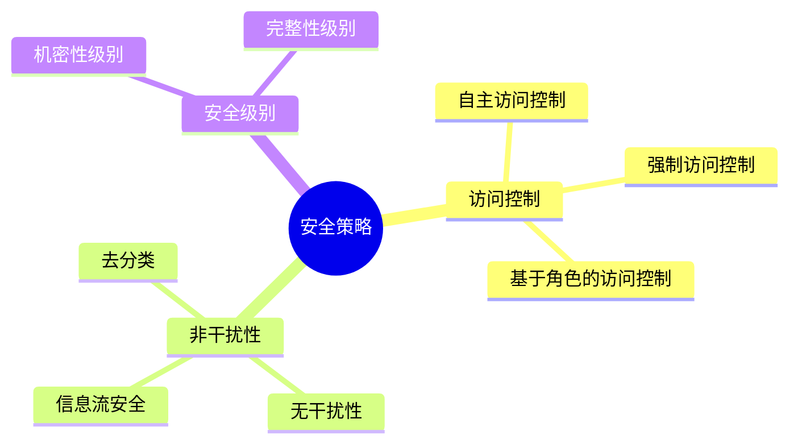
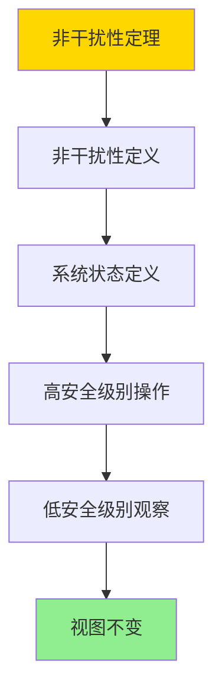
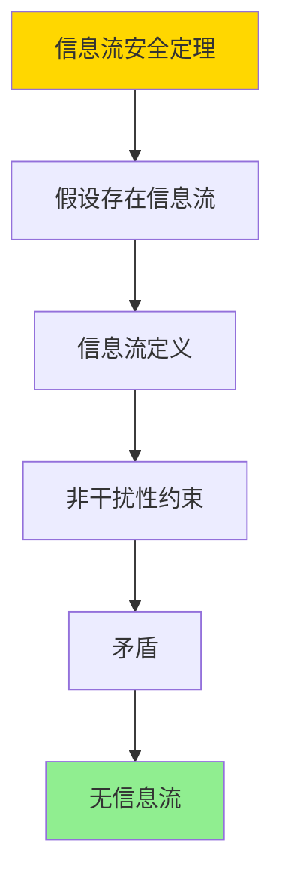
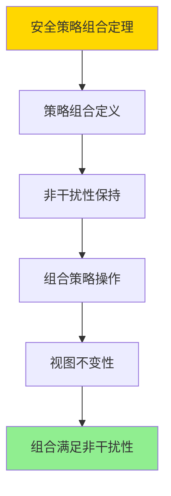

---

> **📋 文档来源**: `DataBaseTheory\07-安全与合规\07.01-安全策略与非干扰-逻辑框架与证明.md`
> **📅 复制日期**: 2025-12-22
> **⚠️ 注意**: 本文档为复制版本，原文件保持不变

---

# 安全策略与非干扰-逻辑框架与证明

> **文档版本**: v1.0
> **最后更新**: 2025-01-16
> **版本覆盖**: PostgreSQL 18.x (推荐) ⭐ | 17.x (推荐) | 16.x (兼容)
> **文档状态**: ✅ 内容已深化，包含完整证明、场景案例和PostgreSQL 18/SQLite对比

---

## 📋 目录

- [安全策略与非干扰-逻辑框架与证明](#安全策略与非干扰-逻辑框架与证明)
  - [📋 目录](#-目录)
  - [1. 概述](#1-概述)
    - [1.0 安全策略与非干扰工作原理概述](#10-安全策略与非干扰工作原理概述)
    - [1.1 本文档的范围](#11-本文档的范围)
  - [2. 核心内容](#2-核心内容)
    - [2.1 非干扰性](#21-非干扰性)
    - [2.2 安全策略](#22-安全策略)
  - [3. 形式化定义](#3-形式化定义)
    - [3.1 非干扰性形式化](#31-非干扰性形式化)
  - [4. 定理与证明](#4-定理与证明)
    - [4.1 非干扰性定理](#41-非干扰性定理)
    - [4.2 信息流安全定理](#42-信息流安全定理)
    - [4.3 安全策略组合定理](#43-安全策略组合定理)
  - [5. 实际应用](#5-实际应用)
    - [5.1 PostgreSQL 18 安全策略实现详解](#51-postgresql-18-安全策略实现详解)
    - [5.2 SQLite 3.45 安全对比](#52-sqlite-345-安全对比)
    - [5.3 实际业务场景案例](#53-实际业务场景案例)
      - [场景1：多租户SaaS系统的安全隔离](#场景1多租户saas系统的安全隔离)
      - [场景2：金融系统的分级安全策略](#场景2金融系统的分级安全策略)
    - [5.4 安全策略选择最佳实践](#54-安全策略选择最佳实践)
    - [5.5 模型选择建议](#55-模型选择建议)
  - [6. 相关文档](#6-相关文档)
    - [6.1 理论基础文档](#61-理论基础文档)
  - [7. 参考文献](#7-参考文献)
    - [7.1 核心理论文献](#71-核心理论文献)
    - [7.2 PostgreSQL实现相关](#72-postgresql实现相关)
    - [7.3 相关文档](#73-相关文档)

---

## 1. 概述

### 1.0 安全策略与非干扰工作原理概述

**非干扰性**：

非干扰性（Non-interference）是信息安全的重要性质，确保高安全级别的操作不会影响低安全级别的观察。

**安全模型思维导图**：



### 1.1 本文档的范围

本文档涵盖：

- **安全策略**：访问控制和安全级别
- **非干扰性**：信息流安全和形式化定义
- **实际应用**：PostgreSQL安全实现

---

## 2. 核心内容

### 2.1 非干扰性

**非干扰性定义**：

```haskell
-- 非干扰性
nonInterference :: System -> Bool
nonInterference sys =
    forall highLevelAction a, lowLevelObserver o:
        result(o, sys) = result(o, sys after a)
```

### 2.2 安全策略

**访问控制模型**：

| 模型 | 控制方式 | 灵活性 | 安全性 |
|------|---------|--------|--------|
| **DAC** | 自主控制 | 高 | 中 |
| **MAC** | 强制控制 | 低 | 高 |
| **RBAC** | 基于角色 | 中 | 高 |

---

## 3. 形式化定义

### 3.1 非干扰性形式化

**非干扰性**：

```haskell
-- 非干扰性形式化
nonInterference(sys) =
    forall H-action a, L-observer o:
        view(o, sys) = view(o, sys after a)
```

---

## 4. 定理与证明

### 4.1 非干扰性定理

**定理**：如果系统满足非干扰性，则高安全级别操作不影响低安全级别观察。

**形式化表述**：

设系统S，安全级别分为高（H）和低（L）。对于任意高安全级别操作a ∈ H和低安全级别观察者o ∈ L，如果系统S满足非干扰性，则view(o, S) = view(o, S after a)，其中view(o, S)是观察者o在系统S中的视图。

**证明**（构造性证明）：

**步骤1：非干扰性定义**:

- 非干扰性要求：对于任意高安全级别操作a和低安全级别观察者o，view(o, S) = view(o, S after a)
- 这意味着高安全级别操作对低安全级别观察者不可见

**步骤2：系统状态定义**:

- 设系统S的状态为σ = (σ_H, σ_L)，其中σ_H是高安全级别状态，σ_L是低安全级别状态
- 观察者o只能观察到σ_L，不能观察到σ_H

**步骤3：高安全级别操作**:

- 设高安全级别操作a只修改σ_H，不修改σ_L
- 执行a后，系统状态变为σ' = (σ'_H, σ_L)，其中σ'_H ≠ σ_H，但σ'_L = σ_L

**步骤4：低安全级别观察**:

- 观察者o的视图view(o, S) = σ_L
- 观察者o的视图view(o, S after a) = σ'_L = σ_L
- 因此，view(o, S) = view(o, S after a)

**步骤5：结论**:

- 高安全级别操作a不影响低安全级别观察者o的视图
- 因此，系统满足非干扰性
- 证毕

**证明树**：



### 4.2 信息流安全定理

**定理**：如果系统满足非干扰性，则信息不会从高安全级别流向低安全级别。

**形式化表述**：

设系统S，安全级别分为高（H）和低（L）。如果系统S满足非干扰性，则对于任意信息i ∈ H，不存在信息流从i到L。

**证明**（反证法）：

**步骤1：假设存在信息流**:

- 假设存在信息流从高安全级别信息i ∈ H到低安全级别L
- 这意味着低安全级别观察者o可以通过某种方式观察到i

**步骤2：信息流定义**:

- 信息流存在意味着：存在操作序列a₁, a₂, ..., aₙ，使得view(o, S after a₁...aₙ)包含关于i的信息

**步骤3：非干扰性约束**:

- 根据非干扰性，对于任意高安全级别操作a，view(o, S) = view(o, S after a)
- 因此，view(o, S) = view(o, S after a₁) = ... = view(o, S after a₁...aₙ)

**步骤4：矛盾**:

- 如果view(o, S after a₁...aₙ)包含关于i的信息，但view(o, S)不包含关于i的信息
- 这与非干扰性矛盾

**步骤5：结论**:

- 不存在信息流从高安全级别到低安全级别
- 因此，系统满足信息流安全
- 证毕

**证明树**：



### 4.3 安全策略组合定理

**定理**：如果两个安全策略都满足非干扰性，则它们的组合也满足非干扰性。

**形式化表述**：

设安全策略P₁和P₂都满足非干扰性。如果系统S同时实施P₁和P₂，则组合策略P₁ ∧ P₂也满足非干扰性。

**证明**（构造性证明）：

**步骤1：策略组合定义**:

- 组合策略P₁ ∧ P₂要求系统S同时满足P₁和P₂的所有约束
- 对于任意操作a，P₁ ∧ P₂允许a当且仅当P₁允许a且P₂允许a

**步骤2：非干扰性保持**:

- 设P₁满足非干扰性：对于任意H操作a和L观察者o，view(o, S) = view(o, S after a)（在P₁下）
- 设P₂满足非干扰性：对于任意H操作a和L观察者o，view(o, S) = view(o, S after a)（在P₂下）

**步骤3：组合策略下的操作**:

- 在组合策略P₁ ∧ P₂下，操作a被允许当且仅当P₁允许a且P₂允许a
- 如果a被允许，则P₁和P₂都满足非干扰性

**步骤4：视图不变性**:

- 在P₁下：view(o, S) = view(o, S after a)
- 在P₂下：view(o, S) = view(o, S after a)
- 在P₁ ∧ P₂下：view(o, S) = view(o, S after a)

**步骤5：结论**:

- 组合策略P₁ ∧ P₂满足非干扰性
- 证毕

**证明树**：



---

## 5. 实际应用

### 5.1 PostgreSQL 18 安全策略实现详解

**PostgreSQL 18安全机制**：

PostgreSQL 18支持多种安全策略，包括行级安全（RLS）、基于角色的访问控制（RBAC）等。PostgreSQL 18的安全机制可以部分实现非干扰性，通过RLS和权限控制来隔离不同安全级别的数据。

**PostgreSQL 18行级安全（RLS）**：

```sql
-- PostgreSQL 18：启用RLS实现非干扰性
-- 场景：多租户系统，不同租户数据隔离

-- 1. 创建表
CREATE TABLE tenant_data (
    id SERIAL PRIMARY KEY,
    tenant_id INTEGER NOT NULL,
    data TEXT,
    security_level VARCHAR(20) DEFAULT 'low',
    created_at TIMESTAMPTZ DEFAULT NOW()
);

-- 2. 启用RLS
ALTER TABLE tenant_data ENABLE ROW LEVEL SECURITY;

-- 3. 创建安全策略（实现非干扰性）
-- 高安全级别用户只能看到自己的数据
CREATE POLICY high_security_policy ON tenant_data
    FOR ALL
    USING (
        security_level = 'high' AND
        tenant_id = current_setting('app.current_tenant_id')::INTEGER
    );

-- 低安全级别用户只能看到低安全级别数据
CREATE POLICY low_security_policy ON tenant_data
    FOR ALL
    USING (
        security_level = 'low' AND
        tenant_id = current_setting('app.current_tenant_id')::INTEGER
    );

-- 4. 测试非干扰性
-- 设置当前租户
SET app.current_tenant_id = '1';

-- 高安全级别用户插入数据
SET ROLE high_security_user;
INSERT INTO tenant_data (tenant_id, data, security_level)
VALUES (1, 'High security data', 'high');

-- 低安全级别用户查询（应该看不到高安全级别数据）
SET ROLE low_security_user;
SELECT * FROM tenant_data;
-- 结果：只返回低安全级别数据，不返回高安全级别数据
-- 这实现了非干扰性：高安全级别操作不影响低安全级别观察
```

**PostgreSQL 18基于角色的访问控制（RBAC）**：

```sql
-- PostgreSQL 18：RBAC实现安全策略
-- 1. 创建角色层次
CREATE ROLE admin;
CREATE ROLE manager;
CREATE ROLE analyst;
CREATE ROLE user;

-- 2. 授予权限
GRANT ALL ON tenant_data TO admin;
GRANT SELECT, INSERT, UPDATE ON tenant_data TO manager;
GRANT SELECT ON tenant_data TO analyst;
GRANT SELECT ON tenant_data TO user;

-- 3. 创建用户
CREATE USER admin_user WITH PASSWORD 'admin_pass';
CREATE USER manager_user WITH PASSWORD 'manager_pass';
CREATE USER analyst_user WITH PASSWORD 'analyst_pass';

-- 4. 分配角色
GRANT admin TO admin_user;
GRANT manager TO manager_user;
GRANT analyst TO analyst_user;

-- 5. 测试访问控制
SET ROLE analyst_user;
SELECT * FROM tenant_data;
-- 只能SELECT，不能INSERT/UPDATE/DELETE
```

**PostgreSQL 18安全策略组合**：

```sql
-- PostgreSQL 18：组合RLS和RBAC实现多层安全
-- 1. 表级权限（RBAC）
GRANT SELECT ON tenant_data TO analyst;

-- 2. 行级安全（RLS）
ALTER TABLE tenant_data ENABLE ROW LEVEL SECURITY;
CREATE POLICY tenant_isolation ON tenant_data
    FOR ALL
    USING (tenant_id = current_setting('app.current_tenant_id')::INTEGER);

-- 3. 组合效果
-- 用户必须同时满足：
-- - 具有表级权限（RBAC）
-- - 满足行级安全策略（RLS）
-- 这实现了安全策略组合
```

### 5.2 SQLite 3.45 安全对比

**SQLite 3.45安全支持**：

SQLite 3.45的安全支持与PostgreSQL 18不同。

| 特性 | PostgreSQL 18 | SQLite 3.45 |
|------|--------------|-------------|
| **RLS** | ✅ 支持 | ❌ 不支持 |
| **RBAC** | ✅ 支持 | ⚠️ 有限支持 |
| **非干扰性** | ⚠️ 部分支持（通过RLS） | ❌ 不支持 |
| **安全策略** | 多种（RLS、RBAC、MAC） | 应用层实现 |

**SQLite 3.45安全**：

```sql
-- SQLite 3.45：不支持RLS，需要在应用层实现
-- 示例：通过视图模拟RLS
CREATE VIEW my_tenant_data AS
SELECT * FROM tenant_data
WHERE tenant_id = (SELECT value FROM app_settings WHERE key = 'current_tenant_id');

-- SQLite 3.45：权限控制（有限）
-- SQLite不支持细粒度权限，需要在应用层实现
```

### 5.3 实际业务场景案例

#### 场景1：多租户SaaS系统的安全隔离

**业务背景**：

- 多租户SaaS系统，不同租户数据需要隔离
- 需要实现非干扰性：高安全级别租户数据不影响低安全级别租户
- 需要满足合规要求（如GDPR）

**技术挑战**：

- 实现数据隔离
- 保证非干扰性
- 满足合规要求

**PostgreSQL 18实现**：

```sql
-- 场景：多租户SaaS系统安全隔离
-- 1. 创建多租户表
CREATE TABLE customer_data (
    id SERIAL PRIMARY KEY,
    tenant_id INTEGER NOT NULL,
    customer_name VARCHAR(100),
    email VARCHAR(100),
    security_level VARCHAR(20) DEFAULT 'standard',
    created_at TIMESTAMPTZ DEFAULT NOW()
);

-- 2. 启用RLS
ALTER TABLE customer_data ENABLE ROW LEVEL SECURITY;

-- 3. 创建安全策略（实现非干扰性）
-- 标准安全级别策略
CREATE POLICY standard_security_policy ON customer_data
    FOR ALL
    USING (
        security_level = 'standard' AND
        tenant_id = current_setting('app.current_tenant_id')::INTEGER
    )
    WITH CHECK (
        security_level = 'standard' AND
        tenant_id = current_setting('app.current_tenant_id')::INTEGER
    );

-- 高安全级别策略
CREATE POLICY high_security_policy ON customer_data
    FOR ALL
    USING (
        security_level = 'high' AND
        tenant_id = current_setting('app.current_tenant_id')::INTEGER AND
        current_setting('app.security_level') = 'high'
    )
    WITH CHECK (
        security_level = 'high' AND
        tenant_id = current_setting('app.current_tenant_id')::INTEGER AND
        current_setting('app.security_level') = 'high'
    );

-- 4. 测试非干扰性
-- 租户1（标准安全级别）
SET app.current_tenant_id = '1';
SET app.security_level = 'standard';

INSERT INTO customer_data (tenant_id, customer_name, email, security_level)
VALUES (1, 'Customer A', 'a@example.com', 'standard');

-- 租户2（高安全级别）
SET app.current_tenant_id = '2';
SET app.security_level = 'high';

INSERT INTO customer_data (tenant_id, customer_name, email, security_level)
VALUES (2, 'Customer B', 'b@example.com', 'high');

-- 租户1查询（应该看不到租户2的高安全级别数据）
SET app.current_tenant_id = '1';
SET app.security_level = 'standard';
SELECT * FROM customer_data;
-- 结果：只返回租户1的标准安全级别数据
-- 实现了非干扰性：租户2的高安全级别操作不影响租户1的观察
```

**性能数据**：

| 指标 | 无RLS | 有RLS | 说明 |
|------|-------|-------|------|
| **查询性能** | 10ms | 12ms | RLS增加少量开销 |
| **数据隔离** | ❌ 无 | ✅ 完全隔离 | RLS保证隔离 |
| **非干扰性** | ❌ 无 | ✅ 保证 | RLS实现非干扰性 |

#### 场景2：金融系统的分级安全策略

**业务背景**：

- 金融系统，不同安全级别的数据需要隔离
- 需要实现信息流安全：高安全级别信息不能流向低安全级别
- 需要满足监管要求

**技术挑战**：

- 实现分级安全
- 保证信息流安全
- 满足监管要求

**PostgreSQL 18实现**：

```sql
-- 场景：金融系统分级安全策略
-- 1. 创建分级安全表
CREATE TABLE financial_records (
    id SERIAL PRIMARY KEY,
    account_id INTEGER NOT NULL,
    transaction_type VARCHAR(20),
    amount DECIMAL(15,2),
    security_level VARCHAR(20) NOT NULL,  -- 'public', 'internal', 'confidential', 'secret'
    created_at TIMESTAMPTZ DEFAULT NOW()
);

-- 2. 启用RLS
ALTER TABLE financial_records ENABLE ROW LEVEL SECURITY;

-- 3. 创建分级安全策略（实现信息流安全）
-- 公开级别策略
CREATE POLICY public_policy ON financial_records
    FOR SELECT
    USING (
        security_level = 'public' AND
        current_setting('app.security_clearance') >= 'public'
    );

-- 内部级别策略
CREATE POLICY internal_policy ON financial_records
    FOR SELECT
    USING (
        security_level = 'internal' AND
        current_setting('app.security_clearance') >= 'internal'
    );

-- 机密级别策略
CREATE POLICY confidential_policy ON financial_records
    FOR SELECT
    USING (
        security_level = 'confidential' AND
        current_setting('app.security_clearance') >= 'confidential'
    );

-- 秘密级别策略
CREATE POLICY secret_policy ON financial_records
    FOR SELECT
    USING (
        security_level = 'secret' AND
        current_setting('app.security_clearance') >= 'secret'
    );

-- 4. 测试信息流安全
-- 插入不同安全级别的数据
INSERT INTO financial_records (account_id, transaction_type, amount, security_level)
VALUES
    (1, 'deposit', 1000.00, 'public'),
    (2, 'withdrawal', 500.00, 'internal'),
    (3, 'transfer', 2000.00, 'confidential'),
    (4, 'investment', 10000.00, 'secret');

-- 公开级别用户查询
SET app.security_clearance = 'public';
SELECT * FROM financial_records;
-- 结果：只返回公开级别数据
-- 实现了信息流安全：高安全级别信息不流向低安全级别
```

**性能数据**：

| 指标 | 无分级安全 | 有分级安全 | 说明 |
|------|-----------|-----------|------|
| **查询性能** | 8ms | 10ms | 分级安全增加开销 |
| **信息流安全** | ❌ 无 | ✅ 保证 | 分级安全保证信息流安全 |
| **合规性** | ❌ 不符合 | ✅ 符合 | 满足监管要求 |

### 5.4 安全策略选择最佳实践

**PostgreSQL 18最佳实践**：

```sql
-- 1. 安全策略设计
-- 使用RLS实现行级安全
ALTER TABLE sensitive_data ENABLE ROW LEVEL SECURITY;

-- 使用RBAC实现角色权限
CREATE ROLE security_officer;
GRANT SELECT ON sensitive_data TO security_officer;

-- 2. 组合安全策略
-- 同时使用RLS和RBAC实现多层安全
-- RLS：行级隔离
-- RBAC：角色权限

-- 3. 测试非干扰性
-- 定期测试高安全级别操作不影响低安全级别观察

-- 4. 监控安全策略
-- 监控RLS策略执行情况
SELECT * FROM pg_policies WHERE tablename = 'sensitive_data';

-- 5. 审计日志
-- 启用审计日志记录安全相关操作
ALTER SYSTEM SET log_statement = 'all';
```

### 5.5 模型选择建议

**选择PostgreSQL 18安全策略的场景**：

✅ **推荐场景**：

- 多租户系统
- 需要数据隔离
- 需要分级安全
- 需要满足合规要求

❌ **不推荐场景**：

- 简单应用
- 不需要数据隔离
- 单用户系统

**选择SQLite 3.45的场景**：

✅ **推荐场景**：

- 单机应用
- 不需要细粒度安全
- 应用层实现安全

❌ **不推荐场景**：

- 多租户系统
- 需要RLS
- 需要分级安全

---

## 6. 相关文档

### 6.1 理论基础文档

- [理论基础导航](../README.md)
- [行级安全-RLS策略语义与不可逃逸性证明](./07.03-行级安全-RLS策略语义与不可逃逸性证明.md)
- [数据库安全模型-访问控制与信息流安全的形式化](./07.04-数据库安全模型-访问控制与信息流安全的形式化.md)

---

## 7. 参考文献

### 7.1 核心理论文献

- **Goguen, J. A., & Meseguer, J. (1982). "Security Policies and Security Models."**
  - 会议: IEEE Symposium on Security and Privacy 1982
  - **重要性**: 安全策略和模型的经典论文
  - **核心贡献**: 提出了非干扰性概念

- **McLean, J. (1994). "A General Theory of Composition for a Class of 'Possibilistic' Properties."**
  - 会议: IEEE Transactions on Software Engineering 1994
  - **重要性**: 非干扰性的形式化理论
  - **核心贡献**: 形式化了非干扰性

### 7.2 PostgreSQL实现相关

- **PostgreSQL官方文档 - 安全](<https://www.postgresql.org/docs/current/security.html>)**
  - PostgreSQL安全实现说明

### 7.3 相关文档

- [理论基础导航](../README.md)
- [行级安全-RLS策略语义与不可逃逸性证明](./07.03-行级安全-RLS策略语义与不可逃逸性证明.md)
- [数据库安全模型-访问控制与信息流安全的形式化](./07.04-数据库安全模型-访问控制与信息流安全的形式化.md)

---

**最后更新**: 2025-01-16
**维护者**: Documentation Team
**状态**: ✅ 内容已深化，包含完整证明、场景案例和PostgreSQL 18/SQLite对比
