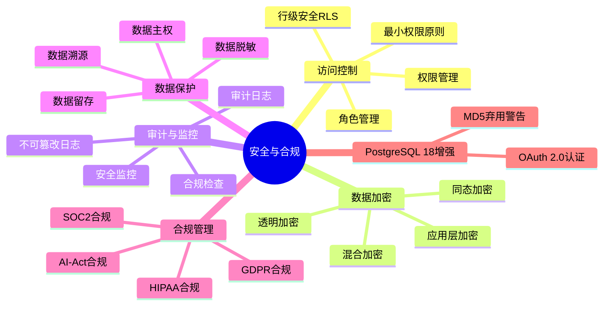
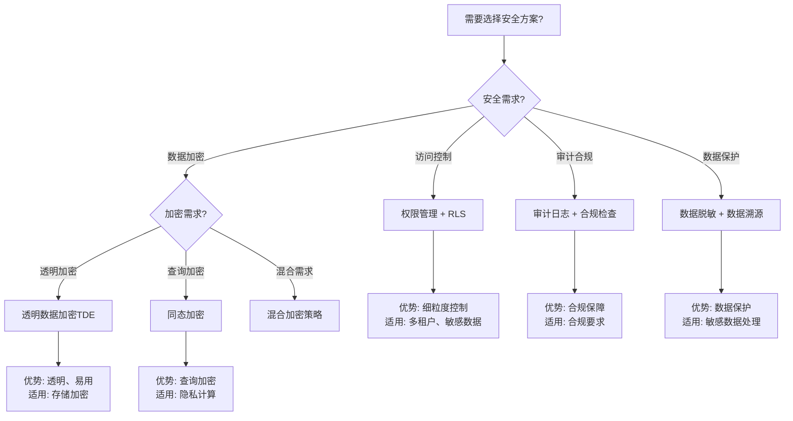

# 05-安全与合规

> **文档总数**: 30+个文档
> **覆盖领域**: 安全机制、访问控制、加密、审计、合规、数据脱敏、数据主权
> **版本覆盖**: PostgreSQL 18.x (推荐) ⭐ | 17.x (推荐) | 16.x (兼容)

---

## 📊 知识体系思维导图

---

## 🆕 PostgreSQL 18 安全增强

### OAuth 2.0 认证支持 ⭐⭐⭐⭐⭐

PostgreSQL 18 新增对 OAuth 2.0 认证的原生支持，提供更安全、更灵活的认证方式。

- **特性**: 支持 OAuth 2.0 标准认证流程
- **应用场景**: 企业SSO、云平台集成、第三方认证服务
- **相关文档**: [18-版本特性/18.01-PostgreSQL18新特性/06-OAuth2.0认证集成完整指南.md](../18-版本特性/18.01-PostgreSQL18新特性/06-OAuth2.0认证集成完整指南.md)
- **测试文档**: [07.04-OAuth2-安全场景测试.md](./07.04-OAuth2-安全场景测试.md)

### MD5 密码认证弃用 ⚠️

PostgreSQL 18 已弃用 MD5 密码认证方法，建议用户迁移到更安全的认证方法。

- **弃用原因**: MD5 算法存在安全漏洞，不再推荐使用
- **迁移建议**: 迁移到 scram-sha-256 或 OAuth 2.0
- **影响范围**: 使用 MD5 认证的现有部署需要升级
- **迁移指南**: 参见 [24-迁移指南/数据库迁移与升级场景分析指南.md](../24-迁移指南/数据库迁移与升级场景分析指南.md)

---

## 📋 主题说明

本主题整合所有PostgreSQL安全与合规相关内容，包括安全机制、访问控制、加密查询、审计日志、合规要求、数据脱敏、数据主权等。

---

## 📚 核心文档

### 安全基础

- **[安全体系详解.md](./安全体系详解.md)** - 安全体系完整说明
- **[安全与加密.md](./安全与加密.md)** - 安全与加密基础
- **[权限管理.md](./权限管理.md)** - 权限管理机制

### 深入指南

- **[\【深入】PostgreSQL安全深化-RLS与审计完整指南.md](./【深入】PostgreSQL安全深化-RLS与审计完整指南.md)** - RLS与审计完整指南
- **[\【深入】同态加密查询处理完整指南.md](./【深入】同态加密查询处理完整指南.md)** - 同态加密查询处理
- **[\【深入】数据溯源与血缘分析完整指南.md](./【深入】数据溯源与血缘分析完整指南.md)** - 数据溯源与血缘分析
- **[\【深入】联邦学习与隐私计算完整指南.md](./【深入】联邦学习与隐私计算完整指南.md)** - 联邦学习与隐私计算
- **[安全架构设计与场景分析指南.md](./安全架构设计与场景分析指南.md)** ⭐⭐⭐⭐⭐ ⭐ 新增
  - 安全架构设计场景（多层安全、纵深防御）
  - 权限管理场景分析（角色设计、权限分离、最小权限原则）
  - 数据加密场景（透明加密 vs 应用层加密对比分析）
  - 审计与合规场景（审计策略、合规检查场景）
  - **字数**: 约30,000字
  - **状态**: ✅ 已完成

### 行级安全（RLS）

- **[07.03-行级安全-RLS策略语义与不可逃逸性证明.md](./07.03-行级安全-RLS策略语义与不可逃逸性证明.md)** - RLS形式化证明
- **[审计与脱敏/细粒度权限控制.md](./审计与脱敏/细粒度权限控制.md)** - 细粒度权限控制

### 加密查询

- **[加密查询/同态加密集成.md](./加密查询/同态加密集成.md)** - 同态加密集成
- **[加密查询/混合加密查询原理.md](./加密查询/混合加密查询原理.md)** - 混合加密查询
- **[加密查询/自适应加密策略.md](./加密查询/自适应加密策略.md)** - 自适应加密策略
- **[加密查询/加密查询性能测试.md](./加密查询/加密查询性能测试.md)** - 性能测试

### 审计与脱敏

- **[审计与脱敏/不可篡改审计日志.md](./审计与脱敏/不可篡改审计日志.md)** - 不可篡改审计日志
- **[审计与脱敏/动态数据脱敏.md](./审计与脱敏/动态数据脱敏.md)** - 动态数据脱敏

### 数据溯源

- **[数据溯源/数据溯源技术原理.md](./数据溯源/数据溯源技术原理.md)** - 数据溯源技术原理
- **[数据溯源/ProvSQL集成实践.md](./数据溯源/ProvSQL集成实践.md)** - ProvSQL集成实践
- **[数据溯源/概率数据库实现.md](./数据溯源/概率数据库实现.md)** - 概率数据库实现

### 数据主权

- **[数据主权/数据留存策略.md](./数据主权/数据留存策略.md)** - 数据留存策略
- **[数据主权/行级主权标签.md](./数据主权/行级主权标签.md)** - 行级主权标签
- **[数据主权/跨境数据拦截.md](./数据主权/跨境数据拦截.md)** - 跨境数据拦截

### AI-Act合规

- **[AI-Act合规/AI-Act要求解读.md](./AI-Act合规/AI-Act要求解读.md)** - AI-Act要求解读
- **[AI-Act合规/合规实施方案.md](./AI-Act合规/合规实施方案.md)** - 合规实施方案
- **[AI-Act合规/合规检查清单.md](./AI-Act合规/合规检查清单.md)** - 合规检查清单

### 安全加固

- **[安全加固/README.md](./安全加固/README.md)** - 安全加固子主题导航
- **[安全体系详解.md](./安全体系详解.md)** - 安全体系完整说明
- **[\【深入】PostgreSQL安全深化-RLS与审计完整指南.md](./【深入】PostgreSQL安全深化-RLS与审计完整指南.md)** - RLS与审计完整指南

### 技术原理

- **[技术原理/审计日志机制.md](./技术原理/审计日志机制.md)** - 审计日志机制
- **[技术原理/数据主权技术.md](./技术原理/数据主权技术.md)** - 数据主权技术
- **[技术原理/数据库合规架构.md](./技术原理/数据库合规架构.md)** - 合规架构

### 理论文档

- **[07.01-安全策略与非干扰-逻辑框架与证明.md](./07.01-安全策略与非干扰-逻辑框架与证明.md)** - 安全策略形式化
- **[07.02-差分隐私-SQL聚合的灵敏度与噪声机制.md](./07.02-差分隐私-SQL聚合的灵敏度与噪声机制.md)** - 差分隐私理论
- **[07.04-数据库安全模型-访问控制与信息流安全的形式化.md](./07.04-数据库安全模型-访问控制与信息流安全的形式化.md)** - 安全模型形式化
- **[07.05-数据库审计与合规-完整性约束与审计轨迹的形式化.md](./07.05-数据库审计与合规-完整性约束与审计轨迹的形式化.md)** - 审计合规形式化
- **[07.04-OAuth2-安全场景测试.md](./07.04-OAuth2-安全场景测试.md)** - OAuth2安全测试

---

## 📊 安全方案选型决策树

---

## 📊 安全方案对比矩阵

| 安全方案 | 安全性 | 性能影响 | 复杂度 | 适用场景 | PostgreSQL支持 |
|---------|--------|---------|--------|---------|--------------|
| **角色权限管理** | ⭐⭐⭐⭐ | ⭐⭐⭐⭐⭐ | ⭐⭐ | 基础访问控制 | ✅ 原生 |
| **行级安全RLS** | ⭐⭐⭐⭐⭐ | ⭐⭐⭐⭐ | ⭐⭐⭐ | 细粒度访问控制 | ✅ 原生 |
| **透明数据加密TDE** | ⭐⭐⭐⭐ | ⭐⭐⭐⭐ | ⭐⭐ | 存储加密 | ⚠️ 扩展支持 |
| **同态加密** | ⭐⭐⭐⭐⭐ | ⭐⭐ | ⭐⭐⭐⭐⭐ | 隐私计算 | ⚠️ 扩展支持 |
| **审计日志** | ⭐⭐⭐⭐ | ⭐⭐⭐⭐ | ⭐⭐⭐ | 合规审计 | ✅ 原生 |
| **数据脱敏** | ⭐⭐⭐⭐ | ⭐⭐⭐⭐ | ⭐⭐⭐ | 敏感数据保护 | ✅ 扩展支持 |
| **OAuth 2.0** | ⭐⭐⭐⭐⭐ | ⭐⭐⭐⭐ | ⭐⭐⭐ | 企业SSO | ✅ PostgreSQL 18 |

---

## 🎯 使用建议

### 安全配置

1. 从 [安全体系详解.md](./安全体系详解.md) 了解安全体系
2. 配置 [权限管理.md](./权限管理.md) 建立权限体系
3. 实施 [【深入】PostgreSQL安全深化-RLS与审计完整指南.md](./【深入】PostgreSQL安全深化-RLS与审计完整指南.md) 启用RLS和审计

### 合规要求

1. 查看 [AI-Act合规/AI-Act要求解读.md](./AI-Act合规/AI-Act要求解读.md) 了解合规要求
2. 参考 [AI-Act合规/合规实施方案.md](./AI-Act合规/合规实施方案.md) 制定实施方案
3. 使用 [AI-Act合规/合规检查清单.md](./AI-Act合规/合规检查清单.md) 进行合规检查

### 数据保护

1. 学习 [加密查询/同态加密集成.md](./加密查询/同态加密集成.md) 实现加密查询
2. 配置 [审计与脱敏/动态数据脱敏.md](./审计与脱敏/动态数据脱敏.md) 进行数据脱敏
3. 实施 [数据溯源/数据溯源技术原理.md](./数据溯源/数据溯源技术原理.md) 建立数据溯源

---

## 📚 文档来源

本主题整合了以下源目录的文档：

- `PostgreSQL/03-高级特性/03.02-安全机制与访问控制.md`
- `PostgreSQL培训/07-安全/`
- `PostgreSQL_View/05-合规与可信/`
- `DataBaseTheory/07-安全与合规/`

**原则**: 所有文档均为复制，原文件保持不变。

---

## 🔗 相关文档

- [04-存储与恢复](../04-存储与恢复/README.md) - 数据持久化和备份
- [12-监控与诊断](../12-监控与诊断/README.md) - 安全监控和审计

---

**最后更新**: 2025年1月
**状态**: ✅ 文档整合完成
