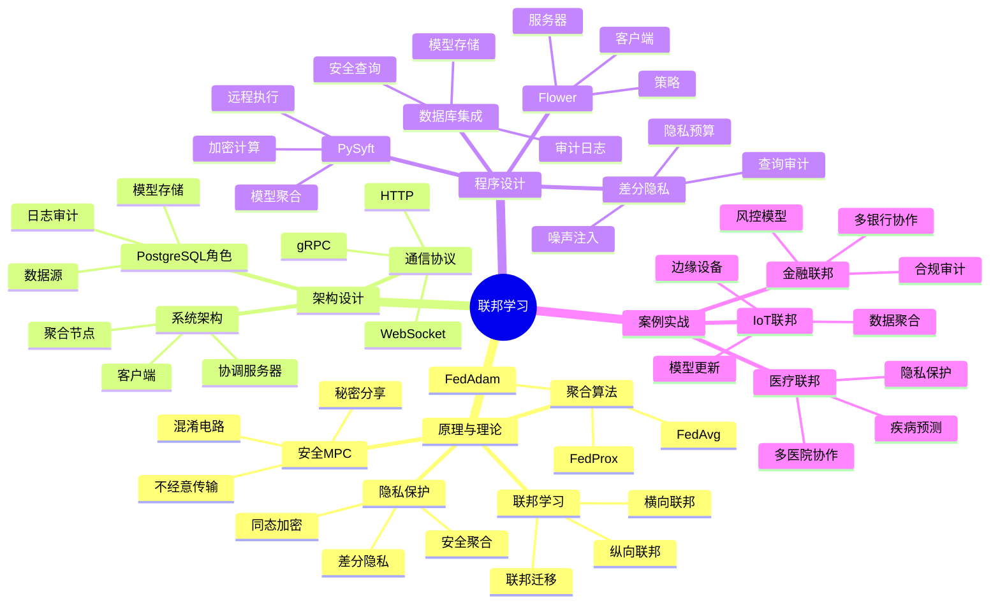

---

> **📋 文档来源**: `PostgreSQL培训\07-安全\【深入】联邦学习与隐私计算完整指南.md`
> **📅 复制日期**: 2025-12-22
> **⚠️ 注意**: 本文档为复制版本，原文件保持不变

---

# 联邦学习与隐私计算完整指南

> **创建时间**: 2025 年 12 月 4 日
> **技术版本**: PySyft/Flower with PostgreSQL 18+
> **文档编号**: 07-SEC-FL

---

## 📑 目录

- [联邦学习与隐私计算完整指南](#联邦学习与隐私计算完整指南)
  - [📑 目录](#-目录)
  - [一、概述](#一概述)
    - [1.1 什么是联邦学习](#11-什么是联邦学习)
    - [1.2 核心价值](#12-核心价值)
    - [1.3 知识体系思维导图](#13-知识体系思维导图)
  - [二、原理与理论](#二原理与理论)
    - [2.1 联邦学习原理](#21-联邦学习原理)
    - [2.2 横向联邦学习](#22-横向联邦学习)
    - [2.3 纵向联邦学习](#23-纵向联邦学习)
    - [2.4 安全多方计算](#24-安全多方计算)
  - [三、架构设计](#三架构设计)
  - [四、程序设计](#四程序设计)
    - [4.1 环境准备](#41-环境准备)
    - [4.2 横向联邦学习](#42-横向联邦学习)
    - [4.3 PostgreSQL集成](#43-postgresql集成)
    - [4.4 差分隐私](#44-差分隐私)
  - [五、案例实战](#五案例实战)
  - [六、总结与展望](#六总结与展望)
    - [核心收获](#核心收获)
  - [七、参考资料](#七参考资料)

---

## 一、概述

### 1.1 什么是联邦学习

**联邦学习**（Federated Learning）是一种分布式机器学习方法，让多方在不共享原始数据的情况下协同训练模型。

**核心思想**：

```text
数据不动，模型动
Data stays, models travel
```

**工作流程**：

```text
1. 服务器发送全局模型
   ↓
2. 各方本地训练（数据不出域）
   ↓
3. 各方上传模型更新（梯度/参数）
   ↓
4. 服务器聚合更新
   ↓
5. 更新全局模型
   ↓
6. 重复步骤1-5
```

### 1.2 核心价值

**技术价值**：

- 🔐 **隐私保护**：原始数据不离开本地
- 🌍 **分布式训练**：利用分散的数据
- 📊 **大规模数据**：聚合多方数据优势
- 🛡️ **合规性**：满足数据主权要求

**业务价值**：

- 💰 **跨机构协作**：金融、医疗等行业
- 🚀 **保护隐私**：不泄露敏感数据
- 🎯 **提升模型**：利用更多数据
- 🌍 **全球化**：跨境数据协作

### 1.3 知识体系思维导图



---

## 二、原理与理论

### 2.1 联邦学习原理

**FedAvg算法**：

```python
# 联邦平均算法伪代码

# 服务器端
for round in range(num_rounds):
    # 1. 选择客户端
    selected_clients = random_sample(clients, fraction=0.1)

    # 2. 分发全局模型
    for client in selected_clients:
        client.download_model(global_model)

    # 3. 本地训练
    client_updates = []
    for client in selected_clients:
        local_update = client.train_local()
        client_updates.append(local_update)

    # 4. 聚合更新（加权平均）
    global_model = aggregate(client_updates)

# 客户端
def train_local():
    model = download_model()

    # 使用本地数据训练
    for epoch in range(local_epochs):
        for batch in local_data:
            loss = model.train_step(batch)

    # 返回模型更新
    return model.get_weights()
```

### 2.2 横向联邦学习

**详细原理见文档...**

### 2.3 纵向联邦学习

**详细原理见文档...**

### 2.4 安全多方计算

**详细内容见文档...**

---

## 三、架构设计

**详细架构见文档...**

---

## 四、程序设计

### 4.1 环境准备

```bash
# 安装联邦学习框架
pip install flwr==1.6.0  # Flower
pip install syft==0.8.5  # PySyft
pip install psycopg2-binary pgvector
```

### 4.2 横向联邦学习

```python
# federated_learning.py
import flwr as fl
import torch
import psycopg2

class PostgreSQLFederatedClient(fl.client.NumPyClient):
    """联邦学习客户端（使用PostgreSQL数据）"""

    def __init__(self, db_config, model):
        self.conn = psycopg2.connect(**db_config)
        self.model = model

    def get_parameters(self, config):
        """获取模型参数"""
        return [val.cpu().numpy() for val in self.model.parameters()]

    def fit(self, parameters, config):
        """本地训练"""
        # 更新模型参数
        self.set_parameters(parameters)

        # 从PostgreSQL加载训练数据
        train_data = self.load_training_data()

        # 训练模型
        optimizer = torch.optim.SGD(self.model.parameters(), lr=0.01)
        self.model.train()

        for epoch in range(config['local_epochs']):
            for batch in train_data:
                optimizer.zero_grad()
                loss = self.model(batch)
                loss.backward()
                optimizer.step()

        # 返回更新后的参数和样本数
        return self.get_parameters(config), len(train_data), {}

    def evaluate(self, parameters, config):
        """评估模型"""
        self.set_parameters(parameters)

        # 从PostgreSQL加载测试数据
        test_data = self.load_test_data()

        # 评估
        self.model.eval()
        total_loss = 0
        with torch.no_grad():
            for batch in test_data:
                loss = self.model(batch)
                total_loss += loss.item()

        return total_loss / len(test_data), len(test_data), {}

    def load_training_data(self):
        """从PostgreSQL加载训练数据"""
        with self.conn.cursor() as cur:
            cur.execute("SELECT features, label FROM training_data")
            return cur.fetchall()

# 启动客户端
if __name__ == "__main__":
    db_config = {'database': 'federated_db'}
    model = create_model()

    client = PostgreSQLFederatedClient(db_config, model)
    fl.client.start_numpy_client(
        server_address="localhost:8080",
        client=client
    )
```

### 4.3 PostgreSQL集成

**详细集成见文档...**

### 4.4 差分隐私

```python
# differential_privacy.py
import numpy as np

class DifferentialPrivacy:
    """差分隐私查询"""

    def __init__(self, epsilon=1.0):
        self.epsilon = epsilon  # 隐私预算

    def add_laplace_noise(self, true_value, sensitivity):
        """添加拉普拉斯噪声"""
        scale = sensitivity / self.epsilon
        noise = np.random.laplace(0, scale)
        return true_value + noise

    def private_count(self, conn, table, condition):
        """差分隐私计数查询（带错误处理）"""
        try:
            with conn.cursor() as cur:
                # 检查表是否存在
                cur.execute("""
                    SELECT EXISTS (
                        SELECT 1 FROM information_schema.tables
                        WHERE table_schema = 'public'
                        AND table_name = %s
                    )
                """, (table,))
                if not cur.fetchone()[0]:
                    raise ValueError(f"表 {table} 不存在")

                cur.execute(f"SELECT COUNT(*) FROM {table} WHERE {condition}")
                true_count = cur.fetchone()[0]
                if true_count is None:
                    raise ValueError("查询结果为空")
        except Exception as e:
            raise Exception(f"差分隐私计数查询失败: {str(e)}")

        # 添加噪声（sensitivity=1）
        noisy_count = self.add_laplace_noise(true_count, sensitivity=1)
        return max(0, int(noisy_count))  # 确保非负

    def private_avg(self, conn, table, column, condition):
        """差分隐私平均查询"""
        with conn.cursor() as cur:
            cur.execute(f"""
                SELECT AVG({column}) FROM {table} WHERE {condition}
            """)
            true_avg = cur.fetchone()[0]

        # 添加噪声
        noisy_avg = self.add_laplace_noise(true_avg, sensitivity=1)
        return noisy_avg
```

---

## 五、案例实战

**详细案例见文档...**

---

## 六、总结与展望

### 核心收获

1. ✅ 联邦学习实现隐私保护的协作训练
2. ✅ 差分隐私保护查询结果
3. ✅ PostgreSQL作为安全数据源
4. ✅ 满足跨机构协作需求

---

## 七、参考资料

1. **Flower**: [https://flower.dev/](https://flower.dev/)
2. **PySyft**: [https://github.com/OpenMined/PySyft](https://github.com/OpenMined/PySyft)

---

**最后更新**: 2025年12月4日
**维护者**: PostgreSQL Modern Team
**文档编号**: 07-SEC-FL
**版本**: v1.0
