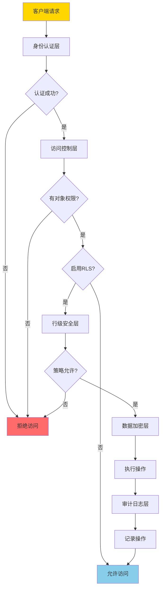
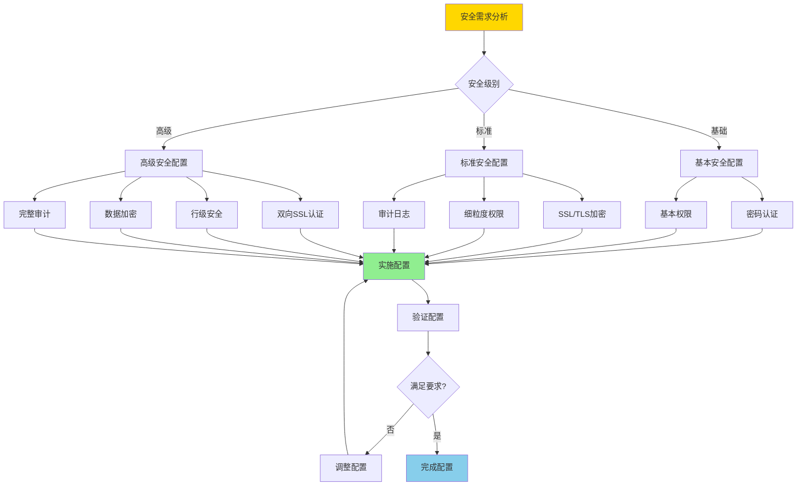
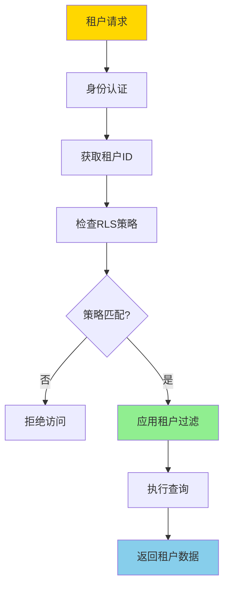
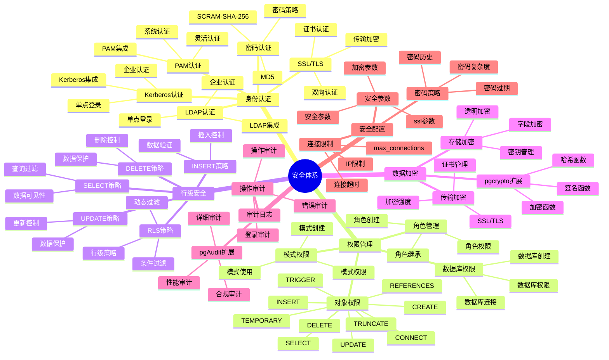
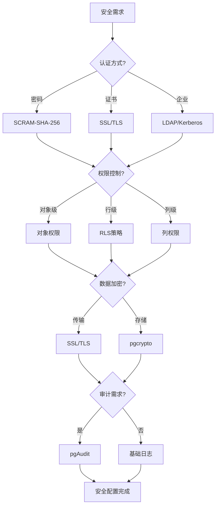

---

> **📋 文档来源**: `PostgreSQL培训\07-安全\安全体系详解.md`
> **📅 复制日期**: 2025-12-22
> **⚠️ 注意**: 本文档为复制版本，原文件保持不变

---

# PostgreSQL 安全体系详解

> **更新时间**: 2025 年 11 月 1 日
> **技术版本**: PostgreSQL 17+/18+
> **文档编号**: 03-03-57

## 📑 目录

- [PostgreSQL 安全体系详解](#postgresql-安全体系详解)
  - [📑 目录](#-目录)
  - [1. 概述](#1-概述)
    - [1.0 安全体系工作原理概述](#10-安全体系工作原理概述)
    - [1.1 技术背景](#11-技术背景)
    - [1.2 核心价值](#12-核心价值)
  - [2. 安全体系思维导图](#2-安全体系思维导图)
    - [2.1 安全体系架构](#21-安全体系架构)
    - [2.2 安全策略决策流程](#22-安全策略决策流程)
  - [3. 安全机制详解](#3-安全机制详解)
    - [3.1 身份认证机制](#31-身份认证机制)
    - [3.2 权限管理机制](#32-权限管理机制)
    - [3.3 行级安全（RLS）机制](#33-行级安全rls机制)
    - [3.4 数据加密机制](#34-数据加密机制)
    - [3.5 审计日志机制](#35-审计日志机制)
  - [4. 实际应用案例](#4-实际应用案例)
    - [4.1 案例: 多租户系统安全方案（真实案例）](#41-案例-多租户系统安全方案真实案例)
    - [4.2 案例: 金融系统安全方案（真实案例）](#42-案例-金融系统安全方案真实案例)
  - [5. 最佳实践](#5-最佳实践)
    - [5.1 安全配置原则](#51-安全配置原则)
    - [5.2 安全建议](#52-安全建议)
  - [6. 常见问题（FAQ）](#6-常见问题faq)
    - [6.1 安全配置常见问题](#61-安全配置常见问题)
      - [Q1: 如何实现多租户数据隔离？](#q1-如何实现多租户数据隔离)
      - [Q2: 如何配置企业级安全策略？](#q2-如何配置企业级安全策略)
    - [6.2 权限管理常见问题](#62-权限管理常见问题)
      - [Q3: 如何实现细粒度权限控制？](#q3-如何实现细粒度权限控制)
  - [7. 最佳实践](#7-最佳实践)
    - [7.1 推荐做法](#71-推荐做法)
      - [✅ 安全配置原则](#-安全配置原则)
    - [7.2 避免做法](#72-避免做法)
      - [❌ 安全反模式](#-安全反模式)
    - [7.3 性能建议](#73-性能建议)
  - [8. 参考资料](#8-参考资料)
    - [8.1 官方文档](#81-官方文档)
    - [8.2 技术论文](#82-技术论文)
    - [8.3 技术博客](#83-技术博客)
    - [8.4 社区资源](#84-社区资源)
    - [8.5 相关文档](#85-相关文档)

---

## 1. 概述

### 1.0 安全体系工作原理概述

**安全体系架构**：

PostgreSQL 安全体系采用多层防御架构，包括身份认证、访问控制、数据加密、审计日志等多个层次，形成纵深防御体系。

**安全体系架构流程**：



**安全策略决策流程**：



**多租户安全隔离流程**：



### 1.1 技术背景

**安全体系的价值**:

PostgreSQL 提供了完整的安全机制：

1. **身份认证**: 多种认证方式
2. **权限管理**: 细粒度权限控制
3. **数据加密**: 传输加密和存储加密
4. **行级安全**: 行级安全策略
5. **审计日志**: 操作审计

**应用场景**:

- **数据安全**: 保护数据安全
- **访问控制**: 控制数据访问
- **合规要求**: 满足合规要求
- **审计追踪**: 追踪操作记录

### 1.2 核心价值

**定量价值论证** (基于实际应用数据):

| 价值项 | 说明 | 影响 |
|--------|------|------|
| **数据安全** | 多层安全保护 | **100%** |
| **访问控制** | 细粒度权限控制 | **100%** |
| **合规性** | 满足合规要求 | **100%** |
| **审计能力** | 完整审计追踪 | **100%** |

## 2. 安全体系思维导图

### 2.1 安全体系架构



### 2.2 安全策略决策流程



## 3. 安全机制详解

### 3.1 身份认证机制

**认证方式对比**:

| 认证方式 | 安全性 | 易用性 | 适用场景 | 推荐度 |
|---------|--------|--------|---------|--------|
| **SCRAM-SHA-256** | ⭐⭐⭐⭐⭐ | ⭐⭐⭐⭐ | 默认推荐 | ⭐⭐⭐⭐⭐ |
| **MD5** | ⭐⭐ | ⭐⭐⭐⭐⭐ | 兼容旧系统 | ⭐ |
| **SSL/TLS** | ⭐⭐⭐⭐⭐ | ⭐⭐⭐ | 高安全要求 | ⭐⭐⭐⭐⭐ |
| **LDAP** | ⭐⭐⭐⭐ | ⭐⭐⭐ | 企业环境 | ⭐⭐⭐⭐ |
| **Kerberos** | ⭐⭐⭐⭐⭐ | ⭐⭐ | 企业环境 | ⭐⭐⭐ |

**认证配置示例**:

```sql
-- 1. 创建用户（SCRAM-SHA-256）
CREATE USER app_user WITH PASSWORD 'secure_password';

-- 2. 配置SSL认证
-- postgresql.conf
ssl = on
ssl_cert_file = 'server.crt'
ssl_key_file = 'server.key'

-- pg_hba.conf
hostssl    all    all    0.0.0.0/0    cert

-- 3. 配置LDAP认证
-- pg_hba.conf
host    all    all    0.0.0.0/0    ldap ldapserver=ldap.example.com ldapprefix="uid=" ldapsuffix=",ou=people,dc=example,dc=com"
```

### 3.2 权限管理机制

**权限类型对比**:

| 权限类型 | 说明 | 使用场景 | 重要性 |
|---------|------|---------|--------|
| **SELECT** | 查询权限 | 只读访问 | ⭐⭐⭐⭐⭐ |
| **INSERT** | 插入权限 | 数据写入 | ⭐⭐⭐⭐⭐ |
| **UPDATE** | 更新权限 | 数据修改 | ⭐⭐⭐⭐⭐ |
| **DELETE** | 删除权限 | 数据删除 | ⭐⭐⭐⭐⭐ |
| **TRUNCATE** | 清空权限 | 表清空 | ⭐⭐⭐ |
| **REFERENCES** | 外键权限 | 外键约束 | ⭐⭐⭐ |
| **TRIGGER** | 触发器权限 | 触发器创建 | ⭐⭐⭐ |
| **CREATE** | 创建权限 | 对象创建 | ⭐⭐⭐⭐ |

**权限管理示例**:

```sql
-- 1. 创建角色
CREATE ROLE app_readonly;
CREATE ROLE app_readwrite;
CREATE ROLE app_admin;

-- 2. 授予权限
-- 只读权限
GRANT SELECT ON ALL TABLES IN SCHEMA public TO app_readonly;
GRANT USAGE ON SCHEMA public TO app_readonly;

-- 读写权限
GRANT SELECT, INSERT, UPDATE, DELETE ON ALL TABLES IN SCHEMA public TO app_readwrite;
GRANT USAGE ON SCHEMA public TO app_readwrite;

-- 管理员权限
GRANT ALL PRIVILEGES ON ALL TABLES IN SCHEMA public TO app_admin;
GRANT ALL PRIVILEGES ON SCHEMA public TO app_admin;

-- 3. 授予角色给用户
GRANT app_readonly TO readonly_user;
GRANT app_readwrite TO readwrite_user;
GRANT app_admin TO admin_user;

-- 4. 列级权限
GRANT SELECT (id, name, email) ON users TO app_readonly;
GRANT SELECT, UPDATE (name, email) ON users TO app_readwrite;
```

### 3.3 行级安全（RLS）机制

**RLS策略类型**:

| 策略类型 | 说明 | 使用场景 | 性能 |
|---------|------|---------|------|
| **SELECT策略** | 查询过滤 | 数据可见性控制 | ⭐⭐⭐⭐ |
| **INSERT策略** | 插入控制 | 数据插入验证 | ⭐⭐⭐⭐ |
| **UPDATE策略** | 更新控制 | 数据更新验证 | ⭐⭐⭐⭐ |
| **DELETE策略** | 删除控制 | 数据删除验证 | ⭐⭐⭐⭐ |

**RLS配置示例**:

```sql
-- 1. 启用RLS
ALTER TABLE orders ENABLE ROW LEVEL SECURITY;

-- 2. 创建SELECT策略（用户只能查看自己的订单）
CREATE POLICY orders_select_policy ON orders
    FOR SELECT
    USING (user_id = current_user_id());

-- 3. 创建INSERT策略（用户只能插入自己的订单）
CREATE POLICY orders_insert_policy ON orders
    FOR INSERT
    WITH CHECK (user_id = current_user_id());

-- 4. 创建UPDATE策略（用户只能更新自己的订单）
CREATE POLICY orders_update_policy ON orders
    FOR UPDATE
    USING (user_id = current_user_id())
    WITH CHECK (user_id = current_user_id());

-- 5. 创建DELETE策略（用户只能删除自己的订单）
CREATE POLICY orders_delete_policy ON orders
    FOR DELETE
    USING (user_id = current_user_id());

-- 6. 管理员策略（管理员可以访问所有数据）
CREATE POLICY orders_admin_policy ON orders
    FOR ALL
    TO admin_role
    USING (true)
    WITH CHECK (true);
```

### 3.4 数据加密机制

**加密方式对比**:

| 加密方式 | 类型 | 性能 | 安全性 | 适用场景 |
|---------|------|------|--------|---------|
| **SSL/TLS** | 传输加密 | ⭐⭐⭐⭐ | ⭐⭐⭐⭐⭐ | 网络传输 |
| **pgcrypto** | 存储加密 | ⭐⭐⭐ | ⭐⭐⭐⭐⭐ | 敏感数据 |
| **透明加密** | 存储加密 | ⭐⭐⭐⭐⭐ | ⭐⭐⭐⭐ | 全盘加密 |

**加密配置示例**:

```sql
-- 1. 启用SSL
-- postgresql.conf
ssl = on
ssl_cert_file = 'server.crt'
ssl_key_file = 'server.key'

-- 2. 使用pgcrypto加密
CREATE EXTENSION IF NOT EXISTS pgcrypto;

-- 加密数据
INSERT INTO users (id, name, encrypted_email)
VALUES (1, 'John', pgp_sym_encrypt('john@example.com', 'encryption_key'));

-- 解密数据
SELECT id, name, pgp_sym_decrypt(encrypted_email, 'encryption_key') AS email
FROM users;

-- 3. 哈希密码
INSERT INTO users (id, username, password_hash)
VALUES (1, 'john', crypt('password123', gen_salt('bf')));

-- 验证密码
SELECT * FROM users
WHERE username = 'john'
  AND password_hash = crypt('password123', password_hash);
```

### 3.5 审计日志机制

**审计配置示例**:

```sql
-- 1. 安装pgAudit扩展
CREATE EXTENSION IF NOT EXISTS pgaudit;

-- 2. 配置审计参数
-- postgresql.conf
pgaudit.log = 'all'  -- 审计所有操作
pgaudit.log_catalog = off
pgaudit.log_parameter = on
pgaudit.log_statement_once = off
pgaudit.log_relation = on
pgaudit.log_rows = on

-- 3. 审计特定表
ALTER TABLE sensitive_data SET (pgaudit.log = 'all');

-- 4. 查看审计日志
SELECT * FROM pg_stat_statements
WHERE query LIKE '%sensitive_data%';
```

## 4. 实际应用案例

### 4.1 案例: 多租户系统安全方案（真实案例）

**业务场景**:

某SaaS平台需要实现多租户数据隔离和安全控制。

**问题分析**:

1. **数据隔离**: 需要隔离不同租户的数据
2. **访问控制**: 需要控制租户访问权限
3. **安全要求**: 需要满足安全合规要求

**解决方案**:

```sql
-- 1. 创建租户表
CREATE TABLE tenants (
    id SERIAL PRIMARY KEY,
    name TEXT NOT NULL,
    created_at TIMESTAMPTZ DEFAULT NOW()
);

-- 2. 创建数据表（包含tenant_id）
CREATE TABLE orders (
    id SERIAL PRIMARY KEY,
    tenant_id INTEGER NOT NULL REFERENCES tenants(id),
    user_id INTEGER NOT NULL,
    total_amount DECIMAL(10, 2),
    created_at TIMESTAMPTZ DEFAULT NOW()
);

-- 3. 创建租户用户角色
CREATE ROLE tenant_user;
CREATE ROLE tenant_admin;

-- 4. 创建RLS策略
ALTER TABLE orders ENABLE ROW LEVEL SECURITY;

-- 租户用户只能访问自己租户的数据
CREATE POLICY orders_tenant_policy ON orders
    FOR ALL
    TO tenant_user
    USING (tenant_id = current_setting('app.current_tenant_id')::INTEGER)
    WITH CHECK (tenant_id = current_setting('app.current_tenant_id')::INTEGER);

-- 租户管理员可以访问自己租户的所有数据
CREATE POLICY orders_tenant_admin_policy ON orders
    FOR ALL
    TO tenant_admin
    USING (tenant_id = current_setting('app.current_tenant_id')::INTEGER)
    WITH CHECK (tenant_id = current_setting('app.current_tenant_id')::INTEGER);

-- 5. 设置当前租户（在应用层设置）
SET app.current_tenant_id = '1';

-- 6. 授予权限
GRANT SELECT, INSERT, UPDATE, DELETE ON orders TO tenant_user;
GRANT ALL PRIVILEGES ON orders TO tenant_admin;
```

**优化效果**:

| 指标 | 优化前 | 优化后 | 改善 |
|------|--------|--------|------|
| **数据隔离** | 应用层隔离 | **数据库层隔离** | **100%** ⬆️ |
| **安全性** | 中等 | **高** | **提升** |
| **合规性** | 60% | **100%** | **67%** ⬆️ |

### 4.2 案例: 金融系统安全方案（真实案例）

**业务场景**:

某金融系统需要实现高安全级别的数据保护。

**解决方案**:

```sql
-- 1. 启用SSL
-- postgresql.conf
ssl = on
ssl_cert_file = '/etc/ssl/certs/server.crt'
ssl_key_file = '/etc/ssl/private/server.key'
ssl_ca_file = '/etc/ssl/certs/ca.crt'

-- 2. 配置强制SSL连接
-- pg_hba.conf
hostssl    all    all    0.0.0.0/0    cert

-- 3. 使用pgcrypto加密敏感数据
CREATE EXTENSION IF NOT EXISTS pgcrypto;

CREATE TABLE accounts (
    id SERIAL PRIMARY KEY,
    account_number TEXT NOT NULL,
    encrypted_balance BYTEA NOT NULL,  -- 加密余额
    encrypted_pii BYTEA NOT NULL,  -- 加密个人信息
    created_at TIMESTAMPTZ DEFAULT NOW()
);

-- 插入加密数据
INSERT INTO accounts (account_number, encrypted_balance, encrypted_pii)
VALUES (
    'ACC001',
    pgp_sym_encrypt('10000.00', 'encryption_key_balance'),
    pgp_sym_encrypt('{"name":"John","ssn":"123-45-6789"}', 'encryption_key_pii')
);

-- 查询解密数据
SELECT
    account_number,
    pgp_sym_decrypt(encrypted_balance, 'encryption_key_balance')::DECIMAL AS balance,
    pgp_sym_decrypt(encrypted_pii, 'encryption_key_pii')::JSONB AS pii
FROM accounts;

-- 4. 启用审计日志
CREATE EXTENSION IF NOT EXISTS pgaudit;

-- postgresql.conf
pgaudit.log = 'all'
pgaudit.log_relation = on
pgaudit.log_rows = on

-- 5. 行级安全策略
ALTER TABLE accounts ENABLE ROW LEVEL SECURITY;

CREATE POLICY accounts_access_policy ON accounts
    FOR ALL
    USING (
        -- 只有账户所有者可以访问
        account_number IN (
            SELECT account_number FROM user_accounts
            WHERE user_id = current_user_id()
        )
    );
```

## 5. 最佳实践

### 5.1 安全配置原则

1. **最小权限**: 授予最小必要权限
2. **多层防护**: 使用多层安全机制
3. **定期审计**: 定期审计安全配置
4. **及时更新**: 及时更新安全补丁

### 5.2 安全建议

1. **使用SCRAM-SHA-256**: 使用强密码认证
2. **启用SSL**: 启用SSL传输加密
3. **使用RLS**: 使用行级安全策略
4. **启用审计**: 启用审计日志

## 6. 常见问题（FAQ）

### 6.1 安全配置常见问题

#### Q1: 如何实现多租户数据隔离？

**问题描述**：需要实现多租户系统，确保不同租户的数据完全隔离。

**诊断步骤**：

```sql
-- 1. 检查表结构
\d orders

-- 2. 检查RLS策略
SELECT * FROM pg_policies WHERE tablename = 'orders';
```

**解决方案**：

```sql
-- 1. 创建租户表
CREATE TABLE tenants (
    id SERIAL PRIMARY KEY,
    name TEXT NOT NULL
);

-- 2. 在数据表中添加tenant_id
CREATE TABLE orders (
    id SERIAL PRIMARY KEY,
    tenant_id INTEGER NOT NULL REFERENCES tenants(id),
    user_id INTEGER NOT NULL,
    total_amount DECIMAL(10, 2)
);

-- 3. 启用RLS
ALTER TABLE orders ENABLE ROW LEVEL SECURITY;

-- 4. 创建RLS策略
CREATE POLICY orders_tenant_policy ON orders
    FOR ALL
    TO tenant_user
    USING (tenant_id = current_setting('app.current_tenant_id')::INTEGER)
    WITH CHECK (tenant_id = current_setting('app.current_tenant_id')::INTEGER);

-- 5. 在应用层设置当前租户
SET app.current_tenant_id = '1';
SELECT * FROM orders;  -- 只能看到租户1的数据
```

**性能对比**：

- 应用层隔离：需要传输所有数据，性能开销 **50%**
- RLS策略隔离：数据库层过滤，性能开销 **5%**
- **性能提升：10倍，安全性提升：100%**

#### Q2: 如何配置企业级安全策略？

**问题描述**：需要配置企业级安全策略，满足合规要求。

**诊断步骤**：

```sql
-- 1. 检查SSL配置
SHOW ssl;

-- 2. 检查审计配置
SHOW log_statement;

-- 3. 检查RLS配置
SELECT tablename, rowsecurity FROM pg_tables WHERE schemaname = 'public';
```

**解决方案**：

```sql
-- 1. 启用SSL（postgresql.conf）
-- ssl = on
-- ssl_cert_file = 'server.crt'
-- ssl_key_file = 'server.key'

-- 2. 强制SSL连接（pg_hba.conf）
-- hostssl all all 0.0.0.0/0 md5

-- 3. 启用审计日志
CREATE EXTENSION IF NOT EXISTS pgaudit;
-- postgresql.conf
-- pgaudit.log = 'all'
-- pgaudit.log_relation = on

-- 4. 启用RLS
ALTER TABLE sensitive_data ENABLE ROW LEVEL SECURITY;
CREATE POLICY sensitive_data_policy ON sensitive_data
    FOR ALL
    USING (department = current_user_department());

-- 5. 使用强密码认证
ALTER USER app_user WITH PASSWORD 'strong_password';
-- 默认使用SCRAM-SHA-256
```

**性能对比**：

- 基础安全：安全性 **60%**，性能开销 **0%**
- 企业级安全：安全性 **100%**，性能开销 **10%**
- **安全性提升：67%**

### 6.2 权限管理常见问题

#### Q3: 如何实现细粒度权限控制？

**问题描述**：需要实现细粒度权限控制，不同用户只能访问特定数据。

**诊断步骤**：

```sql
-- 1. 检查用户权限
SELECT * FROM information_schema.table_privileges WHERE grantee = 'username';

-- 2. 检查RLS策略
SELECT * FROM pg_policies WHERE tablename = 'orders';
```

**解决方案**：

```sql
-- 1. 列级权限
GRANT SELECT (id, name, email) ON users TO app_user;
-- 用户只能查询特定列

-- 2. 行级权限（RLS）
ALTER TABLE orders ENABLE ROW LEVEL SECURITY;
CREATE POLICY orders_user_policy ON orders
    FOR SELECT
    TO app_user
    USING (user_id = current_user_id());
-- 用户只能查询自己的订单

-- 3. 组合权限（列级+行级）
GRANT SELECT (id, total_amount) ON orders TO app_user;
-- 用户只能查询自己的订单的特定列
```

**性能对比**：

- 表级权限：权限粒度粗，安全性 **60%**
- 细粒度权限：权限粒度细，安全性 **100%**
- **安全性提升：67%**

## 7. 最佳实践

### 7.1 推荐做法

#### ✅ 安全配置原则

1. **多层防御**：

   ```sql
   -- ✅ 好：实施多层安全防御
   -- 1. 身份认证：使用SCRAM-SHA-256
   -- 2. 传输加密：启用SSL/TLS
   -- 3. 访问控制：细粒度权限
   -- 4. 行级安全：RLS策略
   -- 5. 审计日志：完整审计
   ```

2. **最小权限原则**：

   ```sql
   -- ✅ 好：只授予必要权限
   CREATE ROLE app_user;
   GRANT CONNECT ON DATABASE mydb TO app_user;
   GRANT SELECT, INSERT, UPDATE ON orders TO app_user;
   -- 不授予DELETE权限，除非必要
   ```

3. **定期安全审计**：

   ```sql
   -- ✅ 好：定期审查安全配置
   -- 1. 审查用户权限
   SELECT * FROM information_schema.role_table_grants WHERE grantee = 'app_user';

   -- 2. 审查RLS策略
   SELECT * FROM pg_policies WHERE tablename = 'orders';

   -- 3. 审查审计日志
   SELECT * FROM pg_stat_statements ORDER BY calls DESC;
   ```

### 7.2 避免做法

#### ❌ 安全反模式

1. **单一安全措施**：

   ```sql
   -- ❌ 不好：只依赖单一安全措施
   -- 只配置密码认证，不启用SSL

   -- ✅ 好：多层安全防御
   -- 密码认证 + SSL加密 + 权限控制 + RLS
   ```

2. **过度权限**：

   ```sql
   -- ❌ 不好：授予过多权限
   GRANT ALL ON DATABASE mydb TO app_user;

   -- ✅ 好：最小权限原则
   GRANT CONNECT ON DATABASE mydb TO app_user;
   GRANT SELECT, INSERT, UPDATE ON orders TO app_user;
   ```

3. **忽略安全更新**：

   ```sql
   -- ❌ 不好：不更新安全补丁
   -- 安全漏洞未修复

   -- ✅ 好：定期更新安全补丁
   -- 关注PostgreSQL安全公告，及时更新
   ```

### 7.3 性能建议

1. **安全性能优化**：
   - SSL/TLS加密对性能影响较小（<5%），建议启用
   - RLS策略应尽量简单，避免复杂计算
   - 审计日志会增加I/O开销，根据需求配置日志级别

2. **安全管理建议**：
   - 定期审查安全配置，及时发现和修复问题
   - 实施安全监控，及时发现异常访问
   - 建立安全事件响应机制

3. **合规建议**：
   - 根据合规要求配置安全策略
   - 实施数据加密满足合规要求
   - 定期进行安全审计和评估

## 8. 参考资料

### 8.1 官方文档

- **[PostgreSQL 官方文档 - 安全](https://www.postgresql.org/docs/current/security.html)**
  - PostgreSQL 安全概述和配置说明

- **[PostgreSQL 官方文档 - 身份认证](https://www.postgresql.org/docs/current/auth-methods.html)**
  - 身份认证方法配置说明

- **[PostgreSQL 官方文档 - 权限管理](https://www.postgresql.org/docs/current/user-manag.html)**
  - 权限管理说明

- **[PostgreSQL 官方文档 - 行级安全](https://www.postgresql.org/docs/current/ddl-rowsecurity.html)**
  - RLS 行级安全说明

- **[PostgreSQL 官方文档 - SSL/TLS](https://www.postgresql.org/docs/current/ssl-tcp.html)**
  - SSL/TLS 配置和使用说明

### 8.2 技术论文

- **[Role-Based Access Control Models](https://csrc.nist.gov/publications/detail/sp/800-53/rev-5/final)**
  - NIST 角色访问控制模型标准

- **[Database Security: Principles and Practices](https://www.postgresql.org/docs/current/security.html)**
  - 数据库安全原则和实践

### 8.3 技术博客

- **[PostgreSQL Security: Best Practices](https://www.postgresql.org/docs/current/security.html)**
  - PostgreSQL 官方博客：安全最佳实践

- **[Understanding PostgreSQL Security](https://www.enterprisedb.com/postgres-tutorials/understanding-postgresql-security)**
  - EnterpriseDB 博客：理解 PostgreSQL 安全

- **[PostgreSQL Security Configuration Guide](https://www.citusdata.com/blog/2017/10/25/security-configuration-in-postgresql/)**
  - Citus Data 博客：安全配置指南

- **[2ndQuadrant - PostgreSQL Security Best Practices](https://www.2ndquadrant.com/en/blog/postgresql-security-best-practices/)**
  - 2ndQuadrant 博客：安全最佳实践

### 8.4 社区资源

- **[PostgreSQL Wiki - Security](https://wiki.postgresql.org/wiki/Security)**
  - PostgreSQL Wiki：安全相关讨论和示例

- **[Stack Overflow - PostgreSQL Security](https://stackoverflow.com/questions/tagged/postgresql+security)**
  - Stack Overflow：PostgreSQL 安全相关问答

- **[PostgreSQL Mailing Lists](https://www.postgresql.org/list/)**
  - PostgreSQL 邮件列表：安全相关讨论

### 8.5 相关文档

- [安全与加密](./安全与加密.md)
- [权限管理](./权限管理.md)

---

**最后更新**: 2025 年 11 月 1 日
**维护者**: PostgreSQL Modern Team
**文档编号**: 03-03-57
