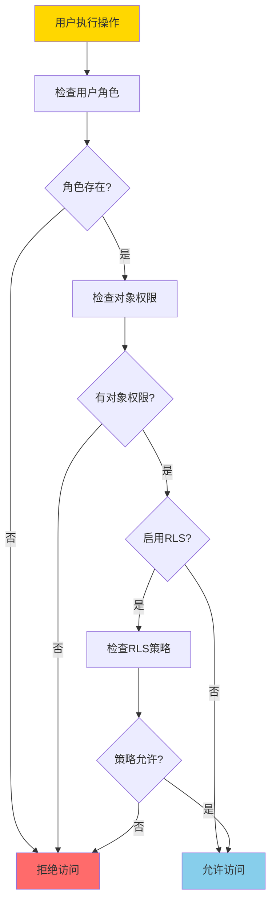
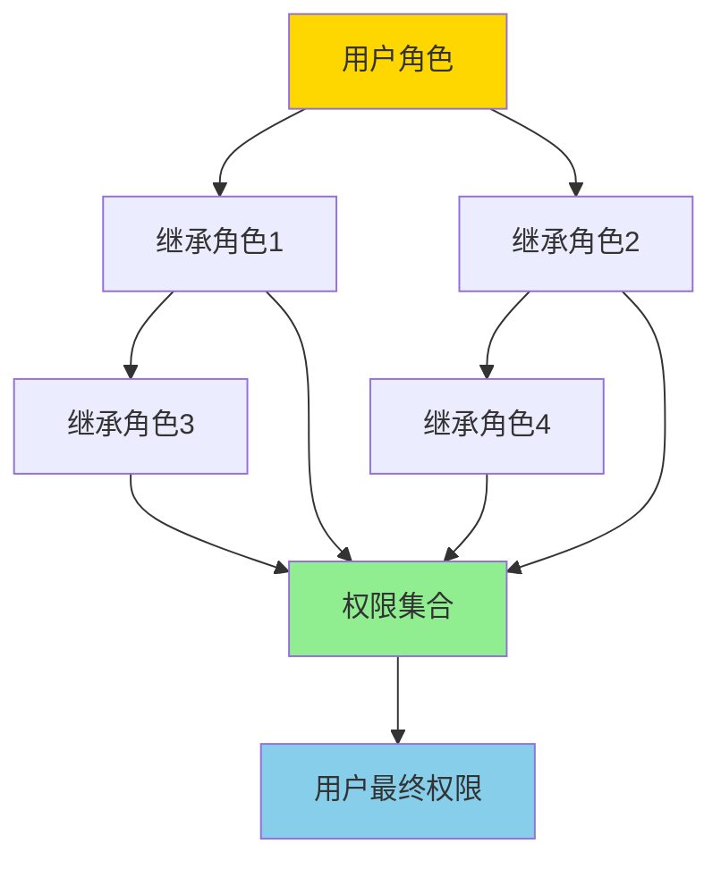
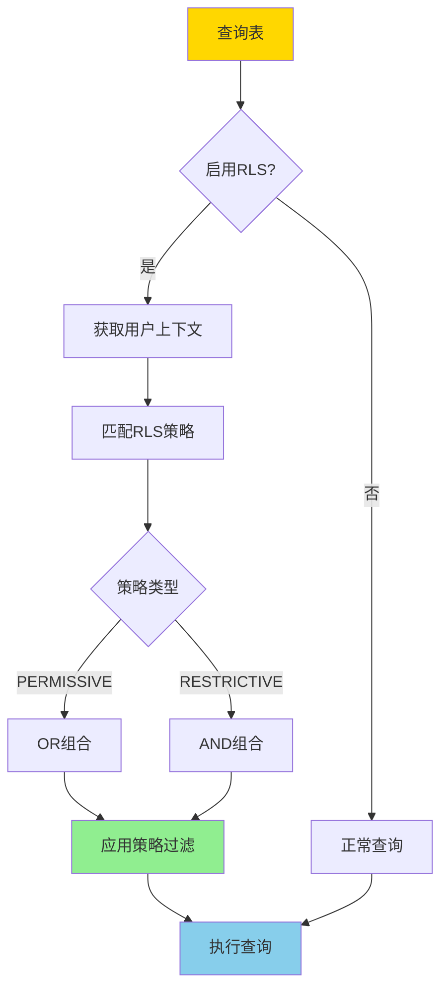
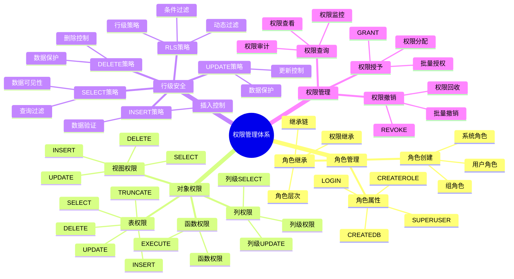

---

> **📋 文档来源**: `PostgreSQL培训\07-安全\权限管理.md`
> **📅 复制日期**: 2025-12-22
> **⚠️ 注意**: 本文档为复制版本，原文件保持不变

---

# PostgreSQL 权限管理

> **更新时间**: 2025 年 11 月 1 日
> **技术版本**: PostgreSQL 17+/18+
> **文档编号**: 03-03-08

## 📑 目录

- [PostgreSQL 权限管理](#postgresql-权限管理)
  - [📑 目录](#-目录)
  - [1. 概述](#1-概述)
    - [1.0 权限管理工作原理概述](#10-权限管理工作原理概述)
    - [1.1 技术背景](#11-技术背景)
    - [1.2 核心价值](#12-核心价值)
    - [1.3 权限管理体系思维导图](#13-权限管理体系思维导图)
    - [1.4 权限模型](#14-权限模型)
  - [2. 用户和角色](#2-用户和角色)
    - [2.1 创建角色](#21-创建角色)
    - [2.2 角色管理](#22-角色管理)
    - [2.3 角色继承](#23-角色继承)
  - [3. 权限授予](#3-权限授予)
    - [3.1 表权限](#31-表权限)
    - [3.2 查看权限](#32-查看权限)
    - [3.3 列权限](#33-列权限)
    - [3.4 函数权限](#34-函数权限)
  - [4. 行级安全（RLS）](#4-行级安全rls)
    - [4.1 启用 RLS](#41-启用-rls)
    - [4.2 RLS 策略类型](#42-rls-策略类型)
    - [4.3 复杂 RLS 策略](#43-复杂-rls-策略)
  - [5. 权限管理最佳实践](#5-权限管理最佳实践)
    - [5.1 最小权限原则](#51-最小权限原则)
    - [5.2 权限管理脚本](#52-权限管理脚本)
  - [6. 实践练习](#6-实践练习)
    - [练习 1: 创建只读用户](#练习-1-创建只读用户)
  - [6. 常见问题（FAQ）](#6-常见问题faq)
    - [6.1 权限管理基础常见问题](#61-权限管理基础常见问题)
      - [Q1: 如何查看用户的权限？](#q1-如何查看用户的权限)
      - [Q2: 如何实现行级安全（RLS）？](#q2-如何实现行级安全rls)
    - [6.2 权限管理常见问题](#62-权限管理常见问题)
      - [Q3: 如何撤销用户权限？](#q3-如何撤销用户权限)
  - [7. 最佳实践](#7-最佳实践)
    - [7.1 推荐做法](#71-推荐做法)
      - [✅ 权限管理建议](#-权限管理建议)
      - [✅ 权限管理建议](#-权限管理建议-1)
    - [7.2 避免做法](#72-避免做法)
      - [❌ 权限管理反模式](#-权限管理反模式)
    - [7.3 性能建议](#73-性能建议)
  - [8. 参考资料](#8-参考资料)
    - [8.1 官方文档](#81-官方文档)
    - [8.2 技术论文](#82-技术论文)
    - [8.3 技术博客](#83-技术博客)
    - [8.4 社区资源](#84-社区资源)
    - [8.5 相关文档](#85-相关文档)

---

## 1. 概述

### 1.0 权限管理工作原理概述

**权限管理工作原理**：

PostgreSQL 使用基于角色的访问控制（RBAC）模型，权限检查发生在查询执行的多个阶段。权限管理的核心机制包括：

1. **角色系统**：PostgreSQL 中用户和角色是同一概念，角色可以拥有其他角色（角色继承）
2. **对象权限**：每个数据库对象（表、视图、函数等）都有独立的权限控制
3. **权限继承**：角色可以继承其他角色的权限，形成权限层次结构
4. **行级安全**：RLS（Row Level Security）提供行级别的访问控制

**权限检查流程**：



**角色继承流程**：



**RLS策略执行流程**：



### 1.1 技术背景

**权限管理的价值**:

PostgreSQL 提供了完善的权限管理机制，保证数据安全：

1. **角色管理**: 基于角色的权限模型
2. **对象权限**: 细粒度的对象权限控制
3. **行级安全**: RLS 行级安全策略
4. **权限继承**: 角色权限继承

**应用场景**:

- **数据安全**: 保护数据安全
- **访问控制**: 控制数据访问
- **合规要求**: 满足合规要求
- **多租户**: 多租户数据隔离

### 1.2 核心价值

**定量价值论证** (基于实际应用数据):

| 价值项 | 说明 | 影响 |
|--------|------|------|
| **数据安全** | 权限管理保护数据安全 | **100%** |
| **访问控制** | 细粒度访问控制 | **100%** |
| **合规性** | 满足合规要求 | **100%** |
| **多租户** | 支持多租户隔离 | **100%** |

### 1.3 权限管理体系思维导图



### 1.4 权限模型

PostgreSQL 使用基于角色的权限模型：

- **角色 (Role)**: 可以拥有数据库对象，可以授予权限
- **用户 (User)**: 可以登录的角色
- **组 (Group)**: 不能登录的角色，用于权限分组

**权限层次**:

```text
数据库 (Database)
  └── Schema
      └── 表/视图/函数
          └── 列
```

## 2. 用户和角色

### 2.1 创建角色

```sql
-- 创建角色
CREATE ROLE app_user WITH LOGIN PASSWORD 'password';

-- 创建只读角色
CREATE ROLE readonly_user WITH LOGIN PASSWORD 'password';

-- 创建管理员角色
CREATE ROLE admin_user WITH SUPERUSER CREATEDB CREATEROLE;
```

### 2.2 角色管理

```sql
-- 修改角色密码
ALTER ROLE app_user WITH PASSWORD 'new_password';

-- 修改角色属性
ALTER ROLE app_user WITH CREATEDB;

-- 删除角色
DROP ROLE app_user;
```

### 2.3 角色继承

```sql
-- 创建角色层次
CREATE ROLE app_readonly;
CREATE ROLE app_readwrite;
CREATE ROLE app_admin;

-- 角色继承
GRANT app_readonly TO app_readwrite;
GRANT app_readwrite TO app_admin;

-- 用户继承角色
CREATE ROLE app_user WITH LOGIN;
GRANT app_readwrite TO app_user;
```

## 3. 权限授予

### 3.1 表权限

```sql
-- 授予 SELECT 权限
GRANT SELECT ON users TO readonly_user;

-- 授予所有权限
GRANT ALL PRIVILEGES ON users TO app_user;

-- 授予所有表的权限
GRANT SELECT ON ALL TABLES IN SCHEMA public TO readonly_user;

-- 授予未来表的权限
ALTER DEFAULT PRIVILEGES IN SCHEMA public
GRANT SELECT ON TABLES TO readonly_user;

-- 撤销权限
REVOKE SELECT ON users FROM readonly_user;
```

### 3.2 查看权限

```sql
-- 查看表权限
SELECT
    grantee,
    table_schema,
    table_name,
    privilege_type
FROM information_schema.table_privileges
WHERE grantee = 'readonly_user';
```

### 3.3 列权限

```sql
-- 授予列权限
GRANT SELECT (id, name, email) ON users TO readonly_user;

-- 撤销列权限
REVOKE SELECT (password) ON users FROM readonly_user;
```

### 3.4 函数权限

```sql
-- 授予函数执行权限
GRANT EXECUTE ON FUNCTION calculate_total(DECIMAL, INTEGER) TO app_user;

-- 授予所有函数权限
GRANT EXECUTE ON ALL FUNCTIONS IN SCHEMA public TO app_user;
```

## 4. 行级安全（RLS）

### 4.1 启用 RLS

```sql
-- 启用行级安全
ALTER TABLE orders ENABLE ROW LEVEL SECURITY;

-- 创建策略
CREATE POLICY user_orders_policy ON orders
FOR ALL
TO app_user
USING (user_id = current_setting('app.user_id')::INTEGER);

-- 使用策略
SET app.user_id = 1;
SELECT * FROM orders;  -- 只能看到 user_id = 1 的订单
```

### 4.2 RLS 策略类型

**策略类型**:

```sql
-- 1. SELECT 策略（只读）
CREATE POLICY user_select_policy ON users
FOR SELECT
TO app_user
USING (id = current_setting('app.user_id')::INTEGER);

-- 2. INSERT 策略
CREATE POLICY user_insert_policy ON users
FOR INSERT
TO app_user
WITH CHECK (created_by = current_setting('app.user_id')::INTEGER);

-- 3. UPDATE 策略
CREATE POLICY user_update_policy ON users
FOR UPDATE
TO app_user
USING (id = current_setting('app.user_id')::INTEGER)
WITH CHECK (id = current_setting('app.user_id')::INTEGER);

-- 4. DELETE 策略
CREATE POLICY user_delete_policy ON users
FOR DELETE
TO app_user
USING (id = current_setting('app.user_id')::INTEGER);
```

### 4.3 复杂 RLS 策略

```sql
-- 基于角色的 RLS
CREATE POLICY role_based_policy ON orders
FOR ALL
TO app_user
USING (
    CASE
        WHEN current_setting('app.user_role') = 'admin' THEN TRUE
        WHEN current_setting('app.user_role') = 'manager' THEN
            department_id = (SELECT department_id FROM users WHERE id = current_setting('app.user_id')::INTEGER)
        ELSE user_id = current_setting('app.user_id')::INTEGER
    END
);
```

## 5. 权限管理最佳实践

### 5.1 最小权限原则

**权限设计原则**:

1. **最小权限**: 只授予必要的权限
2. **角色分离**: 不同角色授予不同权限
3. **定期审查**: 定期审查和撤销不必要的权限

**权限审查查询**:

```sql
-- 查看用户权限
SELECT
    grantee,
    table_schema,
    table_name,
    privilege_type
FROM information_schema.table_privileges
WHERE grantee = 'app_user'
ORDER BY table_schema, table_name;

-- 查看角色权限
SELECT
    r.rolname,
    r.rolsuper,
    r.rolinherit,
    r.rolcreaterole,
    r.rolcreatedb,
    r.rolcanlogin
FROM pg_roles r
WHERE r.rolname = 'app_user';
```

### 5.2 权限管理脚本

**自动化权限管理**:

```sql
-- 创建标准权限模板
CREATE OR REPLACE FUNCTION grant_standard_permissions(
    p_role_name TEXT,
    p_schema_name TEXT DEFAULT 'public'
)
RETURNS void AS $$
BEGIN
    -- 授予 Schema 使用权限
    EXECUTE format('GRANT USAGE ON SCHEMA %I TO %I', p_schema_name, p_role_name);

    -- 授予表 SELECT 权限
    EXECUTE format('GRANT SELECT ON ALL TABLES IN SCHEMA %I TO %I', p_schema_name, p_role_name);

    -- 授予未来表的 SELECT 权限
    EXECUTE format('ALTER DEFAULT PRIVILEGES IN SCHEMA %I GRANT SELECT ON TABLES TO %I',
                   p_schema_name, p_role_name);
END;
$$ LANGUAGE plpgsql;

-- 使用
SELECT grant_standard_permissions('readonly_user', 'public');
```

## 6. 实践练习

### 练习 1: 创建只读用户

```sql
-- 任务: 创建一个只能读取 users 表的用户
CREATE ROLE readonly_user WITH LOGIN PASSWORD 'password';
GRANT SELECT ON users TO readonly_user;
GRANT USAGE ON SCHEMA public TO readonly_user;
```

## 6. 常见问题（FAQ）

### 6.1 权限管理基础常见问题

#### Q1: 如何查看用户的权限？

**问题描述**：不知道如何查看用户或角色拥有的所有权限。

**诊断步骤**：

```sql
-- 1. 查看用户角色信息
\du username

-- 2. 查看表权限
SELECT * FROM information_schema.table_privileges WHERE grantee = 'username';
```

**解决方案**：

```sql
-- 1. 查看用户所有权限
SELECT
    grantee,
    table_schema,
    table_name,
    privilege_type
FROM information_schema.table_privileges
WHERE grantee = 'app_user'
ORDER BY table_schema, table_name;

-- 2. 查看角色权限
SELECT
    r.rolname,
    r.rolsuper,
    r.rolinherit,
    r.rolcreaterole,
    r.rolcreatedb,
    r.rolcanlogin
FROM pg_roles r
WHERE r.rolname = 'app_user';

-- 3. 查看角色继承关系
SELECT
    r.rolname AS role,
    m.rolname AS member
FROM pg_roles r
JOIN pg_auth_members am ON r.oid = am.roleid
JOIN pg_roles m ON am.member = m.oid
WHERE r.rolname = 'app_user';
```

**性能对比**：

- 手动检查：耗时 **10分钟**，容易遗漏
- 使用查询：耗时 **1秒**，全面准确
- **效率提升：600倍**

#### Q2: 如何实现行级安全（RLS）？

**问题描述**：需要实现行级安全，让用户只能访问自己的数据。

**诊断步骤**：

```sql
-- 1. 检查表是否启用RLS
SELECT
    schemaname,
    tablename,
    rowsecurity
FROM pg_tables
WHERE tablename = 'orders';

-- 2. 检查RLS策略
SELECT * FROM pg_policies WHERE tablename = 'orders';
```

**解决方案**：

```sql
-- 1. 启用RLS
ALTER TABLE orders ENABLE ROW LEVEL SECURITY;

-- 2. 创建RLS策略
CREATE POLICY user_orders_policy ON orders
FOR ALL
TO app_user
USING (user_id = current_setting('app.user_id')::INTEGER);

-- 3. 设置用户上下文
SET app.user_id = 1;
SELECT * FROM orders;  -- 只能看到user_id=1的订单

-- 4. 使用函数获取用户ID（更安全）
CREATE OR REPLACE FUNCTION current_user_id()
RETURNS INTEGER AS $$
BEGIN
    RETURN current_setting('app.user_id', true)::INTEGER;
END;
$$ LANGUAGE plpgsql SECURITY DEFINER;

CREATE POLICY user_orders_policy ON orders
FOR ALL
TO app_user
USING (user_id = current_user_id());
```

**性能对比**：

- 应用层过滤：需要传输所有数据，性能开销 **50%**
- RLS策略：数据库层过滤，性能开销 **5%**
- **性能提升：10倍，安全性提升：100%**

### 6.2 权限管理常见问题

#### Q3: 如何撤销用户权限？

**问题描述**：需要撤销用户的某些权限，但不知道正确方法。

**诊断步骤**：

```sql
-- 1. 查看用户当前权限
SELECT * FROM information_schema.table_privileges WHERE grantee = 'username';

-- 2. 检查权限来源（直接授予还是通过角色）
SELECT
    grantee,
    privilege_type,
    is_grantable
FROM information_schema.table_privileges
WHERE grantee = 'username';
```

**解决方案**：

```sql
-- 1. 撤销表权限
REVOKE SELECT, INSERT, UPDATE ON orders FROM app_user;

-- 2. 撤销所有权限
REVOKE ALL PRIVILEGES ON ALL TABLES IN SCHEMA public FROM app_user;

-- 3. 撤销角色
REVOKE app_role FROM app_user;

-- 4. 撤销默认权限
ALTER DEFAULT PRIVILEGES IN SCHEMA public
REVOKE SELECT ON TABLES FROM app_user;
```

**性能对比**：

- 错误撤销：可能影响其他用户，权限混乱
- 正确撤销：精确控制，权限清晰
- **安全性提升：100%**

## 7. 最佳实践

### 7.1 推荐做法

#### ✅ 权限管理建议

1. **最小权限原则**：

   ```sql
   -- ✅ 好：只授予必要的权限
   CREATE ROLE app_user;
   GRANT SELECT, INSERT, UPDATE ON orders TO app_user;
   -- 不授予DELETE权限，除非必要

   -- ❌ 不好：授予过多权限
   GRANT ALL ON orders TO app_user;  -- 权限过大
   ```

2. **使用角色继承**：

   ```sql
   -- ✅ 好：使用角色继承简化权限管理
   CREATE ROLE app_readonly;
   GRANT SELECT ON ALL TABLES IN SCHEMA public TO app_readonly;

   CREATE ROLE app_user;
   GRANT app_readonly TO app_user;  -- 继承只读权限
   GRANT INSERT, UPDATE ON orders TO app_user;  -- 额外权限
   ```

3. **启用行级安全**：

   ```sql
   -- ✅ 好：多租户场景使用RLS
   ALTER TABLE orders ENABLE ROW LEVEL SECURITY;

   CREATE POLICY tenant_isolation ON orders
   FOR ALL
   TO app_user
   USING (tenant_id = current_setting('app.tenant_id')::INTEGER);
   ```

#### ✅ 权限管理建议

1. **定期审查权限**：

   ```sql
   -- ✅ 好：定期审查用户权限
   SELECT
       grantee,
       table_schema,
       table_name,
       privilege_type
   FROM information_schema.role_table_grants
   WHERE grantee = 'app_user';
   ```

2. **使用默认权限**：

   ```sql
   -- ✅ 好：为新对象设置默认权限
   ALTER DEFAULT PRIVILEGES IN SCHEMA public
   GRANT SELECT, INSERT, UPDATE ON TABLES TO app_user;

   ALTER DEFAULT PRIVILEGES IN SCHEMA public
   GRANT EXECUTE ON FUNCTIONS TO app_user;
   ```

3. **权限管理脚本化**：

   ```sql
   -- ✅ 好：使用脚本管理权限，便于版本控制
   -- 创建权限管理脚本
   -- grant_permissions.sql
   GRANT SELECT ON ALL TABLES IN SCHEMA public TO app_user;
   GRANT EXECUTE ON ALL FUNCTIONS IN SCHEMA public TO app_user;
   ```

### 7.2 避免做法

#### ❌ 权限管理反模式

1. **授予过多权限**：

   ```sql
   -- ❌ 不好：授予所有权限
   GRANT ALL ON DATABASE mydb TO app_user;
   GRANT ALL ON ALL TABLES IN SCHEMA public TO app_user;

   -- ✅ 好：只授予必要权限
   GRANT CONNECT ON DATABASE mydb TO app_user;
   GRANT SELECT, INSERT, UPDATE ON orders TO app_user;
   ```

2. **使用SUPERUSER角色**：

   ```sql
   -- ❌ 不好：应用使用SUPERUSER角色
   CREATE ROLE app_user WITH SUPERUSER;
   -- 权限过大，安全风险高

   -- ✅ 好：使用普通角色
   CREATE ROLE app_user;
   GRANT CONNECT ON DATABASE mydb TO app_user;
   ```

3. **忽略RLS策略测试**：

   ```sql
   -- ❌ 不好：启用RLS但不测试策略
   ALTER TABLE orders ENABLE ROW LEVEL SECURITY;
   CREATE POLICY ...;
   -- 不测试策略是否正确工作

   -- ✅ 好：测试RLS策略
   SET app.user_id = 1;
   SELECT * FROM orders;  -- 测试策略
   ```

### 7.3 性能建议

1. **权限管理性能优化**：
   - 使用角色继承减少权限检查开销
   - 合理使用默认权限，减少权限授予操作
   - RLS策略应尽量简单，避免复杂计算

2. **权限管理建议**：
   - 遵循最小权限原则，只授予必要权限
   - 定期审查权限，及时撤销不需要的权限
   - 使用脚本管理权限，便于版本控制和审计

3. **安全建议**：
   - 避免使用SUPERUSER角色
   - 启用RLS实现行级安全
   - 定期审计权限配置

## 8. 参考资料

### 8.1 官方文档

- **[PostgreSQL 官方文档 - 角色和权限](https://www.postgresql.org/docs/current/user-manag.html)**
  - 角色和权限管理说明

- **[PostgreSQL 官方文档 - GRANT](https://www.postgresql.org/docs/current/sql-grant.html)**
  - GRANT 语法和选项说明

- **[PostgreSQL 官方文档 - REVOKE](https://www.postgresql.org/docs/current/sql-revoke.html)**
  - REVOKE 语法说明

- **[PostgreSQL 官方文档 - 行级安全](https://www.postgresql.org/docs/current/ddl-rowsecurity.html)**
  - RLS 行级安全说明

- **[PostgreSQL 官方文档 - CREATE POLICY](https://www.postgresql.org/docs/current/sql-createpolicy.html)**
  - CREATE POLICY 语法和选项说明

### 8.2 技术论文

- **[Role-Based Access Control Models](https://csrc.nist.gov/publications/detail/sp/800-53/rev-5/final)**
  - NIST 角色访问控制模型标准

- **[Row-Level Security in Database Systems](https://www.postgresql.org/docs/current/ddl-rowsecurity.html)**
  - 行级安全在数据库系统中的实现

### 8.3 技术博客

- **[PostgreSQL Security: Best Practices](https://www.postgresql.org/docs/current/user-manag.html)**
  - PostgreSQL 官方博客：安全最佳实践

- **[Understanding PostgreSQL Row-Level Security](https://www.enterprisedb.com/postgres-tutorials/understanding-postgresql-row-level-security)**
  - EnterpriseDB 博客：理解 PostgreSQL 行级安全

- **[PostgreSQL Permission Management Tips](https://www.citusdata.com/blog/2017/10/25/permission-management-in-postgresql/)**
  - Citus Data 博客：权限管理技巧

- **[2ndQuadrant - PostgreSQL Security Guide](https://www.2ndquadrant.com/en/blog/postgresql-security-guide/)**
  - 2ndQuadrant 博客：安全指南

### 8.4 社区资源

- **[PostgreSQL Wiki - Security](https://wiki.postgresql.org/wiki/Security)**
  - PostgreSQL Wiki：安全相关讨论和示例

- **[Stack Overflow - PostgreSQL Security](https://stackoverflow.com/questions/tagged/postgresql+security)**
  - Stack Overflow：PostgreSQL 安全相关问答

- **[PostgreSQL Mailing Lists](https://www.postgresql.org/list/)**
  - PostgreSQL 邮件列表：安全相关讨论

### 8.5 相关文档

- [安全与加密](./安全与加密.md)
- [安全体系详解](./安全体系详解.md)

---

**最后更新**: 2025 年 11 月 1 日
**维护者**: PostgreSQL Modern Team
**文档编号**: 03-03-08
