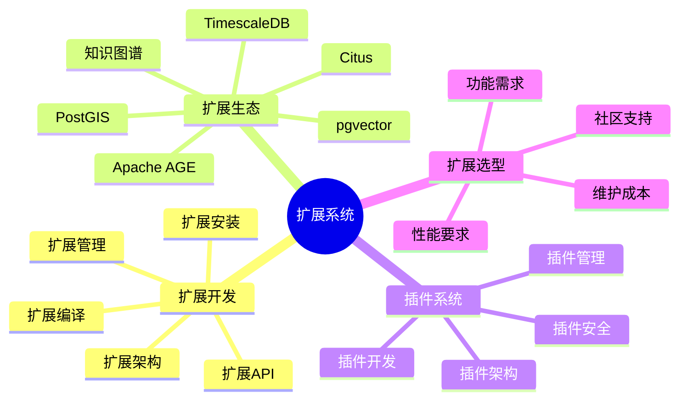
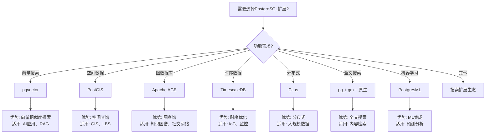

# 06-扩展系统

> **文档总数**: 7个文档
> **覆盖领域**: 扩展开发、插件系统、扩展生态、Apache AGE、知识图谱
> **版本覆盖**: PostgreSQL 18.x (推荐) ⭐ | 17.x (推荐) | 16.x (兼容)

---

## 📊 知识体系思维导图

---

## 📋 主题说明

本主题整合所有PostgreSQL扩展系统相关内容，包括扩展开发方法、插件系统架构、扩展生态介绍，以及Apache AGE图数据库和知识图谱等扩展的实战指南。

---

## 📚 核心文档

### 扩展开发

- **[\【深入】PostgreSQL扩展开发完整实战指南.md](./【深入】PostgreSQL扩展开发完整实战指南.md)** - 扩展开发完整实战指南
- **[扩展开发体系详解.md](./扩展开发体系详解.md)** - 扩展开发完整体系
- **[扩展开发指南.md](./扩展开发指南.md)** - 扩展开发基础指南
- **[扩展管理.md](./扩展管理.md)** - 扩展管理方法

### Apache AGE图数据库

- **[\【深入】Apache AGE图数据库完整实战指南.md](./【深入】Apache AGE图数据库完整实战指南.md)** - Apache AGE完整实战指南

### 知识图谱

- **[\【深入】知识图谱本体建模与推理指南.md](./【深入】知识图谱本体建模与推理指南.md)** - 知识图谱本体建模与推理

---

## 📊 扩展选型决策树

---

## 📊 扩展对比矩阵

| 扩展名称 | 功能 | 性能 | 社区活跃度 | 维护状态 | 适用场景 | PostgreSQL版本 |
|---------|------|------|-----------|---------|---------|--------------|
| **pgvector** | 向量搜索 | ⭐⭐⭐⭐⭐ | ⭐⭐⭐⭐⭐ | 活跃 | AI应用、RAG | 11+ |
| **PostGIS** | 空间数据 | ⭐⭐⭐⭐⭐ | ⭐⭐⭐⭐⭐ | 活跃 | GIS、LBS | 9.1+ |
| **Apache AGE** | 图数据库 | ⭐⭐⭐⭐ | ⭐⭐⭐⭐ | 活跃 | 知识图谱、社交网络 | 11+ |
| **TimescaleDB** | 时序数据 | ⭐⭐⭐⭐⭐ | ⭐⭐⭐⭐⭐ | 活跃 | IoT、监控 | 11+ |
| **Citus** | 分布式 | ⭐⭐⭐⭐ | ⭐⭐⭐⭐ | 活跃 | 大规模数据 | 11+ |
| **PostgresML** | 机器学习 | ⭐⭐⭐⭐ | ⭐⭐⭐ | 活跃 | 预测分析 | 14+ |

---

## 🎯 使用建议

### 学习扩展开发

1. 从 [扩展开发指南.md](./扩展开发指南.md) 开始学习基础
2. 深入学习 [扩展开发体系详解.md](./扩展开发体系详解.md) 了解完整体系
3. 实践 [【深入】PostgreSQL扩展开发完整实战指南.md](./【深入】PostgreSQL扩展开发完整实战指南.md) 进行实战开发

### 使用图数据库

1. 学习 [【深入】Apache AGE图数据库完整实战指南.md](./【深入】Apache AGE图数据库完整实战指南.md) 使用Apache AGE
2. 参考 [【深入】知识图谱本体建模与推理指南.md](./【深入】知识图谱本体建模与推理指南.md) 构建知识图谱

### 扩展管理

1. 使用 [扩展管理.md](./扩展管理.md) 管理已安装的扩展
2. 参考 [扩展开发体系详解.md](./扩展开发体系详解.md) 了解扩展生态

---

## 📚 文档来源

本主题整合了以下源目录的文档：

- `PostgreSQL/03-高级特性/03.01-扩展系统与插件开发.md`
- `PostgreSQL培训/12-扩展开发/`
- `PostgreSQL/08-工具资源/`

**原则**: 所有文档均为复制，原文件保持不变。

---

## 🔗 相关文档

- [07-多模型数据库](../07-多模型数据库/README.md) - 多模型数据库应用
- [28-知识图谱](../28-知识图谱/README.md) - 知识图谱构建
- [10-AI与机器学习](../10-AI与机器学习/README.md) - AI与机器学习应用

---

**最后更新**: 2025年1月
**状态**: ✅ 文档整合完成
