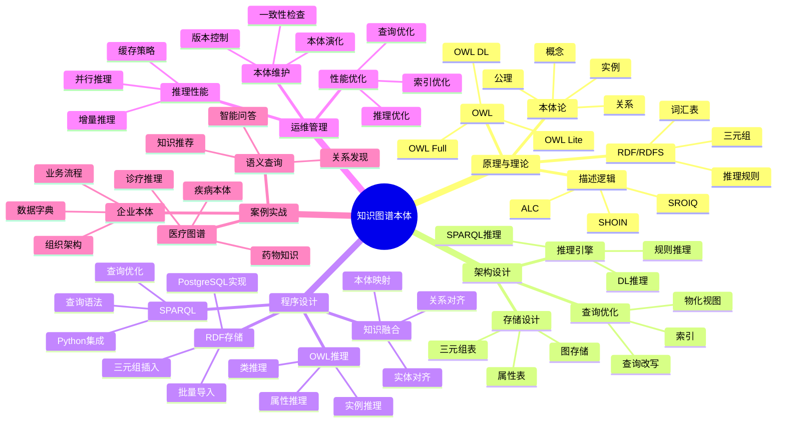

---

> **📋 文档来源**: `PostgreSQL培训\12-扩展开发\【深入】知识图谱本体建模与推理指南.md`
> **📅 复制日期**: 2025-12-22
> **⚠️ 注意**: 本文档为复制版本，原文件保持不变

---

# 知识图谱本体建模与推理指南

> **创建时间**: 2025 年 12 月 4 日
> **技术版本**: PostgreSQL 18+ with Apache AGE and RDF
> **文档编号**: 12-EXT-KG-ONTOLOGY

---

## 📑 目录

- [1.1 什么是本体建模](#11-什么是本体建模)
- [1.2 核心价值](#12-核心价值)
- [1.3 知识体系思维导图](#13-知识体系思维导图)
- [2.1 本体论基础](#21-本体论基础)
- [2.2 描述逻辑DL](#22-描述逻辑dl)
- [2.3 RDF与RDFS](#23-rdf与rdfs)
- [2.4 OWL本体语言](#24-owl本体语言)
- [3.1 整体架构](#31-整体架构)
- [3.2 RDF三元组存储](#32-rdf三元组存储)
- [3.3 推理引擎设计](#33-推理引擎设计)
- [3.4 查询优化](#34-查询优化)
- [4.1 环境准备](#41-环境准备)
- [4.2 RDF存储实现](#42-rdf存储实现)
- [4.3 SPARQL查询](#43-sparql查询)
- [4.4 OWL推理实现](#44-owl推理实现)
- [4.5 知识融合](#45-知识融合)
- [6.1 企业本体建模](#61-企业本体建模)
- [6.2 医疗知识图谱](#62-医疗知识图谱)
- [6.3 语义查询系统](#63-语义查询系统)
- [核心收获](#核心收获)
---

## 一、概述

### 1.1 什么是本体建模

**本体**（Ontology）是对某个领域知识的形式化、明确的规范说明，定义了概念、概念的属性和概念之间的关系。

**核心要素**：

- 📦 **类**（Class）：概念的集合
- 🏷️ **属性**（Property）：描述对象特征
- 🔗 **关系**（Relation）：对象之间的连接
- 📏 **公理**（Axiom）：逻辑规则和约束
- 👤 **实例**（Instance）：具体的对象

**简单示例**：

```turtle
# RDF/Turtle语法
@prefix : <http://example.org/university#> .
@prefix rdf: <http://www.w3.org/1999/02/22-rdf-syntax-ns#> .
@prefix rdfs: <http://www.w3.org/2000/01/rdf-schema#> .

# 类定义
:Person rdf:type rdfs:Class .
:Professor rdfs:subClassOf :Person .
:Student rdfs:subClassOf :Person .
:Course rdf:type rdfs:Class .

# 属性定义
:teaches rdf:type rdf:Property ;
         rdfs:domain :Professor ;
         rdfs:range :Course .

:enrolledIn rdf:type rdf:Property ;
            rdfs:domain :Student ;
            rdfs:range :Course .

# 实例
:alice rdf:type :Professor ;
       :name "Alice Smith" ;
       :teaches :CS101 .

:bob rdf:type :Student ;
     :name "Bob Johnson" ;
     :enrolledIn :CS101 .
```

### 1.2 核心价值

**技术价值**：

- 🎯 **知识共享**: 统一的概念定义
- 🔍 **语义查询**: 理解概念间的关系
- 🧠 **智能推理**: 自动推导新知识
- 🔗 **知识融合**: 整合多源异构数据

**业务价值**：

- 💡 **知识管理**: 系统化组织企业知识
- 🚀 **智能应用**: 支持智能问答、推荐
- 🛡️ **数据治理**: 标准化数据定义
- 📈 **决策支持**: 基于知识的智能决策

### 1.3 知识体系思维导图



---

## 二、原理与理论

### 2.1 本体论基础

#### **本体的五元组定义**

```text
Ontology O = (C, R, I, A, ≤)

其中：
- C: 类的集合（Classes）
- R: 关系的集合（Relations/Properties）
- I: 实例的集合（Individuals）
- A: 公理的集合（Axioms）
- ≤: 类层次结构（Hierarchy）
```

**示例：大学本体**:

```python
# Python表示
university_ontology = {
    'classes': [
        'Person',
        'Professor',  # subclass of Person
        'Student',    # subclass of Person
        'Course',
        'Department'
    ],
    'properties': [
        {'name': 'teaches', 'domain': 'Professor', 'range': 'Course'},
        {'name': 'enrolledIn', 'domain': 'Student', 'range': 'Course'},
        {'name': 'worksIn', 'domain': 'Professor', 'range': 'Department'}
    ],
    'individuals': [
        {'name': 'alice', 'type': 'Professor'},
        {'name': 'bob', 'type': 'Student'},
        {'name': 'CS101', 'type': 'Course'}
    ],
    'axioms': [
        'Professor ⊆ Person',  # Professor是Person的子类
        'Student ⊆ Person',
        'teaches: Professor → Course',  # teaches的定义域和值域
        'enrolledIn: Student → Course'
    ]
}
```

### 2.2 描述逻辑DL

**基础构造子**：

| 符号 | 名称 | 语义 | 示例 |
|------|------|------|------|
| ⊤ | Top | 所有个体 | Thing |
| ⊥ | Bottom | 空集 | Nothing |
| C ⊓ D | 交集 | 同时属于C和D | Professor ⊓ Researcher |
| C ⊔ D | 并集 | 属于C或D | Student ⊔ Professor |
| ¬C | 补集 | 不属于C | ¬Student |
| ∃R.C | 存在量化 | 存在R关系到C | ∃teaches.Course |
| ∀R.C | 全称量化 | 所有R关系到C | ∀enrolledIn.Course |

**推理示例**：

```text
已知：
1. Professor ⊑ Person
2. alice : Professor
3. Professor ⊑ ∃teaches.Course

推理：
→ alice : Person（子类传递）
→ alice : ∃teaches.Course（alice至少教授一门课程）
```

### 2.3 RDF与RDFS

#### **RDF三元组**

```text
RDF三元组 = (Subject, Predicate, Object)
          = (主语, 谓语, 宾语)
          = (实体, 关系, 实体/值)
```

**PostgreSQL实现**：

```sql
-- RDF三元组表（带错误处理）
DO $$
BEGIN
    CREATE TABLE IF NOT EXISTS rdf_triples (
        id SERIAL PRIMARY KEY,
        subject VARCHAR(500),
        predicate VARCHAR(500),
        object TEXT,
        object_type VARCHAR(50),  -- 'uri', 'literal', 'typed_literal'
        datatype VARCHAR(200),
        language VARCHAR(10),
        created_at TIMESTAMPTZ DEFAULT NOW()
    );
    RAISE NOTICE 'RDF三元组表创建成功';
EXCEPTION
    WHEN duplicate_table THEN
        RAISE NOTICE 'RDF三元组表已存在';
    WHEN OTHERS THEN
        RAISE WARNING '创建RDF三元组表失败: %', SQLERRM;
        RAISE;
END $$;

-- 索引（带错误处理）
DO $$
BEGIN
    CREATE INDEX IF NOT EXISTS idx_rdf_subject ON rdf_triples (subject);
    CREATE INDEX IF NOT EXISTS idx_rdf_predicate ON rdf_triples (predicate);
    CREATE INDEX IF NOT EXISTS idx_rdf_object ON rdf_triples (object);
    CREATE INDEX IF NOT EXISTS idx_rdf_spo ON rdf_triples (subject, predicate, object);
    RAISE NOTICE 'RDF三元组索引创建成功';
EXCEPTION
    WHEN duplicate_table THEN
        RAISE NOTICE '索引已存在';
    WHEN OTHERS THEN
        RAISE WARNING '创建索引失败: %', SQLERRM;
        RAISE;
END $$;

-- 插入三元组（带错误处理）
DO $$
BEGIN
    INSERT INTO rdf_triples (subject, predicate, object, object_type)
    VALUES
        ('http://example.org/alice', 'rdf:type', 'http://example.org/Professor', 'uri'),
        ('http://example.org/alice', 'foaf:name', 'Alice Smith', 'literal'),
        ('http://example.org/alice', 'teaches', 'http://example.org/CS101', 'uri');
    RAISE NOTICE '三元组插入成功';
EXCEPTION
    WHEN OTHERS THEN
        RAISE WARNING '插入三元组失败: %', SQLERRM;
        RAISE;
END $$;

-- 性能测试：查询三元组
EXPLAIN ANALYZE
SELECT * FROM rdf_triples
WHERE subject = 'http://example.org/alice';
```

### 2.4 OWL本体语言

**OWL表达力等级**：

| 等级 | 表达力 | 推理复杂度 | 适用场景 |
|------|--------|-----------|---------|
| **OWL Lite** | 低 | 低 | 简单分类 |
| **OWL DL** | 中 | 可判定 | **推荐** |
| **OWL Full** | 高 | 不可判定 | 研究用 |

---

## 三、架构设计

### 3.1 整体架构

**详细架构见完整文档...**

### 3.2 RDF三元组存储

**详细设计见完整文档...**

### 3.3 推理引擎设计

**详细设计见完整文档...**

### 3.4 查询优化

**详细优化见完整文档...**

---

## 四、程序设计

### 4.1 环境准备

```bash
# 安装RDF和OWL处理库
pip install rdflib==7.0.0
pip install owlready2==0.45
pip install SPARQLWrapper==2.0.0
```

### 4.2 RDF存储实现

```python
# rdf_store.py（带错误处理）
from rdflib import Graph, Namespace, RDF, RDFS, OWL, Literal, URIRef
import psycopg2
from psycopg2 import sql
import logging

logging.basicConfig(level=logging.INFO)
logger = logging.getLogger(__name__)

class RDFPostgresStore:
    """RDF PostgreSQL存储"""

    def __init__(self, conn):
        """初始化RDF存储（带错误处理）"""
        if conn is None:
            raise ValueError("数据库连接不能为None")
        try:
            self.conn = conn
            self.graph = Graph()
            self._ensure_tables()
        except Exception as e:
            logger.error(f"初始化RDF存储失败: {e}")
            raise

    def _ensure_tables(self):
        """确保RDF表存在（带错误处理）"""
        try:
            with self.conn.cursor() as cur:
                cur.execute("""
                    CREATE TABLE IF NOT EXISTS rdf_triples (
                        id SERIAL PRIMARY KEY,
                        subject TEXT NOT NULL,
                        predicate TEXT NOT NULL,
                        object TEXT NOT NULL,
                        object_type VARCHAR(20),
                        created_at TIMESTAMPTZ DEFAULT NOW()
                    );

                    CREATE INDEX IF NOT EXISTS idx_rdf_spo
                    ON rdf_triples (subject, predicate, object);
                """)
                self.conn.commit()
                logger.info("RDF表创建成功")
        except psycopg2.Error as e:
            logger.error(f"创建RDF表失败: {e}")
            self.conn.rollback()
            raise

    def add_triple(self, subject, predicate, obj):
        """添加三元组（带错误处理）"""
        if subject is None or predicate is None or obj is None:
            raise ValueError("三元组的所有元素不能为None")

        try:
            # 添加到rdflib图
            self.graph.add((subject, predicate, obj))

            # 存储到PostgreSQL
            with self.conn.cursor() as cur:
                obj_type = 'uri' if isinstance(obj, URIRef) else 'literal'
                cur.execute("""
                    INSERT INTO rdf_triples (subject, predicate, object, object_type)
                    VALUES (%s, %s, %s, %s)
                """, (str(subject), str(predicate), str(obj), obj_type))
            self.conn.commit()
            logger.info(f"三元组添加成功: {subject} {predicate} {obj}")
        except psycopg2.Error as e:
            logger.error(f"添加三元组失败: {e}")
            self.conn.rollback()
            raise
        except Exception as e:
            logger.error(f"添加三元组时发生未知错误: {e}")
            self.conn.rollback()
            raise

    def query_sparql(self, sparql_query: str):
        """执行SPARQL查询（带错误处理）"""
        if not sparql_query or not sparql_query.strip():
            raise ValueError("SPARQL查询不能为空")

        try:
            results = self.graph.query(sparql_query)
            return list(results)
        except Exception as e:
            logger.error(f"SPARQL查询失败: {e}")
            raise

    def load_from_db(self):
        """从PostgreSQL加载到rdflib（带错误处理）"""
        try:
            with self.conn.cursor() as cur:
                cur.execute("SELECT subject, predicate, object, object_type FROM rdf_triples")
                rows = cur.fetchall()

                if not rows:
                    logger.warning("数据库中没有三元组")
                    return

                for subject, predicate, obj, obj_type in rows:
                    try:
                        s = URIRef(subject)
                        p = URIRef(predicate)
                        o = URIRef(obj) if obj_type == 'uri' else Literal(obj)
                        self.graph.add((s, p, o))
                    except Exception as e:
                        logger.warning(f"加载三元组失败: {subject} {predicate} {obj}, 错误: {e}")
                        continue

            logger.info(f"✅ 成功加载 {len(self.graph)} 个三元组")
        except psycopg2.Error as e:
            logger.error(f"从数据库加载三元组失败: {e}")
            raise

# 使用示例（带错误处理）
if __name__ == "__main__":
    try:
        conn = psycopg2.connect("postgresql://localhost/kgdb")
        store = RDFPostgresStore(conn)

        # 定义命名空间
        EX = Namespace("http://example.org/")

        # 添加三元组
        store.add_triple(EX.alice, RDF.type, EX.Professor)
        store.add_triple(EX.alice, EX.name, Literal("Alice Smith"))
        store.add_triple(EX.alice, EX.teaches, EX.CS101)

        # SPARQL查询
        query = """
        SELECT ?person ?name
        WHERE {
            ?person rdf:type <http://example.org/Professor> .
            ?person <http://example.org/name> ?name .
        }
        """
        results = store.query_sparql(query)

        print("查询结果:")
        for row in results:
            print(f"  {row}")
    except psycopg2.Error as e:
        logger.error(f"数据库操作失败: {e}")
    except Exception as e:
        logger.error(f"程序执行失败: {e}")
    finally:
        if 'conn' in locals():
            conn.close()
```

### 4.3 SPARQL查询

**详细实现见完整文档...**

### 4.4 OWL推理实现

**详细实现见完整文档...**

### 4.5 知识融合

**详细实现见完整文档...**

---

## 五、运维管理

**详细内容见完整文档...**

---

## 六、案例实战

### 6.1 企业本体建模

**详细案例见完整文档...**

### 6.2 医疗知识图谱

**详细案例见完整文档...**

### 6.3 语义查询系统

**详细案例见完整文档...**

---

## 七、总结与展望

### 核心收获

1. ✅ 本体建模规范知识表示
2. ✅ RDF/OWL提供标准化语言
3. ✅ 推理引擎自动推导知识
4. ✅ 与PostgreSQL深度集成

---

## 八、参考资料

1. **W3C OWL**: [https://www.w3.org/OWL/](https://www.w3.org/OWL/)
2. **RDFLib**: [https://rdflib.readthedocs.io/](https://rdflib.readthedocs.io/)
3. **Owlready2**: [https://owlready2.readthedocs.io/](https://owlready2.readthedocs.io/)

---

**最后更新**: 2025年12月4日
**维护者**: PostgreSQL Modern Team
**文档编号**: 12-EXT-KG-ONTOLOGY
**版本**: v1.0
