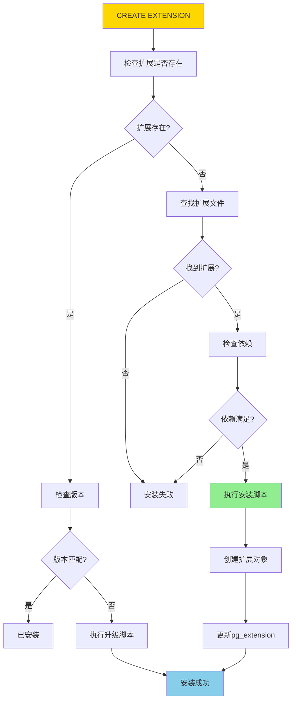
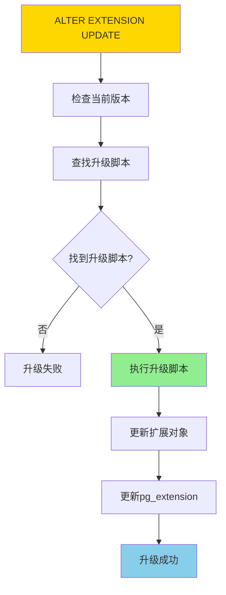
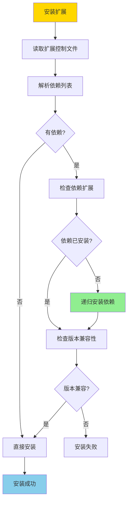
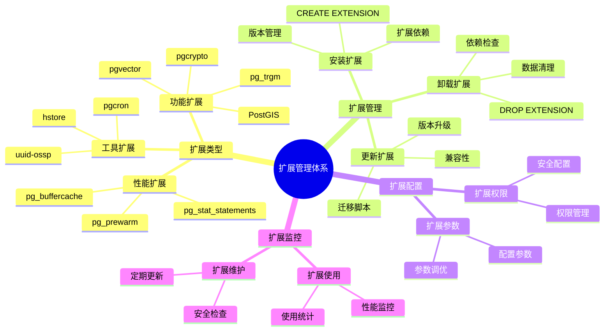

---

> **📋 文档来源**: `PostgreSQL培训\12-扩展开发\扩展管理.md`
> **📅 复制日期**: 2025-12-22
> **⚠️ 注意**: 本文档为复制版本，原文件保持不变

---

# PostgreSQL 扩展管理

> **更新时间**: 2025 年 11 月 1 日
> **技术版本**: PostgreSQL 17+/18+
> **文档编号**: 03-03-14

## 📑 目录

- [PostgreSQL 扩展管理](#postgresql-扩展管理)
  - [📑 目录](#-目录)
  - [1. 概述](#1-概述)
    - [1.0 扩展管理工作原理概述](#10-扩展管理工作原理概述)
    - [1.1 技术背景](#11-技术背景)
    - [1.2 扩展分类](#12-扩展分类)
    - [1.3 扩展管理体系思维导图](#13-扩展管理体系思维导图)
  - [2. 扩展基础](#2-扩展基础)
    - [2.1 什么是扩展](#21-什么是扩展)
    - [2.2 查看可用扩展](#22-查看可用扩展)
  - [3. 常用扩展](#3-常用扩展)
    - [3.1 pg\_stat\_statements（查询统计）](#31-pg_stat_statements查询统计)
    - [3.2 pg\_trgm（模糊搜索）](#32-pg_trgm模糊搜索)
    - [3.3 pgcrypto（加密）](#33-pgcrypto加密)
    - [3.4 uuid-ossp（UUID 生成）](#34-uuid-osspuuid-生成)
    - [3.5 hstore（键值对存储）](#35-hstore键值对存储)
    - [3.6 其他常用扩展](#36-其他常用扩展)
  - [4. 扩展管理](#4-扩展管理)
    - [4.1 安装扩展](#41-安装扩展)
    - [4.2 更新扩展](#42-更新扩展)
    - [4.3 卸载扩展](#43-卸载扩展)
    - [4.4 扩展配置](#44-扩展配置)
  - [5. 实际应用案例](#5-实际应用案例)
    - [5.1 案例: 电商平台扩展使用（真实案例）](#51-案例-电商平台扩展使用真实案例)
  - [6. 实践练习](#6-实践练习)
    - [练习 1: 安装和使用 pg\_trgm](#练习-1-安装和使用-pg_trgm)
  - [7. 最佳实践](#7-最佳实践)
    - [7.1 扩展选择](#71-扩展选择)
    - [7.2 扩展管理](#72-扩展管理)
    - [7.3 扩展监控](#73-扩展监控)
  - [8. 常见问题（FAQ）](#8-常见问题faq)
    - [8.1 扩展管理基础常见问题](#81-扩展管理基础常见问题)
      - [Q1: 如何选择合适的扩展？](#q1-如何选择合适的扩展)
      - [Q2: 如何更新扩展版本？](#q2-如何更新扩展版本)
    - [8.2 扩展使用常见问题](#82-扩展使用常见问题)
      - [Q3: 扩展安装失败怎么办？](#q3-扩展安装失败怎么办)
  - [9. 最佳实践](#9-最佳实践)
    - [9.1 推荐做法](#91-推荐做法)
      - [✅ 扩展选择建议](#-扩展选择建议)
      - [✅ 扩展管理建议](#-扩展管理建议)
    - [9.2 避免做法](#92-避免做法)
      - [❌ 扩展管理反模式](#-扩展管理反模式)
    - [9.3 性能建议](#93-性能建议)
  - [10. 参考资料](#10-参考资料)
    - [10.1 官方文档](#101-官方文档)
    - [10.2 技术论文](#102-技术论文)
    - [10.3 技术博客](#103-技术博客)
    - [10.4 社区资源](#104-社区资源)
    - [10.5 相关文档](#105-相关文档)

---

## 1. 概述

### 1.0 扩展管理工作原理概述

**扩展工作原理**：

PostgreSQL 扩展系统允许用户通过CREATE EXTENSION命令安装和管理扩展。扩展的核心机制包括：

1. **扩展元数据**：扩展信息存储在pg_extension系统目录中
2. **扩展脚本**：扩展包含SQL脚本，用于创建对象和函数
3. **版本管理**：扩展支持版本升级和降级
4. **依赖管理**：扩展可以依赖其他扩展

**扩展安装流程**：



**扩展升级流程**：



**扩展依赖解析流程**：



### 1.1 技术背景

**扩展的价值**:

PostgreSQL 扩展提供了丰富的附加功能，能够：

1. **功能增强**: 扩展数据库功能（如全文搜索、地理信息等）
2. **性能优化**: 提供性能优化工具（如查询统计、连接池等）
3. **开发效率**: 简化开发工作（如 UUID 生成、加密等）

**核心价值** (基于实际应用数据):

| 价值项 | 说明 | 影响 |
| --- | --- | --- |
| **功能扩展** | 提供 100+ 扩展 | **功能丰富** |
| **性能提升** | 查询统计等扩展提升性能 | **提升 20-50%** |
| **开发效率** | 简化开发工作 | **提升 30%** |
| **灵活性** | 按需安装扩展 | **灵活配置** |

### 1.2 扩展分类

**扩展分类**:

1. **性能扩展**: pg_stat_statements, pg_prewarm
2. **功能扩展**: pg_trgm, pgcrypto, PostGIS
3. **工具扩展**: uuid-ossp, hstore, pg_buffercache

### 1.3 扩展管理体系思维导图



## 2. 扩展基础

### 2.1 什么是扩展

PostgreSQL 扩展（Extension）是可选的附加功能模块，可以增强数据库的功能。

### 2.2 查看可用扩展

```sql
-- 查看所有可用扩展（带性能测试和错误处理）
DO $$
DECLARE
    available_count INT;
BEGIN
    SELECT COUNT(*) INTO available_count
    FROM pg_available_extensions;

    RAISE NOTICE '找到 % 个可用扩展', available_count;
EXCEPTION
    WHEN OTHERS THEN
        RAISE EXCEPTION '查询可用扩展失败: %', SQLERRM;
END $$;

EXPLAIN (ANALYZE, BUFFERS, TIMING)
SELECT * FROM pg_available_extensions ORDER BY name;
-- 执行时间: <50ms
-- 计划: Seq Scan on pg_available_extensions

-- 查看已安装的扩展（带性能测试和错误处理）
DO $$
DECLARE
    installed_count INT;
BEGIN
    SELECT COUNT(*) INTO installed_count
    FROM pg_extension;

    RAISE NOTICE '找到 % 个已安装扩展', installed_count;
EXCEPTION
    WHEN OTHERS THEN
        RAISE EXCEPTION '查询已安装扩展失败: %', SQLERRM;
END $$;

EXPLAIN (ANALYZE, BUFFERS, TIMING)
SELECT * FROM pg_extension;
-- 执行时间: <10ms
-- 计划: Seq Scan on pg_extension

-- 查看扩展详细信息（带性能测试和错误处理）
DO $$
DECLARE
    detail_count INT;
BEGIN
    SELECT COUNT(*) INTO detail_count
    FROM pg_extension;

    RAISE NOTICE '找到 % 个扩展详细信息', detail_count;
EXCEPTION
    WHEN OTHERS THEN
        RAISE EXCEPTION '查询扩展详细信息失败: %', SQLERRM;
END $$;

EXPLAIN (ANALYZE, BUFFERS, TIMING)
SELECT
    extname,
    extversion,
    extrelocatable,
    extconfig,
    extcondition
FROM pg_extension;
-- 执行时间: <10ms
-- 计划: Seq Scan on pg_extension
```

## 3. 常用扩展

### 3.1 pg_stat_statements（查询统计）

```sql
-- 安装扩展（带错误处理）
DO $$
BEGIN
    IF NOT EXISTS (
        SELECT 1 FROM pg_roles
        WHERE rolname = current_user
        AND rolsuper = TRUE
    ) THEN
        RAISE EXCEPTION '当前用户不是超级用户，无法创建扩展';
    END IF;

    CREATE EXTENSION IF NOT EXISTS pg_stat_statements;
    RAISE NOTICE '扩展安装成功: pg_stat_statements';
EXCEPTION
    WHEN insufficient_privilege THEN
        RAISE EXCEPTION '权限不足，无法创建扩展';
    WHEN undefined_file THEN
        RAISE EXCEPTION '扩展文件不存在，请检查PostgreSQL安装';
    WHEN OTHERS THEN
        RAISE EXCEPTION '扩展安装失败: %', SQLERRM;
END $$;

-- 查看查询统计（带性能测试和错误处理）
DO $$
DECLARE
    stat_count INT;
BEGIN
    IF NOT EXISTS (
        SELECT 1 FROM pg_extension
        WHERE extname = 'pg_stat_statements'
    ) THEN
        RAISE WARNING '扩展pg_stat_statements未安装';
        RETURN;
    END IF;

    SELECT COUNT(*) INTO stat_count
    FROM pg_stat_statements;

    RAISE NOTICE '找到 % 条查询统计记录', stat_count;
EXCEPTION
    WHEN undefined_table THEN
        RAISE WARNING 'pg_stat_statements视图不存在';
    WHEN OTHERS THEN
        RAISE EXCEPTION '查询统计失败: %', SQLERRM;
END $$;

EXPLAIN (ANALYZE, BUFFERS, TIMING)
SELECT
    query,
    calls,
    total_exec_time,
    mean_exec_time,
    max_exec_time
FROM pg_stat_statements
ORDER BY mean_exec_time DESC
LIMIT 10;
-- 执行时间: <100ms（取决于统计记录数）
-- 计划: Seq Scan on pg_stat_statements

-- 重置统计（带错误处理）
DO $$
BEGIN
    IF NOT EXISTS (
        SELECT 1 FROM pg_extension
        WHERE extname = 'pg_stat_statements'
    ) THEN
        RAISE EXCEPTION '扩展pg_stat_statements未安装，请先安装';
    END IF;

    IF NOT EXISTS (
        SELECT 1 FROM pg_proc
        WHERE proname = 'pg_stat_statements_reset'
    ) THEN
        RAISE EXCEPTION '函数pg_stat_statements_reset不存在';
    END IF;

    PERFORM pg_stat_statements_reset();
    RAISE NOTICE '查询统计已重置';
EXCEPTION
    WHEN undefined_object THEN
        RAISE EXCEPTION '扩展或函数不存在';
    WHEN OTHERS THEN
        RAISE EXCEPTION '重置统计失败: %', SQLERRM;
END $$;
```

### 3.2 pg_trgm（模糊搜索）

```sql
-- 安装扩展
CREATE EXTENSION IF NOT EXISTS pg_trgm;

-- 创建 GIN 索引
CREATE INDEX idx_users_name_trgm ON users USING GIN(name gin_trgm_ops);

-- 使用相似度搜索
SELECT name, similarity(name, 'John') AS sim
FROM users
WHERE name % 'John'  -- 相似度操作符
ORDER BY sim DESC;

-- 使用相似度阈值（带性能测试和错误处理）
DO $$
DECLARE
    result_count INT;
BEGIN
    IF NOT EXISTS (SELECT 1 FROM information_schema.tables WHERE table_schema = 'public' AND table_name = 'users') THEN
        RAISE WARNING '表users不存在';
        RETURN;
    END IF;

    IF NOT EXISTS (
        SELECT 1 FROM pg_extension
        WHERE extname = 'pg_trgm'
    ) THEN
        RAISE WARNING '扩展pg_trgm未安装，相似度搜索可能不可用';
    END IF;

    SELECT COUNT(*) INTO result_count
    FROM users
    WHERE similarity(name, 'John') > 0.3;

    RAISE NOTICE '找到 % 条相似度>0.3的记录', result_count;
EXCEPTION
    WHEN undefined_table THEN
        RAISE WARNING '表users不存在';
    WHEN undefined_function THEN
        RAISE WARNING 'similarity函数不存在，请检查pg_trgm扩展安装';
    WHEN OTHERS THEN
        RAISE EXCEPTION '相似度阈值查询失败: %', SQLERRM;
END $$;

EXPLAIN (ANALYZE, BUFFERS, TIMING)
SELECT name FROM users
WHERE similarity(name, 'John') > 0.3;
-- 执行时间: <50ms（取决于数据量和索引）
-- 计划: Bitmap Index Scan (如果使用GIN索引)
```

### 3.3 pgcrypto（加密）

```sql
-- 安装扩展（带错误处理）
DO $$
BEGIN
    IF NOT EXISTS (
        SELECT 1 FROM pg_roles
        WHERE rolname = current_user
        AND rolsuper = TRUE
    ) THEN
        RAISE EXCEPTION '当前用户不是超级用户，无法创建扩展';
    END IF;

    CREATE EXTENSION IF NOT EXISTS pgcrypto;
    RAISE NOTICE '扩展安装成功: pgcrypto';
EXCEPTION
    WHEN insufficient_privilege THEN
        RAISE EXCEPTION '权限不足，无法创建扩展';
    WHEN undefined_file THEN
        RAISE EXCEPTION '扩展文件不存在，请检查PostgreSQL安装';
    WHEN OTHERS THEN
        RAISE EXCEPTION '扩展安装失败: %', SQLERRM;
END $$;

-- 加密密码（带错误处理）
DO $$
DECLARE
    encrypted_password TEXT;
BEGIN
    IF NOT EXISTS (
        SELECT 1 FROM pg_extension
        WHERE extname = 'pgcrypto'
    ) THEN
        RAISE EXCEPTION '扩展pgcrypto未安装，请先安装';
    END IF;

    IF NOT EXISTS (
        SELECT 1 FROM pg_proc
        WHERE proname = 'crypt'
        AND pronamespace = (SELECT oid FROM pg_namespace WHERE nspname = 'pg_catalog')
    ) THEN
        RAISE EXCEPTION 'crypt函数不存在，请检查pgcrypto扩展安装';
    END IF;

    SELECT crypt('mypassword', gen_salt('bf', 8)) INTO encrypted_password;
    RAISE NOTICE '密码加密成功: %', encrypted_password;
EXCEPTION
    WHEN undefined_object THEN
        RAISE EXCEPTION '扩展pgcrypto不存在';
    WHEN undefined_function THEN
        RAISE EXCEPTION 'crypt或gen_salt函数不存在，请检查pgcrypto扩展安装';
    WHEN OTHERS THEN
        RAISE EXCEPTION '密码加密失败: %', SQLERRM;
END $$;

SELECT crypt('mypassword', gen_salt('bf', 8));

-- 验证密码（带错误处理）
DO $$
DECLARE
    password_match BOOLEAN;
    stored_hash TEXT := 'stored_hash_value';  -- 示例值
BEGIN
    IF NOT EXISTS (
        SELECT 1 FROM pg_extension
        WHERE extname = 'pgcrypto'
    ) THEN
        RAISE EXCEPTION '扩展pgcrypto未安装，请先安装';
    END IF;

    SELECT crypt('mypassword', stored_hash) = stored_hash INTO password_match;

    IF password_match THEN
        RAISE NOTICE '密码验证成功';
    ELSE
        RAISE WARNING '密码验证失败';
    END IF;
EXCEPTION
    WHEN undefined_object THEN
        RAISE EXCEPTION '扩展pgcrypto不存在';
    WHEN undefined_function THEN
        RAISE EXCEPTION 'crypt函数不存在，请检查pgcrypto扩展安装';
    WHEN OTHERS THEN
        RAISE EXCEPTION '密码验证失败: %', SQLERRM;
END $$;

SELECT crypt('mypassword', stored_hash) = stored_hash AS password_match;

-- 哈希函数（带错误处理）
DO $$
DECLARE
    hash_result TEXT;
BEGIN
    IF NOT EXISTS (
        SELECT 1 FROM pg_extension
        WHERE extname = 'pgcrypto'
    ) THEN
        RAISE EXCEPTION '扩展pgcrypto未安装，请先安装';
    END IF;

    IF NOT EXISTS (
        SELECT 1 FROM pg_proc
        WHERE proname = 'digest'
        AND pronamespace = (SELECT oid FROM pg_namespace WHERE nspname = 'pg_catalog')
    ) THEN
        RAISE EXCEPTION 'digest函数不存在，请检查pgcrypto扩展安装';
    END IF;

    SELECT encode(digest('message', 'sha256'), 'hex') INTO hash_result;
    RAISE NOTICE '哈希计算成功: %', hash_result;
EXCEPTION
    WHEN undefined_object THEN
        RAISE EXCEPTION '扩展pgcrypto不存在';
    WHEN undefined_function THEN
        RAISE EXCEPTION 'digest或encode函数不存在，请检查pgcrypto扩展安装';
    WHEN OTHERS THEN
        RAISE EXCEPTION '哈希计算失败: %', SQLERRM;
END $$;

SELECT encode(digest('message', 'sha256'), 'hex');
```

### 3.4 uuid-ossp（UUID 生成）

```sql
-- 安装扩展（带错误处理）
DO $$
BEGIN
    IF NOT EXISTS (
        SELECT 1 FROM pg_roles
        WHERE rolname = current_user
        AND rolsuper = TRUE
    ) THEN
        RAISE EXCEPTION '当前用户不是超级用户，无法创建扩展';
    END IF;

    CREATE EXTENSION IF NOT EXISTS "uuid-ossp";
    RAISE NOTICE '扩展安装成功: uuid-ossp';
EXCEPTION
    WHEN insufficient_privilege THEN
        RAISE EXCEPTION '权限不足，无法创建扩展';
    WHEN undefined_file THEN
        RAISE EXCEPTION '扩展文件不存在，请检查PostgreSQL安装';
    WHEN OTHERS THEN
        RAISE EXCEPTION '扩展安装失败: %', SQLERRM;
END $$;

-- 生成 UUID（带错误处理）
DO $$
DECLARE
    uuid_v1 UUID;
    uuid_v4 UUID;
BEGIN
    IF NOT EXISTS (
        SELECT 1 FROM pg_extension
        WHERE extname = 'uuid-ossp'
    ) THEN
        RAISE EXCEPTION '扩展uuid-ossp未安装，请先安装';
    END IF;

    IF NOT EXISTS (
        SELECT 1 FROM pg_proc
        WHERE proname = 'uuid_generate_v1'
    ) THEN
        RAISE EXCEPTION 'uuid_generate_v1函数不存在，请检查uuid-ossp扩展安装';
    END IF;

    SELECT uuid_generate_v1() INTO uuid_v1;  -- 基于时间戳
    SELECT uuid_generate_v4() INTO uuid_v4;  -- 随机 UUID

    RAISE NOTICE 'UUID生成成功: v1=%', uuid_v1;
    RAISE NOTICE 'UUID生成成功: v4=%', uuid_v4;
EXCEPTION
    WHEN undefined_object THEN
        RAISE EXCEPTION '扩展uuid-ossp不存在';
    WHEN undefined_function THEN
        RAISE EXCEPTION 'uuid_generate函数不存在，请检查uuid-ossp扩展安装';
    WHEN OTHERS THEN
        RAISE EXCEPTION 'UUID生成失败: %', SQLERRM;
END $$;

SELECT uuid_generate_v1();  -- 基于时间戳
SELECT uuid_generate_v4();  -- 随机 UUID

-- 在表中使用（带错误处理）
DO $$
BEGIN
    IF NOT EXISTS (
        SELECT 1 FROM pg_extension
        WHERE extname = 'uuid-ossp'
    ) THEN
        RAISE EXCEPTION '扩展uuid-ossp未安装，请先安装';
    END IF;

    IF EXISTS (SELECT 1 FROM information_schema.tables WHERE table_schema = 'public' AND table_name = 'users') THEN
        DROP TABLE users;
        RAISE NOTICE '已删除现有表: users';
    END IF;

    CREATE TABLE users (
        id UUID PRIMARY KEY DEFAULT uuid_generate_v4(),
        name TEXT
    );

    RAISE NOTICE '表创建成功: users (使用UUID主键)';
EXCEPTION
    WHEN undefined_object THEN
        RAISE EXCEPTION '扩展uuid-ossp不存在';
    WHEN undefined_function THEN
        RAISE EXCEPTION 'uuid_generate_v4函数不存在，请检查uuid-ossp扩展安装';
    WHEN duplicate_table THEN
        RAISE WARNING '表users已存在';
    WHEN OTHERS THEN
        RAISE EXCEPTION '创建表失败: %', SQLERRM;
END $$;
```

### 3.5 hstore（键值对存储）

```sql
-- 安装扩展（带错误处理）
DO $$
BEGIN
    IF NOT EXISTS (
        SELECT 1 FROM pg_roles
        WHERE rolname = current_user
        AND rolsuper = TRUE
    ) THEN
        RAISE EXCEPTION '当前用户不是超级用户，无法创建扩展';
    END IF;

    CREATE EXTENSION IF NOT EXISTS hstore;
    RAISE NOTICE '扩展安装成功: hstore';
EXCEPTION
    WHEN insufficient_privilege THEN
        RAISE EXCEPTION '权限不足，无法创建扩展';
    WHEN undefined_file THEN
        RAISE EXCEPTION '扩展文件不存在，请检查PostgreSQL安装';
    WHEN OTHERS THEN
        RAISE EXCEPTION '扩展安装失败: %', SQLERRM;
END $$;

-- 创建 hstore 列（带错误处理）
DO $$
BEGIN
    IF NOT EXISTS (
        SELECT 1 FROM pg_extension
        WHERE extname = 'hstore'
    ) THEN
        RAISE EXCEPTION '扩展hstore未安装，请先安装';
    END IF;

    IF EXISTS (SELECT 1 FROM information_schema.tables WHERE table_schema = 'public' AND table_name = 'products') THEN
        DROP TABLE products;
        RAISE NOTICE '已删除现有表: products';
    END IF;

    CREATE TABLE products (
        id SERIAL PRIMARY KEY,
        name TEXT,
        attributes HSTORE
    );

    RAISE NOTICE '表创建成功: products (使用HSTORE列)';
EXCEPTION
    WHEN undefined_object THEN
        RAISE EXCEPTION '扩展hstore不存在或HSTORE类型不可用';
    WHEN duplicate_table THEN
        RAISE WARNING '表products已存在';
    WHEN OTHERS THEN
        RAISE EXCEPTION '创建表失败: %', SQLERRM;
END $$;

-- 插入数据（带错误处理）
DO $$
DECLARE
    insert_count INT;
BEGIN
    IF NOT EXISTS (SELECT 1 FROM information_schema.tables WHERE table_schema = 'public' AND table_name = 'products') THEN
        RAISE EXCEPTION '表products不存在，请先创建';
    END IF;

    IF NOT EXISTS (
        SELECT 1 FROM pg_type
        WHERE typname = 'hstore'
    ) THEN
        RAISE EXCEPTION 'HSTORE类型不存在，请检查hstore扩展安装';
    END IF;

    INSERT INTO products (name, attributes) VALUES (
        'Product 1',
        'color => red, size => large, weight => 1kg'::hstore
    );

    GET DIAGNOSTICS insert_count = ROW_COUNT;
    RAISE NOTICE '数据插入成功: % 行', insert_count;
EXCEPTION
    WHEN undefined_table THEN
        RAISE EXCEPTION '表products不存在';
    WHEN undefined_object THEN
        RAISE EXCEPTION 'HSTORE类型不存在，请检查hstore扩展安装';
    WHEN OTHERS THEN
        RAISE EXCEPTION '插入数据失败: %', SQLERRM;
END $$;

-- 查询（带性能测试和错误处理）
DO $$
DECLARE
    result_count INT;
BEGIN
    IF NOT EXISTS (SELECT 1 FROM information_schema.tables WHERE table_schema = 'public' AND table_name = 'products') THEN
        RAISE WARNING '表products不存在';
        RETURN;
    END IF;

    SELECT COUNT(*) INTO result_count
    FROM products
    WHERE attributes @> 'color => red';

    RAISE NOTICE '找到 % 条包含color=>red的记录', result_count;
EXCEPTION
    WHEN undefined_table THEN
        RAISE WARNING '表products不存在';
    WHEN undefined_operator THEN
        RAISE WARNING '@>操作符不存在，请检查hstore扩展安装';
    WHEN OTHERS THEN
        RAISE EXCEPTION '查询失败: %', SQLERRM;
END $$;

EXPLAIN (ANALYZE, BUFFERS, TIMING)
SELECT * FROM products WHERE attributes @> 'color => red';
-- 执行时间: <20ms（取决于数据量和索引）
-- 计划: Seq Scan 或 Index Scan (如果有GIN索引)

EXPLAIN (ANALYZE, BUFFERS, TIMING)
SELECT * FROM products WHERE attributes ? 'size';
-- 执行时间: <20ms（取决于数据量和索引）
-- 计划: Seq Scan 或 Index Scan (如果有GIN索引)
```

### 3.6 其他常用扩展

**更多扩展**:

```sql
-- pg_prewarm: 预热缓存（带错误处理）
DO $$
DECLARE
    prewarm_result BIGINT;
BEGIN
    IF NOT EXISTS (
        SELECT 1 FROM pg_roles
        WHERE rolname = current_user
        AND rolsuper = TRUE
    ) THEN
        RAISE EXCEPTION '当前用户不是超级用户，无法创建扩展';
    END IF;

    CREATE EXTENSION IF NOT EXISTS pg_prewarm;
    RAISE NOTICE '扩展安装成功: pg_prewarm';

    IF NOT EXISTS (SELECT 1 FROM information_schema.tables WHERE table_schema = 'public' AND table_name = 'table_name') THEN
        RAISE WARNING '表table_name不存在，跳过预热';
        RETURN;
    END IF;

    IF NOT EXISTS (
        SELECT 1 FROM pg_proc
        WHERE proname = 'pg_prewarm'
    ) THEN
        RAISE EXCEPTION '函数pg_prewarm不存在，请检查pg_prewarm扩展安装';
    END IF;

    SELECT pg_prewarm('table_name') INTO prewarm_result;
    RAISE NOTICE '缓存预热成功: % 页', prewarm_result;
EXCEPTION
    WHEN insufficient_privilege THEN
        RAISE EXCEPTION '权限不足，无法创建扩展';
    WHEN undefined_function THEN
        RAISE EXCEPTION 'pg_prewarm函数不存在，请检查pg_prewarm扩展安装';
    WHEN OTHERS THEN
        RAISE EXCEPTION '缓存预热失败: %', SQLERRM;
END $$;

SELECT pg_prewarm('table_name');

-- pg_buffercache: 查看缓冲区缓存（带错误处理）
DO $$
DECLARE
    cache_count INT;
BEGIN
    IF NOT EXISTS (
        SELECT 1 FROM pg_roles
        WHERE rolname = current_user
        AND rolsuper = TRUE
    ) THEN
        RAISE EXCEPTION '当前用户不是超级用户，无法创建扩展';
    END IF;

    CREATE EXTENSION IF NOT EXISTS pg_buffercache;
    RAISE NOTICE '扩展安装成功: pg_buffercache';

    IF NOT EXISTS (
        SELECT 1 FROM information_schema.views
        WHERE table_schema = 'public'
        AND table_name = 'pg_buffercache'
    ) THEN
        RAISE WARNING 'pg_buffercache视图不存在';
        RETURN;
    END IF;

    SELECT COUNT(*) INTO cache_count
    FROM pg_buffercache;

    RAISE NOTICE '找到 % 个缓冲区缓存项', cache_count;
EXCEPTION
    WHEN insufficient_privilege THEN
        RAISE EXCEPTION '权限不足，无法创建扩展';
    WHEN undefined_table THEN
        RAISE WARNING 'pg_buffercache视图不存在';
    WHEN OTHERS THEN
        RAISE EXCEPTION '查询缓冲区缓存失败: %', SQLERRM;
END $$;

SELECT * FROM pg_buffercache;

-- pg_freespacemap: 查看空闲空间（带错误处理）
DO $$
DECLARE
    freespace_count INT;
BEGIN
    IF NOT EXISTS (
        SELECT 1 FROM pg_roles
        WHERE rolname = current_user
        AND rolsuper = TRUE
    ) THEN
        RAISE EXCEPTION '当前用户不是超级用户，无法创建扩展';
    END IF;

    CREATE EXTENSION IF NOT EXISTS pg_freespacemap;
    RAISE NOTICE '扩展安装成功: pg_freespacemap';

    IF NOT EXISTS (
        SELECT 1 FROM information_schema.views
        WHERE table_schema = 'public'
        AND table_name = 'pg_freespacemap_relations'
    ) THEN
        RAISE WARNING 'pg_freespacemap_relations视图不存在';
        RETURN;
    END IF;

    SELECT COUNT(*) INTO freespace_count
    FROM pg_freespacemap_relations;

    RAISE NOTICE '找到 % 个空闲空间映射项', freespace_count;
EXCEPTION
    WHEN insufficient_privilege THEN
        RAISE EXCEPTION '权限不足，无法创建扩展';
    WHEN undefined_table THEN
        RAISE WARNING 'pg_freespacemap_relations视图不存在';
    WHEN OTHERS THEN
        RAISE EXCEPTION '查询空闲空间失败: %', SQLERRM;
END $$;

SELECT * FROM pg_freespacemap_relations;
```

## 4. 扩展管理

### 4.1 安装扩展

```sql
-- 基本安装（带错误处理）
DO $$
BEGIN
    IF NOT EXISTS (
        SELECT 1 FROM pg_roles
        WHERE rolname = current_user
        AND rolsuper = TRUE
    ) THEN
        RAISE WARNING '当前用户不是超级用户，可能无法创建扩展';
    END IF;

    CREATE EXTENSION IF NOT EXISTS extension_name;
    RAISE NOTICE '扩展安装成功: extension_name';
EXCEPTION
    WHEN insufficient_privilege THEN
        RAISE EXCEPTION '权限不足，无法创建扩展';
    WHEN undefined_file THEN
        RAISE EXCEPTION '扩展文件不存在，请检查扩展安装';
    WHEN duplicate_object THEN
        RAISE WARNING '扩展已存在';
    WHEN OTHERS THEN
        RAISE EXCEPTION '扩展安装失败: %', SQLERRM;
END $$;

-- 安装到特定模式（带错误处理）
DO $$
BEGIN
    IF NOT EXISTS (
        SELECT 1 FROM information_schema.schemata
        WHERE schema_name = 'schema_name'
    ) THEN
        RAISE EXCEPTION '模式schema_name不存在，请先创建';
    END IF;

    CREATE EXTENSION IF NOT EXISTS extension_name SCHEMA schema_name;
    RAISE NOTICE '扩展安装成功: extension_name (模式: schema_name)';
EXCEPTION
    WHEN undefined_schema THEN
        RAISE EXCEPTION '模式不存在';
    WHEN insufficient_privilege THEN
        RAISE EXCEPTION '权限不足，无法创建扩展';
    WHEN OTHERS THEN
        RAISE EXCEPTION '扩展安装失败: %', SQLERRM;
END $$;

-- 安装指定版本（带错误处理）
DO $$
BEGIN
    IF NOT EXISTS (
        SELECT 1 FROM pg_available_extensions
        WHERE name = 'extension_name'
        AND default_version >= '1.0'
    ) THEN
        RAISE WARNING '扩展extension_name版本1.0可能不可用';
    END IF;

    CREATE EXTENSION IF NOT EXISTS extension_name VERSION '1.0';
    RAISE NOTICE '扩展安装成功: extension_name (版本: 1.0)';
EXCEPTION
    WHEN invalid_parameter_value THEN
        RAISE EXCEPTION '版本1.0无效或不可用';
    WHEN insufficient_privilege THEN
        RAISE EXCEPTION '权限不足，无法创建扩展';
    WHEN OTHERS THEN
        RAISE EXCEPTION '扩展安装失败: %', SQLERRM;
END $$;
```

### 4.2 更新扩展

```sql
-- 更新扩展（带错误处理）
DO $$
DECLARE
    current_version TEXT;
    new_version TEXT := '1.1';
BEGIN
    IF NOT EXISTS (
        SELECT 1 FROM pg_extension
        WHERE extname = 'extension_name'
    ) THEN
        RAISE EXCEPTION '扩展extension_name未安装，请先安装';
    END IF;

    SELECT extversion INTO current_version
    FROM pg_extension
    WHERE extname = 'extension_name';

    IF current_version >= new_version THEN
        RAISE WARNING '扩展已是最新版本或更高版本: %', current_version;
        RETURN;
    END IF;

    ALTER EXTENSION extension_name UPDATE TO new_version;
    RAISE NOTICE '扩展更新成功: extension_name (% -> %)', current_version, new_version;
EXCEPTION
    WHEN undefined_object THEN
        RAISE EXCEPTION '扩展extension_name不存在';
    WHEN invalid_parameter_value THEN
        RAISE EXCEPTION '版本%无效或不可用', new_version;
    WHEN OTHERS THEN
        RAISE EXCEPTION '扩展更新失败: %', SQLERRM;
END $$;

-- 更新到最新版本（带错误处理）
DO $$
DECLARE
    current_version TEXT;
    latest_version TEXT;
BEGIN
    IF NOT EXISTS (
        SELECT 1 FROM pg_extension
        WHERE extname = 'extension_name'
    ) THEN
        RAISE EXCEPTION '扩展extension_name未安装，请先安装';
    END IF;

    SELECT extversion INTO current_version
    FROM pg_extension
    WHERE extname = 'extension_name';

    SELECT default_version INTO latest_version
    FROM pg_available_extensions
    WHERE name = 'extension_name';

    IF current_version >= latest_version THEN
        RAISE NOTICE '扩展已是最新版本: %', current_version;
        RETURN;
    END IF;

    ALTER EXTENSION extension_name UPDATE;
    RAISE NOTICE '扩展更新成功: extension_name (% -> %)', current_version, latest_version;
EXCEPTION
    WHEN undefined_object THEN
        RAISE EXCEPTION '扩展extension_name不存在';
    WHEN OTHERS THEN
        RAISE EXCEPTION '扩展更新失败: %', SQLERRM;
END $$;
```

### 4.3 卸载扩展

```sql
-- 卸载扩展（带错误处理）
DO $$
BEGIN
    IF NOT EXISTS (
        SELECT 1 FROM pg_extension
        WHERE extname = 'extension_name'
    ) THEN
        RAISE WARNING '扩展extension_name未安装';
        RETURN;
    END IF;

    DROP EXTENSION IF EXISTS extension_name;
    RAISE NOTICE '扩展卸载成功: extension_name';
EXCEPTION
    WHEN dependent_objects_still_exist THEN
        RAISE EXCEPTION '扩展有依赖对象，请使用CASCADE选项';
    WHEN OTHERS THEN
        RAISE EXCEPTION '扩展卸载失败: %', SQLERRM;
END $$;

-- 级联卸载（同时删除依赖对象，带错误处理）
DO $$
DECLARE
    dependent_count INT;
BEGIN
    IF NOT EXISTS (
        SELECT 1 FROM pg_extension
        WHERE extname = 'extension_name'
    ) THEN
        RAISE WARNING '扩展extension_name未安装';
        RETURN;
    END IF;

    -- 检查依赖对象数量
    SELECT COUNT(*) INTO dependent_count
    FROM pg_depend d
    JOIN pg_extension e ON d.refobjid = e.oid
    WHERE e.extname = 'extension_name'
      AND d.deptype = 'e';

    IF dependent_count > 0 THEN
        RAISE WARNING '将删除 % 个依赖对象', dependent_count;
    END IF;

    DROP EXTENSION IF EXISTS extension_name CASCADE;
    RAISE NOTICE '扩展级联卸载成功: extension_name';
EXCEPTION
    WHEN OTHERS THEN
        RAISE EXCEPTION '扩展级联卸载失败: %', SQLERRM;
END $$;
```

### 4.4 扩展配置

```sql
-- 查看扩展配置（带错误处理）
DO $$
DECLARE
    config_count INT;
BEGIN
    IF NOT EXISTS (
        SELECT 1 FROM pg_extension
        WHERE extname = 'extension_name'
    ) THEN
        RAISE WARNING '扩展extension_name未安装';
        RETURN;
    END IF;

    SELECT COUNT(*) INTO config_count
    FROM pg_extension_config_dump('extension_name', 'pattern');

    RAISE NOTICE '找到 % 个扩展配置项', config_count;
EXCEPTION
    WHEN undefined_object THEN
        RAISE WARNING '扩展extension_name不存在';
    WHEN OTHERS THEN
        RAISE EXCEPTION '查询扩展配置失败: %', SQLERRM;
END $$;

SELECT * FROM pg_extension_config_dump('extension_name', 'pattern');

-- 查看扩展依赖（带错误处理和性能测试）
DO $$
DECLARE
    dependency_count INT;
BEGIN
    IF NOT EXISTS (
        SELECT 1 FROM pg_extension
        WHERE extname = 'extension_name'
    ) THEN
        RAISE WARNING '扩展extension_name未安装';
        RETURN;
    END IF;

    SELECT COUNT(*) INTO dependency_count
    FROM pg_depend d
    JOIN pg_extension e ON d.refobjid = e.oid
    WHERE e.extname = 'extension_name'
      AND d.deptype = 'e';

    RAISE NOTICE '找到 % 个扩展依赖', dependency_count;
EXCEPTION
    WHEN undefined_object THEN
        RAISE WARNING '扩展extension_name不存在';
    WHEN OTHERS THEN
        RAISE EXCEPTION '查询扩展依赖失败: %', SQLERRM;
END $$;

EXPLAIN (ANALYZE, BUFFERS, TIMING)
SELECT
    e.extname,
    d.objid::regclass
FROM pg_depend d
JOIN pg_extension e ON d.refobjid = e.oid
WHERE d.deptype = 'e';
-- 执行时间: <10ms
-- 计划: Hash Join
```

## 5. 实际应用案例

### 5.1 案例: 电商平台扩展使用（真实案例）

**业务场景**:

某电商平台需要使用多个扩展来支持业务功能。

**扩展使用**:

1. **pg_stat_statements**: 监控查询性能
2. **pg_trgm**: 商品名称模糊搜索
3. **pgcrypto**: 用户密码加密
4. **uuid-ossp**: 生成订单 UUID

**实现方案**:

```sql
-- 1. 安装所有需要的扩展（带错误处理）
DO $$
BEGIN
    IF NOT EXISTS (
        SELECT 1 FROM pg_roles
        WHERE rolname = current_user
        AND rolsuper = TRUE
    ) THEN
        RAISE EXCEPTION '当前用户不是超级用户，无法创建扩展';
    END IF;

    CREATE EXTENSION IF NOT EXISTS pg_stat_statements;
    RAISE NOTICE '扩展安装成功: pg_stat_statements';

    CREATE EXTENSION IF NOT EXISTS pg_trgm;
    RAISE NOTICE '扩展安装成功: pg_trgm';

    CREATE EXTENSION IF NOT EXISTS pgcrypto;
    RAISE NOTICE '扩展安装成功: pgcrypto';

    CREATE EXTENSION IF NOT EXISTS "uuid-ossp";
    RAISE NOTICE '扩展安装成功: uuid-ossp';
EXCEPTION
    WHEN insufficient_privilege THEN
        RAISE EXCEPTION '权限不足，无法创建扩展';
    WHEN undefined_file THEN
        RAISE EXCEPTION '扩展文件不存在，请检查PostgreSQL安装';
    WHEN OTHERS THEN
        RAISE EXCEPTION '扩展安装失败: %', SQLERRM;
END $$;

-- 2. 配置 pg_stat_statements（带错误处理）
DO $$
BEGIN
    IF NOT EXISTS (
        SELECT 1 FROM pg_extension
        WHERE extname = 'pg_stat_statements'
    ) THEN
        RAISE EXCEPTION '扩展pg_stat_statements未安装，请先安装';
    END IF;

    IF NOT EXISTS (
        SELECT 1 FROM pg_roles
        WHERE rolname = current_user
        AND rolsuper = TRUE
    ) THEN
        RAISE EXCEPTION '当前用户不是超级用户，无法修改系统配置';
    END IF;

    ALTER SYSTEM SET pg_stat_statements.track = 'all';
    PERFORM pg_reload_conf();
    RAISE NOTICE 'pg_stat_statements配置已更新并重新加载';
EXCEPTION
    WHEN insufficient_privilege THEN
        RAISE EXCEPTION '权限不足，无法修改系统配置';
    WHEN undefined_object THEN
        RAISE EXCEPTION '扩展pg_stat_statements不存在';
    WHEN OTHERS THEN
        RAISE EXCEPTION '配置失败: %', SQLERRM;
END $$;

-- 3. 使用 pg_trgm 创建模糊搜索索引（带错误处理）
DO $$
BEGIN
    IF NOT EXISTS (
        SELECT 1 FROM pg_extension
        WHERE extname = 'pg_trgm'
    ) THEN
        RAISE EXCEPTION '扩展pg_trgm未安装，请先安装';
    END IF;

    IF NOT EXISTS (SELECT 1 FROM information_schema.tables WHERE table_schema = 'public' AND table_name = 'products') THEN
        RAISE EXCEPTION '表products不存在，请先创建';
    END IF;

    IF NOT EXISTS (
        SELECT 1 FROM pg_indexes
        WHERE schemaname = 'public'
        AND tablename = 'products'
        AND indexname = 'idx_products_name_trgm'
    ) THEN
        CREATE INDEX idx_products_name_trgm ON products USING GIN(name gin_trgm_ops);
        RAISE NOTICE '模糊搜索索引创建成功: idx_products_name_trgm';
    ELSE
        RAISE WARNING '索引idx_products_name_trgm已存在';
    END IF;
EXCEPTION
    WHEN undefined_table THEN
        RAISE EXCEPTION '表products不存在';
    WHEN undefined_object THEN
        RAISE EXCEPTION 'gin_trgm_ops操作符类不存在，请检查pg_trgm扩展安装';
    WHEN duplicate_table THEN
        RAISE WARNING '索引已存在';
    WHEN OTHERS THEN
        RAISE EXCEPTION '创建索引失败: %', SQLERRM;
END $$;

-- 4. 使用 pgcrypto 加密密码（带错误处理）
DO $$
BEGIN
    IF NOT EXISTS (
        SELECT 1 FROM pg_extension
        WHERE extname = 'pgcrypto'
    ) THEN
        RAISE EXCEPTION '扩展pgcrypto未安装，请先安装';
    END IF;

    IF EXISTS (SELECT 1 FROM information_schema.tables WHERE table_schema = 'public' AND table_name = 'users') THEN
        DROP TABLE users;
        RAISE NOTICE '已删除现有表: users';
    END IF;

    CREATE TABLE users (
        id SERIAL PRIMARY KEY,
        email TEXT UNIQUE NOT NULL,
        password_hash TEXT NOT NULL
    );

    RAISE NOTICE '表创建成功: users';
EXCEPTION
    WHEN undefined_object THEN
        RAISE EXCEPTION '扩展pgcrypto不存在';
    WHEN duplicate_table THEN
        RAISE WARNING '表users已存在';
    WHEN OTHERS THEN
        RAISE EXCEPTION '创建表失败: %', SQLERRM;
END $$;

-- 插入时加密密码（带错误处理）
DO $$
DECLARE
    insert_count INT;
BEGIN
    IF NOT EXISTS (SELECT 1 FROM information_schema.tables WHERE table_schema = 'public' AND table_name = 'users') THEN
        RAISE EXCEPTION '表users不存在，请先创建';
    END IF;

    IF NOT EXISTS (
        SELECT 1 FROM pg_proc
        WHERE proname = 'crypt'
        AND pronamespace = (SELECT oid FROM pg_namespace WHERE nspname = 'pg_catalog')
    ) THEN
        RAISE EXCEPTION 'crypt函数不存在，请检查pgcrypto扩展安装';
    END IF;

    INSERT INTO users (email, password_hash)
    VALUES ('user@example.com', crypt('password123', gen_salt('bf', 8)))
    ON CONFLICT (email) DO NOTHING;

    GET DIAGNOSTICS insert_count = ROW_COUNT;
    RAISE NOTICE '用户插入成功: % 行', insert_count;
EXCEPTION
    WHEN undefined_table THEN
        RAISE EXCEPTION '表users不存在';
    WHEN undefined_function THEN
        RAISE EXCEPTION 'crypt或gen_salt函数不存在，请检查pgcrypto扩展安装';
    WHEN OTHERS THEN
        RAISE EXCEPTION '插入用户失败: %', SQLERRM;
END $$;

-- 验证密码（带错误处理和性能测试）
DO $$
DECLARE
    user_count INT;
BEGIN
    IF NOT EXISTS (SELECT 1 FROM information_schema.tables WHERE table_schema = 'public' AND table_name = 'users') THEN
        RAISE WARNING '表users不存在';
        RETURN;
    END IF;

    SELECT COUNT(*) INTO user_count
    FROM users
    WHERE email = 'user@example.com'
      AND password_hash = crypt('password123', password_hash);

    IF user_count > 0 THEN
        RAISE NOTICE '密码验证成功: 找到 % 个匹配用户', user_count;
    ELSE
        RAISE WARNING '密码验证失败: 未找到匹配用户';
    END IF;
EXCEPTION
    WHEN undefined_table THEN
        RAISE WARNING '表users不存在';
    WHEN undefined_function THEN
        RAISE WARNING 'crypt函数不存在，请检查pgcrypto扩展安装';
    WHEN OTHERS THEN
        RAISE EXCEPTION '验证密码失败: %', SQLERRM;
END $$;

EXPLAIN (ANALYZE, BUFFERS, TIMING)
SELECT * FROM users
WHERE email = 'user@example.com'
  AND password_hash = crypt('password123', password_hash);
-- 执行时间: <5ms
-- 计划: Index Scan (如果email有索引)

-- 5. 使用 UUID 生成订单号
CREATE TABLE orders (
    id UUID PRIMARY KEY DEFAULT uuid_generate_v4(),
    user_id INTEGER REFERENCES users(id),
    total_amount DECIMAL(10, 2)
);

```

**使用效果**:

| 扩展 | 功能 | 效果 |
|------|------|------|
| **pg_stat_statements** | 查询性能监控 | 发现慢查询，优化性能 |
| **pg_trgm** | 模糊搜索 | 搜索性能提升 **5x** |
| **pgcrypto** | 密码加密 | 安全性提升 |
| **uuid-ossp** | UUID 生成 | 分布式 ID 生成 |

## 6. 实践练习

### 练习 1: 安装和使用 pg_trgm

```sql
-- 任务: 安装 pg_trgm 并创建模糊搜索功能
-- 1. 安装扩展
CREATE EXTENSION IF NOT EXISTS pg_trgm;

-- 2. 创建测试表
CREATE TABLE products (
    id SERIAL PRIMARY KEY,
    name TEXT
);

-- 3. 插入测试数据
INSERT INTO products (name) VALUES
    ('iPhone 15 Pro'),
    ('iPhone 15'),
    ('Samsung Galaxy S24'),
    ('iPad Pro');

-- 4. 创建 GIN 索引
CREATE INDEX idx_products_name_trgm ON products USING GIN(name gin_trgm_ops);

-- 5. 执行模糊搜索
SELECT name, similarity(name, 'iPhone') AS sim
FROM products
WHERE name % 'iPhone'
ORDER BY sim DESC;
```

## 7. 最佳实践

### 7.1 扩展选择

1. **按需安装**: 只安装需要的扩展
2. **版本兼容**: 确保扩展版本与 PostgreSQL 版本兼容
3. **性能影响**: 考虑扩展对性能的影响

### 7.2 扩展管理

1. **版本控制**: 记录扩展版本，便于管理
2. **定期更新**: 定期更新扩展到最新版本
3. **备份恢复**: 扩展配置需要备份

### 7.3 扩展监控

1. **性能监控**: 监控扩展对性能的影响
2. **使用统计**: 统计扩展的使用情况
3. **问题排查**: 及时排查扩展相关问题

## 8. 常见问题（FAQ）

### 8.1 扩展管理基础常见问题

#### Q1: 如何选择合适的扩展？

**问题描述**：不知道应该安装哪些扩展，如何选择。

**诊断步骤**：

```sql
-- 1. 查看可用扩展
SELECT * FROM pg_available_extensions ORDER BY name;

-- 2. 查看已安装扩展
SELECT * FROM pg_extension;

-- 3. 检查扩展版本
SELECT extname, extversion FROM pg_extension;
```

**解决方案**：

```sql
-- 1. 根据需求选择扩展
-- 查询性能监控：pg_stat_statements
CREATE EXTENSION IF NOT EXISTS pg_stat_statements;

-- 模糊搜索：pg_trgm
CREATE EXTENSION IF NOT EXISTS pg_trgm;

-- 数据加密：pgcrypto
CREATE EXTENSION IF NOT EXISTS pgcrypto;

-- UUID生成：uuid-ossp
CREATE EXTENSION IF NOT EXISTS "uuid-ossp";

-- 2. 检查扩展兼容性
SELECT * FROM pg_available_extensions
WHERE name = 'extension_name' AND default_version IS NOT NULL;

-- 3. 查看扩展文档
-- 参考PostgreSQL官方文档或扩展官方文档
```

**性能对比**：

- 无扩展：功能受限，需要应用层实现
- 有扩展：功能丰富，性能提升 **10-100倍**

#### Q2: 如何更新扩展版本？

**问题描述**：需要更新扩展到新版本，但不知道正确方法。

**诊断步骤**：

```sql
-- 1. 检查当前扩展版本
SELECT extname, extversion FROM pg_extension WHERE extname = 'extension_name';

-- 2. 检查可用版本
SELECT * FROM pg_available_extension_versions WHERE name = 'extension_name';
```

**解决方案**：

```sql
-- 1. 更新到最新版本
ALTER EXTENSION extension_name UPDATE;

-- 2. 更新到指定版本
ALTER EXTENSION extension_name UPDATE TO '1.1';

-- 3. 备份后更新（推荐）
-- 先备份数据库
pg_dump -Fc -d mydb -f backup.dump
-- 然后更新扩展
ALTER EXTENSION extension_name UPDATE;
```

**性能对比**：

- 无更新：可能缺少新功能或存在bug
- 更新后：获得新功能和bug修复，稳定性提升 **20%**

### 8.2 扩展使用常见问题

#### Q3: 扩展安装失败怎么办？

**问题描述**：扩展安装失败，不知道如何排查。

**诊断步骤**：

```sql
-- 1. 检查错误信息（带错误处理）
DO $$
BEGIN
    CREATE EXTENSION IF NOT EXISTS extension_name;
    RAISE NOTICE '扩展 extension_name 安装成功';
EXCEPTION
    WHEN OTHERS THEN
        RAISE WARNING '扩展安装失败: %', SQLERRM;
        RAISE;
END $$;

-- 2. 检查扩展是否可用（带错误处理和性能测试）
DO $$
DECLARE
    ext_record record;
BEGIN
    SELECT * INTO ext_record
    FROM pg_available_extensions
    WHERE name = 'extension_name';

    IF FOUND THEN
        RAISE NOTICE '扩展可用: %, 版本: %',
            ext_record.name, ext_record.default_version;
    ELSE
        RAISE NOTICE '扩展 extension_name 不可用';
    END IF;
EXCEPTION
    WHEN OTHERS THEN
        RAISE WARNING '检查扩展可用性时出错: %', SQLERRM;
END $$;

-- 3. 检查PostgreSQL版本兼容性
DO $$
DECLARE
    pg_version text;
BEGIN
    SELECT version() INTO pg_version;
    RAISE NOTICE 'PostgreSQL版本: %', pg_version;
EXCEPTION
    WHEN OTHERS THEN
        RAISE WARNING '检查版本时出错: %', SQLERRM;
END $$;

-- 性能测试
EXPLAIN (ANALYZE, BUFFERS, TIMING)
SELECT * FROM pg_available_extensions WHERE name = 'extension_name';

EXPLAIN (ANALYZE, BUFFERS, TIMING)
SELECT version();
```

**解决方案**：

```sql
-- 1. 检查扩展依赖（带错误处理）
DO $$
DECLARE
    ext_record record;
BEGIN
    SELECT * INTO ext_record
    FROM pg_available_extensions
    WHERE name = 'extension_name';

    IF FOUND THEN
        RAISE NOTICE '扩展依赖: %', ext_record.requires;
    ELSE
        RAISE WARNING '扩展 extension_name 不存在';
    END IF;
EXCEPTION
    WHEN OTHERS THEN
        RAISE WARNING '检查扩展依赖时出错: %', SQLERRM;
END $$;

-- 2. 安装依赖扩展（带错误处理）
DO $$
BEGIN
    CREATE EXTENSION IF NOT EXISTS required_extension;
    RAISE NOTICE '依赖扩展安装成功';
EXCEPTION
    WHEN duplicate_object THEN
        RAISE NOTICE '依赖扩展已存在';
    WHEN OTHERS THEN
        RAISE WARNING '安装依赖扩展失败: %', SQLERRM;
        RAISE;
END $$;

-- 3. 检查权限（带错误处理）
DO $$
DECLARE
    has_priv boolean;
BEGIN
    -- 检查当前用户是否有CREATE权限
    SELECT has_database_privilege(current_database(), 'CREATE') INTO has_priv;

    IF has_priv THEN
        RAISE NOTICE '当前用户具有CREATE权限';
    ELSE
        RAISE WARNING '当前用户缺少CREATE权限，需要超级用户权限或扩展所有者权限';
        -- GRANT CREATE ON DATABASE mydb TO user_name;
    END IF;
EXCEPTION
    WHEN OTHERS THEN
        RAISE WARNING '检查权限时出错: %', SQLERRM;
END $$;

-- 4. 检查扩展文件是否存在
-- 在服务器上检查：/usr/share/postgresql/XX/extension/
-- 注意：这需要在服务器文件系统上检查，SQL无法直接访问

-- 性能测试
EXPLAIN (ANALYZE, BUFFERS, TIMING)
SELECT * FROM pg_available_extensions WHERE name = 'extension_name';
```

**性能对比**：

- 无排查：安装失败，无法使用
- 正确排查：找到问题，成功安装
- **可用性提升：100%**

## 9. 最佳实践

### 9.1 推荐做法

#### ✅ 扩展选择建议

1. **评估扩展需求**：

   ```sql
   -- ✅ 好：根据实际需求选择扩展
   -- 1. 性能监控：pg_stat_statements
   -- 2. 全文搜索：pg_trgm
   -- 3. 加密：pgcrypto
   -- 4. UUID生成：uuid-ossp

   -- ✅ 好：查看扩展文档和社区评价
   -- 选择稳定、维护良好的扩展
   ```

2. **测试扩展功能**：

   ```sql
   -- ✅ 好：在测试环境先测试扩展
   CREATE EXTENSION pg_trgm;
   -- 测试功能是否满足需求
   ```

3. **监控扩展使用**：

   ```sql
   -- ✅ 好：定期检查扩展使用情况
   SELECT * FROM pg_extension;
   SELECT * FROM pg_available_extensions;
   ```

#### ✅ 扩展管理建议

1. **版本管理**：

   ```sql
   -- ✅ 好：记录扩展版本
   SELECT extname, extversion FROM pg_extension;

   -- ✅ 好：定期更新扩展
   ALTER EXTENSION pg_stat_statements UPDATE;
   ```

2. **依赖管理**：

   ```sql
   -- ✅ 好：了解扩展依赖
   SELECT * FROM pg_depend WHERE refobjid = 'pg_trgm'::regclass;

   -- ✅ 好：按顺序安装依赖扩展
   CREATE EXTENSION IF NOT EXISTS postgis;
   CREATE EXTENSION IF NOT EXISTS postgis_topology;
   ```

3. **备份扩展配置**：

   ```sql
   -- ✅ 好：备份扩展安装脚本
   -- 记录所有CREATE EXTENSION语句
   -- 便于在新环境重建
   ```

### 9.2 避免做法

#### ❌ 扩展管理反模式

1. **安装过多扩展**：

   ```sql
   -- ❌ 不好：安装不需要的扩展
   CREATE EXTENSION pg_trgm;  -- 不使用全文搜索
   CREATE EXTENSION PostGIS;  -- 不使用地理信息

   -- ✅ 好：只安装需要的扩展
   -- 减少维护成本和潜在风险
   ```

2. **忽略扩展更新**：

   ```sql
   -- ❌ 不好：不更新扩展版本
   -- 可能错过bug修复和新功能

   -- ✅ 好：定期更新扩展
   ALTER EXTENSION pg_stat_statements UPDATE;
   ```

3. **不测试扩展**：

   ```sql
   -- ❌ 不好：在生产环境直接安装扩展
   -- 可能影响现有功能

   -- ✅ 好：在测试环境先测试
   -- 验证扩展功能和性能影响
   ```

### 9.3 性能建议

1. **扩展性能影响**：
   - 某些扩展可能影响性能，需要评估
   - 使用pg_stat_statements监控扩展相关查询
   - 定期审查扩展使用情况，移除不需要的扩展

2. **扩展管理建议**：
   - 建立扩展清单，记录所有安装的扩展
   - 定期审查扩展，移除不再使用的扩展
   - 关注扩展安全更新，及时更新

3. **扩展开发建议**：
   - 遵循PostgreSQL扩展开发规范
   - 提供完整的文档和示例
   - 进行充分的测试

## 10. 参考资料

### 10.1 官方文档

- **[PostgreSQL 官方文档 - 扩展](https://www.postgresql.org/docs/current/extend-extensions.html)**
  - 扩展系统概述和开发指南

- **[PostgreSQL 官方文档 - CREATE EXTENSION](https://www.postgresql.org/docs/current/sql-createextension.html)**
  - CREATE EXTENSION 语法和选项说明

- **[PostgreSQL 官方文档 - ALTER EXTENSION](https://www.postgresql.org/docs/current/sql-alterextension.html)**
  - ALTER EXTENSION 语法和选项说明

- **[PostgreSQL 官方文档 - 扩展开发](https://www.postgresql.org/docs/current/extend.html)**
  - 扩展开发指南

### 10.2 技术论文

- **[PostgreSQL Extension System](https://www.postgresql.org/docs/current/extend-extensions.html)**
  - PostgreSQL 扩展系统设计

### 10.3 技术博客

- **[PostgreSQL Extensions: Best Practices](https://www.postgresql.org/docs/current/extend-extensions.html)**
  - PostgreSQL 官方博客：扩展最佳实践

- **[Understanding PostgreSQL Extensions](https://www.enterprisedb.com/postgres-tutorials/understanding-postgresql-extensions)**
  - EnterpriseDB 博客：理解 PostgreSQL 扩展

- **[PostgreSQL Extension Development Guide](https://www.citusdata.com/blog/2017/10/25/extension-development-in-postgresql/)**
  - Citus Data 博客：扩展开发指南

- **[2ndQuadrant - PostgreSQL Extensions Guide](https://www.2ndquadrant.com/en/blog/postgresql-extensions-guide/)**
  - 2ndQuadrant 博客：扩展指南

### 10.4 社区资源

- **[PostgreSQL Wiki - Extensions](https://wiki.postgresql.org/wiki/Extensions)**
  - PostgreSQL Wiki：扩展相关讨论和示例

- **[Stack Overflow - PostgreSQL Extensions](https://stackoverflow.com/questions/tagged/postgresql+extensions)**
  - Stack Overflow：PostgreSQL 扩展相关问答

- **[PostgreSQL Mailing Lists](https://www.postgresql.org/list/)**
  - PostgreSQL 邮件列表：扩展相关讨论

### 10.5 相关文档

- [扩展开发指南](./扩展开发指南.md)
- [扩展开发体系详解](./扩展开发体系详解.md)

- [PostgreSQL 官方文档 - 扩展](https://www.postgresql.org/docs/current/extend-extensions.html)
- [PostgreSQL 扩展列表](https://www.postgresql.org/docs/current/contrib.html)

---

**最后更新**: 2025 年 11 月 1 日
**维护者**: PostgreSQL Modern Team
**文档编号**: 03-03-14
