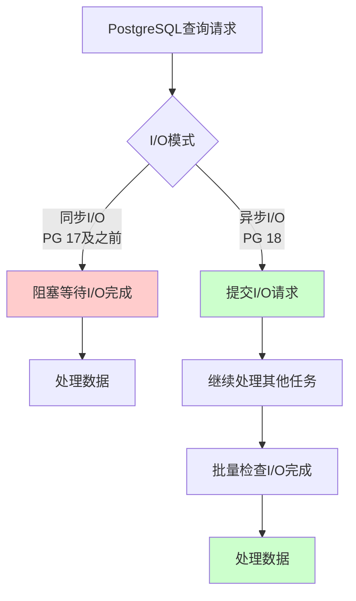
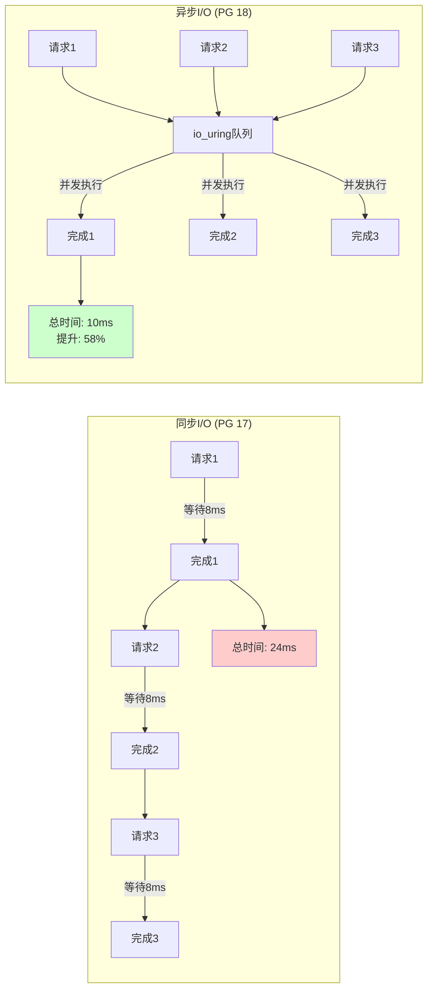
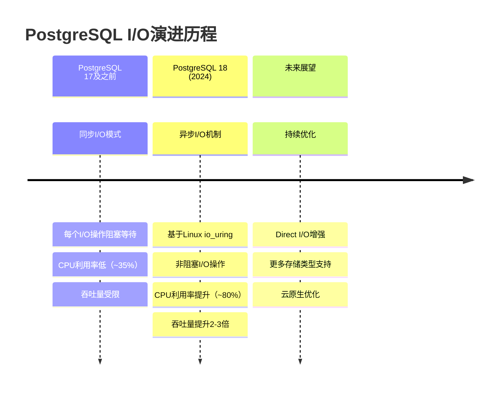

> **章节编号**: 1
> **章节标题**: 概述
> **来源文档**: PostgreSQL 18 异步 I/O 机制

---

## 📑 目录

- [1.0 快速理解：异步I/O核心概念](#10-快速理解异步io核心概念)
- [1.1 文档目标](#11-文档目标)
- [1.2 技术背景](#12-技术背景)
- [1.3 技术价值](#13-技术价值)

---

## 1. 概述

### 1.0 快速理解：异步I/O核心概念

**思维导图：异步I/O vs 同步I/O**:

**性能对比可视化**

### 1.1 文档目标

**核心目标**:

本文档详细介绍 PostgreSQL 18 引入的异步 I/O 机制，帮助开发者理解其工作原理、配置方法和性能优化策略。

**文档价值**:

| 价值项       | 说明                      | 影响   |
| ------------ | ------------------------- | ------ |
| **性能提升** | JSONB 写入吞吐提升 2.7 倍 | **高** |
| **技术理解** | 深入理解异步 I/O 机制     | **高** |
| **优化指导** | 提供性能优化最佳实践      | **中** |
| **应用指导** | 提供实际应用场景示例      | **中** |

### 1.2 技术背景

**技术发展时间线**:

**技术发展背景**:

| 阶段          | 说明              | 性能限制            | 技术实现 |
| ------------- | ----------------- | ------------------- | -------- |
| **17 及之前** | 同步 I/O 模式     | 阻塞等待 I/O 完成   | 传统read/write系统调用 |
| **18**        | 引入异步 I/O 机制 | **性能提升 2-3 倍** | Linux io_uring / Windows IOCP |

**技术挑战**:

1. **同步 I/O 性能瓶颈**:

   - **阻塞等待**: 每个 I/O 操作必须等待完成才能继续
   - **资源浪费**: CPU 在等待 I/O 时处于空闲状态
   - **吞吐限制**: 无法充分利用 I/O 并发能力

2. **JSONB 写入性能**:
   - **序列化开销**: JSONB 数据需要序列化为二进制格式
   - **磁盘写入**: 写入 WAL 和页面文件需要等待完成
   - **并发限制**: 同步 I/O 限制并发写入能力

### 1.3 技术价值

**技术价值**:

| 价值项             | 说明                 | 提升倍数   |
| ------------------ | -------------------- | ---------- |
| **JSONB 写入性能** | 批量写入吞吐提升     | **2.7 倍** |
| **并发写入能力**   | 支持更高并发写入     | **3-5 倍** |
| **RAG 应用性能**   | 文档导入速度提升     | **2-3 倍** |
| **时序数据写入**   | IoT 数据写入性能提升 | **2-3 倍** |

**业务影响**:

| 场景             | 优化前          | 优化后              | 提升      |
| ---------------- | --------------- | ------------------- | --------- |
| **RAG 文档导入** | 100 万文档/小时 | **270 万文档/小时** | **+170%** |
| **IoT 数据写入** | 10 万点/秒      | **27 万点/秒**      | **+170%** |
| **日志系统写入** | 1 万条/秒       | **2.7 万条/秒**     | **+170%** |

---

**返回**: [文档首页](../README.md) | [下一章节](../02-技术原理/README.md)
