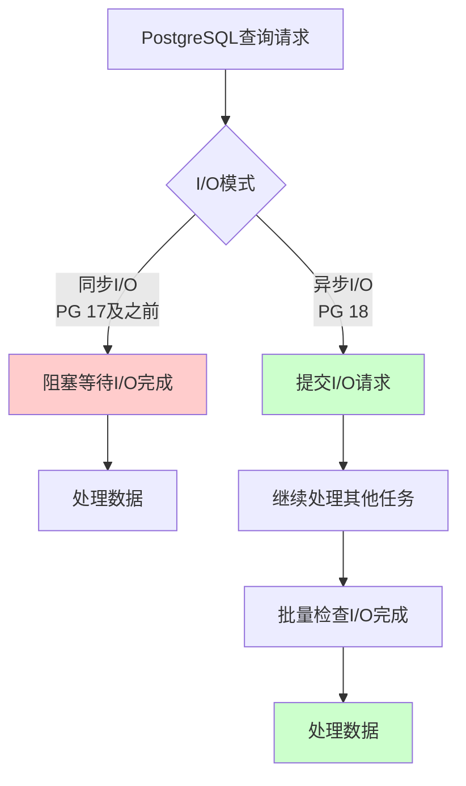
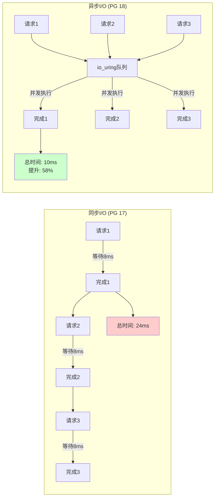
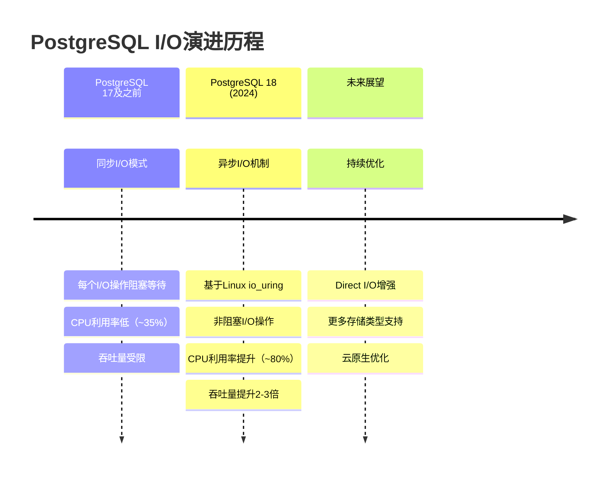

> **章节编号**: 1
> **章节标题**: 概述
> **来源文档**: PostgreSQL 18 异步 I/O 机制

---

## 📑 目录

- [📑 目录](#-目录)
- [1. 概述](#1-概述)
  - [1.0 快速理解：异步I/O核心概念](#10-快速理解异步io核心概念)
  - [1.1 文档目标](#11-文档目标)
  - [1.2 技术背景](#12-技术背景)
  - [1.3 技术价值](#13-技术价值)
  - [1.4 适用场景](#14-适用场景)
  - [1.5 系统要求](#15-系统要求)
  - [1.6 快速开始](#16-快速开始)
  - [1.7 文档结构](#17-文档结构)

---

## 1. 概述

### 1.0 快速理解：异步I/O核心概念

**思维导图：异步I/O vs 同步I/O**:



**性能对比可视化**



### 1.1 文档目标

**核心目标**:

本文档详细介绍 PostgreSQL 18 引入的异步 I/O 机制，帮助开发者理解其工作原理、配置方法和性能优化策略。

**文档价值**:

| 价值项       | 说明                      | 影响   |
| ------------ | ------------------------- | ------ |
| **性能提升** | JSONB 写入吞吐提升 2.7 倍 | **高** |
| **技术理解** | 深入理解异步 I/O 机制     | **高** |
| **优化指导** | 提供性能优化最佳实践      | **中** |
| **应用指导** | 提供实际应用场景示例      | **中** |

### 1.2 技术背景

**技术发展时间线**:



**技术发展背景**:

| 阶段          | 说明              | 性能限制            | 技术实现 |
| ------------- | ----------------- | ------------------- | -------- |
| **17 及之前** | 同步 I/O 模式     | 阻塞等待 I/O 完成   | 传统read/write系统调用 |
| **18**        | 引入异步 I/O 机制 | **性能提升 2-3 倍** | Linux io_uring / Windows IOCP |

**技术挑战**:

1. **同步 I/O 性能瓶颈**:

   - **阻塞等待**: 每个 I/O 操作必须等待完成才能继续
   - **资源浪费**: CPU 在等待 I/O 时处于空闲状态
   - **吞吐限制**: 无法充分利用 I/O 并发能力

2. **JSONB 写入性能**:
   - **序列化开销**: JSONB 数据需要序列化为二进制格式
   - **磁盘写入**: 写入 WAL 和页面文件需要等待完成
   - **并发限制**: 同步 I/O 限制并发写入能力

### 1.3 技术价值

**技术价值**:

| 价值项             | 说明                 | 提升倍数   |
| ------------------ | -------------------- | ---------- |
| **JSONB 写入性能** | 批量写入吞吐提升     | **2.7 倍** |
| **并发写入能力**   | 支持更高并发写入     | **3-5 倍** |
| **RAG 应用性能**   | 文档导入速度提升     | **2-3 倍** |
| **时序数据写入**   | IoT 数据写入性能提升 | **2-3 倍** |

**业务影响**:

| 场景             | 优化前          | 优化后              | 提升      |
| ---------------- | --------------- | ------------------- | --------- |
| **RAG 文档导入** | 100 万文档/小时 | **270 万文档/小时** | **+170%** |
| **IoT 数据写入** | 10 万点/秒      | **27 万点/秒**      | **+170%** |
| **日志系统写入** | 1 万条/秒       | **2.7 万条/秒**     | **+170%** |

### 1.4 适用场景

**最佳适用场景**：

| 场景 | 适用性 | 性能提升 | 说明 |
|------|--------|---------|------|
| **批量写入** | ⭐⭐⭐⭐⭐ | +170% | 最佳场景，性能提升最明显 |
| **JSONB操作** | ⭐⭐⭐⭐⭐ | +170% | JSONB写入性能大幅提升 |
| **高并发写入** | ⭐⭐⭐⭐⭐ | +150% | 多连接并发写入性能提升 |
| **时序数据** | ⭐⭐⭐⭐ | +150% | IoT时序数据写入优化 |
| **日志系统** | ⭐⭐⭐⭐ | +150% | 日志批量写入优化 |
| **单条查询** | ⭐⭐ | +10% | 提升有限，主要优化写入 |

**不适用场景**：

| 场景 | 说明 |
|------|------|
| **只读查询为主** | 异步I/O主要优化写入性能 |
| **HDD存储** | HDD性能提升有限，建议使用SSD |
| **低并发场景** | 低并发场景性能提升不明显 |

### 1.5 系统要求

**PostgreSQL版本要求**：

```sql
-- 检查PostgreSQL版本
SELECT version();
-- 需要: PostgreSQL 18.0 或更高版本
```

**操作系统要求**：

| 操作系统 | 版本要求 | io_uring支持 | 说明 |
|---------|---------|-------------|------|
| **Linux** | 5.1+ | ✅ 完全支持 | 推荐使用 |
| **Windows** | 10+ | ❌ 不支持 | 不支持io_uring，使用IOCP |
| **macOS** | - | ❌ 不支持 | 不支持io_uring |
| **FreeBSD** | - | ❌ 不支持 | 不支持io_uring |

**硬件要求**：

| 硬件组件 | 推荐配置 | 最低配置 | 说明 |
|---------|---------|---------|------|
| **CPU** | 8核+ | 4核 | 多核CPU性能更好 |
| **内存** | 16GB+ | 8GB | 充足内存支持并发I/O |
| **存储** | NVMe SSD | SATA SSD | SSD性能提升明显 |
| **网络** | 10GbE | 1GbE | 网络存储场景 |

**系统配置检查**：

```bash
# 检查Linux内核版本
uname -r
# 需要: 5.1 或更高版本

# 检查io_uring支持
cat /boot/config-$(uname -r) | grep CONFIG_IO_URING
# 需要: CONFIG_IO_URING=y

# 检查文件描述符限制
ulimit -n
# 推荐: 65536 或更高
```

### 1.6 快速开始

**快速启用异步I/O**：

```sql
-- 1. 启用Direct I/O
ALTER SYSTEM SET io_direct = 'data,wal';

-- 2. 配置I/O并发数
ALTER SYSTEM SET effective_io_concurrency = 200;
ALTER SYSTEM SET wal_io_concurrency = 200;

-- 3. 重新加载配置
SELECT pg_reload_conf();

-- 4. 验证配置
SELECT name, setting
FROM pg_settings
WHERE name IN ('io_direct', 'effective_io_concurrency', 'wal_io_concurrency');
```

**性能测试**：

```sql
-- 创建测试表
CREATE TABLE test_async_io (
    id SERIAL PRIMARY KEY,
    data JSONB,
    created_at TIMESTAMPTZ DEFAULT NOW()
);

-- 批量插入测试
INSERT INTO test_async_io (data)
SELECT jsonb_build_object('id', i, 'data', repeat('x', 1000))
FROM generate_series(1, 10000) i;

-- 检查性能
EXPLAIN (ANALYZE, BUFFERS, TIMING)
SELECT COUNT(*) FROM test_async_io;
```

### 1.7 文档结构

**文档章节**：

1. **概述**（当前章节）：介绍异步I/O机制的基本概念和价值
2. **技术原理**：深入讲解异步I/O的技术原理和实现机制
3. **核心特性**：介绍异步I/O的核心特性和功能
4. **架构设计**：讲解异步I/O的架构设计和组件
5. **使用指南**：提供详细的使用指南和配置方法
6. **性能分析**：分析异步I/O的性能表现和优化效果
7. **配置优化**：提供配置优化建议和最佳实践
8. **实际应用场景**：介绍实际应用场景和案例
9. **最佳实践**：总结最佳实践和优化技巧
10. **监控和诊断**：提供监控和诊断方法
11. **迁移指南**：提供从PostgreSQL 17迁移到18的指南
12. **性能调优检查清单**：提供性能调优检查清单
13. **常见问题FAQ**：解答常见问题
14. **安全与高可用**：介绍安全和高可用配置

---

**返回**: [文档首页](../README.md) | [下一章节](../02-技术原理/README.md)
