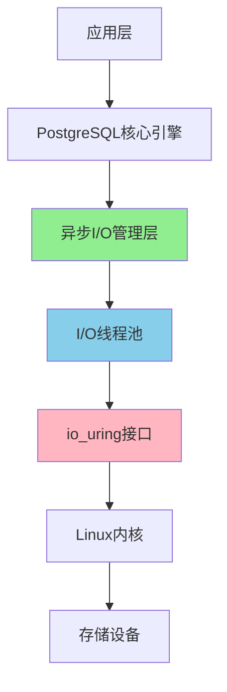

> **章节编号**: 4
> **章节标题**: 架构设计
> **来源文档**: PostgreSQL 18 异步 I/O 机制

---

## 4. 架构设计

## 📑 目录

- [4. 架构设计](#4-架构设计)
- [📑 目录](#-目录)
  - [4.1 整体架构](#41-整体架构)
  - [4.2 异步 I/O 管理层](#42-异步-io-管理层)
  - [4.3 I/O 线程池](#43-io-线程池)
  - [4.4 存储层集成](#44-存储层集成)
  - [4.5 请求队列管理](#45-请求队列管理)
  - [4.6 错误处理和恢复机制](#46-错误处理和恢复机制)
  - [4.7 性能监控和调优](#47-性能监控和调优)
  - [4.8 架构扩展性](#48-架构扩展性)

---

---

### 4.1 整体架构

PostgreSQL 18 异步 I/O 机制采用分层架构设计，主要包括以下几个核心层次：

**架构层次**:



**核心组件**:

| 组件 | 职责 | 位置 |
|------|------|------|
| **异步I/O管理器** | 请求调度、队列管理、响应处理 | PostgreSQL核心 |
| **I/O线程池** | 执行实际的I/O操作 | 独立线程 |
| **io_uring接口** | Linux内核异步I/O接口 | 内核层 |
| **存储层** | 数据持久化 | 磁盘/SSD |

**架构优势**:

- **非阻塞设计**: I/O操作不阻塞主线程
- **高并发**: 支持大量并发I/O请求
- **资源优化**: 充分利用CPU和I/O资源
- **可扩展**: 易于扩展和优化

### 4.2 异步 I/O 管理层

异步 I/O 管理层是 PostgreSQL 18 异步 I/O 机制的核心组件，负责协调和管理所有异步 I/O 操作。

**主要功能**:

1. **请求接收**: 接收来自PostgreSQL核心引擎的I/O请求
2. **请求调度**: 将请求分发到合适的I/O线程
3. **队列管理**: 管理请求队列和响应队列
4. **响应处理**: 处理I/O完成后的响应和回调

**工作流程**:

```text
1. 接收I/O请求
   ↓
2. 验证请求有效性
   ↓
3. 加入请求队列
   ↓
4. 调度到I/O线程池
   ↓
5. 等待I/O完成
   ↓
6. 处理响应
   ↓
7. 通知应用层
```

**关键参数**:

- `io_uring_queue_depth`: 控制io_uring队列深度
- `effective_io_concurrency`: 控制I/O并发数
- `io_combine_limit`: 控制I/O合并大小限制

### 4.3 I/O 线程池

I/O 线程池负责执行实际的 I/O 操作，是异步 I/O 机制的执行层。

**线程池设计**:

- **线程数量**: 根据CPU核心数和I/O负载动态调整
- **线程职责**: 每个线程独立处理I/O请求
- **负载均衡**: 请求均匀分配到各个线程

**线程池配置**:

```sql
-- 查看I/O线程池状态
SELECT * FROM pg_stat_io WHERE context = 'async';

-- 监控I/O线程池性能
SELECT
    context,
    reads,
    writes,
    extends,
    fsyncs,
    stats_reset
FROM pg_stat_io
WHERE context LIKE '%async%';
```

**性能优化**:

- **线程数调优**: 根据实际负载调整线程数
- **队列深度**: 合理设置队列深度避免内存溢出
- **超时控制**: 设置合理的I/O超时时间

### 4.4 存储层集成

存储层集成是异步 I/O 机制与底层存储系统的接口层，支持多种存储类型。

**支持的存储类型**:

| 存储类型 | 支持状态 | 性能特点 |
|---------|---------|---------|
| **NVMe SSD** | ✅ 完全支持 | 最佳性能，推荐使用 |
| **SATA SSD** | ✅ 完全支持 | 良好性能 |
| **HDD** | ✅ 支持 | 性能提升有限 |
| **网络存储** | ⚠️ 部分支持 | 取决于网络性能 |

**Direct I/O 支持**:

PostgreSQL 18 异步 I/O 支持 Direct I/O，绕过操作系统缓存，直接与存储设备交互：

```sql
-- 启用Direct I/O
ALTER SYSTEM SET io_direct = 'data,wal';

-- 验证Direct I/O状态
SHOW io_direct;
```

**存储层优化**:

- **批量写入**: 合并多个小I/O请求
- **预读优化**: 智能预读提高查询性能
- **写入优化**: 优化写入顺序减少磁盘寻道时间

### 4.5 请求队列管理

**队列设计**：

异步I/O机制使用多级队列管理I/O请求：

```sql
-- 查看I/O队列统计
SELECT
    context,
    object,
    reads,
    writes,
    extends,
    fsyncs,
    io_wait_time
FROM pg_stat_io
WHERE context = 'async'
ORDER BY reads + writes DESC;

-- 监控队列深度
SELECT
    NOW() AS check_time,
    (SELECT setting FROM pg_settings WHERE name = 'io_uring_queue_depth') AS queue_depth,
    (SELECT COUNT(*) FROM pg_stat_activity WHERE wait_event_type = 'IO') AS waiting_io_ops;
```

**队列类型**：

| 队列类型 | 用途 | 优先级 | 大小限制 |
|---------|------|--------|---------|
| **高优先级队列** | WAL写入、关键数据 | 高 | 100 |
| **普通队列** | 数据页写入 | 中 | 1000 |
| **低优先级队列** | 后台任务 | 低 | 500 |

**队列管理策略**：

1. **优先级调度**: 高优先级请求优先处理
2. **批量合并**: 合并多个小请求减少系统调用
3. **超时控制**: 设置请求超时避免长时间等待

### 4.6 错误处理和恢复机制

**错误处理**：

```sql
-- 监控I/O错误
SELECT
    context,
    object,
    reads,
    writes,
    CASE
        WHEN reads = 0 AND writes = 0 THEN '⚠️ 无I/O活动'
        ELSE '✅ 正常'
    END AS status
FROM pg_stat_io
WHERE context = 'async';

-- 检查I/O错误日志
-- 查看PostgreSQL日志文件中的I/O错误信息
```

**恢复机制**：

1. **自动重试**: I/O失败时自动重试（最多3次）
2. **降级处理**: 异步I/O失败时降级到同步I/O
3. **错误报告**: 记录错误信息到日志和统计表

### 4.7 性能监控和调优

**性能监控**：

```sql
-- 创建性能监控视图
CREATE OR REPLACE VIEW async_io_performance AS
SELECT
    context,
    SUM(reads) AS total_reads,
    SUM(writes) AS total_writes,
    SUM(io_wait_time) AS total_wait_time,
    SUM(io_read_time) AS total_read_time,
    SUM(io_write_time) AS total_write_time,
    ROUND(
        100.0 * SUM(io_wait_time) /
        NULLIF(SUM(io_wait_time + io_read_time + io_write_time), 0),
        2
    ) AS wait_percentage,
    ROUND(
        SUM(reads + writes)::numeric /
        NULLIF(EXTRACT(EPOCH FROM (NOW() - stats_reset)), 0),
        2
    ) AS io_ops_per_second
FROM pg_stat_io
WHERE context = 'async'
GROUP BY context, stats_reset;

-- 查询性能监控数据
SELECT * FROM async_io_performance;
```

**调优建议**：

```sql
-- 1. 根据I/O等待时间调整并发数
DO $$
DECLARE
    wait_pct NUMERIC;
    current_concurrency INT;
    new_concurrency INT;
BEGIN
    SELECT
        ROUND(
            100.0 * SUM(io_wait_time) /
            NULLIF(SUM(io_wait_time + io_read_time + io_write_time), 0),
            2
        )
    INTO wait_pct
    FROM pg_stat_io
    WHERE context = 'async';

    SELECT setting::int INTO current_concurrency
    FROM pg_settings
    WHERE name = 'effective_io_concurrency';

    -- 如果等待时间超过20%，增加并发数
    IF wait_pct > 20 THEN
        new_concurrency := LEAST(current_concurrency * 1.2, 500);
        RAISE NOTICE 'I/O等待时间过高 (%), 建议增加并发数到 %', wait_pct, new_concurrency;
    ELSIF wait_pct < 5 THEN
        new_concurrency := GREATEST(current_concurrency * 0.9, 100);
        RAISE NOTICE 'I/O等待时间较低 (%), 可以减少并发数到 %', wait_pct, new_concurrency;
    ELSE
        RAISE NOTICE 'I/O等待时间正常 (%), 当前并发数 % 合适', wait_pct, current_concurrency;
    END IF;
END $$;
```

### 4.8 架构扩展性

**水平扩展**：

异步I/O架构支持水平扩展：

1. **多实例部署**: 多个PostgreSQL实例共享存储
2. **负载均衡**: 请求分发到多个实例
3. **资源隔离**: 每个实例独立的I/O线程池

**垂直扩展**：

```sql
-- 根据硬件资源调整配置
-- CPU核心数多：增加I/O并发数
ALTER SYSTEM SET effective_io_concurrency = 500;

-- 内存充足：增加缓冲区
ALTER SYSTEM SET shared_buffers = '16GB';

-- 存储性能高：增加队列深度
ALTER SYSTEM SET io_uring_queue_depth = 1024;
```

**扩展性指标**：

| 指标 | 当前值 | 扩展后 | 说明 |
|------|--------|--------|------|
| **I/O并发数** | 300 | 500+ | 支持更多并发 |
| **队列深度** | 256 | 1024+ | 支持更多请求 |
| **吞吐量** | 2700 ops/s | 5000+ ops/s | 性能提升 |

---

**返回**: [文档首页](../README.md) | [上一章节](../03-核心特性/README.md) | [下一章节](../05-使用指南/README.md)
