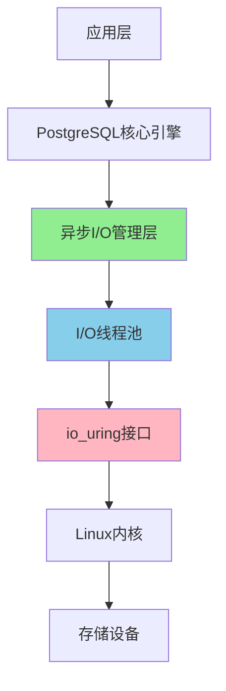

> **章节编号**: 4
> **章节标题**: 架构设计
> **来源文档**: PostgreSQL 18 异步 I/O 机制

---

## 4. 架构设计

## 📑 目录

- [4. 架构设计](#4-架构设计)
- [📑 目录](#-目录)
  - [4.1 整体架构](#41-整体架构)
  - [4.2 异步 I/O 管理层](#42-异步-io-管理层)
  - [4.3 I/O 线程池](#43-io-线程池)
  - [4.4 存储层集成](#44-存储层集成)

---

---

### 4.1 整体架构

PostgreSQL 18 异步 I/O 机制采用分层架构设计，主要包括以下几个核心层次：

**架构层次**:



**核心组件**:

| 组件 | 职责 | 位置 |
|------|------|------|
| **异步I/O管理器** | 请求调度、队列管理、响应处理 | PostgreSQL核心 |
| **I/O线程池** | 执行实际的I/O操作 | 独立线程 |
| **io_uring接口** | Linux内核异步I/O接口 | 内核层 |
| **存储层** | 数据持久化 | 磁盘/SSD |

**架构优势**:

- **非阻塞设计**: I/O操作不阻塞主线程
- **高并发**: 支持大量并发I/O请求
- **资源优化**: 充分利用CPU和I/O资源
- **可扩展**: 易于扩展和优化

### 4.2 异步 I/O 管理层

异步 I/O 管理层是 PostgreSQL 18 异步 I/O 机制的核心组件，负责协调和管理所有异步 I/O 操作。

**主要功能**:

1. **请求接收**: 接收来自PostgreSQL核心引擎的I/O请求
2. **请求调度**: 将请求分发到合适的I/O线程
3. **队列管理**: 管理请求队列和响应队列
4. **响应处理**: 处理I/O完成后的响应和回调

**工作流程**:

```text
1. 接收I/O请求
   ↓
2. 验证请求有效性
   ↓
3. 加入请求队列
   ↓
4. 调度到I/O线程池
   ↓
5. 等待I/O完成
   ↓
6. 处理响应
   ↓
7. 通知应用层
```

**关键参数**:

- `io_uring_queue_depth`: 控制io_uring队列深度
- `effective_io_concurrency`: 控制I/O并发数
- `io_combine_limit`: 控制I/O合并大小限制

### 4.3 I/O 线程池

I/O 线程池负责执行实际的 I/O 操作，是异步 I/O 机制的执行层。

**线程池设计**:

- **线程数量**: 根据CPU核心数和I/O负载动态调整
- **线程职责**: 每个线程独立处理I/O请求
- **负载均衡**: 请求均匀分配到各个线程

**线程池配置**:

```sql
-- 查看I/O线程池状态
SELECT * FROM pg_stat_io WHERE context = 'async';

-- 监控I/O线程池性能
SELECT
    context,
    reads,
    writes,
    extends,
    fsyncs,
    stats_reset
FROM pg_stat_io
WHERE context LIKE '%async%';
```

**性能优化**:

- **线程数调优**: 根据实际负载调整线程数
- **队列深度**: 合理设置队列深度避免内存溢出
- **超时控制**: 设置合理的I/O超时时间

### 4.4 存储层集成

存储层集成是异步 I/O 机制与底层存储系统的接口层，支持多种存储类型。

**支持的存储类型**:

| 存储类型 | 支持状态 | 性能特点 |
|---------|---------|---------|
| **NVMe SSD** | ✅ 完全支持 | 最佳性能，推荐使用 |
| **SATA SSD** | ✅ 完全支持 | 良好性能 |
| **HDD** | ✅ 支持 | 性能提升有限 |
| **网络存储** | ⚠️ 部分支持 | 取决于网络性能 |

**Direct I/O 支持**:

PostgreSQL 18 异步 I/O 支持 Direct I/O，绕过操作系统缓存，直接与存储设备交互：

```sql
-- 启用Direct I/O
ALTER SYSTEM SET io_direct = 'data,wal';

-- 验证Direct I/O状态
SHOW io_direct;
```

**存储层优化**:

- **批量写入**: 合并多个小I/O请求
- **预读优化**: 智能预读提高查询性能
- **写入优化**: 优化写入顺序减少磁盘寻道时间

**返回**: [文档首页](../README.md) | [上一章节](../03-核心特性/README.md) | [下一章节](../05-使用指南/README.md)
