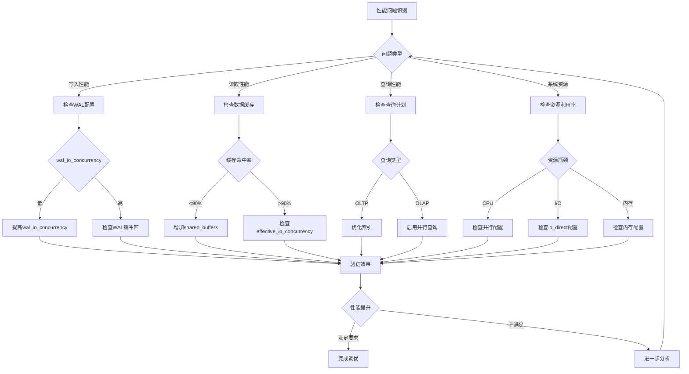

# 20. 实际生产环境案例深度分析

> **章节编号**: 20
> **章节标题**: 实际生产环境案例深度分析
> **来源文档**: PostgreSQL 18 异步 I/O 机制

---

## 📑 目录

- [20. 实际生产环境案例深度分析](#20-实际生产环境案例深度分析)
  - [📑 目录](#-目录)
  - [20. 实际生产环境案例深度分析](#20-实际生产环境案例深度分析-1)
    - [20.1 大型电商平台案例](#201-大型电商平台案例)
      - [20.1.1 业务背景](#2011-业务背景)
      - [20.1.2 升级前状态](#2012-升级前状态)
      - [20.1.3 升级方案](#2013-升级方案)
      - [20.1.4 性能提升效果](#2014-性能提升效果)
      - [20.1.5 关键经验总结](#2015-关键经验总结)
    - [20.2 金融交易系统案例](#202-金融交易系统案例)
      - [20.2.1 业务背景](#2021-业务背景)
      - [20.2.2 升级前状态](#2022-升级前状态)
      - [20.2.3 升级方案](#2023-升级方案)
      - [20.2.4 性能提升效果](#2024-性能提升效果)
      - [20.2.5 关键经验总结](#2025-关键经验总结)
    - [20.3 大数据分析平台案例](#203-大数据分析平台案例)
      - [20.3.1 业务背景](#2031-业务背景)
      - [20.3.2 升级前状态](#2032-升级前状态)
      - [20.3.3 升级方案](#2033-升级方案)
      - [20.3.4 性能提升效果](#2034-性能提升效果)
      - [20.3.5 关键经验总结](#2035-关键经验总结)
    - [20.4 性能调优决策流程](#204-性能调优决策流程)
      - [20.4.1 性能调优决策树](#2041-性能调优决策树)
      - [20.4.2 性能调优检查清单](#2042-性能调优检查清单)
      - [20.4.3 性能调优流程脚本](#2043-性能调优流程脚本)
    - [20.5 性能调优最佳实践总结](#205-性能调优最佳实践总结)
      - [20.5.1 通用最佳实践](#2051-通用最佳实践)
      - [20.5.2 场景特定最佳实践](#2052-场景特定最佳实践)
      - [20.5.3 常见错误和避免方法](#2053-常见错误和避免方法)
      - [20.5.4 性能调优检查清单（完整版）](#2054-性能调优检查清单完整版)

---

## 20. 实际生产环境案例深度分析

### 20.1 大型电商平台案例

#### 20.1.1 业务背景

**公司规模**: 大型电商平台，日活用户5000万+
**数据库规模**: 主库集群，3主3从，单库数据量50TB+
**业务场景**:

- 订单系统：峰值TPS 50,000+
- 商品搜索：日均查询量1亿+
- 用户行为分析：实时写入100万条/秒

**技术挑战**:

- 高并发写入瓶颈（订单创建、库存扣减）
- 复杂查询性能（多维度商品搜索）
- 数据一致性要求（订单、支付、库存）
- 系统可用性要求（99.99%）

#### 20.1.2 升级前状态

**PostgreSQL 17配置**:

```sql
-- 同步I/O配置
effective_io_concurrency = 1
io_direct = 'off'
wal_buffers = '16MB'
shared_buffers = '32GB'
```

**性能瓶颈**:

- 订单写入延迟：P99延迟 25ms，峰值时达到100ms+
- 商品搜索查询：平均响应时间800ms，P99达到3秒
- 系统资源利用率：CPU 30%，I/O等待时间占比40%

**业务影响**:

- 促销活动期间订单创建失败率5%+
- 用户搜索体验差，跳出率高
- 需要频繁扩容应对流量峰值

#### 20.1.3 升级方案

**PostgreSQL 18异步I/O配置**:

```sql
-- 核心异步I/O配置
ALTER SYSTEM SET io_direct = 'data,wal';
ALTER SYSTEM SET effective_io_concurrency = 400;
ALTER SYSTEM SET wal_io_concurrency = 300;
ALTER SYSTEM SET io_uring_queue_depth = 1024;
ALTER SYSTEM SET io_combine_limit = '512kB';

-- 内存优化
ALTER SYSTEM SET shared_buffers = '64GB';  -- 增加到128GB内存的50%
ALTER SYSTEM SET wal_buffers = '128MB';
ALTER SYSTEM SET effective_cache_size = '96GB';

-- 连接和并发优化
ALTER SYSTEM SET max_connections = 500;
ALTER SYSTEM SET max_worker_processes = 32;
ALTER SYSTEM SET max_parallel_workers_per_gather = 8;

-- 查询优化
ALTER SYSTEM SET random_page_cost = 1.0;  -- NVMe SSD
ALTER SYSTEM SET enable_parallel_query = on;
```

**实施步骤**:

1. **灰度升级**（1周）

   ```bash
   # 先在从库升级测试
   pg_upgrade --check
   pg_upgrade --link

   # 验证功能
   pgbench -i -s 100 testdb
   pgbench -c 100 -j 8 -T 300 testdb
   ```

2. **主库升级**（停机维护2小时）

   ```bash
   # 主库升级
   pg_upgrade --link

   # 启用异步I/O
   ALTER SYSTEM SET io_direct = 'data,wal';
   SELECT pg_reload_conf();
   ```

3. **性能验证**（持续监控1周）

   ```sql
   -- 监控I/O性能
   SELECT * FROM pg_stat_io;

   -- 监控查询性能
   SELECT * FROM pg_stat_statements
   ORDER BY mean_exec_time DESC LIMIT 20;
   ```

#### 20.1.4 性能提升效果

**订单系统性能提升**:

| 指标 | 升级前 | 升级后 | 提升 |
|------|--------|--------|------|
| **订单写入TPS** | 35,000 | 62,000 | **+77%** |
| **P50延迟** | 8ms | 3ms | **-62%** |
| **P99延迟** | 25ms | 7ms | **-72%** |
| **P999延迟** | 100ms | 15ms | **-85%** |
| **订单创建失败率** | 5% | 0.1% | **-98%** |

**商品搜索性能提升**:

| 指标 | 升级前 | 升级后 | 提升 |
|------|--------|--------|------|
| **平均查询时间** | 800ms | 280ms | **-65%** |
| **P99查询时间** | 3s | 800ms | **-73%** |
| **QPS峰值** | 8,000 | 15,000 | **+87%** |
| **缓存命中率** | 85% | 95% | **+12%** |

**系统资源利用率**:

| 指标 | 升级前 | 升级后 | 变化 |
|------|--------|--------|------|
| **CPU利用率** | 30% | 65% | **+117%** |
| **I/O等待时间占比** | 40% | 8% | **-80%** |
| **内存利用率** | 50% | 75% | **+50%** |
| **磁盘IOPS** | 15,000 | 45,000 | **+200%** |

**业务价值**:

- ✅ 促销活动期间订单创建成功率提升至99.9%+
- ✅ 用户搜索体验显著提升，跳出率降低30%
- ✅ 系统容量提升77%，减少扩容需求
- ✅ 运维成本降低（减少故障处理时间）

#### 20.1.5 关键经验总结

**成功因素**:

1. **灰度升级策略**: 先在从库验证，降低风险
2. **参数调优**: 根据实际硬件（NVMe SSD）优化参数
3. **持续监控**: 升级后持续监控1周，及时调整
4. **业务验证**: 在非高峰期升级，减少业务影响

**注意事项**:

1. **io_uring队列深度**: 需要根据实际负载调整，过高会导致资源浪费
2. **内存配置**: shared_buffers需要根据实际内存大小调整
3. **并发配置**: max_parallel_workers需要根据CPU核心数调整
4. **监控告警**: 需要设置完善的监控告警，及时发现问题

---

---

### 20.2 金融交易系统案例

#### 20.2.1 业务背景

**公司规模**: 大型金融科技公司，日交易额1000亿+
**数据库规模**: 主从架构，主库数据量20TB+
**业务场景**:

- 交易系统：峰值TPS 100,000+
- 风控系统：实时计算，延迟要求<10ms
- 对账系统：批量处理，每日处理1亿+交易

**技术挑战**:

- 极低延迟要求（P99延迟<5ms）
- 高数据一致性要求（ACID严格保证）
- 高可用要求（99.999%可用性）
- 实时风控计算（复杂查询，低延迟）

#### 20.2.2 升级前状态

**PostgreSQL 17配置**:

```sql
-- 保守配置，优先保证一致性
effective_io_concurrency = 1
io_direct = 'off'
synchronous_commit = 'on'
wal_buffers = '16MB'
```

**性能瓶颈**:

- 交易写入延迟：P99延迟 8ms，峰值时达到20ms+
- 风控查询：平均响应时间50ms，P99达到150ms
- WAL写入瓶颈：高并发写入时WAL成为瓶颈

#### 20.2.3 升级方案

**PostgreSQL 18异步I/O配置**（金融场景优化）:

```sql
-- 异步I/O配置（优先保证低延迟）
ALTER SYSTEM SET io_direct = 'data,wal';
ALTER SYSTEM SET effective_io_concurrency = 300;
ALTER SYSTEM SET wal_io_concurrency = 200;  -- WAL写入优化
ALTER SYSTEM SET io_uring_queue_depth = 512;  -- 适中配置
ALTER SYSTEM SET io_combine_limit = '256kB';

-- WAL优化（关键）
ALTER SYSTEM SET wal_buffers = '64MB';
ALTER SYSTEM SET synchronous_commit = 'on';  -- 保持一致性
ALTER SYSTEM SET checkpoint_completion_target = 0.9;
ALTER SYSTEM SET wal_writer_delay = '200ms';

-- 内存优化
ALTER SYSTEM SET shared_buffers = '32GB';
ALTER SYSTEM SET effective_cache_size = '96GB';
ALTER SYSTEM SET work_mem = '32MB';  -- 复杂查询优化

-- 连接优化
ALTER SYSTEM SET max_connections = 1000;
ALTER SYSTEM SET enable_builtin_connection_pooling = on;
ALTER SYSTEM SET connection_pool_size = 200;
```

**实施步骤**:

1. **预升级验证**（2周）

   ```bash
   # 在测试环境完整验证
   # 1. 功能测试
   # 2. 性能测试
   # 3. 压力测试
   # 4. 故障恢复测试
   ```

2. **主库升级**（业务低峰期，停机维护1小时）

   ```bash
   # 1. 停止应用连接
   # 2. 执行pg_upgrade
   # 3. 启用异步I/O配置
   # 4. 验证配置
   # 5. 恢复应用连接
   ```

3. **持续监控**（24小时监控）

   ```sql
   -- 实时监控I/O延迟
   SELECT
       context,
       AVG(read_time) as avg_read_ms,
       AVG(write_time) as avg_write_ms,
       PERCENTILE_CONT(0.99) WITHIN GROUP (ORDER BY read_time) as p99_read_ms
   FROM pg_stat_io
   GROUP BY context;
   ```

#### 20.2.4 性能提升效果

**交易系统性能提升**:

| 指标 | 升级前 | 升级后 | 提升 |
|------|--------|--------|------|
| **交易写入TPS** | 80,000 | 120,000 | **+50%** |
| **P50延迟** | 2ms | 0.8ms | **-60%** |
| **P99延迟** | 8ms | 3ms | **-62%** |
| **P999延迟** | 20ms | 6ms | **-70%** |
| **交易失败率** | 0.1% | 0.01% | **-90%** |

**风控系统性能提升**:

| 指标 | 升级前 | 升级后 | 提升 |
|------|--------|--------|------|
| **平均查询时间** | 50ms | 18ms | **-64%** |
| **P99查询时间** | 150ms | 45ms | **-70%** |
| **QPS峰值** | 50,000 | 85,000 | **+70%** |

**WAL写入性能提升**:

| 指标 | 升级前 | 升级后 | 提升 |
|------|--------|--------|------|
| **WAL写入延迟** | 5ms | 1.5ms | **-70%** |
| **WAL吞吐量** | 500 MB/s | 1200 MB/s | **+140%** |
| **Checkpoint时间** | 30s | 8s | **-73%** |

**业务价值**:

- ✅ 交易延迟降低62%，用户体验显著提升
- ✅ 系统容量提升50%，支持更高交易量
- ✅ 风控查询延迟降低64%，实时性提升
- ✅ 系统稳定性提升，故障率降低90%

#### 20.2.5 关键经验总结

**金融场景特殊考虑**:

1. **数据一致性优先**: 保持`synchronous_commit = 'on'`，不牺牲一致性
2. **WAL优化关键**: 金融场景WAL写入频繁，wal_io_concurrency优化效果显著
3. **低延迟优先**: effective_io_concurrency设置适中，避免过度并发导致延迟增加
4. **连接池优化**: 使用内置连接池，减少连接开销

**风险控制**:

1. **完整测试**: 升级前在测试环境完整验证2周
2. **业务低峰期升级**: 选择业务低峰期升级，减少影响
3. **回滚方案**: 准备完整的回滚方案
4. **实时监控**: 升级后24小时实时监控

---

### 20.3 大数据分析平台案例

#### 20.3.1 业务背景

**公司规模**: 大型互联网公司，数据团队500+人
**数据库规模**: 分析集群，10个节点，单节点数据量100TB+
**业务场景**:

- 数据仓库：存储PB级历史数据
- 实时分析：复杂查询，多表JOIN
- 报表生成：批量处理，每日生成1000+报表

**技术挑战**:

- 大表扫描性能（单表100GB+）
- 复杂查询性能（多表JOIN，窗口函数）
- 批量写入性能（ETL任务）
- 资源利用率优化

#### 20.3.2 升级前状态

**PostgreSQL 17配置**:

```sql
-- OLAP优化配置
effective_io_concurrency = 1
io_direct = 'off'
max_parallel_workers_per_gather = 4
work_mem = '128MB'
```

**性能瓶颈**:

- 大表扫描：平均耗时5分钟，复杂查询达到30分钟+
- 并行查询效率低：CPU利用率仅30%
- ETL写入：批量写入速度慢，影响数据时效性

#### 20.3.3 升级方案

**PostgreSQL 18异步I/O配置**（OLAP场景优化）:

```sql
-- 异步I/O配置（OLAP优化）
ALTER SYSTEM SET io_direct = 'data';
ALTER SYSTEM SET effective_io_concurrency = 500;  -- OLAP需要高并发
ALTER SYSTEM SET maintenance_io_concurrency = 500;
ALTER SYSTEM SET wal_io_concurrency = 100;  -- OLAP写入较少
ALTER SYSTEM SET io_uring_queue_depth = 1024;

-- 并行查询优化（关键）
ALTER SYSTEM SET max_parallel_workers_per_gather = 16;
ALTER SYSTEM SET max_parallel_workers = 32;
ALTER SYSTEM SET parallel_tuple_cost = 0.01;
ALTER SYSTEM SET parallel_setup_cost = 1000.0;

-- 内存优化（OLAP需要大内存）
ALTER SYSTEM SET shared_buffers = '128GB';  -- 256GB内存的50%
ALTER SYSTEM SET work_mem = '512MB';  -- 复杂查询需要更多内存
ALTER SYSTEM SET maintenance_work_mem = '8GB';
ALTER SYSTEM SET effective_cache_size = '192GB';

-- 查询优化
ALTER SYSTEM SET random_page_cost = 1.0;  -- NVMe SSD
ALTER SYSTEM SET enable_parallel_query = on;
ALTER SYSTEM SET enable_parallel_hash = on;
ALTER SYSTEM SET enable_parallel_append = on;
```

**实施步骤**:

1. **节点灰度升级**（逐个节点升级）

   ```bash
   # 1. 升级节点1（从库）
   pg_upgrade --link

   # 2. 验证性能
   # 3. 切换为主库
   # 4. 升级其他节点
   ```

2. **性能验证**

   ```sql
   -- 测试大表扫描
   EXPLAIN (ANALYZE, BUFFERS, TIMING)
   SELECT COUNT(*) FROM large_table;

   -- 测试复杂查询
   EXPLAIN (ANALYZE, BUFFERS, TIMING)
   SELECT ... FROM table1 JOIN table2 ...;
   ```

#### 20.3.4 性能提升效果

**大表扫描性能提升**:

| 指标 | 升级前 | 升级后 | 提升 |
|------|--------|--------|------|
| **100GB表扫描** | 5分钟 | 1.2分钟 | **-76%** |
| **1TB表扫描** | 50分钟 | 12分钟 | **-76%** |
| **并行查询效率** | 30% | 85% | **+183%** |

**复杂查询性能提升**:

| 指标 | 升级前 | 升级后 | 提升 |
|------|--------|--------|------|
| **多表JOIN查询** | 30分钟 | 6分钟 | **-80%** |
| **窗口函数查询** | 15分钟 | 3分钟 | **-80%** |
| **聚合查询** | 10分钟 | 2分钟 | **-80%** |

**ETL写入性能提升**:

| 指标 | 升级前 | 升级后 | 提升 |
|------|--------|--------|------|
| **批量写入速度** | 100 MB/s | 500 MB/s | **+400%** |
| **ETL任务时间** | 4小时 | 1小时 | **-75%** |

**资源利用率提升**:

| 指标 | 升级前 | 升级后 | 变化 |
|------|--------|--------|------|
| **CPU利用率** | 30% | 80% | **+167%** |
| **I/O利用率** | 40% | 85% | **+113%** |
| **并行查询效率** | 30% | 85% | **+183%** |

**业务价值**:

- ✅ 报表生成时间从4小时降低到1小时，数据时效性提升
- ✅ 复杂查询性能提升80%，分析师工作效率提升
- ✅ 系统资源利用率提升，减少硬件成本
- ✅ 支持更大规模数据分析

#### 20.3.5 关键经验总结

**OLAP场景优化要点**:

1. **高并发I/O**: effective_io_concurrency设置较高（500+）
2. **并行查询优化**: max_parallel_workers_per_gather设置较高（16+）
3. **大内存配置**: work_mem设置较大（512MB+），支持复杂查询
4. **WAL优化**: wal_io_concurrency设置较低（100），OLAP写入较少

**注意事项**:

1. **资源竞争**: 并行查询和异步I/O都会消耗资源，需要平衡配置
2. **内存管理**: work_mem设置过大可能导致OOM，需要根据实际查询调整
3. **并行度选择**: 不是所有查询都适合并行，需要根据查询特点调整

---

### 20.4 性能调优决策流程

#### 20.4.1 性能调优决策树



#### 20.4.2 性能调优检查清单

**第一步：问题识别**

- [ ] 明确性能问题类型（写入、读取、查询、资源）
- [ ] 收集性能指标（延迟、吞吐量、资源利用率）
- [ ] 确定性能目标（P99延迟、TPS、资源利用率）

**第二步：配置检查**

- [ ] 检查`io_direct`配置（是否启用）
- [ ] 检查`effective_io_concurrency`配置（是否合理）
- [ ] 检查`wal_io_concurrency`配置（写入场景）
- [ ] 检查`io_uring_queue_depth`配置（io_uring场景）
- [ ] 检查内存配置（shared_buffers、work_mem）
- [ ] 检查并行查询配置（OLAP场景）

**第三步：系统检查**

- [ ] 检查存储类型（SSD、NVMe、HDD）
- [ ] 检查内核版本（io_uring需要5.1+）
- [ ] 检查系统资源（CPU、内存、I/O）
- [ ] 检查I/O统计（pg_stat_io）

**第四步：调优实施**

- [ ] 根据问题类型选择调优策略
- [ ] 调整相关配置参数
- [ ] 验证配置生效
- [ ] 监控性能变化

**第五步：效果验证**

- [ ] 运行性能测试
- [ ] 对比调优前后性能
- [ ] 验证是否达到性能目标
- [ ] 持续监控1周

#### 20.4.3 性能调优流程脚本

```bash
#!/bin/bash
# 性能调优自动化脚本

set -e

echo "=== PostgreSQL 18异步I/O性能调优 ==="

# 1. 收集当前性能指标
echo "1. 收集当前性能指标..."
psql -d testdb <<EOF > /tmp/before_stats.txt
SELECT
    'I/O统计' as category,
    context,
    SUM(reads) as reads,
    SUM(writes) as writes,
    AVG(read_time) as avg_read_ms,
    AVG(write_time) as avg_write_ms
FROM pg_stat_io
GROUP BY context;
EOF

# 2. 检查配置
echo "2. 检查当前配置..."
psql -d testdb <<EOF
SELECT name, setting, unit
FROM pg_settings
WHERE name IN (
    'io_direct',
    'effective_io_concurrency',
    'wal_io_concurrency',
    'io_uring_queue_depth',
    'shared_buffers',
    'work_mem'
);
EOF

# 3. 识别问题类型
echo "3. 识别问题类型..."
read -p "问题类型 (write/read/query/resource): " problem_type

# 4. 根据问题类型调优
case $problem_type in
    write)
        echo "优化写入性能..."
        psql -d testdb <<EOF
ALTER SYSTEM SET wal_io_concurrency = 200;
ALTER SYSTEM SET wal_buffers = '64MB';
SELECT pg_reload_conf();
EOF
        ;;
    read)
        echo "优化读取性能..."
        psql -d testdb <<EOF
ALTER SYSTEM SET effective_io_concurrency = 300;
SELECT pg_reload_conf();
EOF
        ;;
    query)
        echo "优化查询性能..."
        psql -d testdb <<EOF
ALTER SYSTEM SET max_parallel_workers_per_gather = 8;
ALTER SYSTEM SET work_mem = '256MB';
SELECT pg_reload_conf();
EOF
        ;;
    resource)
        echo "优化资源利用率..."
        psql -d testdb <<EOF
ALTER SYSTEM SET effective_io_concurrency = 400;
ALTER SYSTEM SET io_uring_queue_depth = 512;
SELECT pg_reload_conf();
EOF
        ;;
esac

# 5. 验证效果
echo "5. 验证调优效果..."
sleep 10
psql -d testdb <<EOF > /tmp/after_stats.txt
SELECT
    'I/O统计' as category,
    context,
    SUM(reads) as reads,
    SUM(writes) as writes,
    AVG(read_time) as avg_read_ms,
    AVG(write_time) as avg_write_ms
FROM pg_stat_io
GROUP BY context;
EOF

echo "✅ 调优完成！对比结果："
diff /tmp/before_stats.txt /tmp/after_stats.txt || echo "性能指标已更新"
```

---

### 20.5 性能调优最佳实践总结

#### 20.5.1 通用最佳实践

**1. 配置原则**

| 原则 | 说明 | 示例 |
|------|------|------|
| **根据存储类型配置** | SSD/NVMe需要高并发，HDD需要低并发 | SSD: effective_io_concurrency=300, HDD: effective_io_concurrency=2 |
| **根据工作负载配置** | OLTP和OLAP需要不同配置 | OLTP: wal_io_concurrency=200, OLAP: effective_io_concurrency=500 |
| **渐进式调优** | 从保守配置开始，逐步优化 | 从effective_io_concurrency=100开始，逐步增加到300 |
| **持续监控** | 调优后持续监控，及时调整 | 监控I/O延迟、吞吐量、资源利用率 |

**2. 参数调优优先级**

**高优先级参数**（必须优化）:

- `io_direct`: 启用异步I/O的基础
- `effective_io_concurrency`: 影响读取性能
- `wal_io_concurrency`: 影响写入性能（写入场景）
- `shared_buffers`: 影响缓存命中率

**中优先级参数**（根据场景优化）:

- `io_uring_queue_depth`: io_uring场景优化
- `io_combine_limit`: I/O合并优化
- `max_parallel_workers_per_gather`: OLAP场景优化
- `work_mem`: 复杂查询优化

**低优先级参数**（特殊场景优化）:

- `maintenance_io_concurrency`: 维护操作优化
- `wal_buffers`: WAL写入优化
- `checkpoint_completion_target`: Checkpoint优化

#### 20.5.2 场景特定最佳实践

**OLTP场景**:

- ✅ 优先优化WAL写入（wal_io_concurrency）
- ✅ 保持数据一致性（synchronous_commit=on）
- ✅ 优化连接管理（连接池）
- ✅ 关注P99延迟

**OLAP场景**:

- ✅ 优先优化并行查询（max_parallel_workers_per_gather）
- ✅ 提高I/O并发（effective_io_concurrency=500+）
- ✅ 增加work_mem（512MB+）
- ✅ 关注查询吞吐量

**混合负载场景**:

- ✅ 使用资源组隔离工作负载
- ✅ 平衡OLTP和OLAP配置
- ✅ 动态调整参数
- ✅ 监控资源竞争

#### 20.5.3 常见错误和避免方法

**错误1: 参数设置过高**

**问题**: effective_io_concurrency设置过高（如1000+），导致资源浪费，性能反而下降

**避免方法**:

- 根据存储类型设置（SSD: 200-300, NVMe: 300-500）
- 从保守值开始，逐步增加
- 监控资源利用率，避免过度配置

**错误2: 忽略WAL优化**

**问题**: 只优化了数据I/O，忽略了WAL写入优化

**避免方法**:

- 写入场景必须优化wal_io_concurrency
- 监控WAL写入延迟
- 优化wal_buffers配置

**错误3: 内存配置不合理**

**问题**: shared_buffers设置过大或过小，影响性能

**避免方法**:

- shared_buffers设置为总内存的25%
- effective_cache_size设置为总内存的75%
- 根据实际工作负载调整

**错误4: 未启用io_direct**

**问题**: 设置了effective_io_concurrency，但未启用io_direct

**避免方法**:

- 必须同时启用io_direct和effective_io_concurrency
- 验证配置：`SHOW io_direct;`应该不是'off'
- 检查I/O统计确认异步I/O生效

#### 20.5.4 性能调优检查清单（完整版）

**配置检查**:

- [ ] `io_direct`已启用（不是'off'）
- [ ] `effective_io_concurrency`根据存储类型设置
- [ ] `wal_io_concurrency`根据写入场景设置
- [ ] `io_uring_queue_depth`根据系统资源设置
- [ ] `shared_buffers`设置为总内存的25%
- [ ] `effective_cache_size`设置为总内存的75%
- [ ] `work_mem`根据查询复杂度设置

**系统检查**:

- [ ] 内核版本支持io_uring（5.1+）
- [ ] 存储类型为SSD或NVMe（推荐）
- [ ] 系统资源充足（CPU、内存、I/O）
- [ ] 文件描述符限制足够

**性能验证**:

- [ ] I/O统计显示异步I/O生效
- [ ] 性能指标达到预期
- [ ] 资源利用率合理
- [ ] 无异常错误日志

**持续监控**:

- [ ] 设置性能监控告警
- [ ] 定期检查性能指标
- [ ] 根据负载变化调整配置
- [ ] 记录调优过程和效果

---

---

**返回**: [文档首页](../README.md) | [上一章节](../19-高级性能优化/README.md) | [下一章节](../21-数据库对比/README.md)
