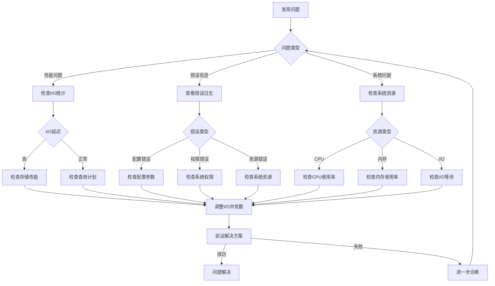

# 25. 快速参考指南

> **章节编号**: 25
> **章节标题**: 快速参考指南
> **来源文档**: PostgreSQL 18 异步 I/O 机制

---

## 25. 快速参考指南

## 📑 目录

- [25.2 常用命令速查表](#252-常用命令速查表)
- [25.3 常见错误代码和解决方案](#253-常见错误代码和解决方案)
- [25.4 性能指标参考值](#254-性能指标参考值)
- [25.5 故障排查快速指南](#255-故障排查快速指南)

---

---

### 25.2 常用命令速查表

#### 25.2.1 配置检查命令

```sql
-- 检查异步I/O配置
SELECT name, setting, unit, source
FROM pg_settings
WHERE name IN (
    'io_direct',
    'effective_io_concurrency',
    'wal_io_concurrency',
    'io_uring_queue_depth'
)
ORDER BY name;

-- 检查I/O统计
SELECT
    context,
    object,
    reads,
    writes,
    read_time,
    write_time
FROM pg_stat_io
ORDER BY reads + writes DESC
LIMIT 10;

-- 检查数据库I/O性能
SELECT
    datname,
    blk_read_time,
    blk_write_time,
    blks_read,
    blks_hit,
    CASE
        WHEN blks_read + blks_hit > 0
        THEN ROUND(100.0 * blks_hit / (blks_read + blks_hit), 2)
        ELSE 0
    END as cache_hit_ratio
FROM pg_stat_database
WHERE datname = current_database();
```

#### 25.2.2 性能监控命令

```sql
-- 查看I/O延迟统计
SELECT
    context,
    AVG(read_time) as avg_read_ms,
    AVG(write_time) as avg_write_ms,
    PERCENTILE_CONT(0.99) WITHIN GROUP (ORDER BY read_time) as p99_read_ms,
    PERCENTILE_CONT(0.99) WITHIN GROUP (ORDER BY write_time) as p99_write_ms
FROM pg_stat_io
GROUP BY context;

-- 查看慢查询（I/O相关）
SELECT
    query,
    calls,
    mean_exec_time,
    blk_read_time,
    blk_write_time
FROM pg_stat_statements
WHERE blk_read_time + blk_write_time > 1000
ORDER BY blk_read_time + blk_write_time DESC
LIMIT 20;

-- 查看表I/O统计
SELECT
    schemaname,
    tablename,
    seq_scan,
    seq_tup_read,
    idx_scan,
    heap_blks_read,
    heap_blks_hit
FROM pg_stat_user_tables
ORDER BY seq_scan DESC
LIMIT 10;
```

#### 25.2.3 系统检查命令

```bash
# 检查内核版本（需要5.1+）
uname -r

# 检查io_uring支持
grep CONFIG_IO_URING /boot/config-$(uname -r)

# 检查系统I/O统计
iostat -x 1 5

# 检查文件描述符限制
ulimit -n

# 检查PostgreSQL进程I/O
pidstat -d -p $(pgrep -f postgres) 1 5
```

---

### 25.3 常见错误代码和解决方案

#### 25.3.1 配置错误

**错误1: io_direct配置无效**

**错误信息**:

```
ERROR: invalid value for parameter "io_direct": "invalid_value"
```

**原因**: `io_direct`参数值不正确

**解决方案**:

```sql
-- 正确的配置值
ALTER SYSTEM SET io_direct = 'data';        -- 仅数据文件
ALTER SYSTEM SET io_direct = 'wal';        -- 仅WAL文件
ALTER SYSTEM SET io_direct = 'data,wal';   -- 数据和WAL文件
ALTER SYSTEM SET io_direct = 'off';        -- 禁用
```

**错误2: effective_io_concurrency设置过高**

**错误信息**:

```
WARNING: effective_io_concurrency is set very high, may cause resource exhaustion
```

**原因**: I/O并发数设置过高，可能导致资源耗尽

**解决方案**:

```sql
-- 根据存储类型调整
-- SSD: 200-300
-- NVMe: 300-500
-- HDD: 2-4
ALTER SYSTEM SET effective_io_concurrency = 200;
SELECT pg_reload_conf();
```

#### 25.3.2 系统错误

**错误3: io_uring初始化失败**

**错误信息**:

```
ERROR: failed to initialize io_uring: Operation not permitted
```

**原因**: 系统权限不足或内核不支持

**解决方案**:

```bash
# 1. 检查内核版本（需要5.1+）
uname -r

# 2. 检查io_uring支持
grep CONFIG_IO_URING /boot/config-$(uname -r)

# 3. 检查权限（容器环境）
# Docker: 添加capabilities
docker run --cap-add SYS_NICE postgres:18

# Kubernetes: 添加securityContext
securityContext:
  capabilities:
    add: ["SYS_NICE"]
```

**错误4: 文件描述符耗尽**

**错误信息**:

```
ERROR: could not open file: Too many open files
```

**原因**: 系统文件描述符限制过低

**解决方案**:

```bash
# 1. 检查当前限制
ulimit -n

# 2. 临时增加限制
ulimit -n 65536

# 3. 永久增加限制（/etc/security/limits.conf）
postgres soft nofile 65536
postgres hard nofile 65536

# 4. 重启PostgreSQL服务
systemctl restart postgresql
```

#### 25.3.3 性能错误

**错误5: I/O延迟过高**

**症状**: 查询性能下降，I/O等待时间长

**诊断**:

```sql
-- 检查I/O延迟
SELECT
    context,
    AVG(read_time) as avg_read_ms,
    AVG(write_time) as avg_write_ms
FROM pg_stat_io
GROUP BY context;

-- 如果平均延迟 > 10ms，需要优化
```

**解决方案**:

```sql
-- 1. 检查存储性能
-- 使用iostat检查磁盘IOPS

-- 2. 调整I/O并发数
ALTER SYSTEM SET effective_io_concurrency = 300;
SELECT pg_reload_conf();

-- 3. 检查是否有I/O瓶颈
SELECT * FROM pg_stat_io WHERE read_time > 10 OR write_time > 10;
```

**错误6: 内存不足**

**错误信息**:

```
ERROR: out of memory
```

**原因**: work_mem或其他内存参数设置过大

**解决方案**:

```sql
-- 1. 检查内存使用
SELECT
    name,
    setting,
    unit
FROM pg_settings
WHERE name LIKE '%mem%'
ORDER BY name;

-- 2. 降低work_mem
ALTER SYSTEM SET work_mem = '64MB';
SELECT pg_reload_conf();

-- 3. 检查共享内存
SELECT pg_size_pretty(pg_total_relation_size('pg_stat_io'));
```

---

### 25.4 性能指标参考值

#### 25.4.1 I/O性能指标

| 指标 | 优秀 | 良好 | 需优化 | 说明 |
|------|------|------|--------|------|
| **平均读取延迟** | <5ms | 5-10ms | >10ms | I/O读取平均延迟 |
| **平均写入延迟** | <5ms | 5-10ms | >10ms | I/O写入平均延迟 |
| **P99读取延迟** | <20ms | 20-50ms | >50ms | 99%分位读取延迟 |
| **P99写入延迟** | <20ms | 20-50ms | >50ms | 99%分位写入延迟 |
| **I/O吞吐量** | >2000 ops/s | 1000-2000 ops/s | <1000 ops/s | I/O操作吞吐量 |
| **缓存命中率** | >95% | 90-95% | <90% | 数据缓存命中率 |

#### 25.4.2 系统资源指标

| 指标 | 优秀 | 良好 | 需优化 | 说明 |
|------|------|------|--------|------|
| **CPU利用率** | 70-90% | 50-70% | <50%或>90% | CPU使用率 |
| **内存利用率** | 70-85% | 60-70% | <60%或>85% | 内存使用率 |
| **I/O等待时间占比** | <10% | 10-20% | >20% | I/O等待时间占比 |
| **磁盘IOPS** | >10000 | 5000-10000 | <5000 | 磁盘IOPS（SSD） |

#### 25.4.3 查询性能指标

| 指标 | 优秀 | 良好 | 需优化 | 说明 |
|------|------|------|--------|------|
| **平均查询时间** | <100ms | 100-500ms | >500ms | 平均查询执行时间 |
| **P99查询时间** | <1s | 1-5s | >5s | 99%分位查询时间 |
| **慢查询比例** | <1% | 1-5% | >5% | 慢查询占比 |
| **并行查询效率** | >80% | 60-80% | <60% | 并行查询效率 |

---

### 25.5 故障排查快速指南

#### 25.5.1 故障排查流程图



#### 25.5.2 快速诊断脚本

```bash
#!/bin/bash
# PostgreSQL 18异步I/O快速诊断脚本

echo "=== PostgreSQL 18异步I/O快速诊断 ==="

# 1. 检查PostgreSQL版本
echo "1. 检查PostgreSQL版本..."
psql -c "SELECT version();" | grep -oP 'PostgreSQL \K[0-9]+'

# 2. 检查异步I/O配置
echo "2. 检查异步I/O配置..."
psql -c "
SELECT name, setting
FROM pg_settings
WHERE name IN ('io_direct', 'effective_io_concurrency', 'wal_io_concurrency')
ORDER BY name;
"

# 3. 检查I/O统计
echo "3. 检查I/O统计..."
psql -c "
SELECT
    context,
    SUM(reads) as reads,
    SUM(writes) as writes,
    AVG(read_time) as avg_read_ms,
    AVG(write_time) as avg_write_ms
FROM pg_stat_io
GROUP BY context
ORDER BY reads + writes DESC;
"

# 4. 检查系统资源
echo "4. 检查系统资源..."
echo "CPU使用率:"
top -bn1 | grep "Cpu(s)" | awk '{print $2}'
echo "内存使用率:"
free -h | grep Mem | awk '{print $3 "/" $2}'
echo "I/O等待:"
iostat -x 1 2 | tail -n +4 | awk '{print $10}'

# 5. 检查错误日志
echo "5. 检查最近的错误..."
tail -n 50 /var/log/postgresql/postgresql-18-main.log | grep -i "error\|warning" | tail -10

echo "=== 诊断完成 ==="
```

#### 25.5.3 常见问题快速解决

**问题1: 异步I/O未生效**

**快速检查**:

```sql
-- 1. 检查配置
SHOW io_direct;
SHOW effective_io_concurrency;

-- 2. 检查I/O统计
SELECT * FROM pg_stat_io LIMIT 5;
```

**快速解决**:

```sql
ALTER SYSTEM SET io_direct = 'data,wal';
ALTER SYSTEM SET effective_io_concurrency = 200;
SELECT pg_reload_conf();
```

**问题2: 性能未提升**

**快速检查**:

```sql
-- 检查I/O延迟
SELECT AVG(read_time), AVG(write_time) FROM pg_stat_io;
```

**快速解决**:

```sql
-- 根据存储类型调整
ALTER SYSTEM SET effective_io_concurrency = 300;  -- NVMe
-- 或
ALTER SYSTEM SET effective_io_concurrency = 200;  -- SSD
SELECT pg_reload_conf();
```

**问题3: 系统资源耗尽**

**快速检查**:

```bash
# 检查文件描述符
ulimit -n

# 检查内存
free -h

# 检查进程数
ps aux | grep postgres | wc -l
```

**快速解决**:

```sql
-- 降低I/O并发数
ALTER SYSTEM SET effective_io_concurrency = 100;
ALTER SYSTEM SET io_uring_queue_depth = 256;
SELECT pg_reload_conf();
```

---

---

**返回**: [文档首页](../README.md) | [上一章节](../24-文档总结索引/README.md) | [下一章节](../26-社区案例/README.md)
