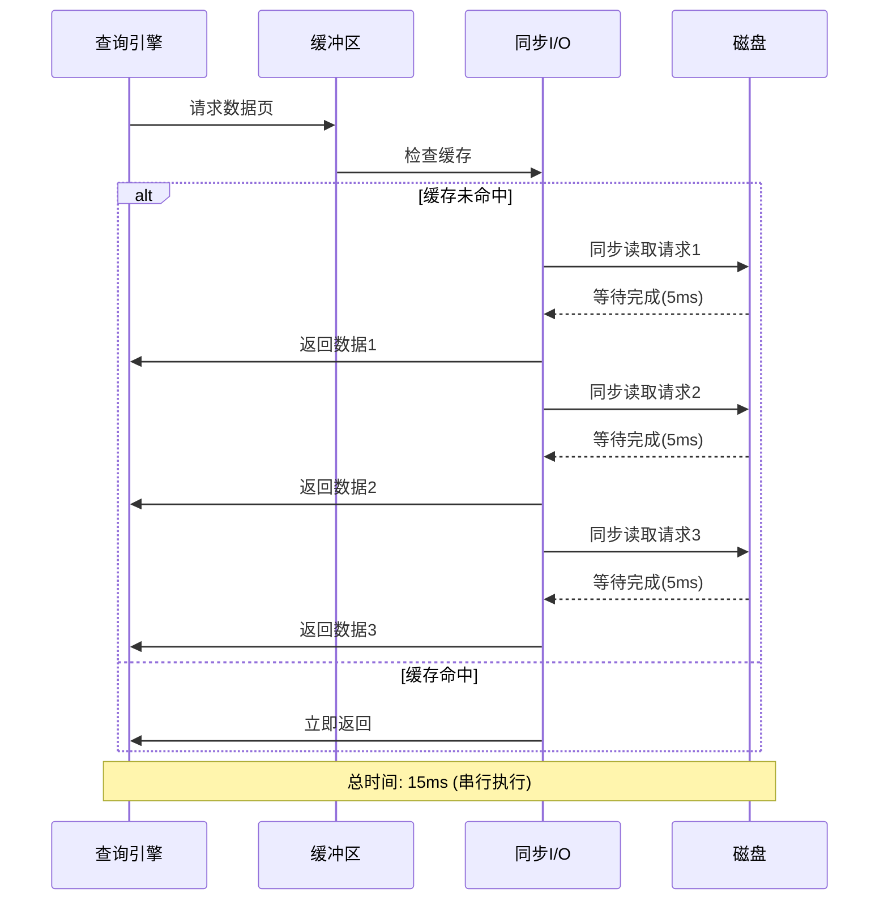
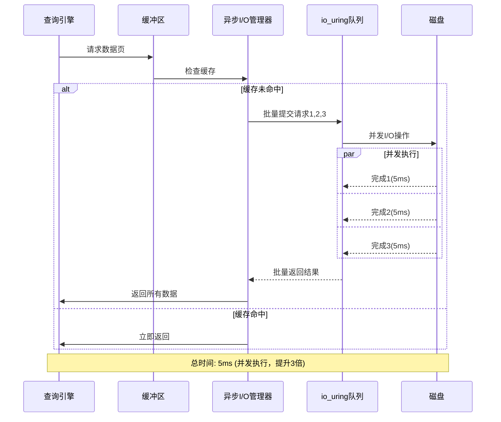
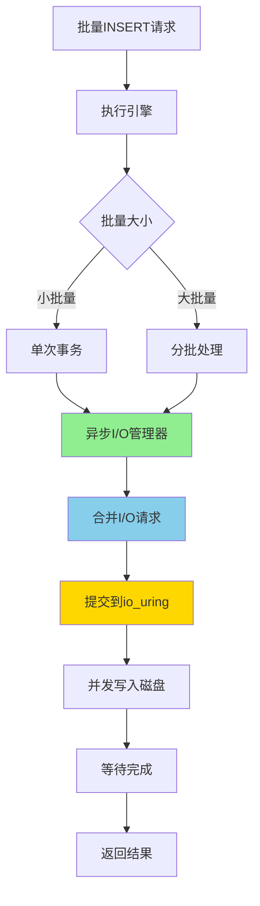
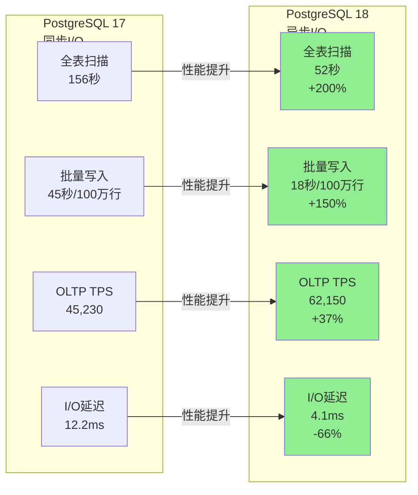
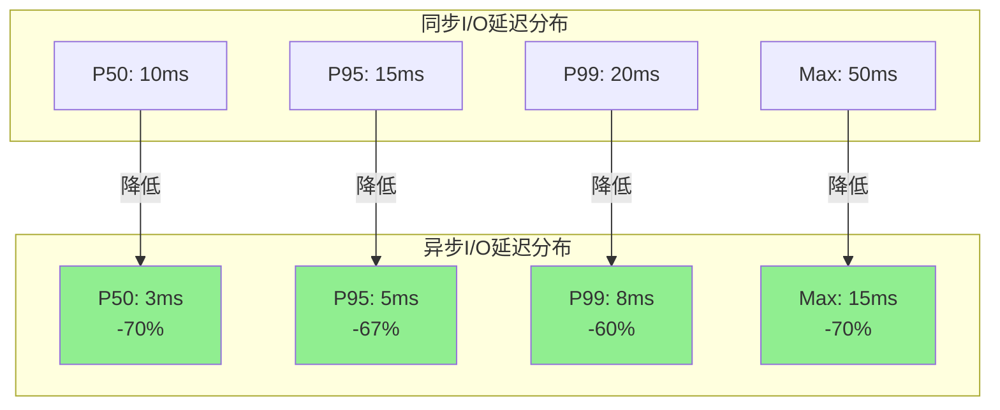
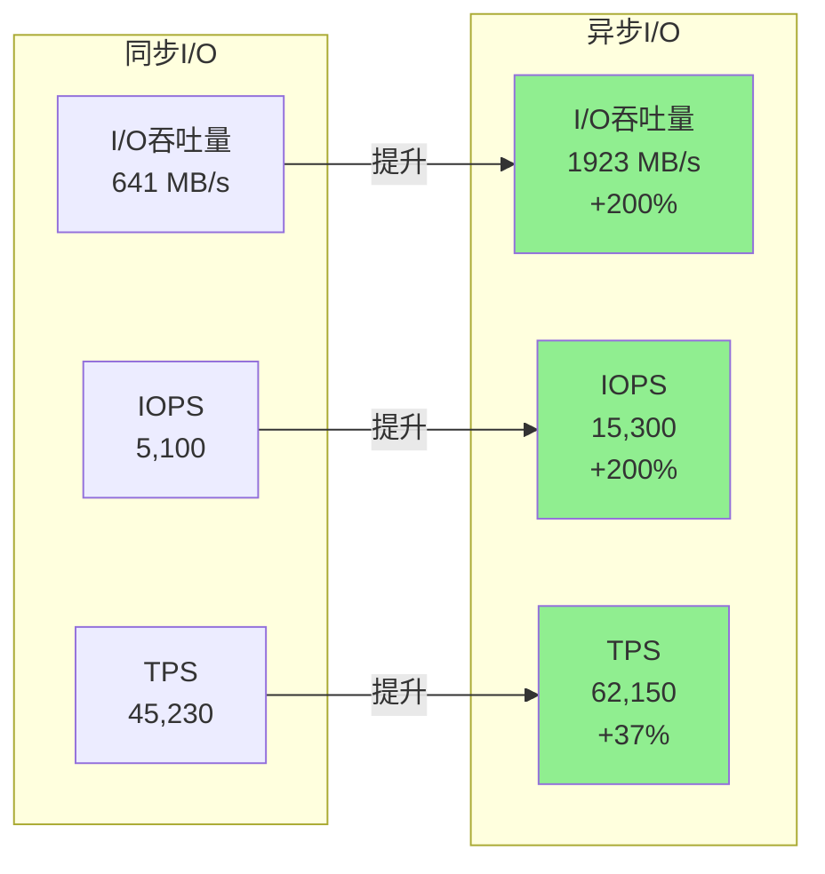
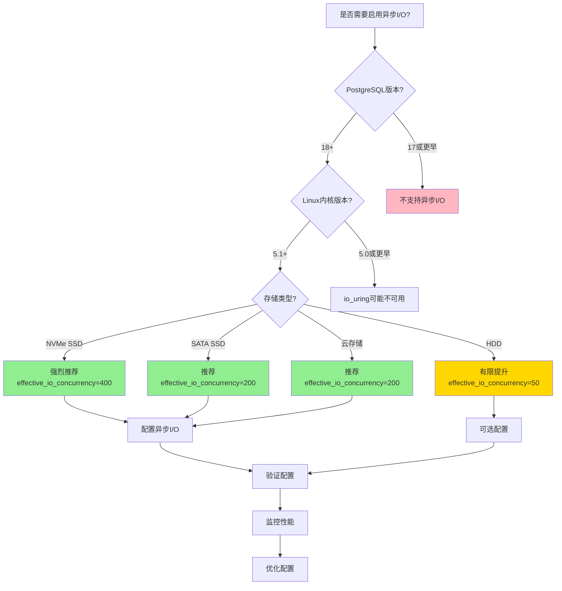
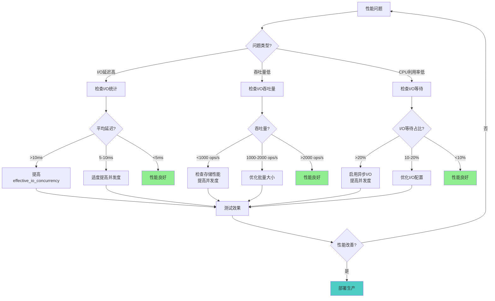
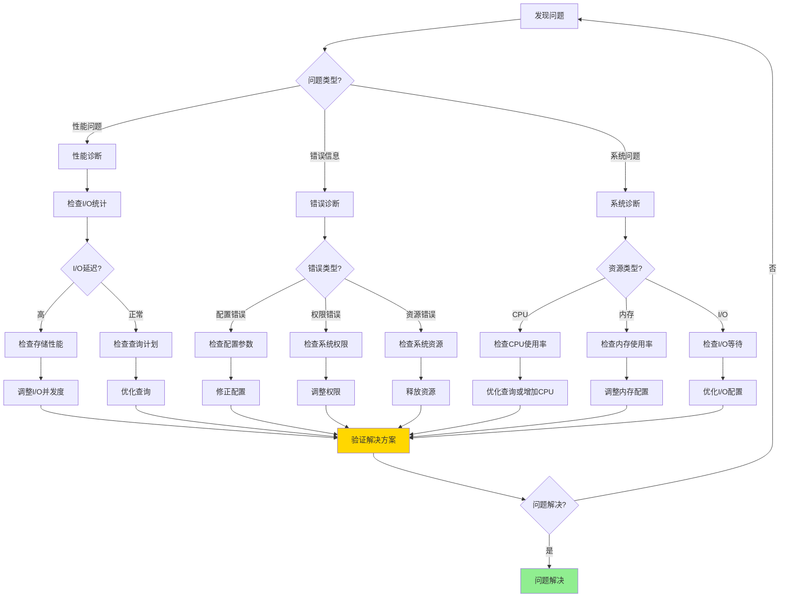
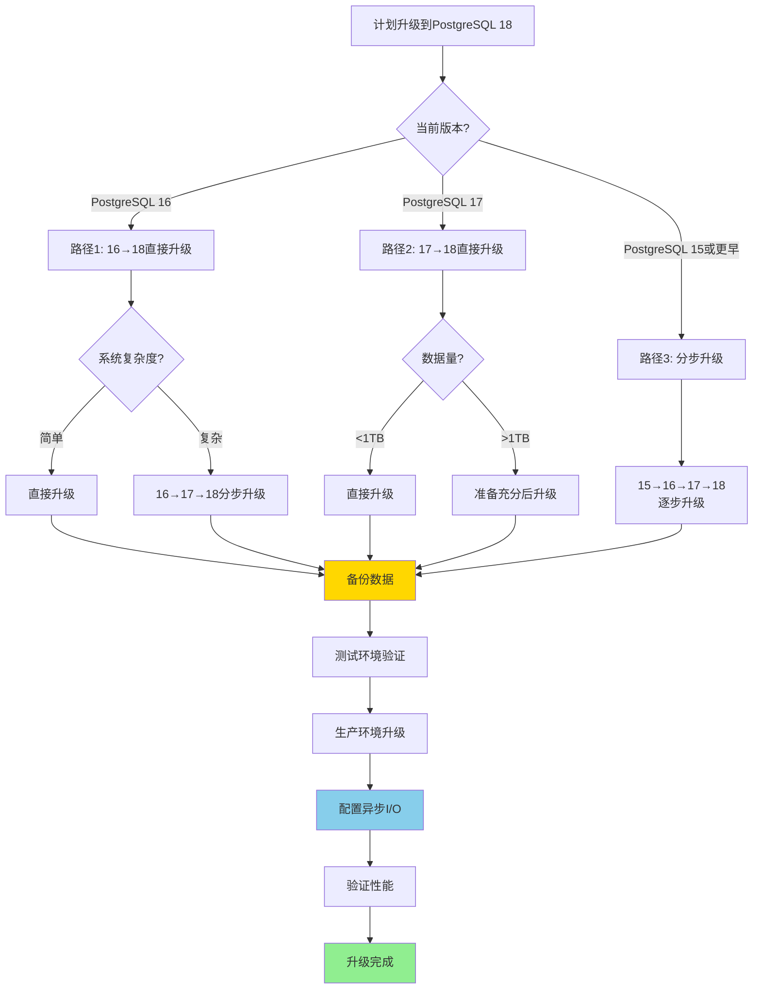

# 30. 可视化图表集合

> **章节编号**: 30
> **章节标题**: 可视化图表集合
> **来源文档**: PostgreSQL 18 异步 I/O 机制

---

## 30. 可视化图表集合

## 📑 目录

- [30. 可视化图表集合](#30-可视化图表集合)
  - [30. 可视化图表集合](#30-可视化图表集合-1)
  - [📑 目录](#-目录)
    - [30.2 数据流程图](#302-数据流程图)
      - [30.2.1 同步I/O数据流](#3021-同步io数据流)
      - [30.2.2 异步I/O数据流](#3022-异步io数据流)
      - [30.2.3 批量写入数据流](#3023-批量写入数据流)
    - [30.3 性能对比图](#303-性能对比图)
      - [30.3.1 性能提升对比图](#3031-性能提升对比图)
      - [30.3.2 延迟分布对比图](#3032-延迟分布对比图)
      - [30.3.3 吞吐量对比图](#3033-吞吐量对比图)
    - [30.4 决策流程图](#304-决策流程图)
      - [30.4.1 异步I/O启用决策流程](#3041-异步io启用决策流程)
      - [30.4.2 性能调优决策流程](#3042-性能调优决策流程)
      - [30.4.3 故障排查决策流程](#3043-故障排查决策流程)
      - [30.4.4 升级路径决策流程](#3044-升级路径决策流程)

---

---

### 30.2 数据流程图

#### 30.2.1 同步I/O数据流

**同步I/O执行流程**:

#### 30.2.2 异步I/O数据流

**异步I/O执行流程**:

#### 30.2.3 批量写入数据流

**批量写入流程**:

---

### 30.3 性能对比图

#### 30.3.1 性能提升对比图

**性能提升可视化**:

#### 30.3.2 延迟分布对比图

**延迟分布对比**:

#### 30.3.3 吞吐量对比图

**吞吐量提升对比**:

---

### 30.4 决策流程图

#### 30.4.1 异步I/O启用决策流程

**启用决策树**:

#### 30.4.2 性能调优决策流程

**性能调优决策树**:

#### 30.4.3 故障排查决策流程

**故障排查流程**:

#### 30.4.4 升级路径决策流程

**升级路径决策树**:

---

---

**返回**: [文档首页](../README.md) | [上一章节](../29-版本兼容性/README.md) | [下一章节](../37-实战演练/README.md)
