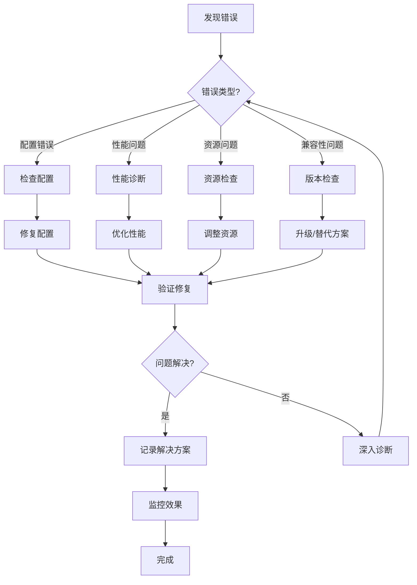

# 32. 常见错误与解决方案

> **章节编号**: 32
> **章节标题**: 常见错误与解决方案
> **来源文档**: PostgreSQL 18 异步 I/O 机制

---

## 32. 常见错误与解决方案

## 📑 目录

- [32. 常见错误与解决方案](#32-常见错误与解决方案)
  - [32. 常见错误与解决方案](#32-常见错误与解决方案-1)
  - [📑 目录](#-目录)
    - [32.2 性能问题](#322-性能问题)
      - [32.2.1 错误4：性能提升不明显](#3221-错误4性能提升不明显)
      - [32.2.2 错误5：性能反而下降](#3222-错误5性能反而下降)
      - [32.2.3 错误6：延迟波动大](#3223-错误6延迟波动大)
    - [32.3 系统资源问题](#323-系统资源问题)
      - [32.3.1 错误7：内存使用过高](#3231-错误7内存使用过高)
      - [32.3.2 错误8：文件描述符耗尽](#3232-错误8文件描述符耗尽)
      - [32.3.3 错误9：CPU使用率过高](#3233-错误9cpu使用率过高)
    - [32.4 兼容性问题](#324-兼容性问题)
      - [32.4.1 错误10：旧版本PostgreSQL不兼容](#3241-错误10旧版本postgresql不兼容)
      - [32.4.2 错误11：操作系统不支持](#3242-错误11操作系统不支持)
    - [32.5 错误处理最佳实践](#325-错误处理最佳实践)
      - [32.5.1 错误处理流程](#3251-错误处理流程)
      - [32.5.2 错误日志记录](#3252-错误日志记录)
      - [32.5.3 错误预防检查清单](#3253-错误预防检查清单)
      - [32.5.4 错误恢复策略](#3254-错误恢复策略)

---

---

### 32.2 性能问题

#### 32.2.1 错误4：性能提升不明显

**错误现象**:

```
启用了异步I/O，但查询性能提升不到10%，远低于预期的30-50%
```

**错误原因**:

1. 存储设备性能瓶颈（HDD）
2. I/O并发度设置过低
3. 查询本身不是I/O密集型
4. 系统资源不足

**诊断步骤**:

```sql
-- 步骤1：检查存储类型
-- 在系统命令行执行
lsblk -d -o name,rota

-- 步骤2：检查I/O统计
SELECT
    context,
    reads,
    writes,
    read_time,
    write_time,
    (read_time + write_time) / NULLIF(reads + writes, 0) as avg_io_time
FROM pg_stat_io
WHERE context = 'normal';

-- 步骤3：检查查询计划
EXPLAIN (ANALYZE, BUFFERS)
SELECT * FROM your_table WHERE condition;

-- 步骤4：检查系统I/O性能
-- 在系统命令行执行
iostat -x 1 5
```

**解决方案**:

```sql
-- 方案1：升级存储设备
-- HDD → SSD/NVMe

-- 方案2：提高I/O并发度
ALTER SYSTEM SET effective_io_concurrency = 400;
SELECT pg_reload_conf();

-- 方案3：优化查询
-- 添加索引，减少全表扫描
CREATE INDEX idx_your_table_column ON your_table(column);

-- 方案4：检查查询是否I/O密集型
-- 如果不是I/O密集型，异步I/O提升有限
```

**预防措施**:

- 使用SSD/NVMe存储
- 根据存储类型设置合适的并发度
- 优化查询，减少不必要的I/O
- 使用性能测试验证

#### 32.2.2 错误5：性能反而下降

**错误现象**:

```
启用异步I/O后，查询时间从5秒增加到8秒，性能下降60%
```

**错误原因**:

1. I/O并发度设置过高
2. 系统资源竞争
3. 存储设备不支持高并发
4. 配置不当

**诊断步骤**:

```sql
-- 步骤1：检查I/O统计
SELECT
    context,
    reads,
    writes,
    read_time,
    write_time
FROM pg_stat_io;

-- 步骤2：检查等待事件
SELECT
    pid,
    wait_event_type,
    wait_event,
    state,
    query
FROM pg_stat_activity
WHERE wait_event_type = 'IO';

-- 步骤3：检查系统资源
-- 在系统命令行执行
top
iostat -x 1 5
vmstat 1 5
```

**解决方案**:

```sql
-- 方案1：降低I/O并发度
ALTER SYSTEM SET effective_io_concurrency = 100;
SELECT pg_reload_conf();

-- 方案2：检查存储设备性能
-- 如果存储设备性能差，降低并发度

-- 方案3：检查系统资源
-- 如果CPU或内存不足，增加资源或降低并发度

-- 方案4：回滚配置
ALTER SYSTEM SET io_direct = 'off';
ALTER SYSTEM SET effective_io_concurrency = 1;
SELECT pg_reload_conf();
```

**预防措施**:

- 从保守值开始配置
- 逐步调整并监控性能
- 使用性能测试验证
- 记录配置变更和性能变化

#### 32.2.3 错误6：延迟波动大

**错误现象**:

```
查询延迟在1ms到50ms之间大幅波动，P99延迟很高
```

**错误原因**:

1. I/O队列深度不足
2. 存储设备性能不稳定
3. 系统资源竞争
4. 批量大小不合适

**诊断步骤**:

```sql
-- 步骤1：检查I/O统计
SELECT
    context,
    reads,
    writes,
    read_time,
    write_time,
    MAX(read_time) as max_read_time,
    MAX(write_time) as max_write_time
FROM pg_stat_io
GROUP BY context, reads, writes, read_time, write_time;

-- 步骤2：检查io_uring队列深度
SHOW io_uring_queue_depth;

-- 步骤3：检查系统I/O延迟
-- 在系统命令行执行
iostat -x 1 10
```

**解决方案**:

```sql
-- 方案1：增加io_uring队列深度
ALTER SYSTEM SET io_uring_queue_depth = 1024;
SELECT pg_reload_conf();

-- 方案2：优化批量大小
-- 根据数据规模调整批量大小
-- 参考第9章最佳实践

-- 方案3：检查存储设备
-- 确保存储设备性能稳定

-- 方案4：优化系统资源
-- 减少资源竞争
```

**预防措施**:

- 设置合适的队列深度
- 优化批量大小
- 监控延迟分布
- 使用性能测试验证

---

### 32.3 系统资源问题

#### 32.3.1 错误7：内存使用过高

**错误现象**:

```
启用异步I/O后，PostgreSQL内存使用从8GB增加到16GB，系统内存不足
```

**错误原因**:

1. io_uring队列缓冲区占用内存
2. 批量操作占用内存
3. 并发连接过多
4. 工作内存设置过大

**诊断步骤**:

```sql
-- 步骤1：检查内存配置
SHOW shared_buffers;
SHOW work_mem;
SHOW maintenance_work_mem;
SHOW io_uring_queue_depth;

-- 步骤2：检查内存使用
-- 在系统命令行执行
ps aux | grep postgres
free -h

-- 步骤3：检查连接数
SELECT count(*) FROM pg_stat_activity;
SHOW max_connections;
```

**解决方案**:

```sql
-- 方案1：降低io_uring队列深度
ALTER SYSTEM SET io_uring_queue_depth = 256;
SELECT pg_reload_conf();

-- 方案2：优化内存配置
ALTER SYSTEM SET work_mem = '64MB';
ALTER SYSTEM SET maintenance_work_mem = '1GB';
SELECT pg_reload_conf();

-- 方案3：减少并发连接
ALTER SYSTEM SET max_connections = 200;
SELECT pg_reload_conf();

-- 方案4：优化批量大小
-- 减少批量大小，降低内存占用
```

**预防措施**:

- 根据系统内存设置合适的队列深度
- 优化内存配置参数
- 监控内存使用情况
- 使用内存监控工具

#### 32.3.2 错误8：文件描述符耗尽

**错误现象**:

```
错误日志显示: "too many open files"，无法创建新连接
```

**错误原因**:

1. io_uring队列深度过大
2. 系统文件描述符限制过低
3. 连接数过多
4. 未正确关闭连接

**诊断步骤**:

```bash
# 步骤1：检查文件描述符限制
ulimit -n

# 步骤2：检查PostgreSQL进程的文件描述符使用
lsof -p $(pgrep -f postgres | head -1) | wc -l

# 步骤3：检查io_uring队列深度
psql -U postgres -c "SHOW io_uring_queue_depth;"

# 步骤4：检查连接数
psql -U postgres -c "SELECT count(*) FROM pg_stat_activity;"
```

**解决方案**:

```bash
# 方案1：增加系统文件描述符限制
# 编辑 /etc/security/limits.conf
echo "* soft nofile 65536" >> /etc/security/limits.conf
echo "* hard nofile 65536" >> /etc/security/limits.conf

# 方案2：降低io_uring队列深度
psql -U postgres -c "ALTER SYSTEM SET io_uring_queue_depth = 256;"
psql -U postgres -c "SELECT pg_reload_conf();"

# 方案3：减少连接数
psql -U postgres -c "ALTER SYSTEM SET max_connections = 200;"
psql -U postgres -c "SELECT pg_reload_conf();"

# 方案4：重启PostgreSQL（应用系统限制）
sudo systemctl restart postgresql
```

**预防措施**:

- 设置合适的系统文件描述符限制
- 根据系统资源设置队列深度
- 使用连接池减少连接数
- 监控文件描述符使用情况

#### 32.3.3 错误9：CPU使用率过高

**错误现象**:

```
启用异步I/O后，CPU使用率从30%增加到80%，系统响应变慢
```

**错误原因**:

1. I/O并发度设置过高
2. 工作线程过多
3. 查询优化不足
4. 系统资源竞争

**诊断步骤**:

```sql
-- 步骤1：检查I/O配置
SHOW effective_io_concurrency;
SHOW max_parallel_workers;
SHOW max_parallel_workers_per_gather;

-- 步骤2：检查活动查询
SELECT
    pid,
    state,
    query,
    cpu_time,
    wait_event_type
FROM pg_stat_activity
WHERE state = 'active';

-- 步骤3：检查系统CPU使用（在系统命令行）
top
htop
```

**解决方案**:

```sql
-- 方案1：降低I/O并发度
ALTER SYSTEM SET effective_io_concurrency = 100;
SELECT pg_reload_conf();

-- 方案2：减少并行工作进程
ALTER SYSTEM SET max_parallel_workers = 4;
ALTER SYSTEM SET max_parallel_workers_per_gather = 2;
SELECT pg_reload_conf();

-- 方案3：优化查询
-- 添加索引，优化查询计划

-- 方案4：检查是否有CPU密集型查询
-- 如果不是I/O密集型，禁用并行查询
```

**预防措施**:

- 根据CPU核心数设置合适的并发度
- 监控CPU使用情况
- 优化查询性能
- 平衡I/O和CPU使用

---

### 32.4 兼容性问题

#### 32.4.1 错误10：旧版本PostgreSQL不兼容

**错误现象**:

```
在PostgreSQL 17上尝试使用io_direct参数，提示参数不存在
```

**错误原因**:

1. PostgreSQL版本低于18
2. 参数名称错误
3. 扩展未安装

**诊断步骤**:

```sql
-- 步骤1：检查PostgreSQL版本
SELECT version();

-- 步骤2：检查参数是否存在
SELECT name FROM pg_settings WHERE name LIKE '%io%';

-- 步骤3：检查扩展
SELECT * FROM pg_available_extensions WHERE name LIKE '%io%';
```

**解决方案**:

```sql
-- 方案1：升级到PostgreSQL 18
-- 参考第27章版本兼容性与升级路径

-- 方案2：使用替代方案（PostgreSQL 17）
-- 使用effective_io_concurrency（PostgreSQL 17支持）
ALTER SYSTEM SET effective_io_concurrency = 200;
SELECT pg_reload_conf();

-- 方案3：等待升级
-- 如果无法升级，使用现有功能优化性能
```

**预防措施**:

- 检查PostgreSQL版本
- 参考版本兼容性矩阵
- 使用版本检查脚本
- 规划升级路径

#### 32.4.2 错误11：操作系统不支持

**错误现象**:

```
在Windows系统上配置io_direct，提示不支持
```

**错误原因**:

1. 操作系统不支持io_uring（Windows）
2. 内核版本过低（Linux < 5.1）
3. io_uring未编译到内核

**诊断步骤**:

```bash
# 步骤1：检查操作系统
uname -a

# 步骤2：检查内核版本（Linux）
uname -r

# 步骤3：检查io_uring支持（Linux）
grep CONFIG_IO_URING /boot/config-$(uname -r)
```

**解决方案**:

```sql
-- 方案1：使用Linux系统（推荐）
-- PostgreSQL 18异步I/O主要支持Linux

-- 方案2：升级内核（Linux < 5.1）
-- 升级到Linux 5.1+内核

-- 方案3：使用替代方案
-- 在Windows上使用effective_io_concurrency
ALTER SYSTEM SET effective_io_concurrency = 200;
SELECT pg_reload_conf();
```

**预防措施**:

- 使用Linux系统
- 检查内核版本
- 使用环境检查脚本
- 参考系统要求

---

### 32.5 错误处理最佳实践

#### 32.5.1 错误处理流程

**标准错误处理流程**:



#### 32.5.2 错误日志记录

**错误日志记录脚本**:

```sql
-- 创建错误日志表
CREATE TABLE IF NOT EXISTS aio_error_log (
    id SERIAL PRIMARY KEY,
    error_type VARCHAR(50),
    error_message TEXT,
    error_context JSONB,
    solution TEXT,
    resolved_at TIMESTAMPTZ,
    created_at TIMESTAMPTZ DEFAULT NOW()
);

-- 记录错误函数
CREATE OR REPLACE FUNCTION log_aio_error(
    p_error_type VARCHAR,
    p_error_message TEXT,
    p_error_context JSONB DEFAULT NULL,
    p_solution TEXT DEFAULT NULL
) RETURNS VOID AS $$
BEGIN
    INSERT INTO aio_error_log (
        error_type,
        error_message,
        error_context,
        solution,
        resolved_at
    ) VALUES (
        p_error_type,
        p_error_message,
        p_error_context,
        p_solution,
        CASE WHEN p_solution IS NOT NULL THEN NOW() ELSE NULL END
    );
END;
$$ LANGUAGE plpgsql;

-- 使用示例
SELECT log_aio_error(
    '配置错误',
    'io_direct配置无效',
    '{"io_direct": "data,wal", "version": "18.0"}'::jsonb,
    '升级PostgreSQL到18.1并重新配置'
);
```

#### 32.5.3 错误预防检查清单

**配置前检查清单**:

```bash
#!/bin/bash
# 错误预防检查清单脚本

echo "=== PostgreSQL 18异步I/O配置前检查 ==="

# 1. PostgreSQL版本检查
echo "[1/6] 检查PostgreSQL版本..."
PG_VERSION=$(psql -t -c "SELECT version();" | grep -oP 'PostgreSQL \K[0-9]+' | head -1)
if [ "$PG_VERSION" -ge 18 ]; then
    echo "✓ PostgreSQL版本: $PG_VERSION"
else
    echo "✗ PostgreSQL版本过低: $PG_VERSION (需要18+)"
    exit 1
fi

# 2. 操作系统检查
echo "[2/6] 检查操作系统..."
if [ "$(uname)" == "Linux" ]; then
    echo "✓ 操作系统: Linux"
else
    echo "✗ 操作系统不支持: $(uname)"
    exit 1
fi

# 3. 内核版本检查
echo "[3/6] 检查内核版本..."
KERNEL_VERSION=$(uname -r | cut -d. -f1,2)
KERNEL_MAJOR=$(echo $KERNEL_VERSION | cut -d. -f1)
KERNEL_MINOR=$(echo $KERNEL_VERSION | cut -d. -f2)
if [ "$KERNEL_MAJOR" -gt 5 ] || ([ "$KERNEL_MAJOR" -eq 5 ] && [ "$KERNEL_MINOR" -ge 1 ]); then
    echo "✓ 内核版本: $KERNEL_VERSION"
else
    echo "✗ 内核版本过低: $KERNEL_VERSION (需要5.1+)"
    exit 1
fi

# 4. 存储类型检查
echo "[4/6] 检查存储类型..."
DISK_TYPE=$(lsblk -d -o name,rota | grep -v NAME | head -1 | awk '{print $2}')
if [ "$DISK_TYPE" == "0" ]; then
    echo "✓ 存储类型: SSD/NVMe (推荐)"
elif [ "$DISK_TYPE" == "1" ]; then
    echo "⚠ 存储类型: HDD (性能提升有限)"
else
    echo "? 存储类型: 未知"
fi

# 5. 系统资源检查
echo "[5/6] 检查系统资源..."
CPU_CORES=$(nproc)
MEMORY_GB=$(free -g | awk '/^Mem:/{print $2}')
echo "  CPU核心数: $CPU_CORES"
echo "  内存大小: ${MEMORY_GB}GB"
if [ "$MEMORY_GB" -lt 8 ]; then
    echo "⚠ 内存可能不足，建议至少8GB"
fi

# 6. 配置文件备份检查
echo "[6/6] 检查配置文件备份..."
CONFIG_FILE=$(psql -t -c "SHOW config_file;" | xargs)
if [ -f "${CONFIG_FILE}.backup" ]; then
    echo "✓ 配置文件已备份"
else
    echo "⚠ 建议备份配置文件: $CONFIG_FILE"
fi

echo ""
echo "=== 检查完成 ==="
echo "✓ 所有检查通过，可以开始配置"
```

#### 32.5.4 错误恢复策略

**配置回滚脚本**:

```bash
#!/bin/bash
# 配置回滚脚本

echo "=== PostgreSQL 18异步I/O配置回滚 ==="

# 1. 恢复配置文件备份
CONFIG_FILE=$(psql -t -c "SHOW config_file;" | xargs)
BACKUP_FILE="${CONFIG_FILE}.backup.$(date +%Y%m%d)"

if [ -f "$BACKUP_FILE" ]; then
    echo "[1/3] 恢复配置文件备份..."
    sudo cp "$BACKUP_FILE" "$CONFIG_FILE"
    echo "✓ 配置文件已恢复"
else
    echo "⚠ 未找到备份文件: $BACKUP_FILE"
fi

# 2. 重置配置参数
echo "[2/3] 重置配置参数..."
psql -U postgres <<EOF
ALTER SYSTEM SET io_direct = 'off';
ALTER SYSTEM SET effective_io_concurrency = 1;
ALTER SYSTEM SET wal_io_concurrency = 1;
ALTER SYSTEM SET io_uring_queue_depth = 256;
SELECT pg_reload_conf();
EOF

echo "✓ 配置参数已重置"

# 3. 验证配置
echo "[3/3] 验证配置..."
psql -U postgres -c "
SELECT
    name,
    setting
FROM pg_settings
WHERE name IN (
    'io_direct',
    'effective_io_concurrency',
    'wal_io_concurrency',
    'io_uring_queue_depth'
)
ORDER BY name;
"

echo ""
echo "=== 回滚完成 ==="
```

---

---

**返回**: [文档首页](../README.md) | [上一章节](../37-实战演练/README.md) | [下一章节](../33-源码分析/README.md)
