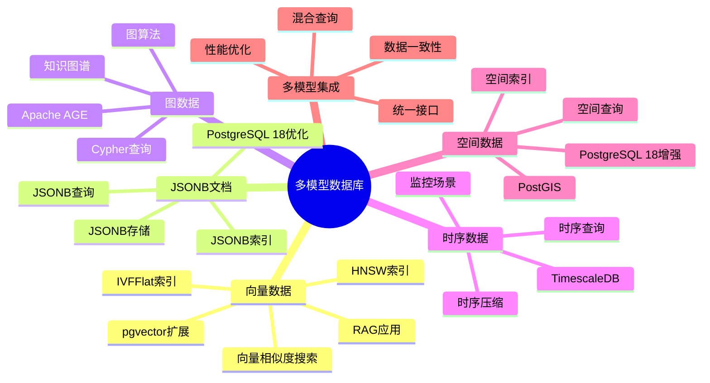
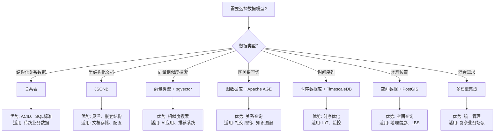

# 07-多模型数据库

> **文档总数**: 25个文档
> **覆盖领域**: 向量、图、时序、JSONB、空间数据、多模型集成
> **版本覆盖**: PostgreSQL 18.x (推荐) ⭐ | 17.x (推荐) | 16.x (兼容)

---

## 📊 知识体系思维导图

---

## 📋 主题说明

本主题整合所有PostgreSQL多模型数据库相关内容，包括向量搜索、图数据库、时序数据、JSONB文档存储、空间数据以及多模型集成应用。

---

## 📚 核心文档

### 图向量混合检索

- **[图向量混合检索/图向量联合查询.md](./图向量混合检索/图向量联合查询.md)** - 图向量联合查询方法
- **[图向量混合检索/召回率优化策略.md](./图向量混合检索/召回率优化策略.md)** - 召回率优化策略
- **[图向量混合检索/金融反欺诈应用.md](./图向量混合检索/金融反欺诈应用.md)** - 金融反欺诈应用案例

### JSONB时序向量

- **[JSONB时序向量/README.md](./JSONB时序向量/README.md)** - JSONB时序向量主题概览
- **[JSONB时序向量/混合数据模型设计.md](./JSONB时序向量/混合数据模型设计.md)** - 混合数据模型设计
- **[JSONB时序向量/IoT异常检测方案.md](./JSONB时序向量/IoT异常检测方案.md)** - IoT异常检测方案
- **[JSONB时序向量/性能优化策略.md](./JSONB时序向量/性能优化策略.md)** - 性能优化策略

### PostgreSQL 18新特性

- **[PostgreSQL-18新特性/JSONB性能优化.md](./PostgreSQL-18新特性/JSONB性能优化.md)** - JSONB性能优化
- **[PostgreSQL-18新特性/异步I-O机制.md](./PostgreSQL-18新特性/异步I-O机制.md)** - 异步I/O机制
- **[PostgreSQL-18新特性/异步I-O机制-改进补充.md](./PostgreSQL-18新特性/异步I-O机制-改进补充.md)** - 异步I/O机制改进
- **[PostgreSQL-18新特性/并行文本处理.md](./PostgreSQL-18新特性/并行文本处理.md)** - 并行文本处理
- **[PostgreSQL-18新特性/async_io_quality_check.md](./PostgreSQL-18新特性/async_io_quality_check.md)** - 异步I/O质量检查

### 空间数据

- **[空间数据/PostGIS完整深化指南.md](./空间数据/PostGIS完整深化指南.md)** - PostGIS 3.x完整深化指南
- **[空间数据/PostgreSQL18-PostGIS地理空间数据库实战.md](./空间数据/PostgreSQL18-PostGIS地理空间数据库实战.md)** - PostgreSQL 18 PostGIS实战

### 技术原理

- **[技术原理/多模数据模型设计.md](./技术原理/多模数据模型设计.md)** - 多模数据模型设计原理
- **[技术原理/数据一致性保证.md](./技术原理/数据一致性保证.md)** - 数据一致性保证机制
- **[技术原理/统一查询接口.md](./技术原理/统一查询接口.md)** - 统一查询接口设计

### 选型与应用指南

- **[多模型数据库选型与应用场景指南.md](./多模型数据库选型与应用场景指南.md)** ⭐⭐⭐⭐⭐ ⭐ 新增
  - 多模型数据选型决策（JSONB vs 关系表 vs 图数据库 vs 时序数据库）
  - PostGIS深度应用场景（空间查询优化、空间索引优化）
  - 全文搜索场景分析与优化（中文搜索、多语言搜索、搜索性能优化）
  - 图数据库应用场景（Apache AGE应用场景）
  - **字数**: 约32,000字
  - **状态**: ✅ 已完成

---

## 📊 多模型数据选型决策树

---

## 📊 多模型数据库对比矩阵

| 数据模型 | PostgreSQL支持 | 扩展/工具 | 查询性能 | 存储效率 | 适用场景 |
|---------|--------------|----------|---------|---------|---------|
| **关系表** | ✅ 原生 | - | ⭐⭐⭐⭐⭐ | ⭐⭐⭐⭐ | 结构化数据、OLTP |
| **JSONB** | ✅ 原生 | - | ⭐⭐⭐⭐ | ⭐⭐⭐ | 文档存储、配置数据 |
| **向量** | ✅ 扩展 | pgvector | ⭐⭐⭐⭐⭐ | ⭐⭐⭐ | AI应用、相似度搜索 |
| **图数据** | ✅ 扩展 | Apache AGE | ⭐⭐⭐⭐ | ⭐⭐⭐ | 社交网络、知识图谱 |
| **时序数据** | ✅ 扩展 | TimescaleDB | ⭐⭐⭐⭐⭐ | ⭐⭐⭐⭐⭐ | IoT、监控、分析 |
| **空间数据** | ✅ 扩展 | PostGIS | ⭐⭐⭐⭐ | ⭐⭐⭐ | 地理信息、LBS |
| **全文搜索** | ✅ 原生 | - | ⭐⭐⭐⭐ | ⭐⭐⭐ | 文本搜索、内容检索 |

---

## 🎯 使用建议

### 多模型应用

1. 学习 [技术原理/多模数据模型设计.md](./技术原理/多模数据模型设计.md) 了解多模型设计
2. 参考 [图向量混合检索/图向量联合查询.md](./图向量混合检索/图向量联合查询.md) 实现图向量联合查询
3. 使用 [JSONB时序向量/混合数据模型设计.md](./JSONB时序向量/混合数据模型设计.md) 设计混合数据模型

### 性能优化

1. 参考 [PostgreSQL-18新特性/JSONB性能优化.md](./PostgreSQL-18新特性/JSONB性能优化.md) 优化JSONB性能
2. 学习 [JSONB时序向量/性能优化策略.md](./JSONB时序向量/性能优化策略.md) 优化混合模型性能
3. 使用 [图向量混合检索/召回率优化策略.md](./图向量混合检索/召回率优化策略.md) 优化检索性能

---

## 📚 文档来源

本主题整合了以下源目录的文档：

- `PostgreSQL/03-高级特性/` (多模型相关)
- `PostgreSQL_View/04-多模一体化/`
- `PostgreSQL培训/03-数据类型/` (JSONB、PostGIS等)
- `DataBaseTheory/11-向量与AI/`
- `DataBaseTheory/14-图与时序数据模型/`

**原则**: 所有文档均为复制，原文件保持不变。

---

## 🔗 相关文档

- [10-AI与机器学习](../10-AI与机器学习/README.md) - AI与机器学习应用
- [06-扩展系统](../06-扩展系统/README.md) - 扩展系统开发
- [28-知识图谱](../28-知识图谱/README.md) - 知识图谱构建

---

**最后更新**: 2025年1月
**状态**: ✅ 文档整合完成
