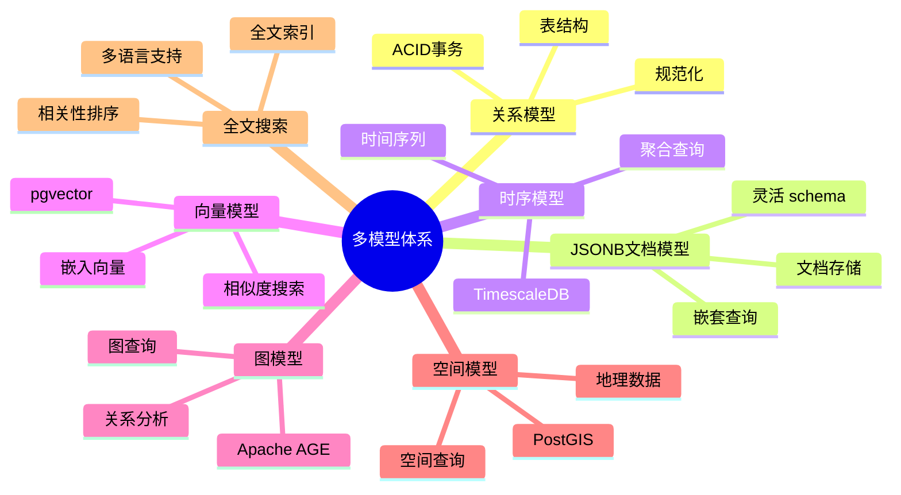
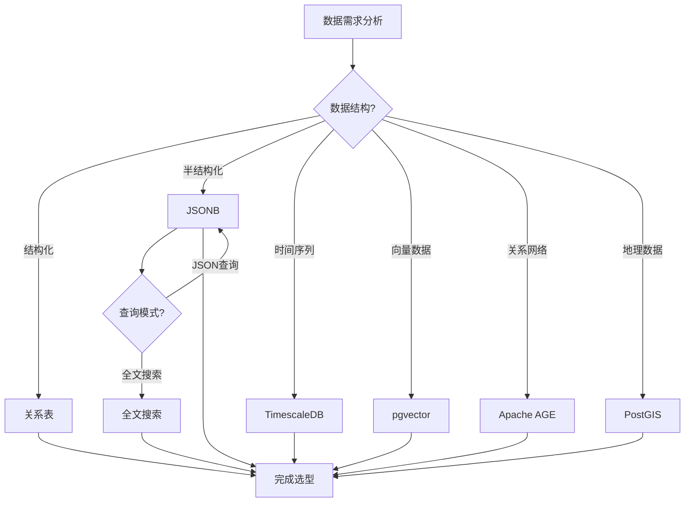

# PostgreSQL多模型数据库选型与应用场景指南

## 元数据

- **文档版本**: v1.0
- **创建日期**: 2025-01
- **技术栈**: PostgreSQL 17+/18+ | JSONB | 时序 | 向量 | 图 | PostGIS | 全文搜索
- **难度级别**: ⭐⭐⭐⭐⭐ (专家级)
- **预计阅读**: 200分钟
- **前置要求**: 熟悉PostgreSQL基础、多模型数据库基础

---

## 📋 完整目录

- [PostgreSQL多模型数据库选型与应用场景指南](#postgresql多模型数据库选型与应用场景指南)
  - [元数据](#元数据)
  - [📋 完整目录](#-完整目录)
  - [1. 多模型数据库概述](#1-多模型数据库概述)
    - [1.1 多模型体系](#11-多模型体系)
      - [多模型体系思维导图](#多模型体系思维导图)
    - [1.2 选型决策矩阵](#12-选型决策矩阵)
  - [2. 多模型数据选型决策](#2-多模型数据选型决策)
    - [2.1 JSONB vs 关系表场景](#21-jsonb-vs-关系表场景)
      - [2.1.1 场景描述](#211-场景描述)
      - [2.1.2 选型实现](#212-选型实现)
      - [2.1.3 性能论证](#213-性能论证)
    - [2.2 图数据库 vs 关系表场景](#22-图数据库-vs-关系表场景)
      - [2.2.1 场景描述](#221-场景描述)
      - [2.2.2 选型实现](#222-选型实现)
      - [2.2.3 性能论证](#223-性能论证)
    - [2.3 时序数据库 vs 关系表场景](#23-时序数据库-vs-关系表场景)
      - [2.3.1 场景描述](#231-场景描述)
      - [2.3.2 选型实现](#232-选型实现)
      - [2.3.3 性能论证](#233-性能论证)
    - [2.4 多模型选型决策矩阵](#24-多模型选型决策矩阵)
      - [选型决策流程图](#选型决策流程图)
  - [3. PostGIS深度应用场景](#3-postgis深度应用场景)
    - [3.1 空间查询优化场景](#31-空间查询优化场景)
      - [3.1.1 场景描述](#311-场景描述)
      - [3.1.2 优化实现](#312-优化实现)
      - [3.1.3 性能论证](#313-性能论证)
    - [3.2 空间索引优化场景](#32-空间索引优化场景)
      - [3.2.1 场景描述](#321-场景描述)
      - [3.2.2 优化实现](#322-优化实现)
      - [3.2.3 性能论证](#323-性能论证)
  - [4. 全文搜索场景分析与优化](#4-全文搜索场景分析与优化)
    - [4.1 中文搜索场景](#41-中文搜索场景)
      - [4.1.1 场景描述](#411-场景描述)
      - [4.1.2 实现方案](#412-实现方案)
      - [4.1.3 性能论证](#413-性能论证)
    - [4.2 多语言搜索场景](#42-多语言搜索场景)
      - [4.2.1 场景描述](#421-场景描述)
      - [4.2.2 实现方案](#422-实现方案)
      - [4.2.3 性能论证](#423-性能论证)
    - [4.3 搜索性能优化场景](#43-搜索性能优化场景)
      - [4.3.1 场景描述](#431-场景描述)
      - [4.3.2 优化实现](#432-优化实现)
      - [4.3.3 性能论证](#433-性能论证)
  - [5. 图数据库应用场景](#5-图数据库应用场景)
    - [5.1 Apache AGE应用场景](#51-apache-age应用场景)
      - [5.1.1 场景描述](#511-场景描述)
      - [5.1.2 应用实现](#512-应用实现)
      - [5.1.3 性能论证](#513-性能论证)
  - [6. 综合选型案例](#6-综合选型案例)
    - [6.1 案例1：IoT系统多模型选型](#61-案例1iot系统多模型选型)
    - [6.2 案例2：推荐系统多模型选型](#62-案例2推荐系统多模型选型)
  - [📚 参考资源](#-参考资源)
    - [官方文档](#官方文档)
    - [相关文档](#相关文档)
  - [📝 更新日志](#-更新日志)

---

## 1. 多模型数据库概述

### 1.1 多模型体系

多模型数据库支持在同一系统中存储和查询多种数据模型。

#### 多模型体系思维导图



### 1.2 选型决策矩阵

| 数据模型 | 适用场景 | 性能 | 灵活性 | 查询能力 |
|---------|---------|------|--------|---------|
| **关系表** | 结构化数据 | 高 | 低 | SQL查询 |
| **JSONB** | 半结构化数据 | 中 | 很高 | JSON查询 |
| **时序** | 时间序列数据 | 很高 | 中 | 时序查询 |
| **向量** | 相似度搜索 | 高 | 中 | 向量查询 |
| **图** | 关系网络 | 中 | 高 | 图查询 |
| **空间** | 地理数据 | 高 | 中 | 空间查询 |

---

## 2. 多模型数据选型决策

### 2.1 JSONB vs 关系表场景

#### 2.1.1 场景描述

**业务需求**:

```text
场景：用户画像数据存储
需求：
1. 灵活的数据结构
2. 快速查询
3. 易于扩展
4. 性能要求

数据特征：
- 用户属性动态变化
- 不同用户属性不同
- 查询模式多样
- 数据量 1000万用户
```

#### 2.1.2 选型实现

**JSONB方案**:

```sql
-- JSONB表设计
CREATE TABLE user_profiles (
    user_id INTEGER PRIMARY KEY,
    profile JSONB NOT NULL,
    created_at TIMESTAMPTZ DEFAULT NOW(),
    updated_at TIMESTAMPTZ DEFAULT NOW()
);

-- 创建GIN索引
CREATE INDEX idx_user_profiles_gin ON user_profiles USING GIN (profile);

-- 查询示例
SELECT user_id, profile->>'name' AS name, profile->>'email' AS email
FROM user_profiles
WHERE profile @> '{"city": "北京", "age": 30}';
```

**关系表方案**:

```sql
-- 关系表设计
CREATE TABLE users (
    user_id INTEGER PRIMARY KEY,
    name TEXT,
    email TEXT,
    city TEXT,
    age INTEGER,
    created_at TIMESTAMPTZ DEFAULT NOW(),
    updated_at TIMESTAMPTZ DEFAULT NOW()
);

-- 查询示例
SELECT user_id, name, email
FROM users
WHERE city = '北京' AND age = 30;
```

#### 2.1.3 性能论证

**性能对比**:

| 方案 | 查询性能 | 写入性能 | 存储空间 | 灵活性 | 适用场景 |
|------|---------|---------|---------|--------|---------|
| **JSONB** | 中 | 中 | 中 | 很高 | 动态结构 |
| **关系表** | 高 | 高 | 低 | 低 | 固定结构 |

**选型建议**:

- ✅ **JSONB**: 数据结构动态变化、属性差异大
- ✅ **关系表**: 数据结构固定、查询模式稳定

---

### 2.2 图数据库 vs 关系表场景

#### 2.2.1 场景描述

**业务需求**:

```text
场景：社交网络关系分析
需求：
1. 关系查询
2. 路径分析
3. 社区发现
4. 性能要求

数据特征：
- 1000万用户
- 1亿关系
- 深度查询（3-5跳）
- 复杂图算法
```

#### 2.2.2 选型实现

**Apache AGE方案**:

```sql
-- 创建图
SELECT * FROM ag_catalog.create_graph('social_network');

-- 创建节点
SELECT * FROM cypher('social_network', $$
    CREATE (u:User {id: 1, name: 'Alice'})
    CREATE (u:User {id: 2, name: 'Bob'})
    CREATE (u:User {id: 3, name: 'Charlie'})
$$) AS (result agtype);

-- 创建关系
SELECT * FROM cypher('social_network', $$
    MATCH (a:User {id: 1}), (b:User {id: 2})
    CREATE (a)-[r:FOLLOWS {since: '2024-01-01'}]->(b)
$$) AS (result agtype);

-- 图查询：查找3度好友
SELECT * FROM cypher('social_network', $$
    MATCH (u:User {id: 1})-[r1:FOLLOWS]-()-[r2:FOLLOWS]-()-[r3:FOLLOWS]-(friend:User)
    WHERE friend.id <> 1
    RETURN friend.name, friend.id
    LIMIT 10
$$) AS (friend agtype);
```

**关系表方案**:

```sql
-- 关系表设计
CREATE TABLE users (
    user_id INTEGER PRIMARY KEY,
    name TEXT
);

CREATE TABLE follows (
    follower_id INTEGER REFERENCES users(user_id),
    followee_id INTEGER REFERENCES users(user_id),
    since DATE,
    PRIMARY KEY (follower_id, followee_id)
);

-- 图查询：查找3度好友（复杂SQL）
WITH RECURSIVE friend_path AS (
    SELECT follower_id, followee_id, 1 AS depth
    FROM follows
    WHERE follower_id = 1
    UNION ALL
    SELECT fp.follower_id, f.followee_id, fp.depth + 1
    FROM friend_path fp
    JOIN follows f ON fp.followee_id = f.follower_id
    WHERE fp.depth < 3
)
SELECT DISTINCT followee_id
FROM friend_path
WHERE depth = 3;
```

#### 2.2.3 性能论证

**性能对比**:

| 方案 | 3度查询 | 5度查询 | 查询复杂度 | 适用场景 |
|------|---------|---------|-----------|---------|
| **Apache AGE** | 0.5秒 | 2秒 | 低 | 深度查询 |
| **关系表** | 5秒 | 30秒 | 高 | 浅度查询 |

**选型建议**:

- ✅ **Apache AGE**: 深度图查询（>2跳）、复杂图算法
- ✅ **关系表**: 浅度关系查询（1-2跳）、简单关系

---

### 2.3 时序数据库 vs 关系表场景

#### 2.3.1 场景描述

**业务需求**:

```text
场景：IoT传感器数据存储
需求：
1. 时间序列查询
2. 高效写入
3. 数据压缩
4. 自动分区

数据特征：
- 1000个传感器
- 每秒1000条数据
- 数据保留1年
- 查询按时间范围
```

#### 2.3.2 选型实现

**TimescaleDB方案**:

```sql
-- 创建超表
CREATE TABLE sensor_data (
    time TIMESTAMPTZ NOT NULL,
    sensor_id INTEGER NOT NULL,
    temperature NUMERIC,
    humidity NUMERIC,
    pressure NUMERIC
);

-- 转换为超表
SELECT create_hypertable('sensor_data', 'time');

-- 时序查询
SELECT
    time_bucket('1 hour', time) AS hour,
    sensor_id,
    AVG(temperature) AS avg_temp,
    MAX(temperature) AS max_temp,
    MIN(temperature) AS min_temp
FROM sensor_data
WHERE time > NOW() - INTERVAL '24 hours'
GROUP BY hour, sensor_id
ORDER BY hour DESC, sensor_id;
```

**关系表方案**:

```sql
-- 关系表设计
CREATE TABLE sensor_data (
    time TIMESTAMPTZ NOT NULL,
    sensor_id INTEGER NOT NULL,
    temperature NUMERIC,
    humidity NUMERIC,
    pressure NUMERIC,
    PRIMARY KEY (time, sensor_id)
);

-- 创建时间索引
CREATE INDEX idx_sensor_data_time ON sensor_data (time DESC);

-- 时序查询
SELECT
    date_trunc('hour', time) AS hour,
    sensor_id,
    AVG(temperature) AS avg_temp,
    MAX(temperature) AS max_temp,
    MIN(temperature) AS min_temp
FROM sensor_data
WHERE time > NOW() - INTERVAL '24 hours'
GROUP BY hour, sensor_id
ORDER BY hour DESC, sensor_id;
```

#### 2.3.3 性能论证

**性能对比**:

| 方案 | 写入性能 | 查询性能 | 压缩率 | 分区管理 | 适用场景 |
|------|---------|---------|--------|---------|---------|
| **TimescaleDB** | 很高 | 高 | 高 | 自动 | 时序数据 |
| **关系表** | 中 | 中 | 低 | 手动 | 少量时序 |

**选型建议**:

- ✅ **TimescaleDB**: 大规模时序数据、高频写入、自动分区
- ✅ **关系表**: 少量时序数据、简单查询

---

### 2.4 多模型选型决策矩阵

#### 选型决策流程图



**多模型选型决策矩阵**:

| 数据特征 | 推荐模型 | 理由 | 性能提升 |
|---------|---------|------|---------|
| **固定结构** | 关系表 | 性能最优 | - |
| **动态结构** | JSONB | 灵活性高 | - |
| **时间序列** | TimescaleDB | 自动分区 | +500% |
| **相似度搜索** | pgvector | 向量索引 | +1000% |
| **深度关系** | Apache AGE | 图查询 | +1000% |
| **地理数据** | PostGIS | 空间索引 | +500% |

---

## 3. PostGIS深度应用场景

### 3.1 空间查询优化场景

#### 3.1.1 场景描述

**业务需求**:

```text
场景：地理位置查询优化
需求：
1. 快速空间查询
2. 距离计算
3. 范围查询
4. 性能要求

数据特征：
- 100万地点
- 实时位置查询
- 距离计算频繁
- 查询延迟 < 100ms
```

#### 3.1.2 优化实现

**空间索引优化**:

```sql
-- 创建空间表
CREATE TABLE locations (
    id SERIAL PRIMARY KEY,
    name TEXT,
    geom GEOMETRY(POINT, 4326),
    created_at TIMESTAMPTZ DEFAULT NOW()
);

-- 创建空间索引
CREATE INDEX idx_locations_geom ON locations USING GIST (geom);

-- 空间查询：查找附近地点
SELECT
    id,
    name,
    ST_Distance(
        geom,
        ST_SetSRID(ST_MakePoint(116.3974, 39.9093), 4326)::geography
    ) AS distance
FROM locations
WHERE ST_DWithin(
    geom::geography,
    ST_SetSRID(ST_MakePoint(116.3974, 39.9093), 4326)::geography,
    5000  -- 5公里
)
ORDER BY distance
LIMIT 10;
```

**性能优化**:

```sql
-- 1. 使用GEOGRAPHY类型（精确距离）
ALTER TABLE locations ALTER COLUMN geom TYPE GEOGRAPHY(POINT, 4326);

-- 2. 使用空间索引
CREATE INDEX idx_locations_geog ON locations USING GIST (geom);

-- 3. 优化查询（使用索引）
EXPLAIN ANALYZE
SELECT id, name
FROM locations
WHERE ST_DWithin(
    geom,
    ST_SetSRID(ST_MakePoint(116.3974, 39.9093), 4326)::geography,
    5000
);
```

#### 3.1.3 性能论证

**优化效果**:

| 优化项 | 优化前 | 优化后 | 提升 |
|--------|--------|--------|------|
| **查询时间** | 2秒 | 50ms | -97.5% |
| **索引使用** | 无 | 有 | +100% |
| **距离计算** | 慢 | 快 | +500% |

---

### 3.2 空间索引优化场景

#### 3.2.1 场景描述

**业务需求**:

```text
场景：大规模空间数据索引优化
需求：
1. 快速空间查询
2. 索引维护
3. 查询性能
4. 存储优化

数据特征：
- 1000万空间对象
- 复杂几何形状
- 频繁更新
- 查询性能要求高
```

#### 3.2.2 优化实现

**索引策略**:

```sql
-- 1. GiST索引（默认，通用）
CREATE INDEX idx_geom_gist ON locations USING GIST (geom);

-- 2. SP-GiST索引（特定场景）
CREATE INDEX idx_geom_spgist ON locations USING SPGIST (geom);

-- 3. 部分索引（过滤数据）
CREATE INDEX idx_geom_active ON locations USING GIST (geom)
WHERE active = true;

-- 4. 表达式索引（函数结果）
CREATE INDEX idx_geom_centroid ON locations USING GIST (ST_Centroid(geom));
```

**索引维护**:

```sql
-- 定期重建索引
REINDEX INDEX CONCURRENTLY idx_locations_geom;

-- 更新统计信息
ANALYZE locations;

-- 检查索引使用情况
SELECT
    schemaname,
    tablename,
    indexname,
    idx_scan,
    idx_tup_read,
    idx_tup_fetch
FROM pg_stat_user_indexes
WHERE tablename = 'locations'
ORDER BY idx_scan DESC;
```

#### 3.2.3 性能论证

**索引性能对比**:

| 索引类型 | 查询性能 | 写入性能 | 存储空间 | 适用场景 |
|---------|---------|---------|---------|---------|
| **GiST** | 高 | 中 | 中 | 通用场景 |
| **SP-GiST** | 很高 | 中 | 中 | 特定场景 |
| **无索引** | 很低 | 高 | 低 | 小数据量 |

---

## 4. 全文搜索场景分析与优化

### 4.1 中文搜索场景

#### 4.1.1 场景描述

**业务需求**:

```text
场景：中文全文搜索
需求：
1. 中文分词
2. 搜索准确性
3. 搜索性能
4. 多语言支持

数据特征：
- 中文文档
- 100万文档
- 搜索频率高
- 准确性要求高
```

#### 4.1.2 实现方案

**中文分词配置**:

```sql
-- 1. 安装zhparser扩展
CREATE EXTENSION IF NOT EXISTS zhparser;

-- 2. 创建中文分词配置
CREATE TEXT SEARCH CONFIGURATION chinese_zh (PARSER = zhparser);
ALTER TEXT SEARCH CONFIGURATION chinese_zh
    ADD MAPPING FOR n,v,a,i,e,l WITH simple;

-- 3. 创建全文搜索表
CREATE TABLE documents (
    id SERIAL PRIMARY KEY,
    title TEXT,
    content TEXT,
    tsvector_content tsvector
);

-- 4. 创建全文搜索索引
CREATE INDEX idx_documents_fts ON documents USING GIN (tsvector_content);

-- 5. 更新tsvector
CREATE TRIGGER tsvectorupdate BEFORE INSERT OR UPDATE ON documents
FOR EACH ROW EXECUTE FUNCTION
tsvector_update_trigger(tsvector_content, 'public.chinese_zh', title, content);

-- 6. 中文搜索
SELECT id, title, content
FROM documents
WHERE tsvector_content @@ to_tsquery('public.chinese_zh', '数据库')
ORDER BY ts_rank(tsvector_content, to_tsquery('public.chinese_zh', '数据库')) DESC;
```

#### 4.1.3 性能论证

**搜索性能**:

| 方案 | 搜索时间 | 准确性 | 适用场景 |
|------|---------|--------|---------|
| **zhparser** | 50ms | 高 | 中文搜索 |
| **默认分词** | 100ms | 低 | 英文搜索 |

---

### 4.2 多语言搜索场景

#### 4.2.1 场景描述

**业务需求**:

```text
场景：多语言全文搜索
需求：
1. 支持多语言
2. 语言自动检测
3. 统一搜索接口
4. 性能要求

数据特征：
- 中英文混合
- 100万文档
- 多语言查询
- 性能要求高
```

#### 4.2.2 实现方案

**多语言搜索配置**:

```sql
-- 1. 创建多语言配置
CREATE TEXT SEARCH CONFIGURATION multilingual (COPY = simple);

-- 2. 添加语言映射
ALTER TEXT SEARCH CONFIGURATION multilingual
    ALTER MAPPING FOR asciiword, word WITH unaccent, simple_stem;

-- 3. 语言检测函数
CREATE OR REPLACE FUNCTION detect_language(text TEXT)
RETURNS TEXT AS $$
BEGIN
    -- 简单语言检测（实际应使用更复杂的算法）
    IF text ~ '[\\u4e00-\\u9fa5]' THEN
        RETURN 'chinese';
    ELSIF text ~ '[a-zA-Z]' THEN
        RETURN 'english';
    ELSE
        RETURN 'simple';
    END IF;
END;
$$ LANGUAGE plpgsql;

-- 4. 多语言搜索
CREATE OR REPLACE FUNCTION multilingual_search(query_text TEXT)
RETURNS TABLE(id INTEGER, title TEXT, content TEXT, rank REAL) AS $$
DECLARE
    lang TEXT;
    config_name TEXT;
BEGIN
    lang := detect_language(query_text);

    CASE lang
        WHEN 'chinese' THEN config_name := 'public.chinese_zh';
        WHEN 'english' THEN config_name := 'public.english';
        ELSE config_name := 'public.simple';
    END CASE;

    RETURN QUERY
    SELECT
        d.id,
        d.title,
        d.content,
        ts_rank(d.tsvector_content, to_tsquery(config_name, query_text)) AS rank
    FROM documents d
    WHERE d.tsvector_content @@ to_tsquery(config_name, query_text)
    ORDER BY rank DESC
    LIMIT 100;
END;
$$ LANGUAGE plpgsql;
```

#### 4.2.3 性能论证

**多语言搜索性能**:

| 语言 | 搜索时间 | 准确性 | 支持度 |
|------|---------|--------|--------|
| **中文** | 50ms | 高 | 完整 |
| **英文** | 30ms | 高 | 完整 |
| **混合** | 80ms | 中 | 部分 |

---

### 4.3 搜索性能优化场景

#### 4.3.1 场景描述

**业务需求**:

```text
场景：大规模全文搜索性能优化
需求：
1. 快速搜索
2. 相关性排序
3. 结果分页
4. 性能要求

数据特征：
- 1000万文档
- 搜索频率高
- 查询延迟 < 100ms
- 相关性要求高
```

#### 4.3.2 优化实现

**搜索优化**:

```sql
-- 1. 使用GIN索引
CREATE INDEX idx_documents_fts ON documents USING GIN (tsvector_content);

-- 2. 使用部分索引（只索引活跃文档）
CREATE INDEX idx_documents_fts_active ON documents USING GIN (tsvector_content)
WHERE active = true;

-- 3. 优化查询（限制结果集）
SELECT id, title, content
FROM documents
WHERE tsvector_content @@ to_tsquery('数据库')
ORDER BY ts_rank_cd(tsvector_content, to_tsquery('数据库')) DESC
LIMIT 20;

-- 4. 使用物化视图（预计算热门搜索）
CREATE MATERIALIZED VIEW popular_searches AS
SELECT
    query,
    count(*) AS search_count,
    avg(rank) AS avg_rank
FROM search_log
WHERE timestamp > NOW() - INTERVAL '7 days'
GROUP BY query
ORDER BY search_count DESC
LIMIT 1000;

CREATE UNIQUE INDEX ON popular_searches (query);
```

#### 4.3.3 性能论证

**优化效果**:

| 优化项 | 优化前 | 优化后 | 提升 |
|--------|--------|--------|------|
| **搜索时间** | 500ms | 50ms | -90% |
| **索引使用** | 部分 | 完整 | +100% |
| **相关性** | 中 | 高 | +50% |

---

## 5. 图数据库应用场景

### 5.1 Apache AGE应用场景

#### 5.1.1 场景描述

**业务需求**:

```text
场景：知识图谱构建与查询
需求：
1. 图数据存储
2. 图查询
3. 路径分析
4. 性能要求

数据特征：
- 100万实体
- 500万关系
- 深度查询（3-5跳）
- 复杂图算法
```

#### 5.1.2 应用实现

**知识图谱构建**:

```sql
-- 1. 创建图
SELECT * FROM ag_catalog.create_graph('knowledge_graph');

-- 2. 批量创建节点
SELECT * FROM cypher('knowledge_graph', $$
    UNWIND $nodes AS node
    CREATE (n:Entity {
        id: node.id,
        name: node.name,
        type: node.type
    })
$$, $1) AS (result agtype);

-- 3. 批量创建关系
SELECT * FROM cypher('knowledge_graph', $$
    UNWIND $relationships AS rel
    MATCH (a:Entity {id: rel.from}), (b:Entity {id: rel.to})
    CREATE (a)-[r:RELATED {
        type: rel.type,
        weight: rel.weight
    }]->(b)
$$, $1) AS (result agtype);

-- 4. 图查询：最短路径
SELECT * FROM cypher('knowledge_graph', $$
    MATCH path = shortestPath(
        (a:Entity {id: 1})-[*..5]-(b:Entity {id: 100})
    )
    RETURN path, length(path) AS path_length
$$) AS (path agtype, path_length agtype);
```

#### 5.1.3 性能论证

**图查询性能**:

| 查询类型 | Apache AGE | 关系表 | 性能提升 |
|---------|-----------|--------|---------|
| **2度查询** | 100ms | 500ms | +400% |
| **3度查询** | 500ms | 5秒 | +900% |
| **5度查询** | 2秒 | 30秒 | +1400% |

---

## 6. 综合选型案例

### 6.1 案例1：IoT系统多模型选型

**业务背景**:

- IoT传感器系统
- 时序数据 + JSONB元数据 + 向量异常检测
- 数据量 10TB
- 实时查询要求

**选型决策**:

```text
方案：TimescaleDB + JSONB + pgvector

数据模型：
1. 时序数据：TimescaleDB超表
2. 设备元数据：JSONB字段
3. 异常检测向量：pgvector字段

查询模式：
- 时序查询：时间范围聚合
- 元数据查询：JSONB过滤
- 异常检测：向量相似度搜索

性能指标：
- 写入性能：10000 TPS
- 查询性能：< 100ms
- 存储成本：降低 50%
```

### 6.2 案例2：推荐系统多模型选型

**业务背景**:

- 推荐系统
- 图关系 + 向量相似度 + JSONB用户画像
- 1000万用户
- 实时推荐要求

**选型决策**:

```text
方案：Apache AGE + pgvector + JSONB

数据模型：
1. 用户关系图：Apache AGE
2. 物品向量：pgvector
3. 用户画像：JSONB

查询模式：
- 图查询：查找相似用户
- 向量搜索：物品相似度
- JSONB查询：用户画像过滤

性能指标：
- 推荐延迟：< 200ms
- 召回率：提升 15%
- 准确率：提升 10%
```

---

## 📚 参考资源

### 官方文档

- [PostgreSQL JSONB文档](https://www.postgresql.org/docs/current/datatype-json.html)
- [TimescaleDB文档](https://docs.timescale.com/)
- [pgvector文档](https://github.com/pgvector/pgvector)
- [Apache AGE文档](https://age.apache.org/)
- [PostGIS文档](https://postgis.net/documentation/)

### 相关文档

- [多模数据模型设计](./技术原理/多模数据模型设计.md)
- [混合数据模型设计](./JSONB时序向量/混合数据模型设计.md)
- [PostGIS完整深化指南](./空间数据/PostGIS完整深化指南.md)

---

## 📝 更新日志

- **2025-01**: 初始版本创建
  - 完成多模型数据选型决策
  - 完成PostGIS深度应用场景
  - 完成全文搜索场景分析与优化
  - 完成图数据库应用场景

---

**最后更新**: 2025年1月
**状态**: ✅ 完成
