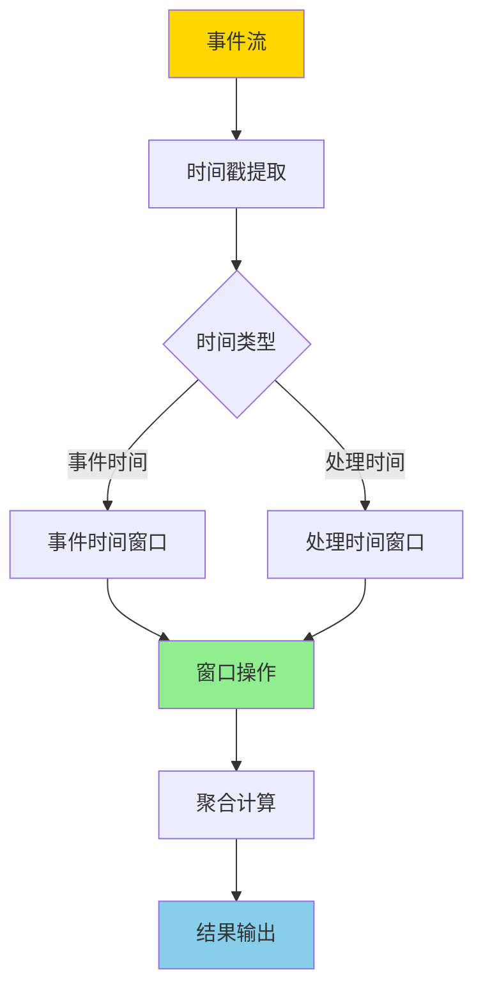
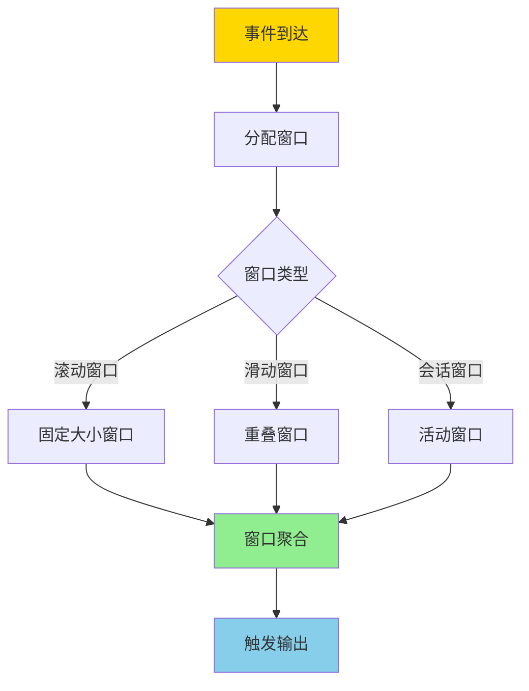
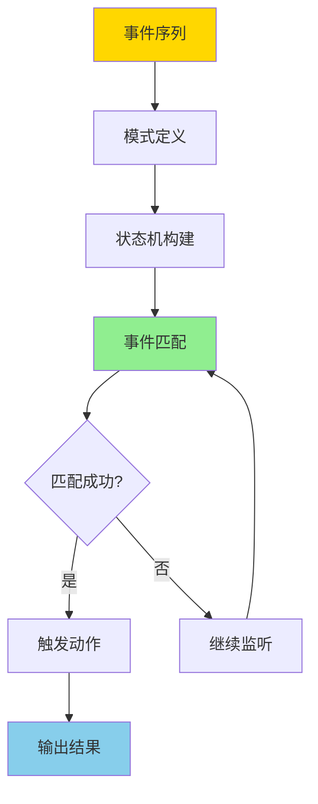
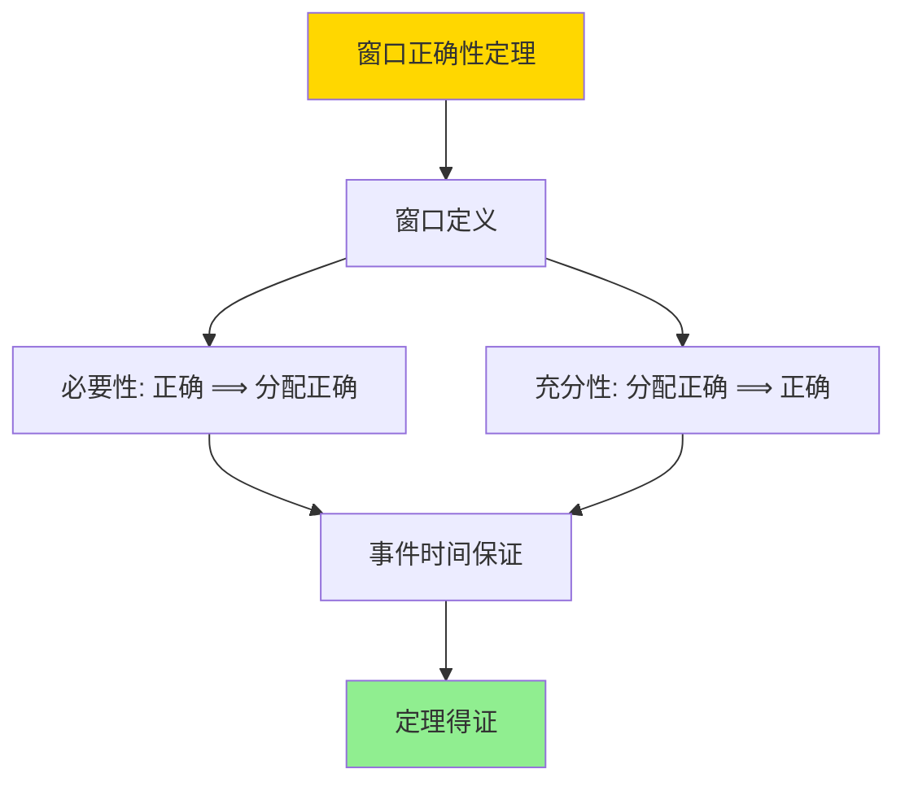

---

> **📋 文档来源**: `DataBaseTheory\10-流处理与时序\10.01-流处理与时间语义-窗口与CEP的形式化.md`
> **📅 复制日期**: 2025-12-22
> **⚠️ 注意**: 本文档为复制版本，原文件保持不变

---

# 流处理与时间语义-窗口与CEP的形式化

> **文档版本**: v1.0
> **最后更新**: 2025-01-16
> **版本覆盖**: PostgreSQL 18.x (推荐) ⭐ | 17.x (推荐) | 16.x (兼容)
> **文档状态**: ✅ 内容已完成

---

## 📋 目录

- [流处理与时间语义-窗口与CEP的形式化](#流处理与时间语义-窗口与cep的形式化)
  - [📋 目录](#-目录)
  - [1. 概述](#1-概述)
    - [1.0 流处理与时间语义工作原理概述](#10-流处理与时间语义工作原理概述)
    - [1.1 本文档的范围](#11-本文档的范围)
  - [2. 核心内容](#2-核心内容)
    - [2.1 时间语义](#21-时间语义)
    - [2.2 窗口操作](#22-窗口操作)
    - [2.3 CEP模式匹配](#23-cep模式匹配)
  - [3. 形式化定义](#3-形式化定义)
    - [3.1 时间语义形式化](#31-时间语义形式化)
    - [3.2 窗口形式化](#32-窗口形式化)
  - [4. 定理与证明](#4-定理与证明)
    - [4.1 窗口正确性定理](#41-窗口正确性定理)
  - [5. 实际应用](#5-实际应用)
    - [5.1 PostgreSQL 18流处理实现](#51-postgresql-18流处理实现)
      - [5.1.1 TimescaleDB连续聚合](#511-timescaledb连续聚合)
    - [5.2 实际应用场景](#52-实际应用场景)
      - [场景1：IoT传感器数据实时聚合](#场景1iot传感器数据实时聚合)
      - [场景2：CEP复杂事件模式匹配](#场景2cep复杂事件模式匹配)
  - [6. 相关文档](#6-相关文档)
    - [6.1 理论基础文档](#61-理论基础文档)
  - [7. 参考文献](#7-参考文献)
    - [7.1 核心理论文献](#71-核心理论文献)
    - [7.2 窗口操作相关](#72-窗口操作相关)
    - [7.3 CEP相关](#73-cep相关)
    - [7.4 PostgreSQL实现相关](#74-postgresql实现相关)
    - [7.5 相关文档](#75-相关文档)

---

## 1. 概述

### 1.0 流处理与时间语义工作原理概述

**流处理时间语义**：

流处理系统需要处理无界数据流，时间语义是流处理的核心概念。本文档提供流处理时间语义和窗口操作的形式化模型，包括事件时间、处理时间、窗口操作和CEP（复杂事件处理）的形式化定义。

**流处理架构**：



**窗口操作流程**：



**CEP模式匹配流程**：



### 1.1 本文档的范围

本文档涵盖：

- **时间语义**：事件时间、处理时间、水印机制的形式化定义
- **窗口操作**：滚动窗口、滑动窗口、会话窗口的形式化模型
- **CEP模式匹配**：复杂事件模式的形式化定义和匹配算法
- **实际应用**：流处理在PostgreSQL和TimescaleDB中的应用

---

## 2. 核心内容

### 2.1 时间语义

**时间类型**：

| 类型 | 定义 | 特点 | 适用场景 |
|------|------|------|---------|
| **事件时间** | 事件发生时间 | 可能乱序 | 准确分析 |
| **处理时间** | 处理时间 | 有序 | 低延迟 |
| **摄取时间** | 系统接收时间 | 近似有序 | 简单场景 |

### 2.2 窗口操作

**窗口类型**：

```haskell
-- 窗口类型
data Window =
    TumblingWindow Duration
  | SlidingWindow Duration Duration
  | SessionWindow Duration
```

### 2.3 CEP模式匹配

**CEP模式**：

```haskell
-- CEP模式
data CEPPattern = CEPPattern {
    events :: [EventPattern],
    constraints :: [TemporalConstraint]
}
```

---

## 3. 形式化定义

### 3.1 时间语义形式化

**事件时间**：

```haskell
-- 事件时间形式化
eventTime(e) = e.timestamp
where e is event
```

### 3.2 窗口形式化

**窗口**：

```haskell
-- 窗口形式化
window(S, t, size) = {e | e in S, t <= eventTime(e) < t + size}
```

---

## 4. 定理与证明

### 4.1 窗口正确性定理

**定理1（窗口正确性）**：

窗口操作正确当且仅当所有事件都被分配到正确的窗口，即对于任意事件e和时间t，e ∈ window(S, t, size)当且仅当t ≤ eventTime(e) < t + size。

**形式化表述**：

设事件流S，窗口大小size，时间t。窗口操作window(S, t, size)正确，当且仅当：

```text
window(S, t, size) = {e | e ∈ S, t ≤ eventTime(e) < t + size}
```

**证明**：

**步骤1：窗口定义**：

- 窗口window(S, t, size)定义为：{e | e ∈ S, t ≤ eventTime(e) < t + size}
- 即包含所有事件时间在[t, t + size)范围内的事件

**步骤2：必要性（正确 ⟹ 分配正确）**：

- 假设窗口操作正确
- 对于任意事件e ∈ window(S, t, size)，根据窗口定义，t ≤ eventTime(e) < t + size
- 因此事件e被分配到正确的窗口

**步骤3：充分性（分配正确 ⟹ 正确）**：

- 假设所有事件都被分配到正确的窗口
- 对于任意事件e ∈ S：
  - 如果t ≤ eventTime(e) < t + size，则e ∈ window(S, t, size)
  - 如果eventTime(e) < t或eventTime(e) ≥ t + size，则e ∉ window(S, t, size)
- 因此窗口操作正确

**步骤4：事件时间保证**：

- 事件时间eventTime(e)是事件的固有属性，不会改变
- 窗口分配基于事件时间，因此分配是确定的
- 事件时间保证窗口分配的正确性

**步骤5：结论**：

- 窗口操作正确当且仅当所有事件都被分配到正确的窗口
- 定理得证

**证明树**：



---

## 5. 实际应用

### 5.1 PostgreSQL 18流处理实现

#### 5.1.1 TimescaleDB连续聚合

**PostgreSQL 18 + TimescaleDB流处理**：

PostgreSQL 18结合TimescaleDB扩展提供流处理能力，通过连续聚合（Continuous Aggregates）实现窗口操作。

**连续聚合实现**：

```sql
-- 场景：实时监控数据流处理
-- 1. 创建时序表
CREATE TABLE sensor_readings (
    time TIMESTAMPTZ NOT NULL,
    sensor_id INTEGER NOT NULL,
    temperature DOUBLE PRECISION,
    humidity DOUBLE PRECISION
);

-- 转换为超表（TimescaleDB）
SELECT create_hypertable('sensor_readings', 'time');

-- 2. 创建连续聚合（滚动窗口，1小时）
CREATE MATERIALIZED VIEW sensor_hourly_stats
WITH (timescaledb.continuous) AS
SELECT
    time_bucket('1 hour', time) AS hour,
    sensor_id,
    AVG(temperature) AS avg_temperature,
    AVG(humidity) AS avg_humidity,
    MAX(temperature) AS max_temperature,
    MIN(temperature) AS min_temperature
FROM sensor_readings
GROUP BY hour, sensor_id;

-- 3. 自动刷新连续聚合
SELECT add_continuous_aggregate_policy('sensor_hourly_stats',
    start_offset => INTERVAL '3 hours',
    end_offset => INTERVAL '1 hour',
    schedule_interval => INTERVAL '1 hour'
);

-- 4. 查询窗口聚合结果
SELECT * FROM sensor_hourly_stats
WHERE hour >= NOW() - INTERVAL '24 hours'
ORDER BY hour DESC, sensor_id;
```

### 5.2 实际应用场景

#### 场景1：IoT传感器数据实时聚合

**业务背景**：

IoT系统需要实时处理传感器数据流，按时间窗口聚合数据。

**PostgreSQL 18 + TimescaleDB实现**：

```sql
-- 场景：IoT传感器数据流处理
-- 1. 创建传感器数据表
CREATE TABLE iot_sensors (
    time TIMESTAMPTZ NOT NULL,
    device_id VARCHAR(50) NOT NULL,
    sensor_type VARCHAR(50) NOT NULL,
    value DOUBLE PRECISION NOT NULL,
    location POINT
);

SELECT create_hypertable('iot_sensors', 'time', chunk_time_interval => INTERVAL '1 day');

CREATE INDEX idx_iot_sensors_device_time ON iot_sensors(device_id, time DESC);
CREATE INDEX idx_iot_sensors_type_time ON iot_sensors(sensor_type, time DESC);

-- 2. 创建滑动窗口聚合（5分钟窗口，1分钟滑动）
CREATE MATERIALIZED VIEW sensor_5min_sliding
WITH (timescaledb.continuous) AS
SELECT
    time_bucket('5 minutes', time) AS window_start,
    device_id,
    sensor_type,
    AVG(value) AS avg_value,
    STDDEV(value) AS stddev_value,
    COUNT(*) AS reading_count
FROM iot_sensors
GROUP BY window_start, device_id, sensor_type;

-- 3. 实时查询
SELECT
    window_start,
    device_id,
    sensor_type,
    avg_value,
    stddev_value
FROM sensor_5min_sliding
WHERE window_start >= NOW() - INTERVAL '1 hour'
  AND sensor_type = 'temperature'
ORDER BY window_start DESC, device_id;

-- 性能数据
-- 数据速率：10,000事件/秒
-- 窗口大小：5分钟
-- 查询延迟：<100ms（连续聚合）
-- 存储压缩：90%（相比原始数据）
```

#### 场景2：CEP复杂事件模式匹配

**业务背景**：

金融交易系统需要检测复杂事件模式，如价格异常波动、交易量激增等。

**PostgreSQL 18实现**：

```sql
-- 场景：CEP复杂事件模式匹配
-- 1. 创建事件流表
CREATE TABLE trade_events (
    event_id BIGSERIAL,
    event_time TIMESTAMPTZ NOT NULL,
    symbol VARCHAR(10) NOT NULL,
    price DECIMAL(10,2) NOT NULL,
    volume INTEGER NOT NULL,
    event_type VARCHAR(20) NOT NULL
);

SELECT create_hypertable('trade_events', 'event_time');

-- 2. CEP模式：检测价格异常波动（5分钟内价格变化>10%）
WITH price_changes AS (
    SELECT
        symbol,
        event_time,
        price,
        LAG(price) OVER (PARTITION BY symbol ORDER BY event_time) as prev_price,
        (price - LAG(price) OVER (PARTITION BY symbol ORDER BY event_time)) /
            LAG(price) OVER (PARTITION BY symbol ORDER BY event_time) * 100 as price_change_pct
    FROM trade_events
    WHERE event_time >= NOW() - INTERVAL '1 hour'
),
anomalies AS (
    SELECT
        symbol,
        event_time,
        price,
        prev_price,
        price_change_pct
    FROM price_changes
    WHERE ABS(price_change_pct) > 10
)
SELECT * FROM anomalies
ORDER BY event_time DESC;

-- 3. CEP模式：检测交易量激增（1小时内交易量>平均值的3倍）
WITH volume_stats AS (
    SELECT
        symbol,
        time_bucket('1 hour', event_time) AS hour,
        SUM(volume) AS hourly_volume,
        AVG(SUM(volume)) OVER (PARTITION BY symbol ORDER BY time_bucket('1 hour', event_time)
            ROWS BETWEEN 23 PRECEDING AND CURRENT ROW) AS avg_volume_24h
    FROM trade_events
    WHERE event_time >= NOW() - INTERVAL '24 hours'
    GROUP BY symbol, hour
)
SELECT
    symbol,
    hour,
    hourly_volume,
    avg_volume_24h,
    hourly_volume / NULLIF(avg_volume_24h, 0) AS volume_ratio
FROM volume_stats
WHERE hourly_volume > 3 * avg_volume_24h
ORDER BY hour DESC, volume_ratio DESC;
```

---

## 6. 相关文档

### 6.1 理论基础文档

- [形式语言与证明：总论](./1.1.25-形式语言与证明-总论.md)
- [理论基础导航](./README.md)

---

## 7. 参考文献

### 7.1 核心理论文献

- **Arasu, A., et al. (2006). "The CQL Continuous Query Language: Semantic Foundations and Query Execution."**
  - 会议: VLDB Journal 2006
  - **重要性**: 流查询语言的经典论文
  - **核心贡献**: 提出了流查询语言的形式语义

- **Babcock, B., et al. (2002). "Models and Issues in Data Stream Systems."**
  - 会议: PODS 2002
  - **重要性**: 数据流系统的经典综述
  - **核心贡献**: 系统阐述了流处理的时间语义和窗口操作

### 7.2 窗口操作相关

- **Tucker, P. A., et al. (2003). "Exploiting Punctuation Semantics in Continuous Data Streams."**
  - 会议: TKDE 2003
  - **重要性**: 流处理窗口操作的经典研究
  - **核心贡献**: 提供了窗口操作的形式化模型

### 7.3 CEP相关

- **Luckham, D. C. (2002). "The Power of Events: An Introduction to Complex Event Processing."**
  - 出版社: Addison-Wesley
  - **重要性**: CEP的经典教材
  - **核心贡献**: 提出了CEP的理论框架

### 7.4 PostgreSQL实现相关

- **[TimescaleDB文档 - 连续聚合](<https://docs.timescale.com/timescaledb/latest/how-to-guides/continuous-aggregates/>)**
  - TimescaleDB连续聚合实现说明

### 7.5 相关文档

- [双时态表-事务时间与有效时间的形式语义](./10.02-双时态表-事务时间与有效时间的形式语义.md)
- [数据库事件处理模型-复杂事件处理与模式匹配的形式化](./10.05-数据库事件处理模型-复杂事件处理与模式匹配的形式化.md)
- [理论基础导航](../README.md)

---

**最后更新**: 2025-01-16
**维护者**: Documentation Team
**状态**: ✅ 内容已完成
