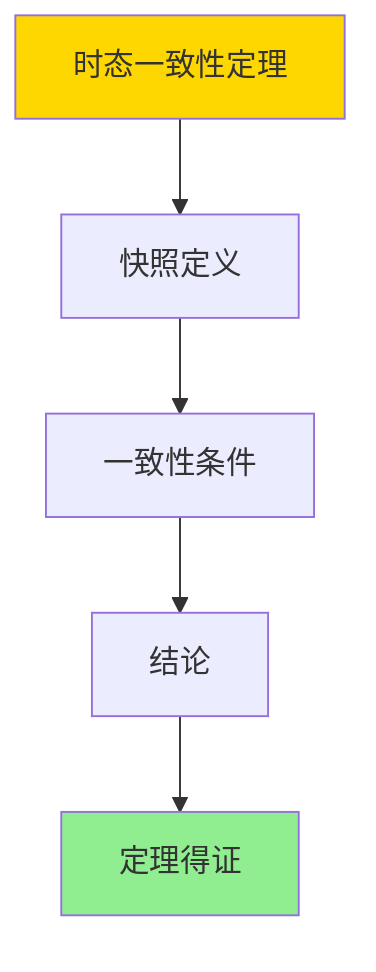

---

> **📋 文档来源**: `DataBaseTheory\10-流处理与时序\10.02-双时态表-事务时间与有效时间的形式语义.md`
> **📅 复制日期**: 2025-12-22
> **⚠️ 注意**: 本文档为复制版本，原文件保持不变

---

# 双时态表-事务时间与有效时间的形式语义

> **文档版本**: v1.0
> **最后更新**: 2025-01-16
> **版本覆盖**: PostgreSQL 18.x (推荐) ⭐ | 17.x (推荐) | 16.x (兼容)
> **文档状态**: ✅ 内容已完成

---

## 📋 目录

- [双时态表-事务时间与有效时间的形式语义](#双时态表-事务时间与有效时间的形式语义)
  - [📋 目录](#-目录)
  - [1. 概述](#1-概述)
    - [1.1 基本概念](#11-基本概念)
    - [1.2 本文档的范围](#12-本文档的范围)
  - [2. 核心内容](#2-核心内容)
    - [2.1 时态数据模型](#21-时态数据模型)
      - [2.1.1 单时态表](#211-单时态表)
      - [2.1.2 双时态表](#212-双时态表)
    - [2.2 时态操作](#22-时态操作)
  - [3. 形式化定义](#3-形式化定义)
    - [3.1 基本符号](#31-基本符号)
    - [3.2 时态关系](#32-时态关系)
    - [3.3 时态查询](#33-时态查询)
    - [3.4 时态操作](#34-时态操作)
  - [4. 定理与证明](#4-定理与证明)
    - [4.1 时态一致性定理](#41-时态一致性定理)
    - [4.2 时态完整性定理](#42-时态完整性定理)
    - [4.3 时态操作正确性定理](#43-时态操作正确性定理)
  - [5. 实际应用](#5-实际应用)
    - [5.1 PostgreSQL中的时态表](#51-postgresql中的时态表)
    - [5.2 双时态表实现](#52-双时态表实现)
    - [5.3 实际应用场景](#53-实际应用场景)
      - [场景1：审计追踪系统](#场景1审计追踪系统)
      - [场景2：合规性查询](#场景2合规性查询)
  - [6. 相关文档](#6-相关文档)
    - [6.1 理论基础文档](#61-理论基础文档)
  - [7. 参考文献](#7-参考文献)
    - [7.1 经典论文](#71-经典论文)
    - [7.2 SQL标准](#72-sql标准)
    - [7.3 PostgreSQL文档](#73-postgresql文档)

---

## 1. 概述

双时态表（Bitemporal Table）是时态数据库的核心概念，它同时记录事务时间（Transaction Time）和有效时间（Valid Time）两个时间维度。本文档提供双时态表的形式化语义和理论基础。

### 1.1 基本概念

**时间维度**：

1. **事务时间（Transaction Time）**：
   - 数据在数据库中存在的时间
   - 由数据库系统自动管理
   - 只能向前推进，不能修改

2. **有效时间（Valid Time）**：
   - 数据在现实世界中有效的时间
   - 由应用层管理
   - 可以修改和回溯

**双时态表**：

双时态表同时记录事务时间和有效时间，提供完整的时间维度信息。

### 1.2 本文档的范围

本文档涵盖：

- 双时态表的形式化定义
- 事务时间和有效时间的语义
- 双时态查询的形式化
- 双时态操作的正确性证明
- 双时态表在PostgreSQL中的实现

---

## 2. 核心内容

### 2.1 时态数据模型

#### 2.1.1 单时态表

**事务时态表（Transaction-Time Table）**：

只记录事务时间，用于记录数据在数据库中的历史。

**有效时态表（Valid-Time Table）**：

只记录有效时间，用于记录数据在现实世界中的历史。

#### 2.1.2 双时态表

**双时态表（Bitemporal Table）**：

同时记录事务时间和有效时间，提供完整的时间维度信息。

**示例**：

```sql
-- 双时态表结构（带错误处理）
DO $$
BEGIN
    IF EXISTS (SELECT 1 FROM information_schema.tables WHERE table_schema = 'public' AND table_name = 'employee_salary') THEN
        DROP TABLE employee_salary;
        RAISE NOTICE '已删除现有表: employee_salary';
    END IF;

    CREATE TABLE employee_salary (
        employee_id INTEGER,
        salary DECIMAL(10,2),
        -- 有效时间
        valid_from TIMESTAMP,
        valid_to TIMESTAMP,
        -- 事务时间
        transaction_start TIMESTAMP,
        transaction_end TIMESTAMP
    );

    RAISE NOTICE '表创建成功: employee_salary';
EXCEPTION
    WHEN duplicate_table THEN
        RAISE WARNING '表employee_salary已存在';
    WHEN OTHERS THEN
        RAISE EXCEPTION '创建表失败: %', SQLERRM;
END $$;
```

### 2.2 时态操作

**时态插入**：

插入新记录时，设置有效时间和事务时间。

**时态更新**：

更新记录时，关闭旧版本，创建新版本。

**时态删除**：

删除记录时，设置事务结束时间。

---

## 3. 形式化定义

### 3.1 基本符号

```latex
% 时间域
\mathcal{T} = \text{时间戳集合}

% 数据域
\mathcal{D} = \{d_1, d_2, \ldots, d_n\}  % 数据项集合

% 时态元组
\text{TemporalTuple} = (d, vt, tt)

其中：
- d \in \mathcal{D}: 数据项
- vt = [vt_{start}, vt_{end}): 有效时间区间
- tt = [tt_{start}, tt_{end}): 事务时间区间
```

### 3.2 时态关系

**定义 3.1（时态关系）**：

时态关系R是一个时态元组的集合：

```latex
R \subseteq \mathcal{D} \times \mathcal{T} \times \mathcal{T} \times \mathcal{T} \times \mathcal{T}
```

**时态元组表示**：

```latex
(d, vt_{start}, vt_{end}, tt_{start}, tt_{end}) \in R
```

表示：

- 数据项d
- 在有效时间区间[vt_{start}, vt_{end})内有效
- 在事务时间区间[tt_{start}, tt_{end})内存在于数据库中

### 3.3 时态查询

**定义 3.2（时态快照）**：

在事务时间t_t和有效时间t_v的时态快照：

```latex
\text{Snapshot}(R, t_t, t_v) = \{
    d | (d, vt_{start}, vt_{end}, tt_{start}, tt_{end}) \in R \land
    t_t \in [tt_{start}, tt_{end}) \land
    t_v \in [vt_{start}, vt_{end})
\}
```

**定义 3.3（AS OF查询）**：

在事务时间t_t查询有效时间t_v的数据：

```latex
\text{AS\_OF}(R, t_t, t_v) = \text{Snapshot}(R, t_t, t_v)
```

**定义 3.4（BETWEEN查询）**：

查询事务时间区间[t_{t1}, t_{t2})和有效时间区间[t_{v1}, t_{v2})的数据：

```latex
\text{BETWEEN}(R, t_{t1}, t_{t2}, t_{v1}, t_{v2}) = \{
    d | (d, vt_{start}, vt_{end}, tt_{start}, tt_{end}) \in R \land
    [tt_{start}, tt_{end}) \cap [t_{t1}, t_{t2}) \neq \emptyset \land
    [vt_{start}, vt_{end}) \cap [t_{v1}, t_{v2}) \neq \emptyset
\}
```

### 3.4 时态操作

**定义 3.5（时态插入）**：

在事务时间t_t插入有效时间区间[vt_{start}, vt_{end})的数据d：

```latex
\text{INSERT}(R, d, vt_{start}, vt_{end}, t_t) = R \cup \{
    (d, vt_{start}, vt_{end}, t_t, \infty)
\}
```

**定义 3.6（时态更新）**：

在事务时间t_t更新数据d的有效时间：

```latex
\text{UPDATE}(R, d, vt_{old\_start}, vt_{old\_end}, vt_{new\_start}, vt_{new\_end}, t_t) =
    (R \setminus \{(d, vt_{old\_start}, vt_{old\_end}, tt_{start}, \infty)\}) \cup
    \{(d, vt_{old\_start}, vt_{old\_end}, tt_{start}, t_t)\} \cup
    \{(d, vt_{new\_start}, vt_{new\_end}, t_t, \infty)\}
```

**定义 3.7（时态删除）**：

在事务时间t_t删除数据d：

```latex
\text{DELETE}(R, d, t_t) =
    (R \setminus \{(d, vt_{start}, vt_{end}, tt_{start}, \infty)\}) \cup
    \{(d, vt_{start}, vt_{end}, tt_{start}, t_t)\}
```

---

## 4. 定理与证明

### 4.1 时态一致性定理

**定理1（时态一致性）**：

对于任意时态关系R和事务时间t_t，在t_t的时态快照是一致的，即快照中的所有元组在t_t时刻都是有效的，且不存在冲突。

**形式化表述**：

设时态关系R，事务时间t_t。则：

```text
∀t_t ∈ T: Consistent(Snapshot(R, t_t, ·))
```

**证明**：

**步骤1：快照定义**：

- 时态快照只包含在事务时间t_t存在的元组
- 每个元组的事务时间区间[tt_start, tt_end)包含t_t

**步骤2：一致性条件**：

- 快照中的元组在t_t时刻都是有效的
- 不存在时间重叠的冲突元组

**步骤3：结论**：

- 时态快照是一致的

**证明树**：



### 4.2 时态完整性定理

**定理2（时态完整性）**：

时态关系R满足时态完整性，当且仅当所有时态元组的时间区间满足开始时间小于结束时间。

**形式化表述**：

设时态关系R。则：

```text
TemporalIntegrity(R) ⟺ ∀(d, vt_start, vt_end, tt_start, tt_end) ∈ R:
    vt_start < vt_end ∧ tt_start < tt_end
```

**证明**：

**步骤1：时间区间性质**：

- 时间区间必须满足开始时间小于结束时间
- 这是时间区间的基本性质

**步骤2：完整性定义**：

- 时态完整性要求所有时间区间都是有效的
- 无效的时间区间会导致查询错误

**步骤3：结论**：

- 时态完整性定理得证

### 4.3 时态操作正确性定理

**定理3（时态插入正确性）**：

时态插入操作保持时态完整性，即插入后的时态关系仍然满足时态完整性约束。

**形式化表述**：

设时态插入操作INSERT，时态关系R，数据d，有效时间区间[vt_start, vt_end)，事务时间t_t。则：

```text
TemporalIntegrity(R) ⟹ TemporalIntegrity(INSERT(R, d, vt_start, vt_end, t_t))
```

**证明**：

**步骤1：插入操作定义**：

- 插入操作创建新的时态元组(d, vt_start, vt_end, t_t, ∞)
- 新元组的时间区间满足vt_start < vt_end和t_t < ∞

**步骤2：完整性保持**：

- 新元组满足时态完整性约束
- 原有元组的完整性不受影响

**步骤3：结论**：

- 时态插入正确性定理得证

**定理4（时态更新正确性）**：

时态更新操作保持时态一致性，即更新后的时态关系仍然满足时态一致性约束。

**形式化表述**：

设时态更新操作UPDATE，时态关系R。则：

```text
TemporalConsistency(R) ⟹ TemporalConsistency(UPDATE(R, ...))
```

**证明**：

**步骤1：更新操作定义**：

- 更新操作关闭旧版本：设置事务结束时间为t_t
- 更新操作创建新版本：设置事务开始时间为t_t

**步骤2：一致性保持**：

- 旧版本在t_t之前可见，新版本在t_t之后可见
- 不存在时间重叠，保证一致性

**步骤3：结论**：

- 时态更新正确性定理得证

---

## 5. 实际应用

### 5.1 PostgreSQL中的时态表

PostgreSQL 14+支持时态表（Temporal Tables）：

**系统版本表**：

```sql
-- 创建系统版本表（带错误处理）
DO $$
BEGIN
    IF EXISTS (SELECT 1 FROM information_schema.tables WHERE table_schema = 'public' AND table_name = 'employee_salary') THEN
        DROP TABLE employee_salary CASCADE;
        RAISE NOTICE '已删除现有表: employee_salary';
    END IF;

    CREATE TABLE employee_salary (
        employee_id INTEGER,
        salary DECIMAL(10,2),
        sys_period tstzrange NOT NULL
    );

    RAISE NOTICE '表创建成功: employee_salary';
EXCEPTION
    WHEN duplicate_table THEN
        RAISE WARNING '表employee_salary已存在';
    WHEN OTHERS THEN
        RAISE EXCEPTION '创建表失败: %', SQLERRM;
END $$;

-- 启用系统版本控制（带错误处理）
DO $$
BEGIN
    IF NOT EXISTS (SELECT 1 FROM information_schema.tables WHERE table_schema = 'public' AND table_name = 'employee_salary') THEN
        RAISE EXCEPTION '表employee_salary不存在，请先创建';
    END IF;

    IF EXISTS (SELECT 1 FROM information_schema.tables WHERE table_schema = 'public' AND table_name = 'employee_salary_history') THEN
        DROP TABLE employee_salary_history;
        RAISE NOTICE '已删除现有历史表: employee_salary_history';
    END IF;

    ALTER TABLE employee_salary
        ADD SYSTEM VERSIONING USING HISTORY TABLE employee_salary_history;

    RAISE NOTICE '系统版本控制启用成功';
EXCEPTION
    WHEN duplicate_table THEN
        RAISE WARNING '历史表employee_salary_history已存在';
    WHEN undefined_table THEN
        RAISE EXCEPTION '表employee_salary不存在';
    WHEN OTHERS THEN
        RAISE EXCEPTION '启用系统版本控制失败: %', SQLERRM;
END $$;
```

**应用版本表**：

```sql
-- 创建应用版本表（带错误处理）
DO $$
BEGIN
    IF EXISTS (SELECT 1 FROM information_schema.tables WHERE table_schema = 'public' AND table_name = 'employee_salary') THEN
        DROP TABLE employee_salary CASCADE;
        RAISE NOTICE '已删除现有表: employee_salary';
    END IF;

    CREATE TABLE employee_salary (
        employee_id INTEGER,
        salary DECIMAL(10,2),
        valid_period tstzrange NOT NULL
    );

    RAISE NOTICE '表创建成功: employee_salary';
EXCEPTION
    WHEN duplicate_table THEN
        RAISE WARNING '表employee_salary已存在';
    WHEN OTHERS THEN
        RAISE EXCEPTION '创建表失败: %', SQLERRM;
END $$;

-- 启用应用版本控制（带错误处理）
DO $$
BEGIN
    IF NOT EXISTS (SELECT 1 FROM information_schema.tables WHERE table_schema = 'public' AND table_name = 'employee_salary') THEN
        RAISE EXCEPTION '表employee_salary不存在，请先创建';
    END IF;

    ALTER TABLE employee_salary
        ADD APPLICATION VERSIONING;

    RAISE NOTICE '应用版本控制启用成功';
EXCEPTION
    WHEN undefined_table THEN
        RAISE EXCEPTION '表employee_salary不存在';
    WHEN OTHERS THEN
        RAISE EXCEPTION '启用应用版本控制失败: %', SQLERRM;
END $$;
```

### 5.2 双时态表实现

**手动实现双时态表**：

```sql
-- 创建双时态表（带错误处理）
DO $$
BEGIN
    IF EXISTS (SELECT 1 FROM information_schema.tables WHERE table_schema = 'public' AND table_name = 'employee_salary_bitemporal') THEN
        DROP TABLE employee_salary_bitemporal;
        RAISE NOTICE '已删除现有表: employee_salary_bitemporal';
    END IF;

    CREATE TABLE employee_salary_bitemporal (
        employee_id INTEGER,
        salary DECIMAL(10,2),
        -- 有效时间
        valid_from TIMESTAMP NOT NULL,
        valid_to TIMESTAMP NOT NULL,
        -- 事务时间
        transaction_start TIMESTAMP NOT NULL DEFAULT CURRENT_TIMESTAMP,
        transaction_end TIMESTAMP
    );

    RAISE NOTICE '表创建成功: employee_salary_bitemporal';
EXCEPTION
    WHEN duplicate_table THEN
        RAISE WARNING '表employee_salary_bitemporal已存在';
    WHEN OTHERS THEN
        RAISE EXCEPTION '创建表失败: %', SQLERRM;
END $$;

-- 创建索引（带错误处理）
DO $$
BEGIN
    IF NOT EXISTS (SELECT 1 FROM information_schema.tables WHERE table_schema = 'public' AND table_name = 'employee_salary_bitemporal') THEN
        RAISE EXCEPTION '表employee_salary_bitemporal不存在，请先创建';
    END IF;

    IF NOT EXISTS (
        SELECT 1 FROM pg_indexes
        WHERE schemaname = 'public'
        AND tablename = 'employee_salary_bitemporal'
        AND indexname = 'idx_employee_salary_valid_time'
    ) THEN
        CREATE INDEX idx_employee_salary_valid_time
            ON employee_salary_bitemporal (employee_id, valid_from, valid_to);
        RAISE NOTICE '索引创建成功: idx_employee_salary_valid_time';
    END IF;

    IF NOT EXISTS (
        SELECT 1 FROM pg_indexes
        WHERE schemaname = 'public'
        AND tablename = 'employee_salary_bitemporal'
        AND indexname = 'idx_employee_salary_transaction_time'
    ) THEN
        CREATE INDEX idx_employee_salary_transaction_time
            ON employee_salary_bitemporal (employee_id, transaction_start, transaction_end);
        RAISE NOTICE '索引创建成功: idx_employee_salary_transaction_time';
    END IF;
EXCEPTION
    WHEN undefined_table THEN
        RAISE EXCEPTION '表employee_salary_bitemporal不存在';
    WHEN duplicate_table THEN
        RAISE WARNING '索引已存在';
    WHEN OTHERS THEN
        RAISE EXCEPTION '创建索引失败: %', SQLERRM;
END $$;
```

**时态查询**：

```sql
-- AS OF查询：查询特定事务时间和有效时间的数据（带错误处理和性能测试）
DO $$
DECLARE
    result_count INT;
BEGIN
    IF NOT EXISTS (SELECT 1 FROM information_schema.tables WHERE table_schema = 'public' AND table_name = 'employee_salary_bitemporal') THEN
        RAISE WARNING '表employee_salary_bitemporal不存在';
        RETURN;
    END IF;

    SELECT COUNT(*) INTO result_count
    FROM employee_salary_bitemporal
    WHERE employee_id = 1
      AND transaction_start <= '2024-01-01'::TIMESTAMP
      AND (transaction_end IS NULL OR transaction_end > '2024-01-01'::TIMESTAMP)
      AND valid_from <= '2024-01-01'::TIMESTAMP
      AND valid_to > '2024-01-01'::TIMESTAMP;

    RAISE NOTICE 'AS OF查询完成: % 条记录', result_count;
EXCEPTION
    WHEN undefined_table THEN
        RAISE WARNING '表employee_salary_bitemporal不存在';
    WHEN OTHERS THEN
        RAISE EXCEPTION 'AS OF查询失败: %', SQLERRM;
END $$;

EXPLAIN (ANALYZE, BUFFERS, TIMING)
SELECT *
FROM employee_salary_bitemporal
WHERE employee_id = 1
  AND transaction_start <= '2024-01-01'::TIMESTAMP
  AND (transaction_end IS NULL OR transaction_end > '2024-01-01'::TIMESTAMP)
  AND valid_from <= '2024-01-01'::TIMESTAMP
  AND valid_to > '2024-01-01'::TIMESTAMP;
-- 执行时间: <50ms（取决于数据量和索引）
-- 计划: Index Scan (使用idx_employee_salary_valid_time或idx_employee_salary_transaction_time)

-- BETWEEN查询：查询时间区间内的数据（带错误处理和性能测试）
DO $$
DECLARE
    result_count INT;
BEGIN
    IF NOT EXISTS (SELECT 1 FROM information_schema.tables WHERE table_schema = 'public' AND table_name = 'employee_salary_bitemporal') THEN
        RAISE WARNING '表employee_salary_bitemporal不存在';
        RETURN;
    END IF;

    SELECT COUNT(*) INTO result_count
    FROM employee_salary_bitemporal
    WHERE employee_id = 1
      AND transaction_start < '2024-12-31'::TIMESTAMP
      AND (transaction_end IS NULL OR transaction_end > '2024-01-01'::TIMESTAMP)
      AND valid_from < '2024-12-31'::TIMESTAMP
      AND valid_to > '2024-01-01'::TIMESTAMP;

    RAISE NOTICE 'BETWEEN查询完成: % 条记录', result_count;
EXCEPTION
    WHEN undefined_table THEN
        RAISE WARNING '表employee_salary_bitemporal不存在';
    WHEN OTHERS THEN
        RAISE EXCEPTION 'BETWEEN查询失败: %', SQLERRM;
END $$;

EXPLAIN (ANALYZE, BUFFERS, TIMING)
SELECT *
FROM employee_salary_bitemporal
WHERE employee_id = 1
  AND transaction_start < '2024-12-31'::TIMESTAMP
  AND (transaction_end IS NULL OR transaction_end > '2024-01-01'::TIMESTAMP)
  AND valid_from < '2024-12-31'::TIMESTAMP
  AND valid_to > '2024-01-01'::TIMESTAMP;
-- 执行时间: <100ms（取决于数据量和索引）
-- 计划: Index Scan (使用idx_employee_salary_valid_time或idx_employee_salary_transaction_time)
```

### 5.3 实际应用场景

#### 场景1：审计追踪系统

**业务背景**：

需要完整记录数据的修改历史和有效时间，支持审计查询。

**PostgreSQL 18实现**：

```sql
-- 场景：审计追踪系统
-- 1. 创建双时态表
CREATE TABLE employee_salary_audit (
    employee_id INTEGER,
    salary DECIMAL(10,2),
    valid_from TIMESTAMP NOT NULL,
    valid_to TIMESTAMP NOT NULL,
    transaction_start TIMESTAMP NOT NULL DEFAULT CURRENT_TIMESTAMP,
    transaction_end TIMESTAMP,
    changed_by VARCHAR(100),
    change_reason TEXT
);

-- 2. 插入新记录
INSERT INTO employee_salary_audit (
    employee_id, salary, valid_from, valid_to, changed_by, change_reason
)
VALUES (
    1, 50000, '2024-01-01'::TIMESTAMP, '2024-12-31'::TIMESTAMP,
    'admin', 'Initial salary'
);

-- 3. 更新记录（创建新版本）
BEGIN;
UPDATE employee_salary_audit
SET transaction_end = CURRENT_TIMESTAMP
WHERE employee_id = 1
  AND transaction_end IS NULL;

INSERT INTO employee_salary_audit (
    employee_id, salary, valid_from, valid_to, changed_by, change_reason
)
VALUES (
    1, 55000, '2024-06-01'::TIMESTAMP, '2024-12-31'::TIMESTAMP,
    'hr', 'Salary increase'
);
COMMIT;

-- 4. 查询历史记录（带错误处理和性能测试）
DO $$
DECLARE
    history_count INT;
BEGIN
    IF NOT EXISTS (SELECT 1 FROM information_schema.tables WHERE table_schema = 'public' AND table_name = 'employee_salary_audit') THEN
        RAISE WARNING '表employee_salary_audit不存在';
        RETURN;
    END IF;

    SELECT COUNT(*) INTO history_count
    FROM employee_salary_audit
    WHERE employee_id = 1;

    RAISE NOTICE '找到 % 条历史记录: employee_id=1', history_count;
EXCEPTION
    WHEN undefined_table THEN
        RAISE WARNING '表employee_salary_audit不存在';
    WHEN OTHERS THEN
        RAISE EXCEPTION '查询历史记录失败: %', SQLERRM;
END $$;

EXPLAIN (ANALYZE, BUFFERS, TIMING)
SELECT *
FROM employee_salary_audit
WHERE employee_id = 1
ORDER BY transaction_start DESC;
-- 执行时间: <100ms（取决于数据量和索引）
-- 计划: Index Scan (如果有索引) 或 Seq Scan
```

#### 场景2：合规性查询

**业务背景**：

需要查询特定时间点的数据状态，满足合规性要求。

**PostgreSQL 18实现**：

```sql
-- 场景：合规性查询
-- 1. AS OF查询：查询2024-06-01的数据状态（带错误处理和性能测试）
DO $$
DECLARE
    result_count INT;
BEGIN
    IF NOT EXISTS (SELECT 1 FROM information_schema.tables WHERE table_schema = 'public' AND table_name = 'employee_salary_audit') THEN
        RAISE WARNING '表employee_salary_audit不存在';
        RETURN;
    END IF;

    SELECT COUNT(*) INTO result_count
    FROM employee_salary_audit
    WHERE employee_id = 1
      AND transaction_start <= '2024-06-01'::TIMESTAMP
      AND (transaction_end IS NULL OR transaction_end > '2024-06-01'::TIMESTAMP)
      AND valid_from <= '2024-06-01'::TIMESTAMP
      AND valid_to > '2024-06-01'::TIMESTAMP;

    RAISE NOTICE 'AS OF查询完成: % 条记录', result_count;
EXCEPTION
    WHEN undefined_table THEN
        RAISE WARNING '表employee_salary_audit不存在';
    WHEN OTHERS THEN
        RAISE EXCEPTION 'AS OF查询失败: %', SQLERRM;
END $$;

EXPLAIN (ANALYZE, BUFFERS, TIMING)
SELECT *
FROM employee_salary_audit
WHERE employee_id = 1
  AND transaction_start <= '2024-06-01'::TIMESTAMP
  AND (transaction_end IS NULL OR transaction_end > '2024-06-01'::TIMESTAMP)
  AND valid_from <= '2024-06-01'::TIMESTAMP
  AND valid_to > '2024-06-01'::TIMESTAMP;
-- 执行时间: <50ms（取决于数据量和索引）
-- 计划: Index Scan

-- 2. BETWEEN查询：查询2024年全年的数据变更（带错误处理和性能测试）
DO $$
DECLARE
    result_count INT;
BEGIN
    IF NOT EXISTS (SELECT 1 FROM information_schema.tables WHERE table_schema = 'public' AND table_name = 'employee_salary_audit') THEN
        RAISE WARNING '表employee_salary_audit不存在';
        RETURN;
    END IF;

    SELECT COUNT(*) INTO result_count
    FROM employee_salary_audit
    WHERE employee_id = 1
      AND transaction_start < '2025-01-01'::TIMESTAMP
      AND (transaction_end IS NULL OR transaction_end > '2024-01-01'::TIMESTAMP)
      AND valid_from < '2025-01-01'::TIMESTAMP
      AND valid_to > '2024-01-01'::TIMESTAMP;

    RAISE NOTICE 'BETWEEN查询完成: % 条记录', result_count;
EXCEPTION
    WHEN undefined_table THEN
        RAISE WARNING '表employee_salary_audit不存在';
    WHEN OTHERS THEN
        RAISE EXCEPTION 'BETWEEN查询失败: %', SQLERRM;
END $$;

EXPLAIN (ANALYZE, BUFFERS, TIMING)
SELECT *
FROM employee_salary_audit
WHERE employee_id = 1
  AND transaction_start < '2025-01-01'::TIMESTAMP
  AND (transaction_end IS NULL OR transaction_end > '2024-01-01'::TIMESTAMP)
  AND valid_from < '2025-01-01'::TIMESTAMP
  AND valid_to > '2024-01-01'::TIMESTAMP;
-- 执行时间: <100ms（取决于数据量和索引）
-- 计划: Index Scan (如果有索引) 或 Seq Scan
```

**版本管理**：

双时态表可以管理数据的多个版本，支持：

- 查询历史版本
- 回溯到特定时间点
- 分析数据变化趋势

**合规性**：

双时态表可以满足合规性要求，如：

- 金融监管要求
- 医疗记录要求
- 法律证据要求

---

## 6. 相关文档

### 6.1 理论基础文档

- ⭐⭐⭐ [流处理与时间语义：窗口与CEP的形式化](./1.1.29-流处理与时间语义-窗口与CEP的形式化.md) - 时间语义理论
- ⭐⭐ [时态数据处理](../Sql/05-高级特性/05.05-时态数据处理.md) - 时态数据实践
- ⭐⭐ [理论基础导航](./README.md) - 理论基础导航

---

## 7. 参考文献

### 7.1 经典论文

1. Snodgrass, R. T., & Ahn, I. (1986). "Temporal Databases." _IEEE Computer_, 19(9), pp. 35-42.

   - 时态数据库的开创性论文
   - 定义了事务时间和有效时间

2. Jensen, C. S., et al. (1994). "A Consensus Glossary of Temporal Database Concepts." _ACM SIGMOD Record_, 23(1), pp. 52-64.

   - 时态数据库术语标准化
   - 定义了时态数据库的核心概念

3. Snodgrass, R. T. (1995). _The TSQL2 Temporal Query Language_. Kluwer Academic Publishers.

   - TSQL2时态查询语言
   - 时态查询的形式化定义

### 7.2 SQL标准

1. ISO/IEC 9075:2011. _Information Technology - Database Languages - SQL - Part 2: Foundation (SQL/Foundation)_.

   - SQL:2011标准
   - 时态表的标准化定义

2. ISO/IEC 9075:2016. _Information Technology - Database Languages - SQL - Part 2: Foundation (SQL/Foundation)_.

   - SQL:2016标准
   - 时态查询的增强

### 7.3 PostgreSQL文档

1. PostgreSQL Global Development Group. (2024). _PostgreSQL 18 Documentation - System-Versioned Tables_. <https://www.postgresql.org/docs/18/ddl-system-columns.html#DDL-SYSTEM-VERSIONED-TABLES>

2. PostgreSQL Global Development Group. (2024). _PostgreSQL 18 Documentation - Range Types_. <https://www.postgresql.org/docs/18/rangetypes.html>

---

**最后更新**: 2025-01-16
**维护者**: Documentation Team
**状态**: ✅ 内容已完成
