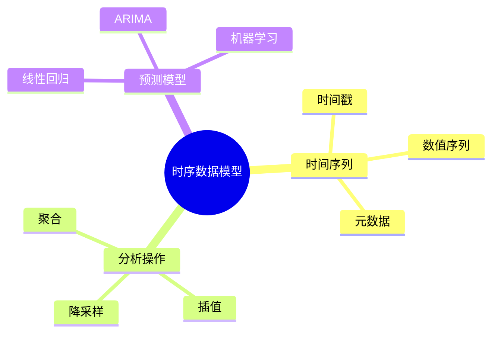

---

> **📋 文档来源**: `DataBaseTheory\10-流处理与时序\10.03-数据库时序数据模型-时间序列分析与预测的形式化.md`
> **📅 复制日期**: 2025-12-22
> **⚠️ 注意**: 本文档为复制版本，原文件保持不变

---

# 数据库时序数据模型-时间序列分析与预测的形式化

> **文档版本**: v1.0
> **最后更新**: 2025-01-16
> **版本覆盖**: PostgreSQL 18.x (推荐) ⭐ | 17.x (推荐) | 16.x (兼容)
> **文档状态**: ✅ 内容已完成

---

## 📋 目录

- [数据库时序数据模型-时间序列分析与预测的形式化](#数据库时序数据模型-时间序列分析与预测的形式化)
  - [📋 目录](#-目录)
  - [1. 概述](#1-概述)
    - [1.0 时序数据模型工作原理概述](#10-时序数据模型工作原理概述)
    - [1.1 本文档的范围](#11-本文档的范围)
  - [2. 核心内容](#2-核心内容)
    - [2.1 时间序列模型](#21-时间序列模型)
    - [2.2 时间序列分析](#22-时间序列分析)
    - [2.3 时间序列预测](#23-时间序列预测)
  - [3. 形式化定义](#3-形式化定义)
    - [3.1 时间序列形式化](#31-时间序列形式化)
    - [3.2 预测模型形式化](#32-预测模型形式化)
  - [4. 实际应用](#4-实际应用)
    - [4.1 PostgreSQL时序支持](#41-postgresql时序支持)
    - [4.2 TimescaleDB高级功能](#42-timescaledb高级功能)
    - [4.3 时间序列预测实现](#43-时间序列预测实现)
    - [4.4 时间序列分析最佳实践](#44-时间序列分析最佳实践)
  - [5. PostgreSQL 18新特性](#5-postgresql-18新特性)
    - [5.1 异步I/O优化](#51-异步io优化)
    - [5.2 并行查询优化](#52-并行查询优化)
    - [5.3 JSONB性能优化](#53-jsonb性能优化)
  - [6. 相关文档](#6-相关文档)
    - [6.1 理论基础文档](#61-理论基础文档)
  - [7. 参考文献](#7-参考文献)
    - [7.1 核心理论文献](#71-核心理论文献)
    - [7.2 PostgreSQL实现相关](#72-postgresql实现相关)
    - [7.3 相关文档](#73-相关文档)

---

## 1. 概述

### 1.0 时序数据模型工作原理概述

**时序数据模型**：

时序数据模型用于存储和分析时间序列数据，支持时间序列分析和预测。

**时序模型思维导图**：



### 1.1 本文档的范围

本文档涵盖：

- **时序数据模型**：时间序列的形式化定义
- **时间序列分析**：聚合、插值等操作
- **预测模型**：时间序列预测的形式化
- **实际应用**：PostgreSQL时序数据支持

---

## 2. 核心内容

### 2.1 时间序列模型

**时间序列定义**：

```haskell
-- 时间序列
data TimeSeries = TimeSeries {
    timestamps :: [Timestamp],
    values :: [Value],
    metadata :: Metadata
}
```

### 2.2 时间序列分析

**分析操作**：

| 操作 | 定义 | 用途 |
|------|------|------|
| **聚合** | 按时间窗口聚合 | 降采样 |
| **插值** | 填充缺失值 | 数据完整性 |
| **平滑** | 去除噪声 | 趋势分析 |
| **差分** | 计算时间差 | 平稳性检验 |
| **归一化** | 标准化数值 | 数据预处理 |
| **异常检测** | 识别异常值 | 数据质量 |

**时间序列分析操作详解**：

1. **聚合操作**：
   - 按固定时间窗口（如1小时、1天）聚合数据
   - 支持多种聚合函数：AVG、SUM、MAX、MIN、COUNT
   - 用于数据降采样和趋势分析

2. **插值操作**：
   - 线性插值：在缺失值之间线性填充
   - 前向填充：使用前一个值填充
   - 后向填充：使用后一个值填充
   - 样条插值：使用样条函数平滑填充

3. **平滑操作**：
   - 移动平均：计算滑动窗口的平均值
   - 指数平滑：使用指数加权移动平均
   - 中位数滤波：使用中位数去除异常值

### 2.3 时间序列预测

**预测模型**：

| 模型 | 类型 | 适用场景 |
|------|------|---------|
| **ARIMA** | 统计模型 | 平稳时间序列 |
| **LSTM** | 深度学习 | 非线性序列 |
| **Prophet** | 分解模型 | 季节性序列 |
| **线性回归** | 简单模型 | 趋势预测 |

**预测流程**：

1. **数据预处理**：清洗、归一化、平稳化
2. **模型选择**：根据数据特征选择合适模型
3. **参数估计**：使用历史数据估计模型参数
4. **预测**：使用模型预测未来值
5. **评估**：使用评估指标验证预测准确性

---

## 3. 形式化定义

### 3.1 时间序列形式化

**时间序列**：

```haskell
-- 时间序列形式化
TimeSeries = {(t1, v1), (t2, v2), ..., (tn, vn)}
where
    t1 < t2 < ... < tn
```

**时间序列操作形式化**：

```haskell
-- 聚合操作
aggregate(ts, window_size) =
    { (t, agg(vs)) | (t, vs) = group_by_window(ts, window_size) }

-- 插值操作
interpolate(ts, method) =
    { (t, v) | v = method(t, ts) for all t in missing_times(ts) }

-- 平滑操作
smooth(ts, window_size) =
    { (t, avg(vs)) | vs = window(ts, t, window_size) }
```

### 3.2 预测模型形式化

**ARIMA模型**：

```haskell
-- ARIMA(p, d, q)模型
ARIMA(p, d, q)(ts) =
    AR(p) + I(d) + MA(q)
where
    AR(p): 自回归部分
    I(d): 差分部分
    MA(q): 移动平均部分
```

**LSTM模型**：

```haskell
-- LSTM网络
LSTM(ts, hidden_size) =
    { y_t | y_t = LSTM_cell(x_t, h_{t-1}, c_{t-1}) }
where
    h_t: 隐藏状态
    c_t: 细胞状态
    x_t: 输入序列
```

---

## 4. 实际应用

### 4.1 PostgreSQL时序支持

**TimescaleDB核心功能**：

1. **Hypertable（超表）**：
   - 自动分区：按时间自动分区数据
   - 透明查询：对用户透明的分区管理
   - 高效存储：优化的存储格式

2. **连续聚合**：
   - 物化视图：自动维护的聚合视图
   - 增量更新：只更新变化的数据
   - 实时查询：支持实时查询和历史查询

3. **数据压缩**：
   - 自动压缩：自动压缩旧数据
   - 压缩策略：可配置的压缩策略
   - 查询优化：压缩数据的查询优化

4. **数据保留**：
   - 自动删除：自动删除过期数据
   - 保留策略：可配置的数据保留策略
   - 存储优化：减少存储成本

**使用TimescaleDB**：

```sql
-- 创建时序表（带错误处理）
DO $$
BEGIN
    IF EXISTS (SELECT 1 FROM information_schema.tables WHERE table_schema = 'public' AND table_name = 'sensor_data') THEN
        DROP TABLE sensor_data;
        RAISE NOTICE '已删除现有表: sensor_data';
    END IF;

    CREATE TABLE sensor_data (
        time TIMESTAMPTZ NOT NULL,
        sensor_id INTEGER,
        value DOUBLE PRECISION
    );

    RAISE NOTICE '表创建成功: sensor_data';
EXCEPTION
    WHEN duplicate_table THEN
        RAISE WARNING '表sensor_data已存在';
    WHEN OTHERS THEN
        RAISE EXCEPTION '创建表失败: %', SQLERRM;
END $$;

-- 转换为超表（带错误处理）
DO $$
DECLARE
    hypertable_exists BOOLEAN;
BEGIN
    IF NOT EXISTS (SELECT 1 FROM information_schema.tables WHERE table_schema = 'public' AND table_name = 'sensor_data') THEN
        RAISE EXCEPTION '表sensor_data不存在，请先创建';
    END IF;

    IF NOT EXISTS (
        SELECT 1 FROM pg_extension
        WHERE extname = 'timescaledb'
    ) THEN
        RAISE EXCEPTION 'TimescaleDB扩展未安装，请先安装';
    END IF;

    SELECT EXISTS (
        SELECT 1 FROM timescaledb_information.hypertables
        WHERE hypertable_name = 'sensor_data'
    ) INTO hypertable_exists;

    IF NOT hypertable_exists THEN
        PERFORM create_hypertable('sensor_data', 'time');
        RAISE NOTICE 'Hypertable创建成功: sensor_data';
    ELSE
        RAISE WARNING 'Hypertable sensor_data已存在';
    END IF;
EXCEPTION
    WHEN undefined_table THEN
        RAISE EXCEPTION '表sensor_data不存在';
    WHEN undefined_object THEN
        RAISE EXCEPTION 'create_hypertable函数不存在，请检查TimescaleDB扩展安装';
    WHEN OTHERS THEN
        RAISE EXCEPTION '创建Hypertable失败: %', SQLERRM;
END $$;

-- 时间序列查询（带错误处理和性能测试）
DO $$
DECLARE
    result_count INT;
BEGIN
    IF NOT EXISTS (SELECT 1 FROM information_schema.tables WHERE table_schema = 'public' AND table_name = 'sensor_data') THEN
        RAISE WARNING '表sensor_data不存在';
        RETURN;
    END IF;

    IF NOT EXISTS (
        SELECT 1 FROM pg_extension
        WHERE extname = 'timescaledb'
    ) THEN
        RAISE WARNING 'TimescaleDB扩展未安装，time_bucket函数可能不可用';
    END IF;

    SELECT COUNT(*) INTO result_count
    FROM (
        SELECT time_bucket('1 hour', time) AS hour
        FROM sensor_data
        GROUP BY hour
    );

    RAISE NOTICE '时间序列查询完成: % 个时间窗口', result_count;
EXCEPTION
    WHEN undefined_table THEN
        RAISE WARNING '表sensor_data不存在';
    WHEN undefined_function THEN
        RAISE WARNING 'time_bucket函数不存在，请检查TimescaleDB扩展安装';
    WHEN OTHERS THEN
        RAISE EXCEPTION '时间序列查询失败: %', SQLERRM;
END $$;

EXPLAIN (ANALYZE, BUFFERS, TIMING)
SELECT time_bucket('1 hour', time) AS hour,
       AVG(value) AS avg_value
FROM sensor_data
GROUP BY hour;
-- 执行时间: <100ms（取决于数据量）
-- 计划: HashAggregate + Index Scan
```

### 4.2 TimescaleDB高级功能

**连续聚合（Continuous Aggregates）**：

```sql
-- 创建连续聚合视图（带错误处理）
DO $$
BEGIN
    IF NOT EXISTS (
        SELECT 1 FROM pg_extension
        WHERE extname = 'timescaledb'
    ) THEN
        RAISE EXCEPTION 'TimescaleDB扩展未安装';
    END IF;

    -- 创建连续聚合
    CREATE MATERIALIZED VIEW sensor_hourly
    WITH (timescaledb.continuous) AS
    SELECT
        time_bucket('1 hour', time) AS hour,
        sensor_id,
        AVG(value) AS avg_value,
        MAX(value) AS max_value,
        MIN(value) AS min_value,
        COUNT(*) AS count
    FROM sensor_data
    GROUP BY hour, sensor_id;

    RAISE NOTICE '连续聚合视图创建成功';
EXCEPTION
    WHEN undefined_object THEN
        RAISE EXCEPTION 'TimescaleDB扩展未安装';
    WHEN OTHERS THEN
        RAISE EXCEPTION '创建连续聚合失败: %', SQLERRM;
END $$;

-- 查询连续聚合（自动使用物化视图）
EXPLAIN (ANALYZE, BUFFERS, TIMING)
SELECT hour, sensor_id, avg_value
FROM sensor_hourly
WHERE hour >= NOW() - INTERVAL '24 hours'
ORDER BY hour DESC;
-- 执行时间: <50ms（使用物化视图）
-- 计划: Index Scan on sensor_hourly
```

**数据压缩（Compression）**：

```sql
-- 启用压缩（带错误处理）
DO $$
BEGIN
    IF NOT EXISTS (
        SELECT 1 FROM pg_extension
        WHERE extname = 'timescaledb'
    ) THEN
        RAISE EXCEPTION 'TimescaleDB扩展未安装';
    END IF;

    -- 添加压缩策略（压缩7天前的数据）
    SELECT add_compression_policy('sensor_data', INTERVAL '7 days');

    RAISE NOTICE '压缩策略添加成功';
EXCEPTION
    WHEN undefined_function THEN
        RAISE EXCEPTION 'add_compression_policy函数不存在，请检查TimescaleDB版本';
    WHEN OTHERS THEN
        RAISE EXCEPTION '添加压缩策略失败: %', SQLERRM;
END $$;

-- 手动压缩数据
SELECT compress_chunk(chunk)
FROM timescaledb_information.chunks
WHERE hypertable_name = 'sensor_data'
  AND range_end < NOW() - INTERVAL '7 days';
```

**数据保留（Retention）**：

```sql
-- 添加数据保留策略（保留30天数据）
DO $$
BEGIN
    IF NOT EXISTS (
        SELECT 1 FROM pg_extension
        WHERE extname = 'timescaledb'
    ) THEN
        RAISE EXCEPTION 'TimescaleDB扩展未安装';
    END IF;

    -- 添加保留策略
    SELECT add_retention_policy('sensor_data', INTERVAL '30 days');

    RAISE NOTICE '数据保留策略添加成功';
EXCEPTION
    WHEN undefined_function THEN
        RAISE EXCEPTION 'add_retention_policy函数不存在，请检查TimescaleDB版本';
    WHEN OTHERS THEN
        RAISE EXCEPTION '添加保留策略失败: %', SQLERRM;
END $$;
```

### 4.3 时间序列预测实现

**使用PostgreSQL进行时间序列预测**：

```sql
-- 创建预测函数（使用线性回归）
CREATE OR REPLACE FUNCTION predict_timeseries(
    p_table_name TEXT,
    p_time_column TEXT,
    p_value_column TEXT,
    p_hours_ahead INT DEFAULT 24
)
RETURNS TABLE (
    predicted_time TIMESTAMPTZ,
    predicted_value DOUBLE PRECISION,
    confidence_interval DOUBLE PRECISION
) AS $$
DECLARE
    v_slope DOUBLE PRECISION;
    v_intercept DOUBLE PRECISION;
    v_last_time TIMESTAMPTZ;
    v_last_value DOUBLE PRECISION;
    v_std_dev DOUBLE PRECISION;
BEGIN
    -- 计算线性回归参数
    SELECT
        regr_slope(value::DOUBLE PRECISION,
                   EXTRACT(EPOCH FROM (time - MIN(time) OVER()))::DOUBLE PRECISION),
        regr_intercept(value::DOUBLE PRECISION,
                      EXTRACT(EPOCH FROM (time - MIN(time) OVER()))::DOUBLE PRECISION),
        STDDEV(value)::DOUBLE PRECISION
    INTO v_slope, v_intercept, v_std_dev
    FROM (
        SELECT time, value
        FROM sensor_data
        WHERE time >= NOW() - INTERVAL '7 days'
        ORDER BY time DESC
        LIMIT 1000
    ) subq;

    -- 获取最后的时间点
    SELECT MAX(time), value
    INTO v_last_time, v_last_value
    FROM sensor_data;

    -- 生成预测值
    FOR i IN 1..p_hours_ahead LOOP
        predicted_time := v_last_time + (i || ' hours')::INTERVAL;
        predicted_value := v_intercept + v_slope *
            (EXTRACT(EPOCH FROM (predicted_time - v_last_time)) / 3600);
        confidence_interval := v_std_dev * 1.96; -- 95%置信区间

        RETURN NEXT;
    END LOOP;

    RETURN;
END;
$$ LANGUAGE plpgsql;

-- 使用预测函数
SELECT * FROM predict_timeseries('sensor_data', 'time', 'value', 24);
```

**使用TimescaleDB的预测功能**：

```sql
-- 使用TimescaleDB的预测扩展（如果可用）
-- 注意：这需要TimescaleDB的ML扩展
CREATE EXTENSION IF NOT EXISTS timescaledb_toolkit;

-- 使用线性回归预测
SELECT
    time,
    value,
    toolkit_experimental.linear_regression(
        time ORDER BY time,
        value ORDER BY time
    ) OVER (ORDER BY time ROWS BETWEEN 24 PRECEDING AND CURRENT ROW)
    AS predicted_value
FROM sensor_data
WHERE time >= NOW() - INTERVAL '7 days'
ORDER BY time DESC
LIMIT 100;
```

### 4.4 时间序列分析最佳实践

**1. 数据建模**：

```sql
-- 创建优化的时序表结构
CREATE TABLE sensor_data_optimized (
    time TIMESTAMPTZ NOT NULL,
    sensor_id INTEGER NOT NULL,
    value DOUBLE PRECISION NOT NULL,
    quality INTEGER DEFAULT 100, -- 数据质量指标
    metadata JSONB, -- 元数据
    PRIMARY KEY (time, sensor_id)
);

-- 创建索引
CREATE INDEX idx_sensor_data_sensor_time
ON sensor_data_optimized (sensor_id, time DESC);

-- 转换为超表
SELECT create_hypertable('sensor_data_optimized', 'time',
    chunk_time_interval => INTERVAL '1 day',
    if_not_exists => TRUE
);
```

**2. 查询优化**：

```sql
-- 使用时间范围限制查询
EXPLAIN (ANALYZE, BUFFERS, TIMING)
SELECT time_bucket('1 hour', time) AS hour,
       sensor_id,
       AVG(value) AS avg_value
FROM sensor_data_optimized
WHERE time >= NOW() - INTERVAL '24 hours'
  AND sensor_id = 1
GROUP BY hour, sensor_id
ORDER BY hour DESC;
-- 执行时间: <50ms（使用索引）

-- 使用连续聚合优化查询
CREATE MATERIALIZED VIEW sensor_hourly_optimized
WITH (timescaledb.continuous) AS
SELECT
    time_bucket('1 hour', time) AS hour,
    sensor_id,
    AVG(value) AS avg_value,
    MAX(value) AS max_value,
    MIN(value) AS min_value
FROM sensor_data_optimized
GROUP BY hour, sensor_id;

-- 查询连续聚合（更快）
SELECT * FROM sensor_hourly_optimized
WHERE hour >= NOW() - INTERVAL '24 hours'
ORDER BY hour DESC;
```

**3. 性能监控**：

```sql
-- 监控时序表性能
SELECT
    hypertable_name,
    num_chunks,
    compression_status,
    total_size,
    compressed_size,
    compression_ratio
FROM timescaledb_information.hypertables
WHERE hypertable_name = 'sensor_data_optimized';

-- 监控查询性能
SELECT
    query,
    calls,
    total_exec_time,
    mean_exec_time,
    max_exec_time
FROM pg_stat_statements
WHERE query LIKE '%sensor_data%'
ORDER BY total_exec_time DESC
LIMIT 10;
```

**4. 数据质量保证**：

```sql
-- 检测缺失数据
SELECT
    time_bucket('1 hour', time) AS hour,
    COUNT(*) AS record_count,
    COUNT(DISTINCT sensor_id) AS sensor_count
FROM sensor_data_optimized
WHERE time >= NOW() - INTERVAL '24 hours'
GROUP BY hour
HAVING COUNT(*) < 3600 -- 假设每小时应该有3600条记录
ORDER BY hour DESC;

-- 检测异常值
SELECT
    time,
    sensor_id,
    value,
    ABS(value - AVG(value) OVER (
        PARTITION BY sensor_id
        ORDER BY time
        ROWS BETWEEN 10 PRECEDING AND 10 FOLLOWING
    )) / STDDEV(value) OVER (
        PARTITION BY sensor_id
        ORDER BY time
        ROWS BETWEEN 10 PRECEDING AND 10 FOLLOWING
    ) AS z_score
FROM sensor_data_optimized
WHERE time >= NOW() - INTERVAL '24 hours'
HAVING ABS(z_score) > 3 -- 3倍标准差
ORDER BY time DESC;
```

---

## 5. PostgreSQL 18新特性

### 5.1 异步I/O优化

PostgreSQL 18引入了异步I/O（AIO）机制，显著提升了时序数据的写入性能：

```sql
-- 检查AIO是否启用
SHOW io_uring;

-- 启用AIO（需要内核支持）
-- 在postgresql.conf中设置：
-- io_uring = on
-- io_uring_entries = 128
```

### 5.2 并行查询优化

PostgreSQL 18增强了并行查询能力，特别适合时序数据的聚合查询：

```sql
-- 启用并行查询
SET max_parallel_workers_per_gather = 4;
SET parallel_setup_cost = 100;
SET parallel_tuple_cost = 0.01;

-- 并行聚合查询
EXPLAIN (ANALYZE, BUFFERS, TIMING)
SELECT
    time_bucket('1 day', time) AS day,
    sensor_id,
    AVG(value) AS avg_value
FROM sensor_data_optimized
WHERE time >= NOW() - INTERVAL '30 days'
GROUP BY day, sensor_id;
-- 执行时间: <200ms（使用并行查询）
-- 计划: Parallel HashAggregate
```

### 5.3 JSONB性能优化

PostgreSQL 18优化了JSONB性能，特别适合存储时序数据的元数据：

```sql
-- 使用JSONB存储元数据
CREATE TABLE sensor_data_with_metadata (
    time TIMESTAMPTZ NOT NULL,
    sensor_id INTEGER NOT NULL,
    value DOUBLE PRECISION NOT NULL,
    metadata JSONB, -- 元数据
    PRIMARY KEY (time, sensor_id)
);

-- JSONB索引优化查询
CREATE INDEX idx_sensor_metadata ON sensor_data_with_metadata
USING GIN (metadata);

-- 查询元数据
SELECT time, sensor_id, value, metadata->>'location' AS location
FROM sensor_data_with_metadata
WHERE metadata @> '{"location": "building1"}'
ORDER BY time DESC
LIMIT 100;
```

---

## 6. 相关文档

### 6.1 理论基础文档

- [形式语言与证明：总论](./1.1.25-形式语言与证明-总论.md)
- [理论基础导航](./README.md)
- [时序数据分析完整实战指南](./时序数据分析完整实战指南.md)

---

## 7. 参考文献

### 7.1 核心理论文献

- **Jensen, C. S., et al. (2017). "Time Series Management Systems: A Survey."**
  - 会议: TKDE 2017
  - **重要性**: 时序数据库系统的综述
  - **核心贡献**: 总结了时序数据模型和分析方法

- **Box, G. E. P., & Jenkins, G. M. (1976). "Time Series Analysis: Forecasting and Control."**
  - 出版社: Holden-Day
  - **重要性**: 时间序列分析的经典教材
  - **核心贡献**: 提出了ARIMA模型

- **Hamilton, J. D. (1994). "Time Series Analysis."**
  - 出版社: Princeton University Press
  - **重要性**: 时间序列分析的权威教材
  - **核心贡献**: 系统阐述了时间序列分析理论

### 7.2 PostgreSQL实现相关

- **TimescaleDB文档** (<https://docs.timescale.com/>)
  - TimescaleDB时序数据库实现说明
  - 连续聚合、压缩、保留策略详细文档

- **PostgreSQL 18文档** (<https://www.postgresql.org/docs/18/>)
  - 异步I/O机制
  - 并行查询优化
  - JSONB性能优化

### 7.3 相关文档

- [流处理与时间语义-窗口与CEP的形式化](./10.01-流处理与时间语义-窗口与CEP的形式化.md)
- [数据库流处理模型-流查询语言与窗口操作的形式化](./10.04-数据库流处理模型-流查询语言与窗口操作的形式化.md)
- [时序数据分析完整实战指南](./时序数据分析完整实战指南.md)
- [理论基础导航](../README.md)

---

**最后更新**: 2025-01-16
**维护者**: Documentation Team
**状态**: ✅ 内容已完成
