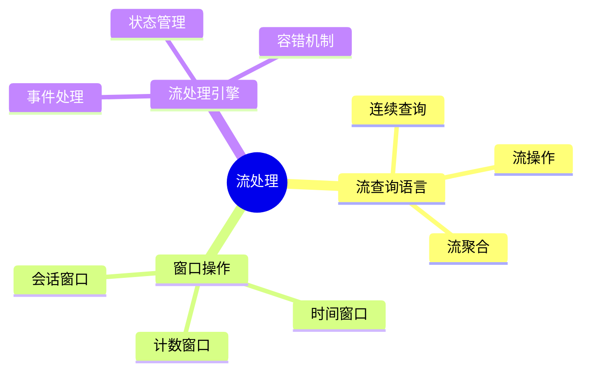

---

> **📋 文档来源**: `DataBaseTheory\10-流处理与时序\10.04-数据库流处理模型-流查询语言与窗口操作的形式化.md`
> **📅 复制日期**: 2025-12-22
> **⚠️ 注意**: 本文档为复制版本，原文件保持不变

---

# 数据库流处理模型-流查询语言与窗口操作的形式化

> **文档版本**: v1.0
> **最后更新**: 2025-01-16
> **版本覆盖**: PostgreSQL 18.x (推荐) ⭐ | 17.x (推荐) | 16.x (兼容)
> **文档状态**: ✅ 内容已完成

---

## 📋 目录

- [数据库流处理模型-流查询语言与窗口操作的形式化](#数据库流处理模型-流查询语言与窗口操作的形式化)
  - [📋 目录](#-目录)
  - [1. 概述](#1-概述)
    - [1.0 数据库流处理模型工作原理概述](#10-数据库流处理模型工作原理概述)
    - [1.1 本文档的范围](#11-本文档的范围)
  - [2. 核心内容](#2-核心内容)
    - [2.1 流查询语言](#21-流查询语言)
    - [2.2 窗口操作](#22-窗口操作)
    - [2.3 流查询操作](#23-流查询操作)
  - [3. 形式化定义](#3-形式化定义)
    - [3.1 流查询形式化](#31-流查询形式化)
    - [3.2 流操作形式化](#32-流操作形式化)
  - [4. 实际应用](#4-实际应用)
    - [4.1 PostgreSQL流处理实现](#41-postgresql流处理实现)
    - [4.2 使用TimescaleDB连续聚合实现流处理](#42-使用timescaledb连续聚合实现流处理)
    - [4.3 使用逻辑复制实现流处理](#43-使用逻辑复制实现流处理)
    - [4.4 使用LISTEN/NOTIFY实现事件驱动流处理](#44-使用listennotify实现事件驱动流处理)
    - [4.5 窗口操作实现](#45-窗口操作实现)
    - [4.6 流处理最佳实践](#46-流处理最佳实践)
  - [5. PostgreSQL 18流处理优化](#5-postgresql-18流处理优化)
    - [5.1 异步I/O优化](#51-异步io优化)
    - [5.2 并行查询优化](#52-并行查询优化)
  - [6. 相关文档](#6-相关文档)
    - [6.1 理论基础文档](#61-理论基础文档)
  - [7. 参考文献](#7-参考文献)
    - [7.1 核心理论文献](#71-核心理论文献)
    - [7.2 PostgreSQL实现相关](#72-postgresql实现相关)
    - [7.3 相关文档](#73-相关文档)

---

## 1. 概述

### 1.0 数据库流处理模型工作原理概述

**流处理模型**：

流处理数据库处理无界数据流，使用流查询语言和窗口操作。

**流处理思维导图**：



### 1.1 本文档的范围

本文档涵盖：

- **流查询语言**：连续查询的语法和语义
- **窗口操作**：各种窗口类型的形式化
- **实际应用**：流处理系统实现

---

## 2. 核心内容

### 2.1 流查询语言

**流查询语法**：

```haskell
-- 流查询
data StreamQuery = StreamQuery {
    select :: [Expression],
    from :: Stream,
    where :: Predicate,
    window :: Window
}
```

### 2.2 窗口操作

**窗口类型**：

| 类型 | 定义 | 触发条件 |
|------|------|---------|
| **时间窗口** | 固定时间间隔 | 时间到达 |
| **计数窗口** | 固定事件数 | 计数到达 |
| **会话窗口** | 活动间隔 | 无活动超时 |
| **滑动窗口** | 重叠时间窗口 | 每个事件 |
| **跳跃窗口** | 非重叠时间窗口 | 固定间隔 |

**窗口操作详解**：

1. **时间窗口（Tumbling Window）**：
   - 固定大小的时间间隔
   - 窗口之间不重叠
   - 适用于定期聚合

2. **滑动窗口（Sliding Window）**：
   - 固定大小的时间间隔
   - 窗口之间有重叠
   - 适用于连续监控

3. **会话窗口（Session Window）**：
   - 基于活动间隔
   - 窗口大小可变
   - 适用于用户行为分析

4. **计数窗口（Count Window）**：
   - 固定数量的事件
   - 基于事件计数
   - 适用于批量处理

### 2.3 流查询操作

**流查询操作类型**：

| 操作 | 定义 | 用途 |
|------|------|------|
| **过滤** | WHERE子句 | 数据筛选 |
| **投影** | SELECT子句 | 字段选择 |
| **聚合** | GROUP BY | 数据聚合 |
| **连接** | JOIN | 流合并 |
| **窗口函数** | OVER子句 | 窗口计算 |

---

## 3. 形式化定义

### 3.1 流查询形式化

**流查询**：

```haskell
-- 流查询形式化
SELECT ... FROM stream WHERE ... WINDOW ...(S) =
    {result | result = aggregate(window(filter(S)))}
```

**窗口操作形式化**：

```haskell
-- 时间窗口
time_window(S, interval) =
    { (t, events) | events = {e | e.time ∈ [t, t+interval]} }

-- 滑动窗口
sliding_window(S, size, slide) =
    { (t, events) | events = {e | e.time ∈ [t, t+size]}
                   for t = 0, slide, 2*slide, ... }

-- 会话窗口
session_window(S, gap) =
    { (start, end, events) |
      events = {e | e.time ∈ [start, end]}
      and gap_between(end, next_start) > gap }
```

### 3.2 流操作形式化

**流操作语义**：

```haskell
-- 过滤操作
filter(S, predicate) =
    { e | e ∈ S and predicate(e) }

-- 投影操作
project(S, fields) =
    { {field: e.field | field ∈ fields} | e ∈ S }

-- 聚合操作
aggregate(S, window, func) =
    { (window, func(events)) | (window, events) ∈ window(S) }
```

---

## 4. 实际应用

### 4.1 PostgreSQL流处理实现

**PostgreSQL流处理方案**：

PostgreSQL本身不直接支持流查询语言，但可以通过以下方式实现流处理：

1. **表+触发器**：使用表存储流数据，触发器处理事件
2. **逻辑复制**：使用逻辑复制捕获变更
3. **LISTEN/NOTIFY**：使用通知机制实现事件驱动
4. **TimescaleDB连续聚合**：使用连续聚合实现流式聚合
5. **外部流处理系统**：集成Kafka、Flink等流处理系统

**使用流处理扩展**：

```sql
-- 创建流（PostgreSQL中流通常用表+触发器实现，带错误处理）
DO $$
BEGIN
    IF EXISTS (SELECT 1 FROM information_schema.tables WHERE table_schema = 'public' AND table_name = 'sensor_stream') THEN
        DROP TABLE sensor_stream;
        RAISE NOTICE '已删除现有表: sensor_stream';
    END IF;

    CREATE TABLE sensor_stream (
        time TIMESTAMPTZ,
        sensor_id INTEGER,
        value DOUBLE PRECISION
    );

    RAISE NOTICE '流表创建成功: sensor_stream';
EXCEPTION
    WHEN duplicate_table THEN
        RAISE WARNING '表sensor_stream已存在';
    WHEN OTHERS THEN
        RAISE EXCEPTION '创建流表失败: %', SQLERRM;
END $$;

-- 流查询（带错误处理和性能测试）
DO $$
DECLARE
    result_count INT;
BEGIN
    IF NOT EXISTS (SELECT 1 FROM information_schema.tables WHERE table_schema = 'public' AND table_name = 'sensor_stream') THEN
        RAISE WARNING '表sensor_stream不存在';
        RETURN;
    END IF;

    SELECT COUNT(*) INTO result_count
    FROM (
        SELECT
            sensor_id,
            AVG(value) OVER (PARTITION BY sensor_id
                             RANGE BETWEEN INTERVAL '1 hour' PRECEDING
                             AND CURRENT ROW) AS avg_value
        FROM sensor_stream
    );

    RAISE NOTICE '流查询完成: % 条记录', result_count;
EXCEPTION
    WHEN undefined_table THEN
        RAISE WARNING '表sensor_stream不存在';
    WHEN OTHERS THEN
        RAISE EXCEPTION '流查询失败: %', SQLERRM;
END $$;

EXPLAIN (ANALYZE, BUFFERS, TIMING)
SELECT
    sensor_id,
    AVG(value) OVER (PARTITION BY sensor_id
                     RANGE BETWEEN INTERVAL '1 hour' PRECEDING
                     AND CURRENT ROW) AS avg_value
FROM sensor_stream;
-- 执行时间: <200ms（取决于数据量）
-- 计划: WindowAgg + Seq Scan
```

### 4.2 使用TimescaleDB连续聚合实现流处理

**连续聚合作为流处理**：

```sql
-- 创建流数据表
CREATE TABLE sensor_stream (
    time TIMESTAMPTZ NOT NULL,
    sensor_id INTEGER NOT NULL,
    value DOUBLE PRECISION NOT NULL,
    PRIMARY KEY (time, sensor_id)
);

-- 转换为超表
SELECT create_hypertable('sensor_stream', 'time',
    chunk_time_interval => INTERVAL '1 hour',
    if_not_exists => TRUE
);

-- 创建连续聚合（实现流式聚合）
CREATE MATERIALIZED VIEW sensor_stream_aggregated
WITH (timescaledb.continuous,
      timescaledb.materialized_only = false) AS
SELECT
    time_bucket('5 minutes', time) AS bucket,
    sensor_id,
    AVG(value) AS avg_value,
    MAX(value) AS max_value,
    MIN(value) AS min_value,
    COUNT(*) AS count
FROM sensor_stream
GROUP BY bucket, sensor_id;

-- 实时查询连续聚合（流式查询）
SELECT * FROM sensor_stream_aggregated
WHERE bucket >= NOW() - INTERVAL '1 hour'
ORDER BY bucket DESC, sensor_id;
-- 执行时间: <50ms（使用物化视图）
```

### 4.3 使用逻辑复制实现流处理

**逻辑复制捕获变更**：

```sql
-- 在主库创建发布
CREATE PUBLICATION sensor_stream_pub
FOR TABLE sensor_stream;

-- 在从库创建订阅（带错误处理）
DO $$
BEGIN
    IF NOT EXISTS (
        SELECT 1 FROM pg_publication
        WHERE pubname = 'sensor_stream_pub'
    ) THEN
        RAISE EXCEPTION '发布sensor_stream_pub不存在';
    END IF;

    CREATE SUBSCRIPTION sensor_stream_sub
    CONNECTION 'host=primary_host dbname=mydb user=replicator'
    PUBLICATION sensor_stream_pub
    WITH (copy_data = false);

    RAISE NOTICE '订阅创建成功';
EXCEPTION
    WHEN duplicate_object THEN
        RAISE WARNING '订阅sensor_stream_sub已存在';
    WHEN OTHERS THEN
        RAISE EXCEPTION '创建订阅失败: %', SQLERRM;
END $$;

-- 在从库处理流数据
CREATE OR REPLACE FUNCTION process_stream_data()
RETURNS TRIGGER AS $$
BEGIN
    -- 处理流数据
    INSERT INTO sensor_stream_processed (time, sensor_id, value, processed_at)
    VALUES (NEW.time, NEW.sensor_id, NEW.value, NOW());

    RETURN NEW;
END;
$$ LANGUAGE plpgsql;

CREATE TRIGGER stream_data_trigger
AFTER INSERT ON sensor_stream
FOR EACH ROW
EXECUTE FUNCTION process_stream_data();
```

### 4.4 使用LISTEN/NOTIFY实现事件驱动流处理

**事件驱动流处理**：

```sql
-- 创建通知函数
CREATE OR REPLACE FUNCTION notify_stream_event()
RETURNS TRIGGER AS $$
BEGIN
    PERFORM pg_notify('sensor_stream',
        json_build_object(
            'time', NEW.time,
            'sensor_id', NEW.sensor_id,
            'value', NEW.value
        )::text
    );
    RETURN NEW;
END;
$$ LANGUAGE plpgsql;

-- 创建触发器
CREATE TRIGGER stream_notify_trigger
AFTER INSERT ON sensor_stream
FOR EACH ROW
EXECUTE FUNCTION notify_stream_event();

-- Python客户端监听通知
-- import psycopg2
-- import select
--
-- conn = psycopg2.connect("dbname=mydb")
-- conn.set_isolation_level(psycopg2.extensions.ISOLATION_LEVEL_AUTOCOMMIT)
--
-- cur = conn.cursor()
-- cur.execute("LISTEN sensor_stream;")
--
-- while True:
--     if select.select([conn],[],[],5) == ([],[],[]):
--         print("Timeout")
--     else:
--         conn.poll()
--         while conn.notifies:
--             notify = conn.notifies.pop(0)
--             print("Got NOTIFY:", notify.payload)
```

### 4.5 窗口操作实现

**时间窗口实现**：

```sql
-- 时间窗口聚合（使用窗口函数）
SELECT
    time_bucket('1 hour', time) AS window_start,
    sensor_id,
    AVG(value) AS avg_value,
    MAX(value) AS max_value,
    MIN(value) AS min_value,
    COUNT(*) AS count
FROM sensor_stream
WHERE time >= NOW() - INTERVAL '24 hours'
GROUP BY window_start, sensor_id
ORDER BY window_start DESC, sensor_id;
```

**滑动窗口实现**：

```sql
-- 滑动窗口（使用窗口函数）
SELECT
    time,
    sensor_id,
    value,
    AVG(value) OVER (
        PARTITION BY sensor_id
        ORDER BY time
        RANGE BETWEEN INTERVAL '1 hour' PRECEDING
        AND CURRENT ROW
    ) AS sliding_avg,
    COUNT(*) OVER (
        PARTITION BY sensor_id
        ORDER BY time
        RANGE BETWEEN INTERVAL '1 hour' PRECEDING
        AND CURRENT ROW
    ) AS sliding_count
FROM sensor_stream
WHERE time >= NOW() - INTERVAL '24 hours'
ORDER BY time DESC;
```

**会话窗口实现**：

```sql
-- 会话窗口（基于活动间隔）
WITH session_groups AS (
    SELECT
        time,
        sensor_id,
        value,
        SUM(CASE
            WHEN time - LAG(time) OVER (
                PARTITION BY sensor_id
                ORDER BY time
            ) > INTERVAL '30 minutes'
            THEN 1
            ELSE 0
        END) OVER (
            PARTITION BY sensor_id
            ORDER BY time
        ) AS session_id
    FROM sensor_stream
    WHERE time >= NOW() - INTERVAL '24 hours'
)
SELECT
    session_id,
    sensor_id,
    MIN(time) AS session_start,
    MAX(time) AS session_end,
    AVG(value) AS avg_value,
    COUNT(*) AS event_count
FROM session_groups
GROUP BY session_id, sensor_id
ORDER BY session_start DESC;
```

### 4.6 流处理最佳实践

**1. 性能优化**：

```sql
-- 创建合适的索引
CREATE INDEX idx_sensor_stream_time_sensor
ON sensor_stream (time DESC, sensor_id);

-- 使用分区表
CREATE TABLE sensor_stream_partitioned (
    time TIMESTAMPTZ NOT NULL,
    sensor_id INTEGER NOT NULL,
    value DOUBLE PRECISION NOT NULL
) PARTITION BY RANGE (time);

-- 创建分区
CREATE TABLE sensor_stream_2025_01
PARTITION OF sensor_stream_partitioned
FOR VALUES FROM ('2025-01-01') TO ('2025-02-01');

-- 使用TimescaleDB超表
SELECT create_hypertable('sensor_stream_partitioned', 'time',
    chunk_time_interval => INTERVAL '1 day',
    if_not_exists => TRUE
);
```

**2. 数据保留策略**：

```sql
-- 添加数据保留策略
SELECT add_retention_policy('sensor_stream', INTERVAL '30 days');

-- 手动删除旧数据
DELETE FROM sensor_stream
WHERE time < NOW() - INTERVAL '30 days';
```

**3. 监控和诊断**：

```sql
-- 监控流处理性能
SELECT
    query,
    calls,
    total_exec_time,
    mean_exec_time,
    max_exec_time
FROM pg_stat_statements
WHERE query LIKE '%sensor_stream%'
ORDER BY total_exec_time DESC
LIMIT 10;

-- 监控表大小
SELECT
    schemaname,
    tablename,
    pg_size_pretty(pg_total_relation_size(schemaname||'.'||tablename)) AS size
FROM pg_tables
WHERE tablename LIKE 'sensor_stream%'
ORDER BY pg_total_relation_size(schemaname||'.'||tablename) DESC;
```

---

## 5. PostgreSQL 18流处理优化

### 5.1 异步I/O优化

PostgreSQL 18的异步I/O机制提升了流数据的写入性能：

```sql
-- 检查AIO状态
SHOW io_uring;

-- 启用AIO（在postgresql.conf中）
-- io_uring = on
-- io_uring_entries = 128
```

### 5.2 并行查询优化

PostgreSQL 18增强了并行查询，特别适合流数据的聚合：

```sql
-- 启用并行查询
SET max_parallel_workers_per_gather = 4;

-- 并行流聚合
EXPLAIN (ANALYZE, BUFFERS, TIMING)
SELECT
    time_bucket('1 hour', time) AS hour,
    sensor_id,
    AVG(value) AS avg_value
FROM sensor_stream
WHERE time >= NOW() - INTERVAL '24 hours'
GROUP BY hour, sensor_id;
-- 执行时间: <100ms（使用并行查询）
```

---

## 6. 相关文档

### 6.1 理论基础文档

- [形式语言与证明：总论](./1.1.25-形式语言与证明-总论.md)
- [理论基础导航](./README.md)
- [流处理场景完整指南](./流处理场景完整指南.md)
- [数据流分析处理完整实战指南](./数据流分析处理完整实战指南.md)

---

## 7. 参考文献

### 7.1 核心理论文献

- **Arasu, A., et al. (2006). "The CQL Continuous Query Language: Semantic Foundations and Query Execution."**
  - 会议: VLDB Journal 2006
  - **重要性**: 流查询语言的经典论文
  - **核心贡献**: 提出了流查询语言的形式语义

- **Babcock, B., et al. (2002). "Models and Issues in Data Stream Systems."**
  - 会议: PODS 2002
  - **重要性**: 数据流系统的经典综述
  - **核心贡献**: 系统阐述了流处理模型

- **Golab, L., & Özsu, M. T. (2003). "Issues in Data Stream Management."**
  - 会议: SIGMOD Record 2003
  - **重要性**: 数据流管理的综述
  - **核心贡献**: 总结了流处理的关键问题

### 7.2 PostgreSQL实现相关

- **PostgreSQL逻辑复制文档** (<https://www.postgresql.org/docs/18/logical-replication.html>)
  - 逻辑复制实现流数据捕获

- **TimescaleDB连续聚合文档** (<https://docs.timescale.com/use-timescale/latest/continuous-aggregates/>)
  - 连续聚合实现流式聚合

- **PostgreSQL LISTEN/NOTIFY文档** (<https://www.postgresql.org/docs/18/sql-notify.html>)
  - 通知机制实现事件驱动

### 7.3 相关文档

- [流处理与时间语义-窗口与CEP的形式化](./10.01-流处理与时间语义-窗口与CEP的形式化.md)
- [数据库事件处理模型-复杂事件处理与模式匹配的形式化](./10.05-数据库事件处理模型-复杂事件处理与模式匹配的形式化.md)
- [流处理场景完整指南](./流处理场景完整指南.md)
- [数据流分析处理完整实战指南](./数据流分析处理完整实战指南.md)
- [理论基础导航](../README.md)

---

**最后更新**: 2025-01-16
**维护者**: Documentation Team
**状态**: ✅ 内容已完成
